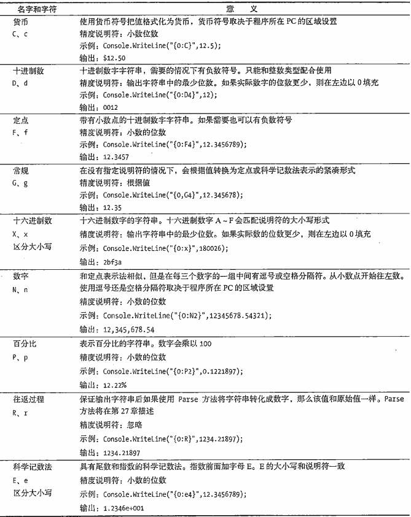
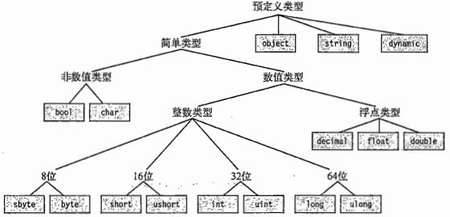
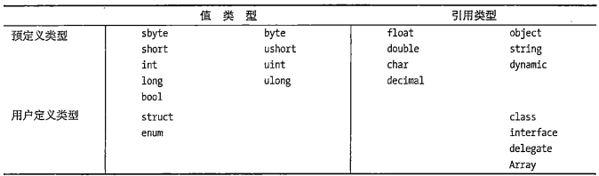
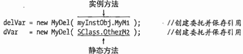
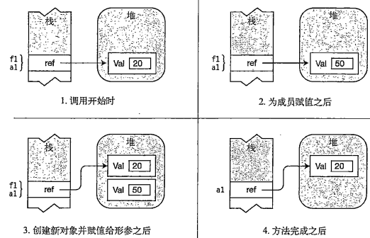

## 1. .NET框架

### 1.1 .NET组成

组成一：

1. 编程工具
2. CLR：Common Language Runtime，公共语言运行库——执行环境。
3. BCL：Base Class Library，基类库。

组成二：

1. CLR：Common Language Runtime，公共语言运行库——执行环境。
2. FCL：基类库，Framework Class Library。
    - FCL是BCL的超集。

### 1.2 源码执行过程

1. 源码→程序集1
    1. 程序集特点：可执行，或为dll。
    2. 程序集语言：CIL（Common Intermediate Languange），公共中间语言。
    3. 程序集内容：
        - CIL
        - 类型元数据
        - 对其他程序集引用的元数据。
2. CIL→本机代码

## 2. C#基本语法规则

### 2.1 标识符

1. 数字不能开头。
2. @只能放开头，但不建议使用。

### 2.2 关键字

关键字：


上下文关键字：


- 上下文关键字仅在特定的语言结构中充当关键字的标识符。
- 关键字不能被用作标识符，上下文关键字可以在代码的其他部分用作标识符。

### 2.3 Main方法

1. Main方法是所有C#程序的入口。
2. Main首字母大写。

### 2.4 空白

1. 空白指没有可视化输出。
2. 空白编译时忽略。
3. 空白增加可读性。
4. 分类：
    - 空格
    - 制表符
    - 换行符
    - 回车符

### 2.5 语句

1. 含义：描述一个类型或告诉程序执行某个动作的源代码指令。
2. 简单语句：以`;`结束。
3. 块：由一对`{}`包裹的0条或多条简单语句。
    - 在语法上相当于一条一句。
    - 块末尾的大括号不需要`;`

### 2.6 输出

BCL提供一个System命名空间的Console类，包含了输入和输出到控制台的方法。

#### 2.6.1 Write

1. 不换行输出。
2. 字符串使用双引号包裹。

#### 2.6.2 WriteLine

1. 换行输出。
2. 其他同Write

#### 2.6.3 格式字符串

Write和WriteLne输出多个参数时：

1. 语法：`Console.WriteLine("格式字符串{0}格式字符串{1}",替换值0,替换值1);`
2. 参数间使用逗号分隔。
3. 第一个参数必须是字符串，成为格式字符串。格式字符串包含替代标记。
    - 替代标记由一个整数及大括号组成，整数代表替换值的位置。
    - 替代标记的整数从0开始。
4. C#6.0引入字符串插值方法：

    ```c#
    int var1 = 3;
    int var2 = 6;
    Console.WriteLine($"Two Sample integers are {var1} and {var2}");
    ```

#### 2.6.4 多重标记和值

1. 替代标记位置和数量任意。
    - 
2. 替代标记的整数值不能超过替换值的数量。
    - 不会产生编译错误。
    - 会产生运行时错误（异常）。
    - 

#### 2.6.5 格式化数字字符串

1. 对齐：
    1. 格式字符串语法：`{index,alignment}`
    2. alignment正数表示右对齐，负数表示左对齐。
        - alignment小于字符串的长度，则对齐忽略
2. 格式化：
    1. 语法：`{index:format}`
        - `:`和format之间不能有空格。
    2. format：
        - 
3. 对齐和格式化可以一起用，格式为：`{index,alignment:format}`

### 2.7 注释


## 3. 类型、存储和变量

1. C#程序是一组类型声明。
    1. C程序是一组函数和数据类型。
    2. C++程序是一组函数和类。
2. 类型是一种模板。组成：
    1. 名称
    2. 数据结构
    3. 一些行为和约束条件
3. 实例化类型：从某个类型模板创建的实际对象，成为实例化类型。
4. 数据成员和函数成员。
    1. 非简单类型可以包含不同类型的数据项，这些数据项个体称为成员。
    2. 数据成员：保存了与这个类的对象或整个类相关的数据。
    3. 函数成员：执行代码。dinginess类型行为。
5. 预定义类型：
    1. 
    2. 共16种，包含11种数值类型，1种unicode字符类型，1种bool类型，3种非简单类型：
        - string，unicode字符数组
        - object，所有其他类型的基类
        - dynamic，使用动态语言编写的程序集使用。
    3. 预定义类型的类型名称均为小写字母
    4. C#的类型名称底层映射到.net的类型名称，二者语法互相符合，但不建议使用.net的语法代替C#语法。
    5. 预定义简单类型：
        - 
    6. 预定义非简单类型：
        - 
6. 用户自定义类型：
    1. 类类型：class
    2. 结构类型：struct
    3. 数组类型：array
    4. 枚举类型：enum
    5. 委托类型：delegate
    6. 接口类型：interface
7. 类型的分类：
    1. 值类型：数据存放在栈内存中，存储实际的数据。
    2. 引用类型：第一段数据，存放在堆内存中，存储实际的数据；第二段引用，存放指向数据在堆内存中的地址，在栈中。
        - 引用类型对象的成员：
            1. 数据部分始终存放在堆内存中。
            2. 值类型或引用类型的引用部分可能存放在堆中，也可能在栈中。
            3. 
    3. 
8. 变量：
    1. 分类：
        - 
    2. 默认初始化：
        |变量类型|存储位置|自动初始化|用途|
        |--|--|--|--|
        |局部变量|栈或栈和堆|否|用于函数成员内部的局部计算|
        |类字段|堆|是|类的成员|
        |结构字段|栈或堆|是|结构的成员|
        |参数|栈|否|用于把值传入或传出|
        |数组元素|堆|是|数组的成员|
    3. 多变量声明：使用逗号分隔，类型必须一致，可以包含初始化语句。
        - 如：`double var1=2.5,var2;`
9. dynamic关键字：
    1. .net的一些程序集是动态语言编写的，而c#是静态语言，为了让C#能够使用这些程序集，并且在编译时解析类型，C#引入了dynamic关键字。
    2. dynamic类型的变量编译时不会进行类型检查，运行时会进行类型检查。
10. 可空类型：
    1. 作用：表示变量未存储有效值。
    2. 引用类型：将值赋为null，即可表示可空类型。
    3. 普通的值类型称为非可空类型。

## 4. 类的基本概念

### 4.1 类的概念

1. 定义：
    1. 类是程序的数据和功能被组织为逻辑上相关的数据项和函数的封装集合。
    2. 类是一个能存储数据并执行代码的数据结构。
2. 组成：
    1. 数据成员
    2. 函数成员
3. 成员的类型：
    1. 

### 4.2 声明类、创建类

1. 声明类并不创建类的实例，只创建用于创建实例的模板。
2. 组成：
    1. 类名
    2. 类成员
    3. 类特征：如关键字class
3. 声明类：即定义一个类。
4. 创建类（为类类型的变量分配内存）：使用new关键字。

### 4.3 类成员



1. 类成员有很多，最重要的为字段和方法，一个为数据成员，一个为函数成员。

按照另外一个分法：类成员可以分为：

- 实例成员：成员关联到类的一个实例。
- 静态成员：成员关联到整个类，即所有实例。
    1. 使用static修饰
    2. 使用类名访问
    3. 也可以使用`using static`

    ```c#
    using static System.Console
    ……
    WriteLine("")

    // 等价于：
    using System
    ……
    Console.WriteLine("")
    ```

#### 4.3.1 字段

1. 字段是一种变量，只能声明在类内部。
2. 字段可以显式初始化，也可以隐式初始化。隐式初始化时，字段值会被编译器设置为默认值，默认值由字段类型决定。

#### 4.3.2 方法

1. 概念：具有名称的可执行代码块。
2. 组成：
    1. 方法头：
        1. 返回类型
        2. 名称
        3. 参数列表
    2. 方法体：
        1. 局部变量
        2. 控制流结构
        3. 方法调用
        4. 内嵌的块
        5. 其他方法：成为局部函数
3. 静态方法：使用static修饰符声明的方法
    1. 不能访问实例成员，可以访问其他静态成员。

#### 4.3.3 属性

```c#
class C1{
    private int theRealValue;   //字段，分配内存
    public int MyValue{         //属性，未分配内存
        set{
            theRealValue = value;
        }
        get{
            return theRealValue;
        }
    }
}
// c#7.0
class C1{
    private int theRealValue;   //字段，分配内存
    public int MyValue{         //属性，未分配内存
        set => value;
        get => theRealValue
    }
}
```

1. 写入属性：`MyValue = 5;`赋值：隐式调用set方法。
2. 读取属性：`z = MyValue;`表达式：隐式调用get方法。
3. 不能显式调用访问器（get和set）会编译报错：
    1. `y = MyValue.get()`
    2. `MyValue.set(5)`
4. 属性和关联字段：通常类中会使用private声明字段，使用public声明属性，该属性用于操作private声明的字段。
    1. 名称约定方式一：

    ```c#
    private int firstField;
    public int FirstField{}
    ```

    2. 名称约定方式二：

    ```c#
    private int _secondField;
    public int SecondField{}
    ```

5. 只有get称为只读属性，只有set称为只写属性。set和get必须定义一个，否则会编译报错。
6. 计算只读属性;
    1. 属性只有get
    2. 属性没有与之唯一对应的字段。
7. 自动实现属性：由于通常属性与字段一一对应，为了简化编码，C#提供自动实现属性（自动属性），只用声明属性，而不用声明字段，编译器会自动创建字段并与属性进行挂接。
    1. 自动属性的get和set不能有方法体。

#### 4.3.4 实例构造函数


### 4.4 访问修饰符

1. 作用：指明程序的其他部分如何访问成员。
2. 分类：
    1. 私有的——private
        - 只能从声明它的类的内部访问，其他类看不见或不可访问。
        - 默认不写即为私有。
    2. 公有——public
    3. 受保护——proctected
    4. 内部——internal
    5. 受保护内部——protected internal

### 4.5 static修饰符


打勾的可以声明为static类型。

## 5. 方法

方法的特性适用于类、struct。

### 5.1 方法体成员

#### 5.1.1 局部变量

1. 字段通常保存和对象状态有关的数据。
2. 局部变量经常用于保存局部或临时的计算数据。
3. 关键字var：
    1. 只能用于局部变量，不能用于字段。
    2. 声明变量时必须同时初始化。
    3. 编译器推断出变量的类型，之后不能更改。
4. 局部变量的生命周期只作用于最小的块单元。
5. 局部常量：
    1. 声明：`const Type Identifier = value;`
    2. 声明时必须初始化。
    3. 声明后值不能改变。


#### 5.1.2 控制流

同流程控制。

#### 5.1.3 方法调用

在方法体内调用其他方法。

#### 5.1.4 内嵌的块

无特别情况。

#### 5.1.5 局部函数

C#7.0开始，可以在一个方法中声明另一个单独的方法。同时该方法只能在声明它的方法内部调用。

### 5.2 方法头成员

#### 5.2.1 参数列表

##### 5.2.1.1 形参

形参是局部变量，声明在参数列表中，而不是方法体中。

##### 5.2.1.2 实参

1. 用于初始化形参的表达式或变量。
2. 实参类型必须与形参类型想匹配，或实参类型可以隐式转换为形参类型。

##### 5.2.1.3 值参数

1. 值参数：实参的值复制给形参。
    1. 值类型的形参：复制数据。形参和实参数据独立。
    2. 引用类型的形参：复制引用。形参和实参引用独立，但数据公用。
    3. 
2. 在栈中为形参分配空间。
3. 值参数的实参可以是变量，也可以是计算成相应数据类型的表达式。

##### 5.2.1.4 引用参数

1. 方法声明和调用都使用ref修饰符。
2. 实参必须是变量。且该变量在用作实参前必须被赋值。
3. 引用参数不会在栈中为形参分配空间。
    1. 引用参数的形参与实参指向相同的位置。即不论是值类型还是引用类型，形参改变实参随之改变。
    2. 
4. 值参数、引用参数对比：
    1. 值类型：值参数形参和实参相互独立，二者数据互不影响；引用参数实参和形参栈中是同一块地址，二者数据保持一致。
    2. 引用类型：
        - 值参数形参和实参栈中的地址独立，但指向的数据地址一致，方法完成调用后，形参和形参指向的对象销毁；
        - 
        - 引用参数实参和形参在栈中是同一块地址，调用完成形参销毁、实参指向的原始对象销毁、实参指向新的对象。
        - 

##### 5.2.1.5 输出参数

1. 用于把数据从方法体内传出到调用代码。
2. 方法声明和调用都必须使用out修饰符。
3. 实参必须是变量。
4. 输出参数不会在栈中为形参分配空间（同引用参数）。
    1. 
5. 与引用参数的不同：
    1. 引用参数的实参在调用前，必须初始化。
    2. 输出参数在调用时，在方法体内初始化实参。

##### 5.2.1.6 参数数组

1. 参数数组允许有0个或多个实参对应一个特定的形参。
2. 一个参数列表最多只能有一个参数数组。
3. 参数数组必须放在参数列表的最后。
4. 参数数组的数据类型必须一致。
5. 参数数组在声明时使用params修饰符，数据类型后使用`[]`
6. 调用参数数组：
    1. 一个逗号分隔该数据类型的元素列表：`ListInt(10, 20, 30)`
        - 参数数组元素是值类型：值被复制，实参在方法内部不受影响。
        - 参数数组元素是引用类型：引用被复制，实参引用的对象在方法内受影响。
        - 
    2. 一个一维数组：`ListInt(intArray)`
        - 参数数组元素不论是值类型还是引用类型，实参均在方法体内受影响。

##### 5.2.1.7 参数类型总结


##### 5.2.1.8 命名参数

1. 调用方法时，形参名称后面跟冒号和实际的参数值或表达式。
2. 可以同时使用位置参数和命名参数，但所有的位置参数必须先列出。

##### 5.2.1.9 可选参数

1. 调用方法是可以包含整个参数，也可以省略该参数。
2. 值参数需要在声明时赋予默认值。
3. 只有值类型的参数和默认值为null的引用类型才能作为可选参数。
    1. 即默认值不确定不能作为可选参数
    2. 其他类型不能作为可选参数：
        - 
4. 方法声明时：必填参数在前，可选参数在中，参数数组在后。

### 5.3 ref局部变量和ref返回

#### 5.3.1 ref局部变量

1. 语法：`ref int y = ref x;`
2. 规则：
    1. 不论是值类型还是引用类型，二者的数据共同发生变化。
    2. ref局部变量只能被赋值一次。

#### 5.3.2 ref返回

1. 语法：
    1. 
2. 规则:
    1. 返回类型为void的方法不能使用ref
    2. ref return不能返回如下内容：
        - 空值
        - 常量
        - 枚举成员
        - 类或结构体的属性
        - 指向只读位置的指针
    3. ref retrn表达式只能指向原先就在调用域内的位置或者字段。即不能指向方法的局部变量。
        - *不明白，如果指向是方法的形参呢，形参不是局部变量吗？*
    4. 声明为ref返回的方法，调用时可以不用ref关键字，但此时值传递为普通方法。

### 5.4 方法重载

1. 同一个类中方法名称相同，但其他方法签名不同。
2. 方法签名：
    1. 方法名称
    2. 参数数量
    3. 参数数据类型及顺序
    4. 参数修饰符。
3. 方法返回值类型不是方法签名。
4. 仅方法返回值类型不同的方法会便宜报错
    1. 

### 5.5 栈帧

1. 保存和方法关联的一些数据项：
    1. 返回地址：方法退出后继续执行的位置
    2. 分配内存的参数：值参数或参数数组
    3. 和方法调用相关的其他管理数据项。

### 5.6 递归

1. 方法自己调用自己。
