*概述：2023年8月29日，西咸切片工厂线单耗盘点发现耗用完钢线未进行尾刀平衡计算，与MES逻辑不符，本文记述了尾刀平衡异常问题的排查处置过程，仅供参考。*

## 尾刀平衡介绍

钢线在耗用完时，需要在切片机台上点击【耗用完】按钮，MES监控到该信号后：

1. 将钢线状态更新为”耗用完“；
2. 剩余长度更新为0km；
3. 查找使用该钢线的最后一个随工单，重新计算钢线用线量，计算逻辑为：钢线总长度 - Σ除最后一刀随工单钢线用量。

**以上逻辑在同一个方法中执行，本次异常为，步骤1和步骤2执行成功，步骤3也执行成功（SOS无报错日志），但数据未进数据库**

## 排查过程

### 搭建帆软报表监控

为了能够及时发现”耗用完“的钢线没有进行尾刀平衡计算，开发了帆软报表，并创建定时器进行监控。

1. 编写报表sql：

```sql
-- 1. 查询耗用完但没有进行尾刀平衡的钢线
SELECT
	aod1.UP_STEELWIRE_NUMBER_S ,
	aod1.SERIAL_NUMBER_S ,
	aol.START_TIME_T ,
	aol.START_COMMENT_S ,
	aol.COMPLETE_TIME_T ,
	aol.COMPLETE_COMMENT_S ,
	aod1.LAST_STOPLINE_STORAGE_F ,
	aod1.THIS_STOPLINE_STORGE_F ,
	aod1.CREATION_TIME ,
	aod1.IS_LAST_Y,
	aod2.sss,
	aod3.LINELENGTH_S_F,
	aol.EQUIP_NAME_S ,
	nvl2(aod1.IS_LAST_Y,'是','否'),
	decode(aod1.UP_STEELWIRE_NUMBER_S,aod1.DOWNSTEELWIRE_NUMBER_S,'否','是')
FROM
	AT_OM_DATACOLLECTION aod1
INNER JOIN (
		SELECT
			MAX(CREATION_TIME) ss,
			UP_STEELWIRE_NUMBER_S,
			sum(aod.STEELWIRE_ACT_AMOUNT_F  )sss
		FROM
			AT_OM_DATACOLLECTION aod
		GROUP BY
			UP_STEELWIRE_NUMBER_S
	) aod2 ON
	aod1.CREATION_TIME  = aod2.ss
LEFT JOIN AT_OM_DIAMONDLINE aod3 ON aod1.UP_STEELWIRE_NUMBER_S = aod3.SPOOL_NO_S 
LEFT JOIN AT_OM_LOTHISTORY aol ON aod1.SERIAL_NUMBER_S = aol.SERIAL_NUMBER_S AND aol.OP_NAME_S ='section'
WHERE ((aod3.STATUS_I = 40 AND abs(aod3.LINELENGTH_S_F - aod2.sss) >2 ) OR (aod3.STATUS_I = 40 AND aod1.IS_LAST_Y IS NULL ))
AND aod1.CREATION_TIME >=  trunc(SYSDATE)
ORDER BY aod1.CREATION_TIME DESC ;

-- 2. 查询钢线最后上下机时间
SELECT
	SPOOL_NO_S ,
	max(USE_DATE_T) ,
	max(COMPLETE_DATE_T) 
FROM
	XXQPMES.AT_OM_DIAMONDLINEJUDGE aod
GROUP BY SPOOL_NO_S 
ORDER BY
	max(CREATION_TIME) DESC;

-- 3. 统计sql1查询的结果数（作为帆软报表定时调度的触发条件）
SELECT
	count(1)
FROM
	(
		SELECT
		aod1.UP_STEELWIRE_NUMBER_S ,
		aod1.SERIAL_NUMBER_S ,
		aol.START_TIME_T ,
		aol.START_COMMENT_S ,
		aol.COMPLETE_TIME_T ,
		aol.COMPLETE_COMMENT_S ,
		aod1.LAST_STOPLINE_STORAGE_F ,
		aod1.THIS_STOPLINE_STORGE_F ,
		aod1.CREATION_TIME ,
		aod1.IS_LAST_Y,
		aod2.sss,
		aod3.LINELENGTH_S_F,
		aol.EQUIP_NAME_S ,
		nvl2(aod1.IS_LAST_Y,'是','否'),
		decode(aod1.UP_STEELWIRE_NUMBER_S,aod1.DOWNSTEELWIRE_NUMBER_S,'否','是')
	FROM
		AT_OM_DATACOLLECTION aod1
	INNER JOIN (
			SELECT
				MAX(CREATION_TIME) ss,
				UP_STEELWIRE_NUMBER_S,
				sum(aod.STEELWIRE_ACT_AMOUNT_F  )sss
			FROM
				AT_OM_DATACOLLECTION aod
			GROUP BY
				UP_STEELWIRE_NUMBER_S
		) aod2 ON
		aod1.CREATION_TIME  = aod2.ss
	LEFT JOIN AT_OM_DIAMONDLINE aod3 ON aod1.UP_STEELWIRE_NUMBER_S = aod3.SPOOL_NO_S 
	LEFT JOIN AT_OM_LOTHISTORY aol ON aod1.SERIAL_NUMBER_S = aol.SERIAL_NUMBER_S AND aol.OP_NAME_S ='section'
	WHERE ((aod3.STATUS_I = 40 AND abs(aod3.LINELENGTH_S_F - aod2.sss) >2 ) OR (aod3.STATUS_I = 40 AND aod1.IS_LAST_Y IS NULL ))
	AND aod1.CREATION_TIME >=  trunc(SYSDATE)
	ORDER BY aod1.CREATION_TIME DESC
);
```

sql简要解释：

- inner join的表：从`AT_OM_DATACOLLECTION`表中查找最后一刀随工单。
- where条件：
	- `abs(aod3.LINELENGTH_S_F - aod2.sss) >2`：钢线总长度 - Σ所有随工单钢线用线量 >2
	- `aod3.STATUS_I = 40 AND aod1.IS_LAST_Y IS NULL`：`IS_LAST_Y`是尾刀平衡标志位，如果执行了尾刀平衡逻辑，该字段值为1。

2. 开发帆软报表

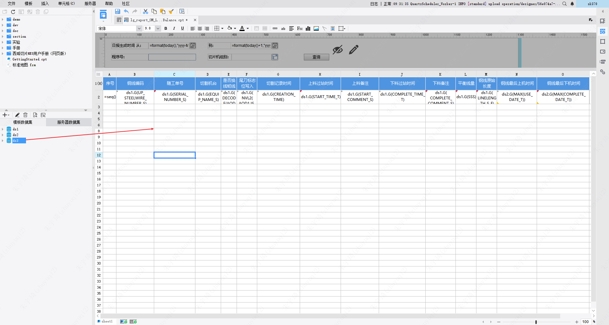

*这里隐藏了统计结果数sql的展示。*

3. 创建定时调度任务

核心设置（触发查询）为：

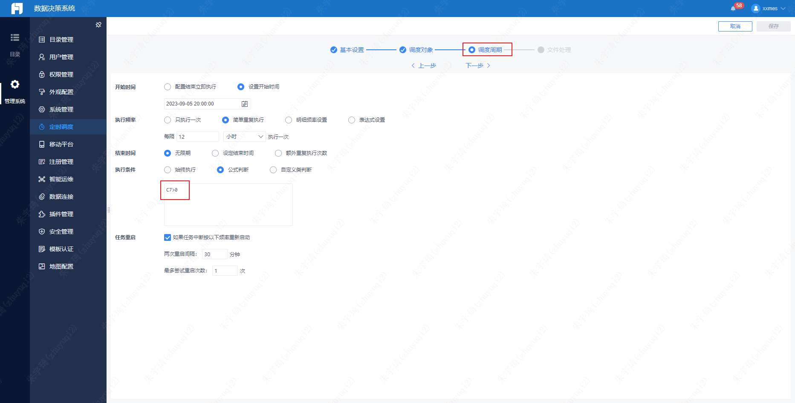

### SOS添加日志

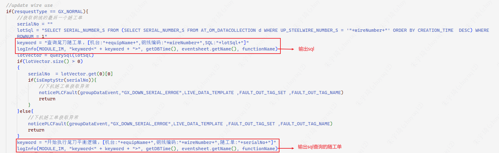

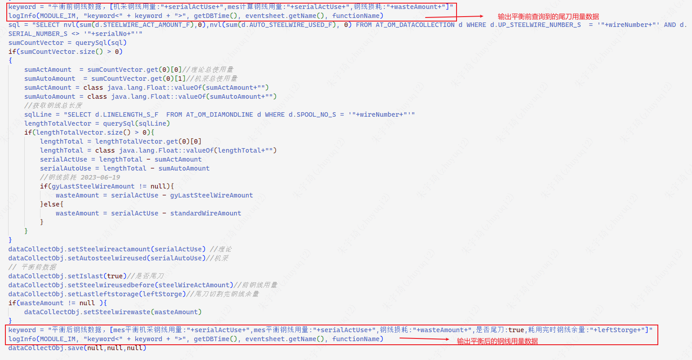

### 数据分析

9月5日监控到数据如下：

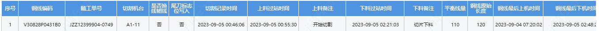

1. 查询SOS服务日志：

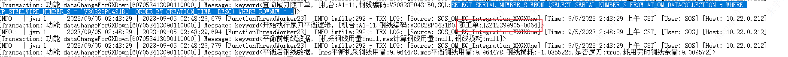

**发现sql查询到的随工单与监控到的尾刀随工单号不一致。

2. 使用SOS服务日志中的sql，执行查询：

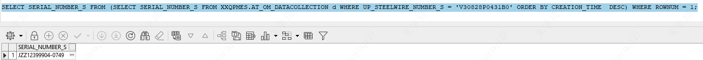

**发现查询到的就是帆软监控到的随工单，而不是SOS服务日志中的随工单。**

3. 查询SOS服务日志中的随工单切割时间：

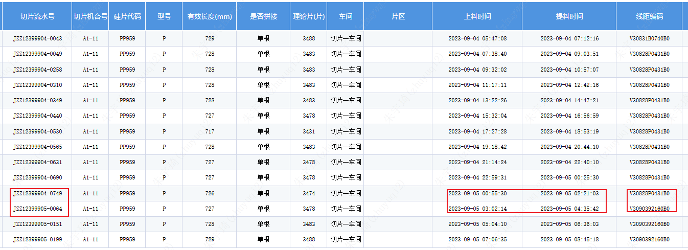

**发现是该机台切割的下一个随工单，使用的钢线也是另一卷钢线。**

**至此，可以发现执行SOS代码时，查询到的随工单是下一刀的。该随工单从AT_OM_DataCollection中查到，要能通过钢线查到随工单，说明做过【切片上料】操作。而后来随工单的钢线变了，说明重复进行过【切片上料】操作，导致旧数据覆盖。**

4. 继续查询SOS服务日志：

第一次上料：

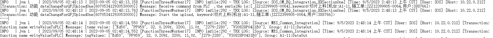

第二次上料：

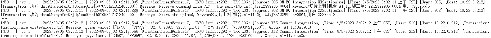

5. 核对上料检验逻辑：

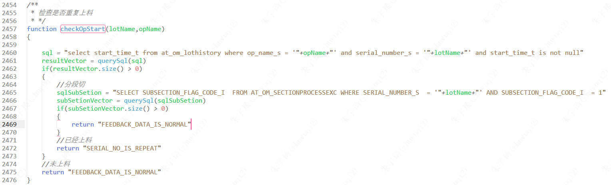

**发现重复上料校验使用过站记录校验，而不是上料请求。**

## 总结

根据数据分析，梳理操作过程如下：

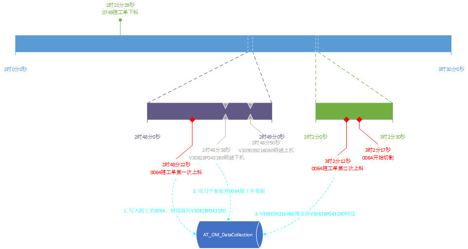


## 解决措施

修改重复上料校验逻辑，通过`AT_OM_DATACOLLECTION`有无上料请求校验：

```java
/**      
 *插片重复上料校验   
 * */
function checkOpStartOfClean(lotName,opName)
{
    
    // sql = "select start_time_t from at_om_lothistory where op_name_s = '"+opName+"' and serial_number_s = '"+lotName+"' and start_time_t is not null"//旧校验逻辑
    sql = "SELECT SECTION_REQUEST_TIME_T FROM AT_OM_DATACOLLECTION WHERE SERIAL_NUMBER_S ='" + lotName + "' AND SECTION_REQUEST_TIME_T IS NOT NULL "//新校验逻辑
    resultVector = querySql(sql)
    if(resultVector.size() > 0)
    {
        //已经上料
        return "CP_SERIAL_REPEAT"
    }
    //未上料
    return "FEEDBACK_DATA_IS_NORMAL" 
}
```

