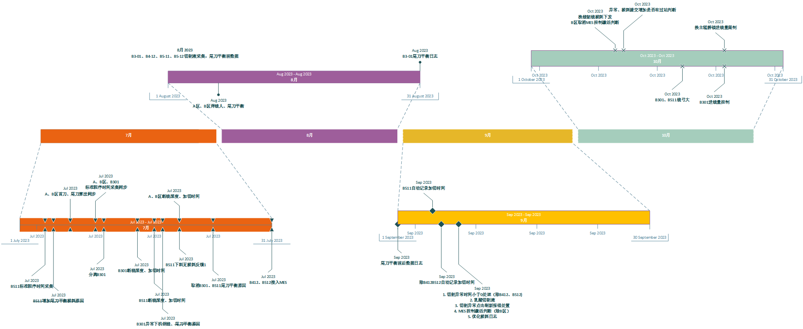
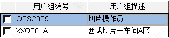
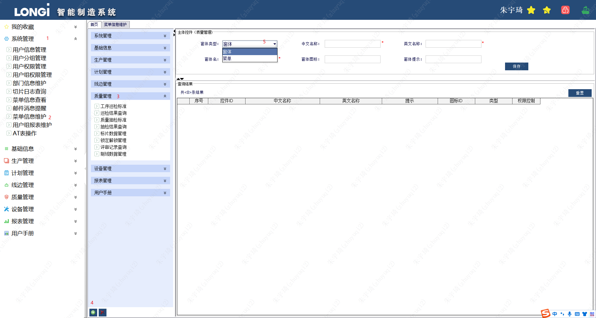
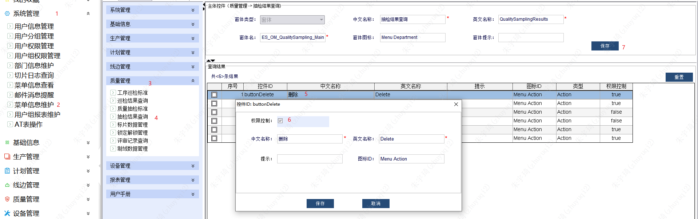
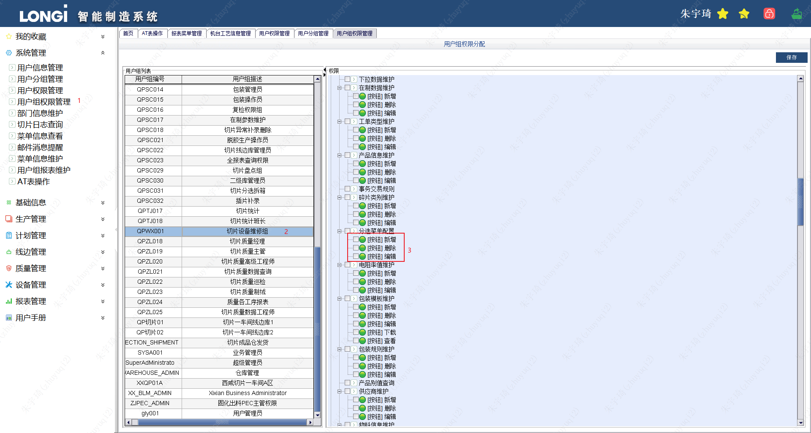
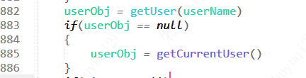
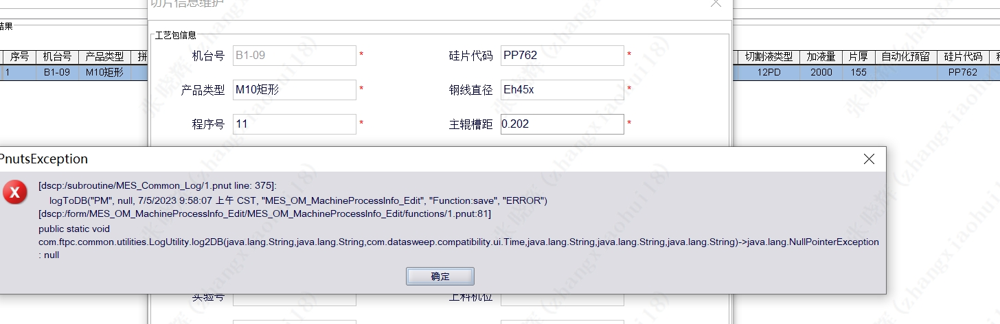

## 服务部署

- A区切片机数据采集服务：10.22.0.212（SOS)
- B区切片机数据采集服务：10.22.0.211（SOS)
- 脱胶机数据采集服务：10.22.0.239（SOS）
- 切片机数据采集服务：10.22.0.239（SOS）
- 插片机工时采集服务：10.22.0.239（Spring Boot）
- 切片机洗机器数据采集服务：10.22.0.239（Spring Boot）
- 异常下机钢线自动评审服务：10.22.0.233（SOS）
## 服务发布

- B区编号带12的切片机由于机台程序不支持，很多MES功能没有，但它们与其他机台共享TagSet点位，因此其他片区新增功能时，**可以不写代码，但要在kepserver增加替代点位**。
- B301发布了线弓大、进线量控制功能，因此在tagset和B3-01的kepserver中增加了点位，但其他机台的kepserver没有添加，所以**不能直接重启其他片区和机台的SOS服务**。
	- 发布措施一：给其他机台的kepserver加上加切、进线量控制点位，然后重启。
	- 发布措施二：删掉tagset的加切、进线量控制点位，然后重启。
	- 注：B511机台发布了线弓大功能。
- 换主辊解锁进线量控制服务已发布，并覆盖了所有机台，但进线量控制锁定只有B301机台发布了服务，后续排查问题需注意。
- 切片机洗机器服务已发布，kepserver的点位也添加了，但部分机台程序还没有更新，**设备刷机后，需要重启服务才能生效**。
- B301和B511机台钢线下机代码有收集异常下机钢线到diamondexception表的代码，其他机台没有。此功能不涉及tagset、kepserver点位。



## 用户管理

### 添加用户

1. MES的用户是从MDM系统通过过来的，对于新用户，不需要添加用户信息，但是需要维护用户部门，否则在【用户权限管理】界面看不到。

### 用户权限

- 切片操作工：
  - 

实际上现场操作工没有MES，这个权限都是开给班长。但是也得注意个别员工有MES的情况。

## 使用问题

### 并发修改异常

问题表现：机台工艺信息管理，同开启两个客户端操作同一条记录，保存时会产生两条记录。

问题原因：代码中使用了先删除当前选中记录，再插入一条新记录的原因。

```java
function save()
{
    OldMpInfo = getFormProperty("SELECTED_OBJ")
    if(OldMpInfo==null)
    {
        return
    }    
    oldValueMap = getOldValueMap(OldMpInfo)
    response = deleteATObject(OldMpInfo,null,null,null)
    if(response.isError())
    {
        dialogError("修改失败")
        return
    }

    response = deleteATObject(OldMpInfo,null,null,null)
    if(response.isError())
    {
        dialogError("修改失败")
        return
    }
    
	equipmentID = editEuipmentid.getText()
    
	……   

    mpInfo = MESOMMachineProcessInfo()
    mpInfo.set……  
    response = saveATObject(mpInfo,null,null,null)
}
```

解决措施：
方案1：将删除变为先查询机台号的数据，然后删除查询出的对象，而不是选中的对象`OldMpInfo`。
方案2：保存时，先查询，查询未null，新建`MESOMMachineProcessInfo`对象。

## 添加新Form

1. 生产环境PD导入新Form。
2. so界面进入 菜单信息维护 ，添加新界面
	- 
3. 如果需要设置权限，则关闭SO界面，重新进入 菜单信息维护界面
	- 
4. 关闭SO界面，进入用户组权限管理，给需要查看/编辑权限的用户组添加功能。
	- 
5. 也可以针对单独的用户添加权限：

## SOS用户

MES上下料时，未填写上下料人员，记录过站时会写入SOS



## AT表与8个类字段必须一致

当8个类的字段比AT表字段多时，会报如下错误：



原因分析：

1. 首先，创建这个对象时，使用的是8个类，8个类包含了多余的字段。
2. 其次，使用保存方法`save(null,null,null)`时，由于AT表没有字段，导致报错。

## 帆软报表

### MES报表

1. [碎片转型工单状态查询报表](http://10.22.0.231:8090/webroot/decision/view/report?viewlet=production/section/lg_report_OM_debrisQuery.cpt)
2. [特采晶编操作记录](http://10.22.0.231:8090/webroot/decision/view/report?viewlet=production/section/lg_report_OM_SiliconRodsOperateRecord.cpt)
3. [返洗返工随工单查询](http://10.22.0.231:8090/webroot/decision/view/report?viewlet=production/section/lg_report_OM_ReworkOrderInfo.cpt)
4. [干插机明细报表](http://10.22.0.231:8090/webroot/decision/view/report?viewlet=production/section/lg_report_om_DRYINSERTIONDATA.cpt)
5. [合格片报表](http://10.22.0.231:8090/webroot/decision/view/report?viewlet=production/section/OKCALC.cpt)
6. [粘胶自动化立库在制明细报表](http://10.22.0.231:8090/webroot/decision/view/report?viewlet=production/section/lg_report_WM_Siliconrods_Detail_auto.cpt)
7. [粘胶自动化立库硅棒汇总报表](http://10.22.0.231:8090/webroot/decision/view/report?viewlet=production/section/lg_report_WM_Siliconrods_Collection_auto.cpt)
8. [二次上机钢线使用追溯](http://10.22.0.231:8090/webroot/decision/view/report?viewlet=production/section/lg_report_OM_DiamondlineUsedAfterReview.cpt)
9. [不良品评审查询](http://10.22.0.231:8090/webroot/decision/view/report?viewlet=production/section/lg_report_OM_RejectView.cpt)
10. [Andon历史报表](http://10.22.0.231:8090/webroot/decision/view/report?viewlet=production/section/lg_report_OM_Andon.cpt)
11. [客诉残线报表](http://10.22.0.231:8090/webroot/decision/view/report?viewlet=production/section/lg_report_DiamondLineResidual.cpt)
12. [退料明细查询](http://10.22.0.231:8090/webroot/decision/view/report?viewlet=production/section/lg_report_OM_returnMatList.cpt)
13. [抽检信息汇总报表](http://10.22.0.231:8090/webroot/decision/view/report?viewlet=production/section/spotCheck/lg_report_OM_SpotCheck.cpt)
14. [粘胶自动化报表](http://10.22.0.231:8090/webroot/decision/view/report?viewlet=production/section/lg_report_OM_ViscoseProcess_auto.cpt)
15. [车间钢线盘点查询](http://10.22.0.231:8090/webroot/decision/view/report?viewlet=production/section/lg_report_OM_Diamod_line_shop_inventory.cpt)
16. [磨片碎记录报表](http://10.22.0.231:8090/webroot/decision/view/report?viewlet=production/section/lg_report_OM_AbrasiveRecord.cpt)
17. [退料单查询打印-新](http://10.22.0.231:8090/webroot/decision/view/report?viewlet=production/section/lg_report_WM_ReturnMaterialsList_tmp.cpt)
18. [工单完工接口数据查询](http://10.22.0.231:8090/webroot/decision/view/report?viewlet=production/section/lg_report_IM_OrderComplate.cpt)
19. [工单发料接口数据查询](http://10.22.0.231:8090/webroot/decision/view/report?viewlet=production/section/lg_report_IM_OrderSendMaterial.cpt)
20. [试切量产切片良率报表](http://10.22.0.231:8090/webroot/decision/view/report?viewlet=production/section/lg_report_OM_GoodRate_Test.cpt)
21. [退料单查询打印](http://10.22.0.231:8090/webroot/decision/view/report?viewlet=production/section/lg_report_WM_ReturnMaterialsList.cpt)
22. [降级品记录报表](http://10.22.0.231:8090/webroot/decision/view/report?viewlet=production/section/lg_report_OM_DegradedProductRecord.cpt)
23. [工单槽距报表](http://10.22.0.231:8090/webroot/decision/view/report?viewlet=production/section/lg_report_OM_AverageSpace.cpt)
24. [平均棒长查询报表](http://10.22.0.231:8090/webroot/decision/view/report?viewlet=production/section/lg_report_OM_AverageLenth.cpt)
25. [断线钢线查询报表](http://10.22.0.231:8090/webroot/decision/view/report?viewlet=production/section/lg_report_OM_DiamondlineBreakage.cpt)
26. [切片工序报表（上料）](http://10.22.0.231:8090/webroot/decision/view/report?viewlet=production/section/lg_report_OM_SectionProcessUp.cpt)
27. [质量扣减信息查询报表](http://10.22.0.231:8090/webroot/decision/view/report?viewlet=production/section/lg_report_QM_siliconDeductions.cpt)
28. [异常钢线查询](http://10.22.0.231:8090/webroot/decision/view/report?viewlet=production/section/lg_report_OM_DiamondlineSawMark.cpt)
29. [线边库存汇总报表](http://10.22.0.231:8090/webroot/decision/view/report?viewlet=production/section/lg_report_WM_Siliconrods_Collection.cpt)
30. [MES系统人员使用统计](http://10.22.0.231:8090/webroot/decision/view/report?viewlet=production/section/lg_report_SM_log_record.cpt)
31. [入库详单打印](http://10.22.0.231:8090/webroot/decision/view/report?viewlet=production/section/lg_report_WM_PutStorage.cpt)
32. [已拼棒数据查询](http://10.22.0.231:8090/webroot/decision/view/report?viewlet=production/section/lg_report_OM_SiliconRodsIsJoint.cpt)
33. [回温房报表](http://10.22.0.231:8090/webroot/decision/view/report?viewlet=production/section/lg_report_OM_rewarmingRoom_query.cpt)
34. [主辊上机查询](http://10.22.0.231:8090/webroot/decision/view/report?viewlet=production/section/lg_report_OM_MainRoller.cpt)
35. [各工序个人产能](http://10.22.0.231:8090/webroot/decision/view/report?viewlet=production/section/lg_report_SectionStaffProd.cpt)
36. [粘胶工序报表](http://10.22.0.231:8090/webroot/decision/view/report?viewlet=production/section/lg_report_OM_ViscoseProcess.cpt)
37. [切片工序产能报表](http://10.22.0.231:8090/webroot/decision/view/report?viewlet=production/section/lg_report_om_SectionProcessEnd.cpt)
38. [A级片包装核对](http://10.22.0.231:8090/webroot/decision/view/report?viewlet=production/section/lg_report_RetestPackCheck.cpt)
39. [各工序班组产能](http://10.22.0.231:8090/webroot/decision/view/report?viewlet=production/section/lg_report_Production_Group.cpt)
40. [库存交易日志查询](http://10.22.0.231:8090/webroot/decision/view/report?viewlet=production/section/lg_report_WM_InvenLog.cpt)
41. [钢线使用报表](http://10.22.0.231:8090/webroot/decision/view/report?viewlet=production/section/lg_report_OM_Diamod_line_his.cpt)
42. [包装汇总](http://10.22.0.231:8090/webroot/decision/view/report?viewlet=production/section/lg_report_RetestPackCheckTotal.cpt)
43. [切片全流程追溯](http://10.22.0.231:8090/webroot/decision/view/report?viewlet=production/section/lg_report_Production_TraceToSerialInfo.cpt)
44. [箱号入库核对](http://10.22.0.231:8090/webroot/decision/view/report?viewlet=production/section/lg_report_production_casepack.cpt)
45. [A级品拼托查询](http://10.22.0.231:8090/webroot/decision/view/report?viewlet=production/section/lg_report_OM_queryPackPrintTray.cpt)
46. [脱胶工序报表](http://10.22.0.231:8090/webroot/decision/view/report?viewlet=production/section/lg_report_OM_DegumingProcess.cpt)
47. [分选数据查询报表](http://10.22.0.231:8090/webroot/decision/view/report?viewlet=production/section/lg_report_om_sortinfo.cpt)
48. [钢线导入记录查询](http://10.22.0.231:8090/webroot/decision/view/report?viewlet=production/section/lg_report_OM_diamondOutOrder.cpt)
49. [钢线异常下机查询](http://10.22.0.231:8090/webroot/decision/view/report?viewlet=production/section/lg_report_OM_DiamondlineException.cpt)
50. [主辊使用查询报表](http://10.22.0.231:8090/webroot/decision/view/report?viewlet=production/section/lg_reprot_OM_mainRollerRecord.cpt)
51. [回温房报表](http://10.22.0.231:8090/webroot/decision/view/report?viewlet=production/section/lg_report_OM_rewarmingRoom_query.cpt)
52. [主辊上机查询](http://10.22.0.231:8090/webroot/decision/view/report?viewlet=production/section/lg_report_OM_MainRoller.cpt)
53. [各工序个人产能](http://10.22.0.231:8090/webroot/decision/view/report?viewlet=production/section/lg_report_SectionStaffProd.cpt)
54. [粘胶工序报表](http://10.22.0.231:8090/webroot/decision/view/report?viewlet=production/section/lg_report_OM_ViscoseProcess.cpt)
55. [切片工序产能报表](http://10.22.0.231:8090/webroot/decision/view/report?viewlet=production/section/lg_report_om_SectionProcessEnd.cpt)
56. [A级片包装核对](http://10.22.0.231:8090/webroot/decision/view/report?viewlet=production/section/lg_report_RetestPackCheck.cpt)
57. [各工序班组产能](http://10.22.0.231:8090/webroot/decision/view/report?viewlet=production/section/lg_report_Production_Group.cpt)
58. [库存交易日志查询](http://10.22.0.231:8090/webroot/decision/view/report?viewlet=production/section/lg_report_WM_InvenLog.cpt)
59. [钢线使用报表](http://10.22.0.231:8090/webroot/decision/view/report?viewlet=production/section/lg_report_OM_Diamod_line_his.cpt)
60. [包装汇总](http://10.22.0.231:8090/webroot/decision/view/report?viewlet=production/section/lg_report_RetestPackCheckTotal.cpt)
61. [切片全流程追溯](http://10.22.0.231:8090/webroot/decision/view/report?viewlet=production/section/lg_report_Production_TraceToSerialInfo.cpt)
62. [箱号入库核对](http://10.22.0.231:8090/webroot/decision/view/report?viewlet=production/section/lg_report_production_casepack.cpt)
63. [A级品拼托查询](http://10.22.0.231:8090/webroot/decision/view/report?viewlet=production/section/lg_report_OM_queryPackPrintTray.cpt)
64. [脱胶工序报表](http://10.22.0.231:8090/webroot/decision/view/report?viewlet=production/section/lg_report_OM_DegumingProcess.cpt)
65. [分选数据查询报表](http://10.22.0.231:8090/webroot/decision/view/report?viewlet=production/section/lg_report_om_sortinfo.cpt)
66. [钢线导入记录查询](http://10.22.0.231:8090/webroot/decision/view/report?viewlet=production/section/lg_report_OM_diamondOutOrder.cpt)
67. [钢线异常下机查询](http://10.22.0.231:8090/webroot/decision/view/report?viewlet=production/section/lg_report_OM_DiamondlineException.cpt)
68. [主辊使用查询报表](http://10.22.0.231:8090/webroot/decision/view/report?viewlet=production/section/lg_reprot_OM_mainRollerRecord.cpt)
69. [硅棒导入记录查询](http://10.22.0.231:8090/webroot/decision/view/report?viewlet=production/section/lg_report_OM_crystalOutOrder.cpt)
70. [钢线耗用历史报表](http://10.22.0.231:8090/webroot/decision/view/report?viewlet=production/section/lg_report_OM_DiamondlineUsed.cpt)
71. [工序异常录入查询报表](http://10.22.0.231:8090/webroot/decision/view/report?viewlet=production/section/lg_report_OM_ExceptionEntry.cpt)
72. [切片日报](http://10.22.0.231:8090/webroot/decision/view/report?viewlet=production/section/lg_report_OM_DailyReport.cpt)
73. [切片工序报表](http://10.22.0.231:8090/webroot/decision/view/report?viewlet=production/section/lg_report_OM_SectionProcess.cpt)
74. [机台允许上机钢线线径上下限](http://10.22.0.231:8090/webroot/decision/view/report?viewlet=production/section/lg_report_OM_MachineDiameterLimit.cpt)

### SOP

1. [1](http://10.22.0.231:8090/webroot/decision/view/report?viewlet=SOP/yc_report_OM_SOP_AuxiliaryMaterialEntry.cpt)
2. [1](http://10.22.0.231:8090/webroot/decision/view/report?viewlet=SOP/yc_report_OM_SOP_Box.cpt)
3. [1](http://10.22.0.231:8090/webroot/decision/view/report?viewlet=SOP/yc_report_OM_SOP_BoxPallet.cpt)
4. [1](http://10.22.0.231:8090/webroot/decision/view/report?viewlet=SOP/yc_report_OM_SOP_Clean.cpt)
5. [1](http://10.22.0.231:8090/webroot/decision/view/report?viewlet=SOP/yc_report_OM_SOP_Degumming.cpt)
6. [1](http://10.22.0.231:8090/webroot/decision/view/report?viewlet=SOP/yc_report_OM_SOP_Index.cpt)
7. [1](http://10.22.0.231:8090/webroot/decision/view/report?viewlet=SOP/yc_report_OM_SOP_Install.cpt)
8. [1](http://10.22.0.231:8090/webroot/decision/view/report?viewlet=SOP/yc_report_OM_SOP_Logon.cpt)
9. [1](http://10.22.0.231:8090/webroot/decision/view/report?viewlet=SOP/yc_report_OM_SOP_MainRoller.cpt)
10. [1](http://10.22.0.231:8090/webroot/decision/view/report?viewlet=SOP/yc_report_OM_SOP_ReBack.cpt)
11. [1](http://10.22.0.231:8090/webroot/decision/view/report?viewlet=SOP/yc_report_OM_SOP_ReportUsing.cpt)
12. [1](http://10.22.0.231:8090/webroot/decision/view/report?viewlet=SOP/yc_report_OM_SOP_Section.cpt)
13. [1](http://10.22.0.231:8090/webroot/decision/view/report?viewlet=SOP/yc_report_OM_SOP_Solidify.cpt)
14. [1](http://10.22.0.231:8090/webroot/decision/view/report?viewlet=SOP/yc_report_OM_SOP_Sorting.cpt)
15. [1](http://10.22.0.231:8090/webroot/decision/view/report?viewlet=SOP/yc_report_OM_SOP_Test.cpt)
16. [1](http://10.22.0.231:8090/webroot/decision/view/report?viewlet=SOP/yc_report_OM_SOP_Viscose.cpt)
17. [1](http://10.22.0.231:8090/webroot/decision/view/report?viewlet=SOP/yc_report_OM_SOP_WorkOrderReprint.cpt)
18. [1](http://10.22.0.231:8090/webroot/decision/view/report?viewlet=SOP/yc_report_OM_SOP_picking.cpt)
19. [1](http://10.22.0.231:8090/webroot/decision/view/report?viewlet=SOP/yc_report_OM_SOP_slice.cpt)

### 看板

[切片一片区	1](http://10.22.0.231:8090/webroot/decision/view/report?viewlet=production/kanban/qp1.frm)
[切片一片区2](http://10.22.0.231:8090/webroot/decision/view/report?viewlet=production/kanban/qp12.frm)


切片三片区	
http://10.22.0.231:8090/webroot/decision/view/report?viewlet=production/kanban/qp3.frm

http://10.22.0.231:8090/webroot/decision/view/report?viewlet=production/kanban/qp32.frm

切片二片区	
http://10.22.0.231:8090/webroot/decision/view/report?viewlet=production/kanban/qp2.frm

http://10.22.0.231:8090/webroot/decision/view/report?viewlet=production/kanban/qp22.frm

切片五片区	
http://10.22.0.231:8090/webroot/decision/view/report?viewlet=production/kanban/qp5.frm

http://10.22.0.231:8090/webroot/decision/view/report?viewlet=production/kanban/qp52.frm

切片四片区	
http://10.22.0.231:8090/webroot/decision/view/report?viewlet=production/kanban/qp4.frm

http://10.22.0.231:8090/webroot/decision/view/report?viewlet=production/kanban/qp42.frm

脱胶	
http://10.22.0.231:8090/webroot/decision/view/report?viewlet=production/kanban/ahdtj.frm
 
---

1. [100649-8-fault.frm](http://10.22.0.231:8090/webroot/decision/view/report?viewlet=production/kanban/100649-8-fault.frm)
2. [CD.frm](http://10.22.0.231:8090/webroot/decision/view/report?viewlet=production/kanban/CD.frm)
3. [CM.frm](http://10.22.0.231:8090/webroot/decision/view/report?viewlet=production/kanban/CM.frm)
4. [CW.frm](http://10.22.0.231:8090/webroot/decision/view/report?viewlet=production/kanban/CW.frm)
5. [D1.frm](http://10.22.0.231:8090/webroot/decision/view/report?viewlet=production/kanban/D1.frm)
6. [F3.frm](http://10.22.0.231:8090/webroot/decision/view/report?viewlet=production/kanban/F3.frm)
7. [Form3.frm](http://10.22.0.231:8090/webroot/decision/view/report?viewlet=production/kanban/Form3.frm)
8. [Index.frm](http://10.22.0.231:8090/webroot/decision/view/report?viewlet=production/kanban/Index.frm)
9. [RT.frm](http://10.22.0.231:8090/webroot/decision/view/report?viewlet=production/kanban/RT.frm)
10. [TJ1.frm](http://10.22.0.231:8090/webroot/decision/view/report?viewlet=production/kanban/TJ1.frm)
11. [V1.frm](http://10.22.0.231:8090/webroot/decision/view/report?viewlet=production/kanban/V1.frm)
12. [ahd.frm](http://10.22.0.231:8090/webroot/decision/view/report?viewlet=production/kanban/ahd.frm)
13. [ahdqp(cn+xh).frm](http://10.22.0.231:8090/webroot/decision/view/report?viewlet=production/kanban/ahdqp(cn+xh).frm)
14. [ahdqp(dx).frm](http://10.22.0.231:8090/webroot/decision/view/report?viewlet=production/kanban/ahdqp(dx).frm)
15. [ahdqx(lb+ylqj).frm](http://10.22.0.231:8090/webroot/decision/view/report?viewlet=production/kanban/ahdqx(lb+ylqj).frm)
16. [ahdqx.frm](http://10.22.0.231:8090/webroot/decision/view/report?viewlet=production/kanban/ahdqx.frm)
17. [ahdtj.frm](http://10.22.0.231:8090/webroot/decision/view/report?viewlet=production/kanban/ahdtj.frm)
18. [ahdzj.frm](http://10.22.0.231:8090/webroot/decision/view/report?viewlet=production/kanban/ahdzj.frm)
19. [qp1.frm](http://10.22.0.231:8090/webroot/decision/view/report?viewlet=production/kanban/qp1.frm)
20. [qp12.frm](http://10.22.0.231:8090/webroot/decision/view/report?viewlet=production/kanban/qp12.frm)
21. [qp2.frm](http://10.22.0.231:8090/webroot/decision/view/report?viewlet=production/kanban/qp2.frm)
22. [qp22.frm](http://10.22.0.231:8090/webroot/decision/view/report?viewlet=production/kanban/qp22.frm)
23. [qp3.frm](http://10.22.0.231:8090/webroot/decision/view/report?viewlet=production/kanban/qp3.frm)
24. [qp32.frm](http://10.22.0.231:8090/webroot/decision/view/report?viewlet=production/kanban/qp32.frm)
25. [qp4.frm](http://10.22.0.231:8090/webroot/decision/view/report?viewlet=production/kanban/qp4.frm)
26. [qp42.frm](http://10.22.0.231:8090/webroot/decision/view/report?viewlet=production/kanban/qp42.frm)
27. [qp5.frm](http://10.22.0.231:8090/webroot/decision/view/report?viewlet=production/kanban/qp5.frm)
28. [qp52.frm](http://10.22.0.231:8090/webroot/decision/view/report?viewlet=production/kanban/qp52.frm)
29. [shipin.frm](http://10.22.0.231:8090/webroot/decision/view/report?viewlet=production/kanban/shipin.frm)
30. [tjsp.frm](http://10.22.0.231:8090/webroot/decision/view/report?viewlet=production/kanban/tjsp.frm)
31. [zyq.frm](http://10.22.0.231:8090/webroot/decision/view/report?viewlet=production/kanban/zyq.frm)
32. [西咸切片Andon看板.frm](http://10.22.0.231:8090/webroot/decision/view/report?viewlet=production/kanban/西咸切片Andon看板.frm)
33. [西咸切片工序看板-TTV.frm](http://10.22.0.231:8090/webroot/decision/view/report?viewlet=production/kanban/西咸切片工序看板-TTV.frm)
34. [西咸切片工序看板-产能.frm](http://10.22.0.231:8090/webroot/decision/view/report?viewlet=production/kanban/西咸切片工序看板-产能.frm)
35. [西咸切片工序看板-厚片碎.frm](http://10.22.0.231:8090/webroot/decision/view/report?viewlet=production/kanban/西咸切片工序看板-厚片碎.frm)
36. [西咸切片工序看板-断线.frm](http://10.22.0.231:8090/webroot/decision/view/report?viewlet=production/kanban/西咸切片工序看板-断线.frm)
37. [西咸切片工序看板-断线率-员工.frm](http://10.22.0.231:8090/webroot/decision/view/report?viewlet=production/kanban/西咸切片工序看板-断线率-员工.frm)
38. [西咸切片工序看板-断线率-设备.frm](http://10.22.0.231:8090/webroot/decision/view/report?viewlet=production/kanban/西咸切片工序看板-断线率-设备.frm)
39. [西咸切片工序看板-线痕.frm](http://10.22.0.231:8090/webroot/decision/view/report?viewlet=production/kanban/西咸切片工序看板-线痕.frm)
40. [西咸切片工序看板-线耗.frm](http://10.22.0.231:8090/webroot/decision/view/report?viewlet=production/kanban/西咸切片工序看板-线耗.frm)
41. [西咸切片工序看板-舍弃.frm](http://10.22.0.231:8090/webroot/decision/view/report?viewlet=production/kanban/西咸切片工序看板-舍弃.frm)
42. [西咸切片工序看板-色差+划痕.frm](http://10.22.0.231:8090/webroot/decision/view/report?viewlet=production/kanban/西咸切片工序看板-色差+划痕.frm)
43. [西咸切片工序看板-边皮碎.frm](http://10.22.0.231:8090/webroot/decision/view/report?viewlet=production/kanban/西咸切片工序看板-边皮碎.frm)
