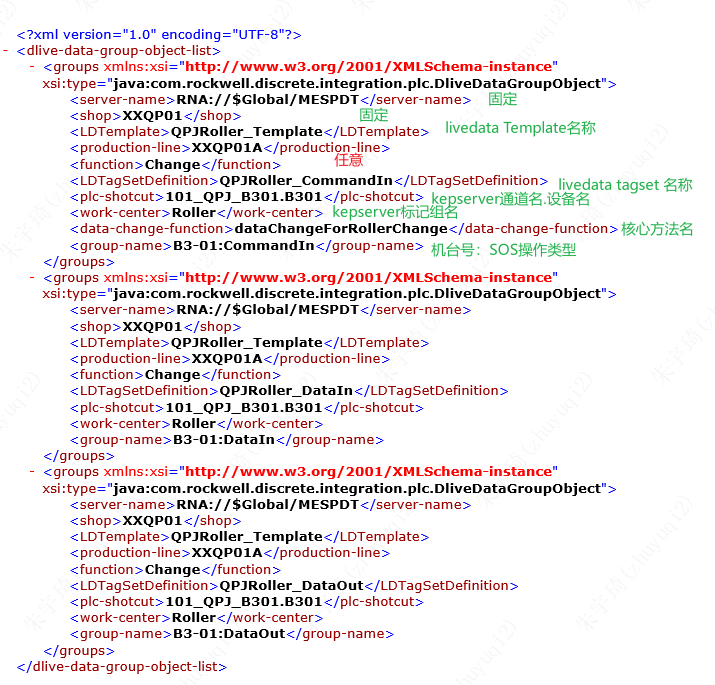

## 系统架构

## Rockwell平台快速开发

流程总览：

1. 另存一份EventSheet对象，修改名称，给要执行业务逻辑的核心方法起名。
	- 
2. 另存一份LiveData Template，修改名称。
	- 
3. 另存一份LiveData TagSet Definitions，修改名称，修改点位名称。
	- 
4. kepserver中创建标记组并添加点位，点位名称同步骤3，数据类型必须被兼容与步骤3指定的。
	- 
5. 另存一份xml配置文档，修改配置。
	- 一般xml必须有CommadIn，代表触发信号。
	- 一般xml配置必然有DataIn，代表读取数据。
	- DataOut和FaultOut代表数据写入和反馈，根据需要添加。
	- 
6. application对象中，创建变量，变量值为步骤5设定的SOS文件路径。
	- 
	- 
7. mes_common_integration_constant中，创建一份步骤6的变量和变量值。再创建一个值为步骤2名称前缀的常量。
	- 
8. eventsheet对象中使用步骤7创建的变量，并 编写function代码。
	- 
	- 
9. 另存一份SOS文件目录，修改配置。
	- 
	- 

> *对于既有服务增加采集点位的开发过程：执行步骤3、步骤4及步骤9即可。*
> *请遵守：步骤3、步骤4、步骤9必须全部配置结束再重启SOS，此处易报错。*
## Springboot快速开发

### 开发过程

1. 确定要部署的springboot服务数量，A、B区分别部署还是整合成一个。
	- 
2. 如果A、B区分别部署，选择xxmes_opcapp_cpj作为模板，如果A、B区整合部署，选择xxmes_opcapp_qpj作为模板。
	- 
3. kepserver创建标记组和标记：
	- 
4. 编辑配置文件，这里需要提前配置好kepserver，主要配置内容为端点地址和访问方式：
	- 
	- 
5. 根据配置文件的绝对路径，修改AppConfig文件，比如：
	- 
6. 创建业务类，修改代码。
7. MySubscription类配置监控点位及策略类：
	- 
## 部署过程

1. 这里基于windows服务器配置，将配置文件拷贝到服务器的指定路径下，比如：
	- 
2. 根据配置文件的绝对路径，修改AppConfig文件：
	- 
3. 修改服务器端口，防止端口冲突启动不起来;
	- 
4. 执行mvn install：
	- 
5. 将target目录的文件全部拷贝至服务器指定目录下：
	- 
6. 进入部署目录，启动服务：
	- 