## 搭建车间数据模型

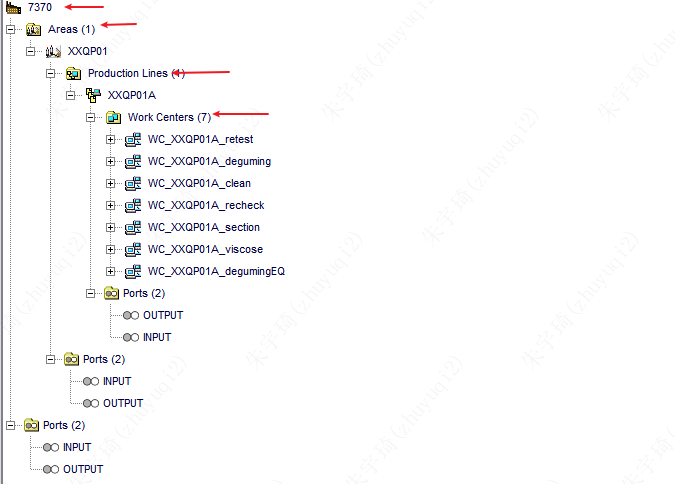

- 组织
	- 车间
		- 生产线
			- 工作中心（工序）
				- 设备

## Java语法的使用

### 输出

- `print()`
- `println()`

### Java类的使用

#### `java.lang`包可以不用包名

-  `class java.lang.Float::valueOf(testFloat_01)`
- `Float::valueOf(testFloat_01)`
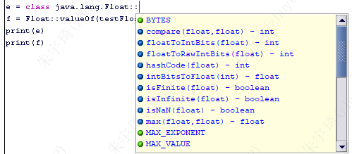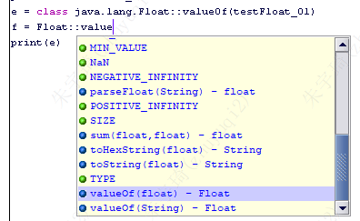

#### 其他类的导入

- `import("java.io.File")`

## 8个类

### 继承关系图

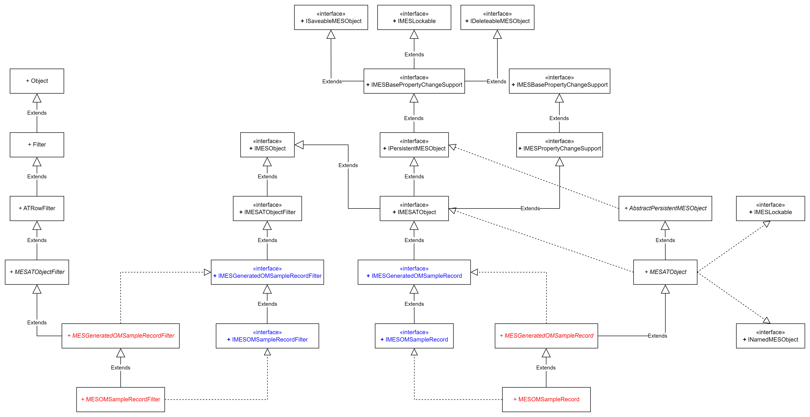

### 内部方法

1. `MESOMSampleRecord`：
2. `MESGeneratedOMSampleRecord`：
	- `getATDefinitionName()`：获取AT表名
3. `MESOMSampleRecordFilter`：
	- `createFilter()`：创建查询对象
4. `MESGeneratedOMSampleRecordFilter`
	- `getFilteredObjects()`：获取查询结果——List
	- 其他方法：
		- `forXxxContaining(arg)`：
		-  `forXxxEqualTo(arg)`：
		-  `forXxxNotEqualTo(arg)`：
		-  `forXxxStartingWith(arg)`：

### 继承方法

1. `getLastModifiedTime()`：获取系统生成的上次修改时间
2. `getCreationTime()`：获取系统生成的上次创建时间
3. `getObjectKey()`：获取AT表生成的ATR_KEY

## Form控件

### `GridDataDictActivity`表格

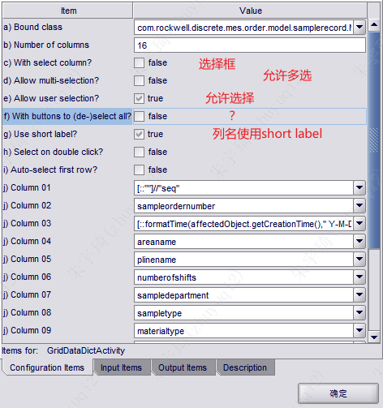

## DML

### Create

#### 方式一：基于8个类

```java
wireUpAndDownObj = class com.rockwell.discrete.mes.order.model.wireupanddown.MESOMWireUpAndDown()
```

#### 方式二：平台方法

```java
upRecordHandler = createATHandler("OM_DiamondLineJudge")
up = upRecordHandler.createATRow()
up.setValue("equip_name","A1-01")
up.save(null,null,null)
```

### Update

#### 方式一：基于8个类

```java
objFilter = class com.rockwell.discrete.mes.order.model.wireupanddown.MESOMWireUpAndDownFilter()
objFilter.forEquipnameEqualTo(equipName)
if(objFilter.getCount()>0)
{
	wireUpAndDownObj = objFilter.getFilteredObjects().get(0)
}
```

#### 方式二：平台方法

```java
upRecordHandler = createATHandler("OM_DiamondLineJudge")
judgeRow = upRecordHandler.getATRowByKey(atrkeyL,false)  //返回的ATRow
if (judgeRow != null)
{
	//评审表
	judgeRow.setValue("equip_name",equipName)
	judgeRow.setValue("complete_shift","白班")//测试
	judgeRow.setValue("complete_user",userName)
	judgeRow.setValue("complete_date",getDBTime())
	judgeRow.setValue("down_eq_linestorage",leftStorge)
}
```

- 注意这里的字段名，为原始名称。
- `getATRowByKey`只能获取AT表自带的字段——atr_key
- 如果是非自带的字段，可以使用`forColumnNameEqualTo()`方法制定字段，`getATRowsByFilter()`获取查询结果

```java
diamondLineExceptionFilter = createATRowFilter("OM_DiamondLineException")
diamondLineExceptionHandler = createATHandler("OM_DiamondLineException")
diamondLineExceptionFilter.forColumnNameEqualTo("source_key",atrkey)
diamondLineExceptionVectors = diamondLineExceptionHandler.getATRowsByFilter(diamondLineExceptionFilter,true)
if(diamondLineExceptionVectors != null && diamondLineExceptionVectors.size() > 0){
	diamondLineExceptionObj = diamondLineExceptionVectors.get(0)
}else{
	diamondLineExceptionObj = diamondLineExceptionHandler.createATRow()
	diamondLineExceptionObj.setValue("spool_no",wireNumber)
	diamondLineExceptionObj.setValue("source_key",atrkey)
	diamondLineExceptionObj.setValue("complete_date",getDBTime())
	diamondLineExceptionObj.save(null,null,null)
}                    
```

### Delete

#### 方式一：基于8个类

1. 引入类。
2. 编写代码：
```java

```
3. 注意事项：

## DQL 

### 方式一：基于8个类

```java
import("com.rockwell.discrete.mes.order.model.samplerecord.MESOMSampleRecordFilter")
// 1. 构造查询对象
filter = MESOMSampleRecordFilter()
// 2. 拼接查询条件
if(!isEmptyStr(sampleOrderNumber))
{
	filter.forSampleordernumberEqualTo(sampleOrderNumber)
}
// 3. 获取查询结果对象
vectors = filter.getFilteredObjects()
```

等价：

```java
// 1. 构造查询对象
filter = class com.rockwell.discrete.mes.order.model.samplerecord.MESOMSampleRecordFilter()
// 2. 拼接查询条件
if(!isEmptyStr(sampleOrderNumber))
{
	filter.forSampleordernumberEqualTo(sampleOrderNumber)
}
// 3. 获取查询结果对象
vectors = filter.getFilteredObjects()
```

### 方式二：sql

```java
sqlGetLotHistory = "SELECT A.SERIAL_NUMBER_S,TO_CHAR(A.START_TIME_T, 'yyyy-MM-dd HH24:mi:ss') AS START_TIME_T,TO_CHAR(A.COMPLETE_TIME_T, 'yyyy-MM-dd HH24:mi:ss') AS COMPLETE_TIME_T FROM AT_OM_LOTHISTORY A WHERE A.OP_NAME_S = 'section' AND A.EQUIP_NAME_S = 'A1-01' AND A.SERIAL_NUMBER_S = 'JZL12310327-0061'"
lotHistoryList = getArrayDataFromActive(sqlGetLotHistory)
startTimeObj = lotHistoryList.get(0)
startTime = startTimeObj[0]
```

getArrayDataFromActive是平台方法，等价于：

```java
importSubroutine("MES_Common_Base")
sqlGetLotHistory = "SELECT A.SERIAL_NUMBER_S,TO_CHAR(A.START_TIME_T, 'yyyy-MM-dd HH24:mi:ss') AS START_TIME_T,TO_CHAR(A.COMPLETE_TIME_T, 'yyyy-MM-dd HH24:mi:ss') AS COMPLETE_TIME_T FROM AT_OM_LOTHISTORY A WHERE A.OP_NAME_S = 'section' AND A.EQUIP_NAME_S = 'A1-01' AND A.SERIAL_NUMBER_S = 'JZL12310327-0061'"
lotHistoryList = querySql(sqlGetLotHistory)
startTimeObj = lotHistoryList.get(0)
startTime = startTimeObj[0]
```

### 方式三：平台方法

```java
upRecordHandler = createATHandler("OM_DiamondLineJudge")
judgeRow = upRecordHandler.getATRowByKey(atrkeyL,false)  //根据atrkeyL获取到指定对象
if (judgeRow != null)
{
	//设置值
	judgeRow.setValue("equip_name",equipName)
	judgeRow.setValue("complete_shift","白班")//测试
	judgeRow.setValue("complete_user",userName)
	judgeRow.setValue("complete_date",getDBTime())
	//保存数据
	judgeRow.save(null, null, null)
}
```

```JAVA
diamondLineExceptionFilter = createATRowFilter("OM_DiamondLineException")
diamondLineExceptionHandler = createATHandler("OM_DiamondLineException")
diamondLineExceptionFilter.forColumnNameEqualTo("source_key",atrkey)
diamondLineExceptionVectors = diamondLineExceptionHandler.getATRowsByFilter(diamondLineExceptionFilter,true)
diamondLineExcRow = diamondLineExceptionVectors.get(0)
diamondLineExcRow.setValue("ddd",sss)
```

```java
excepEntryFilter = createATRowFilter("OM_ExceptionEntry")
excepEntryFilter.forColumnNameEqualTo("serial_number", serialNumber)
excepEntryFilter.forColumnNameEqualTo("op_name", opName)
excepEntryFilter.forColumnNameEqualTo("except_item_code", exceptItemCode)
excepEntryFilter.forColumnNameEqualTo("data_state", "A")
vectorExcepEntry = excepEntryFilter.exec()
if (vectorExcepEntry.size() > 0) {
	excepEntry = vectorExcepEntry.get(0)
	excepEntry.setValue("data_state", "D")
	excepEntry.setValue("last_modified_by", currUser)
	excepEntry.setValue("del_date", currTime)
	excepEntry.save(currTime, null, null)
}
```

### 排序

1. 指定列（AT表自定义字段）：

```java
import("com.datasweep.plantops.common.constants.filtering.IATRowFilterAttributes")
import("com.datasweep.plantops.common.constants.filtering.IFilterSortOrders")

ATCOLUMN = class com.datasweep.plantops.common.constants.filtering.IATRowFilterAttributes::ATCOLUMN
DESCENDING = class com.datasweep.plantops.common.constants.filtering.IFilterSortOrders::DESCENDING
filter.addOrderBy(MESOMSampleRecord::COL_NAME_APPLYTIME,ATCOLUMN,DESCENDING)
```

- `MESOMSampleRecord`：类名。
- `COL_NAME_APPLYTIME`：列名。

2. 指定列（AT表生成字段）：

```java
import("com.datasweep.plantops.common.constants.filtering.IATRowFilterAttributes")
import("com.datasweep.plantops.common.constants.filtering.IFilterSortOrders")

ATCOLUMN = class com.datasweep.plantops.common.constants.filtering.IATRowFilterAttributes::ATCOLUMN
DESCENDING = class com.datasweep.plantops.common.constants.filtering.IFilterSortOrders::DESCENDING
filter.addOrderBy(IATRowFilterAttributes::CREATIONTIME, IFilterSortOrders::DESCENDING);
```


## 下拉框初始化

### ChoicelistFieldActivity

1. 使用ChoicelistFieldActivity控件。
	- 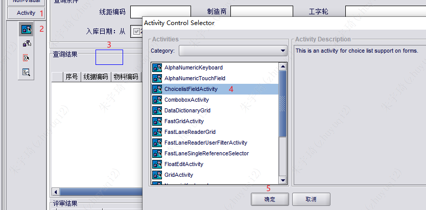1
2. 绑定下拉列表参数的国际化message对象。
	- 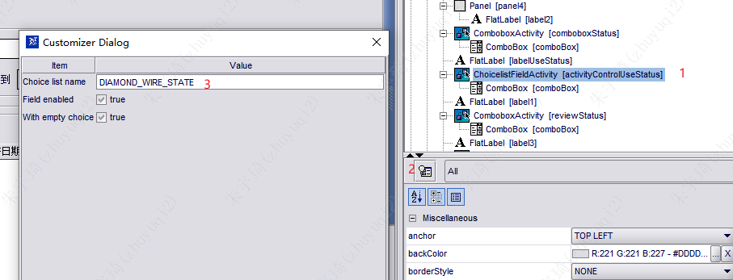

### ComboxBox

#### 固定值

1. 使用ComboxBox控件。
2. stringVector绑定下拉列表值。
	- 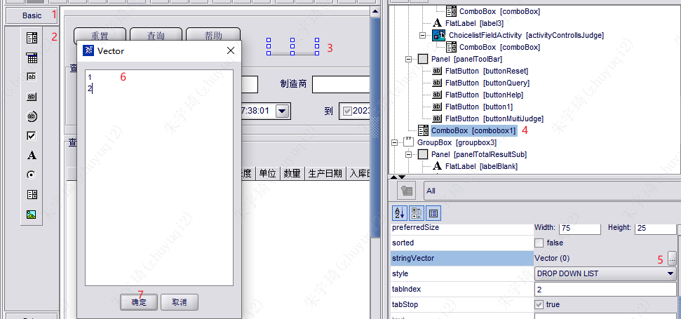

#### SQL值

适用于关联查询：
```java
//初始化领料部门，根据当前登录用户筛选其对应的部门
function initComboboxDept(){
    //部门下拉框增加一个空白选项
//     comboboxDept.addItem("")
    //获取当前登录用户所有的车间
    areas = buildAreaInClauseByUser(getCurrentUser().getName())
    sql = " select t1.col_1_s,t1.col_4_s from at_sm_bizparam t1 where t1.param_group_code_s = 'REQ_DEPT_STORAGE' 
            and t1.col_4_s " + areas + " order by t1.col_1_s asc"
    dataVector = getArrayDataFromActive(sql);
    if(dataVector !=null && dataVector.size() > 0){
        for(i = 0;i < dataVector.size();i++){
            comboboxDept.addItem(dataVector.get(i)[0])   
        }
    }
}

comboboxDept.setText(department)
```

#### 代码

```java
 //初始化班次
shiftsItems = createArray(2)
shiftsItems = ["白班", "夜班"]
comboboxNumberOfShifts.setItems(shiftsItems)
```
- `comboboxNumberOfShifts`：ComboBox控件名。

### ComboboxActivity

1. 维护业务参数：

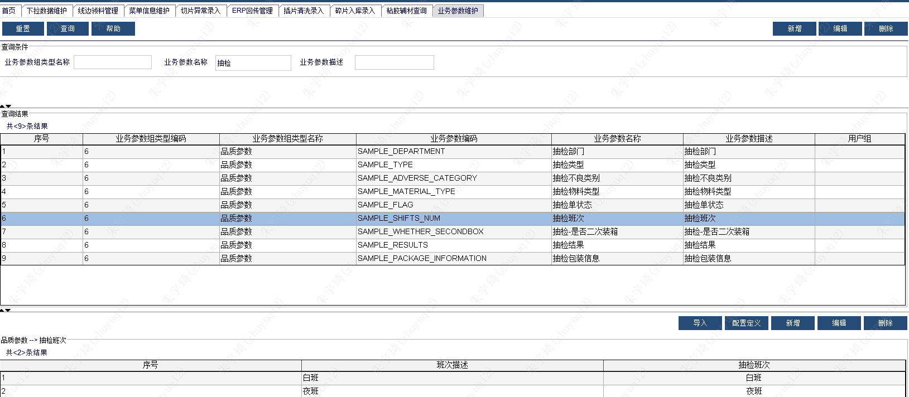

2. 编写代码——方式1：

```java
importSubroutine("MES_SYS_Common")//业务参数
importSubroutine("MES_Common_Combobox")//下拉框初始化
initComboboxByBusinessParam(activityControlSampleResult,"SAMPLE_RESULTS")
```
- `initComboboxByBusinessParam`：`MES_Common_Combobox`中方法。
- `activityControlSampleResult`：控件名。
- `SAMPLE_RESULTS`：业务参数名

3. 编写代码——方式2：
```java
importSubroutine("MES_SYS_Common")
initCombobox(activityControlSampleResult,"SAMPLE_RESULTS")
 //下拉框、业务参数编码
function initCombobox(combobox, name) {
    vectors = getParamByParamGroupCode(name)
    vectorResult = vector()
    vectorResult.add(0, null)
    for (i = 0; i < vectors.size(); i++) {
        vectorResult.add(vectors.get(i))
    }
    combobox.setItems(vectorResult.toArray())
}
```
- `getParamByParamGroupCode`：`MES_SYS_Common`中方法。
- `activityControlSampleResult`：控件名。
- `SAMPLE_RESULTS`：业务参数名

### 各种方式比较

| 方式   | 优势                          | 劣势 |
| ------ | ----------------------------- | ---- |
| 方式一 | 绑定message对象可以使用国际化 | 劣势 |
| 方式二 | 最简单直接                    | 劣势 |
|        |                               |      |
|        |                               |      |
|        |                               |      |


## 填充表格

最终方法为：`activityGridResult.setObjects(vectorObj)`

### `GridDataDictActivity`控件 - 8个类

1. 控件绑定AT表的类：
2. 编写代码：

```java
//清空表格
activityControlSampleRecord.setObjects(vector())
setGridSeq(activityControlSampleRecord.getGrid())
//查询条件
sampleOrderNumber = editSampleOrderNumber.getText().trim()
//查询Filter
filter = MESOMSampleRecordFilter()  
if(!isEmptyStr(sampleOrderNumber))
{
	filter.forSampleordernumberEqualTo(sampleOrderNumber)
}
//排序
ATCOLUMN = class com.datasweep.plantops.common.constants.filtering.IATRowFilterAttributes::ATCOLUMN
DESCENDING = class com.datasweep.plantops.common.constants.filtering.IFilterSortOrders::DESCENDING
filter.addOrderBy(IATRowFilterAttributes::CREATIONTIME, IFilterSortOrders::DESCENDING);
//获取数据
vectors = filter.getFilteredObjects()
//加载数据
activityControlSampleRecord.setObjects(vectors)
setGridSeq(activityControlSampleRecord.getGrid())
```

- `activityControlSampleRecord`为表格名称。
- `setGridSeq(activityGridResult.getGrid(),1)`与`setGridSeq(activityControlSampleRecord.getGrid())`等价。

### `FastLaneReaderGridActivity`控件 - SQL查询

1. 控件绑定SQL语句：
	- 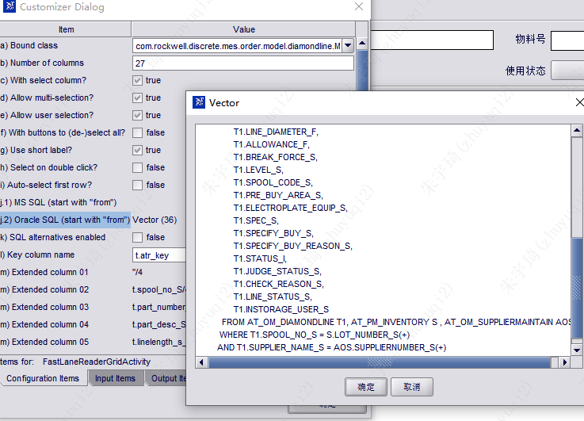
	- 注意：SQL语句以`FROM`开始，查询结果定义为`t`

2. 编写代码：`activityGridResult.setObjects(vectorObj)`

```java
// 清空表格
activityGridResult.setObjects(vector())
setGridSeq(activityGridResult.getGrid())
// 获取界面输入值
spoolcode = editSpoolcode.getText().trim()
// 获取控件绑定的SQL
sql = activityGridResult.getSQL()
// 查询条件
if(!isEmptyStr(spoolcode)){
	 sql = sql + " and t1.spool_code_S like '%" + spoolcode + "%' "
}
// 排序
sql = sql + " ORDER BY T1.PRODUCT_TIME_T DESC) T "
// 获取查询结果
vectorObj = activityGridResult.fetchData(sql)
frmInitGrid()
// 表格填充内容
if(vectorObj.size() > 0) {
	activityGridResult.setObjects(vectorObj)
	//设置序号
	setGridSeq(activityGridResult.getGrid(), 1)
}
```

#### SQL语法格式及排序语句

1. 绑定的sql语句格式以FROM打头，相当于`SELECT * FROM (SELECT * FROM DUAL)`
2. 因此，如果要排序，则要写成：`SELECT * FROM (SELECT * FROM DUAL) ORDER BY FIELD`
	- `SELECT * FROM (SELECT * FROM DUAL ORDER BY FIELD)`：这种写法错误，排序不生效。

#### 格式化时间

1. 方式一：使用sql语法格式化为STRING，绑定时以STRING类型绑定。
	- 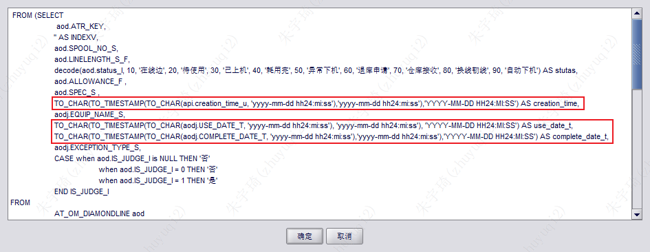
	- 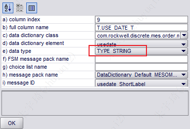
	- 如果绑定类型为DATETIME，则报**查询异常**。
2. 方式二：使用sql直接查询，绑定时以DATETIME类型绑定。
	- 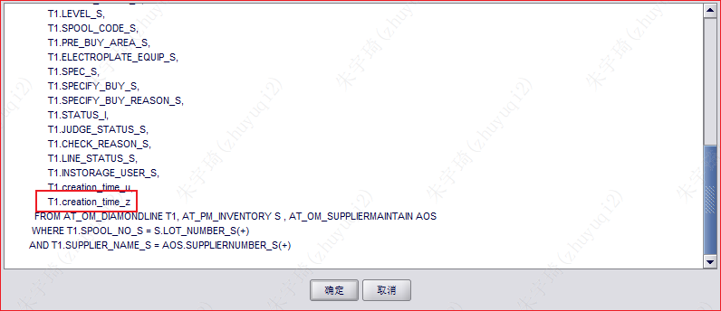
	- 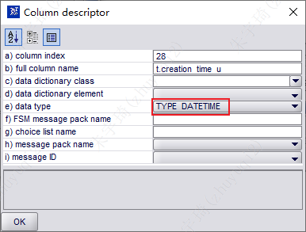
	- 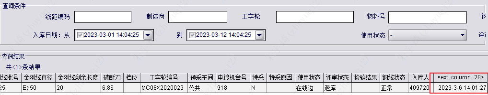
	- 如果绑定为STRING，则展示结果带时区：
		- 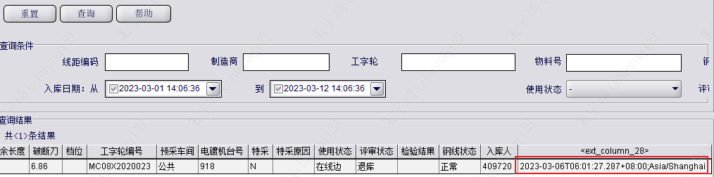
3. 小总结：
	- 推断：控件绑定的sql语句默认查询结果总是STRING类型，但可以通过绑定的数据类型进行格式化，如STRING和DATETIME。
	- 推断：控件绑定的sql语句默认查询结果显示格式化为STRING类型，则绑定的数据类型只能是STRING类型。
	- *例外情况：存在使用sql默认查询结果，但绑定DATATIME类型进行格式化报错的情况，原因暂时未知。*

### DsGrid控件 - 按列索引填充

适用于不绑定列名，直接按列索引填充的情况。

### 显示值转换

将数据库中的0和1转换为Message对象中的国际化对象值：
1. 方式一：
	- 参数一：表格名称
	- 参数二：填充值
	- 参数三：表格第n列
	- 参数四：Message对象

```java 
setMessageDescToGrid(activityGridResult.getGrid(), processPackageInfos, 22 , "PROCESS_PACKAGE_TYPE")
```

2. 方式二：
	- 参数一：Message对象
	- 参数二：填充值对象的getter方法
	- 注意：`isproduce`为AT表字段名，`//`并不表示注释，`affectObject`是平台固定的对象。
```java
[::class com.rockwell.mes.commons.base.ifc.choicelist.MESChoiceListHelper::getChoiceElement("YesOrNot",affectedObject.getIsproduce()).getLocalizedMessage()]//"isproduce"
```

### XxxActivity控件绑定AT标表自动生成字段

#### 绑定时间

```java
[::formatTime(affectedObject.getCreationTime()," Y-M-D Z:T:S")]//"creationtime"
[::formatTime(affectedObject.getLastModifiedTime()," Y-M-D Z:T:S")]//"lastmodifiedtime"
```
- `//"creationtime"`不是注释
- `affectedObject`固定写法
- `getCreationTime()`封装方法。

#### 将工号转换为名称

```java
[::getUser(affectedObject.getCreatedby()).getDescription()]//"createdby"
[::getUser(affectedObject.getLastmodifiedby()).getDescription()]//"lastmodifiedby"
```
- `//"lastmodifiedby"`不是注释
- `affectedObject`固定写法
- `getUser()`平台方法。
- `getDescription()`

## 初始化车间、片区

### ComboxBox

#### 样式1

```java
importSubroutine("MES_Common_Combobox")
initComboboxAreaDes(comboboxWorkshop,getCurrentUser())//初始化车间
initComboboxPlineDes(comboboxArea,null,getCurrentUser())//初始化片区

//importSubroutine("MES_UM_DataAccess")//MES_Common_Combobox引入了MES_UM_DataAccess
AREA_TYPE="QP"
initComboboxUserAccessArea(comboboxWorkshop,AREA_TYPE)//初始化车间（在MES_UM_DataAccess中）
```
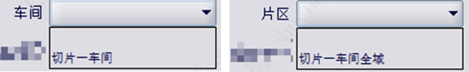

#### 样式2

```java
importSubroutine("MES_Common_Base")
AREA_TYPE="QP"
initComboboxArea(comboboxWorkshop)//初始化车间
initComboboxArea(comboboxWorkshop,getCurrentUser(),AREA_TYPE)//初始化车间
initComboboxPline(comboboxArea)//初始化片区
```
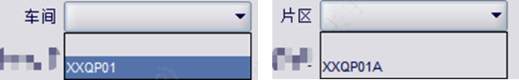

## 回显数据

### 代码

适用范围：输入框、label标签、Combobox控件

```java
// 回显抽检结果
sampleResult = obj.getMaterialtype()
if(sampleResultItems[0].equals(sampleResult))
{
	comboboxSampleResult.setSelectedIndex(0)
}else if(sampleResultItems[1].equals(sampleResult))
{
	comboboxSampleResult.setSelectedIndex(1)
}
```
- `comboboxSampleResult`：Combobox控件名。

### 控件

适用于ComboboxActivity，使用ObjectBinderEnchanced控件双向绑定。
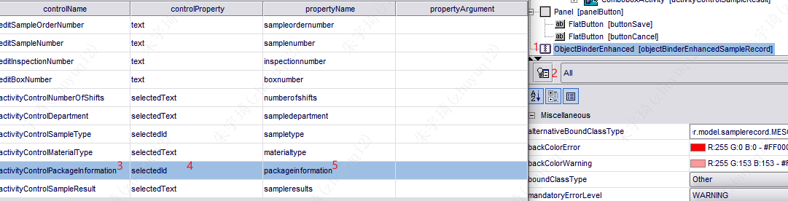
- `selectedId`：根据下拉框的id进行展示——自动转换数据库存储值和显示值。
- `selectedText`：根据下拉框的文本进行展示——不会转换数据库存储值，如果存储值与显示值不一致，则数据不会回显。

## 权限控制

### UI

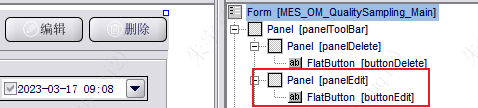

- 一般将一个button包含在一个Panel中。（为什么？）
- 一般一个button配合一个panel——最细粒度控制。

### 代码

```java
importSubroutine("MES_Common_Privilege")

function initForm()
{    
    initializeButtonAccess()
}

/*
 * 权限控制 
 */
function initializeButtonAccess()
{
    hashtableButtons = hashtable()
    hashtableButtons.put(buttonDelete.getName(), panelDelete)
    hashtableButtons.put(buttonEdit.getName(), panelEdit)
    setupButtonAccess(hashtableButtons)
}
```

- `importSubroutine("MES_PR_Common")`也可以，它引入了`importSubroutine("MES_Common_Privilege")`

```java
/**
 * 描述：控制按钮的访问权限，隐藏未授权的按钮。
 * 
 * @parameter: hashtableButton - Class:(Hashtable<String, control>)
 *      需要进行权限控制的按钮，String是按钮的名称，control是需要隐藏的UI，可以是按钮本身的对象，也可以是包含按钮的容器(该容器只有一个按钮，主要是控制隐藏按钮后的页面布局)
 * @parameter: isPreview - Class:(Boolean)
 *      是否是预览模式
 * @return: void
 * @author: Lin Hui 04/20/2016
 */
function setupButtonAccess(hashtableButton)
{
    form = getActiveDsForm()
    hashtableAction = form.getProperty("ActionMap")
    isPreview = form.getProperty("RunMode") != null && form.getProperty("RunMode").equals("Preview")
    if(isPreview || !isCurrentUserSystemAdministrator())
    {
        if(hashtableAction == null || hashtableAction.isEmpty())
        {
            foreach control(hashtableButton.values())
            {
                control.setVisible(false)
            }
        }
        else
        {
            vectorButtonName = vector()
            foreach buttonName(hashtableAction.keySet())
            {
                vectorButtonName.add(hashtableAction.get(buttonName))
            }
        
            foreach buttonName(hashtableButton.keySet())
            {
                if(vectorButtonName.contains(buttonName))
                {
                    hashtableButton.get(buttonName).setVisible(true)
                }
                else
                {
                    hashtableButton.get(buttonName).setVisible(false)
                }
            }
        }
    }
}
```

### 配置

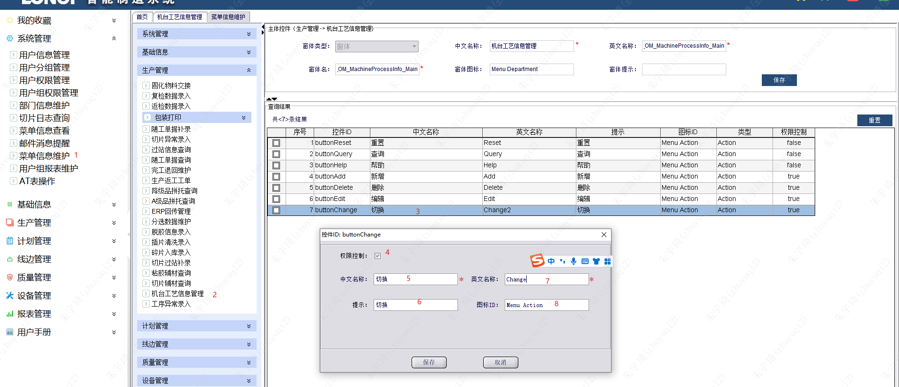

## DA配置时，编写SOS服务

### KEPServer读取PLC点位

参考KEPserverEX篇章。

### LiveData TagSet Definitions增加标记

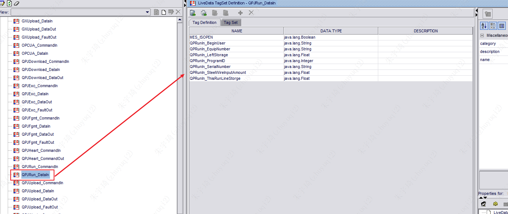

## 参数查询

### 业务参数

定义：

```java
/**
 * @Desc: 根据getSearchColumn方法返回的查询条件map，在bizparam表中拼接filter并执行查询。
 * @Author: wanglei
 * @Date: 20211128
 * */
function queryBizParam(paramGroupCode, queryMap) {
    filter = createATRowFilter("SM_BizParam")
    entries = queryMap.entrySet().iterator()
    
    while(entries.hasNext()) {
		entry = entries.next()
		filter.forColumnNameEqualTo("param_group_code", paramGroupCode)
		filter.forColumnNameEqualTo(entry.getKey(), entry.getValue())
	}

    vectorBizParam = filter.exec()
    return vectorBizParam
}
```

使用：

```java
importSubroutine("MES_SYS_Common")
 //根据异常项编码，从业务参数中获取异常项其他的属性信息
queryMap = HashMap()
queryMap.put("col_1", "切片")
queryMap.put("col_2", exceptItemCode)
vectorExc = queryBizParam("Process_Exception_Code", queryMap)
if (vectorExc.size() > 0) {
	excItem = vectorExc.get(0)
	exceptItemValue = excItem.getValue("col_3")
	exceptMark = excItem.getValue("col_4")
	exceptNumber = excItem.getValue("col_5")
	recheckExceptItem = excItem.getValue("col_6")
}
```


### 系统参数

定义：

```java
```

使用：

```java
excReasonStr = getDateDictionaryValue("SteelWireExcReason",excReason+"")
```

## skills

### 强转time类型

**方法一：**

逆向生成的8个类中，涉及到的Time类型不是Java原生的，而是封装的，可以采用下面的方式进行强转：但是要注意，`preSerialNoCompleteTimeStr`是带时区的。

```java
preSerialNoSql = "SELECT SERIAL_NUMBER_S ,COMPLETE_TIME_T  FROM AT_OM_LOTHISTORY aol WHERE OP_NAME_S ='section' AND EQUIP_NAME_S ='" + equipName + "' AND SERIAL_NUMBER_S <>'" + serialNo + "' AND COMPLETE_TIME_T IS NOT NULL ORDER BY COMPLETE_TIME_T DESC"
preSerialNoVectors = querySql(preSerialNoSql)
if(preSerialNoVectors!=null && preSerialNoVectors.size() > 0){
	preSerialNoCompleteTimeStr = preSerialNoVectors.get(0)[1]
	preSerialNoCompleteTime=class com.datasweep.compatibility.ui.Time(preSerialNoCompleteTimeStr)
	upDownDurationT = timeDifference(preSerialNoCompleteTimeStr,wipTime)
	upDownDuration = class java.lang.Float::valueOf(upDownDurationT + "")
}
```

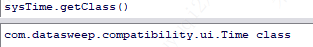

**方法二：**

另一个原生方法，startTme不带时区，是个字符串：

```java
class com.ftpc.common.utilities.TimeHelper::stringToTime(startTme, "yyyy-MM-dd HH:mm:ss")
```

**方法三：**

也可使用封装方法：`getTimeFromString()`：过程为首先使用sql查询出时间，值带时区，字符串类型；再将该字符串使用`getTimeFromString`处理成不带时区的时间格式，再使用setValue方法保存成oracle中的带时区时间。

- 注意，转换的类型为java的time类型，而不是上面的time类型。
- `atrow.setValue("complete_time_pre",if(isNullOrEmpty(completeTimePre)) null else getTimeFromString(completeTimePre))`

```java 
function getTimeFromString(text,mask){
    format = class java.text.SimpleDateFormat(mask)
    date = format.parse(text)
    return date
}

function getTimeFromString(text){
    if(text != null){
        if(text.contains("/")){
            mask = "yyyy/MM/dd HH:mm:ss"
        }else if(text.contains("-")){
            mask = "yyyy-MM-dd HH:mm:ss"
        }
        return getTimeFromString(text,mask)
    }
    return null
}
``` 

### 数据类型转换

- `stringToInt`：转为Long
- `stringToBigDecimal`：转为Float

## 设备SOS

### 加载xml配置文件

## 条码打印

### bartender模板

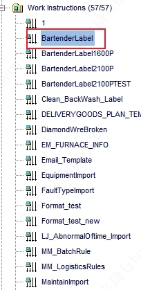

### 本地文件地址

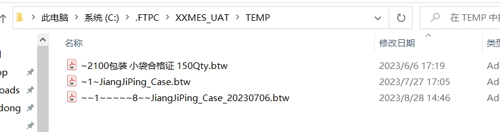

### 使用条件

本机安装bartender软件。