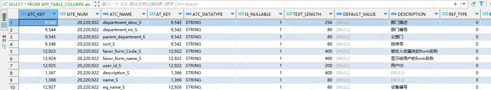

## 业务语句

### 表管理

#### 查询表列名含义

```sql
SELECT
	atc.ATC_NAME ,
	atc.DESCRIPTION
FROM
	APP_TABLE at2
INNER JOIN APP_TABLE_COLUMN atc ON
	at2.AT_KEY = atc.AT_KEY
WHERE
	at2.AT_NAME LIKE '%OM_DataCollection%';
```

* `APP_TABLE`：Oracle系统表，保存表的属性。
    * 
* `APP_TABLE_COLUMN`：Oracle系统表，保存列的属性。
    * 
* `OM_DataCollection`：要查询的表。

### 钢线

#### 当前状态

```sql
SELECT STATUS_I FROM XXQPMES.AT_OM_DIAMONDLINE WHERE SPOOL_NO_S = 'U3022390530B0';

状态说明：
10 -- 在线边
20 -- 待使用
30 -- 使用中
40 -- 耗用完
50 -- 异常下机
60 -- 退库申请
70 -- 退库接收
80 -- 换线韧线
90 -- 自动下机
```

#### 当前机台上机的钢线

```sql
SELECT aow.STEEL_WIRE_NUMBER_S FROM AT_OM_WIREUPANDDOWN aow WHERE aow.EQUIP_NAME_S ='A5-04' AND WIRE_STATUS_I = 1;

说明：
WIRE_STATUS_I = 1 -- 上机
WIRE_STATUS_I = 2 -- 下机
```

#### 当前钢线在哪个机台使用

```sql
SELECT aow.EQUIP_NAME_S FROM AT_OM_WIREUPANDDOWN aow WHERE aow.STEEL_WIRE_NUMBER_S ='V30105D0670Q0';
```

### 随工单

#### 是否反切

```sql
SELECT 
	EQUIP_NAME_S ,
	INVERT_CUT_S ,
	INVERT_CUT_CODE_I  
FROM 
	AT_OM_SECTIONPROCESSEXC 
WHERE
	SERIAL_NUMBER_S in ('JZL12320126-0067','JZL12320125-0327','JZL12320125-0352','JZL12320125-0325','JZL12320126-0067','JZL12320126-0090','JZL12320126-0207');

结果：
EQUIP_NAME_S|INVERT_CUT_S|INVERT_CUT_CODE_I|
------------+------------+-----------------+
A1-07       |是           |                1|
A3-05       |是           |                1|
A4-11       |是           |                1|
A5-06       |是           |                1|
A5-06       |是           |                1|
A5-05       |是           |                1|
```

### 领料

#### 根据钢线编码查询WMS是否发料

```sql
SELECT * FROM IF_STOCK WHERE LOTATT01 = 'U2061372710B0';
```

### 退料

#### 根据钢线编码查询退库单号

```sql
SELECT REQUISITION_NUMBER_S FROM AT_PM_MATERIALREQITEMS apm WHERE apm.BOX_NUMBER_S = 'V30111919A0Q0';
```

```sql
-- 根据晶编查询自动化粘胶记录
SELECT a.VISCOSE_SERIAL_NO_S , a.STATUS_I , a.GLUEA_NAME_S , a.GLUEA_FACTORY_S , a.GLUEA_WEIGHT_S , a.GLUEB_NAME_S , a.GLUEB_FACTORY_S , a.GLUEB_WEIGHT_S , a.PLATE_BATCH_S , a.PLATE_SUPPLIER_S , a.VISCOSE_BEGIN_TIME_T , a.ROD_NUMBER1_S , a.ROD_NUMBER2_S
FROM AT_OM_VISCOSEAUTO a
WHERE(a.ROD_NUMBER1_S = 'ZYP36L5501440'
	OR a.ROD_NUMBER2_S = 'ZYP36L5501440')
AND (a.ROD_NUMBER1_S = 'ZYP36L5501440'
	OR a.ROD_NUMBER2_S = 'ZYP36L5501440');

-- 切片工序碎片
SELECT *
FROM AT_OM_DEBRISWEIGH
WHERE DEBRIS_WEIGH_F = 0.01
ORDER BY
	CREATION_TIME DESC;

-- 查询点击耗用完的余线量
SELECT ALLOWANCE_F, STATUS_I , QTY_F
FROM AT_OM_DIAMONDLINE aod3
WHERE SPOOL_NO_S = 'I30516F0550B0';

-- 耗用完余线量不为0钢线
SELECT SPOOL_NO_S , QTY_F , ALLOWANCE_F , LAST_MODIFIED_TIME
FROM AT_OM_DIAMONDLINE aod
WHERE STATUS_I = '40'
AND QTY_F = 0
AND ALLOWANCE_F <> 0
ORDER BY
	LAST_MODIFIED_TIME DESC;

-- 查询耗用完余线量不为0的钢线
SELECT SPOOL_NO_S , QTY_F , ALLOWANCE_F , LAST_MODIFIED_TIME
FROM AT_OM_DIAMONDLINE aod
WHERE STATUS_I = '40'
AND QTY_F = 0
AND ALLOWANCE_F <> 0
ORDER BY
	LAST_MODIFIED_TIME DESC;

-- 查询耗用完的钢线
SELECT SPOOL_NO_S , QTY_F , ALLOWANCE_F , LAST_MODIFIED_TIME
FROM AT_OM_DIAMONDLINE aod
WHERE STATUS_I = '40'
AND QTY_F = 0
ORDER BY
	LAST_MODIFIED_TIME DESC;

-- 查询上料补录、下料没有录的随工单
SELECT EQUIP_NAME_S , SERIAL_NUMBER_S, CREATION_TIME, START_COMMENT_S , COMPLETE_COMMENT_S , START_TIME_T , COMPLETE_TIME_T
FROM AT_OM_LOTHISTORY aol
WHERE START_COMMENT_S IS NULL
--AND COMPLETE_COMMENT_S NOT LIKE '%补录%'
AND OP_NAME_S = 'section'
ORDER BY
	CREATION_TIME DESC ;
	
-- 查询上料补录、或下料补录的随工单
SELECT EQUIP_NAME_S , SERIAL_NUMBER_S, CREATION_TIME, START_COMMENT_S , COMPLETE_COMMENT_S , START_TIME_T , COMPLETE_TIME_T
FROM AT_OM_LOTHISTORY aol
WHERE(START_COMMENT_S LIKE '%补录%'
	OR COMPLETE_COMMENT_S LIKE '%补录%')
AND OP_NAME_S = 'section'
--AND EQUIP_NAME_S IN ('A4-05','A4-04','A4-03','A5-02','A5-04','A5-06','B1-06','B1-09','B2-01','B2-06','B2-08','B2-11','B4-11','B4-06','B4-09','B4-11','B5-01','B5-05')
--AND aol.START_TIME_T > TRUNC(SYSDATE) 
AND aol.START_TIME_T > to_date('2023-09-26 20:00:00', 'yyyy-mm-dd hh24:mi:ss')
ORDER BY
	CREATION_TIME DESC ;
SELECT BIND_EQUIP_S ,CURREQUIPMENT_S  FROM AT_OM_MAINROLLER_INFO aomi WHERE MAINROLLER_CODE_S LIKE '%J187-J188%';

SELECT EQUIP_NAME_S , SERIAL_NUMBER_S, CREATION_TIME, START_COMMENT_S , COMPLETE_COMMENT_S , START_TIME_T , COMPLETE_TIME_T
FROM AT_OM_LOTHISTORY aol
WHERE OP_NAME_S = 'section'
AND EQUIP_NAME_S IN ('A1-01')
AND aol.START_TIME_T > TRUNC(SYSDATE) 
ORDER BY
	CREATION_TIME DESC ;

SELECT * FROM AT_OM_SECTIONEXINFO aos ;

SELECT degu FROM AT_OM_DATACOLLECTION aod2 ;
-- 查询A区换线韧线切片完工钢线
SELECT aol.START_TIME_T , aol.COMPLETE_TIME_T , aol.SERIAL_NUMBER_S , aod.UP_STEELWIRE_NUMBER_S , aod.DOWNSTEELWIRE_NUMBER_S , aol.EQUIP_NAME_S
FROM AT_OM_DATACOLLECTION aod
LEFT JOIN AT_OM_LOTHISTORY aol ON
AOD.SERIAL_NUMBER_S = aol.SERIAL_NUMBER_S
WHERE aol.OP_NAME_S = 'section'
AND aol.COMPLETE_TIME_T IS NOT NULL
AND aod.UP_STEELWIRE_NUMBER_S <> aod.DOWNSTEELWIRE_NUMBER_S
AND aol.EQUIP_NAME_S LIKE '%B%'
ORDER BY aol.COMPLETE_TIME_T DESC ;

-- 查询B区焊线人
SELECT *
FROM AT_OM_SECTIONPROCESSEXC aos
WHERE EQUIP_NAME_S LIKE '%B%'
AND COLUMN_8_S IS NOT NULL ;

-- 查询上下料钢线
SELECT UP_STEELWIRE_NUMBER_S , DOWNSTEELWIRE_NUMBER_S
FROM AT_OM_DATACOLLECTION aod
WHERE SERIAL_NUMBER_S = 'JZL12360123-0025';

-- 查询datacollection和sectionprocessexc表的钢线耗用量
SELECT aod.STEELWIRE_WASTE_F ,AOS2.STEELLINE_WASTE_F  
FROM AT_OM_DATACOLLECTION aod , AT_OM_SECTIONPROCESSEXC aos2
WHERE aod.SERIAL_NUMBER_S = aos2.SERIAL_NUMBER_S
AND aod.SERIAL_NUMBER_S = 'JZL12360123-0025';

-- 查询是否反切
SELECT INVERT_CUT_S
FROM AT_OM_SECTIONPROCESSEXC aos
WHERE SERIAL_NUMBER_S = 'JZZ12369925-0719';

-- 查询B4-05上料或下料补录
SELECT *
FROM AT_OM_LOTHISTORY aol
WHERE OP_NAME_S = 'section'
AND EQUIP_NAME_S = 'B4-05'
AND (START_COMMENT_S LIKE '%补录%'
	OR COMPLETE_COMMENT_S LIKE '%补录%');

-- 查询上料请求时间
SELECT aod.SECTION_REQUEST_TIME_T 上料请求时间, aol.START_TIME_T 点运行时间, aol.COMPLETE_TIME_T 点自动提料时间, aol.SERIAL_NUMBER_S
FROM AT_OM_DATACOLLECTION aod, AT_OM_LOTHISTORY aol
WHERE aod.SERIAL_NUMBER_S = aol.SERIAL_NUMBER_S
AND aol.OP_NAME_S = 'section'
AND aol.SERIAL_NUMBER_S = 'JZZ12369926-0255';

-- 查询业务参数（钢线损耗原因）
SELECT *
FROM AT_SM_BIZPARAMGROUP asb
WHERE PARAM_GROUP_CODE_S = 'SteelWasteReason';

SELECT COL_1_S ,COL_2_S ,CREATION_TIME ,LAST_MODIFIED_TIME 
FROM AT_SM_BIZPARAM asb
WHERE PARAM_GROUP_CODE_S = 'OM_AUTO_PRINTER_SPEC_XXQP01'
ORDER BY COL_1_S ;
-- 查询上料补录，下料正常的随工单
SELECT aol.EQUIP_NAME_S , aod.SECTION_HAS_REQUEST_I , aol.START_USER_NAME_S , aod.SECTION_REQUEST_TIME_T , aol.START_COMMENT_S , aol.START_TIME_T , aol.COMPLETE_COMMENT_S , aol.COMPLETE_TIME_T, aol.COMPLETE_TIME_T - aod.SECTION_REQUEST_TIME_T,aod.CUT_TIME_F 
FROM AT_OM_DATACOLLECTION aod , AT_OM_LOTHISTORY aol
WHERE aod.SERIAL_NUMBER_S = aol.SERIAL_NUMBER_S
AND aol.OP_NAME_S = 'section'
AND aol.START_COMMENT_S LIKE '%补录%'
AND aol.COMPLETE_COMMENT_S NOT LIKE '%补录%'
ORDER BY aol.COMPLETE_TIME_T DESC;


SELECT SECTION_REQUEST_TIME_T  FROM AT_OM_DATACOLLECTION aod  WHERE SERIAL_NUMBER_S ='JZZ123A9910-0485';
SELECT * FROM AT_OM_EXCEPTIONENTRY aoe WHERE SERIAL_NUMBER_S ='JZZ123A9909-0815';
SELECT SECTION_REQUEST_TIME_T  FROM AT_OM_DATACOLLECTION aod WHERE SERIAL_NUMBER_S ='JZZ123A9911-0335';
SELECT * FROM AT_OM_LOTHISTORY aol WHERE SERIAL_NUMBER_S ='JZZ123A9911-0335';
SELECT * FROM 
AT_OM_DATACOLLECTION aod ,AT_OM_LOTHISTORY aol 
WHERE aod.SERIAL_NUMBER_S =aol.SERIAL_NUMBER_S 
AND aol.OP_NAME_S ='section'
AND aol.EQUIP_NAME_S ='B301'
AND aod.RECOVERY_BOW_TIME_F IS NOT NULL ;

-- 查询焊线人是否覆盖机台
SELECT EQUIP_NAME_S
FROM AT_OM_SECTIONPROCESSEXC aos
WHERE EQUIP_NAME_S LIKE '%A%'
AND COLUMN_8_S IS NOT NULL
GROUP BY EQUIP_NAME_S
ORDER BY EQUIP_NAME_S ;
-- 查询补录人
SELECT aod.SERIAL_NUMBER_S , aol.START_TIME_T , aol.START_COMMENT_S , aol.COMPLETE_TIME_T , aol.COMPLETE_COMMENT_S , aol.LAST_MODIFIED_BY_S , uu.DESCRIPTION
FROM AT_OM_DATACOLLECTION aod , AT_OM_LOTHISTORY aol , USER_UV uu
WHERE aol.OP_NAME_S = 'section'
AND aod.SERIAL_NUMBER_S = aol.SERIAL_NUMBER_S
AND aol.LAST_MODIFIED_BY_S = uu.USER_NAME
AND aod.UP_STEELWIRE_NUMBER_S = 'I30525728E0B0';
-- 查询B5-11机台的标准进线量
SELECT aod.FIRST_STEELWIRE_AMOUNT_F , aod.LAST_STEELWIRE_AMOUNT_F
FROM AT_OM_DATACOLLECTION aod
LEFT JOIN AT_OM_LOTHISTORY aol ON
aod.SERIAL_NUMBER_S = aol.SERIAL_NUMBER_S
LEFT JOIN AT_OM_MACHINEPROCESSINFO aom ON aol.EQUIP_NAME_S =aom.EUIPMENT_ID_S 
WHERE aol.OP_NAME_S = 'section'
AND aol.EQUIP_NAME_S = 'B5-11'
AND (aod.FIRST_STEELWIRE_AMOUNT_F IS NOT NULL
	OR aod.LAST_STEELWIRE_AMOUNT_F IS NOT NULL );
-- 根据列名查所在表
SELECT
	atc.ATC_NAME ,
	atc.DESCRIPTION,
	at2.AT_NAME 
FROM
	APP_TABLE at2
INNER JOIN APP_TABLE_COLUMN atc ON
	at2.AT_KEY = atc.AT_KEY
WHERE
	atc.DESCRIPTION LIKE '%TTV%';

-- 查询B5-11机台切割时长、标准切割时长、异常时长、上刀下料时间等
SELECT aod.SERIAL_NUMBER_S ,aol.START_TIME_T ,aol.COMPLETE_TIME_T ,aod.CUT_TIME_F ,aod.CUT_EXC_DURATION_F ,aod.COMPLETE_TIME_PRE_T ,aod.UP_DOWN_DURATION_F 
FROM AT_OM_DATACOLLECTION aod ,AT_OM_LOTHISTORY aol 
WHERE aod.SERIAL_NUMBER_S = aol.SERIAL_NUMBER_S 
AND aol.OP_NAME_S ='section'
AND aol.COMPLETE_TIME_T IS NOT NULL 
--AND aol.EQUIP_NAME_S ='B5-11'
ORDER BY aol.START_TIME_T DESC ;

-- 查询有切割时间的随工单
SELECT aod.SERIAL_NUMBER_S ,aol.START_TIME_T ,aol.COMPLETE_TIME_T ,aod.CUT_TIME_F ,aod.CUT_EXC_DURATION_F,aod.JOB_NO_DURATION_F ,aol.EQUIP_NAME_S 
FROM AT_OM_DATACOLLECTION aod ,AT_OM_LOTHISTORY aol 
WHERE aod.SERIAL_NUMBER_S = aol.SERIAL_NUMBER_S 
AND aol.OP_NAME_S ='section'
AND aod.JOB_NO_DURATION_F  IS NOT NULL 
AND aod.CUT_EXC_DURATION_F IS NOT null
ORDER BY aol.START_TIME_T DESC ;

-- 查询有切割时间且补录的随工单
SELECT aod.SERIAL_NUMBER_S ,aol.START_TIME_T ,aol.COMPLETE_TIME_T ,aod.CUT_TIME_F ,aod.CUT_EXC_DURATION_F,aod.JOB_NO_DURATION_F ,aol.EQUIP_NAME_S,AOD.JOB_NO_I  
FROM AT_OM_DATACOLLECTION aod ,AT_OM_LOTHISTORY aol 
WHERE aod.SERIAL_NUMBER_S = aol.SERIAL_NUMBER_S 
AND aol.OP_NAME_S ='section'
AND aod.JOB_NO_DURATION_F  IS NOT NULL 
AND aod.CUT_EXC_DURATION_F IS NOT NULL
AND (aol.START_COMMENT_S LIKE '%补录%' OR aol.COMPLETE_COMMENT_S LIKE '补录')
ORDER BY aol.START_TIME_T DESC ;

-- 线径槽距匹配
SELECT EUIPMENT_ID_S , LAST_MODIFIED_TIME , MAXIMUM_WIRE_DIAMETER_F , MINIMUM_WIRE_DIAMETER_F
FROM AT_OM_MACHINEPROCESSINFO aom
WHERE MAXIMUM_WIRE_DIAMETER_F IS NOT NULL ;

-- 加切时间
SELECT aod.ADD_CUT_ALL_TIME_F , aod.ADD_CUT_EQUIP_TIME_F , aod.SERIAL_NUMBER_S , aod.CREATION_TIME,aol.EQUIP_NAME_S ,aol.START_TIME_T ,aol.START_COMMENT_S ,aol.COMPLETE_TIME_T ,aol.COMPLETE_COMMENT_S 
FROM AT_OM_DATACOLLECTION aod,AT_OM_LOTHISTORY aol 
WHERE aod.ADD_CUT_ALL_TIME_F IS NOT NULL AND aol.OP_NAME_S ='section' AND aod.SERIAL_NUMBER_S =aol.SERIAL_NUMBER_S AND aod.CREATION_TIME >= to_date('2023-07-27 07:00:00', 'yyyy-mm-dd hh24:mi:ss') AND aod.CREATION_TIME <= to_date('2023-07-28 07:00:00', 'yyyy-mm-dd hh24:mi:ss') 
ORDER BY CREATION_TIME DESC ;

-- B3-01过站记录
SELECT START_TIME_T ,START_COMMENT_S ,COMPLETE_TIME_T ,COMPLETE_COMMENT_S,SERIAL_NUMBER_S ,EQUIP_NAME_S 
FROM AT_OM_LOTHISTORY aol 
WHERE EQUIP_NAME_S IN ('B3-01','B5-11') AND OP_NAME_S ='section' 
ORDER BY START_TIME_T DESC ;

-- B3-01 断线深度采集
SELECT EQUIP_NAME_S ,BREAK_DEPTH_F, BREAK_DEPTH2_F, BREAK_USER_S , COLUMN_8_S, SERIAL_NUMBER_S, CREATION_TIME
FROM AT_OM_SECTIONPROCESSEXC aos
--WHERE EQUIP_NAME_S IN ('B3-01','B5-11')
ORDER BY CREATION_TIME DESC;

SELECT * FROM AT_OM_DIAMONDLINEJUDGE aod WHERE JUDGE_STATUS_S='退库' ORDER BY JUDGE_DATE_T DESC ;
-- 工单类型
SELECT DISTINCT  CLASSCODE_S  FROM ORDERITEM_UV ou ;

-- 切割液
SELECT
	CUTTING_FLUID_BATCH_S ,
	CUTTING_FLUID_FACTORY_S ,
	CUTTING_FLUID_USE_QTY_S ,
	DATA_STATE_S ,
	EQUIP_GROUP_S ,
	OP_NAME_S ,
	OPER_DATE_T ,
	PLINE_NAME_S ,
	RECORD_ID_S
FROM
	AT_OM_SECTION_AUXILIARY;

-- 切片工时报表
SELECT temp.a1 b1,temp.a2 b2,SUM(temp.a0) b0,avg(temp.a3) b3,avg(temp.a4) b4,avg(temp.a5) AS b5,avg(a6) "b6",max(a7) as b7
FROM (
	SELECT EQUIPMENT_GROUP_S a1,aod.PROGRAM_NUMBER_S  a2,COUNT(aod.PROGRAM_NUMBER_S) a0,avg(aod.CUT_TIME_F) a3,avg(aod.CUT_EXC_DURATION_F) a4,avg(aod.JOB_NO_DURATION_F) a5,avg(aod.UP_DOWN_DURATION_F ) a6,MAX(CREATION_TIME) a7
	FROM XXQPMES.AT_OM_DAILYREPORT aod 
	WHERE aod.SECTION_EQUIPMENT_S IS NOT NULL 
	AND aod.STATUS_I = 1
	AND aod.CUT_TIME_F IS NOT NULL 
	AND CREATION_TIME >= TO_DATE('2023-08-21 07:00:00', 'yyyy-mm-dd hh24:mi:ss')
	AND CREATION_TIME <= TO_DATE('2023-08-22 07:00:00', 'yyyy-mm-dd hh24:mi:ss')
	GROUP BY aod.EQUIPMENT_GROUP_S , aod.PROGRAM_NUMBER_S 
	ORDER BY aod.EQUIPMENT_GROUP_S
) temp 
GROUP BY temp.a1,temp.a2
ORDER BY b1;

--客诉残线报表优化
SELECT
	aod.UP_STEELWIRE_NUMBER_S,
	LISTAGG(CONCAT(CONCAT(aod.STEELWIRE_CUT_COUNT_I,'/'),NVL(aor.B_LINE_MARK_QTY_I,0) + NVL(aor.A1_SAW_MARK_QTY_I,0) + NVL(aor.C_TTV_QTY_I,0) + NVL(aor.A1_THIN_SLICE_QTY_I ,0) + NVL(aor.B_THIN_THICK_QTY_I ,0)),', ') WITHIN GROUP (ORDER BY aod.UP_STEELWIRE_NUMBER_S) description,
	xmlagg(xmlparse(content aod.STEELWIRE_CUT_COUNT_I||'/'||(NVL(aor.B_LINE_MARK_QTY_I,0) + NVL(aor.A1_SAW_MARK_QTY_I,0) + NVL(aor.C_TTV_QTY_I,0) + NVL(aor.A1_THIN_SLICE_QTY_I ,0) + NVL(aor.B_THIN_THICK_QTY_I ,0))||',')  order by aod.UP_STEELWIRE_NUMBER_S).getclobval() sss,
	rtrim(xmlagg(xmlparse(content CONCAT(CONCAT(CONCAT(aod.STEELWIRE_CUT_COUNT_I,'/'),NVL(aor.B_LINE_MARK_QTY_I,0) + NVL(aor.A1_SAW_MARK_QTY_I,0) + NVL(aor.C_TTV_QTY_I,0) + NVL(aor.A1_THIN_SLICE_QTY_I ,0) + NVL(aor.B_THIN_THICK_QTY_I ,0)),', ')) order by aod.UP_STEELWIRE_NUMBER_S).getclobval(),', ') d22
FROM
	XXQPMES.AT_OM_RETESTINFO aor
LEFT JOIN XXQPMES.AT_OM_DATACOLLECTION aod ON aor.SERIAL_NUMBER_S = aod.SERIAL_NUMBER_S
WHERE (aor.A1_SAW_MARK_QTY_I IS NOT NULL OR aor.B_LINE_MARK_QTY_I IS NOT NULL OR aor.C_TTV_QTY_I IS NOT NULL ) 
AND AOD.UP_STEELWIRE_NUMBER_S ='V30826S1550B0'
GROUP BY aod.UP_STEELWIRE_NUMBER_S;

--查询钢线上下机记录
SELECT
	CREATION_TIME ,
	LAST_MODIFIED_TIME ,
	EQUIP_NAME_S ,
	USE_DATE_T ,
	UP_EQ_LINESTORAGE_F ,
	COMPLETE_DATE_T ,
	DOWN_EQ_LINESTORAGE_F ,
	REMAIN_QTY_F ,
	EXCEPTION_TYPE_S ,
	JUDGE_DATE_T ,
	JUDGE_STATUS_S 
FROM
	AT_OM_DIAMONDLINEJUDGE aod
WHERE
	SPOOL_NO_S = 'V3062581550B0'
ORDER BY
	CREATION_TIME ;

-- 查询钢线切割线量及过站记录
SELECT
	aol.EQUIP_NAME_S ,
	aod.SERIAL_NUMBER_S ,
	aod.IS_LAST_Y ,
	aod.UP_STEELWIRE_NUMBER_S,
	aod.DOWNSTEELWIRE_NUMBER_S ,
	aol.START_TIME_T ,
	aol.START_COMMENT_S ,
	aol.COMPLETE_TIME_T ,
	aol.COMPLETE_COMMENT_S ,
	aod.LAST_STOPLINE_STORAGE_F ,
	aod.THIS_STOPLINE_STORGE_F ,
	aod.LAST_RUNLINE_STORGE_F ,
	aod.THIS_RUNLINE_STORGE_F ,
	aod.STEELWIRE_ACT_AMOUNT_F , 
	aod.SECTION_REQUEST_TIME_T ,
	aod.INVERT_CUT_FLAG_I ,
	aod.SUBSECTION_FLAG_I 
FROM
	AT_OM_DATACOLLECTION aod,
	AT_OM_LOTHISTORY aol 
WHERE
	aod.SERIAL_NUMBER_S =aol.SERIAL_NUMBER_S 
	AND aod.UP_STEELWIRE_NUMBER_S = 'V30913G2070B0'
	AND aol.OP_NAME_S ='section'
ORDER BY
	aod.CREATION_TIME DESC ;

-- 查找耗用完钢线的钢线用量总和
SELECT
	aod.UP_STEELWIRE_NUMBER_S ,
	sum(aod.STEELWIRE_ACT_AMOUNT_F) ss,
	max(aod.CREATION_TIME)
FROM 
	AT_OM_DATACOLLECTION aod,
	AT_OM_DIAMONDLINE aod2 
WHERE UP_STEELWIRE_NUMBER_S ='V30913G2070B0'
AND  aod.UP_STEELWIRE_NUMBER_S = aod2.SPOOL_NO_S AND aod2.STATUS_I =40 
GROUP BY
	aod.UP_STEELWIRE_NUMBER_S
--HAVING
--	max(aod.CREATION_TIME) < To_date('2023-04-30 23:59:59', 'yyyy-mm-dd hh24:mi:ss')
ORDER BY
	max(aod.CREATION_TIME) DESC;
--	sum(aod.STEELWIRE_ACT_AMOUNT_F) ;

--查询耗用完但没有进行尾刀平衡的钢线
SELECT
	aod1.UP_STEELWIRE_NUMBER_S ,
	aod1.SERIAL_NUMBER_S ,
	aol.START_TIME_T ,
	aol.START_COMMENT_S ,
	aol.COMPLETE_TIME_T ,
	aol.COMPLETE_COMMENT_S ,
	aod1.LAST_STOPLINE_STORAGE_F ,
	aod1.THIS_STOPLINE_STORGE_F ,
	aod1.CREATION_TIME ,
	aod1.IS_LAST_Y,
	aod2.sss,
	aod3.LINELENGTH_S_F,
	aol.EQUIP_NAME_S ,
	nvl2(aod1.IS_LAST_Y,'是','否'),
	decode(aod1.UP_STEELWIRE_NUMBER_S,aod1.DOWNSTEELWIRE_NUMBER_S,'否','是')
FROM
	AT_OM_DATACOLLECTION aod1
INNER JOIN (
		SELECT
			MAX(CREATION_TIME) ss,
			UP_STEELWIRE_NUMBER_S,
			sum(aod.STEELWIRE_ACT_AMOUNT_F  )sss
		FROM
			AT_OM_DATACOLLECTION aod
		GROUP BY
			UP_STEELWIRE_NUMBER_S
	) aod2 ON
	aod1.CREATION_TIME  = aod2.ss
LEFT JOIN AT_OM_DIAMONDLINE aod3 ON aod1.UP_STEELWIRE_NUMBER_S = aod3.SPOOL_NO_S 
LEFT JOIN AT_OM_LOTHISTORY aol ON aod1.SERIAL_NUMBER_S = aol.SERIAL_NUMBER_S AND aol.OP_NAME_S ='section'
WHERE ((aod3.STATUS_I = 40 AND abs(aod3.LINELENGTH_S_F - aod2.sss) >2 ) OR (aod3.STATUS_I = 40 AND aod1.IS_LAST_Y IS NULL ))
--WHERE aod3.STATUS_I = 40 AND aod1.IS_LAST_Y IS NULL 
AND aod1.CREATION_TIME >=  trunc(SYSDATE)
--AND aol.OP_NAME_S ='section'
AND aod1.CREATION_TIME >= To_date('2023-08-30 23:59:59', 'yyyy-mm-dd hh24:mi:ss')
ORDER BY aod1.CREATION_TIME DESC ;

-- 查询耗用完钢线
SELECT
	temp.SPOOL_NO_S,
	max(temp.COMPLETE_DATE_T),
	max(temp.EQUIP_NAME_S)
FROM
	(
		SELECT
			aodj.USE_DATE_T ,
			aodj.COMPLETE_DATE_T ,
			aodj.CREATION_TIME ,
			aodj.EQUIP_NAME_S,
			aodj.SPOOL_NO_S,
			aodj.DOWN_EQ_LINESTORAGE_F ,
			aodj.REMAIN_QTY_F
		FROM
			AT_OM_DIAMONDLINEJUDGE aodj ,
			AT_OM_DIAMONDLINE aod
		WHERE
			aodj.SPOOL_NO_S = aod.SPOOL_NO_S
			AND aod.STATUS_I = 40
--		ORDER BY aod.LAST_MODIFIED_TIME DESC;
			--	AND aodj.SPOOL_NO_S = 'V3082673250B0'
--			AND aodj.EQUIP_NAME_S = 'B3-01'
	)temp
GROUP BY
	temp.SPOOL_NO_S
ORDER BY
	max(temp.COMPLETE_DATE_T) DESC;

SELECT DISTINCT OP_NAME_S  FROM AT_OM_LOTHISTORY aol ;

--根据随工单查询切割数据
SELECT
	UP_STEELWIRE_NUMBER_S,
	DOWNSTEELWIRE_NUMBER_S ,
	THIS_STOPLINE_STORGE_F ,
	THIS_RUNLINE_STORGE_F ,
	LAST_STOPLINE_STORAGE_F ,
	LAST_RUNLINE_STORGE_F,
	SECTION_REQUEST_TIME_T 
FROM
	AT_OM_DATACOLLECTION aod
WHERE
	SERIAL_NUMBER_S = 'JZZ12399911-0388';
	
--查询钢线最后一个随工单
SELECT
	SERIAL_NUMBER_S
FROM
	(
		SELECT
			SERIAL_NUMBER_S
		FROM
			AT_OM_DATACOLLECTION d
		WHERE
			UP_STEELWIRE_NUMBER_S = 'V30903S0410B0'
		ORDER BY
			CREATION_TIME DESC
	)
WHERE
	ROWNUM = 1;

-- 查询切割钢线用量为null的随工单
SELECT
	aod.SERIAL_NUMBER_S ,
	AOD.SECTION_REQUEST_TIME_T ,
	AOD.LAST_STOPLINE_STORAGE_F ,
	AOD.THIS_STOPLINE_STORGE_F ,
	AOL.START_TIME_T ,
	AOL.START_COMMENT_S ,
	AOL.COMPLETE_TIME_T ,
	AOL.COMPLETE_COMMENT_S
FROM
	AT_OM_DATACOLLECTION aod ,
	AT_OM_LOTHISTORY aol
WHERE
	AOD.SERIAL_NUMBER_S = AOL.SERIAL_NUMBER_S
	AND AOL.OP_NAME_S = 'section'
	AND AOD.STEELWIRE_ACT_AMOUNT_F IS NULL
	--AND AOL.COMPLETE_COMMENT_S NOT LIKE '%切片下料%'
ORDER BY
	AOD.CREATION_TIME DESC;

-- 查询清洗补录随工单
SELECT
	SERIAL_NUMBER_S ,
	EQUIP_NAME_S ,
	START_TIME_T ,
	COMPLETE_TIME_T ,
	COMPLETE_TIME_T -START_TIME_T ,
	START_COMMENT_S ,
	COMPLETE_COMMENT_S
FROM
	AT_OM_LOTHISTORY aol
WHERE
	OP_NAME_S = 'clean'
	AND (
		START_COMMENT_S LIKE '%补录%'
			OR COMPLETE_COMMENT_S LIKE '补录'
	)
ORDER BY
	START_TIME_T DESC;

-- 查询加切随工单
SELECT
	aod.ADD_CUT_EQUIP_TIME_F ,
	aod.ADD_CUT_ALL_TIME_F ,
	aos.ADDCUT_TIME_F ,
	aos .EXC_TYPE_S ,
	aos .EXC_TYPE_CODE_I,
	aol.START_TIME_T ,
	aol.COMPLETE_TIME_T 
FROM
	AT_OM_SECTIONPROCESSEXC aos ,
	AT_OM_DATACOLLECTION aod,
	AT_OM_LOTHISTORY aol 
WHERE
	aos.SERIAL_NUMBER_S = aod.SERIAL_NUMBER_S
	AND aod.SERIAL_NUMBER_S =aol.SERIAL_NUMBER_S 
	AND aol.OP_NAME_S ='section'
	AND aol.EQUIP_NAME_S = 'B5-11'
ORDER BY
	aos.CREATION_TIME DESC ;
-- 查询切割异常及线量异常数据
SELECT
	aol.equip_name_s,
	aol.serial_number_s,
	aod.CUT_TIME_F ,
	to_char(aol.start_time_t, 'yyyy-MM-dd HH24:mi:ss'),
	aol.START_COMMENT_S ,
	to_char(aol.complete_time_t, 'yyyy-MM-dd HH24:mi:ss'),
	aol.complete_comment_s,
	aod.steelwire_act_amount_f,
	aod2.LINELENGTH_S_F,
	aos.EXC_TYPE_S
FROM
	xxqpmes.at_om_lothistory aol,
	xxqpmes.at_om_datacollection aod,
	xxqpmes.AT_OM_DIAMONDLINE aod2,
	XXQPMES.AT_OM_SECTIONPROCESSEXC aos
WHERE
	aol.serial_number_s = aod.serial_number_s
	AND aod.UP_STEELWIRE_NUMBER_S = aod2.SPOOL_NO_S
	AND aod.SERIAL_NUMBER_S = aos.SERIAL_NUMBER_S
	AND aol.op_name_s = 'section'
	AND aol.start_time_t > trunc(sysdate)
	AND aol.complete_time_t IS NOT NULL
	AND (
			(aos.EXC_TYPE_S IS NULL AND aod.CUT_TIME_F > 150 )	
			OR 
			(aod.steelwire_act_amount_f < 2 OR aod.STEELWIRE_ACT_AMOUNT_F > aod2.LINELENGTH_S_F / 3)
		)
ORDER BY
	aol.start_time_t;
-- 获取查询到的第二条数据
SELECT
	*
FROM
	(
		-- 获取排序后的行号
		SELECT
			rownum rm,
			t.*
		FROM
			(
				SELECT
					aod.SERIAL_NUMBER_S
				FROM
					AT_OM_DATACOLLECTION aod ,
					AT_OM_LOTHISTORY aol
				WHERE
					aod.SERIAL_NUMBER_S = aol.SERIAL_NUMBER_S
					AND aol.OP_NAME_S = 'section'
					AND aol.EQUIP_NAME_S = 'A2-01'
				ORDER BY
					aod.CREATION_TIME DESC
			) t
	)
WHERE
	rm = 2;

-- 查询B3-01恢复线弓时间
SELECT
	aod.SERIAL_NUMBER_S ,
	aod.ADD_CUT_ALL_TIME_F addcuttime1,
	aod.ADD_CUT_EQUIP_TIME_F addcuttime2 ,
	aod.RECOVERY_BOW_TIME_F 恢复线弓时间,
	aol.START_COMMENT_S ,
	aol.COMPLETE_COMMENT_S ,
	aol.START_TIME_T ,
	aol.COMPLETE_TIME_T
FROM
	AT_OM_DATACOLLECTION aod ,
	AT_OM_LOTHISTORY aol
WHERE
	aod.SERIAL_NUMBER_S = aol.SERIAL_NUMBER_S
	AND aol.OP_NAME_S = 'section'
	AND aol.EQUIP_NAME_S = 'B3-10'
ORDER BY
	aod.CREATION_TIME DESC;
```