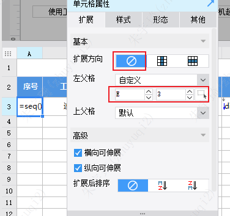
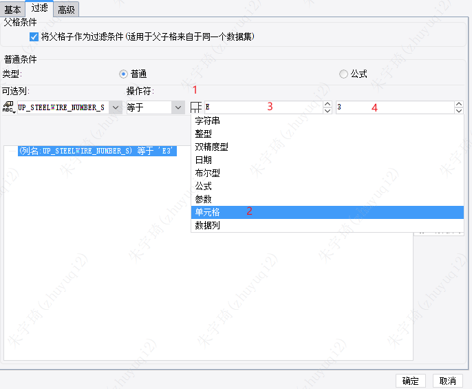
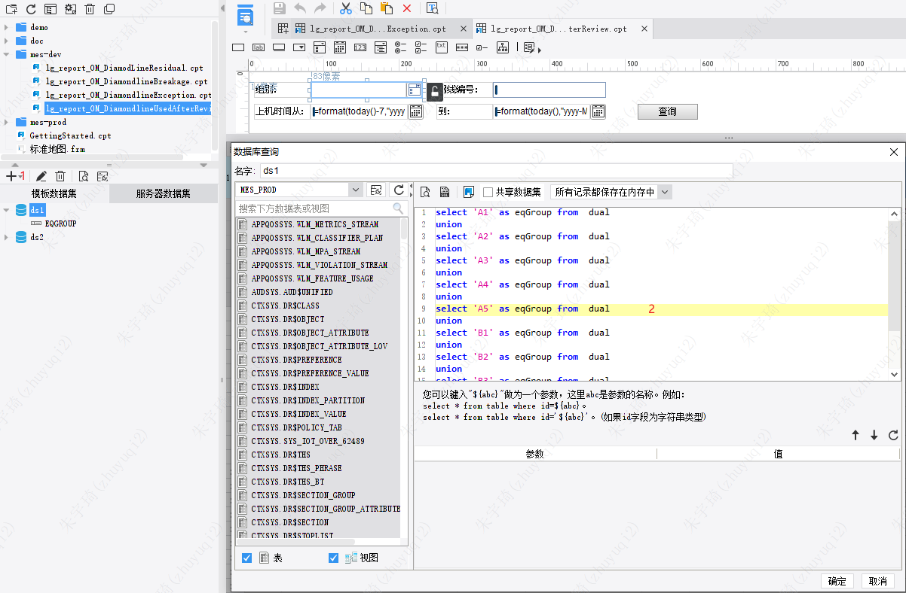
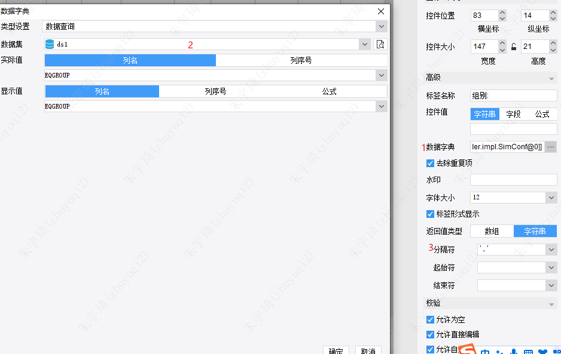
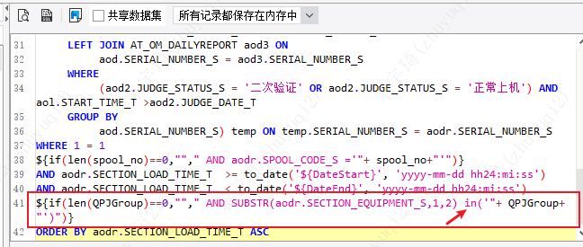
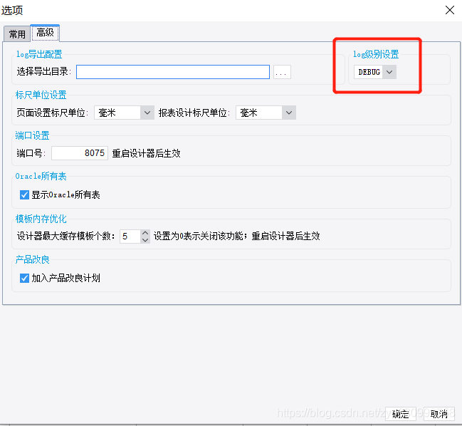
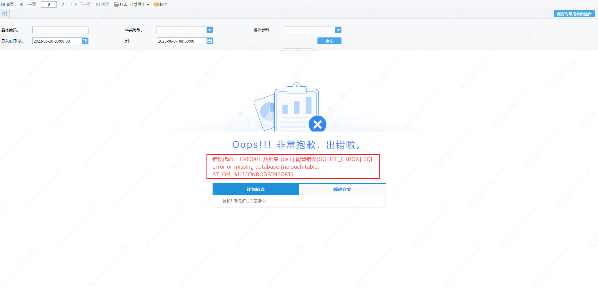
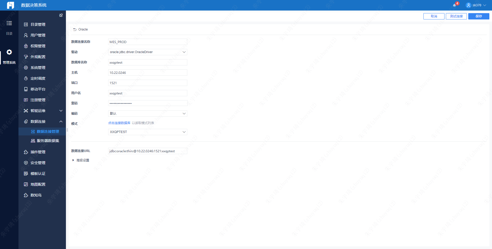

## 常见报错

### ORA-00933

报错内容：`错误代码:11300001 数据集 [diamond] 配置错误ORA-00933: SQL 命令未正确结束`。

解决方案：去掉sql语句末尾的`;`。

## 取消/合并相同值单元格

### 查询值


### 文本值



## 过滤

即利用其他单元格的查询结果，作为另一条sql的查询条件

场景：如下切割刀数要用到钢线编号的查询条件。


实现步骤：

1. 正常写切割刀数（breakCount）的sql，注意不需要写钢线编号的查询条件

```sql
SELECT count(aod.UP_STEELWIRE_NUMBER_S),aod.UP_STEELWIRE_NUMBER_S FROM AT_OM_SECTIONPROCESSEXC aos 
LEFT JOIN AT_OM_DATACOLLECTION aod ON aos.SERIAL_NUMBER_S = aod.SERIAL_NUMBER_S 
WHERE aos.BREAK_REASON_S IS NOT NULL GROUP BY aod.UP_STEELWIRE_NUMBER_S
```

2. 将要显示的字段拖到要显示的单元格

4. 双击切割刀数单元格



## 复选下拉框

1. 添加控件：


2. 创建数据源：



3. 绑定数据源：



4. 编写查询条件：



注意：注意`in`语句的写法。

## 查看帆软执行的sql

将日志级别更新为debug：



## Linux环境集成部署服务器

基于V10。

### 安装及启动

[Linux下使用Tomcat服务器部署包进行部署 - FineReport帮助文档 - 全面的报表使用教程和学习资料 (fanruan.com)](https://help.fanruan.com/finereport10.0/doc-view-2919.html)

### 部署报错处置

#### 字体

https://help.fanruan.com/finereport/doc-view-4532.html#0ddbbab8e5c10176

### 访问报表

部署后管理后台访问路径为：`http://192.168.56.10:8080/webroot/decision`

报表访问路径为：`http://192.168.56.10:8080/webroot/decision/view/report?viewlet=lg_report_OM_SiliconRodsOperateRecord.cpt`


对比正式库的路径：`http://10.22.0.231:8090/webroot/decision/view/report?viewlet=production/section/lg_report_OM_DiamondlineUsedAfterReview.cpt`

路径分析：

- `webroot`：默认工程名
- `descision`：固定路径
- `view`：固定路径
- `report`：固定路径
- `viewlet=`：固定参数
- `production`：服务器`webroot/WEB-INF/reportlets`下的路径，如果没有路径则直接写文件名。

### 数据源配置





