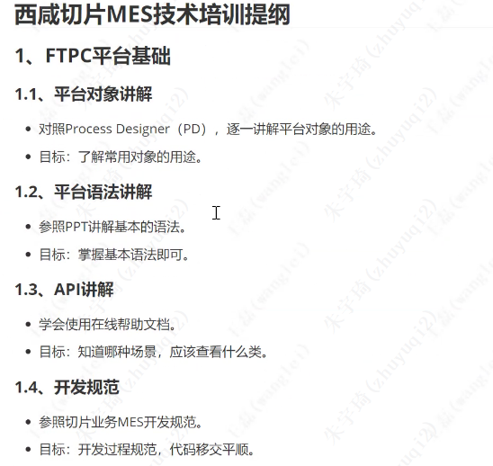
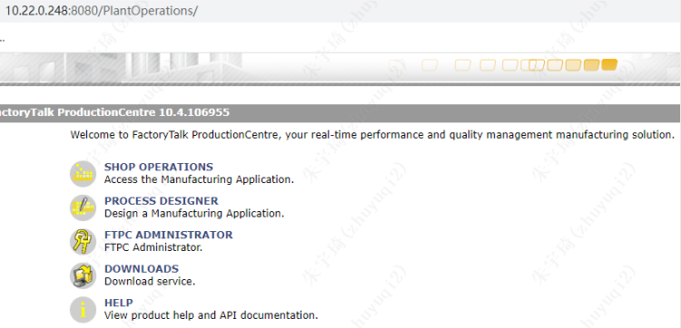
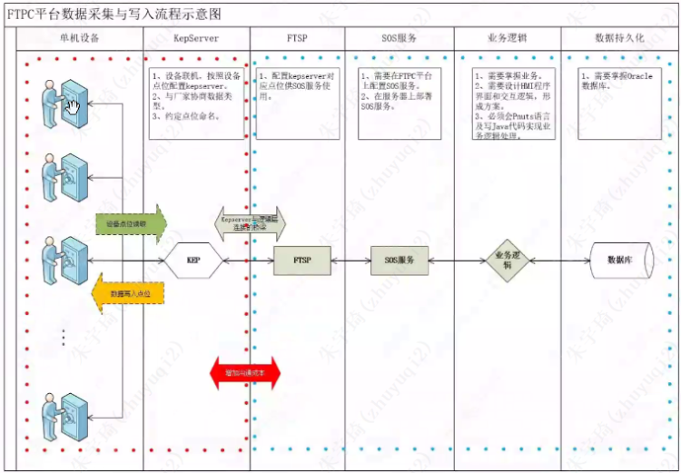

# 02.FTPC平台基础

## 1. FTPC平台及平台对象介绍

### 1.1 平台介绍

FactoryTalk ProductionCentre （FTPC）是罗克韦尔自动化的MES平台软件，基于SOA架构，J2EE技术。
ftpc开发环境地址：http://10.22.0.248:8080/PlantOperations/，下图为jboss搭建的显示页面。

- so：mes入口。点击会下载mes的jlnp文件——相当于mes的客户端软件。
- pd：开发工具。点击会下载jnlp文件——相当于mes的开发IDE。
- 不用管
- 不用管
- api文档

### 1.2 FTPC对象

FTPC平台共有64个对象（左侧）：
- Access privileges（权限，暂时无用）
- account（无用） 
- activity（新功能扩展，复用组件） 
- activity sets（无用）
- application：全局变量定义，类似spring中xml文件，如数据源配置。
- areas：平台建模对象，可以理解为车间
- At definiation：orm对象，用于创建表

### 1.3 创建AT表

## 2. PD平台语法

PD全程Process Designer，本项目组内部简称PD。
pnuts语句的`;`不是必须，但是项目中为了后期运维方便，不需要写。

## 3. PD平台API

## 4. PD平台开发规范

## 5. 实践操作 - 绘制Form

## 6. 培训视频

1. https://meeting.tencent.com/user-center/shared-record-info?id=446632fd-ce82-4bf5-8196-c420eded72e5&from=3
2. https://meeting.tencent.com/user-center/shared-record-info?id=4d42e90d-aa4c-48de-ad4d-c8f6e8301cd2&from=3