# 03.FTPC平台单表开发

## 1. 开发环境搭建

1. 安装jdk1.8。
2. 安装Eclipse

    - 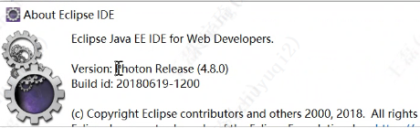

3. 从svn下载项目代码到本地。
4. Eclipse导入ftpc工程代码（注意：不需要全部项目的所有工程）：

    - 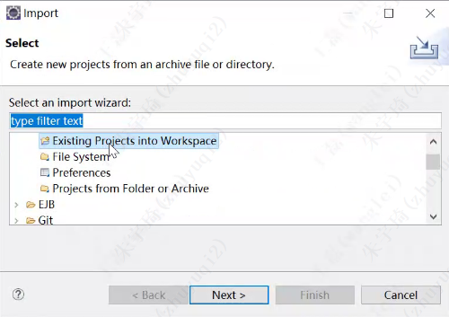

5. 添加jar包（库文件）

    - 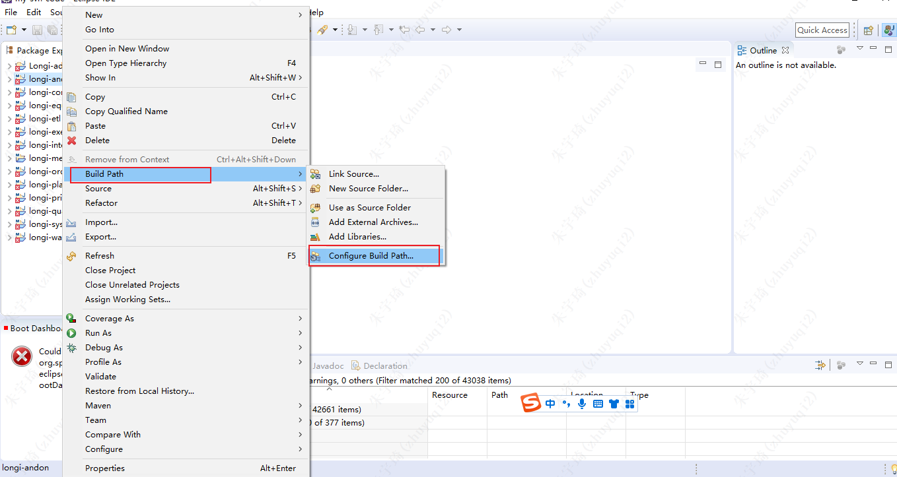
    - 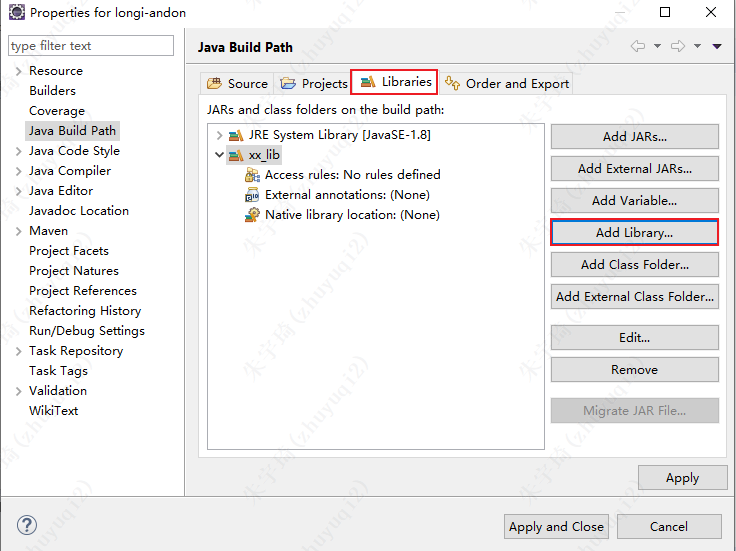
    - 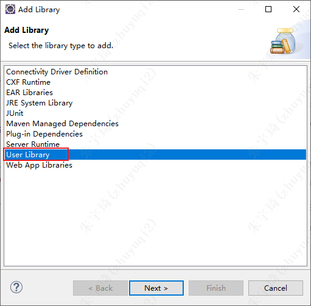
    - 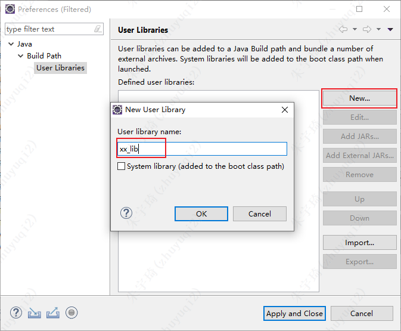
    - 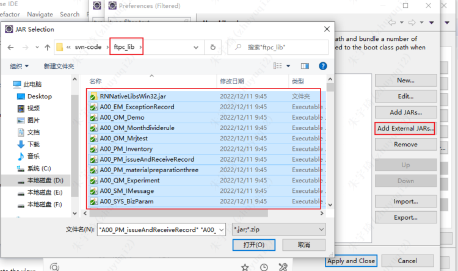
    - 

## 3. 项目代码结构

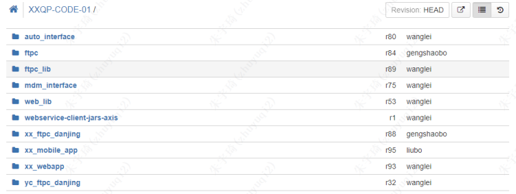

- 工程结构：
- auto_interface:自动化接口服务
- email:邮件服务
- ftpc:
   - Longi-addon:
   - longi-andon:Andon管理
   - longi-common:通用方法
   - longi-equipment:设备管理
   - longi-etl:数据ETL
   - longi-execution:
   - longi-integration:接口管理
   - longi-mes:外层工程的映射（开发时不进入本层代码）
      - longi-andon:
      - longi-common:
      - longi-equipment:
      - longi-etl:
      - longi-execution:
      - longi-integration:
      - longi-order:
      - longi-plan:
      - longi-print:
      - longi-quality:
      - longi-system:
      - longi-warehouse:
   - longi-order:切片生产
   - longi-plan:计划管理
   - longi-print:打印管理
   - longi-quality:质量管理
   - longi-system:系统管理
   - longi-test:张敏测试
   - longi-warehouse:仓储管理
- ftpc_lib:ftpc库文件
- mdm_interface:mdm：接口
- web_lib:移动端（pda）后端jar包
- webservice-client-jars-axis:移动端（pda）后端jar包
- xx_ftpc_danjing:
- xx_mobile_app:移动端（pda）前端代码
- xx_webapp:移动端（pda）后端代码
- yc_ftpc_danjing:

## 4. 实践操作 - 生成八个类

### 4.1 创建AT表

在AT_Definitions中创建表：
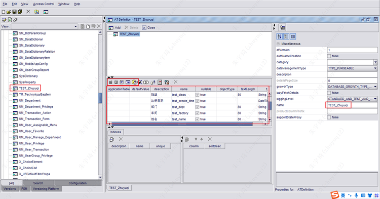

### 4.2 逆向生成八个类

1. 在Forms中找到mes_ATDefinitionAccessClassGenerator

    - 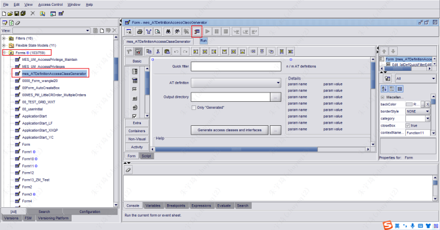
    - 快速筛选：执行下图步骤 1 - 5，如果没有刷新可以点击 6，进行缓存清除。
        - 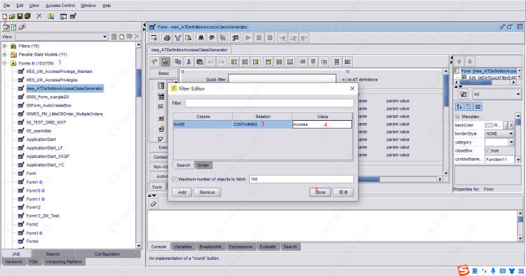

2. 选择自己的AT表，指定输出目录，进行逆向生成8各类

    - 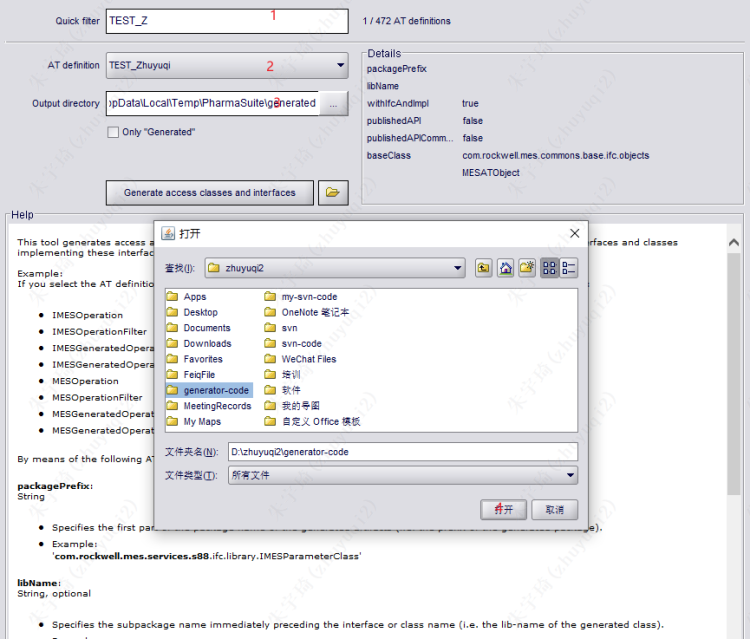
    - 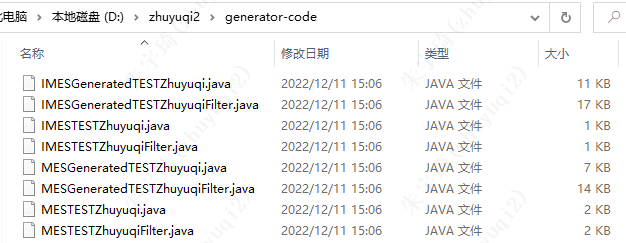

3. 修改八个类的包名。
4. 导出jar包

    - 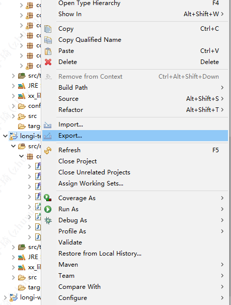
    - 
    - 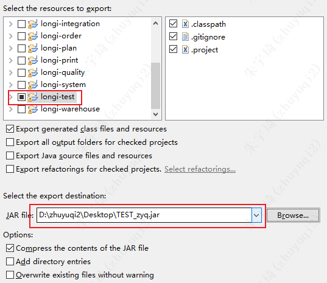

### 4.3 将jar包导入PD

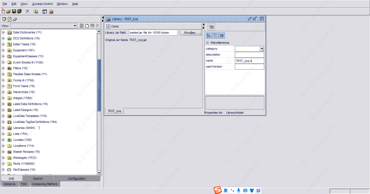

### 4.4 根据业务创建Form

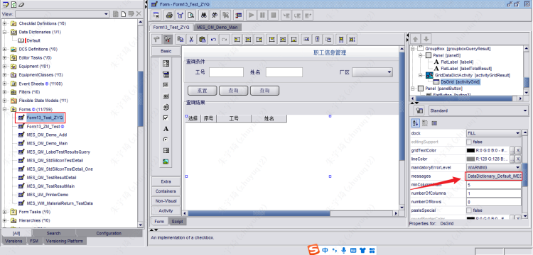

## 5. 培训视频
[https://meeting.tencent.com/user-center/shared-record-info?id=14089ed7-1361-42f8-b4bb-e046fb8f9340&from=3](https://meeting.tencent.com/user-center/shared-record-info?id=14089ed7-1361-42f8-b4bb-e046fb8f9340&from=3)
