# 04.帆软报表开发

## 1. 官方文档

[FineReport帮助文档 - 全面的报表使用教程和学习资料 (fanruan.com)](https://help.fanruan.com/finereport/)

界面介绍：
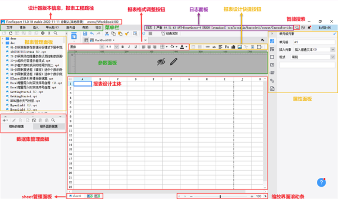

## 2. 报表样式规范

## 3. 操作步骤

### 3.1 连接数据库

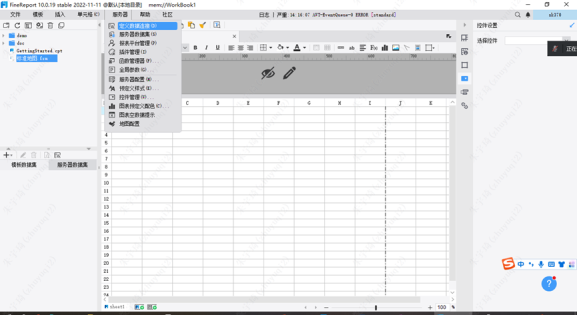<mark></mark>
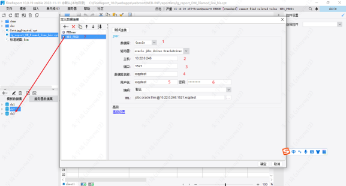

- 注意：连接名称（7）要与ds的名称（3）一致，否则别人会看不到自己的

### 3.2 开发报表

1. 添加控件：在控件区选择需要的控件，拖放至参数面板区域

    - 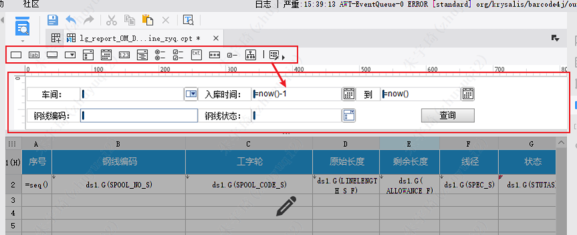

2. 编辑文本：

    - 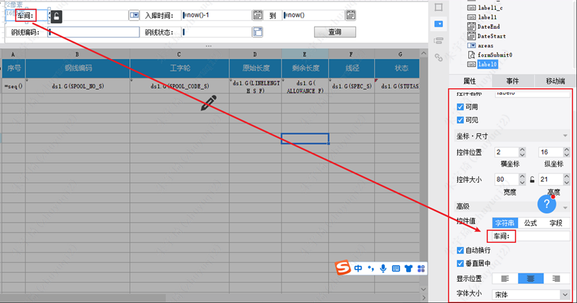

3. 下拉框绑定数据源

    - 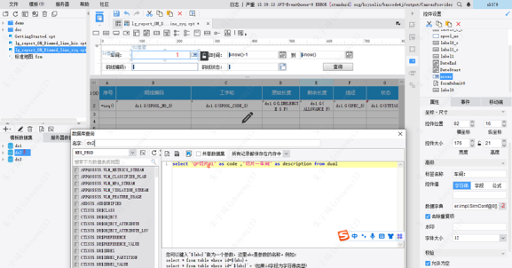
    - 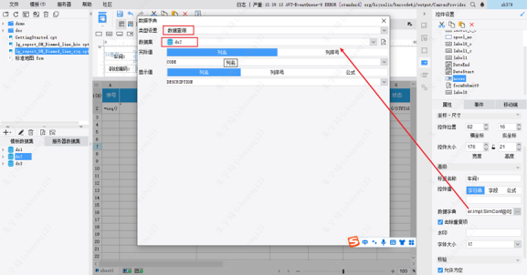

### 3.3 实践技巧

1. 实际值与显示值

    - `select 'QP切片01' as code, '切片一车间' as description form dual`
    - code是实际值，description是显示值

2. 写死的下拉框选择值：

    - 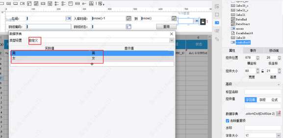

3. 选择生效：下拉框有选择则使用选择值，未选择则为空

    - 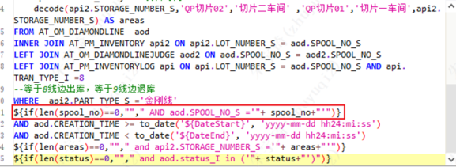

4. 将查出的数据在页面显示（拖过去）：
   
    - 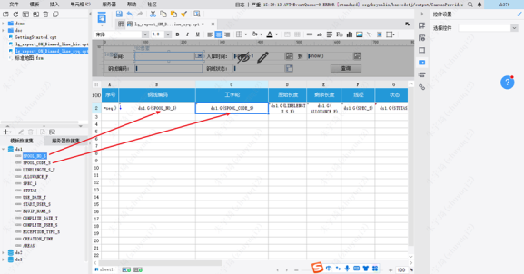

### 3.4 发布报表

即发布到mes。同将文件上传值linux服务器

- 报表服务器地址：10.22.0.231
- 本人本地报表地址：
- 远程报表地址：`/usr/local/tomcat-win64/webapps/webroot/WEB-INF/reportlets/production/section`

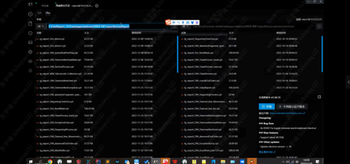

### 3.5 查看报表

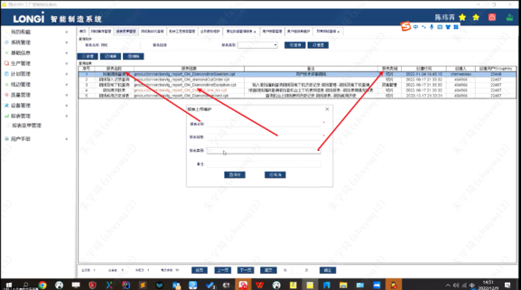

### 3.6 报表设置查看权限

系统管理》用户组报表权限
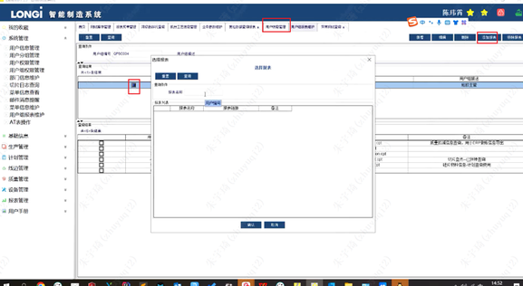

注意事项：由于开发过程中使用的query账号连接的数据库，由于权限设置，所以需要在表名前添加XXQPMES。而生产环境中连接数据库的账号权限较高，不需要该字符串，所以记得删除。
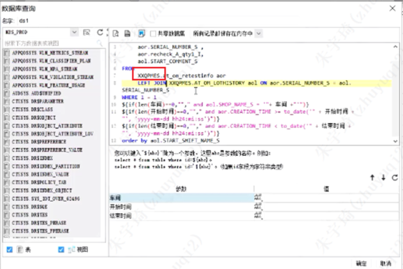

