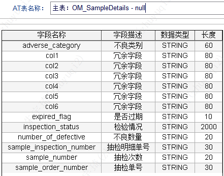
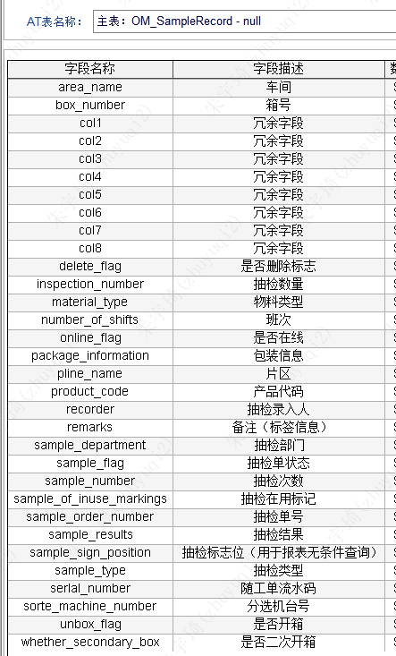

## 抽检台账

1. 生成`AT_OM_SAMPLEDETAILS` 和`AT_OM_SAMPLERECORD`8个类。
2. AT表结构：
	- 
	- 
3. 编辑MESSAGE：DataDictionary_Default_MESOMSampleRecord
	- `creationtime_ShortLabel`
	- `lastmodifiedtime_ShortLabel`
	- `seq_ShortLabel`
4. 维护下拉数据：`SAMPLE_TYPE`和`SAMPLE_STATUS`