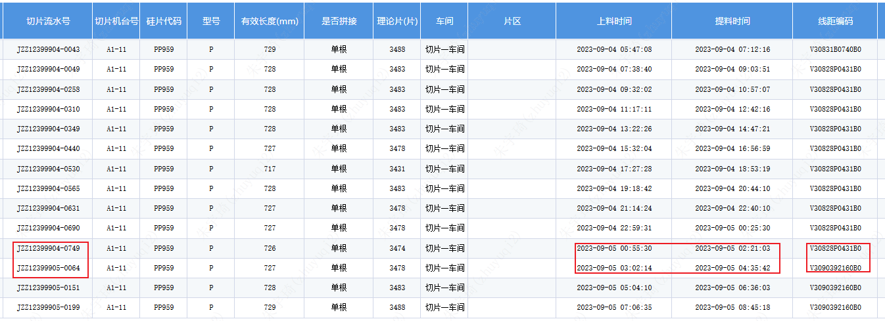

## V30828P0431B0

**获取尾刀随工单异常**

第一次上料：

第二次上料：

重复上料校验：

## V30830F13C0B0

**获取尾刀随工单异常**
## V30819732E1B0

**获取尾刀随工单异常**
## V3082982690B0

**尾刀平衡后补录**

### V30829B0880B0

**尾刀平衡后补录**
## V30808Q09A0B0

**使用耗用完钢线补录**

## V3082673190B0

