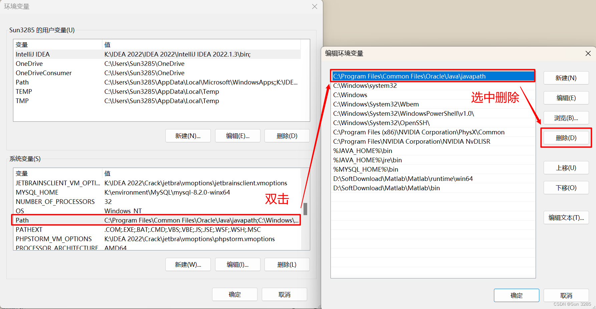

## 1. Java多版本配置

**必要性：**

1. 兼容性：不同版本Java的兼容性。
2. JAVA_HOME：maven、nacos等多个应用均需要使用JAVA_HOME。

**配置过程：**

1. 步骤一：删除系统自动配置的环境变量，防止切换失败。



2. 步骤二：在 Path 中添加两个变量：`%JAVA_HOME%\bin` 以及 `%JAVA_HOME%\jre\bin`


3. 步骤三：配置不同版本的JAVA_HOME，指向jdk安装路径。


4. 步骤四：添加 CLASSPATH 变量，值为：`.;%JAVA_HOME%\lib\dt.jar;%JAVA_HOME%\lib\tools.jar`、配置JAVA_HOME，指向其他JAVA_HOME名。


## 注意事项

### 数据类型转换

转换为包装类：

- `static Float valueOf(float f)`
- `static Float valueOf(String s)`

转换为基本数据类型：

- `static float parseFloat(String s)`
- `float floatValue()`。需要`Float`的包装类调用，`float`数调用会报错。

总结：

- `valueOf()`能转换符合格式的string和当前类。
- `parseXxxx()`只能转换符合格式的string类。

```java
public class App {
    public static void main(String[] args) throws Exception {
        String num = "3.0";
        long nums = Long.valueOf(num);
        System.out.print(nums);
    }
}
```

```bash
Exception in thread "main" java.lang.NumberFormatException: For input string: "3.0"
        at java.base/java.lang.NumberFormatException.forInputString(NumberFormatException.java:67)
        at java.base/java.lang.Long.parseLong(Long.java:711)
        at java.base/java.lang.Long.valueOf(Long.java:1163)
        at App.main(App.java:8)
```

### 空数组访问索引会报错

```java
public class App {
    public static void main(String[] args) throws Exception {
        int a[] = {};
        System.out.println(a[0]);
    }
}
```

```bash
Exception in thread "main" java.lang.ArrayIndexOutOfBoundsException: Index 0 out of bounds for length 0
        at App.main(App.java:4)
```

### 浮点数定义不定义精度

```java
public class App {
    public static void main(String[] args) throws Exception {
        double a = 0.0;
        a = 8.25917283 - 2.03849 - 3;//3.220682830000001
        // a = 8.2 - 2.3 -3;//2.8999999999999995
        System.out.println(a);
    }
}
```

### 浮点数保留小数

#### 方式一：`String.format()`

步骤：

1. 将浮点数转为`String`。
2. 使用`String.format()`处理数据。
3. 调用`Float`的`parseFloat`或`valueOf()`方法转换为浮点数

结果：四舍五入。

```java
public class App {
    public static void main(String[] args) throws Exception {
        float f1 = 456.125f;
        String s = String.format("%.2f", f1);
        System.out.println(f1);//456.125
        System.out.println(s);//456.13
        float f2 = Float.valueOf(s); 
        System.out.println(f2);//456.13
        float f3 = Float.parseFloat(s);
        System.out.println(f3);//456.13
    }
}
```

#### 方式二：`s.subString()`

步骤：

1. 将浮点数转为`String`。
2. 使用`String.format()`处理数据。
3. 调用`Float`的`parseFloat`或`valueOf()`方法转换为浮点数。

结果：直接舍去

```java
public class App {
    public static void main(String[] args) throws Exception {
        float f1 = 456.125f;
        String s = f1 + "";
        float f2 = Float.valueOf(s.substring(0,s.indexOf(".")+2));
        float f3 = Float.parseFloat(s.substring(0,s.indexOf(".")+2));
        System.out.println(f2);//456.1
        System.out.println(f3);//456.1
    }
}
```

#### 方式三：`DecimalFormat`

步骤：

1. 引入`java.text.DecimalFormat`。
2. 创建`DecimalFormat`对象，指定格式化格式。
3. 调用`DecimalFormat`对象的`format()`，得到`String`。
4. 调用`Float`的`parseFloat`或`valueOf()`方法转换为浮点数。

结果：直接舍去

```java
import java.text.DecimalFormat;

public class App {
    public static void main(String[] args) throws Exception {
        float f1 = 456.125f;
        DecimalFormat decimalFormat = new DecimalFormat("#.00");
        String ans_3 = decimalFormat.format(f1);
        System.out.println(ans_3);//456.12
        float f2 = Float.valueOf(ans_3);
        float f3 = Float.parseFloat(ans_3);
        System.out.println(f2);//456.12
        System.out.println(f3);//456.12
    }
}
```

知识点：

1. `DecimalFormat`是`NumberFormat`的一个子类，专门用于格式化十进制数据。
2. 格式化格式：  
   
3. `#`的用法，对于`new DecimalFormat("#.00")`：

   - `String ans_3 = decimalFormat.format(456.125);`得到`456.12`
   - `String ans_3 = decimalFormat.format(0.125);`得到`.12`


#### 方式四：`NumberForamt`

步骤：

1. 引入`java.text.NumberFormat`。
2. 引入`java.math.RoundingMode`。
3. 调用`NumberForamt`的`getNumberInstance()`方法，创建`NumberForamt`实例。
4. 调用`NumberForamt`实例对象的`setMaximumFractionDigits()`方法，指定小数位数。
5. 调用`NumberForamt`实例对象的`setRoundingMode()`方法，指定多余小数处理方式。
6. 调用`NumberForamt`实例对象的`format()`方法，得到`String`。
7. 调用`Float`的`parseFloat`或`valueOf()`方法转换为浮点数。

结果：根据指定方式处理小数。本例四舍五入。

```java
import java.math.RoundingMode;
import java.text.NumberFormat;

public class App {
    public static void main(String[] args) throws Exception {
        float f1 = 456.125f;
        NumberFormat numberInstance = NumberFormat.getNumberInstance();
        // 设置最大小数点位数
        numberInstance.setMaximumFractionDigits(2);
        // 设置数据舍入类型
        numberInstance.setRoundingMode(RoundingMode.HALF_UP);
        String ans_3 = numberInstance.format(f1);
        float f2 = Float.valueOf(ans_3);
        float f3 = Float.parseFloat(ans_3);
        System.out.println(f2);// 456.13
        System.out.println(f3);// 456.13
    }
}
```

#### 方式五：`DecimalFormat`

步骤：

1. 引入`java.math.BigDecimal`。
2. 创建`BigDecimal`实例。
3. 调用`BigDecimal`实例对象的`setScale()`方法，指定小数位数和多余位数处理方式。在调用`floatValue()`方法的到`float`。

结果：根据指定方式处理小数。本例四舍五入。

```java
import java.math.BigDecimal;

public class App {
    public static void main(String[] args) throws Exception {
        float f1 = 456.125f;
        BigDecimal bigDecimal = new BigDecimal(f1);
        float ans_3 = bigDecimal.setScale(2, BigDecimal.ROUND_HALF_UP).floatValue();
        System.out.println(ans_3);//456.13
    }
}
```

## 常用开发

### 定时服务

[在Java Web项目中添加定时任务 - 东窗凝残月 - 博客园 (cnblogs.com)](https://www.cnblogs.com/dcncy/p/8205065.html)

## 读取输入

### 读取多行输入

```java
Scanner in = new Scanner(System.in);
//int human = Integer.parseInt(in.nextLine());
int human = in.nextInt();
in.nextLine();
String humanName = in.nextLine();
//int ticketNum = Integer.parseInt(in.nextLine());
int ticketNum = in.nextInt();
in.nextLine();
String tickets = in.nextLine();
```


> 核心：`in.nextLine();`表示开始读取下一行内容
