## 第 14 章 JDBC 和数据库连接池

> - 要求：学习了 Mysql（sql 语句）之后

### 14.1 JDBC 概述

#### 14.1.1 JDBC 基本介绍

1. 含义：Java DataBase Connectivity，Java 数据库连接，用于执行 SQL 语句的 JavaAPI，由类和接口组成，提供了个可以构建更高级工具和接口去访问数据库的基准。
2. 作用：java 程序员使用 JDBC，可以连接任何提供了 JDBC 驱动程序的数据库系统，从而完成对数据库的各种操作。JDBC 为访问不同的数据库提供了统一的接口，为使用者屏蔽了细节问题。
3. 基本原理图：
   - 
4. 模拟 JDBC 接口

```java
public interface JdbcInterface {
    //连接
    public Object getConnection() ;
    //crud
    public void crud();
    //关闭连接
    public void close();
}
```

```java
public class MysqlJdbcImpl implements  JdbcInterface{
    @Override
    public Object getConnection() {
        System.out.println("得到 mysql 的连接");
        return null;
    }

    @Override
    public void crud() {
        System.out.println("完成 mysql 增删改查");
    }

    @Override
    public void close() {
        System.out.println("关闭 mysql 的连接");
    }
}
```

#### 14.1.2 JDBC API

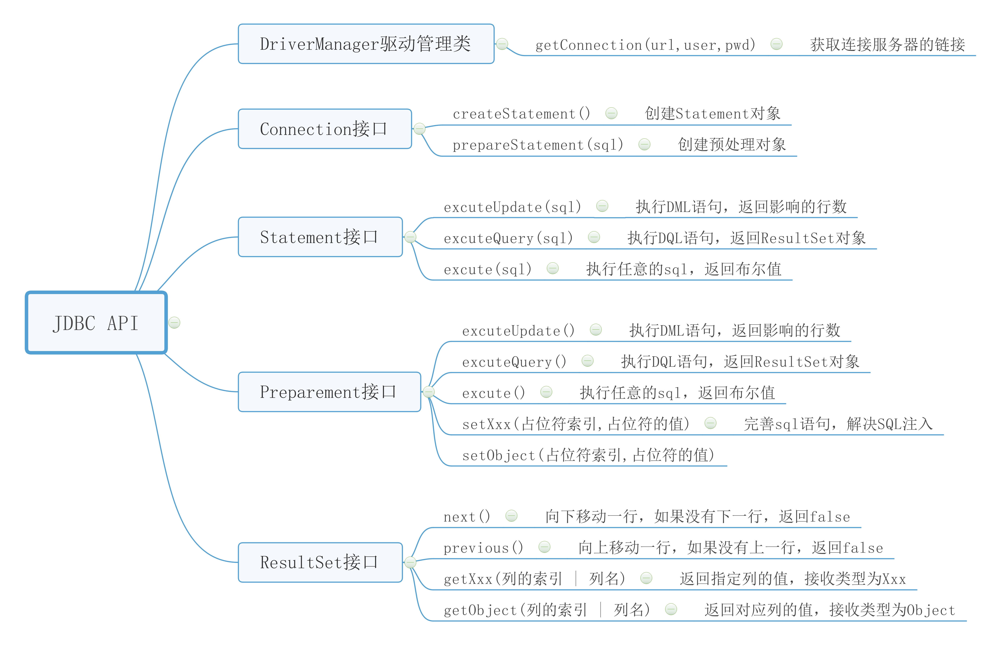

- 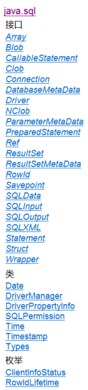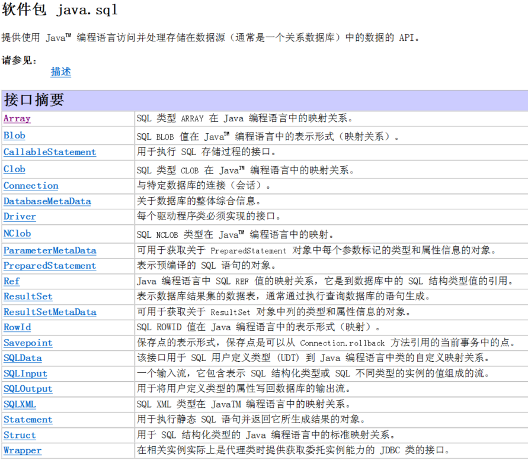
- 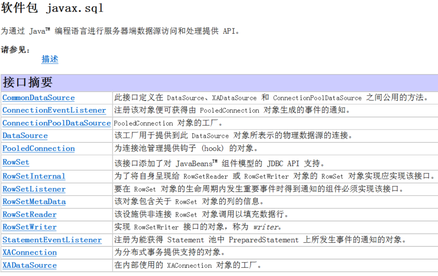

#### 14.1.3 MySQLJDBC

1. 版本支持：
   - 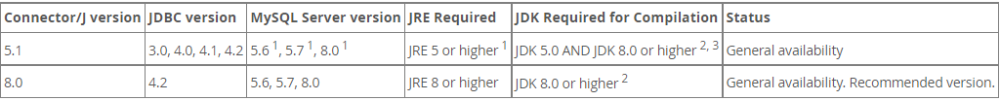
2. 下载地址：
   - 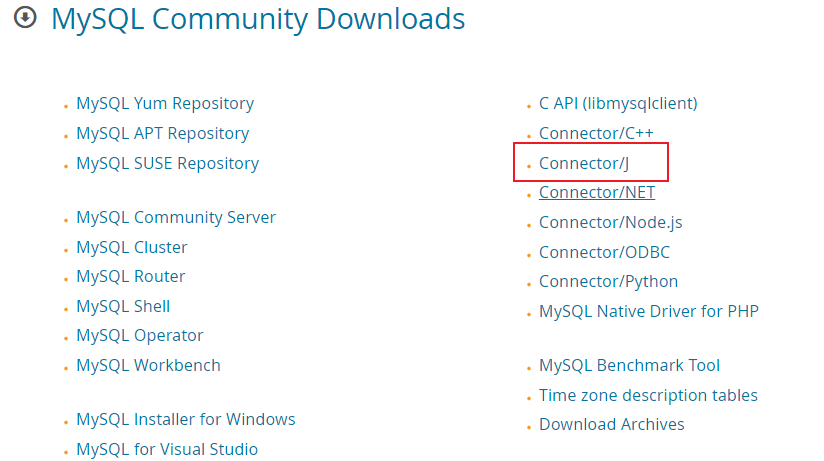
   - 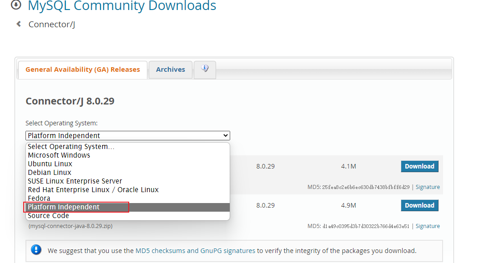

#### 14.1.3 JDBC 程序编写步骤

> - 前置工作：在项目文件目录中加载对应数据库的 JDBC 工具包
> - 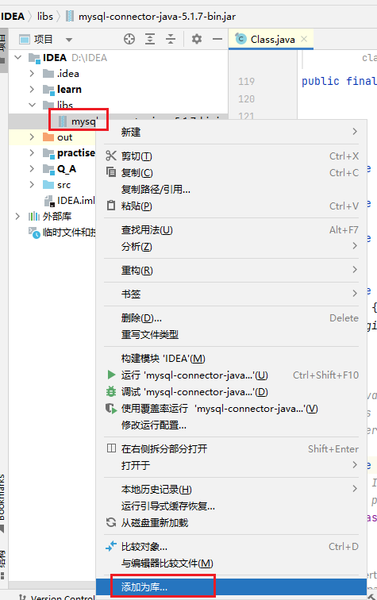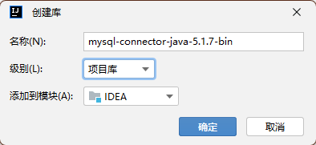

1. 注册驱动——加载 Driver 类
   - 有异常问题
2. 获取连接——得到 Connection
3. 执行 CRUD——发送 sql 语句（字符串）给 mysql 执行
4. 释放资源——关闭相关连接

```java
//1. 注册驱动——加载Driver类
Driver driver = new com.mysql.jdbc.Driver();
//2. 获取连接——得到Connection
String url = "jdbc:mysql://localhost:13306/db01";

Properties properties = new Properties();
properties.setProperty("user","root");
properties.setProperty("password","dimitre123");

Connection connect = driver.connect(url, properties);
//3. 执行CRUD——发送sql语句（字符串）给mysql执行
String sql = "crud的SQL语句";
//3.1 statement对象用于向数据库发送sql语句
Statement statement = connect.createStatement();
int rows = statement.executeUpdate(sql);
//4. 释放资源——关闭相关连接
statement.close();
connect.close();
```

- 解读：
   - url：
      - `jdbc:mysql`：使用的连接协议
      - `localhost`：连接地址（数据库地址）
      - `13306`：数据库端口号
      - `db01`：数据库名称
      - mysql连接的本质是socket连接
   - properties对象：
      - `setProperty()`的`user`、`password`是规定好的
   - `excuteUpdate(sql)`：dml语句时，返回的是影响的行数。</div>

### 14.2 获取数据库连接（connection）的 5 种方式

#### 14.2.1 使用 Driver 类的`connect()`方法

```java
//1. 注册驱动——加载Driver类
Driver driver = new com.mysql.jdbc.Driver();
//2. 获取连接——得到Connection
String url = "jdbc:mysql://localhost:13306/db01";

Properties properties = new Properties();
properties.setProperty("user","root");
properties.setProperty("password","dimitre123");

Connection connect = driver.connect(url, properties);
```

- 存在问题：Driver()是第三方工具，依赖强、灵活性差，且属于静态加载。

#### 14.2.2 使用反射获取 Driver，再使用`connect()`方法

```java
//1. 注册驱动——加载Driver类
Class<?> aClass = Class.forName("com.mysql.jdbc.Driver");
Driver driver = (Driver)aClass.newInstance();
//2. 获取连接——得到Connection
String url = "jdbc:mysql://localhost:13306/db01";

Properties properties = new Properties();
properties.setProperty("user","root");
properties.setProperty("password","dimitre123");

Connection connect = driver.connect(url, properties);
```

- 好处：动态加载，减少依赖性，更加灵活。

#### 14.2.3 使用 DriverManager 注册驱动

```java
//1. 注册驱动——加载Driver类
Class<?> aClass = Class.forName("com.mysql.jdbc.Driver");
Driver driver = (Driver)aClass.newInstance();
//2. 获取连接——得到Connection
String url = "jdbc:mysql://localhost:13306/db01";

Properties properties = new Properties();
properties.setProperty("user","root");
properties.setProperty("password","dimitre123");

DriverManager.registerDriver(driver);//注册Driver驱动

Connection connection = DriverManager.getConnection(url, properties);
```

#### 14.2.4 Class.forName 自动完成注册驱动，简化代码

```java
//1. 注册驱动——加载Driver类
Class.forName("com.mysql.jdbc.Driver");
//2. 获取连接——得到Connection
String url = "jdbc:mysql://localhost:13306/db01";

Properties properties = new Properties();
properties.setProperty("user","root");
properties.setProperty("password","dimitre123");

Connection connection = DriverManager.getConnection(url, properties);
```

- mysql 实现 java.sql 的 Driver 接口时，创建了静态代码块，自动执行`DriverManager.registerDriver(new Driver());`
- 不写`Class.forName("com.mysql.jdbc.Driver");`也会正常运行，是因为 jdk1.5 之后使用了 jdbc4，会自动调用`……\libs\mysql-connector-java-5.1.37-bin.jar!\META-INF\services\java.sql.Driver`文件中的类名（`com.mysql.jdbc.Driver`）去注册

#### 14.2.5 使用配置文件读取连接地址等信息

```properties
user=root
password=dimitre123
url=jdbc:mysql://localhost:13306/hsp_db02
driver=com.mysql.jdbc.Driver
```

```java
Properties properties = new Properties();
properties.load(new FileInputStream("src\\mysql.properties"));

String user = properties.getProperty("user");
String password = properties.getProperty("password");
String driver = properties.getProperty("driver");
String url = properties.getProperty("url");
//1. 注册驱动——加载Driver类
Class.forName(driver);

//2. 获取连接——得到Connection
Connection connection = DriverManager.getConnection(url, user,password);
```

### 14.3 结果集（ResultSet）

1. 含义：执行查 DQL 语句返回的查询结果。
2. ResultSet 对象保持一个光标指向其当前的数据行，最初光标位于第一行之前，next 方法将光标移动到下一行，并且由于再 ResultSet 对象中没有更多行时返回 false。可以使用 while 循环遍历。
3. 使用：`ReultSet resultSet = statement.excuteQuery(sql);`
   - 关闭结果集：`resultSet.close();`
4. 方法：
5. 底层：ResultSet 是个接口，底层的数据是表是一个 ArrayList
   - 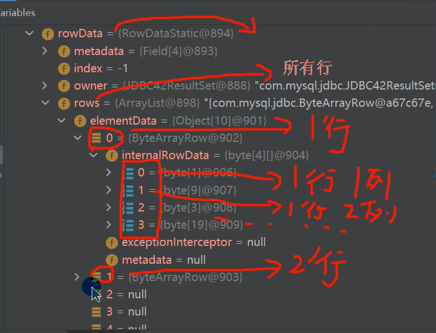

### 14.4 SQL 注入

1. 含义：利用某些系统没有对用户输入的数据进行充分的检查，而在用户输入数据中注入非法的 SQL 语句段或命令，恶意攻击数据库。
2. 访问数据库、执行 sql 语句的三种方法：
   - `Statement`对象【存在 sql 注入问题】
   - `PreparedStatement`对象【预处理】
   - `CallableStatement`对象【存储过程】
3. 万能用户名：`1' or`，万能密码：`or '1'='1'`

### 14.5 PreparedStatement 预处理的使用

1. PreparedStatement 是 Statement 的子接口，可以使用 Statement 的方法（怎么使用的，Statement 的方法都是抽象的，是因为加载了 JDBCjar 包的原因吗？）
   - 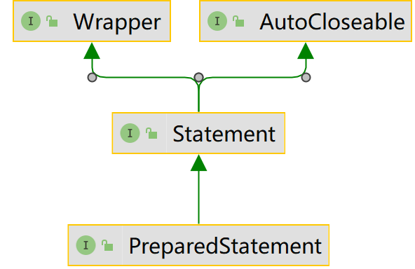
2. 语法变化：
   - 书写 sql 语句（定义 sql 字符串）：使用`?`代替参数值，作为占位符。
     - `String sql = "select name , pwd from admin where name =? and pwd = ?";`
   - 创建 PreparedStatement 对象：`PreparedStatement preparedStatement = connection.prepareStatement(sql);`
     - Statement 此时不需要传入 sql 语句
   - 使用 PreparedStatement 的对象给 sql 语句的占位符赋值：使用`setXxx(int n, String str)`
     - n 表示`?`在 sql 语句中从左至右出现的次序，从 1 开始。
     - str 表示参数值。
   - 调用`excuteUpade()`或`excuteQuery()`方法，返回结果集。不需要再传入 sql 语句当作参数。
3. 预处理好处：
   - 不再使用`+`拼接 sql 语句，减少了语法错误。
   - 有效避免了 sql 注入问题
   - 减少了编译次数，提高了效率

### 14.6 JDBC 事务

#### 14.6.1 JDBC 事务介绍

1. JDBC 创建一个 Connection 对象后，默认是自动提交事务，执行成功后不能回滚。
2. 调用 Connetcion 对象的`setAutoCommit(false)`可以取消自动提交事务。
3. 调用 Connetcion 对象的`commit()`可以提交事务。
4. 调用 Connetcion 对象的`rollback()`可以回滚事务。

#### 14.6.2 应用场景

1. 银行转账。

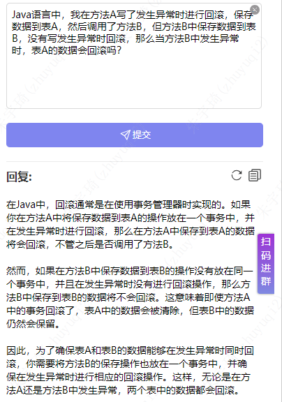

### 14.7 批处理（batch）

#### 14.7.1 批处理介绍

1. java 的批量更新机制允许多条语句一次性提交给数据库处理，提高处理效率。相当于公交车拉一车人。
2. 批处理方法（statement 对象调用）：
   - `addBatch()`：添加需要批处理的 SQL 语句或参数
   - `excuteBatch()`：执行批处理语句
   - `clearBatch()`：清空批处理包的语句
3. 使用：
   - url 添加参数`?rewriteBatchedStatements=true`

```java
Connection connection = JDBCUtils.getConnection();
String sql = "insert into admin2 values(null, ?, ?)";
PreparedStatement preparedStatement = connection.prepareStatement(sql);
for (int i = 0; i < 5000; i++) {//5000执行
    preparedStatement.setString(1, "jack" + i);
    preparedStatement.setString(2, "666");
    preparedStatement.addBatch();
    if((i + 1) % 1000 == 0) {
        preparedStatement.executeBatch();
        preparedStatement.clearBatch();
    }
}
preparedStatement.executeBatch();//避免没到1000条的数据存在遗漏
JDBCUtils.close(null, preparedStatement, connection);
```

4. 源码分析：
   - 执行`addBatch()`会创建 ArrayList - elementData => Object[]
   - elementData => Object[] 就会存放我们预处理的 sql 语句
   - 当 elementData 满后,就按照 1.5 扩容
   - 当添加到指定的值后，就 executeBatch 批量处理会减少我们发送 sql 语句的网络开销，而且减少编译次数，因此效率提高

### 14.8 数据库连接池

#### 14.8.1 传统方式连接数据库的问题

1. 传统 JDBC 连接数据库使用 DriverManager 来获取，每次向数据库简历连接时，需要将 Connection 加载到内存中，再验证 ip 地址、用户名、密码（0.05~1s 时间），频繁进行数据库连接操作会占用系统资源，导致服务器崩溃。
2. 每次连接数据库操作后，使用结束都应断开，如果程序出现异常而未关闭，将导致数据库内存泄漏，导致数据库重启
3. 传统连接方式，不能控制创建的连接数量，如果连接过多，也可能导致内存泄漏，mysql 崩溃
4. 使用数据库连接池（connection pool）技术，可以解决上述问题。

#### 14.8.2 数据库连接池介绍

1. 预先再缓冲池中放入一定数量的连接，当需要建立数据库连接时，只需从“缓冲池”取出连接，使用完毕后放回到“缓冲池”
2. 数据库连接池负责分配、管理、释放数据库的连接，它允许用用程序重复使用一个现有的数据库连接，而不用重新建立。
3. 当应用程序向连接池请求的连接数量超过最大连接数量时，这些请求会被加入到等待队列中。
4. JDBC 的数据库连接池使用`javax.sql.DataSource`表示，DataSource 是一个接口，该接口由第三方提供实现【提供.jar】
5. 数据库连接池种类：
   - C3P0：速度较慢，稳定性好
   - DBCP：速度较快，但不稳定
   - Proxool：有监控连接池状态的功能，稳定性不如 C3P0
   - BoneCP：速度快
   - Druid（德鲁伊）：阿里提供，具有 DBCP、C3P0、Proxool 优点

#### 14.8.3 C3P0 使用

1. 将 c3p0 的 jar 包添加到开发环境，同 jdbc。
2. 连接方式一：

```java
//1. 创建一个数据源对象
ComboPooledDataSource comboPooledDataSource = new ComboPooledDataSource();
//2. 通过配置文件mysql.properties 获取相关连接的信息
Properties properties = new Properties();
properties.load(new FileInputStream("src\\mysql.properties"));
String user = properties.getProperty("user");
String password = properties.getProperty("password");
String url = properties.getProperty("url");
String driver = properties.getProperty("driver");

//给数据源 comboPooledDataSource 设置相关的参数
comboPooledDataSource.setDriverClass(driver);
comboPooledDataSource.setJdbcUrl(url);
comboPooledDataSource.setUser(user);
comboPooledDataSource.setPassword(password);

//设置初始化连接数
comboPooledDataSource.setInitialPoolSize(10);
//最大连接数
comboPooledDataSource.setMaxPoolSize(50);
//测试连接池的效率, 测试对mysql 5000次操作
for (int i = 0; i < 5000; i++) {
    Connection connection = comboPooledDataSource.getConnection();
    connection.close();
}
```

3. 连接方式二：使用 c3p0 的配置文件（整合了登录名、用户密码、连接地址、设置了连接数量等），放到 src 路径下

```xml
<c3p0-config>
  <named-config name="hello"> <!-- 数据源名称，可以任意 -->
    <!-- 驱动类，跟数据库相关 -->
    <property name="driverClass">com.mysql.jdbc.Driver</property>
    <!-- url-->
    <property name="jdbcUrl">jdbc:mysql://127.0.0.1:3306/girls</property>
    <!-- 用户名 -->
    <property name="user">root</property>
    <!-- 密码 -->
    <property name="password">root</property>
    <!-- 每次增长的连接数-->
    <property name="acquireIncrement">5</property>
    <!-- 初始的连接数 -->
    <property name="initialPoolSize">10</property>
    <!-- 最小连接数 -->
    <property name="minPoolSize">5</property>
    <!-- 最大连接数 -->
    <property name="maxPoolSize">10</property>
    <!-- 可连接的最多的命令对象数 -->
    <property name="maxStatements">5</property>
    <!-- 每个连接对象可连接的最多的命令对象数 -->
    <property name="maxStatementsPerConnection">2</property>
  </named-config>
</c3p0-config>
```

```java

ComboPooledDataSource comboPooledDataSource = new ComboPooledDataSource("hello");
//测试5000次连接mysql
for (int i = 0; i < 500000; i++) {
    Connection connection = comboPooledDataSource.getConnection();
    connection.close();
}
```

#### 14.8.4 Druid 使用


1. 将 Druid 的 jar 包添加到开发环境，同 jdbc。

```properties
#key=value
driverClassName=com.mysql.jdbc.Driver
url=jdbc:mysql://localhost:3306/girls?rewriteBatchedStatements=true
#url=jdbc:mysql://localhost:3306/girls
username=root
password=root
#initial connection Size
initialSize=10
#min idle connecton size
minIdle=5
#max active connection size
maxActive=20
#max wait time (5000 mil seconds)
maxWait=5000
```

```java
Properties properties = new Properties();
properties.load(new FileInputStream("src\\druid.properties"));
DataSource dataSource = DruidDataSourceFactory.createDataSource(properties);
for (int i = 0; i < 500000; i++) {
    Connection connection = dataSource.getConnection();
    connection.close();
}
```

### 14.9 Apache 之 DBUtils

#### 14.9.1 基本介绍

1. commons-dbutils 是 Apache 组织提供的一个开源 JDBC 工具类库，它是对 JDBC 的封装。简化 Dao 层的操作。
2. 树结构：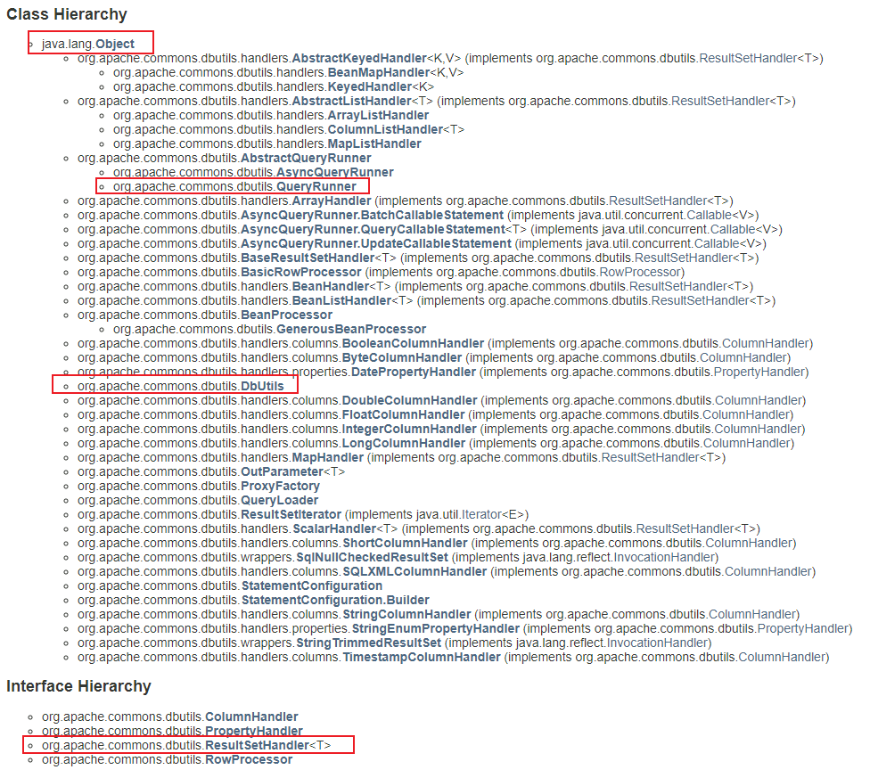
3. 作用：将数据库查询得到的数据放到一个 ArrayList 中，即使连接关闭了，也能使用这些数据。（正常情况下连接关闭，就访问不到这些数据）。
4. 使用步骤：
   - 得到连接（使用数据库连接池等方式）
   - 将 common-dbutils 加入库文件
   - 创建 QueryRunner 的对象`QueryRunner queryRunner = new QueryRunner()`
   - 执行 DQL，返回 ArrayList 结果集
     - 返回多个对象（查询多行）：queryRunner.query(connection, sql, new BeanListHandler<>(类名.class)
     - 返回单个对象（查询单行）：queryRunner.query(connection, sql, new BeanHandler<>(类名.class)
     - 返回单行单列对象（对象类型为 Object）：queryRunner.query(connection, sql, new ScalarHandler<>()
   - 执行 DML，返回受影响的行数。
     - queryRunner.update(connection, sql, ?的值)
5. 底层分析：
   - 调用 query()方法时，底层会创建 PreparedStatement、ResultSet、 一个接收结果的 Object 对象
   - 底层调用 handle(查询结果)，利用反射机制将查询到的结果传入到 Object 对象里
   - 执行完毕关闭结果集、statement
6. ResultSetSHandler 接口实现类的主要作用：ResultSetSHandler 用于处理 java.sql.ResultSet，将数据按要求转换为另一种形式。
   - 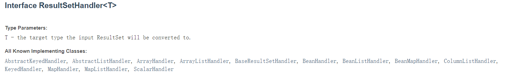
   - 

#### 14.9.2 模仿 dbutils，理解原理

```java
public ArrayList<Actor> testSelectToArrayList() {
    //1. 得到连接
    Connection connection = null;
    //2. 组织一个sql
    String sql = "select * from actor where id >= ?";
    PreparedStatement preparedStatement = null;
    ResultSet set = null;
    ArrayList<Actor> list = new ArrayList<>();//创建ArrayList 对象,存放actor 对象
    //3. 创建PreparedStatement 对象
    try {
        connection = JDBCUtilsByDruid.getConnection();
        preparedStatement = connection.prepareStatement(sql);
        preparedStatement.setInt(1, 1);//给?号赋值
        //执行, 得到结果集
        set = preparedStatement.executeQuery();
        //遍历该结果集
        while (set.next()) {
            int id = set.getInt("id");
            String name = set.getString("name");//getName()
            String sex = set.getString("sex");//getSex()
            Date borndate = set.getDate("borndate");
            String phone = set.getString("phone");
            //把得到的resultset 的记录，封装到Actor 对象，放入到list 集合
            list.add(new Actor(id, name, sex, borndate, phone));
        }
        System.out.println("list 集合数据=" + list);
        for(Actor actor : list) {
            System.out.println("id=" + actor.getId() + "\t" + actor.getName());
        }
    } catch (SQLException e) {
        e.printStackTrace();
    } finally {
        //关闭资源
        JDBCUtilsByDruid.close(set, preparedStatement, connection);
    }
    //因为ArrayList 和connection 没有任何关联，所以该集合可以复用.
    return list;
}
```

### 14.10 Dao 和增删改查方法

#### 14.10.1 Dao 层及 BasicDao：与数据库的相关操作

1. Dao：data access object：数据访问对象
   - Dao 中的方法均为”单精度方法“——一个方法只干一件事。
   - Service 层中的方法可以是”非单精度方法“，一个方法可以干好几件事。
   - 如 Dao 中的添加只是添加，Service 层中的添加还有先查询（判断是否重复）的功能，然后才是添加。
2. 根据数据访问对象设计的类叫 Dao，高度抽象的该类叫 BasicDao。
3. 在 BasicDao 的基础上，设计继承自其的实现特定与数据库操作的 Dao 类，可以更好完成开发任务。

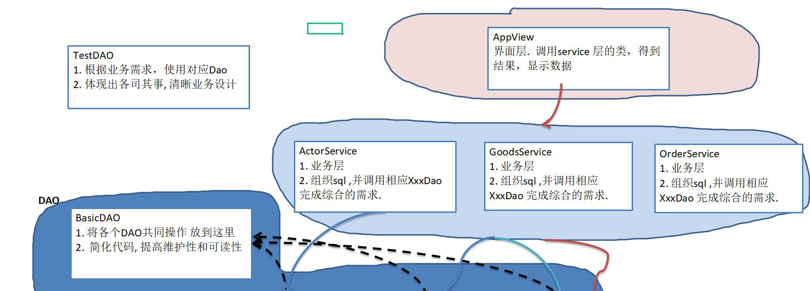
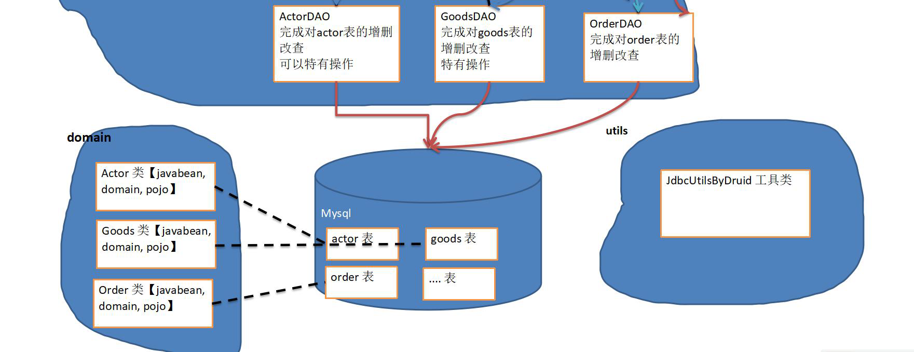

4. BasicDao：可以设计成类、也可以设计成接口

#### 14.10.2 domain/JavaBean/pojo 层：数据库对应的 java 类

#### 14.10.3 service 层：具体业务层

#### 14.10.3 view 层：页面层

### 14.11 封装 JDBC 工具类及使用

#### 14.11.1 封装数据库连接功能

```java
public class JDBCUtils {
    //定义相关的属性(4个), 因为只需要一份，因此，我们做出static
    private static String user; //用户名
    private static String password; //密码
    private static String url; //url
    private static String driver; //驱动名

    //在static代码块初始化
    static {

        try {
            Properties properties = new Properties();
            properties.load(new FileInputStream("src\\mysql.properties"));
            user = properties.getProperty("user");
            password = properties.getProperty("password");
            url = properties.getProperty("url");
            driver = properties.getProperty("driver");
        } catch (IOException e) {
            throw new RuntimeException(e);

        }
    }

    //连接数据库, 返回Connection
    public static Connection getConnection() {

        try {
            return DriverManager.getConnection(url, user, password);
        } catch (SQLException e) {
            throw new RuntimeException(e);
        }
    }

    //关闭相关资源
    /*
        1. ResultSet 结果集
        2. Statement 或者 PreparedStatement
        3. Connection
        4. 如果需要关闭资源，就传入对象，否则传入 null
     */
    public static void close(ResultSet set, Statement statement, Connection connection) {
        try {
            if (set != null) {
                set.close();
            }
            if (statement != null) {
                statement.close();
            }
            if (connection != null) {
                connection.close();
            }
        } catch (SQLException e) {
            throw new RuntimeException(e);
        }
    }
}
```

```properties
user=root
password=dimitre123
url=jdbc:mysql://localhost:13306/hsp_db02
driver=com.mysql.jdbc.Driver
```

#### 14.11.2 使用

```java
import org.junit.jupiter.api.Test;
import java.sql.*;

public class JDBCUtils_Use {
    @Test
    public void testSelect() {//select
        Connection connection = null;
        String sql = "select * from actor where id = ?";
        PreparedStatement preparedStatement = null;
        ResultSet set = null;
        try {
            connection = JDBCUtils.getConnection();
            preparedStatement = connection.prepareStatement(sql);
            preparedStatement.setInt(1, 5);
            set = preparedStatement.executeQuery();
            while (set.next()) {
                int id = set.getInt("id");
                String name = set.getString("name");
                String sex = set.getString("sex");
                Date borndate = set.getDate("borndate");
                String phone = set.getString("phone");
                System.out.println(id + "\t" + name + "\t" + sex + "\t" + borndate + "\t" + phone);
            }
        } catch (SQLException e) {
            e.printStackTrace();
        } finally {
            JDBCUtils.close(set, preparedStatement, connection);
        }
    }

    @Test
    public void testDML() {//insert , update, delete
        Connection connection = null;
        String sql = "update actor set name = ? where id = ?";
        PreparedStatement preparedStatement = null;
        try {
            connection = JDBCUtils.getConnection();
            preparedStatement = connection.prepareStatement(sql);
            preparedStatement.setString(1, "周星驰");
            preparedStatement.setInt(2, 4);
            preparedStatement.executeUpdate();
        } catch (SQLException e) {
            e.printStackTrace();
        } finally {
            JDBCUtils.close(null, preparedStatement, connection);
        }
    }
}
```

#### 14.11.3 封装成 Druid 工具类——将连接功能使用线程池实现

```java
public class JDBCUtilsByDruid {
    private static DataSource ds;
    static {
        Properties properties = new Properties();
        try {
            properties.load(new FileInputStream("src\\druid.properties"));
            ds = DruidDataSourceFactory.createDataSource(properties);
        } catch (Exception e) {
            e.printStackTrace();
        }
    }
    public static Connection getConnection() throws SQLException {
        return ds.getConnection();
    }
    public static void close(ResultSet resultSet, Statement statement, Connection connection) {
        try {
            if (resultSet != null) {
                resultSet.close();
            }
            if (statement != null) {
                statement.close();
            }
            if (connection != null) {
                connection.close();
            }
        } catch (SQLException e) {
            throw new RuntimeException(e);
        }
    }
}
```

```properties
#key=value
driverClassName=com.mysql.jdbc.Driver
url=jdbc:mysql://localhost:3306/girls?rewriteBatchedStatements=true
#url=jdbc:mysql://localhost:3306/数据库名?rew……表示批处理
username=root
password=root
#initial connection Size
initialSize=10
#min idle connecton size
minIdle=5
#max active connection size
maxActive=20
#max wait time (5000 mil seconds)
maxWait=5000
```

#### 14.11.4 使用 Druid 工具类

```java
public class JDBCUtilsByDruid_USE {
    public void testSelect() {
        System.out.println("使用 druid方式完成");
        //1. 得到连接
        Connection connection = null;
        //2. 组织一个sql
        String sql = "select * from actor where id >= ?";
        PreparedStatement preparedStatement = null;
        ResultSet set = null;
        //3. 创建PreparedStatement 对象
        try {
            connection = JDBCUtilsByDruid.getConnection();
            System.out.println(connection.getClass());//运行类型 com.alibaba.druid.pool.DruidPooledConnection
            preparedStatement = connection.prepareStatement(sql);
            preparedStatement.setInt(1, 1);//给?号赋值
            //执行, 得到结果集
            set = preparedStatement.executeQuery();
            while (set.next()) {
                int id = set.getInt("id");
                String name = set.getString("name");//getName()
                String sex = set.getString("sex");//getSex()
                Date borndate = set.getDate("borndate");
                String phone = set.getString("phone");
                System.out.println(id + "\t" + name + "\t" + sex + "\t" + borndate + "\t" + phone);
            }
        } catch (SQLException e) {
            e.printStackTrace();
        } finally {
            JDBCUtilsByDruid.close(set, preparedStatement, connection);
        }
    }
}
```

- JDBCUtilsByDruid 的 connection 类型是 DruidPooledConnection，当 connection 关闭时，只是将连接的引用断开，连接还是在连接池内。
- JDBCUtils 的 connection 类型是 JDBC4connection，当 connection 关闭时，就真正实现了连接的关闭。

#### 14.11.5 封装 DBUtils——实现关闭连接也能使用数据

## 第 15 章 正则表达式

[常用正则表达式.txt](https://www.yuque.com/attachments/yuque/0/2022/txt/1604140/1656599308654-6972a374-338e-4c72-b6f1-b888b5aa49ea.txt)

### 15.1 基本介绍

1. 用某种模式去匹配字符串的一个公式。

### 15.2 快速入门

### 15.3 底层实现

### 15.4 语法规则

#### 15.4.1 元字符

1. 转义号`\\`（注意是两个\\代表一个\）：需要转义的符号：`.*+()/\?[]^{}`
   - 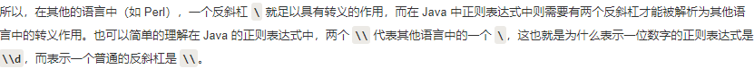
2. 字符匹配符：
   - 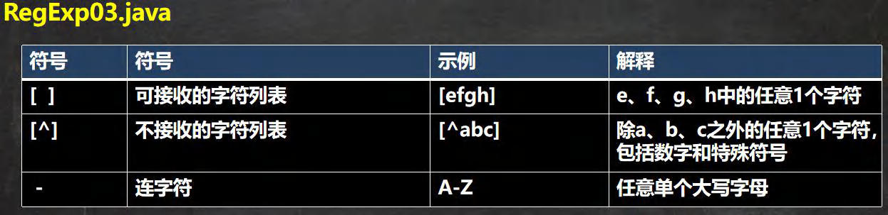
   - 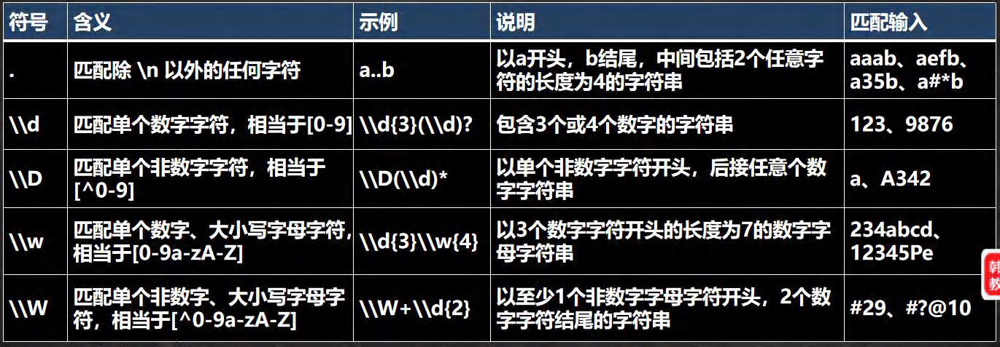
3. 选择匹配符：
   - 
4. 限定符：
   - 用于指定其前面的字符和组合项连续出现多少次
   - 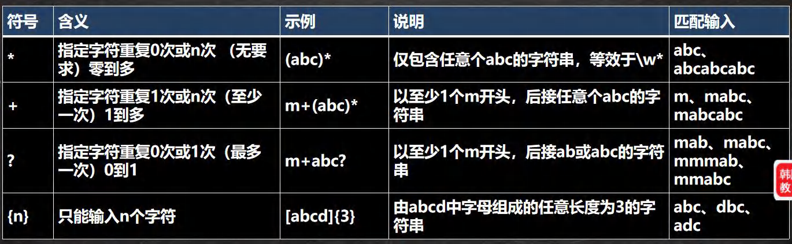
   - 
5. 定位符：
   - 规定要匹配的字符串出现的位置， 比如在字符串的开始还是在结束的位置
   - 
6. 分组：
   - 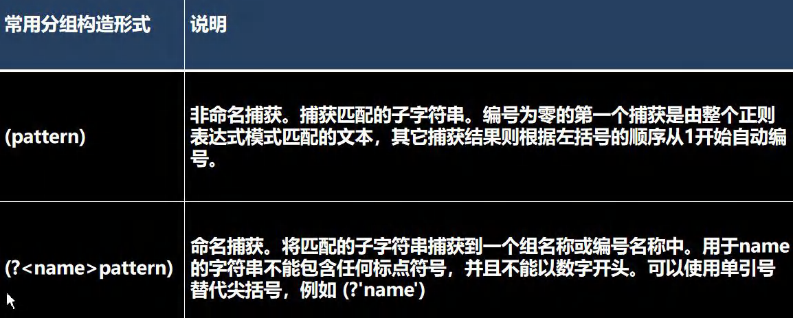
   - 

### 15.5 常用类

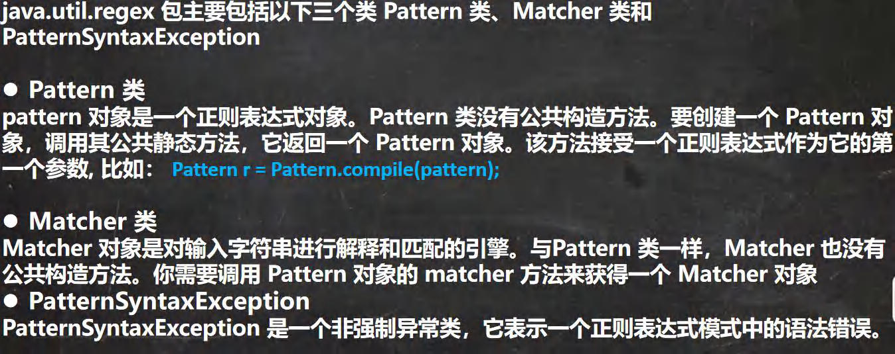

### 15.6 分组、捕获和反向引用

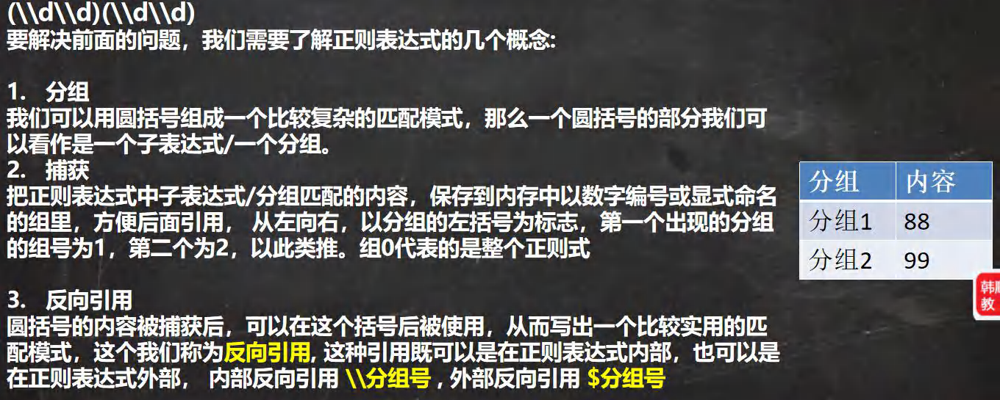

### 15.7 String 类中的正则

#### 15.7.1 替换

public String replaceAll(String regex,String replacement)

#### 15.7.2 判断

public boolean matches(String regex){} //使用 Pattern 和 Matcher 类

#### 15.7.3 分割

public String[] split(String regex)
