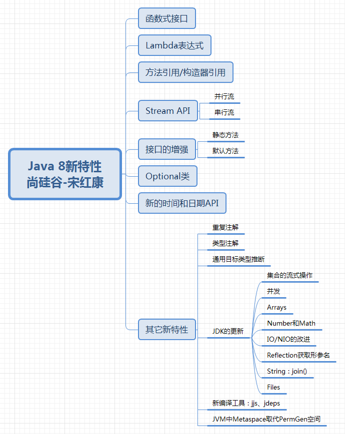
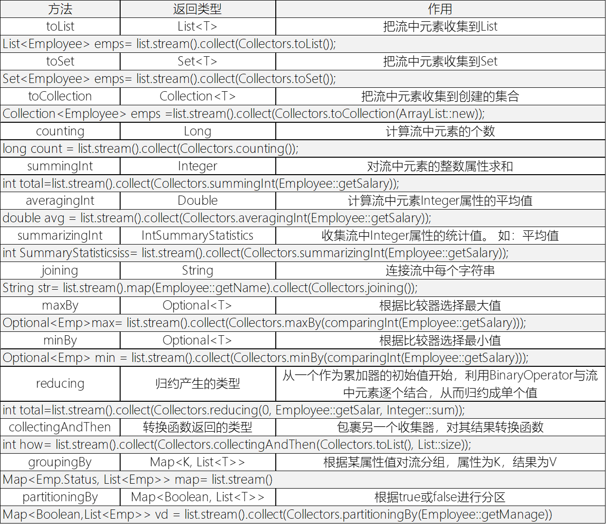
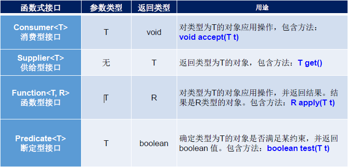
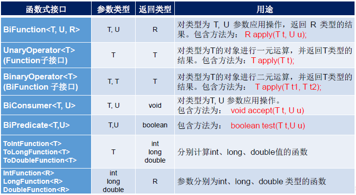

*本文是对Java语言新特性的介绍，对Java发展历史或当下生产环境中主要使用到的特性进行简单描述，*
<!-- more -->
## 第 1 章 Java8 新特性

### 1.1 Lambda 表达式

1. Lambda 是一个匿名函数，可以理解为可以传递的代码。
2. 语法：`->`Lambda 操作符、箭头操作符，符号左侧为参数列表，右侧为 Lambda 体（方法体）
   - 格式一：无参、无返回值：`Runnable r1 = () -> {System._out_.println("hello");};`
     - 如果 Lambda 体只有一条语句，则`{}`可以省略：`Runnable r1 = () -> System._out_.println(str);`
   - 格式二：一个参数、无返回值：`Consumer<String> con = (String str) -> {System._out_.println(str);};`
     - 一句 Lambda 体可省略`{}`：`Consumer<String> con = (String str) -> System._out_.println(str);`
     - 省略参数类型（根据上下文环境自动类型推断）：`Consumer<String> con = (str) -> System._out_.println(str);`
     - 省略形参`()`：`Consumer<String> con = str -> System._out_.println(str);`
   - 格式三：一个参数，有返回值
     - return 可以省略，同时必须省略`{}`?
   - 格式四：两个及以上参数，无返回值？
   - 格式五：两个及以上参数，有返回值: 
     - 多个 Lambda 体：`Compartor<Integer> com = (Integer x, Integer y) -> {System._out_.println("hello");return Integer.compare(x,y};` 
     - 省略参数类型（根据上下文环境自动类型推断）：`Compartor<Integer> com = (x, y) -> {System._out_.println("hello");return Integer.compare(x,y};` 
     - 一个 Lambda 体：`Compartor<Integer> com = (Integer x, Integer y) -> {return Integer.compare(x,y};` - 省略参数类型（根据上下文环境自动类型推断）：`Compartor<Integer> com = (x, y) -> {return Integer.compare(x,y};` 
     - 一句 Lambda 体可省略`{}`及`return`：`Compartor<Integer> com = (x, y) -> Integer.compare(x,y);`
     - 注意：省略`{}`必须省略`return`，即`Compartor<Integer> com = (x, y) -> return Integer.compare(x,y);`为错误形式
     > **总结：**
     >
     > - 左边：
     >   - 形参列表的类型可以省略
     >   - 只有一个参数`()`可以省略
     > - 右边：
     >   - Lambda 一般使用`{}`包裹
     >   - 一条 Lambda 可以省略`{}`
     >   - 一条 return 省略语句，省略`{}`必须省略`return`
3. 本质：作为接口的实例（且是该接口只有一个方法，这是唯一的实例）
4. 注意点：
   - Lambda 只是代替了声明部分，要想执行还得调用其方法。
   - Lambda 之所以能这样写，是因为这些接口内部定义的方法只有这一个。
5. 使用场景：
   - 函数式接口
   - 函数式接口需要匿名实现类
6. Lambda 表达式作为参数传递（调用时）

### 1.2 Stream API

#### 1.2.1 概述

1. Stream API 是设计用于处理 MongDB、Radis 等 NoSQL 数据库，因为这类数据库需要 Java 层面去处理数据
2. Stream API 位于`java.util.stream`包下。使用了函数式编程风格。
3. Stream API 是设计用于处理 MongDB、Radis 等 NoSQL 数据库的，而这类数据库是 key-val 类型的，即 Java 中集合类型。所以 Stream API 是处理集合的。
4. Stream API 特点：
   - Stream 不会存储元素，而是处理元素
   - Stream 处理元素不会改变原数据，而会返回一个 Stream
   - Stream 是面向 CPU 的，是完成计算的
   - Stream 的操作是延迟执行的，即需要得到结果时才执行
5. Stream 操作步骤：
   - 创建 Stream，得到 Stream 的实例
   - 中间操作（中间操作链），对数据原进行数据处理
   - 终止操作，执行终止操作后，就开始执行中间操作链，并得到结果。执行完毕进行废弃。

#### 1.2.2 创建 Stream

1. 通过 Collection 集合创建：集合的接口中定义了两个获取 Stream 流的默认方法，通过该接口的实例化对象，可以创建 Stream。
   - 顺序流：`default Stream<E> stream()`
   - 并行流：`default Stream<E> parallelStream()`
2. 通过 Arrays 的静态方法：
   - `static <T> Stream<T> stream(T[] array)`
   - 重载类型：
     - `public static IntStream stream(int[] array)`
     - `public static LongStream stream(long[] array)`
     - `public static DoubleStream stream(double[] array)`
3. 通过 Stream 类的静态方法
   - `of()`方法：`public static<T> Stream<T> of(T... values)`，有限流。
   - `iterate()`方法——迭代：`public static<T> Stream<T> iterate(final T seed, final UnaryOperator<T> f)`，无限流
   - `generate()`方法——生成：`public static<T> Stream<T> generate(Supplier<T> s)`，无限流

#### 1.2.3 中间操作

1. 筛选与切片：
   - `filter(Predicate p)`：获取满足该 p 条件的元素，接收 Lambda 表达式参数
   - `distinct()`：去重，通过元素的 hasCode()和 equals()判断
   - `limit(Long maxSize)`：截断，获取指定个数的元素
   - `skip(Long n)`：跳过，跳过指定个数的元素
2. 映射：
   - `map(Function f)`：接收一个函数作为参数，该函数会被应用到每个元素上，并将其映射成一个新的元素。
     - `mapToDouble(ToDoubleFunction f)`
     - `mapToInt(ToIntFunction f)`
     - `mapToLong(ToLongFunction f)`
   - `flatMap(Function f)`：接收一个函数作为参数，将流中的每个值都换成另一个流，然后把所有流连接成一个流
3. 排序：
   - `sorted()`：产生一个新流，其中按自然顺序排序
   - `sorted(Comparator com)`：产生一个新流，其中按比较器顺序排序

#### 1.2.4 终止操作

1. 匹配：返回 Boolean
   - `allMatch(Predicate p)`：是否匹配所有元素
   - `anyMath(Predicate p)`：是否存在匹配的元素
   - `noneMatch(Predicate p)`：是否没有匹配所有元素
2. 查找：
   - `findFirst()`：返回第一个元素
   - `findAny()`：返回当前流中的任意元素
   - `count()`：返回流中元素总数
   - `max(Comparator c)`：返回流中最大值
   - `min(Comparator c)`：返回流中最小值
   - `forEach(Consumer c)`：内部迭代，遍历元素
3. 归约：
   - `reduce(T iden, BinaryOperator b)`：可以将流中元素反复结合起来，得到一个值。返回 T
   - `reduce(BinaryOperator b)`：可以将流中元素反复结合起来，得到一个值。返回 Optional<T>
     > 备注：map 和 reduce 的连接通常称为 map reduce 模式，因 Google 用它来进行网络搜索而出名。
4. 收集：
   - `collect(Collector c)`：将流转换为其他形式。接收一个 Collector 接口的实现，用于给 Stream 中元素做汇总的方法
     - 

### 1.3 Optional 类

#### 1.3.1 概述

1. Optional<T> 类(java.util.Optional) 是一个容器类， 是一个可以为 null 的容器对象。如果值存在则 isPresent()方法会返回 true，调用 get()方法会返回该对象。
2. 好处：原来用 null 表示一个值不存在，现在 Optional 可以更好的表达这个概念。并且可以避免空指针异常。

#### 1.3.2 创建 Optional 类对象

1. `Optional.of(T t)` : 创建一个 Optional 实例， t 必须非空
2. `Optional.empty()` : 创建一个空的 Optional 实例
3. `Optional.ofNullable(T t)`： t 可以为 null

#### 1.3.3 判断 Optional 是否包含对象

1. `boolean isPresent()`: 判断是否包含对象
2. `void ifPresent(Consumer<? super T> consumer)`：如果有值，就执行 Consumer 接口的实现代码，并且该值会作为参数传给它。

#### 1.3.4 获取 Optional 容器的对象

1. `T get()`: 如果调用对象包含值，返回该值，否则抛异常
2. `T orElse(T other)`：如果有值则将其返回，否则返回指定的 other 对象。
3. `T orElseGet(Supplier<? extends T> other)`：如果有值则将其返回，否则返回由 Supplier 接口实现提供的对象。
4. `T orElseThrow(Supplier<? extends X> exceptionSupplier)`：如果有值则将其返回，否则抛出由 Supplier 接口实现提供的异常。

### 1.4 函数式（Functional）接口

1. 只能创建一个抽象方法的接口。
2. 定义接口时使用`@FunctionalInterface`注解，用于编译时检查。同时 javadoc 会包含该声明
   - `@FunctionalInterface`注解声明的接口，只能包含一个抽象方法，可以包含多个默认方法，也可以包含多个静态方法。
3. Java8 的函数式接口定义在`java.util.function`中
4. 函数式接口的理解：
   - 函数式接口的出现，使 Java 既可以支持 OOP，还可以支持 OOF（面向函数编程）
   - 但在 Java 语言中，Lambda 表达式是对象，而不是函数，恰恰是因为函数式接口——特别的对象类型
   - Lambda 表达式就是一个函数式接口的实例。
     - 即，只要一个对象是函数式接口的实例，那么该对象就可以用 Lambda 表达式表示。
5. Java 内置四大核心函数式接口：

6. 其他内置接口：

### 1.5 方法引用及构造器引用

#### 1.5.1 方法引用

1. 对 Lambda 表达式的优化简写，通过方法的名字指向一个方法。
2. 语法：`::`将类（或对象）与方法名分隔开
3. 格式：
   - `对象::实例方法名`
     - 没有`对象::静态方法名`，因为没必要
   - `类::静态方法名`
   - `类::实例方法名`
4. 使用要求：接口中的抽象方法的参数列表、返回值类型，与方法引用的方法的参数列表和返回值类型一致。
   - `类::实例方法名`会出现抽象方法与方法引用方法参数列表匹配的情况，但还是可以使用，原因是，参数列表中第一个参数是作为方法的调用者出现的。

#### 1.5.2 构造器引用

1. 使用要求：接口中的抽象方法的参数列表，与构造器的参数列表和一致，且抽象方法的返回值为构造器对应类的对象.
2. 格式：`ClassName::new`

#### 1.5.3 数组引用

1. 格式：`type[]::new`
