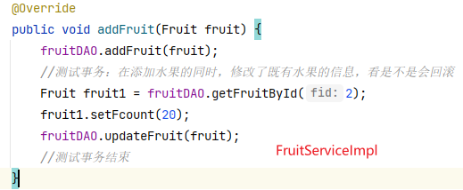
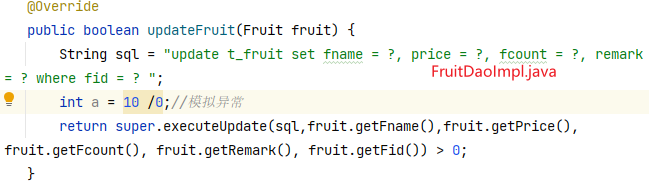

迭代顺序：
- 01.thymeleaf：使用thymeleaf作为视图模板，解析后端传到前台的数据，
  - 引入ViewBaseServlet.java

- 02.pages：完成分页功能
  - 修改FruitDaoImpl内部的查询方法

- 03.keywords：完成关键词搜索功能
  - 继续修改FruitDaoImpl内部的查询方法

- 04.mvc：完成servlet整合
  - 将addservlet、deleteservlet、editservlet、indexservlet、updateservlet整合成fruitservlet，用到switch-case语句进行判断

- 05.mvc-reflect：使用反射机制优化整合的servlet
  - 将fruitservlet中的switch使用反射机制进行优化

- 06.dispathcrservlet：使用监视器dispatherservlet，设置配置文件，将不同controllerservlet交给配置文件，dispatcherservlet进行解析，读取不同的controllerservlet
  - 将fruitservlet变更为fruitcontroller，单纯作为一个实现具体业务的方法，不再处理请求
  - 引入DispatcherServlet.java，接到请求后由它进行处置，判断交给哪个controller
  - DispatcherServlet接到的 `*.do` 请求，解析`*`后与配置文件中的bean id进行比对，创建对应controller，调用内部方法

- 07.IOC：抽取DispatcherServlet创建解析配置文件的方法，并使用ioc创建实例对象，在DispatcherServlet的init()中调用解析配置文件的方法
  - 引入service层，controller层调用service层

  
- 08.transcation：增加事务控制功能
  - 将BaseDao中的获取连接抽取成工具类，同时Dao操作不能再自己关闭连接，需要交给事务类管理。
    -   - 引入Threadlocal控制线程安全，保证同一个连接
  - 创建事务管理类TransactionManager，在事务管理类中创建事务提交、回滚，连接关闭等方法。
  - 将事务管理类TransactionManager交给OpenSessionInViewFilter管理，并给OpenSessionInViewFilter设置过滤器，保证同一个请求
  - 测试：在FruitServiceImol类的addFruit方法中调用updateFruit，看是不是会回滚
    - 在添加水果的同时，修改了既有水果的信息，看是不是会回滚
    - 修改这一条的信息，把数量改为20
      - 
      - 
      - 这里会引出异常处置问题：底层对异常进行try-catch后，上层捕获不到异常

- 09.监听器：使用监听器监听servlet的变化，不再在DispatcherServlet的init()利用ioc创建实例。
  - 监听器将创建的beanfactory放在applicationContext作用域中
  - DispatcherServlet去读取applicationContext作用域

Javaweb项目执行流程：监听器–>过滤器的init()方法–>web应用jsp等—>过滤器doFilter–>过滤链–>servlet