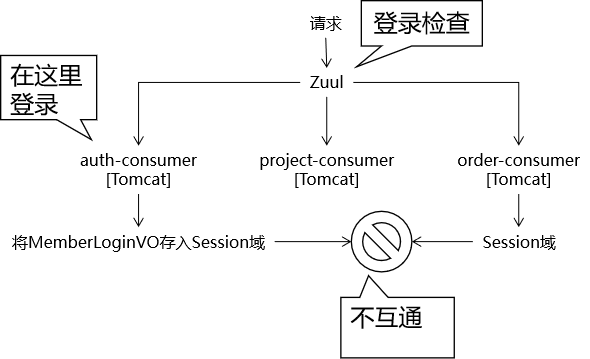
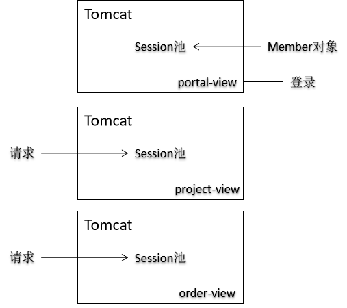
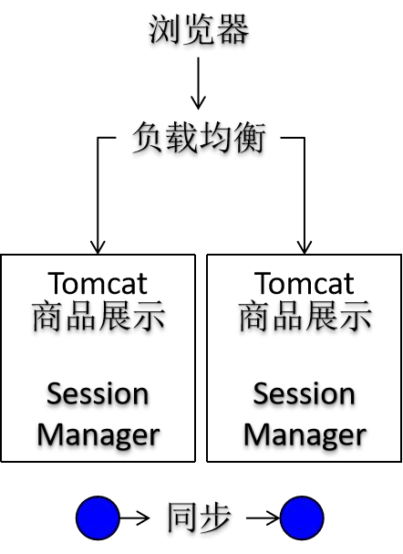
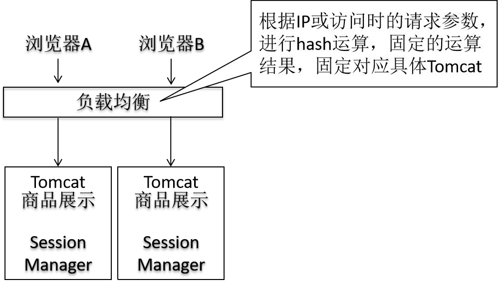
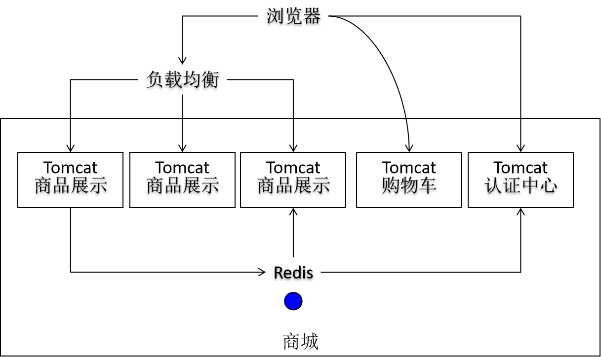
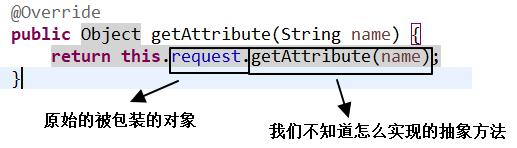
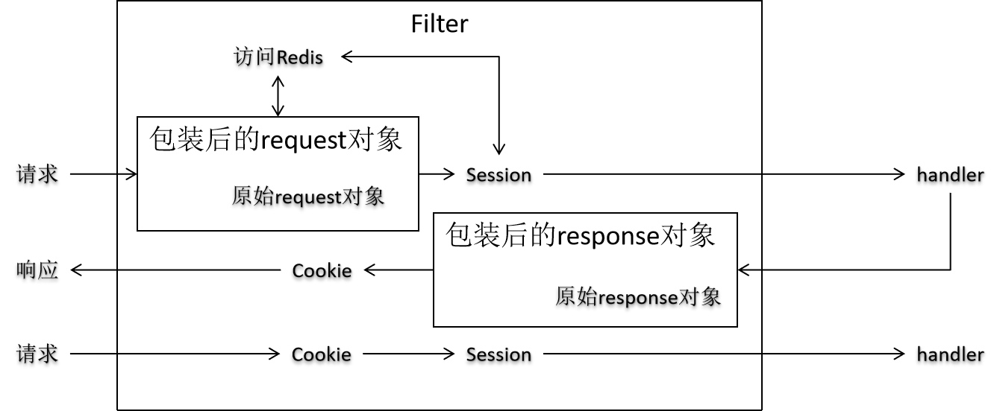
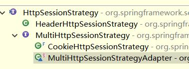
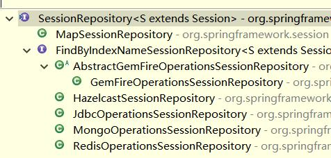

*Http协议是无状态的，这样对于服务端来说，没有办法区分是新的访客还是旧的访客。但是，有些业务场景，需要追踪用户多个请求，此时就需要Session。Spring Session实现了无侵入式操作session的方式。*
<!-- more -->

## 1. 登录状态保持及检查

http 协议时无状态的，无类型的，所有的信息都会被解析为字符串，也不会记录两次请求之间的联系。


### 1.1 会话控制机制

Cookie 的工作机制：

- 服务器端返回 Cookie 信息给浏览器
  - Java 代码： response.addCookie(cookie 对象);
  - HTTP 响应消息头： Set-Cookie: Cookie 的名字=Cookie 的值
- 浏览器接收到服务器端返回的 Cookie， 以后的每一次请求都会把 Cookie 带上
  - HTTP 请求消息头： Cookie： Cookie 的名字=Cookie 的值

Session 的工作机制

- 获取 Session 对象： request.getSession()
- 检查当前请求是否携带了 JSESSIONID 这个 Cookie
  - 带了： 根据这个 JSESSIONID 在服务器端查找对应的 Session 对象
    - 能找到： 就把找到的 Session 对象返回
    - 没找到： 新建 Session 对象返回， 同时返回 JSESSIONID 的 Cookie
  - 没带： 新建 Session 对象返回， 同时返回 JSESSIONID 的 Cookie

### 1.2 session 共享

在分布式和集群环境下， 每个具体模块运行在单独的 Tomcat 上， 而 Session 是被不同 Tomcat 所“区隔” 的， 所以不能互通， 会导致程序运行时， 用户会话数据发生错误。 有的服务器上有， 有的服务器上没有。


#### 1.2.1 Session 同步


问题 1： 造成 Session 在各个服务器上“同量” 保存。 TomcatA 保存了 1G 的 Session 数据， TomcatB 也需要保存 1G 的 Session 数据。 数据量太大的会导
致 Tomcat 性能下降。
问题 2： 数据同步对性能有一定影响。

#### 1.2.2 将 Session 数据存储在 Cookie 中

做法： 所有会话数据在浏览器端使用 Cookie 保存， 服务器端不存储任何会话数据。
好处： 服务器端大大减轻了数据存储的压力。 不会有 Session 不一致问题
缺点：Cookie 能够存储的数据非常有限。 一般是 4KB。 不能存储丰富的数据。
Cookie 数据在浏览器端存储， 很大程度上不受服务器端控制， 如果浏览器端清理 Cookie， 相关数据会丢失。

#### 1.2.3 反向代理 hash 一致性



问题 1： 具体一个浏览器， 专门访问某一个具体服务器， 如果服务器宕机，会丢失数据。 存在单点故障风险。
问题 2： 仅仅适用于集群范围内， 超出集群范围， 负载均衡服务器无效。

#### 1.2.4 后端统一存储 Session 数据

后端存储 Session 数据时， 一般需要使用 Redis 这样的内存数据库， 而一般不采用 MySQL 这样的关系型数据库。 原因如下：
Session 数据存取比较频繁。 内存访问速度快。
Session 有过期时间， Redis 这样的内存数据库能够比较方便实现过期释放。

优点
访问速度比较快。 虽然需要经过网络访问， 但是现在硬件条件已经能够达到网络访问比硬盘访问还要快。

- 硬盘访问速度： 200M/s
- 网络访问速度： 1G/s

Redis 可以配置主从复制集群， 不担心单点故障。

### 1.3 SpringSession 使用


表面上调用的原生的 getAttribute，实际上已经是被 springsession 包装了的。
SpringSession 允许使用各种库作为 session 的存储位置，redis 只是其中一种。
需要在 springboot 环境中使用，暂未研究 springmvc。

```xml
<!-- 引入springboot&redis整合场景 -->
<dependency>
  <groupId>org.springframework.boot</groupId>
  <artifactId>spring-boot-starter-data-redis</artifactId>
</dependency>
<!-- 引入springboot&springsession整合场景 -->
<dependency>
  <groupId>org.springframework.session</groupId>
  <artifactId>spring-session-data-redis</artifactId>
</dependency>
```

原理：SpringSession 从底层全方位“接管”了 Tomcat 对 Session 的管理。

**SessionRepositoryFilter**：

利用 Filter 原 理，在每次请求到达目标方法之前，将原生`HttpServletRequest/HttpServletResponse`对象包装为`SessionRepositoryRequest/ResponseWrapper`。
包装 request 对象时要做到： 包装后和包装前类型兼容。 所谓类型兼容：“包装得到的对象 instanceof 包装前类型” 返回 true。

只有做到了类型的兼容， 后面使用包装过的对象才能够保持使用方法不变。 包装过的对象类型兼容、 使用方法不变， 才能实现“偷梁换柱”。

但是如果直接实现 HttpServletRequest 接口， 我们又不知道如何实现各个抽象方法。 这个问题可以借助原始被包装的对象来解决：包装对象并不是凭空创建一个相同类型的对象， 而是借助原生对象的主体功能， 修改有特殊需要的功能。

**HttpSessionStrategy**：

封装 Session 的存取策略：cookie 还是 http headers 等方式。



**SessionRepository**：

指定存取/删除/过期 session 操作的 repository



**RedisOperationsSessionRepository**：

使用 Redis 将 session 保存维护起来
