*Spring Cloud 是分布式微服务架构的一站式解决方案，它提供了一套简单易用的编程模型，使我们能在 Spring Boot 的基础上轻松地实现微服务系统的构建。*
<!-- more -->


> - springcloud 基于 http 协议，这是与 Dubbo 最本质的区别。
> - dubbo 的核心是基于 RPC

## 1. Spring Cloud

### 1.1 Spring Cloud 环境

- Spring Cloud：Hoxton.SR1
- Spring Boot：2.2.2.RELEASE
- Spring Cloud Alibaba：2.1.0.RELEASE
- Java：Java8
- Maven：3.5+
- MySQL：5.7+
- 常用组件（pom）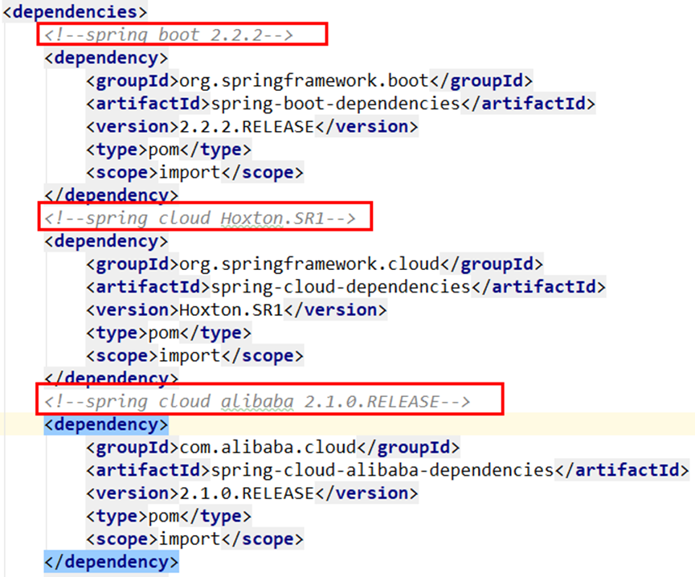

### 1.2 Spring Boot 从 1.5 升级为 2.0 时，时代发生的变化：

- 以前学习内容：
  - 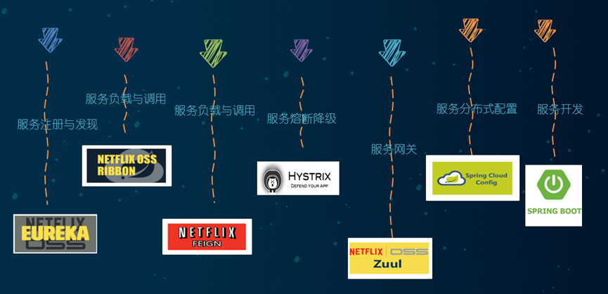
- 现在（2020）学习内容：
  - 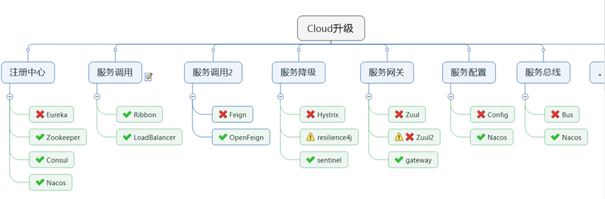

### 1.3 学习内容

注册中心：Eureka
负载均衡：Ribbon
声明式调用远程方法：Feign
熔断、降级、监控：Hystrix
网关：Zuul
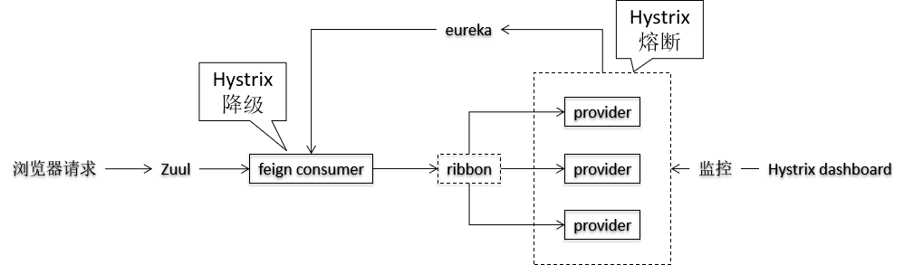

## 2. 微服务架构编码构建

### 2.1 核心思想

#### 2.1.1 消费和提供者设计

约定>配置>编程
实体类抽取成一个公共的包，要使用实体类的包引入该依赖。

#### 2.1.2 CAP 理论

C:Consistency（强一致性）
A:Availability（可用性）
P:Partition tolerance（分区容错性）
CAP 理论关注粒度是数据，而不是整体系统设计的策略
经典 CAP 图：

最多只能同时较好的满足两个。
CAP 理论的核心是：一个分布式系统不可能同时很好的满足一致性，可用性和分区容错性这三个需求，
因此，根据 CAP 原理将 NoSQL 数据库分成了满足 CA 原则、满足 CP 原则和满足 AP 原则三 大类：
CA - 单点集群，满足一致性，可用性的系统，通常在可扩展性上不太强大。
CP - 满足一致性，分区容忍必的系统，通常性能不是特别高。
AP - 满足可用性，分区容忍性的系统，通常可能对一致性要求低一些。

### 2.2 父工程管理依赖

#### 2.2.1 创建父工程

1. 选择 Maven 构建工程，暂不选择 spring 初始化
   - 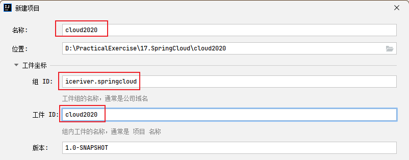
2. 修改 maven 版本、仓库及设置
3. 检查项目编码格式：
   - 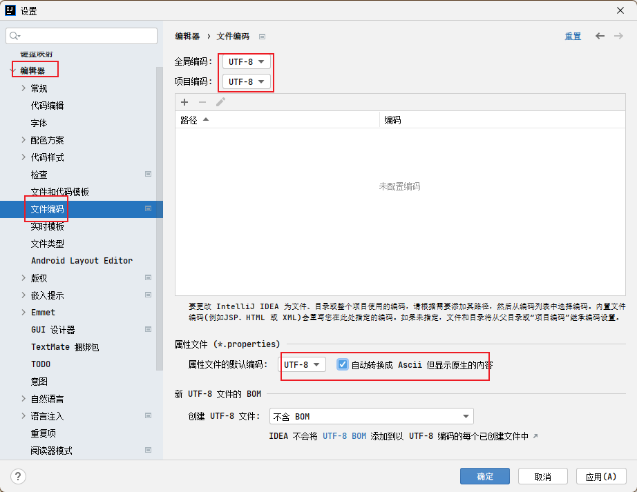
4. 注解生效激活（之前从来没设置过）
   - 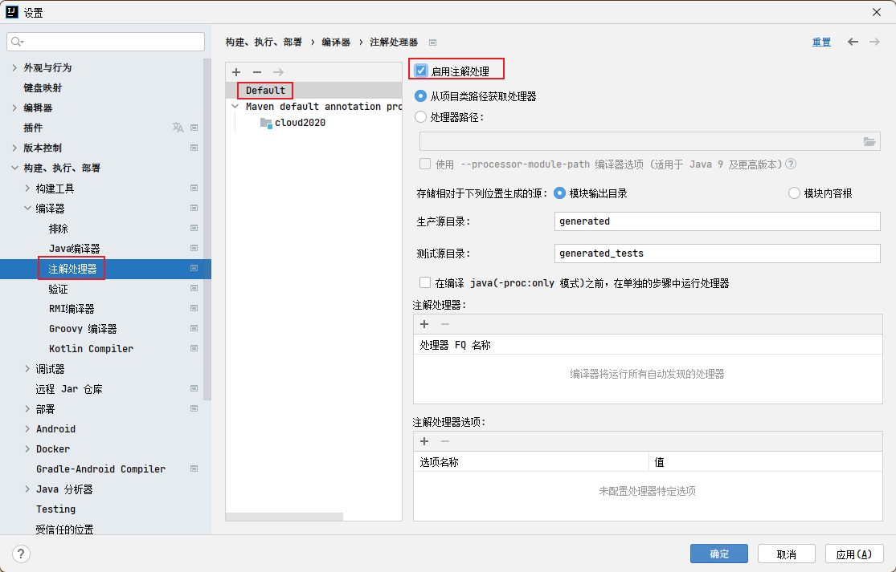
5. Java 编译版本选择 8（之前从来没设置过）
   - 
6. 设置文件 File Type 过滤，即是否在 idea 文件窗口显示指定格式的文件（可不设置）
   - 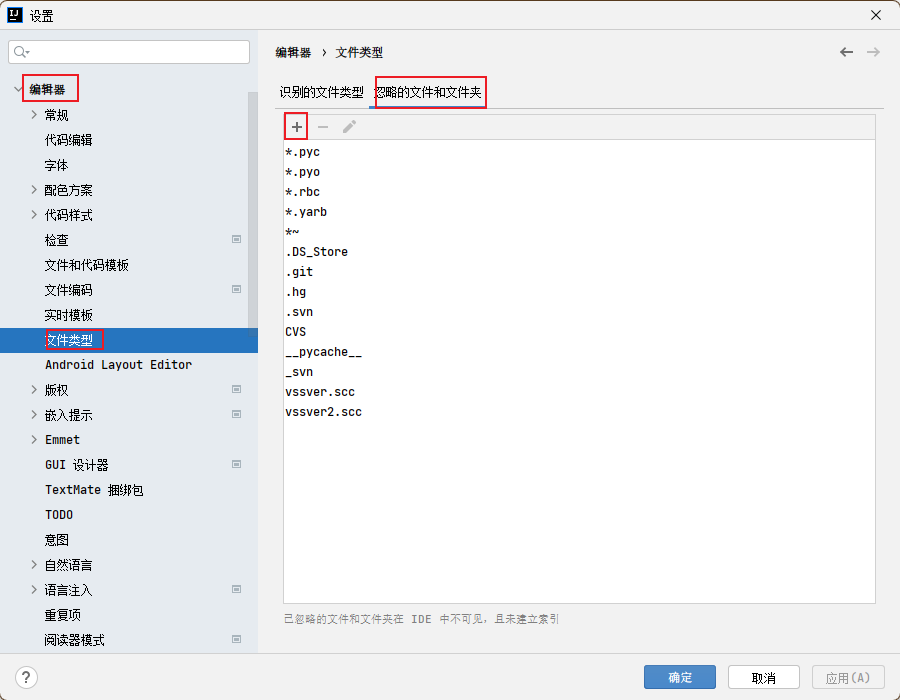

#### 2.2.2 配置父工程组件（pom 文件）

```xml
<!-- 统一管理jar包版本 -->
<properties>
    <project.build.sourceEncoding>UTF-8</project.build.sourceEncoding>
    <maven.compiler.source>1.8</maven.compiler.source>
    <maven.compiler.target>1.8</maven.compiler.target>
    <junit.version>4.12</junit.version>
    <log4j.version>1.2.17</log4j.version>
    <lombok.version>1.16.18</lombok.version>
    <mysql.version>5.1.47</mysql.version>
    <druid.version>1.1.16</druid.version>
    <mybatis.spring.boot.version>1.3.0</mybatis.spring.boot.version>
</properties>

<!-- 子模块继承之后，提供作用：锁定版本+子modlue不用写groupId和version  -->
<dependencyManagement>
  <dependencies>
    <!--spring boot 2.2.2-->
    <dependency>
        <groupId>org.springframework.boot</groupId>
        <artifactId>spring-boot-dependencies</artifactId>
        <version>2.2.2.RELEASE</version>
        <type>pom</type>
        <scope>import</scope>
    </dependency>
    <!--spring cloud Hoxton.SR1-->
    <dependency>
        <groupId>org.springframework.cloud</groupId>
        <artifactId>spring-cloud-dependencies</artifactId>
        <version>Hoxton.SR1</version>
        <type>pom</type>
        <scope>import</scope>
    </dependency>
    <!--spring cloud alibaba 2.1.0.RELEASE-->
    <dependency>
        <groupId>com.alibaba.cloud</groupId>
        <artifactId>spring-cloud-alibaba-dependencies</artifactId>
        <version>2.1.0.RELEASE</version>
        <type>pom</type>
        <scope>import</scope>
    </dependency>
    <dependency>
        <groupId>mysql</groupId>
        <artifactId>mysql-connector-java</artifactId>
        <version>${mysql.version}</version>
    </dependency>
    <dependency>
        <groupId>com.alibaba</groupId>
        <artifactId>druid</artifactId>
        <version>${druid.version}</version>
    </dependency>
    <dependency>
        <groupId>org.mybatis.spring.boot</groupId>
        <artifactId>mybatis-spring-boot-starter</artifactId>
        <version>${mybatis.spring.boot.version}</version>
    </dependency>
    <dependency>
        <groupId>junit</groupId>
        <artifactId>junit</artifactId>
        <version>${junit.version}</version>
    </dependency>
    <dependency>
        <groupId>log4j</groupId>
        <artifactId>log4j</artifactId>
        <version>${log4j.version}</version>
    </dependency>
    <dependency>
        <groupId>org.projectlombok</groupId>
        <artifactId>lombok</artifactId>
        <version>${lombok.version}</version>
        <optional>true</optional>
    </dependency>
  </dependencies>
</dependencyManagement>

<build>
  <plugins>
    <plugin>
      <groupId>org.springframework.boot</groupId>
      <artifactId>spring-boot-maven-plugin</artifactId>
      <configuration>
        <fork>true</fork>
        <addResources>true</addResources>
      </configuration>
    </plugin>
  </plugins>
</build>
```

在未使用 spring 初始化工具创建项目的情况下，该父模块没有父模块，所以依赖引入了 spring-boot-dependencies 和 spring-cloud-dependencies，而且导入形式为 import。
在使用 spring 初始化工具创建项目的情况下，该模块的父模块会是 springboot，则引入依赖时需要引入 spring-cloud-dependencies。

#### 2.2.3 热部署 Devtools

1. 子工程引入依赖
2. 工程添加开启 maven 插件
3. 开启 idea 自动编译

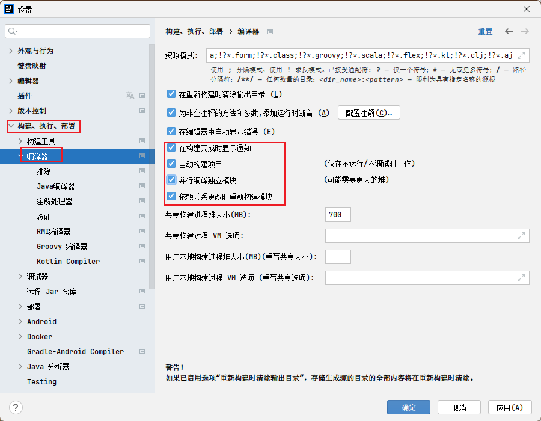

4. 注册自动编译（下面是老版本，2021 版本不需要设置，可参考[https://www.yuque.com/zhuyuqi/zna9x5/gs0vv5#eEIgn](https://www.yuque.com/zhuyuqi/zna9x5/gs0vv5#eEIgn)，使用 ctrl+f9）
   - `ctrl+shift + alt +／`开启注册表维护界面
     - 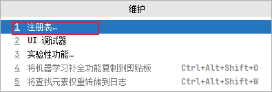
   - 勾选相关配置
     - 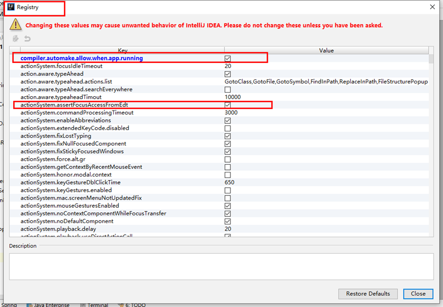

### 2.3 REST 微服务工程

#### 2.3.1 RestTemplate

在微服务开发中，一般约定：消费者的请求端口 80，则对应微服务的端口为 8001。
为了能够使消费者服务的请求更方便的发给服务提供者，产生了很对请求模板技术。RestTemplate 提供了多种便捷访问远程 Http 服务的方法， 是一种简单便捷的访问 restful 服务模板类，是 Spring 提供的用于访问 Rest 服务的客户端模板工具集。
官网地址：
https://docs.spring.io/spring-framework/docs/5.2.2.RELEASE/javadoc-api/org/springframework/web/client/RestTemplate.html

可以这样理解，通常情况下，给后台服务发送请求是通过浏览器发送 http 请求，在后台处理业务时，如果需要使用第三方服务，则需要在后台给第三方服务发送请求，此时就需要后台服务封装一个 http 请求，httpclient 和 resttemplate 都起到了这样的作用。
相当于 http 协议的实现方式中：浏览器是前端的、httpclient 是后端的。

---

getForObject 方法/getForEntity 方法：

- 返回对象为响应体中数据转化成的对象，基本上可以理解为 Json
  - 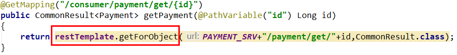
- 返回对象为 ResponseEntity 对象，包含了响应中的一些重要信息，比如响应头、响应状态码、响应体等
  - 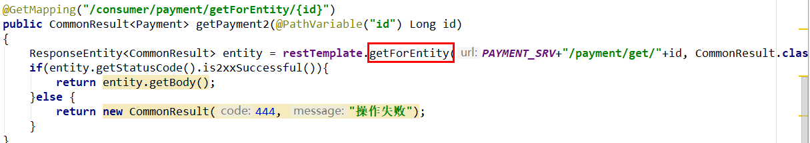

---

postForObject 方法/postForEntity 方法

---

#### 2.3.2 创建 cloud-provider-payment8001 子模块

1. 创建模块，使用父模块管理依赖版本
2. resources 目录下创建 application.properties 或 application.yml 核心配置文件
3. 习惯：在 application.yml 核心配置文件中指定服务端口号及服务名称

```yaml
server:
	port: 8001

spring:
  application:
  	name: cloud-provider-payment8001
  datasource:
		type: com.alibaba.druid.pool.DruidDataSource            # 当前数据源操作类型
			driver-class-name: org.gjt.mm.mysql.Driver              # mysql驱动包
			url: jdbc:mysql://localhost:13306/springcloud?useUnicode=true&characterEncoding=utf-8&useSSL=false
			username: root
			password: dimitre123

mybatis:
	mapperLocations: classpath:mapper/*.xml
		type-aliases-package: com.atguigu.springcloud.entities    # 所有Entity别名类所在包
```

com.mysql.jdbc.Driver 和 mysql-connector-java 5 一起用。
com.mysql.cj.jdbc.Driver 和 mysql-connector-java 6 一起用。
com.mysql.cj.jdbc.Driver 是 mysql-connector-java 6 中的特性，相比 mysql-connector-java 5 多了一个时区：serverTimezone，把数据源配置的驱动改一下就好了
org.gjt.mm.mysql.Driver 是当时最好的 MySQL JDBC，但不是 MySQL 公司的，然后 MySQL 将 MM 的 JDBC 驱动 收为官方的 JDBC 驱动，所以将驱动的 package 也改了，但还保留了 org.gjt.mm.mysql.Driver 这个路径的引用，也就是你使用新版的 JDBC 驱动时还可以通过这个来引用，打开下载的新版 JDBC 驱动的 jar 文件可以看到，只有一个文件的目录是 org.gjt.mm.mysql，就是为了兼容而设计的。

4. 创建主启动类（如果使用 spring 初始化创建的项目不需要这个步骤。

#### 2.3.3 创建 cloud-consumer-order80 模块

1. 创建模块，使用父模块管理依赖版本
2. resources 目录下创建 application.properties 或 application.yml 核心配置文件
3. 习惯：在 application.yml 核心配置文件中指定服务端口号及服务名称
4. 使用 restTemplate 对象向提供者请求数据：
   - 消费者服务中，创建配置类，在配置类中引入 RestTemplate，并使用@Bean 注入
     - 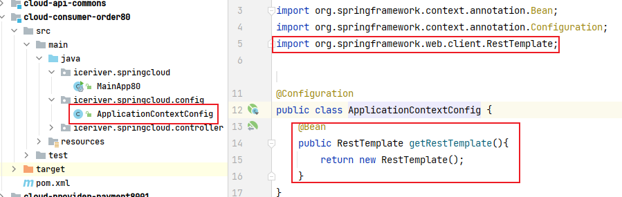
   - 在消费者服务中注入 restTemplate 对象，
   - 在消费者服务调用提供者服务（给提供者服务发送请求时），使用 restTemplate 对象的方法。
   - postForObject(url, requestMap, ResponseBean.class)
     - REST 请求地址、请求参数、HTTP 响应转换被转换成的对象类型。
   - getForObject(url, ResponseBean.class)

#### 2.3.4 工程重构——创建 cloud-api-commons

由于消费者、提供者都需要实体类、异常、service 接口、返回数据等，所以抽取至新的公共模块中，让消费者、提供者依赖 cloud-api-commons 公共模块。

## 3. 服务注册中心

### 3.1 Eurake

#### 3.1.1 服务注册与发现

Eureka 采用了 CS 的设计架构，Eureka Server 作为服务注册功能的服务器，它是服务注册中心。
在任何 rpc 远程框架中，都会有一个注册中心(存放服务地址相关信息(接口地址))。当服务器启动的时候，会把当前自己服务器的信息，比如服务地址、通讯地址等以别名方式注册到注册中心上。另一方（消费者|服务提供者），以该别名的方式去注册中心上获取到实际的服务通讯地址，然后再实现本地 RPC 调用。
RPC 远程调用框架核心设计思想：在于注册中心，因为使用注册中心管理每个服务与服务之间的一个依赖关系(服务治理概念)。
系统中的其他微服务，使用 Eureka 的客户端连接到 Eureka Server 并维持心跳连接，通过 Eureka Server 就可以监控系统中各个微服务是否正常运行。


#### 3.1.2 服务治理

在传统的 rpc 远程调用框架中，管理每个服务与服务之间依赖关系比较复杂，管理比较复杂，所以需要使用服务治理，管理服务于服务之间依赖关系，可以实现服务调用、负载均衡、容错等，实现服务发现与注册。
Spring Cloud 封装了 Netflix 公司开发的 Eureka 模块来实现服务治理。
微服务 RPC 远程服务调用最核心的是什么？
高可用，试想你的注册中心只有一个，故障时会导致整个为服务环境不可用，所以：
搭建 Eureka 注册中心集群 ，实现负载均衡+故障容错。


#### 3.1.3 Eurake 的组成

Eureka Server 提供服务注册服务：各个微服务节点通过配置启动后，会在 EurekaServer 中进行注册，这样 EurekaServer 中的服务注册表中将会存储所有可用服务节点的信息，服务节点的信息可以在界面中直观看到。
EurekaClient 通过注册中心进行访问：是一个 Java 客户端，用于简化 Eureka Server 的交互，客户端同时也具备一个内置的、使用轮询(round-robin)负载算法的负载均衡器。EurekaClient 在应用启动后，将会向 Eureka Server 发送心跳(默认周期为 30 秒)。如果 Eureka Server 在多个心跳周期内没有接收到某个节点的心跳，EurekaServer 将会从服务注册表中把这个服务节点移除（默认 90 秒）

#### 3.1.4 单机 Eureka 构建步骤——一个 Eurake 注册中心

1. 创建 eurekaServer 服务注册中心：
   - 创建 cloud-eureka-server7001 模块
   - 修改 pom.xml——引入 eureka-server 依赖
   - 编写 application.yml 配置文件
     - 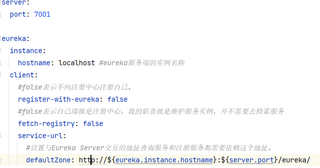
   - 创建主启动类，使用@EnableEurekaServer 注解标记为服务注册中心
   - 启动主程序类
2. 将服务提供者注册到 eurekaServer 服务注册中心
   - 修改 pom.xml——引入 eureka-client 依赖
   - 修改 application.yml 配置文件，添加 eurake-client 的相关配置
   - 修改主启动类，使用@EnableEurekaClient 注解注册到服务中心
3. 将服务消费者注册到 eurekaServer 服务注册中心
   - 修改 pom.xml——引入 eureka-client 依赖
   - 修改 application.yml 配置文件，添加 eurake-client 的相关配置
   - 修改主启动类，使用@EnableEurekaClient 注解注册到服务中心

#### 3.1.5 集群 Eureka 构建步骤——多个 Eurake 注册中心

原理：Eurekaserver 相互注册

1. 创建 eurekaServer 服务注册中心：
   - 创建 cloud-eureka-server7002 模块
   - 修改 pom.xml——引入 eureka-server 依赖
   - 编写 application.yml 配置文件
     - 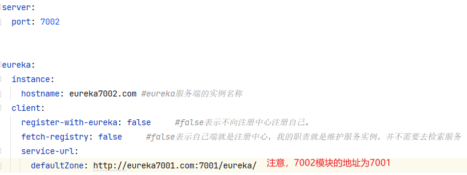
   - 创建主启动类，使用@EnableEurekaServer 注解标记为服务注册中心
   - 启动主程序类
2. 为了在本地一台主机上模拟多个注册中心（能够看到多台的效果），需要修改 hosts 文件
   - 因为 spring 核心配置文件中，注册中心的实例名称（eureka-instance-hostname)使用了 localhost，当多个注册中心使用同一个名称时，会导致看不到注册中心的相互守望
   - 所以可以采用域名映射 ip 的方式，对 hosts 文件进行修改
   - 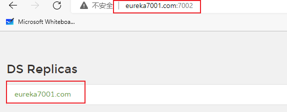
3. 【测试不对 hosts 文件修改：不可行】看不到注册中心相互守望：
   - 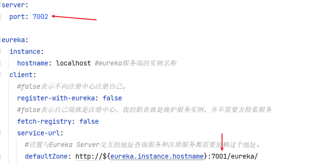
4. 将服务提供者和消费者注册到 Eureka 集群中
   - 修改 springboot 核心配置文件
   - 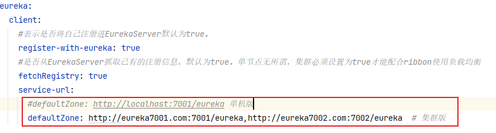
5. 执行测试【注意启动顺序】
   - 启动注册中心
   - 启动提供者服务
   - 启动消费者服务
   - 正常启动后，两个注册中心都能看到消费者和提供者服务

#### 3.1.6 服务提供者的集群配置（消费者还是一个，不需要集群）

1. 创建 cloud-provider-payment8002 模块
2. 修改 pom.xml，引入`spring-cloud-starter-netflix-eureka-client`
3. 编写 application.yml 配置文件——注意修改端口号为 8002
4. 创建主启动类，使用@EnableEurekaClient 注解标记为服务注册中心
   - 较低版本需要使用@EnableEurekaClient 注解。稍高版本也可以使用@EnableDiscoveryClient 注解。当前版本可以省略。
   - @EnableDiscoveryClient 是通用的，不仅仅可以用来发现 eureka 的注册中心。

#### 3.1.7 开启负载均衡功能

（这里使用的是 org.springframework.cloud.client.loadbalancer 中的负载均衡功能？）
前面 3.1.6 虽然配置了多个服务提供者，还是存在一个问题：

1. 服务消费者中的请求地址写死了，指向了 8001 端口的服务。

为了解决上述问题，需要对消费者的 controller 类进行修改，不能再对请求地址写死，修改方法如下（指向注册中心的服务提供者名字）：
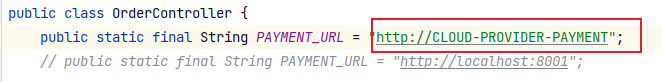
同时，为了能够实现 eurake 注册中心对服务提供者的自动管理（负载均衡），需要在服务消费者的配置类类中，对 RestTemplate 方法使用@LoadBalanaced 开启负载均衡功能.
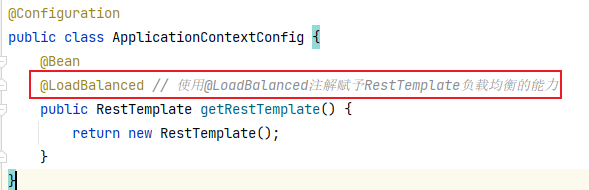
为了能够观察到负载均衡效果，可以修改消费者和提供者 controller 类，其中提供者添加端口号、消费者将 ip 地址修改为服务名称，通过启动服务看调用的哪个服务

- 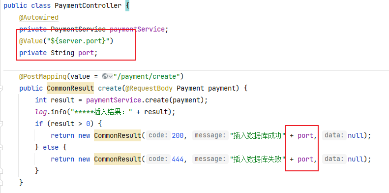
- 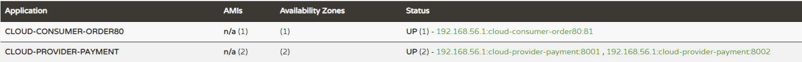
- 通过观察，可以看到注册中心的默认负载均衡机制为：轮询——每人一次。

上述过程较为麻烦，后续可采用 Ribbon 的负载均衡功能，此时不再需要配置地址和端口号。

#### 3.1.8 actuator 微服务信息完善

问题：注册中心鼠标指向集群注册中心的域名，不显示地址，同时，多个服务提供者的显示名称为 ip 地址，对于维护容易造成混淆，不能定位哪一台服务器。

- 
- 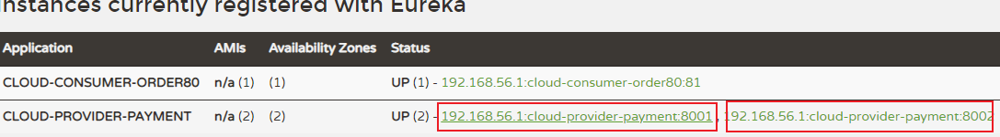

1. 引入`spring-boot-starter-actuator`依赖
2. 修改核心配置文件，给服务指定名称：名称任意
   - 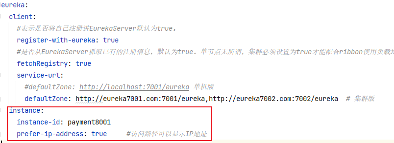

#### 3.1.9 服务发现 Discovery

对于注册进 eureka 里面的微服务，可以通过服务发现来获得该服务的信息。
是 spring cloud 的新功能。
修改 cloud-provider-payment8001 的 Controller

- 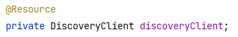
- 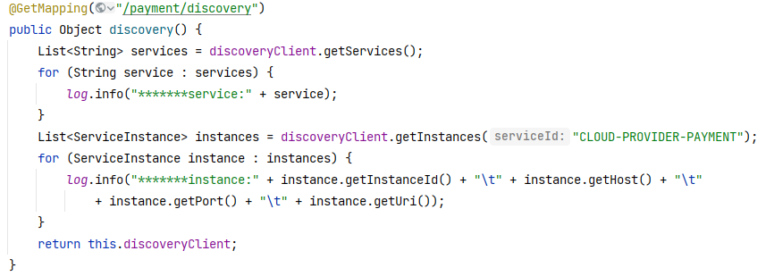

8001 服务提供者的主启动类使用@@EnableDiscoveryClient

#### 3.1.10 Eurake 的自我保护

1. 作用：保护模式主要用于一组客户端和 Eureka Server 之间存在网络分区场景下的保护。一旦进入保护模式，Eureka Server 将会尝试保护其服务注册表中的信息，不再删除服务注册表中的数据，也就是不会注销任何微服务。
   - 即：某时刻某一个微服务不可用了，Eureka 不会立刻清理，依旧会对该微服务的信息进行保存。属于 CAP 里面的 AP 分支。
   - 在自我保护模式中，Eureka Server 会保护服务注册表中的信息，不再注销任何服务实例。
2. 现象：如果在 Eureka Server 的首页看到以下这段提示，则说明 Eureka 进入了保护模式：
   - 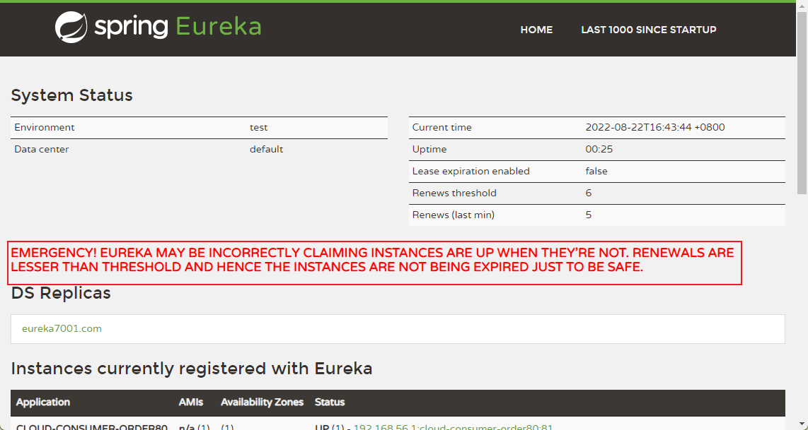
3. 出现原因：为了防止 EurekaClient 可以正常运行但是 与 EurekaServer 网络不通情况下，EurekaServer 不会立刻将 EurekaClient 服务剔除。
4. 自我保护模式详解：
   - 默认情况下，如果 EurekaServer 在一定时间内没有接收到某个微服务实例的心跳，EurekaServer 将会注销该实例（默认 90 秒）。但是当网络分区故障发生(延时、卡顿、拥挤)时，微服务与 EurekaServer 之间无法正常通信，以上行为可能变得非常危险了——因为微服务本身其实是健康的，此时本不应该注销这个微服务。Eureka 通过“自我保护模式”来解决这个问题——当 EurekaServer 节点在短时间内丢失过多客户端时（可能发生了网络分区故障），那么这个节点就会进入自我保护模式。
   - 
5. 设计思想：它的设计哲学就是宁可保留错误的服务注册信息，也不盲目注销任何可能健康的服务实例。一句话讲解：好死不如赖活着
6. 总结：自我保护模式是一种应对网络异常的安全保护措施。它的架构哲学是宁可同时保留所有微服务（健康的微服务和不健康的微服务都会保留）也不盲目注销任何健康的微服务。使用自我保护模式，可以让 Eureka 集群更加的健壮、稳定。
7. 禁用自我保护：
   - 修改注册中心（如 7001 的核心配置文件），设置 eureka.server.enable-self-preservation = false。
     - 扩展：设置心跳检测周期：eureka-server-eviction-interval-timer-in-ms: 2000
   - 修改服务提供者（eureka-client）（如 8001）：
     - eureka.instance.lease-renewal-interval-in-seconds=1，eureka-client 默认 30s 向 eureka-server 发送一次心跳，修改后变为 1s
     - eureka.instance.lease-expiration-duration-in-seconds=2，eureka-server 收到最后一次心跳后等待时间上限，单位为秒(默认是 90 秒)，超时将剔除服务

#### 3.1.11 Eureka 停更说明


### 3.2 Zookeeper

> - 前提要求：掌握 zookeeper，并在 centos7 上成功配置
> - 这里学习在本地主机安装了：参考[01.分布式框架—Dubbo](https://www.yuque.com/zhuyuqi/zna9x5/fs6zqy?view=doc_embed&inner=UEPuW)

#### 3.2.1 基本使用

1. zookeeper 是一个分布式协调工具，可以实现注册中心功能
2. 关闭 Linux 服务器防火墙后启动 zookeeper 服务器
   - systemctl stop firewalld
   - status firewalld
3. zookeeper 服务器取代 Eureka 服务器，zk 作为服务注册中心
4. zookeeper 保存的服务节点是临时节点，也就是说如果服务断开，马上就会失去服务的注册信息，不会像 Eureka 一样有自我保护机制。
5. 搭建 zookeeper 注册中心集群时，在配置文件中修改

#### 3.2.1 创建 cloud-provider-payment8004 服务提供者

1. 创建创建 cloud-provider-payment8002 模块
2. 修改 pom.xml
   - 引入 zookeeper 依赖
   - 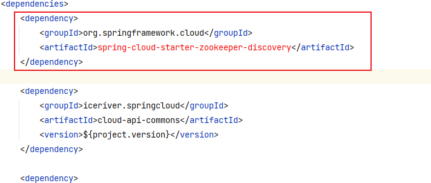
3. 编写 application.yml 配置文件——注意修改端口号为 8004
   - 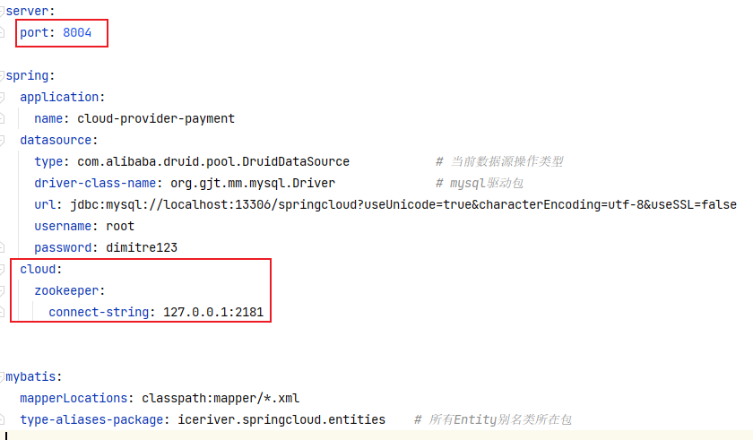
4. 创建主启动类，使用@EnableDiscoveryClient 注解标记，用于向使用 consul 或者 zookeeper 作为注册中心时注册服务
5. 集群搭建时，只需要在核心配置文件中，指定多个 zookeeper 地址，使用逗号分割。

#### 3.2.3 处理服务提供者启动报错问题

1. 报错现象：


2. 原因：jar 包冲突，版本不一致。引入的 zookeeper 依赖版本默认为 3.5.3-beta，本机（服务器）zookeeper 版本为 3.4.11


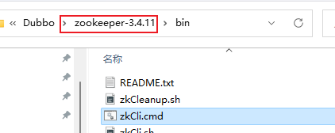

3. 解决方案：修改本地依赖的 zookeeper 版本

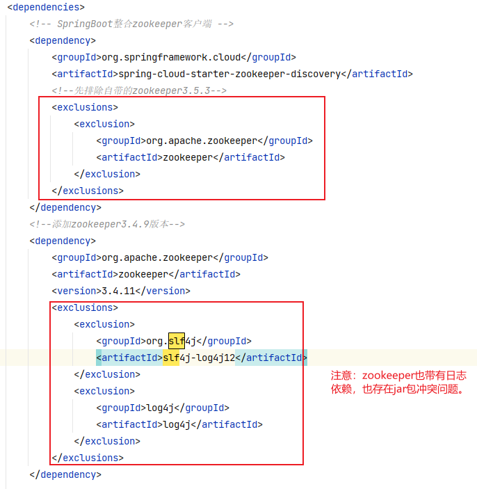

#### 3.2.4 创建 cloud-consumerzk-order80 服务消费者

1. 创建创建 cloud-provider-payment8002 模块
2. 修改 pom.xml
   - 引入 zookeeper 依赖
   - 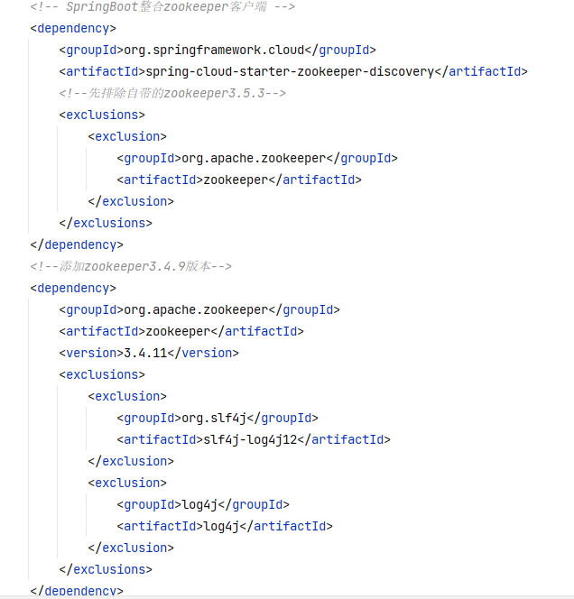
3. 编写 application.yml 配置文件——注意修改端口号为 82
   - 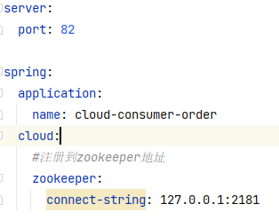
4. 创建主启动类，使用@EnableDiscoveryClient 注解标记，用于向使用 consul 或者 zookeeper 作为注册中心时注册服务
5. 业务类：创建 ApplicationContextConfig 类，使用@Configuration 注解标记为配置类；并创建 getRestTemplate()方法，使用@Bean 和@LoadBalanced 进行管理。
   - 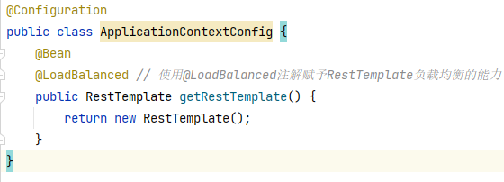
   - 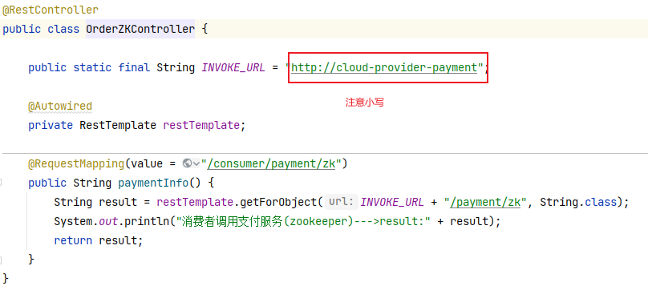
6. 测试：
   - 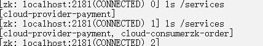
   - 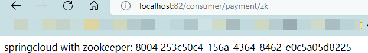

### 3.3 Consul

#### 3.3.1 Consul 简介

Consul 是一套开源的分布式服务发现和配置管理系统，由 HashiCorp 公司用 Go 语言开发。
提供了微服务系统中的服务治理、配置中心、控制总线等功能。这些功能中的每一个都可以根据需要单独使用，也可以一起使用以构建全方位的服务网格，总之 Consul 提供了一种完整的服务网格解决方案。
它具有很多优点。包括： 基于 raft 协议，比较简洁； 支持健康检查, 同时支持 HTTP 和 DNS 协议 支持跨数据中心的 WAN 集群 提供图形界面 跨平台，支持 Linux、Mac、Windows
主要作用：

- 服务发现：提供 HTTP 和 DNS 两种发现方式
- 健康监测：支持多种方式，HTTP、TCP、Docker、Shell 脚本定制化监控
- KV 存储：Key、Value 的存储方式
- 多数据中心：Consul 支持多数据中心
- 可视化 web 管理界面

#### 3.3.2 安装 Consul

下载完成后解压只有一个 consul.exe 文件，双击会一闪而退，需要使用开发者模式打开。
打开命令行终端，执行`./consul --version`可以查看版本信息
执行`consul agent -dev`进行启动，并在[http://localhost:8500](http://localhost:8500)地址下查看可视化界面。

#### 3.3.3 创建 cloud-providerconsul-payment8006 提供者服务

1. 创建模块
2. 修改 pom，引入 consul-discovery 依赖
3. 创建核心配置文件
   - 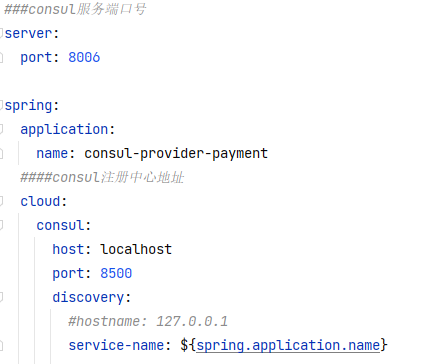
4. 创建主启动类，并用@EnableDiscoveryClient 注解
5. 编写业务类

#### 3.3.4 创建 cloud-consumerconsul-order80 消费者服务

1. 创建模块
2. 修改 pom，引入 consul-discovery 依赖
3. 创建核心配置文件
4. 创建主启动类，并用@EnableDiscoveryClient 注解
5. 创建配置类，并用@Configuration 注解，getRestTemplate()方法使用@Bean 和@LoadBalanced 注解

### 3.4 三种注册中心的对比


AP(Eureka)
CP(Zookeeper/Consul)

## 4. 服务调用

> 使用 Eureka 的集群进行测试，服务调用主要指负载均衡

### 4.0 负载均衡

LB 负载均衡(Load Balance)简单的说就是将用户的请求平摊的分配到多个服务上，从而达到系统的 HA（高可用）。
常见的负载均衡有软件 Nginx，LVS，硬件 F5 等。
Nginx 是服务器负载均衡，客户端所有请求都会交给 nginx，然后由 nginx 实现转发请求。即负载均衡是由服务端实现的。
Ribbon 本地负载均衡，在调用微服务接口时候，会在注册中心上获取注册信息服务列表之后缓存到 JVM 本地，从而在本地实现 RPC 远程服务调用技术。
分类：

- 集中式 LB：即在服务的消费方和提供方之间使用独立的 LB 设施(可以是硬件，如 F5, 也可以是软件，如 nginx), 由该设施负责把访问请求通过某种策略转发至服务的提供方；
- 进程内 LB：将 LB 逻辑集成到消费方，消费方从服务注册中心获知有哪些地址可用，然后自己再从这些地址中选择出一个合适的服务器。

### 4.1 Ribbon

#### 4.1.1 Ribbon 介绍

Spring Cloud Ribbon 是基于 Netflix Ribbon 实现的一套客户端负载均衡的工具。
简单的说，Ribbon 是 Netflix 发布的开源项目，主要功能是提供客户端的软件负载均衡算法和服务调用。
Ribbon 客户端组件提供一系列完善的配置项如连接超时，重试等。简单的说，就是在配置文件中列出 Load Balancer（简称 LB）后面所有的机器，Ribbon 会自动的帮助你基于某种规则（如简单轮询，随机连接等）去连接这些机器。我们很容易使用 Ribbon 实现自定义的负载均衡算法。
spring 想用自己的 LoadBalancer 替代 Netflix Ribbon，但目前无法实现。
Ribbon 就属于进程内 LB，它只是一个类库，集成于消费方进程，消费方通过它来获取到服务提供方的地址。
一句话介绍：负载均衡+RestTemplate 调用

- RestTemplate 实现远程远程调用。

#### 4.1.2 架构说明


Ribbon 在工作时分成两步
第一步先选择 EurekaServer ,它优先选择在同一个区域内负载较少的 server。
第二步再根据用户指定的策略，在从 server 取到的服务注册列表中选择一个地址。
其中 Ribbon 提供了多种策略：比如轮询、随机和根据响应时间加权。
总结：Ribbon 其实就是一个软负载均衡的客户端组件，他可以和其他所需请求的客户端结合使用，和 eureka 结合只是其中的一个实例。

#### 4.1.3 使用

- 之前写样例时候没有引入 spring-cloud-starter-ribbon 也可以使用 ribbon,
  - 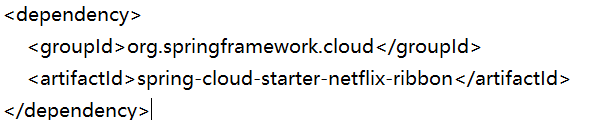
- 但是 spring-cloud-starter-netflix-eureka-client 自带了 spring-cloud-starter-netflix-ribbon 引用
  - 
- 所以在使用 Eureka 时，已经赋予了客户端服务负载均衡的功能。【有待验证，前面应该是使用了 springcloud 的 loadbalancer，而不是 ribbon——2022.08.23 确认，使用的 ribbon 的】
  - 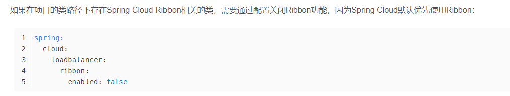

#### 4.1.4 核心组件——IRule

介绍 Ribbon 如何实现负载均衡算法， 其核心组件为 IRule
IRule：根据特定算法中从服务列表中选取一个要访问的服务

自带负载均衡算法为：

- com.netflix.loadbalancer.RoundRobinRule：轮询
- com.netflix.loadbalancer.RandomRule：随机
- com.netflix.loadbalancer.RetryRule：先按照 RoundRobinRule 的策略获取服务，如果获取服务失败则在指定时间内会进行重试，获取可用的服务
- WeightedResponseTimeRule：对 RoundRobinRule 的扩展，响应速度越快的实例选择权重越大，越容易被选择
- BestAvailableRule：会先过滤掉由于多次访问故障而处于断路器跳闸状态的服务，然后选择一个并发量最小的服务
- AvailabilityFilteringRule：先过滤掉故障实例，再选择并发较小的实例
- ZoneAvoidanceRule：默认规则,复合判断 server 所在区域的性能和 server 的可用性选择服务器

#### 4.1.5 替换负载均衡算法——给某个服务消费者指定特殊的算法

要修改负载均衡算法，就是修改服务消费者的请求策略。
官方文档明确给出了警告：
替换负载均衡算法的自定义配置类不能放在@ComponentScan 所扫描的当前包下以及子包下，否则我们自定义的这个配置类就会被所有的 Ribbon 客户端所共享，达不到特殊化定制的目的了。
修改流程：

1. 新建包 myrule
2. 新建 MySelfRule 规则类，并使用@Configuration 注解标记
3. 主启动类使用`@RibbonClient(name ="**CLOUD-PROVIDER-PAYMENT**",configuration=MySelfRule.class)`
   - 注意：这里的 name 要跟 Eurkea 中注册的服务提供者名字一致

#### 4.1.6 默认轮询算法原理

负载均衡算法：rest 接口第几次请求数 % 服务器集群总数量 = 实际调用服务器位置下标 ，每次服务重启动后 rest 接口计数从 1 开始。
`List<ServiceInstance> instances = discoveryClient.getInstances("CLOUD-PAYMENT-SERVICE");`
如： List [0] instances = 127.0.0.1:8002
　　 List [1] instances = 127.0.0.1:8001
8001+ 8002 组合成为集群，它们共计 2 台机器，集群总数为 2， 按照轮询算法原理：
当总请求数为 1 时： 1 % 2 =1 对应下标位置为 1 ，则获得服务地址为 127.0.0.1:8001
当总请求数位 2 时： 2 % 2 =0 对应下标位置为 0 ，则获得服务地址为 127.0.0.1:8002
当总请求数位 3 时： 3 % 2 =1 对应下标位置为 1 ，则获得服务地址为 127.0.0.1:8001
当总请求数位 4 时： 4 % 2 =0 对应下标位置为 0 ，则获得服务地址为 127.0.0.1:8002
如此类推......

#### 4.1.7 源码分析

没理解

#### 4.1.8 手写轮询算法

1. 启动 7001、7002 集群服务注册中心
2. 在服务提供者 8001、8002 的控制器类中，新增返回接口的方法
   - 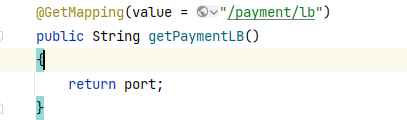
3. 修改服务消费者：
   - ApplicationContextConfig 配置类中，取消掉@LoadBalanced
   - 创建自定义 lb 包，并创建自定义 LoadBalancer 接口，定义方法名为 instances，返回值类型为 ServiceInstance 的抽象方法
     - 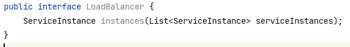
   - 创建 LoadBalancer 的实现类 MyLb，并用@Componetn 注解标记为组件（这里要求看得懂源码，因为在参照源码写）

```java
package iceriver.springcloud.lb;

import java.util.List;
import java.util.concurrent.atomic.AtomicInteger;

import org.springframework.cloud.client.ServiceInstance;
import org.springframework.stereotype.Component;

/**
* @author zhuyuqi
* @version v0.0.1
* @className MyLb
* @description https://developer.aliyun.com/profile/sagwrxp2ua66w
* @date 2022/08/23 11:44
*/
@Component
public class MyLb implements LoadBalancer {
    private AtomicInteger atomicInteger = new AtomicInteger(0);// 原子类

    public final int getAndIncrement() {
        int current;
        int next;
        do {
            current = this.atomicInteger.get();
            next = current >= 2147483647 ? 0 : current + 1;
        } while (!this.atomicInteger.compareAndSet(current, next));// 自旋锁
        System.out.println("*********next:" + next);
        return next;
    }

    @Override
    public ServiceInstance instances(List<ServiceInstance> serviceInstances) {
        int index = getAndIncrement() % serviceInstances.size();
        return serviceInstances.get(index);
    }
}
```

- 编写 controller 类
- 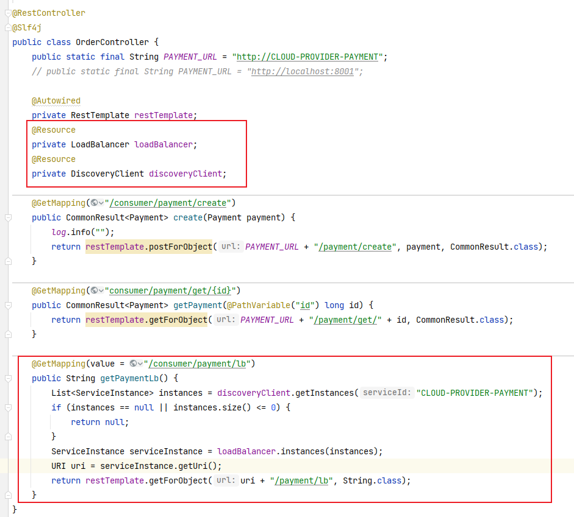

### 4.2 OpenFeign

#### 4.2.1 Feign 的介绍

Feign 是一个声明式的 Web 服务客户端，让编写 Web 服务客户端变得非常容易，只需创建一个接口并在接口上添加注解即可。
Feign 也支持可拔插式的编码器和解码器。Feign 可以与 Eureka 和 Ribbon 组合使用以支持负载均衡。
OpenFeign 是 spring 官方在 Feign 的基础上对 Feign 做的增强，使其支持了 Spring MVC 标准注解和 HttpMessageConverters。
Feign 旨在使编写 Java Http 客户端变得更容易。
前面在使用 Ribbon+RestTemplate 时，利用 RestTemplate 对 http 请求的封装处理，形成了一套模版化的调用方法。但是在实际开发中，由于对服务依赖的调用可能不止一处，往往一个接口会被多处调用，所以通常都会针对每个微服务自行封装一些客户端类来包装这些依赖服务的调用。所以，Feign 在此基础上做了进一步封装，由他来帮助我们定义和实现依赖服务接口的定义。在 Feign 的实现下，我们只需创建一个接口并使用注解的方式来配置它(以前是 Dao 接口上面标注 Mapper 注解,现在是一个微服务接口上面标注一个 Feign 注解即可)，即可完成对服务提供方的接口绑定，简化了使用 Spring cloud Ribbon 时，自动封装服务调用客户端的开发量。
Feign 集成了 Ribbon：
利用 Ribbon 维护了 Payment 的服务列表信息，并且通过轮询实现了客户端的负载均衡。而与 Ribbon 不同的是，通过 feign 只需要定义服务绑定接口且以声明式的方法，优雅而简单的实现了服务调用

#### 4.2.2 Feign 与 OpenFeign

| Feign | OpenFeign |
| ----- | --------- |

| Feign 是 Spring Cloud 组件中的一个轻量级 RESTful 的 HTTP 服务客户端。
Feign 内置了 Ribbon，用来做客户端负载均衡，去调用服务注册中心的服务。Feign 的使用方式是：使用 Feign 的注解定义接口，调用这个接口，就可以调用服务注册中心的服务 | OpenFeign 是 Spring Cloud 在 Feign 的基础上支持了 SpringMVC 的注解，如@RequesMapping 等等。
OpenFeign 的@FeignClient 可以解析 SpringMVC 的@RequestMapping 注解下的接口，并通过动态代理的方式产生实现类，实现类中做负载均衡并调用其他服务。 |
| <dependency>
<groupId>org.springframework.cloud</groupId>
<artifactId>spring-cloud-starter-feign</artifactId>
</dependency> | <dependency>
<groupId>org.springframework.cloud</groupId>
<artifactId>spring-cloud-starter-openfeign</artifactId>
</dependency> |

#### 4.2.3 使用步骤
