*API 网关是一个搭建在客户端和微服务之间的服务，我们可以在 API 网关中处理一些非业务功能的逻辑，例如权限验证、监控、缓存、请求路由等。*
<!-- more -->

## 1. 网关介绍

1. 网关作为流量的入口，常用功能包括路由转发、权限校验、限流控制等。
2. spring cloud gateway 是 spring cloud 的第二代网关，取代了 zuul。
3. 2.1.3.RELEASE 文档
4. 网关的相关概念：
   - route 路由：由 id、目标 uri、断言集合和过滤器组成。如果聚合断言的判定结果为真，就匹配到该路由。
   - predicate 断言：java8 的断言函数，输入类型是 spring 框架的`serverwebexchange`，允许开发人员匹配来自 http 请求的任何内容。
   - filter 过滤器：可以在返回请求之前或之后修改请求和响应的内容。
5. 工作流程：
   - 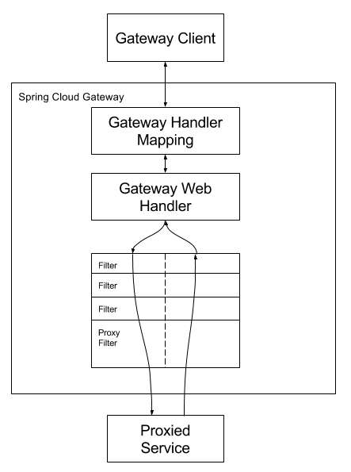
   - 客户端向`Spring Cloud Gateway`发出请求。如果`Gateway Handler Mapping`确定请求与路由匹配，则将其发送到`Gateway Web Handler`。此`handler`通过特定于该请求的过滤器链处理请求。图中 filters 被虚线划分的原因是 filters 可以在发送代理请求之前或之后执行逻辑。先执行所有`pre filter`逻辑，然后进行请求代理。在请求代理执行完后，执行`post filter`逻辑。

## 2. 使用 gateway

1. 创建 gateway 模块
   - 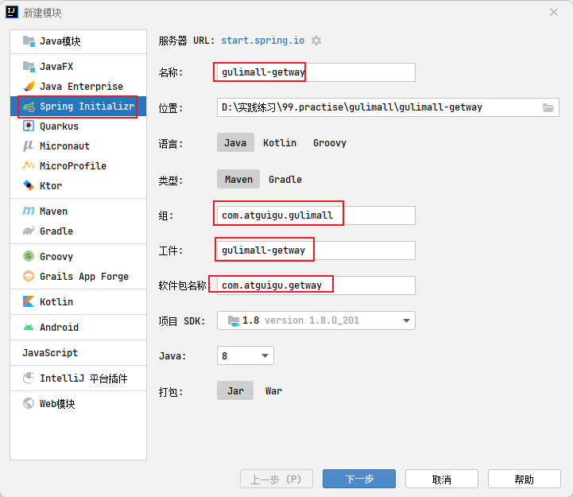
   - 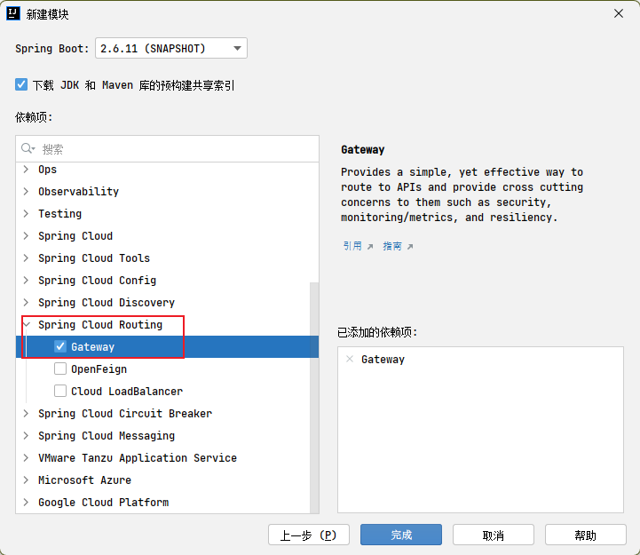
2. 修改依赖：
   - 修改 gulimall-gateway 的 spring boot、spirng cloud 版本与项目一致
     - 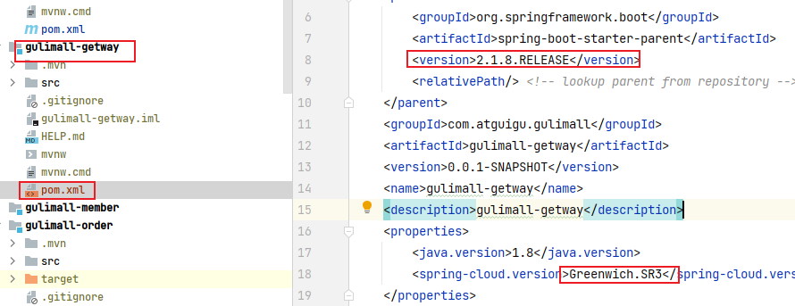
   - 给 guilimall-gateway 添加 gulimall-common 依赖，使得网关也能够注册到注册中心
     - 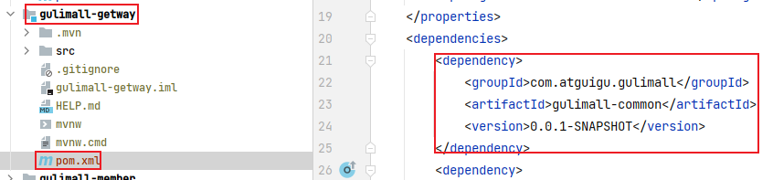
3. 配置网关：
   - 打开 com.atguigu.gateway.GulimallgatewayApplication 类的服务注册发现：`@EnableDiscoveryClient`
     - 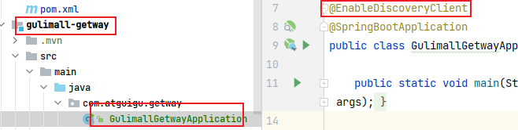
   - 在 gulimall-gateway 的 resources 下的 application.properties 配置文件中，指定注册中心地址和该服务名称。【由于后面两部操作的作用是代替注册中心的配置文件，所以这一步也可以不要】
     - 讲道理，创建 application.yml 文件，按照 6.2 的方式写应该也可以。
     - 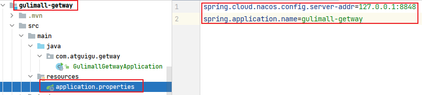
   - 在 nacos 中创建 gulimall-getwa 的名称空间
     - 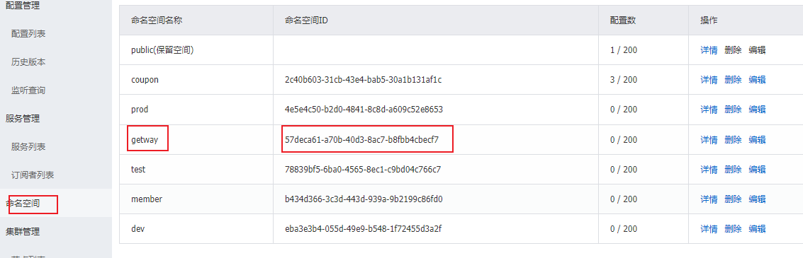
   - 在 gateway 的命名空间下，创建配置，指定名称，编辑注册中心`application.yml`文件的内容
     - 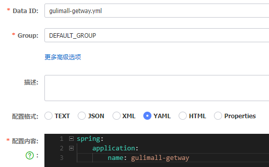
     - 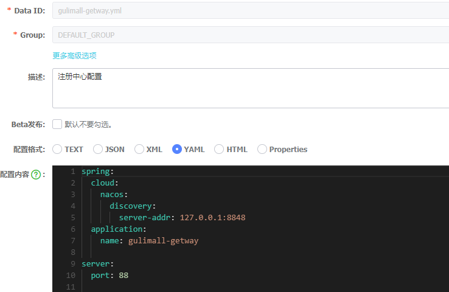
     - 上面的配置等价于：

```properties
spring.cloud.nacos.config.server-addr=127.0.0.1:8848
spring.application.name=gulimall-gateway

server.port=88
```

- 在 gulimall-gateway 的 resources 下创建 bootstrap.properties 配置文件，指定配置中心地址和该服务名称、以及命名空间。
  - 由于当前在 gateway 的命名空间中只设置了一个配置，且为默认分组，所以设定配置的内容可以省略【测试不能省略！！！！】。
  - 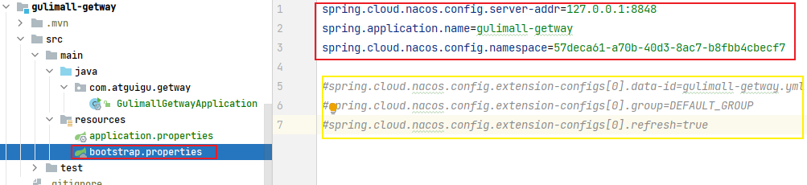

4. 测试网关：
   - 修改 com.atguigu.gateway.GulimallgatewayApplication 类的 spring boot 配置注解，排除与数据源有关的配置：`@@SpringBootApplication(exclude = {DataSourceAutoConfiguration.class})`
     - 因为 gulimall-geway 模块以来了 gulimall-common，而 gulimall-common 使用了 mysql，如果不配置数据源会报错，所以要排除。
     - 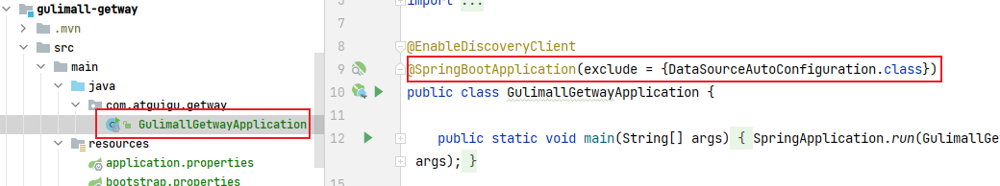
   - 启动 main 方法
     - 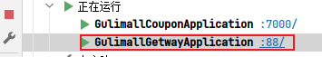

## 3. 配置路由规则

本地文件写在`reosurces/application.yml`文件，也可写在配置中心中。这里采用写在本地的方式，测试访问 http://localhost:88?whw=baidu 跳转到www.baidu.com的网关设置；请求http://localhost:88?whw=qq跳转到www.qq.com。

```yaml
spring:
  cloud:
    gateway:
      routes:
        - id: baidu_route
          uri: https://www.baidu.com
          predicates:
          - Query=whw,baidu

        - id: qq_route
          uri: https://www.qq.com
          predicates:
            - Query=whw,qq
```

上述案例中，uri 如果要映射至本地服务的路径，而且本地服务不止一个，所以就通过服务名进行映射，因此需要使用`lb://`的方式。

```yaml
spring:
  cloud:
    gateway:
      routes:
        - id: product_route
          uri: lb://gulimall-product
          predicates:
            - Path=/api/product/**
          filters:
            - RewritePath=/api/(?<segment>.*),/$\{segment}
```

filter 表示路径重写，/api/product/**表示前端的访问路径，gateway 接收到后，转换成/product/**

## 4. 配置跨域

跨域流程：根据[文档](https://developer.mozilla.org/zh-CN/docs/Web/HTTP/CORS#%E8%8B%A5%E5%B9%B2%E8%AE%BF%E9%97%AE%E6%8E%A7%E5%88%B6%E5%9C%BA%E6%99%AF)，只有简单请求才会发生一次请求且不会发生跨域。否则会先发送预检（options）请求，用于询问能否跨域。
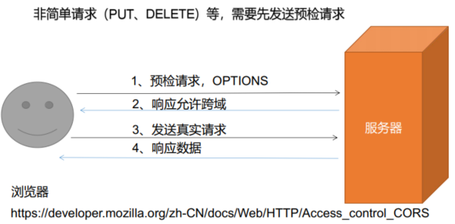
跨域的一般解决方式：

- 使用 nginx 代理服务器。
  - 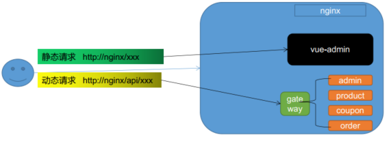
- 给 options 的相应添加响应头，使用`@CrossOrigin`注解，在方法、类前面可以进行响应头添加
  - 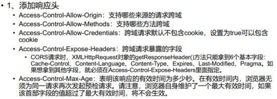
- 使用过滤器简化给响应添加响应头，减少代码编写。【即全局配置】
  - 创建配置类，将 CorsWebFilter 对象添加到 IOC 容器

```java
@Configuration
public class GulimallCorsConfiguration {
    @Bean
    public CorsWebFilter corsWebFilter(){
        UrlBasedCorsConfigurationSource source = new UrlBasedCorsConfigurationSource();
        CorsConfiguration corsConfiguration = new CorsConfiguration();
        corsConfiguration.addAllowedHeader("*");//允许所有请求头
        corsConfiguration.addAllowedMethod("*");//允许任意请求方法
        corsConfiguration.addAllowedOrigin("*");//允许所有请求来源
        corsConfiguration.setAllowCredentials(true);//允许携带cookie跨域
        source.registerCorsConfiguration("/**", corsConfiguration);// /**表示所有路径都需要跨域
        return new CorsWebFilter(source);
    }
}
```
