*在web应用开发中，安全无疑是十分重要的，选择Spring Security来保护web应用是一个非常好的选择。Spring Security 是spring项目之中的一个安全模块，可以非常方便与spring项目无缝集成。*
<!-- more -->

## 1. 权限管理

### 1.1 从 springsecurity 认识权限管理

#### 1.1.1 权限管理的作用

主要用于权限认证。
即：尚筹网前部分做的登录验证、需要登录状态访问的拦截、密码加密（使用盐值）。
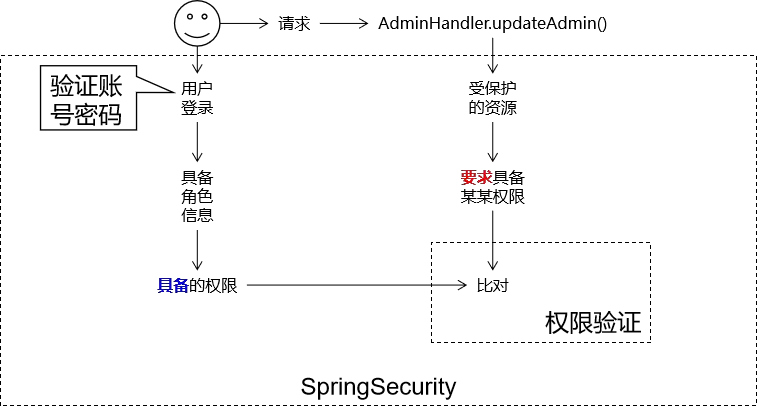
图中虚线框内即为 springsecurity 的作用。用户登录系统时我们协助 SpringSecurity 把用户对应的角色、 权限组装好， 同时把各个资源所要求的权限信息设定好， 剩下的“ 登录验证”、 “ 权限验证” 等等工作都交给 SpringSecurity。

#### 1.2 权限管理中的相关概念

1. 主体：principal
   - 使用系统的用户或设备或从其他系统远程登录的用户等等。
   - 简单说就是谁使用系统谁就是主体。
2. 认证：authentication
   - 权限管理系统确认一个主体的身份， 允许主体进入系统。 简单说就是“主体” 证明自己是谁。
   - 笼统的认为就是以前所做的登录操作。
3. 授权：authorization
   - 将操作系统的“权力”“授予”“主体”， 这样主体就具备了操作系统中特定功能的能力。
   - 授权就是给用户分配权限。

#### 1.3 作用流程

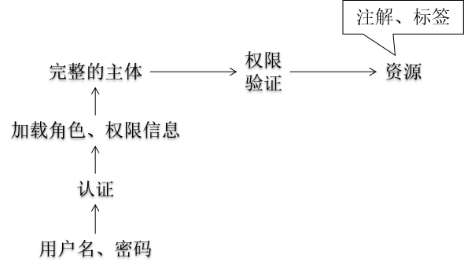

### 1.2 权限管理的主流框架

#### 1.2.1 springsecurity

Spring 技术栈的组成部分。

- 和 Spring 无缝整合。
- 全面的权限控制。
- 专门为 Web 开发而设计。
  - 旧版本不能脱离 Web 环境使用。
  - 新版本对整个框架进行了分层抽取， 分成了核心模块和 Web 模块。 单独
    引入核心模块就可以脱离 Web 环境。
- 重量级

#### 1.2.2 shiro

Apache 旗下的轻量级权限控制框架。

- 轻量级。 Shiro 主张的理念是把复杂的事情变简单。 针对对性能有更高要求的
  互联网应用有更好表现。
- 通用性。
  - 好处： 不局限于 Web 环境， 可以脱离 Web 环境使用。
  - 缺陷： 在 Web 环境下一些特定的需求需要手动编写代码定制。

## 2. 基本使用

### 2.1 渐进式增强

#### 2.1.1 实验一：新建 springmvc 项目

1. 创建工程 springmvc 的 web 工程

```xml
<dependencies>
    <dependency>
        <groupId>org.springframework</groupId>
        <artifactId>spring-webmvc</artifactId>
        <version>4.3.20.RELEASE</version>
    </dependency>
    <!-- 引入Servlet容器中相关依赖 -->
    <dependency>
        <groupId>javax.servlet</groupId>
        <artifactId>servlet-api</artifactId>
        <version>2.5</version>
        <scope>provided</scope>
    </dependency>
    <!-- JSP页面使用的依赖 -->
    <dependency>
        <groupId>javax.servlet.jsp</groupId>
        <artifactId>jsp-api</artifactId>
        <version>2.1.3-b06</version>
        <scope>provided</scope>
    </dependency>
</dependencies>
```

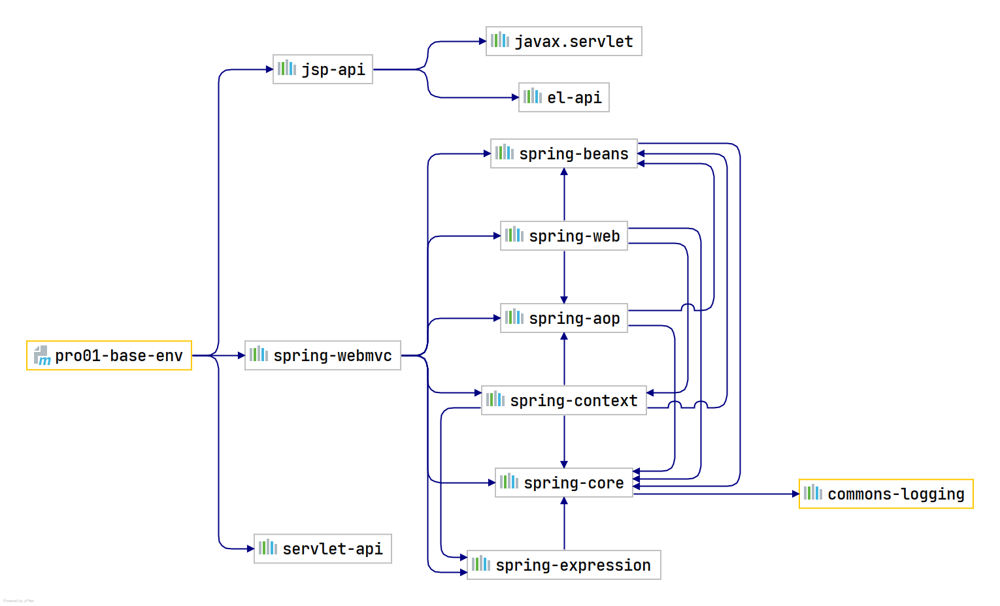

2. web.xml 中配置 DispatcherServlet

```xml
<servlet>
  <servlet-name>springDispatcherServlet</servlet-name>
  <servlet-class>org.springframework.web.servlet.DispatcherServlet</servlet-class>
  <init-param>
    <param-name>contextConfigLocation</param-name>
    <param-value>classpath:spring-mvc.xml</param-value>
  </init-param>
  <load-on-startup>1</load-on-startup>
</servlet>

<!-- Map all requests to the DispatcherServlet for handling -->
<servlet-mapping>
  <servlet-name>springDispatcherServlet</servlet-name>
  <url-pattern>/</url-pattern>
</servlet-mapping>
```

- 加载 springmvc 配置文件，创建 DispatcherServlet

3. springmvc.xml 文件中配置 springsceurity 的扫描包、开启注解驱动、开启 servlet 默认前端控制器

```xml
<?xml version="1.0" encoding="UTF-8"?>
<beans xmlns="http://www.springframework.org/schema/beans"
       xmlns:xsi="http://www.w3.org/2001/XMLSchema-instance"
       xmlns:context="http://www.springframework.org/schema/context"
       xmlns:mvc="http://www.springframework.org/schema/mvc"
       xsi:schemaLocation="http://www.springframework.org/schema/mvc http://www.springframework.org/schema/mvc/spring-mvc-4.3.xsd
		http://www.springframework.org/schema/beans http://www.springframework.org/schema/beans/spring-beans.xsd
		http://www.springframework.org/schema/context http://www.springframework.org/schema/context/spring-context-4.3.xsd">

    <context:component-scan base-package="iceriver.springsecurity"/>
    <bean class="org.springframework.web.servlet.view.InternalResourceViewResolver">
        <property name="prefix" value="/WEB-INF/views/"/>
        <property name="suffix" value=".jsp"/>
    </bean>
    <mvc:annotation-driven/>
    <mvc:default-servlet-handler/>
</beans>
```

4. 此时还未引入 springsecurity，创建了一个解析`/WEB-INF/views/*.jsp`文件的普通项目

#### 2.1.2 实验二：引入 springsecurity

1. 添加依赖：

```xml
<!-- SpringSecurity 对 Web 应用进行权限管理 -->
<dependency>
  <groupId>org.springframework.security</groupId>
  <artifactId>spring-security-web</artifactId>
  <version>4.2.10.RELEASE</version>
</dependency>
<!-- SpringSecurity 配置 -->
<dependency>
  <groupId>org.springframework.security</groupId>
  <artifactId>spring-security-config</artifactId>
  <version>4.2.10.RELEASE</version>
</dependency>
<!-- SpringSecurity 标签库 -->
<dependency>
  <groupId>org.springframework.security</groupId>
  <artifactId>spring-security-taglibs</artifactId>
  <version>4.2.10.RELEASE</version>
</dependency>
```

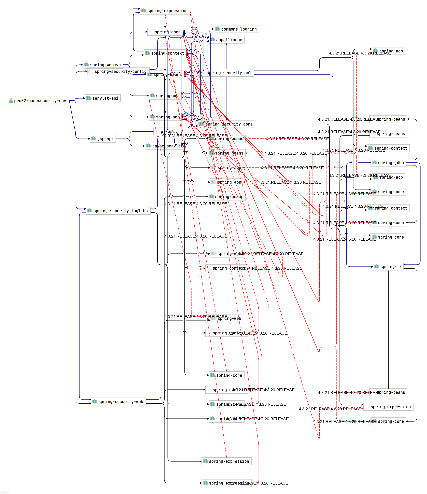

- 没法看

2. web.xml 文件中配置过滤器

```xml
<filter>
  <filter-name>springSecurityFilterChain</filter-name>
  <filter-class>org.springframework.web.filter.DelegatingFilterProxy</filter-class>
</filter>
<filter-mapping>
  <filter-name>springSecurityFilterChain</filter-name>
  <url-pattern>/*</url-pattern>
</filter-mapping>
```

- SpringSecurity 使用的是过滤器 Filter 而不是拦截器 Interceptor，意味着`SpringSecurity`能够管理的不仅仅是 SpringMVC 中的 handler 请求，还包含 Web 应用中所有请求。 比如：项目中的静态资源也会被拦截， 从而进行权限控制。
- 特别注意：<filter-name>springSecurityFilterChain</filter-name> 标 签 中 必 须 是 springSecurityFilterChain。 因为 springSecurityFilterChain 在 IOC 容器中对应真正执行权限控制的二十几个 Filter， 只有叫这个名字才能够加载到这些 Filter。

3. 创建配置类，使用@EnableWebSecurity 注解开启 springsecurity 安全控制功能

```java
package iceriver.springsecurity.config;

import org.springframework.context.annotation.Configuration;
import org.springframework.security.config.annotation.web.configuration.EnableWebSecurity;
import org.springframework.security.config.annotation.web.configuration.WebSecurityConfigurerAdapter;

/**
 * @author zhuyuqi
 * @version v0.0.1
 * @className WebSecurityConfig
 * @description https://developer.aliyun.com/profile/sagwrxp2ua66w
 * @date 2022/09/04 10:03
 */
@Configuration
@EnableWebSecurity
public class WebSecurityConfig extends WebSecurityConfigurerAdapter {
}
```

4. 此时所有请求都被拦截，要求登录才能访问，登录失败有错误提示
   - 静态资源也被拦截，要求登录

#### 2.1.3 实验三：放行首页和静态资源

1. 在 WebSecurityConfig 中重写父类的 configure(HttpSecurity security)方法。

```java
@Configuration
@EnableWebSecurity
public class WebSecurityConfig extends WebSecurityConfigurerAdapter {
    @Override
    protected void configure(HttpSecurity security) throws Exception {
        //super.configure(security); 注释掉将取消父类方法中的默认规则
		security.authorizeRequests()			                // 对请求进行授权
                .antMatchers("/index.jsp")		// 针对/index.jsp路径进行授权
                .permitAll()					                // 可以无条件访问
                .antMatchers("/layui/**")		// 针对/layui目录下所有资源进行授权
                .permitAll()					                // 可以无条件访问
    }
}
```

2. 效果：访问/layui 路径下的 index.jsp 会放行，访问/layui 路径下的其他资源会报 403 错误
   - 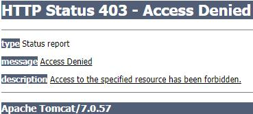

#### 2.1.4 实验四：未认证请求跳转到登录页

1. 目标：解决访问/layui 路径下的其他资源报 403 错误，实现跳转到登录页。
2. 继续重写父类的 configure(HttpSecurity security)方法。

```java
@Configuration
@EnableWebSecurity
public class WebSecurityConfig extends WebSecurityConfigurerAdapter {
    @Override
    protected void configure(HttpSecurity security) throws Exception {
        //super.configure(security); 注释掉将取消父类方法中的默认规则
        security.authorizeRequests()			                // 对请求进行授权
                .antMatchers("/index.jsp")		// 针对/index.jsp路径进行授权
                .permitAll()					                // 可以无条件访问
                .antMatchers("/layui/**")		// 针对/layui目录下所有资源进行授权
                .permitAll()					                // 可以无条件访问

                .and()
                .authorizeRequests()			// 对请求进行授权
                .anyRequest()					// 任意请求
                .authenticated()				// 需要登录以后才可以访问
                .and()
                .formLogin()					// 使用表单形式登录
                // 指定登录页的同时会影响到：“提交登录表单的地址”、“退出登录地址”、“登录失败地址“
				.loginPage("/index.jsp")		// 指定登录页面（如果没有指定会访问SpringSecurity自带的登录页）
                // loginProcessingUrl()方法指定了登录地址，就会覆盖loginPage()方法中设置的默认值/index.jsp POST
                .loginProcessingUrl("/do/login.html");	// 指定form表单提交的地址
    }
}
```

3. loginPage()方法的说明 1：没有指定我们自己的地址时，拦截了会跳转到 springsecurity 的登录页
4. loginPage()方法的说明 2：
   - index.jsp GET 请求——去登录页面
   - index.jsp POST 请求——提交登录表单
   - index.jsp?error GET 请求——登录失败
   - index.jsp?logout GET 请求退出登录

#### 2.1.5 实验五：实现登录

1. 登录策略：
   - 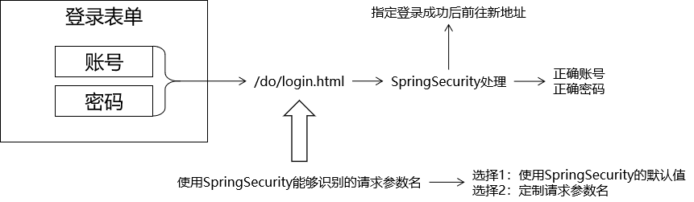
2. 设置登录页 index.jsp 的 form 表单地址、inputname 属性

```html
<p>${SPRING_SECURITY_LAST_EXCEPTION.message}</p>
<form action="${pageContext.request.contextPath }/do/login.html" method="post">
  <input type="hidden" name="${_csrf.parameterName}" value="${_csrf.token}" />
  <input name="loginAcct" />
  <input name="userPswd" />
</form>
```

- form 表单中第一个 input 隐藏域设置的是跨域，未写该句提交表单不论账号密码正不正确，都会报 403 错误。（如果 spring security 设置了 crsf().disable()就不需要这句了）
  - 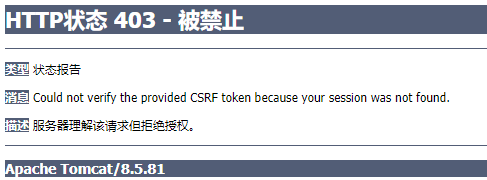
- SpringSecurity 默认账号的请求参数名： username
- SpringSecurity 默认密码的请求参数名： password
- 要么修改页面上的表单项的 name 属性值， 要么修改配置。
- 修改配置可以调用 usernameParameter()和 passwordParameter()方法。
  - 这里采用了在配置类中修改。

```java
public class WebSecurityConfig extends WebSecurityConfigurerAdapter {
    @Override
    protected void configure(HttpSecurity security) throws Exception {
        //super.configure(security); 注释掉将取消父类方法中的默认规则
        security.authorizeRequests()			                // 对请求进行授权
            	……
                .rocessingUrl()方法指定了登录地址，就会覆盖loginPage()方法中设置的默认值/index.jsp
                .loginProcessingUrl("/do/login.html")	// 指定form表单提交的地址

                .usernameParameter("loginAcct") // 定制登录账号的请求参数名
                .passwordParameter("userPswd") // 定制登录密码的请求参数名
                .defaultSuccessUrl("/main.jsp"); //设置登录成功后默认前往的 URL 地址
    }
}
```

- 这里 defaultSuccessUrl 地址写”main.html“是为了将请求发给 controlle 处理

4. 重写另外一个父类的方法 configure(AuthenticationManagerBuilder builder)， 来设置登录系统的账号密码 （内存中校验）

```java
 @Override
protected void configure(AuthenticationManagerBuilder builder) throws Exception {
    //super.configure(auth); 一定要禁用默认规则
    builder.inMemoryAuthentication()
            .withUser("tom").password("123123") //设置账号密码
            .roles("ADMIN") //设置角色
            .and()
            .withUser("jerry").password("456456")//设置另一个账号密码
            .authorities("SAVE","EDIT"); //设置权限
}
```

5.  Cross-site request forgery 跨站请求伪造：发送登录请求时要携带\_csrf 值

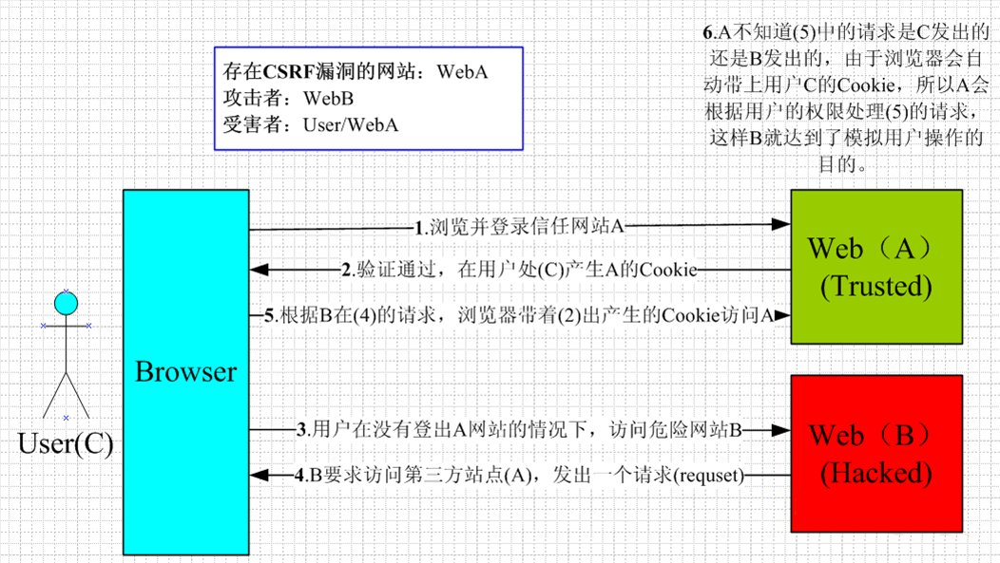
举例：webA 为银行，webB 为钓鱼网站，UserC 在未登出 WebA 的情况下访问了 webB，导致 webB 伪装成 UserC 给 webA 发了个转账请求，webA 通过 cookie 验证了 UserC 的身份，执行了转账请求。
如果此时加入了\_csrf 值，即 token 隐藏令牌，WebA 会比对该值，一致才执行操作。
问题：上面博客中防范措施一 token 隐藏令牌也是保存在 cookie 里的，那肯定能通过验证啊。
而且如果使用防范措施二：请求头中哪个是？
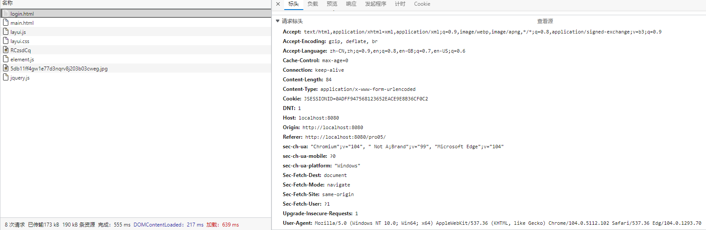

#### 2.1.6 实验六：开启注销功能（禁用 csrf）

1. 实现方式：调用 HttpSecurity 对象的一系列方法设置注销功能。
   - logout()方法： 开启注销功能
   - logoutUrl()方法： 自定义注销功能的 URL 地址
   - logoutSuccessUrl()方法： 退出成功后前往的 URL 地址
   - addLogoutHandler()方法： 添加退出处理器
   - logoutSuccessHandler()方法： 退出成功处理器
2. 禁用 CSRF 功能

```java
public class WebSecurityConfig extends WebSecurityConfigurerAdapter {
    @Override
    protected void configure(HttpSecurity security) throws Exception {
        //super.configure(security); 注释掉将取消父类方法中的默认规则
        security.authorizeRequests()			                // 对请求进行授权
            	……
                .defaultSuccessUrl("/main.jsp"); //设置登录成功后默认前往的 URL 地址

               .and()
            	.csrf()
                .disable()//禁用csrf功能
                .logout()//开启退出功能
                .logoutUrl("/do/logout.html")//退出请求地址
                .logoutSuccessUrl("/index.jsp");//退出后展示地址
    }
}
```

3. 修改退出前端页面

```html
<a id="logoutAnchor" href="${pageContext.request.contextPath }/do/logout.html"
  >退出</a
>
```

4. 由于禁用了 crsf，此时登录页的 csrf 隐藏域会失效。不会报 403 错误

#### 2.1.7 实验七：开启注销功能（开启 csrf）

1. 如果 CSRF 功能没有禁用， 那么要求页面上的请求必须是 POST 方式。
2. 将退出的 a 标签换为 form 表单

```html
<form
  id="logoutForm"
  action="${pageContext.request.contextPath }/my/logout"
  method="post"
>
  <input type="hidden" name="${_csrf.parameterName}" value="${_csrf.token}" />
</form>
<a id="logoutAnchor" href="">退出</a>
<script type="text/javascript">
  window.onload = function () {
    var anchor = document.getElementById("logoutAnchor");
    anchor.onclick = function () {
      document.getElementById("logoutForm").submit();
      return false;
    };
  };
</script>
```

3. 修改 configure(HttpSecurity security)方法

```java
public class WebSecurityConfig extends WebSecurityConfigurerAdapter {
    @Override
    protected void configure(HttpSecurity security) throws Exception {
        //super.configure(security); 注释掉将取消父类方法中的默认规则
        security.authorizeRequests()			                // 对请求进行授权
            	……
                .defaultSuccessUrl("/main.jsp"); //设置登录成功后默认前往的 URL 地址

               .and()
            	//.csrf()
                //.disable()//禁用csrf功能
                .logout()//开启退出功能
                .logoutUrl("/do/logout.html")//退出请求地址
                .logoutSuccessUrl("/index.jsp");//退出后展示地址
    }
}
```

#### 2.1.8 实验八：基于角色或权限进行访问控制

1. 通过 HttpSecurity 对象设置资源的角色要求 ，只要角色或权限有一个满足即可。再通过 `AuthenticationManagerBuilder `对象设置用户登录时具备的角色
2. configure(HttpSecurity security)中规划权限，控制要访问的资源

```java
public class WebSecurityConfig extends WebSecurityConfigurerAdapter {
    @Override
    protected void configure(HttpSecurity security) throws Exception {
        //super.configure(security); 注释掉将取消父类方法中的默认规则
        security.authorizeRequests()			                // 对请求进行授权
				.antMatchers("/index.jsp")		// 针对/index.jsp路径进行授权
                .permitAll()					                // 可以无条件访问
                .antMatchers("/layui/**")		// 针对/layui目录下所有资源进行授权
                .permitAll()					                // 可以无条件访问

                .antMatchers("/level1/**")		// 针对/level1/**路径设置访问要求
                .hasRole("学徒")					// 要求用户具备“学徒”角色才可以访问
                .antMatchers("/level2/**")		// 针对/level2/**路径设置访问要求
                .hasAuthority("内门弟子")			// 要求用户具备“内门弟子”权限才可以访问
            	……
                .logoutSuccessUrl("/index.jsp");//退出后展示地址
    }
}
```

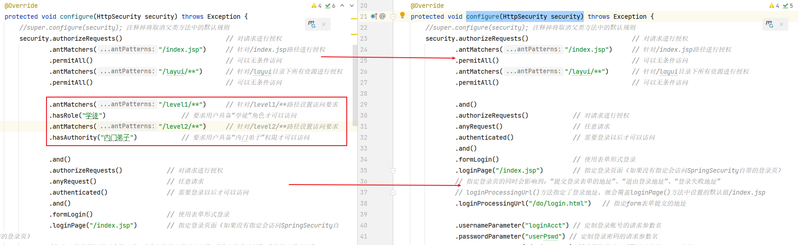

- 注意设置权限的顺序，上面的要相对小。
- /level1/\*\*等路径在 handler 中做了请求映射
- 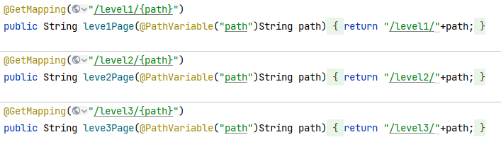

3. 在 configure(AuthenticationManagerBuilder builder)中指定登录账号的角色/权限

```java
@Override
protected void configure(AuthenticationManagerBuilder builder) throws Exception {
    //super.configure(auth); 一定要禁用默认规则
    builder.inMemoryAuthentication()
            .withUser("tom").password("123123") //设置账号密码
            .roles("ADMIN","学徒")				// 指定当前用户的角色
            .and()
            .withUser("jerry")			// 指定账号
            .password("123123")			// 指定密码
            .authorities("UPDATE","内门弟子");		// 指定当前用户的权限
}
```

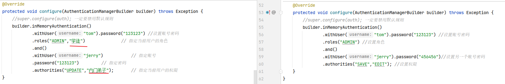

4. 如果被拒绝，则报 403 错误
   - 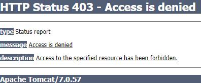
5. 注意3 步：调用 hasRole()方法时，SpringSecurity 会在角色字符串前面加“ROLE\_” 前缀 ，使用数据库时要注意。这也是 hasRole()方法和 hasAuthority()方法的区别

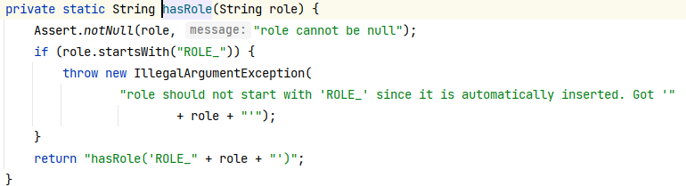
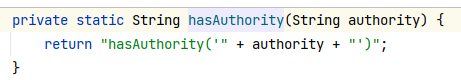
相应的，在给角色分配权限的时候 roles()会给角色加上"ROLE*"，然后再调用 authorities()方法。
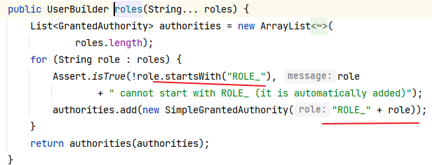
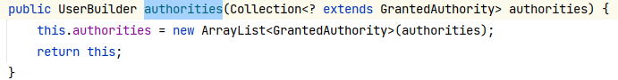
总结：SpringSecurity 会在底层用“ ROLE*” 区分角色和权限。 角色信息会被附加
“ROLE*” 前缀。
hasRole()会添加"ROLE*"前缀，分配权限是应该使用 roles()方法保持对应。或者使用 hasAuthority()和 authorities()方法对应。

#### 2.1.9 实验九：403-error

1. 目前访问被拒绝时会跳转到 403 页面。
2. 为了优化体验，在 configure(HttpSecurity security)方法中定义 403 后的跳转页面
   - 方式一使用 handler 和 security 分类的方式
   - 方式二利用了 AccessDeniedHandler 接口的匿名实现，冲洗了 handle 方法

```java
  @Override
    protected void configure(HttpSecurity security) throws Exception {
        //super.configure(security); 注释掉将取消父类方法中的默认规则
        security.authorizeRequests()			                // 对请求进行授权
                ……
                .logoutSuccessUrl("/index.jsp")//退出后展示地址

                . and()
                .exceptionHandling()					// 指定异常处理器
                // .accessDeniedPage("/to/no/auth/page.html")	// 方式一：访问被拒绝时前往的页面
                //方式二：
                .accessDeniedHandler(new AccessDeniedHandler() {
                    @Override
                    public void handle(HttpServletRequest request, HttpServletResponse response,
                                       AccessDeniedException accessDeniedException) throws IOException, ServletException {
                        request.setAttribute("message", "抱歉！您无法访问这个资源！☆☆☆");
                        request.getRequestDispatcher("/WEB-INF/views/no_auth.jsp").forward(request, response);
                    }
                });
    }
```

#### 2.1.10 实验十：记住我（内存版）

1. 功能解释：第一次登陆后关闭浏览器，再次打开不需要登录。
2. 在 configure(HttpSecurity security)方法中调用 rememberMe()方法 ，开启功能。

```java
  @Override
    protected void configure(HttpSecurity security) throws Exception {
        //super.configure(security); 注释掉将取消父类方法中的默认规则
        security.authorizeRequests()			                // 对请求进行授权
                ……
                .accessDeniedHandler(new AccessDeniedHandler() {
                    @Override
                    public void handle(HttpServletRequest request, HttpServletResponse response,
                                       AccessDeniedException accessDeniedException) throws IOException, ServletException {
                        request.setAttribute("message", "抱歉！您无法访问这个资源！☆☆☆");
                        request.getRequestDispatcher("/WEB-INF/views/no_auth.jsp").forward(request, response);
                    }
                })

                .and()
                .rememberMe();//记录等级状态
    }
```

3. 登录表单设置”记住我“checkbox，name 属性为"rember-me"

```html
<input type="checkbox" name="remember-me" lay-skin="primary" title="记住我" />
```

4. 原理：将账户信息保存到 cookie 中
   - 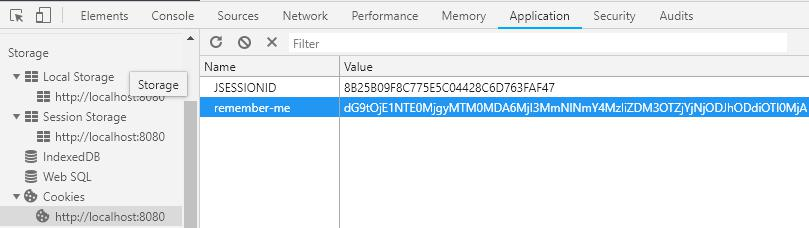
   - 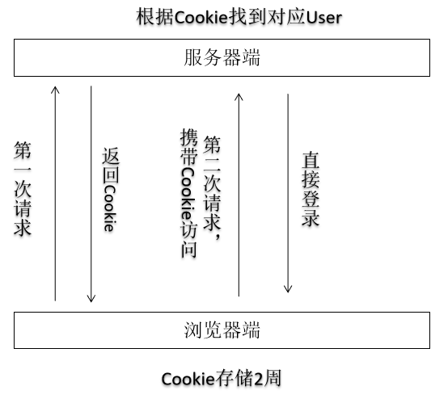
5. 个性化配置

```java
.rememberMe()
    .rememberMeParameter("remember-me-new")
    .rememberMeCookieName("remember-me-cookie")
    .tokenValiditySeconds(2 * 24 * 60 * 60);
```

- okenValiditySeconds 用于设置 token 的有效期，即多长时间内可以免除重复登录，单位是秒。不修改配置情况下默认是 2 周。
- 通过 rememberMeParameter 设置 from 表单“自动登录”勾选框的参数名称。如果这里改了，from 表单中 checkbox 的 name 属性要对应的更改。如果不设置默认是 remember-me。
- rememberMeCookieName 设置了保存在浏览器端的 cookie 的名称，如果不设置默认也是 remember-me。

#### 2.1.11 实验十一：记住我（数据库版）

1. 上述记住我的方式将登录信息保存在内存中，虽然关闭浏览器不失效，但服务区重启后，本地保存的 cookie 与服务区的验证不一致，所以也无法通过，所以需要在数据库中保存登录状态更稳定。
2. 添加数据库依赖

```xml
<!-- https://mvnrepository.com/artifact/com.alibaba/druid -->
<dependency>
    <groupId>com.alibaba</groupId>
    <artifactId>druid</artifactId>
    <version>1.1.12</version>
</dependency>
<!-- mysql 驱动 -->
<!-- https://mvnrepository.com/artifact/mysql/mysql-connector-java -->
<dependency>
    <groupId>mysql</groupId>
    <artifactId>mysql-connector-java</artifactId>
    <version>5.1.47</version>
</dependency>
<dependency>
    <groupId>org.springframework</groupId>
    <artifactId>spring-orm</artifactId>
    <version>4.3.20.RELEASE</version>
</dependency>
```

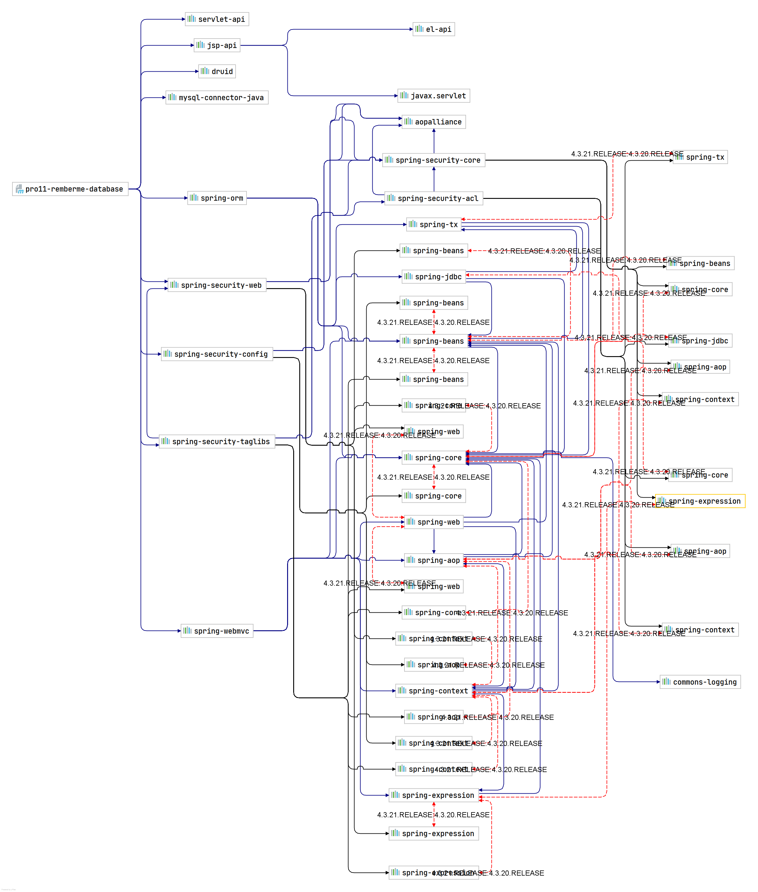

2. springmvc 配置文件中添加数据源

```xml
  <!-- 配置数据源 -->
  <bean id="dataSource" class="com.alibaba.druid.pool.DruidDataSource">
      <property name="username" value="root"/>
      <property name="password" value="dimitre123"/>
      <property name="url" value="jdbc:mysql://localhost:13306/security?useSSL=false"/>
      <property name="driverClassName" value="com.mysql.jdbc.Driver"/>
  </bean>
  <!-- jdbcTemplate-->
  <bean id="jdbcTemplate" class="org.springframework.jdbc.core.JdbcTemplate">
      <property name="dataSource" ref="dataSource"/>
  </bean>
```

- 这里还在数据库创建了 security 的数据库。

3. 在配置类中注入数据源

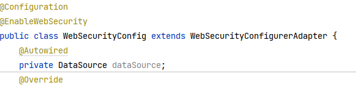

4. 在 configure(HttpSecurity security)方法中调用 tokenRepository()方法 ，开启令牌仓库功能

```java
public class WebSecurityConfig extends WebSecurityConfigurerAdapter {
    @Autowired
    private DataSource dataSource;
    @Override
    protected void configure(HttpSecurity security) throws Exception {

        JdbcTokenRepositoryImpl tokenRepository = new JdbcTokenRepositoryImpl();
        tokenRepository.setDataSource(dataSource);

        //super.configure(security); 注释掉将取消父类方法中的默认规则
        security.authorizeRequests()			                // 对请求进行授权
                ……
                .and()
                .rememberMe()//记录等级状态

                .tokenRepository(tokenRepository);//开启令牌仓库功能
    }
    ……
}
```

5. 按照 JdbcTokenRepositoryImpl 中的代码创建数据库表：

```java
CREATE TABLE persistent_logins (
    username VARCHAR (64) NOT NULL,
    series VARCHAR (64) PRIMARY KEY,
    token VARCHAR (64) NOT NULL,
    last_used TIMESTAMP NOT NULL
);
```

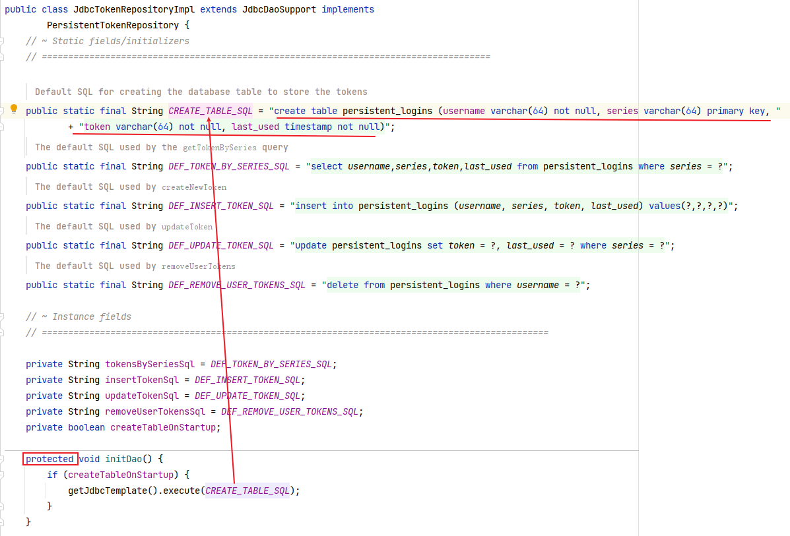

- 这里虽然 JdbcTokenRepositoryImpl 类中的 initDao()调用了创表语句，但是 initDao()不是自动执行，需要外部调用以下。
- 但是又因为 initDao()方法设置成了 protected 修饰，导致只能是同包或子类调用。
- 而 WebSecurityConfig 已经继承了 WebSecurityConfigurerAdapter，且让他继承 JdbcTokenRepositoryImpl 不合语义。
- 要么就按照上述的方式手动创建。
- 要么就修改源码，手动调用：创建一个一模一样的包，把 JdbcTokenRepositoryImpl 原封不动拷贝过来，WebSecurityConfig 中注入了 tokenRepository 后，执行 tokenRepository.initDao()

6. 此时登录后关闭浏览器、重启服务器，只要 cookie 还在，就能自动登录，而退出登录，也会删除本地 cookie，删除数据库表。
   - 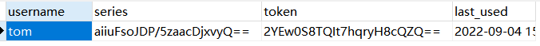

#### 2.1.12 实验十二：数据库数据登录

1. 前面的功能中，登录账号和密码写死在了方法中

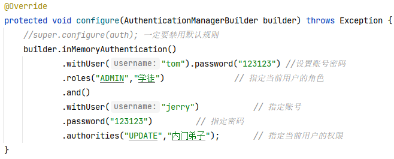

2. `springsecurity`中实现数据库登录使用的是`configure(AuthenticationManagerBuilder builder)`方法中的`builder.jdbcAuthentication().usersByUsernameQuery("tom");`，在`usersByUsernameQuery("tom")`等方法中最终调用 JdbcDaoImpl 类的方法查询数据库。 而 `SpringSecurity `的默认实现已经将 SQL 语句硬编码在了`JdbcDaoImpl `类中。
   - 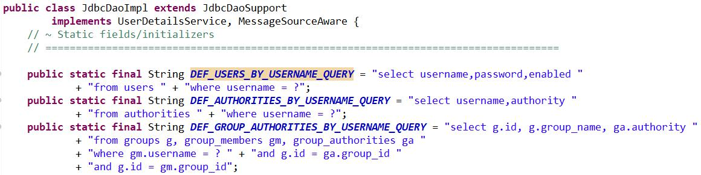
   - 此时要利用 springsecurity 的功能，只有三个选择;
     - 按照 JdbcDaoImpl 类中 SQL 语句设计表结构。（与项目的适配性不高）
     - 修改 JdbcDaoImpl 类的源码。（使用了 mybatis 框架时，数据库操作通过 mybaits 执行，不经过 springsecurity）
     - 不使用 jdbcAuthentication()。
3. 创建数据库：
   - 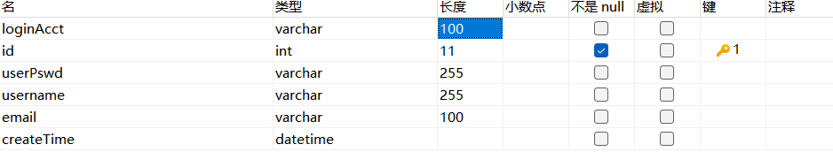
4. 自定义数据库查询方法：创建自定义类，实现 userDetailsService 接口。
   - 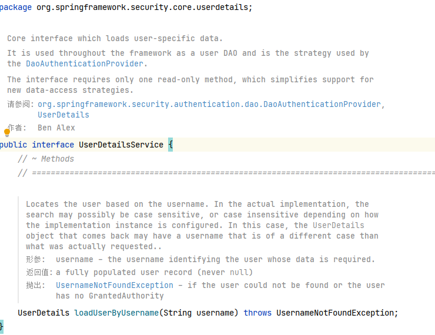

```java
@Component
public class MyUserDetailsService implements UserDetailsService {
    @Autowired
    private JdbcTemplate jdbcTemplate;
    @Override
    public UserDetails loadUserByUsername(String username) throws UsernameNotFoundException {
        //1.使用 SQL 语句根据用户名查询用户对象
        String sql = "SELECT id,loginAcct,userPswd,username,email,cretaTime FROM t_admin WHERE loginAcct = ?";
        List<Admin> list = jdbcTemplate.query(sql, new BeanPropertyRowMapper<>(Admin.class));
        Admin admin = list.get(0);
        String userPswd = admin.getUserPswd();
        //2.设置权限信息
        List<GrantedAuthority> authorities = new ArrayList<>();
        authorities.add(new SimpleGrantedAuthority("ROLE_ADMIN"));
        authorities.add(new SimpleGrantedAuthority("UPDATE"));
        //3.把admin对象和authorities对象封装到UserDetails中
        return new User(username, userPswd, authorities);
    }
}
```

- 这里的 Admin 是 t_admin 的实体
- User 是`org.springframework.security.core.userdetails.User;`

5. 修正 configure(AuthenticationManagerBuilder builder)

```java
@Configuration
@EnableWebSecurity
public class WebSecurityConfig extends WebSecurityConfigurerAdapter {
    @Autowired
    private DataSource dataSource;
    @Autowired
    private MyUserDetailsService myUserDetailsService;
    @Override
    protected void configure(HttpSecurity security) throws Exception {
            	……
                .usernameParameter("loginAcct") // 定制登录账号的请求参数名
                .passwordParameter("userPswd") // 定制登录密码的请求参数名
                .defaultSuccessUrl("/main.html") //设置登录成功后默认前往的 URL 地址
    			……
    }

    @Override
    protected void configure(AuthenticationManagerBuilder builder) throws Exception {
        builder
                .userDetailsService(myUserDetailsService);
    }
}

```

- 此时可以登陆了，但是我的没访问权限，老师的不知道怎么样。
  - 但是按照做下来来说，应该有权限的。
- configure(HttpSecurity security)方法中的 loginAcct 和 MyUserDetailsService 类中的没有关系，MyUserDetailsService 只是用到了 configure(HttpSecurity security)方法中获取到的参数值，没有用参数名。

#### 2.1.13 实验十三：密码加密（md5）

1. 自定义类实现 `org.springframework.security.crypto.password.PasswordEncoder` 接口。 重写抽象方法：
   - encode()方法对明文进行加密。
   - matches()方法对明文加密后和密文进行比较

```java
@Component
public class MyPasswordEncoder implements PasswordEncoder {
    @Override
    public String encode(CharSequence rawPassword) {
        return privateEncode(rawPassword);
    }

    @Override
    public boolean matches(CharSequence rawPassword, String encodedPassword) {
        String formPassword = privateEncode(rawPassword);
        String databasePassword = encodedPassword;
        return Objects.equals(formPassword, databasePassword);
    }

    /**
     * 加密方法
     * @param rawPassword
     * @return
     */
    private String privateEncode(CharSequence rawPassword){
        //使用Javasecurity提供的md5加密工具类
        if (rawPassword == null || rawPassword.length() == 0) {
            throw new RuntimeException("传入字符不能为空");
        }
        String algorithm = "md5";
        try {
            MessageDigest messageDigest = MessageDigest.getInstance(algorithm);// Java提供的md5加密类
            byte[] bytes = ((String)rawPassword).getBytes();//将rawPassword转换为字符串后转换为字节数组
            byte[] digest = messageDigest.digest(bytes);// 执行加密
            int signum = 1;
            BigInteger bigInteger = new BigInteger(signum, digest);// 创建一个正大整数，signum为-1表示负数，为0表示0
            int radix = 16;
            String encoded = bigInteger.toString(radix).toUpperCase();// 将正大整数转换为16进制字符串
            return encoded;
        } catch (NoSuchAlgorithmException e) {
            e.printStackTrace();
        }
        return null;
    }
}
```

2. 在 WebSecurityConfig 中进行使用

```java
@Configuration
@EnableWebSecurity
public class WebSecurityConfig extends WebSecurityConfigurerAdapter {
   ……
    @Autowired
    private MyPasswordEncoder myPasswordEncoder;

    @Override
    protected void configure(HttpSecurity security) throws Exception {
		……
    }

    @Override
    protected void configure(AuthenticationManagerBuilder builder) throws Exception {
        builder
                .userDetailsService(myUserDetailsService)//权限校验
                .passwordEncoder(myPasswordEncoder);//登录密码加密与数据库比较
    }
}
```

#### 2.1.14 实验十四：密码加密（盐值）

1. md5 加密的问题：md5 使用 hash 值加密，一旦输入确定，输出就确定了。假如目前有个明文的密码库，当把它全部转成 md5 加密的字符串后，采用撞库的办法有可能猜出来。
   - 以上问题可以采用循环进行 md5 加密、使用其他进制转换等方法避免。
   - 但盐值加密是个更好的办法。
2. 盐值加密介绍：
3. springseurity 提供了`PasswordEncoder` 接口的实现类`BCryptPasswordEncoder`，其内部使用了盐值加密的相关算法。

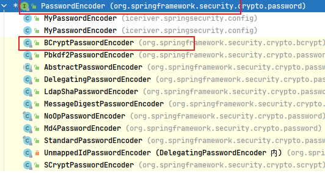

```java
@Configuration
@EnableWebSecurity
public class WebSecurityConfig extends WebSecurityConfigurerAdapter {
    @Autowired
    private DataSource dataSource;
    @Autowired
    private MyUserDetailsService myUserDetailsService;
//    @Autowired
//    private MyPasswordEncoder myPasswordEncoder;
    @Bean
    BCryptPasswordEncoder getBCryptPasswordEncoder(){
        return new BCryptPasswordEncoder();
    }
    @Autowired
    private BCryptPasswordEncoder myPasswordEncoder;

    @Override
    protected void configure(HttpSecurity security) throws Exception {
		……
    }

    @Override
    protected void configure(AuthenticationManagerBuilder builder) throws Exception {
    	……
        builder
                .userDetailsService(myUserDetailsService)//权限校验
                .passwordEncoder(myPasswordEncoder);//登录密码加密与数据库比较
    }
}

```

### 2.2 工作原理

在初始化时或第一次请求时准备好过滤器链。具体任务由具体过滤器来完成。

1. org.springframework.security.web.context.request.async.WebAsyncManagerIntegrationFilter
2. org.springframework.security.web.context.SecurityContextPersistenceFilter
3. org.springframework.security.web.header.HeaderWriterFilter
4. org.springframework.security.web.csrf.CsrfFilter
5. org.springframework.security.web.authentication.logout.LogoutFilter
6. org.springframework.security.web.authentication.UsernamePasswordAuthenticationFilter
7. org.springframework.security.web.authentication.ui.DefaultLoginPageGeneratingFilter
8. org.springframework.security.web.authentication.www.BasicAuthenticationFilter
9. org.springframework.security.web.savedrequest.RequestCacheAwareFilter
10. org.springframework.security.web.servletapi.SecurityContextHolderAwareRequestFilter
11. org.springframework.security.web.authentication.AnonymousAuthenticationFilter
12. org.springframework.security.web.session.SessionManagementFilter
13. org.springframework.security.web.access.ExceptionTranslationFilter
14. org.springframework.security.web.access.intercept.FilterSecurityInterceptor
