*MyBatis 是一款优秀的持久层框架，它支持自定义 SQL、存储过程以及高级映射。MyBatis 免除了几乎所有的 JDBC 代码以及设置参数和获取结果集的工作。MyBatis 可以通过简单的 XML 或注解来配置和映射原始类型、接口和 Java POJO（Plain Old Java Objects，普通老式 Java 对象）为数据库中的记录。*
<!-- more -->

> - 与 Spring、SpringMVC 无先后学习关系
> - 需要 JDBC 基础

## 1. MyBatis 入门

### 1.1 MyBatis 简介

#### 1.1.1 MyBatis 历史

MyBatis 最初是 Apache 的一个开源项目 iBatis, 2010 年 6 月这个项目由 Apache Software Foundation 迁移到了 Google Code。随着开发团队转投 Google Code 旗下， iBatis3.x 正式更名为 MyBatis。代码于 2013 年 11 月迁移到 Github。

iBatis 一词来源于“internet”和“abatis”的组合，是一个基于 Java 的持久层框架。 iBatis 提供的持久层框架包括 SQL Maps 和 Data Access Objects（DAO）。

#### 1.1.2 MyBatis 特性

1. MyBatis 是支持定制化 SQL、存储过程以及高级映射的优秀的持久层框架。
2. MyBatis 避免了几乎所有的 JDBC 代码和手动设置参数以及获取结果集。
3. MyBatis 可以使用简单的 XML 或注解用于配置和原始映射，将接口和 Java 的 POJO（`Plain Old Java Objects`，普通的 Java 对象）映射成数据库中的记录。
4. MyBatis 是一个 半自动的`ORM`（`Object Relation Mapping`）框架。
5. MyBatis 的配置文件分为核心配置文件和映射配置文件，核心配置文件写项目数据库连接和 MyBatis 的全局配置，映射配置写 SQL 语句。

#### 1.1.3 MyBatis 下载

MyBatis 下载地址：<https://github.com/mybatis/mybatis-3/releases>

#### 1.1.4 和其它持久化层技术对比

1. JDBC：
   - SQL 夹杂在 Java 代码中耦合度高，导致硬编码内伤
   - 维护不易且实际开发需求中 SQL 有变化，频繁修改的情况多见
   - 代码冗长，开发效率低
2. Hibernate 和 JPA
   - 操作简便，开发效率高
   - 程序中的长难复杂 SQL 需要绕过框架
   - 内部自动生产的 SQL，不容易做特殊优化
   - 基于全映射的全自动框架，大量字段的 POJO 进行部分映射时比较困难。
   - 反射操作太多，导致数据库性能下降 。
3. MyBatis
   - 轻量级，性能出色
   - SQL 和 Java 编码分开，功能边界清晰。Java 代码专注业务、SQL 语句专注数据
   - 开发效率稍逊于 HIbernate，但是完全能够接受

### 1.2 使用 MyBatis

#### 1.2.1 使用 Maven 构建环境

1. 软件版本：
   - IDEA：2021.2.4【与 3.8.6 版本的 Maven 版本不兼容】
   - Maven：3.5.4
   - Mysql：5.7
   - MyBatis：3.5.7
2. 创建 maven 工程：参见【Maven 4.[Maven](https://www.yuque.com/zhuyuqi/zna9x5/ewwdt7#m3UvK)】
   - 项目结构：
     - 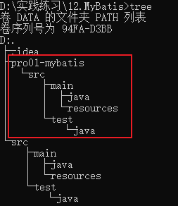
   - 修改`pro01-mybatis`打包方式：需要为 jar 包形式
     - `<packaging>jar</packaging>`
   - 在父工程`12.MyBits`中添加项目依赖：

```xml
<dependencies>
  <!-- Mybatis核心 -->
  <dependency>
    <groupId>org.mybatis</groupId>
    <artifactId>mybatis</artifactId>
    <version>3.5.7</version>
  </dependency>
  <!-- junit测试 -->
  <dependency>
    <groupId>junit</groupId>
    <artifactId>junit</artifactId>
    <version>4.12</version>
    <scope>test</scope>
  </dependency>
  <!-- MySQL驱动 -->
  <dependency>
    <groupId>mysql</groupId>
    <artifactId>mysql-connector-java</artifactId>
    <version>5.1.3</version>
  </dependency>
</dependencies>
```

#### 1.2.2 配置 mybatis

1. 创建 MyBatis 的核心配置文件：
   - 在`main/resources`目录下创建配置文件，习惯命名为`mybatis-config.xml`（名称无要求），整合 Spring 后，该文件可省略。
   - 官方文档`Getting Started`提供了配置文件的模板【正文3 页】
   - 根据本地 MySQL 的配置，修改配置文件的内容。
     - 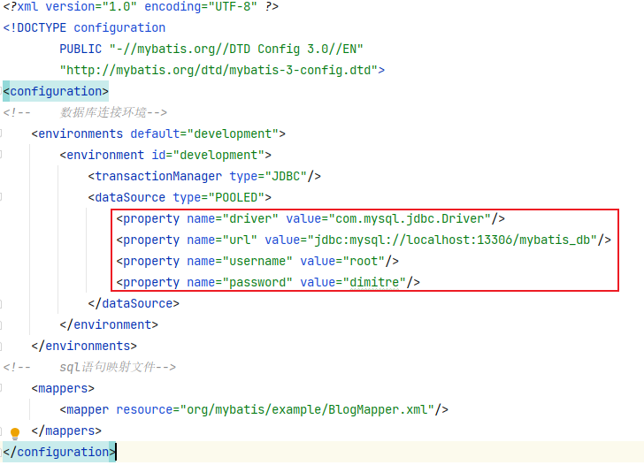
2. 创建 mapper 接口：
   - 创建数据表：
    ```sql
    CREATE TABLE `t_user` (
      `id` int(11) NOT NULL AUTO_INCREMENT,
      `username` varchar(20) DEFAULT NULL,
      `password` varchar(20) DEFAULT NULL,
      `age` int(11) DEFAULT NULL,
      `sex` char(1) DEFAULT NULL,
      `email` varchar(100) DEFAULT NULL,
      PRIMARY KEY (`id`)
    ) ENGINE=InnoDB DEFAULT CHARSET=utf8
    ```
   - 创建 pojo 实体：
    ```java
    public class User {
        private Integer id;
        private String username;
        private String password;
        private Integer age;
        private String sex;//数据库中文为char类型
        private String email;

        public User() {
        }

        public User(Integer id, String username, String password, Integer age, String sex, String email) {
            this.id = id;
            this.username = username;
            this.password = password;
            this.age = age;
            this.sex = sex;
            this.email = email;
        }

        public Integer getId() {
            return id;
        }

        public void setId(Integer id) {
            this.id = id;
        }

        public String getUsername() {
            return username;
        }

        public void setUsername(String username) {
            this.username = username;
        }

        public String getPassword() {
            return password;
        }

        public void setPassword(String password) {
            this.password = password;
        }

        public Integer getAge() {
            return age;
        }

        public void setAge(Integer age) {
            this.age = age;
        }

        public String getSex() {
            return sex;
        }

        public void setSex(String sex) {
            this.sex = sex;
        }

        public String getEmail() {
            return email;
        }

        public void setEmail(String email) {
            this.email = email;
        }
    }
    ```
   - 创建 mapper 接口：
     - mapper 接口相当于 service 接口，但不需要提供实现类 ，实现类由 MyBatis 生成。
    ```java
    public interface UserMapper {
        /**
        * 添加用户
        * @return 受影响的行数
        */
        int insertUser();
    }
    ```
3. 创建 MyBatis 映射文件：
   - `ORM`：`Object Relationship Mapping`对象关系映射。
     - 对象：Java 的实体类对象。
     - 关系：关系型数据库。
     - 映射：二者之间的对应关系 。
   - Java 与数据库的对应关系：
     - 类<--->表
     - 属性<--->字段/列
     - 对象<--->记录/行
   - 映射文件命名规则：
     - 表所对应的实体类的`类名+Mapper.xml`
       - 例如：表 t_user，映射的实体类为 User，所对应的映射文件为`UserMapper.xml`
     - 一个映射文件对应一个实体类，对应一张表的操作
     - MyBatis 映射文件用于编写 SQL，访问以及操作表中的数据
     - MyBatis 映射文件存放的位置是`src/main/resources/mappers`目录下
   - 官方文档`Getting Started`提供了映射文件的模板【正文4 页】
   - 映射文件须与 mapper 接口文件保持两个一致：
     - 映射文件的命名空间（namespace）和 mapper 接口的全类名和保持一致
     - 映射文件中编写 SQL 的标签的 id 属性和 mapper 接口中方法的方法名保持一致
     - 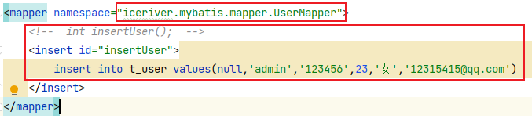
4. 核心配置文件中引入映射文件：
   - 以路径的形式引入：
     - 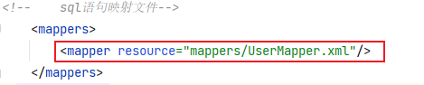
5. 执行测试：
   - 在`src/test/java`下创建测试目录及测试文件
     - 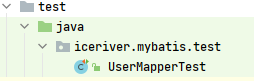
   - 编写测试方法：
    ```java
    public class UserMapperTest {
        @Test
        public void testInsertUser() throws IOException {
            // 1. 加载核心配置文件
            InputStream istream = Resources.getResourceAsStream("mybatis-config.xml");
            // 2. 获取SqlSessionFactoryBuilder对象
            SqlSessionFactoryBuilder sqlSessionFactoryBuilder = new SqlSessionFactoryBuilder();
            // 3. 获取SqlSessionFactory对象
            SqlSessionFactory sqlSessionFactory = sqlSessionFactoryBuilder.build(istream);
            // 4. 获取SqlSession对象
            SqlSession sqlSession = sqlSessionFactory.openSession();
            // 5. 获取mapper接口（实现类的）对象
            UserMapper userMapper = sqlSession.getMapper(UserMapper.class);//底层使用了代理模式创建实现类
            // 6. 调用mapper接口方法，执行测试
            int result = userMapper.insertUser();
            // 7. 提交事务
            sqlSession.commit();//由于核心配置文件开启了事务：<transactionManager type="JDBC"/>，所以这里需要提交
            System.out.println(result);
        }
    }
    ```
6. 获取sqlsession时传入参数`true`，即可设置为自动提交事务
    - `SqlSession`：代表Java程序和数据库之间的会话。（HttpSession是Java程序和浏览器之间的会话）
    - `SqlSessionFactory`：是“生产”`SqlSession`的“工厂”。
    - 工厂模式：如果创建某一个对象，使用的过程基本固定，那么我们就可以把创建这个对象的相关代码封装到一个“工厂类”中，以后都使用这个工厂类来“生产”我们需要的对象。

#### 1.2.3 引入 log4j 日志功能

1. 在父工程`pom.xml`中加入依赖：
   - 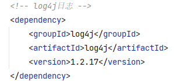
2. 在子工程`src/main/resources`目录下创建`log4j.xml`
    ```xml
    <?xml version="1.0" encoding="UTF-8" ?>
    <!DOCTYPE log4j:configuration SYSTEM "log4j.dtd">
    <log4j:configuration xmlns:log4j="http://jakarta.apache.org/log4j/">
      <appender name="STDOUT" class="org.apache.log4j.ConsoleAppender">
        <param name="Encoding" value="UTF-8" />
        <layout class="org.apache.log4j.PatternLayout">
          <param name="ConversionPattern" value="%-5p %d{MM-dd HH:mm:ss,SSS}%m (%F:%L) \n" />
        </layout>
      </appender>
      <logger name="java.sql">
        <level value="debug" />
      </logger>
      <logger name="org.apache.ibatis">
        <level value="info" />
      </logger>
      <root>
        <level value="debug" />
        <appender-ref ref="STDOUT" />
      </root>
    </log4j:configuration>
    ```
    - 放到父工程`src/main/resources`目录下报错，不知道为什么。
    - `<level value="debug" />`中`debug`代表输出信息级别的高低
      - `FATAL(致命)>ERROR(错误)>WARN(警告)>INFO(信息)>DEBUG(调试)`
      - 输出的信息内容详细程度从右至左提高

### 1.3 MyBatis 的增删改查

#### 1.3.1 添加

```xml
<!--  int insertUser();  -->
<insert id="insertUser">
  insert into t_user values(null,'admin','123456',23,'女','12315415@qq.com')
</insert>
```

#### 1.3.2 修改

```xml
<!--  void updateUser();  -->
<update id="updateUser">
  update t_user set username = 'guest' where id = 6
</update>
```

#### 1.3.3 删除

```xml
<!-- void deleteUser(); -->
<delete id="deleteUser">
  delete from t_user where id = 8
</delete>
```

#### 1.3.4 查询

```xml
<!-- User getUserById(); -->
<select id="getUserById" resultType="iceriver.mybatis.pojo.User">
  select * form t_user where id = 7
</select>

<!-- List<User> getAllUser(); -->
<select id="getAllUser" resultType="iceriver.mybatis.pojo.User">
  select * from t_user
</select>
```

- 查询的标签 select 必须设置属性`resultType`或`resultMap`，用于设置实体类和数据库表的映射关系
  - `resultType`：自动映射，用于属性名和表中字段名一致的情况
  - `resultMap`：自定义映射，用于一对多或多对一或字段名和属性名不一致的情况
- 当查询的数据为多条时，不能使用实体类作为返回值，只能使用集合，否则会抛出异常`TooManyResultsException`；但是若查询的数据只有一条，可以使用实体类或集合作为返回值

### 1.4 核心配置文件详解

#### 1.4.1 文件标签

```xml
<?xml version="1.0" encoding="UTF-8" ?>
<!DOCTYPE configuration
        PUBLIC "-//MyBatis.org//DTD Config 3.0//EN"
        "http://MyBatis.org/dtd/MyBatis-3-config.dtd">
<configuration>
    <!--引入properties文件，此时就可以${属性名}的方式访问属性值-->
    <properties resource="jdbc.properties"/>
    <typeAliases>
        <!--
            typeAlias：设置某个具体的类型的别名
            属性： type：需要设置别名的类型的全类名
                  alias：设置此类型的别名，
                        （1）若设置了type，但没设置alias，则UserMapper.xml中，该类型拥有默认的别名，即类名且不区分大小写。
                        （2）若设置此属性，则UserMapper.xml中，此时该类型的别名只能使用alias所设置的值。
                        （3）若没有设置type，也没设置alias，则UserMapper.xml中只能使用对应类型的全类名
        -->
        <!--<typeAlias type="iceriver.mybatis.pojo.User"/>-->
        <!--<typeAlias type="iceriver.mybatis.pojo.User" alias="abc"></typeAlias>-->
        <!--以包为单位，设置改包下所有的类型都拥有默认的别名，即类名且不区分大小写-->
        <package name="iceriver.mybatis.pojo"/>
    </typeAliases>
    <!--
        environments：设置多个连接数据库的环境
        属性：default：设置默认使用的环境的id
    -->
    <environments default="mysql_test">
        <!--
            environment：设置具体的连接数据库的环境信息
            属性：id：设置环境的唯一标识，可通过environments标签中的default设置某一个环境的id，表示默认使用的环境
        -->
        <environment id="mysql_test">
            <!--
                transactionManager：设置事务管理方式
                属性：type：设置事务管理方式，type="JDBC|MANAGED"
                     type="JDBC"：设置当前环境的事务管理都必须手动处理
                     type="MANAGED"：设置事务被管理，例如spring中的AOP
            -->
            <transactionManager type="JDBC"/>
            <!--
                dataSource：设置数据源
                属性：type：设置数据源的类型，type="POOLED|UNPOOLED|JNDI"
                    （1）type="POOLED"：使用数据库连接池，即会将创建的连接进行缓存，下次使用可以从缓存中直接获取，不需要重新创建
                    （2）type="UNPOOLED"：不使用数据库连接池，即每次使用连接都需要重新创建
                    （3）type="JNDI"：调用上下文中的数据源
            -->
            <dataSource type="POOLED">
                <!--设置驱动类的全类名-->
                <property name="driver" value="${jdbc.driver}"/>
                <!--设置连接数据库的连接地址-->
                <property name="url" value="${jdbc.url}"/>
                <!--设置连接数据库的用户名-->
                <property name="username" value="${jdbc.username}"/>
                <!--设置连接数据库的密码-->
                <property name="password" value="${jdbc.password}"/>
            </dataSource>
        </environment>
    </environments>
    <!--引入映射文件-->
    <mappers>
        <!--<mapper resource="mappers/UserMapper.xml"/>-->
        <!--
            以包为单位，将包下所有的映射文件引入核心配置文件
            要求：1. mapper接口所在的包和映射文件所在的包一致
                 2. mapper接口的名字和映射文件的名字一致
        -->
        <package name="iceriver.mybatis.mapper"/>
    </mappers>
</configuration>
```

- 核心配置文件中`<configuration>`的子标签必须按照固定的顺序书写：
  - `properties?,settings?,typeAliases?,typeHandlers?,objectFactory?,objectWrapperFactory?,reflectorFactory?,plugins?,environments?,databaseIdProvider?,mappers? `

#### 1.4.2 IDEA 中设置配置文件模板

1. 核心配置文件模板：
   - 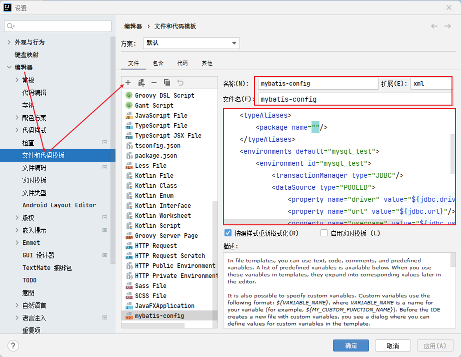
2. 映射文件模板：
   - 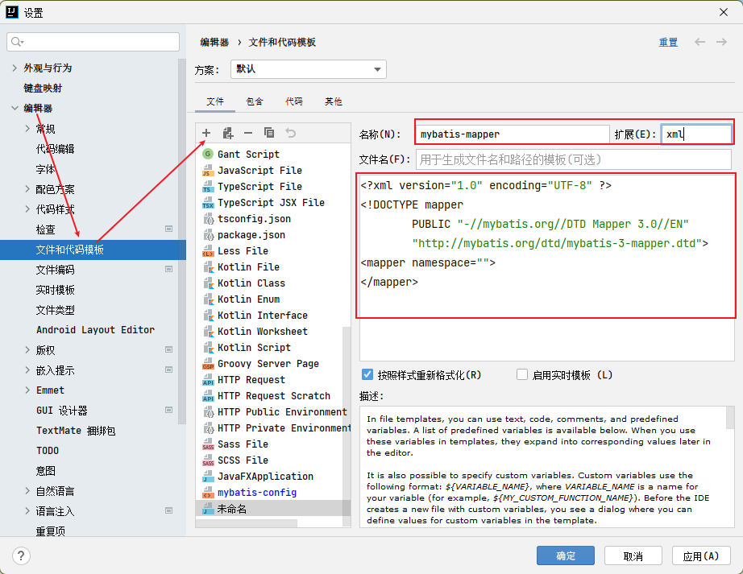

## 2. MyBatis 获取参数值

### 2.1 获取参数值的两种方式

#### 2.1.1 `${}`字符串拼接

1. 本质是字符串拼接
2. 参数为字符串类型或日期类型的字段进行赋值时，需要手动加单引号

#### 2.1.2 `#{}`占位符【优先使用】

1. 本质是占位符赋值
2. 参数为字符串类型或日期类型的字段进行赋值时，可以自动添加单引号

### 2.2 获取参数值的多种情况

#### 2.2.1 单个字面量类型的参数

1. `#{param}`：param 名称任意，建议见明知意
2. `'${param}'`：param 名称任意，建议见明知意；注意单引号`''`。

#### 2.2.2 多个字面量类型的参数

1. 若 mapper 接口中的方法参数为多个时，此时 MyBatis 会自动将这些参数放在一个 map 集合中，以`arg0`,`arg1.`..为键，以参数为值；以`param1`,`param2`...为键，以参数为值；
   - 注意`arg`从 0 开始，`param`从 1 开始
2. 因此只需要通过`${}`和`#{}`访问 map 集合的键就可以获取相对应的值。
   - 注意`${}`需要手动加单引号。
3. `arg0`和`param1`可以混用，但要注意先后顺序。

#### 2.2.3 map 集合类型的参数

- 若 mapper 接口中的方法需要的参数为多个时，此时可以手动创建 map 集合，将这些数据放在 map 中，只需要通过`${}`和`#{}`访问 map 集合的键就可以获取相对应的值，注意`${}`需要手动加单引号。
  - 这里的参数名称是自定义 map 集合时放入的名称。

#### 2.2.4 实体类类型的参数【建议使用】

- 同 2.2.3 的访问方式，传入的参数名是实体类的属性名。——不需要使用`对象名.属性名`的方式调用，直接使用属性名。

#### 2.2.5 使用`@param`注解标识参数【建议使用】——daoceng 使用`@param`

1. 语句格式：`User checkLoginByParams(@Param("username") String username, @Param("password") String password);`
   - 相当于给参数起别名。传参时别名起的啥，mapper 映射文件就传啥。
   - 或者以`param1`,`param2`...为参数
2. 源码：集合中会放 2 组参数：
   - 以`@Param`注解的`value`属性值为键，以参数为值；
   - 以`param1`,`param2`...为键，以参数为值。

## 3. MyBatis 的各种查询功能

> - 建议查询语句不要写`;`以免将其作为通用查询，与其他查询组合时出现错误。

### 3.1 查询返回不同类型、数量结果

#### 3.1.1 查询返回一个实体类对象

- 返回一个数据可以以实体类对象或集合接收。

```java
/**
* 根据用户id查询用户信息
* @param id
* @return
*/
User getUserById(@Param("id") int id);
```

```xml
<!--User getUserById(@Param("id") int id);-->
<select id="getUserById" resultType="User">
  select * from t_user where id = #{id}
</select>
```

#### 3.1.2 查询返回一个 List 集合

- 返回多个数据只能通过集合接收。

```java
/**
* 查询所有用户信息
* @return
*/
List<User> getUserList();
```

```xml
<!--List<User> getUserList();-->
<select id="getUserList" resultType="User">
  select * from t_user
</select>
```

#### 3.1.3 查询返回单个数据

```java
/**
* 查询用户的总记录数
* @return
*/
int getCount();
```

```xml
<!--
  在MyBatis映射文件的resultType中，对于Java中常用的类型都设置了类型别名
  例如：java.lang.Integer-->int|integer
  例如：int-->_int|_integer
  例如：Map-->map,List-->list
-->
<!--int getCount();-->
<select id="getCount" resultType="_integer">
  select count(id) from t_user
</select>
```

- 别名参见官方文档15-16 页
  - 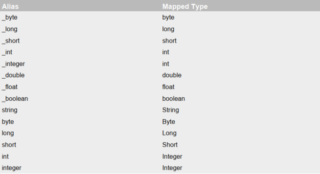
  - 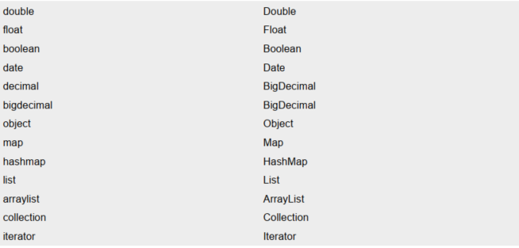

#### 3.1.4 查询一条数据为 map 集合

- 将实体类对象转换为 map 集合，或实体类对象的部分数据转换为集合。

```java
/**
* 根据用户id查询用户信息为map集合
* @param id
* @return
*/
Map<String, Object> getUserToMap(@Param("id") int id);
```

```xml
<!--Map<String, Object> getUserToMap(@Param("id") int id);-->
<select id="getUserToMap" resultType="map">
  select * from t_user where id = #{id}
</select>
<!--结果：{password=123456, sex=男, id=1, age=23, username=admin}-->
```

#### 3.1.5 查询多条数据为 map 集合

1. 方式一：

```java
/**
* 查询所有用户信息为map集合
* 将表中的数据以map集合的方式查询，一条数据对应一个map；若有多条数据，就会产生多个map集合，此时可以将这些map放在一个list集合中获取
*/
List<Map<String, Object>> getAllUserToMap();
```

```xml
<!--List<Map<String, Object>> getAllUserToMap();-->
<select id="getAllUserToMap" resultType="map">
  select * from t_user
</select>
```

2. 方式二：
   - 使用 map 集合接收，可以用`@MapKey("str")`指定某个字段为 map 集合的键，注意指定为键的属性必须不能重复。

```java
/**
* 查询所有用户信息为map集合
* @return
* 将表中的数据以map集合的方式查询，一条数据对应一个map；若有多条数据，就会产生多个map集合，并且最终要以一个map的方式返回数据，此时需要通过@MapKey注解设置map集合的键，值是每条数据所对应的map集合
*/
@MapKey("id")
Map<String, Object> getAllUserToMap();
```

```xml
<!--Map<String, Object> getAllUserToMap();-->
<select id="getAllUserToMap" resultType="map">
  select * from t_user
</select>
结果：
<!--
  {
    1={password=123456, sex=男, id=1, age=23, username=admin},
    2={password=123456, sex=男, id=2, age=23, username=张三},
    3={password=123456, sex=男, id=3, age=23, username=张三}
  }
-->
```

### 3.2 特殊 SQL 查询

#### 3.2.1 模糊查询

```java
/**
* 测试模糊查询
* @param mohu
* @return
*/
List<User> testMohu(@Param("mohu") String mohu);
```

```xml
<!--List<User> testMohu(@Param("mohu") String mohu);-->
<select id="testMohu" resultType="User">
  <!--select * from t_user where username like '%${mohu}%'-->
  <!--select * from t_user where username like concat('%',#{mohu},'%')-->
  select * from t_user where username like "%"#{mohu}"%"
</select>
```

- 注意`${}`单引号与`#{}`双引号的区别。

#### 3.2.2 批量删除

```java
/**
* 批量删除
* @param ids
* @return
*/
int deleteMore(@Param("ids") String ids);
```

```xml
<!--int deleteMore(@Param("ids") String ids);-->
<delete id="deleteMore">
  delete from t_user where id in (${ids})
</delete>
```

- 不能使用`#{}`，因为 SQL 语句中，`in`的括号中不能写引号，而`#{}`会自动添加单引号
  - `in (1,2,3)`

#### 3.2.3 动态设置表名

```java
/**
* 动态设置表名，查询所有的用户信息
* @param tableName
* @return
*/
List<User> getAllUser(@Param("tableName") String tableName);
```

```xml
<!--List<User> getAllUser(@Param("tableName") String tableName);-->
<select id="getAllUser" resultType="User">
  select * from ${tableName}
</select>
```

- 不能使用`#{}`，因为 SQL 语句中，表名不能写引号，而`#{}`会自动添加单引号

#### 3.2.4 添加功能获取自增的主键

```java
/**
* 添加用户信息
* @param user
* @return
* useGeneratedKeys：设置使用自增的主键
* keyProperty：因为增删改有统一的返回值是受影响的行数，因此只能将获取的自增的主键放在传输的参
数user对象的某个属性中
*/
int insertUser(User user);
```

```xml
<!--int insertUser(User user);-->
<insert id="insertUser" useGeneratedKeys="true" keyProperty="id">
  insert into t_user values(null,#{username},#{password},#{age},#{sex})
</insert>
```

- MySQL 添加数据后，返回的是受影响的行数，所以无法直接返回新增的主键值，但可以通过返回添加的对象，通过对象去调用主键值。
- 原生 JDBC 获取主键的方式：
  - 遍历结果集可以获得主键

```java
@Test
public void testJDBC() throws Exception {
    Class.forName("");
    Connection connection = DriverManager.getConnection("", "", "");
    PreparedStatement ps = connection.prepareStatement("insert", Statement.RETURN_GENERATED_KEYS);
    ps.executeUpdate();
    ResultSet resultSet = ps.getGeneratedKeys();
}
```

## 4. 自定义映射 resultMap

### 4.1 resultMap 处理 sql 字段与 pojo 属性不一致问题

#### 4.1.1 sql 语句使用别名方式与 pojo 属性对应

```xml
<!--List<Emp> getAllEmp();-->
<select id="getAllEmp" resultType="emp">
  select eid,emp_name empName,age,sex gender,email from t_emp
</select>
```

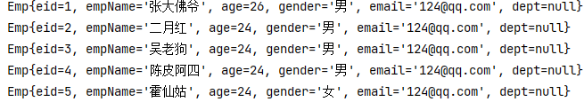

#### 4.1.2 设置全局配置将`_`自动映射为驼峰

1. `mybatis-config.xml`文件中开启`resultMap`全局配置
   - 官方文档正文12 页

```xml
<!--设置MyBatis的全局配置-->
<settings>
  <!--将 _ 自动映射为驼峰，emp_name:empName-->
  <setting name="mapUnderscoreToCamelCase" value="true"/>
</settings>
```

```xml
<!--List<Emp> getAllEmp();-->
<select id="getAllEmp" resultType="emp">
  select * from t_emp
</select>
```

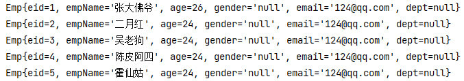

#### 4.1.3 当前 mapper 映射文件中进行自定义设置

- 可以不将表的所有字段都设置，如字段本身与属性名一致时可不设置，但建议全部进行设置。
  - 不需要开启全局映射。
  - 可以设置别名映射，比如将字段 sex 映射为属性 gender。
  - 注意：`<select>`的`resultMap`属性值，必须与`<resultMap>`的`id`属性值对应

```xml
<!--
  resultMap：设置自定义映射关系
    id：唯一标识，不能重复
    type：设置映射关系中的实体类类型
  子标签：
  id：设置主键的映射关系(主键的映射无论是否一致，都必须写)
  result：设置普通字段的映射关系
    property：设置映射关系中的属性名，必须是type属性所设置的实体类类型中的属性名
    column：设置映射关系中的字段名，必须是sql语句查询出的字段名
-->
<resultMap id="empResultMap" type="Emp">
  <id property="eid" column="eid"></id>
  <result property="empName" column="emp_name"></result>
  <result property="age" column="age"></result>
  <result property="gender" column="sex"></result>
  <result property="email" column="email"></result>
</resultMap>

<!--List<Emp> getAllEmp();-->
<select id="getAllEmp" resultMap="empResultMap">
  select * from t_emp
</select>
```
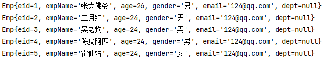

### 4.2 处理表中多对一的映射关系

> - 多对一：实体类中有个属性是实体类对象。

#### 4.2.1 级联赋值

```xml
 <!--处理多对一映射关系方式一：级联属性赋值-->
<resultMap id="empAndDeptResultMapOne" type="Emp">
  <id property="eid" column="eid"></id>
  <result property="empName" column="emp_name"></result>
  <result property="age" column="age"></result>
  <result property="gender" column="sex"></result>
  <result property="email" column="email"></result>
  <result property="dept.did" column="did"></result>
  <result property="dept.deptName" column="dept_name"></result>
</resultMap>
<!--Emp getEmpAndDept(@Param("eid") Integer eid);-->
<select id="getEmpAndDept" resultMap="empAndDeptResultMapOne">
  select * from t_emp left join t_dept on t_emp.did = t_dept .did where t_emp.eid = #{eid}
</select>
```

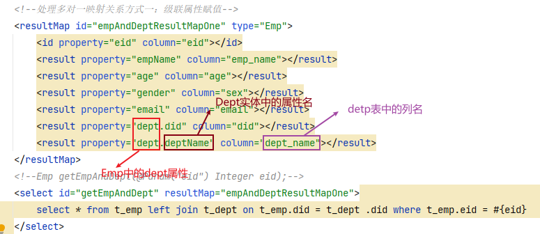!
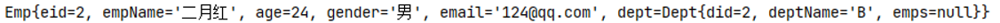

#### 4.2.2 使用`<association>`标签及其子标签

```xml
<!--处理多对一映射关系方式二：association-->
<resultMap id="empAndDeptResultMapTwo" type="Emp">
  <id property="eid" column="eid"></id>
  <result property="empName" column="emp_name"></result>
  <result property="age" column="age"></result>
  <result property="gender" column="sex"></result>
  <result property="email" column="email"></result>
  <!--
    association:处理多对一的映射关系
    property:需要处理多对的映射关系的属性名
    javaType:该属性的类型
  -->
  <association property="dept" javaType="Dept">
    <id property="did" column="did"></id>
    <result property="deptName" column="dept_name"></result>
  </association>
</resultMap>
<!--Emp getEmpAndDept(@Param("eid") Integer eid);-->
<select id="getEmpAndDept" resultMap="empAndDeptResultMapTwo">
  select * from t_emp left join t_dept on t_emp.did = t_dept .did where t_emp.eid = #{eid}
</select>
```

#### 4.2.3 分步查询

1. 分步一：

```java
/**
* 查询指定员工的信息及所在部门，分步一：查询所在部门did
* @param eid
* @return
*/
Emp getEmpAndDeptByStepOne(@Param("eid") Integer eid);
```

```xml
<!--处理多对一映射关系方式三：分步查询、分步一-->
<resultMap id="empAndDeptByStepResultMap" type="Emp">
  <id property="eid" column="eid"></id>
  <result property="empName" column="emp_name"></result>
  <result property="age" column="age"></result>
  <result property="gender" column="sex"></result>
  <result property="email" column="email"></result>
  <!--
    select:设置分步查询的sql的唯一标识（namespace.SQLId或mapper接口的全类名.方法名）
    column:设置分步查询的条件
-->
  <association property="dept"
               select="iceriver.mybatis.mapper.DeptMapper.getEmpAndDeptByStepTwo"
               column="did">
  </association>
</resultMap>
<!--Emp getEmpAndDeptByStepOne(@Param("eid") Integer eid);-->
<select id="getEmpAndDeptByStepOne" resultMap="empAndDeptByStepResultMap">
  select * from t_emp where eid = #{eid}
</select>
```

2. 分步二：

```java
/**
* 查询指定员工的信息及所在部门，分步二：根据did查询部门
* @param did
* @return
*/
Dept getEmpAndDeptByStepTwo(@Param("did") Integer did);
```

```xml
<!--处理多对一映射关系方式三：分步查询、分步二-->
<resultMap id="empAndDeptByStepResultMap" type="Dept">
  <id property="did" column="did"></id>
  <result property="deptName" column="dept_name"></result>
</resultMap>

<!--Dept getEmpAndDeptByStepTwo(@Param("did") Integer did);-->
<select id="getEmpAndDeptByStepTwo" resultMap="empAndDeptByStepResultMap">
  select * from t_dept where did = #{did}
</select>
```

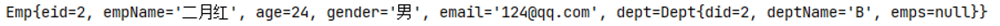

### 4.3 处理表中一对多的映射关系

> - 一对多：实体类中有个属性是集合

#### 4.3.1 使用`<connection>`标签及其子标签

```xml
<!--处理一对多映射关系方式一：-->
<resultMap id="deptAndEmpResultMap" type="Dept">
  <id property="did" column="did"></id>
  <result property="deptName" column="dept_name"></result>
  <!--
            collection：处理一对多的映射关系
            ofType：表示该属性所对应的集合中存储数据的类型
        -->
  <collection property="emps" ofType="Emp">
    <id property="eid" column="eid"></id>
    <result property="empName" column="emp_name"></result>
    <result property="age" column="age"></result>
    <result property="gender" column="sex"></result>
    <result property="email" column="email"></result>
  </collection>
</resultMap>
<!--Dept getDeptAndEmp(@Param("did") Integer did);-->
<select id="getDeptAndEmp" resultMap="deptAndEmpResultMap">
  select * from t_dept left join t_emp on t_dept.did = t_emp.did where t_dept.did = #{did}
</select>
```

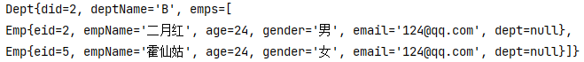

#### 4.3.2 分步查询

```xml
<!--处理一对多映射关系方式二：分步查询、分步一-->
<resultMap id="deptAndEmpByStepResultMap" type="Dept">
  <id property="did" column="did"></id>
  <result property="deptName" column="dept_name"></result>
  <collection property="emps"
              select="iceriver.mybatis.mapper.EmpMapper.getDeptAndEmpByStepTwo"
              column="did"
              fetchType="eager">
  </collection>
</resultMap>
<!--Dept getDeptAndEmpByStepOne(@Param("did") Integer did);-->
<select id="getDeptAndEmpByStepOne" resultMap="deptAndEmpByStepResultMap">
  select * from t_dept where did = #{did}
</select>
```

```xml
<!--List<Emp> getDeptAndEmpByStepTwo(@Param("did") Integer did);-->
<resultMap id="empAndDeptResultMapOne" type="Emp">
  <id property="eid" column="eid"></id>
  <result property="empName" column="emp_name"></result>
  <result property="age" column="age"></result>
  <result property="gender" column="sex"></result>
  <result property="email" column="email"></result>
</resultMap>
<select id="getDeptAndEmpByStepTwo" resultMap="empAndDeptResultMapOne">
  select * from t_emp where did = #{did}
</select>
```

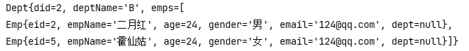

### 4.4 分步查询的优点

1. 分步查询的优点：可以实现延迟加载，但是必须在核心配置文件中设置全局配置信息：
    ```xml
    <!--开启延迟加载-->
    <settings>
      <setting name="lazyLoadingEnabled" value="true"/>
    </settings>
    ```
    - `lazyLoadingEnabled`：延迟加载的全局开关。当开启时，所有关联对象都会延迟加载
    - `aggressiveLazyLoading`：当开启时，任何方法的调用都会加载该对象的所有属性【3.7.5 版本默认开启】。 否则，每个属性会按需加载

2. 核心配置文件开启延迟加载后，所有的分步查询都会延迟加载，如果需要控制当前映射文件中的分步查询，可以通过`association`和`collection`中的`fetchType`属性设置当前的分步查询是否使用延迟加载。
   - `fetchType="lazy"`(延迟加载)，开启全局延迟加载时的默认值。
   - `fetchType="eager"`(立即加载) ，未全局延迟加载时的默认值。

## 5. 动态 SQL

> - 解决拼接 SQL 语句字符串时的痛点问题。

### 5.1 `<if>`

- `<if>`标签可通过`test`属性的表达式进行判断，若表达式的结果为`true`，则标签中的内容会执行；反之标签中的内容不会执行

```xml
<resultMap id="empResultMap" type="Emp">
  <id property="eid" column="eid"></id>
  <result property="empName" column="emp_name"></result>
  <result property="age" column="age"></result>
  <result property="gender" column="sex"></result>
  <result property="email" column="email"></result>
</resultMap>

<!--List<Emp> getEmpByCondition(Emp emp);-->
<select id="getEmpByCondition" resultMap="empResultMap">
  select * from t_emp where 1=1
  <if test="empName != null and empName != ''">
    and emp_name = #{empName}
  </if>
  <if test="age != null and age != ''">
    and age = #{age}
  </if>
  <if test="gender != null and gender != ''">
    or sex = #{gender}
  </if>
  <if test="email != null and email != ''">
    and email = #{email}
  </if>
</select>
```

- `if`标签中`test`属性的值是实体类的属性名，或者别名。
- `if`语句中的查询条件`=`左侧字段名是数据表中的字段名，右侧是实体类属性名。
  - 这里的实体类中的属性名也相当于前端表单提交的属性名【表单提交的属性名与实体类的属性名一致】
- 这里`1=1`是为了解决各项条件都不符合，或`emp_name`不符合条件，导致`where`后面没有语句或`where`后面直接出现`and`或`or`的情况。
  - `1=1`这种用法可以在正常的 SQL 语句中使用，且不会影响执行效果。

### 5.2 `<where>`

```xml
<resultMap id="empResultMap" type="Emp">
  <id property="eid" column="eid"></id>
  <result property="empName" column="emp_name"></result>
  <result property="age" column="age"></result>
  <result property="gender" column="sex"></result>
  <result property="email" column="email"></result>
</resultMap>

<!--List<Emp> getEmpByCondition(Emp emp);-->
<select id="getEmpByCondition" resultMap="empResultMap">
  select * from t_emp
  <where>
    <if test="empName != null and empName != ''">
      and emp_name = #{empName}
    </if>
    <if test="age != null and age != ''">
      and age = #{age}
    </if>
    <if test="gender != null and gender != ''">
      or sex = #{gender}
    </if>
    <if test="email != null and email != ''">
      and email = #{email}
    </if>
  </where>
</select>
```

- `where`和`if`一般结合使用：
  - 若`where`标签中的 if 条件都不满足，则`where`标签没有任何功能，即不会添加`where`关键字
  - 若`where`标签中的`if`条件满足，则`where`标签会自动添加`where`关键字，并将条件最前方多余的`and`/`or`去掉
    - 注意：`where`标签不能去掉条件最后多余的`and`/`or`

### 5.3 `<trim>`

```xml
<resultMap id="empResultMap" type="Emp">
  <id property="eid" column="eid"></id>
  <result property="empName" column="emp_name"></result>
  <result property="age" column="age"></result>
  <result property="gender" column="sex"></result>
  <result property="email" column="email"></result>
</resultMap>

<!--List<Emp> getEmpByCondition(Emp emp);-->
<select id="getEmpByCondition" resultMap="empResultMap">
  select * from t_emp
  <trim prefix="where" prefixOverrides="and|or">
    <if test="empName != null and empName != ''">
      and emp_name = #{empName}
    </if>
    <if test="age != null and age != ''">
      and age = #{age}
    </if>
    <if test="gender != null and gender != ''">
      or sex = #{gender}
    </if>
    <if test="email != null and email != ''">
      and email = #{email}
    </if>
  </trim>
</select>
```

- `trim`用于去掉或添加标签中的内容：
  - `prefix`：在 trim 标签中的内容的前面添加指定内容
  - `prefixOverrides`：在`trim`标签中的内容的前面去掉指定内容
  - `suffix`：在`trim`标签中的内容的后面添加指定内容
  - `suffixOverrides`：在`trim`标签中的内容的后面去掉指定内容

### 5.4 `<choose>`、`<when>`、`<otherwise>`

- 相当于 if...else if....if
- `when`至少要有一个
- `otherwise`最多只能有一个

```xml
<resultMap id="empResultMap" type="Emp">
  <id property="eid" column="eid"></id>
  <result property="empName" column="emp_name"></result>
  <result property="age" column="age"></result>
  <result property="gender" column="sex"></result>
  <result property="email" column="email"></result>
</resultMap>

<!--List<Emp> getEmpByChoose(Emp emp);-->
<select id="getEmpByChoose" resultMap="empResultMap">
  select * from t_emp
  <where>
    <choose>
      <when test="empName != null and empName != ''">
        emp_name = #{empName}
      </when>
      <when test="age != null and age != ''">
        age = #{age}
      </when>
      <when test="gender != null and gender != ''">
        sex = #{gender}
      </when>
      <when test="email != null and email != ''">
        email = #{email}
      </when>
      <otherwise>
        did=1
      </otherwise>
    </choose>
  </where>
</select>
```

### 5.5 `<foreach>`

#### 5.5.1 批量删除

```xml
<!--int deleteMoreByArray(@Param("eids") Integer[] eids);-->
<!--
<delete id="deleteMoreByArray">
  delete from t_emp where eid in
    (
      <foreach collection="eids" item="eid" separator=",">
        #{eid}
      </foreach>
    )
</delete>
-->

<!--
<delete id="deleteMoreByArray">
  delete from t_emp where eid in
  <foreach collection="eids" item="eid" separator="," open="(" close=")">
    #{eid}
  </foreach>
</delete>
-->

<delete id="deleteMoreByArray">
  delete from t_emp where
  <foreach collection="eids" item="eid" separator="or">
    eid=#{eid}
  </foreach>
</delete>
```

- `collection`：设置要循环的数组或集合
- `item`：表示集合或数组中的每一个数据
- `separator`：设置循环体之间的分隔符
- `open`：设置`foreach`标签中的内容的开始符
- `close`：设置`foreach`标签中的内容的结束符

#### 5.5.2 批量添加

```xml
<!--int insertMoreByList(@Param("emps") List<Emp> emps);-->
<insert id="insertMoreByList">
  insert into t_emp values
  <foreach collection="emps" item="emp" separator=",">
    (null,#{emp.empName},#{emp.age},#{emp.gender},#{emp.email},null)
  </foreach>
</insert>
```

- 注意这里`gender`是实体类中的属性名，`sex`是表中字段名。由于前文设置了`gender`的映射关系，所以这里可以使用`gender`

### 5.6 `<sql>`片段

- 设置`sql`片段，记录一段数据，在使用的地方使用`<include>`标签引入，插入到`sql`语句中。

```xml
<sql id="empColumns">
  eid,ename,age,sex,did
</sql>
select <include refid="empColumns"></include> from t_emp
```

## 6. MyBatis 的缓存

> - 只针对查询功能有效

### 6.1 一级缓存（不同查询在同一个`sqlSession`下）

1. 一级缓存是`SqlSession`级别的，通过同一个 SqlSession 查询的数据会被缓存，下次查询相同的数据，就会从缓存中直接获取，不会从数据库重新访问【不会执行 sql 查询】
   - 不论`SqlSession`对象是否关闭或提交，都会保存一级缓存
     - `sqlSession.commit()`或`sqlSession.close()`
2. 使一级缓存失效的四种情况：
   - 不同的`SqlSession`对应不同的一级缓存
   - 同一个`SqlSession`但是查询条件不同
   - 同一个`SqlSession`两次查询期间执行了任何一次增删改操作
   - 同一个`SqlSession`两次查询期间手动清空了缓存
     - `sqlSession.clearCache()`

### 6.2 二级缓存（不同查询在同一个`sqlSessionFactory`下）

1. 二级缓存级别大于一级缓存。
2. 二级缓存是`SqlSessionFactory`级别，通过同一个`SqlSessionFactory`创建的`SqlSession`查询的结果会被缓存；此后若再次执行相同的查询语句，结果就会从缓存中获取。
3. 二级缓存开启的条件（同时满足）：
   - 在核心配置文件中，设置全局配置属性`cacheEnabled="true"`
     - 默认即为`true`，不需要设置。
   - 在映射文件中设置标签`<cache/>`
   - 二级缓存必须在`SqlSession`对象关闭或提交之后有效
     - `sqlSession.commit()`或`sqlSession.close()`
   - 查询的数据所转换的实体类类型必须实现序列化`Serializable`接口
4. 使二级缓存失效的情况：
   - 两次查询之间执行了任意的增删改，会使一级和二级缓存同时失效

### 6.3 二级缓存的相关配置

1. 通过在`mapper`映射文件中设置`<cache/>` 标签的属性配置：
2. `eviction`属性：缓存回收策略
   - `LRU`（`Least Recently Used`） – 最近最少使用的：移除最长时间不被使用的对象。默认值。
   - `FIFO`（`First in First out`） – 先进先出：按对象进入缓存的顺序来移除它们。
   - `SOFT `– 软引用：移除基于垃圾回收器状态和软引用规则的对象。
     `WEAK `– 弱引用：更积极地移除基于垃圾收集器状态和弱引用规则的对象。
3. `flushInterval`属性：刷新间隔，单位毫秒
   - 默认情况是不设置，也就是没有刷新间隔，缓存仅仅调用语句时刷新
4. `size`属性：引用数目，正整数。代表缓存最多可以存储多少个对象，太大容易导致内存溢出
5. `readOnly`属性：只读，`true`/`false`
   - `true`：只读缓存；会给所有调用者返回缓存对象的相同实例。因此这些对象不能被修改。这提供了很重要的性能优势。
   - `false`：读写缓存；会返回缓存对象的拷贝（通过序列化）。这会慢一些，但是安全，因此默认是`false`。

### 6.4 MyBatis 缓存查询的顺序

1. 先查询二级缓存，因为二级缓存中可能会有其他程序已经查出来的数据，可以拿来直接使用。【先搜索大范围，再搜索小范围】。
2. 如果二级缓存没有命中，再查询一级缓存。
3. 如果一级缓存也没有命中，则查询数据库。
4. `SqlSession`关闭之后，一级缓存中的数据会写入二级缓存。

### 6.5 整合第三方缓存 EHCache

> - 只能代替二级缓存，没法代替一级缓存。【为什么？】

#### 6.5.1 添加依赖

```xml
<!-- Mybatis EHCache整合包 -->
<dependency>
  <groupId>org.mybatis.caches</groupId>
  <artifactId>mybatis-ehcache</artifactId>
  <version>1.2.1</version>
</dependency>
<!-- slf4j日志门面的一个具体实现 -->
<dependency>
  <groupId>ch.qos.logback</groupId>
  <artifactId>logback-classic</artifactId>
  <version>1.2.3</version>
</dependency>
```

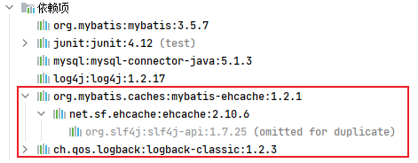

#### 6.5.2 各 jar 包功能

| jar 包名称      | 作用                              |
| --------------- | --------------------------------- |
| mybatis-ehcache | Mybatis 和 EHCache 的整合包       |
| ehcache         | EHCache 核心包                    |
| slf4j-api       | SLF4J 日志门面包                  |
| logback-classic | 支持 SLF4J 门面接口的一个具体实现 |

- 日志门面：提供了规范、接口

#### 6.5.3 创建配置文件

1. 在`resources`目录下创建`ehcache.xml`

```xml
<?xml version="1.0" encoding="utf-8" ?>
<ehcache xmlns:xsi="http://www.w3.org/2001/XMLSchema-instance"
         xsi:noNamespaceSchemaLocation="../config/ehcache.xsd">
    <!-- 磁盘保存路径 -->
    <diskStore path="D:\iceriver\ehcache"/>
    <defaultCache
            maxElementsInMemory="1000"
            maxElementsOnDisk="10000000"
            eternal="false"
            overflowToDisk="true"
            timeToIdleSeconds="120"
            timeToLiveSeconds="120"
            diskExpiryThreadIntervalSeconds="120"
            memoryStoreEvictionPolicy="LRU">
    </defaultCache>
</ehcache>
```

| 属性名                          | 是否必须 | 作用                                                                                                                                                  |
| ------------------------------- | -------- | ----------------------------------------------------------------------------------------------------------------------------------------------------- |
| maxElementsInMemory             | 是       | 在内存中缓存的 element 的最大数目                                                                                                                     |
| maxElementsOnDisk               | 是       | 在磁盘上缓存的 element 的最大数目，若是 0 表示无穷大                                                                                                  |
| eternal                         | 是       | 设定缓存的 elements 是否永远不过期。 如果为 true，则缓存的数据始终有效， 如果为 false 那么还要根据 timeToIdleSeconds、timeToLiveSeconds 判断          |
| overflowToDisk                  | 是       | 设定当内存缓存溢出的时候是否将过期的 element 缓存到磁盘上                                                                                             |
| timeToIdleSeconds               | 否       | 当缓存在 EhCache 中的数据前后两次访问的时间超过 timeToIdleSeconds 的属性取值时， 这些数据便会删除，默认值是 0,也就是可闲置时间无穷大                  |
| timeToLiveSeconds               | 否       | 缓存 element 的有效生命期，默认是 0.,也就是 element 存活时间无穷大                                                                                    |
| diskSpoolBufferSizeMB           | 否       | DiskStore(磁盘缓存)的缓存区大小。默认是 30MB。每个 Cache 都应该有自己的一个缓冲区                                                                     |
| diskPersistent                  | 否       | 在 VM 重启的时候是否启用磁盘保存 EhCache 中的数据，默认是 false。                                                                                     |
| diskExpiryThreadIntervalSeconds | 否       | 磁盘缓存的清理线程运行间隔，默认是 120 秒。每个 120s， 相应的线程会进行一次 EhCache 中数据的清理工作                                                  |
| memoryStoreEvictionPolicy       | 否       | 当内存缓存达到最大，有新的 element 加入的时候， 移除缓存中 element 的策略。 默认是 LRU（最近最少使用），可选的有 LFU（最不常使用）和 FIFO（先进先出） |

2. 在`resources`目录下创建`logback.xml`
   - 存在 SLF4J 时，作为简易日志的 log4j 将失效，此时我们需要借助 SLF4J 的具体实现 logback 来打印日志
     - 问题 1：那可以删了`log4j`吗？
     - 问题 2：可以不使用`logback`吗？

```xml
<?xml version="1.0" encoding="UTF-8"?>
<configuration debug="true">
    <!-- 指定日志输出的位置 -->
    <appender name="STDOUT" class="ch.qos.logback.core.ConsoleAppender">
        <encoder>
            <!-- 日志输出的格式 -->
            <!-- 按照顺序分别是：时间、日志级别、线程名称、打印日志的类、日志主体内容、换行 -->
            <pattern>[%d{HH:mm:ss.SSS}] [%-5level] [%thread] [%logger][%msg]%n</pattern>
        </encoder>
    </appender>
    <!-- 设置全局日志级别。日志级别按顺序分别是：DEBUG、INFO、WARN、ERROR -->
    <!-- 指定任何一个日志级别都只打印当前级别和后面级别的日志。 -->
    <root level="DEBUG">
        <!-- 指定打印日志的appender，这里通过“STDOUT”引用了前面配置的appender -->
        <appender-ref ref="STDOUT" />
    </root>
    <!-- 根据特殊需求指定局部日志级别 -->
    <logger name="com.atguigu.crowd.mapper" level="DEBUG"/>
</configuration>
```

#### 6.5.4 设置使用`EHCache`

1. 在 mapper 映射文件的`<cache/>`标签中指定`type`属性值为`EhcacheCache`：
   - `<cache type="org.mybatis.caches.ehcache.EhcacheCache"/>`

## 7. MyBatis 的逆向工程

### 7.1 正向工程与逆向工程

- 正向工程：先创建 Java 实体类，由框架负责根据实体类生成数据库表。`Hibernate`是支持正向工程的。
- 逆向工程：先创建数据库表，由框架负责根据数据库表，反向生成如下资源：
  - Java 实体类
  - Mapper 接口（持久层）
  - Mapper 映射文件

### 7.2 创建 MyBatis 的逆向工程

#### 7.2.1 添加依赖和插件

```xml
<?xml version="1.0" encoding="UTF-8"?>
<project xmlns="http://maven.apache.org/POM/4.0.0"
         xmlns:xsi="http://www.w3.org/2001/XMLSchema-instance"
         xsi:schemaLocation="http://maven.apache.org/POM/4.0.0 http://maven.apache.org/xsd/maven-4.0.0.xsd">
    <parent>
        <artifactId>12.MyBatis</artifactId>
        <groupId>iceriver.mybatis</groupId>
        <version>1.0-SNAPSHOT</version>
    </parent>
    <modelVersion>4.0.0</modelVersion>

    <artifactId>pr04-mybatis-MBG</artifactId>

    <properties>
        <maven.compiler.source>8</maven.compiler.source>
        <maven.compiler.target>8</maven.compiler.target>
    </properties>
    <!-- 依赖MyBatis核心包 -->
    <dependencies>
        <dependency>
            <groupId>org.mybatis</groupId>
            <artifactId>mybatis</artifactId>
            <version>3.5.7</version>
        </dependency>
    </dependencies>
    <!-- 控制Maven在构建过程中相关配置 -->

    <build>
        <!-- 构建过程中用到的插件 -->
        <plugins>
            <!-- 具体插件，逆向工程的操作是以构建过程中插件形式出现的 -->
            <plugin>
                <groupId>org.mybatis.generator</groupId>
                <artifactId>mybatis-generator-maven-plugin</artifactId>
                <version>1.3.0</version>
                <!-- 插件的依赖 -->
                <dependencies>
                    <!-- 逆向工程的核心依赖 -->
                    <dependency>
                        <groupId>org.mybatis.generator</groupId>
                        <artifactId>mybatis-generator-core</artifactId>
                        <version>1.3.2</version>
                    </dependency>
                    <!-- 数据库连接池 -->
                    <dependency>
                        <groupId>com.mchange</groupId>
                        <artifactId>c3p0</artifactId>
                        <version>0.9.2</version>
                    </dependency>
                    <!-- MySQL驱动 -->
                    <dependency>
                        <groupId>mysql</groupId>
                        <artifactId>mysql-connector-java</artifactId>
                        <version>5.1.8</version>
                    </dependency>
                </dependencies>
            </plugin>
        </plugins>
    </build>
</project>
```

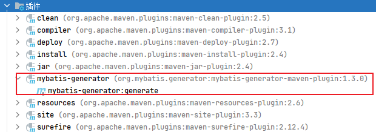

#### 7.2.2 创建逆向工程配置文件

> - 在`resources`目录下创建配置文件`generatorConfig.xml`

```xml
<?xml version="1.0" encoding="UTF-8"?>
<!DOCTYPE generatorConfiguration
        PUBLIC "-//mybatis.org//DTD MyBatis Generator Configuration 1.0//EN"
        "http://mybatis.org/dtd/mybatis-generator-config_1_0.dtd">
<generatorConfiguration>
    <!--
    targetRuntime: 执行生成的逆向工程的版本
    MyBatis3Simple: 生成基本的CRUD（清新简洁版）
    MyBatis3: 生成带条件的CRUD（奢华尊享版）
    -->
    <context id="DB2Tables" targetRuntime="MyBatis3Simple">
        <!-- 数据库的连接信息 -->
        <jdbcConnection driverClass="com.mysql.jdbc.Driver"
                        connectionURL="jdbc:mysql://localhost:13306/mybatis_db"
                        userId="root"
                        password="dimitre123">
        </jdbcConnection>
        <!-- javaBean的生成策略-->
        <javaModelGenerator targetPackage="iceriver.mybatis.bean"
                            targetProject=".\src\main\java">
            <property name="enableSubPackages" value="true" />
            <property name="trimStrings" value="true" />
        </javaModelGenerator>
        <!-- SQL映射文件的生成策略 -->
        <sqlMapGenerator targetPackage="iceriver.mybatis.mapper"
                         targetProject=".\src\main\resources">
            <property name="enableSubPackages" value="true" />
        </sqlMapGenerator>
        <!-- Mapper接口的生成策略 -->
        <javaClientGenerator type="XMLMAPPER"
                             targetPackage="iceriver.mybatis.mapper"
                             targetProject=".\src\main\java">
            <property name="enableSubPackages" value="true" />
        </javaClientGenerator>
        <!-- 逆向分析的表 -->
        <!-- tableName设置为*号，可以对应所有表，此时不写domainObjectName -->
        <!-- domainObjectName属性指定生成出来的实体类的类名 -->
        <table tableName="t_emp" domainObjectName="Emp"/>
        <table tableName="t_dept" domainObjectName="Dept"/>
    </context>
</generatorConfiguration>
```

- 文件名称是固定的吗？

#### 7.2.3 执行 MBG 插件

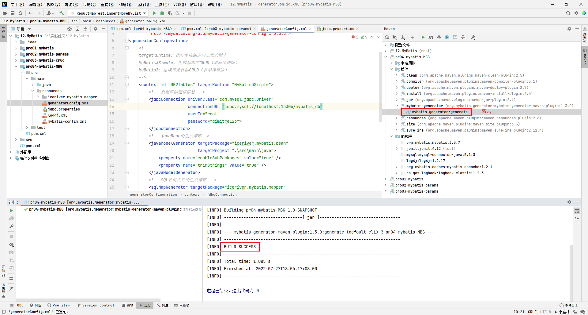

1. 简洁版生成的 mapper 文件：
   - 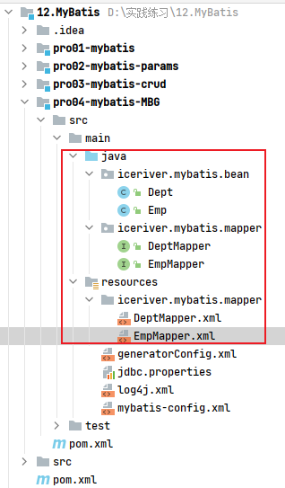
   - 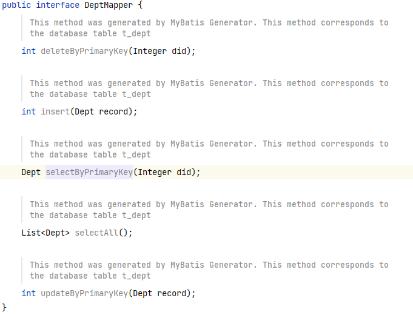
2. 奢华版生成的 mapper 文件：
   - 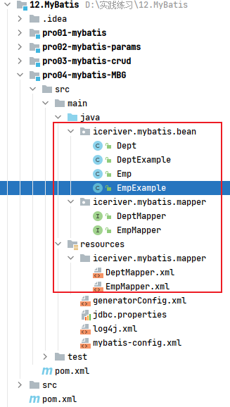
   - 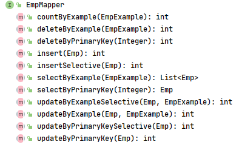
   - 带`Selective`的方法与不带的区别是：如果传入的参数有`null`，带`Selective`的方法不会修改原值，不带`Selective`的方法会将原值改为`null`
   - 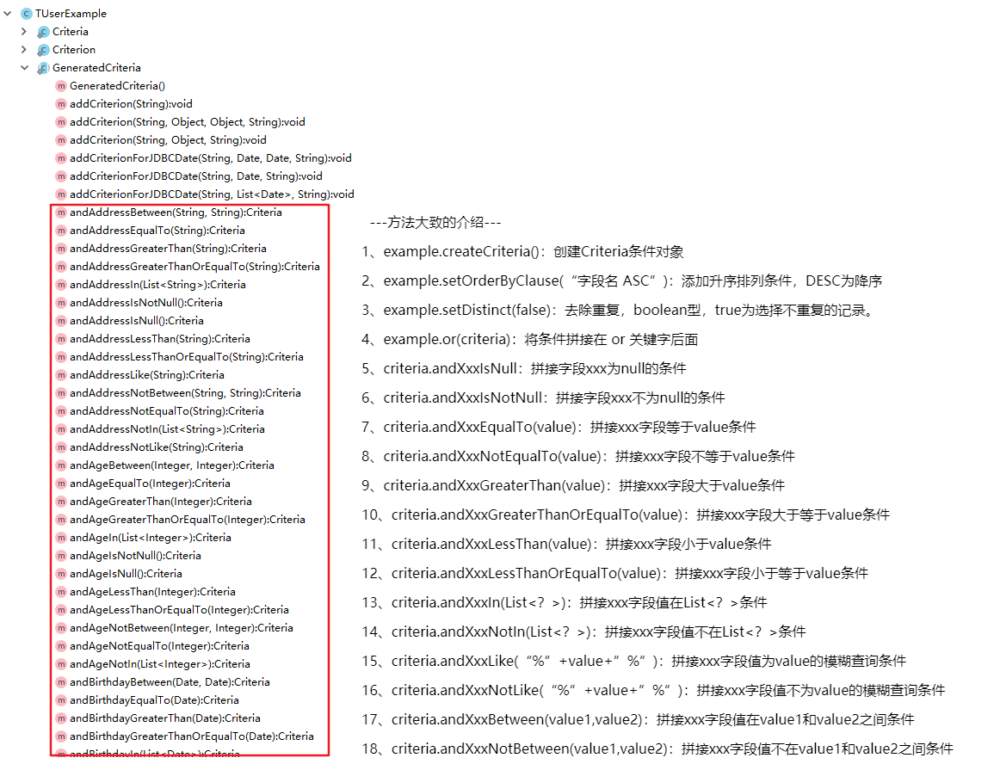

#### 7.2.4 QBC 查询

```java
public class MBGTest {
    @Test
    public void testMBG(){
        try{
            InputStream inputStream = Resources.getResourceAsStream("mybatis-config.xml");
            SqlSessionFactory build = new SqlSessionFactoryBuilder().build(inputStream);
            SqlSession sqlSession = build.openSession(true);
            EmpMapper mapper = sqlSession.getMapper(EmpMapper.class);
            //1. 查询所有员工
            List<Emp> emps = mapper.selectByExample(null);
            emps.forEach(emp -> System.out.println(emp));

            //2. 根据条件查询
            EmpExample empExample = new EmpExample();
            empExample.createCriteria().andEmpNameEqualTo("a1").andAgeGreaterThan(20);
            empExample.or().andDidIsNotNull();
            List<Emp> emps = mapper.selectByExample(empExample);
            emps.forEach(emp -> System.out.println(emp));

            //3. 修改
            mapper.updateByPrimaryKey(new Emp(1, "wuxie", null, null, null,null));
        } catch (IOException e) {
            e.printStackTrace();
        }
    }
}

```

## 8. 分页插件

### 8.1 添加依赖

```xml
<!-- https://mvnrepository.com/artifact/com.github.pagehelper/pagehelper -->
<dependency>
  <groupId>com.github.pagehelper</groupId>
  <artifactId>pagehelper</artifactId>
  <version>5.2.0</version>
</dependency>
```

### 8.2 配置分页插件

1. 在`mybatic-config.xml`核心配置文件中配置插件：

```xml
<plugins>
  <!--设置分页插件-->
  <plugin interceptor="com.github.pagehelper.PageInterceptor"></plugin>
</plugins>
```

尚筹网中的配置，使用的 4.0 版本的，不知道是不是版本的变化：

```xml
<bean id="sqlSessionFactoryBean" class="org.mybatis.spring.SqlSessionFactoryBean">
  <!--设置分页插件-->
  <property name="plugins">
    <array>
      <bean class="com.github.pagehelper.PageHelper">
        <property name="properties">
          <props>
            <!-- 配置数据库方言：告诉pagehelper使用的什么数据库 -->
            <prop key="dialect">mysql</prop>
            <!-- 配置页码的合理化修i正，在1~总页数之间修正页码 -->
            <prop key="reasonable">true</prop>
          </props>
        </property>
      </bean>
    </array>
  </property>
</bean>
```

### 8.3 使用分页查询

1. 在查询功能之前使用`PageHelper.startPage(int pageNum, int pageSize)`开启分页功能
   - `pageNum`：当前页的页码
   - `pageSize`：每页显示的条数
2. 在查询获取到 list 集合之后，使用`PageInfo<T> pageInfo = new PageInfo<>(List<T> list, int navigatePages)`获取分页相关数据
   - `list`：分页之后的数据
   - `navigatePages`：导航分页的页码数
3. 分页`pageInfo`相关数据：
   - `pageNum`：当前页的页码
   - `pageSize`：每页显示的条数
   - `size`：当前页显示的真实条数
   - `total`：总记录数
   - `pages`：总页数
   - `prePage`：上一页的页码
   - `nextPage`：下一页的页码
   - `isFirstPage/isLastPage`：是否为第一页/最后一页
   - `hasPreviousPage/hasNextPage`：是否存在上一页/下一页
   - `navigatePages`：导航分页的页码数
   - `navigatepageNums`：导航分页的页码，[1,2,3,4,5]
