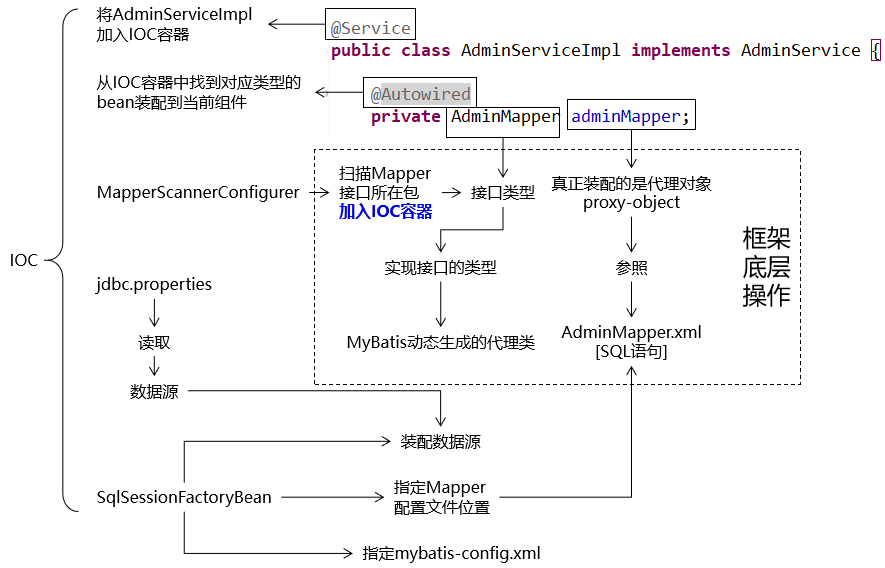
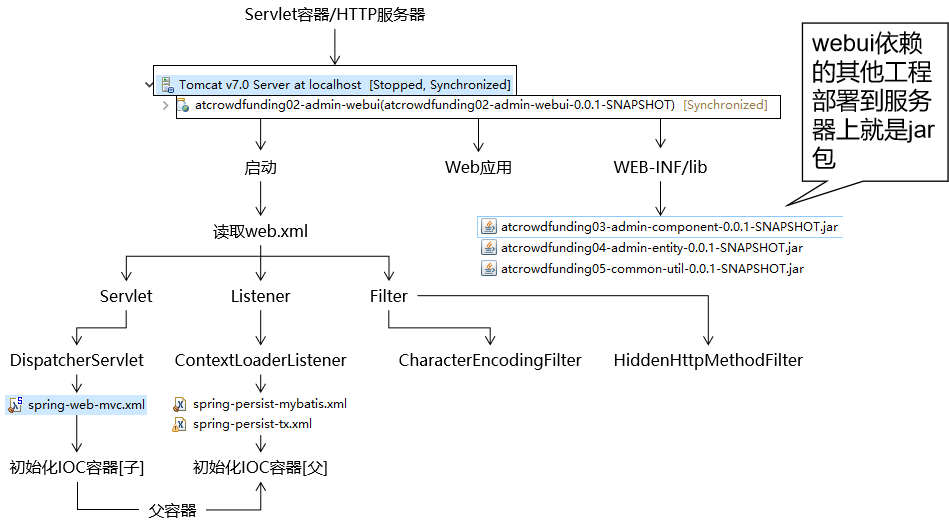
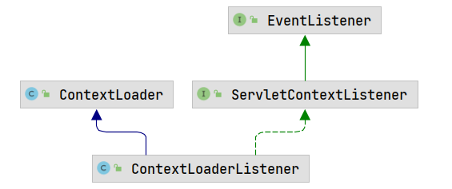
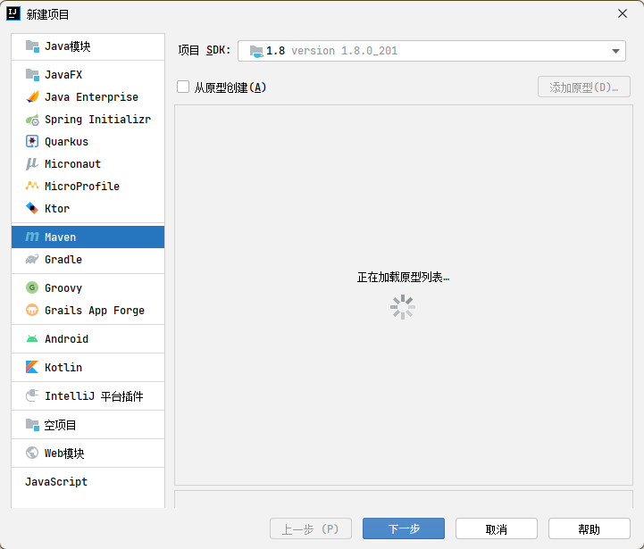
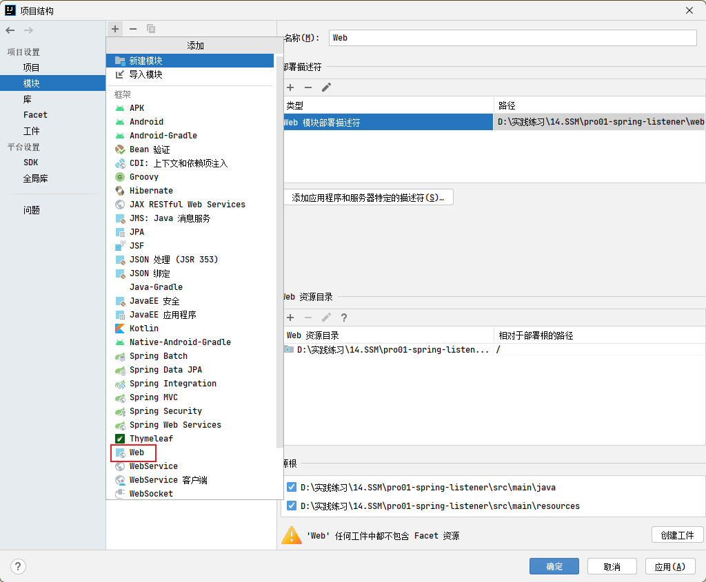
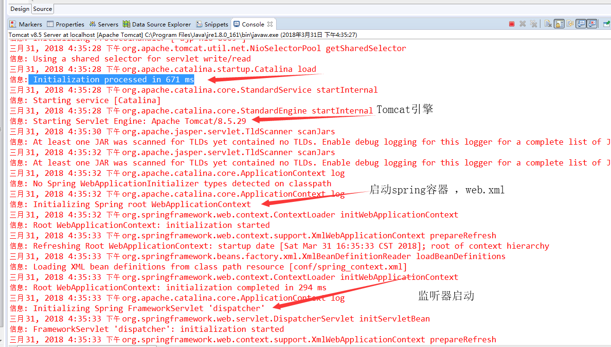
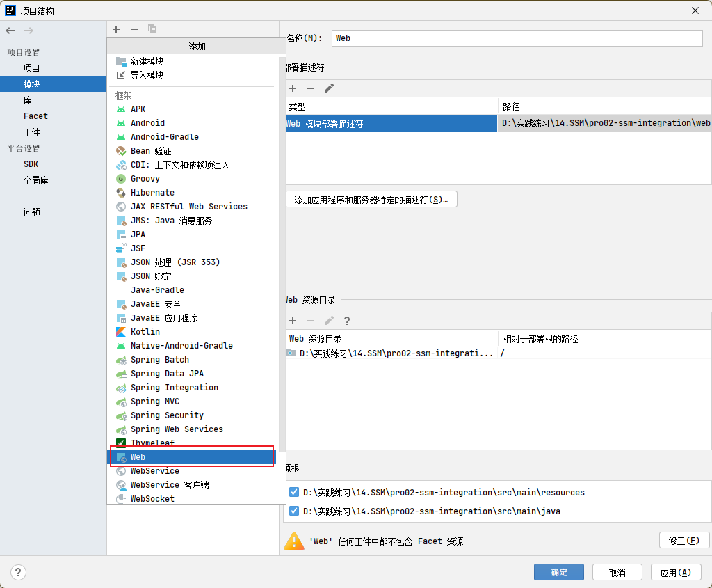
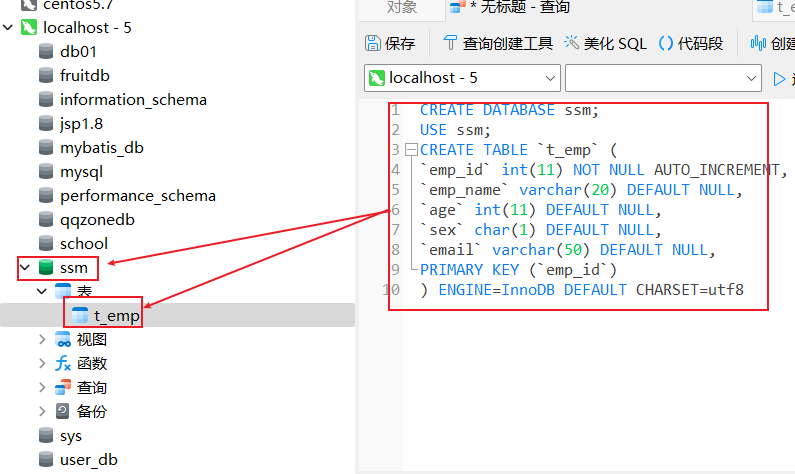
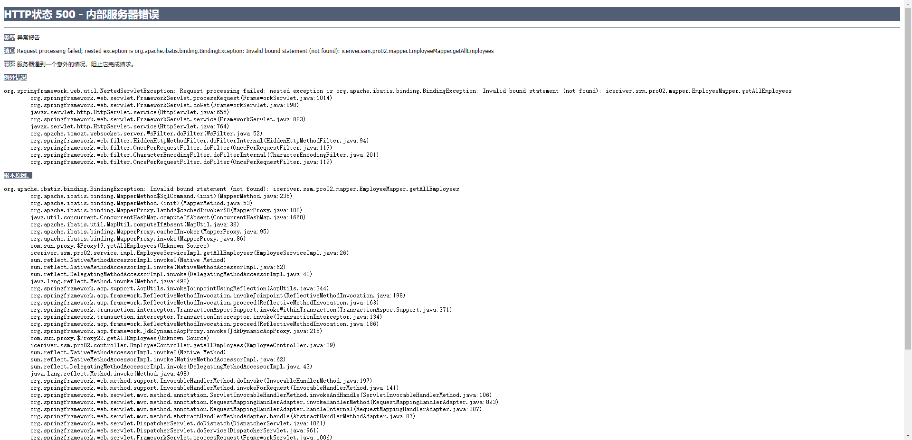

*SSM（SpringMVC+Spring+MyBatis）是目前市场上最流行的开发 web 项目的框架，它由 SpringMVC、Spring、MyBatis 整合而成。*


<!-- more -->


> - SSM（SpringMVC+Spring+MyBatis）是目前市场上最流行的开发 web 项目的框架，它由 SpringMVC、Spring、MyBatis 整合而成。——**即 springmvc 整合 spring 和 mybatis**

>   - SpringMVC 框架负责接收浏览器发送的请求，并响应浏览器数据；
>   - Spring 框架使用其核心 IOC 思想管理服务器中各个组件，使用 AOP 思想面向切面编程，在不改变源码的基础上实现功能增强；
>   - MyBatis 框架封装 JDBC，负责访问数据库，完成持久化操作。

> - 意义：一是不用使用 mapper.xml 文件，使用时自动注入简化开发过程，后续的操作由 spring 完成。二是对各种配置文件简单化，不要纠缠在一起。

## 1. SpringMVC

[Spring MVC](https://www.yuque.com/zhuyuqi/zna9x5/zh889g?view=doc_embed)

## 2. Spring

[Spring](https://www.yuque.com/zhuyuqi/zna9x5/aze75g?view=doc_embed)

## 3. MyBatis

[MyBatis](https://www.yuque.com/zhuyuqi/zna9x5/ifzzbt?view=doc_embed)

## 4. SSM 整合

### 4.0 三者的关系

spring 容器是 ApplicationContext/contextloaderlistener，管理的是 service 和 dao  
springmvc 容器是 webApplicationContext/dispatchservlet，管理的是 controller  
springmvc 容器是 spring 容器的子容器

### 4.1 引入

#### 4.1.1 一个问题

1. SpringMVC 中，springMVC.xml 用于配置控制层组件。
2. Spring 中，bean.xml 用于配置各个层组件。
3. 而在 SpringMVC 项目中，通过`<load-on-startup>`将控制层组件初始化提前到创建 tomcat 容器时（创建 servlet 时）完成。
4. 但控制层组件依赖 spring 管理的 service 实体，此时要求 service 实体的自动装配必须在控制层组件装配前完成，否则会报错。
5. 这就要求 spirng 的配置必须在创建 servlet 前完成。
6. 由于监听器、过滤器、servlet 依次执行，所以可以把 Spring 的配置放到监听器中完成。不选择过滤器的原因是它是专业处理请求和响应的。

#### 4.1.2 整合思路

spring 整合 mybatis  
  
即虚线框外的是需要程序员做的。  
spring 整合 springmvc：  
  
总体思路：tomcat 服务器会读取 web.xml，所以在读取 web.xml 文件时，spring.xml、spring-mvc.xml、mybatis.xml 都要配置好。

- spring.xml 配置 mybatis.xml，简化了 mybatis 的使用。在 web.xml 文件中，将 mybatix.xml 的文件配置在`<context-param>`中，随着工程一启动加载。
- web.xml 中加载 spring.xml。web.xml 中要用到 spring.xml 的数据信息，所以将 spring.xml 放在监听器启动时加载。
- web.xml 中加载 spring-mvc.xml。web.xml 要使用 spring-mvc.xml 的 servlet，默认 servlet 的声明周期为第一次接到请求时创建，这时来不及，所以使用 load-on-startup 提前到 web 应用启动时创建。

启动时执行流程：监听器 → 过滤器 → 拦截器

#### 4.1.3 ContextLoaderListener

Spring 提供了监听器`ContextLoaderListener`，实现`ServletContextListener`接口，可监听  
`ServletContext`的状态，在 web 服务器的启动，读取 Spring 的配置文件，创建 Spring 的 IOC 容器。  


#### 4.1.4 使用监听器加载 spring 配置文件

1. 创建新工程，使用 Maven 作为构建工具。

   - 

2. 引入依赖：

```xml
<?xml version="1.0" encoding="UTF-8"?>
<project xmlns="http://maven.apache.org/POM/4.0.0"
         xmlns:xsi="http://www.w3.org/2001/XMLSchema-instance"
         xsi:schemaLocation="http://maven.apache.org/POM/4.0.0 http://maven.apache.org/xsd/maven-4.0.0.xsd">
  <modelVersion>4.0.0</modelVersion>

  <groupId>iceriver.ssm.pro01-spring-listener</groupId>
  <artifactId>pro01-spring-listener</artifactId>
  <version>1.0-SNAPSHOT</version>

  <properties>
    <maven.compiler.source>8</maven.compiler.source>
    <maven.compiler.target>8</maven.compiler.target>
  </properties>

  <dependencies>
    <!-- SpringMVC -->
    <dependency>
      <groupId>org.springframework</groupId>
      <artifactId>spring-webmvc</artifactId>
      <version>5.3.1</version>
    </dependency>
    <!-- 日志 -->
    <dependency>
      <groupId>ch.qos.logback</groupId>
      <artifactId>logback-classic</artifactId>
      <version>1.2.3</version>
    </dependency>
    <!-- ServletAPI -->
    <dependency>
      <groupId>javax.servlet</groupId>
      <artifactId>javax.servlet-api</artifactId>
      <version>3.1.0</version>
      <scope>provided</scope>
    </dependency>
    <!-- Spring5和Thymeleaf整合包 -->
    <dependency>
      <groupId>org.thymeleaf</groupId>
      <artifactId>thymeleaf-spring5</artifactId>
      <version>3.0.12.RELEASE</version>
    </dependency>
  </dependencies>
</project>
```

3. 配置 web 工程：

   - 

4. 配置 springMVC 前端控制器，及 spring 配置文件

```xml
<?xml version="1.0" encoding="UTF-8"?>
<web-app xmlns="http://xmlns.jcp.org/xml/ns/javaee"
         xmlns:xsi="http://www.w3.org/2001/XMLSchema-instance"
         xsi:schemaLocation="http://xmlns.jcp.org/xml/ns/javaee http://xmlns.jcp.org/xml/ns/javaee/web-app_4_0.xsd"
         version="4.0">

<!--    springmvc前端控制器配置-->
    <servlet>
        <servlet-name>SpringMVC</servlet-name>
        <servlet-class>org.springframework.web.servlet.DispatcherServlet</servlet-class>
        <init-param>
            <param-name>contextConfigLocation</param-name>
            <param-value>classpath:springmvc.xml</param-value>
        </init-param>
        <load-on-startup>1</load-on-startup>
    </servlet>
    <servlet-mapping>
        <servlet-name>SpringMVC</servlet-name>
        <url-pattern>/</url-pattern>
    </servlet-mapping>
<!--    在监听器配置spring配置文件-->
    <listener>
        <listener-class>org.springframework.web.context.ContextLoaderListener</listener-class>
    </listener>
    <context-param>
        <param-name>contextConfigLocation</param-name>
        <param-value>classpath:spring.xml</param-value>
    </context-param>
</web-app>
```

- 这里 spring 的配置文件采用了自定义文件名的方式，如果没有`<context-param>`这段内容，则 spring 的配置文件名称要为：applicationContext.xml，位置要在/WEB-INF/下。

5. 创建 springmvc.xml 和 spring.xml 配置文件

```xml
<?xml version="1.0" encoding="UTF-8"?>
<beans xmlns="http://www.springframework.org/schema/beans"
       xmlns:xsi="http://www.w3.org/2001/XMLSchema-instance"
       xmlns:context="http://www.springframework.org/schema/context"
       xmlns:mvc="http://www.springframework.org/schema/mvc"
       xsi:schemaLocation="http://www.springframework.org/schema/beans http://www.springframework.org/schema/beans/spring-beans.xsd http://www.springframework.org/schema/context https://www.springframework.org/schema/context/spring-context.xsd http://www.springframework.org/schema/mvc https://www.springframework.org/schema/mvc/spring-mvc.xsd">

    <!--扫描组件-->
    <context:component-scan base-package="iceriver.ssm.pro01.controller"/>

    <!--配置视图解析器-->
    <bean id="viewResolver" class="org.thymeleaf.spring5.view.ThymeleafViewResolver">
        <property name="order" value="1"/>
        <property name="characterEncoding" value="UTF-8"/>
        <property name="templateEngine">
            <bean class="org.thymeleaf.spring5.SpringTemplateEngine">
                <property name="templateResolver">
                    <bean class="org.thymeleaf.spring5.templateresolver.SpringResourceTemplateResolver">

                        <!-- 视图前缀 -->
                        <property name="prefix" value="/WEB-INF/templates/"/>

                        <!-- 视图后缀 -->
                        <property name="suffix" value=".html"/>
                        <property name="templateMode" value="HTML5"/>
                        <property name="characterEncoding" value="UTF-8" />
                    </bean>
                </property>
            </bean>
        </property>
    </bean>
    <mvc:annotation-driven/>
    <mvc:view-controller path="/" view-name="index"></mvc:view-controller>
</beans>
```

```xml
<?xml version="1.0" encoding="UTF-8"?>
<beans xmlns="http://www.springframework.org/schema/beans"
       xmlns:xsi="http://www.w3.org/2001/XMLSchema-instance"
       xmlns:context="http://www.springframework.org/schema/context"
       xsi:schemaLocation="http://www.springframework.org/schema/beans http://www.springframework.org/schema/beans/spring-beans.xsd http://www.springframework.org/schema/context https://www.springframework.org/schema/context/spring-context.xsd">
    <context:component-scan base-package="iceriver.ssm.pro01.service"/>
</beans>
```

- srpingmvc 创建的 ioc 容器是 spring 创建的 ioc 容器的子容器（因为 spring 先执行创建容器）。spring 中，子容器能够访问父容器，但父容器不能访问子容器。



### 4.2 SSM 整合案例

#### 4.2.1 创建工程

1. 创建工程：【同上】
2. 导入依赖：

```xml
<?xml version="1.0" encoding="UTF-8"?>
<project xmlns="http://maven.apache.org/POM/4.0.0"
         xmlns:xsi="http://www.w3.org/2001/XMLSchema-instance"
         xsi:schemaLocation="http://maven.apache.org/POM/4.0.0 http://maven.apache.org/xsd/maven-4.0.0.xsd">
    <modelVersion>4.0.0</modelVersion>

    <groupId>iceriver.ssm.pro02-ssm</groupId>
    <artifactId>pro02-ssm-integration</artifactId>
    <version>1.0-SNAPSHOT</version>

    <properties>
        <maven.compiler.source>8</maven.compiler.source>
        <maven.compiler.target>8</maven.compiler.target>
        <spring.version>5.3.1</spring.version>
    </properties>
    <dependencies>
        <!-- spring上下文依赖-->
        <dependency>
            <groupId>org.springframework</groupId>
            <artifactId>spring-context</artifactId>
            <version>${spring.version}</version>
        </dependency>
        <!-- spring bean管理依赖-->
        <dependency>
            <groupId>org.springframework</groupId>
            <artifactId>spring-beans</artifactId>
            <version>${spring.version}</version>
        </dependency>
        <!--springmvc-->
        <dependency>
            <groupId>org.springframework</groupId>
            <artifactId>spring-web</artifactId>
            <version>${spring.version}</version>
        </dependency>
        <dependency>
            <groupId>org.springframework</groupId>
            <artifactId>spring-webmvc</artifactId>
            <version>${spring.version}</version>
        </dependency>
        <!-- 事务管理需要jdbc-->
        <dependency>
            <groupId>org.springframework</groupId>
            <artifactId>spring-jdbc</artifactId>
            <version>${spring.version}</version>
        </dependency>
        <dependency>
            <groupId>org.springframework</groupId>
            <artifactId>spring-aspects</artifactId>
            <version>${spring.version}</version>
        </dependency>
        <dependency>
            <groupId>org.springframework</groupId>
            <artifactId>spring-test</artifactId>
            <version>${spring.version}</version>
        </dependency>
        <!-- Mybatis核心 -->
        <dependency>
            <groupId>org.mybatis</groupId>
            <artifactId>mybatis</artifactId>
            <version>3.5.7</version>
        </dependency>
        <!--mybatis和spring的整合包-->
        <dependency>
            <groupId>org.mybatis</groupId>
            <artifactId>mybatis-spring</artifactId>
            <version>2.0.6</version>
        </dependency>
        <!-- 连接池 -->
        <dependency>
            <groupId>com.alibaba</groupId>
            <artifactId>druid</artifactId>
            <version>1.0.9</version>
        </dependency>
        <!-- junit测试 -->
        <dependency>
            <groupId>junit</groupId>
            <artifactId>junit</artifactId>
            <version>4.12</version>
            <scope>test</scope>
        </dependency>
        <!-- MySQL驱动 -->
        <dependency>
            <groupId>mysql</groupId>
            <artifactId>mysql-connector-java</artifactId>
            <version>8.0.16</version>
        </dependency>
        <!-- log4j日志 -->
        <dependency>
            <groupId>log4j</groupId>
            <artifactId>log4j</artifactId>
            <version>1.2.17</version>
        </dependency>
        <dependency>
            <groupId>com.github.pagehelper</groupId>
            <artifactId>pagehelper</artifactId>
            <version>5.2.0</version>
        </dependency>
        <!-- 日志 -->
        <dependency>
            <groupId>ch.qos.logback</groupId>
            <artifactId>logback-classic</artifactId>
            <version>1.2.3</version>
        </dependency>
        <!-- ServletAPI -->
        <dependency>
            <groupId>javax.servlet</groupId>
            <artifactId>javax.servlet-api</artifactId>
            <version>3.1.0</version>
            <scope>provided</scope>
        </dependency>
        <dependency>
            <groupId>com.fasterxml.jackson.core</groupId>
            <artifactId>jackson-databind</artifactId>
            <version>2.12.1</version>
        </dependency>
        <dependency>
            <groupId>commons-fileupload</groupId>
            <artifactId>commons-fileupload</artifactId>
            <version>1.3.1</version>
        </dependency>
        <!-- Spring5和Thymeleaf整合包 -->
        <dependency>
            <groupId>org.thymeleaf</groupId>
            <artifactId>thymeleaf-spring5</artifactId>
            <version>3.0.12.RELEASE</version>
        </dependency>
    </dependencies>
</project>
```

3. 创建 web 支持

   - 

4. 创建测试表：

   - 
   - 生成数据【任意数量】


#### 4.2.2 配置 web.xml

```xml
<?xml version="1.0" encoding="UTF-8"?>
<web-app xmlns="http://xmlns.jcp.org/xml/ns/javaee"
         xmlns:xsi="http://www.w3.org/2001/XMLSchema-instance"
         xsi:schemaLocation="http://xmlns.jcp.org/xml/ns/javaee http://xmlns.jcp.org/xml/ns/javaee/web-app_4_0.xsd"
         version="4.0">
<!--    1. 配置spring的编码过滤器-->
    <filter>
        <filter-name>CharacterEncodingFilter</filter-name>
        <filter-class>org.springframework.web.filter.CharacterEncodingFilter</filter-class>
        <init-param>
            <param-name>encoding</param-name>
            <param-value>UTF-8</param-value>
        </init-param>
        <init-param>
            <param-name>forceEncoding</param-name>
            <param-value>true</param-value>
        </init-param>
    </filter>
    <filter-mapping>
        <filter-name>CharacterEncodingFilter</filter-name>
        <url-pattern>/*</url-pattern>
    </filter-mapping>
<!--    2. 配置请求方式的过滤器-->
    <filter>
        <filter-name>HiddenHttpMethodFilter</filter-name>
        <filter-class>org.springframework.web.filter.HiddenHttpMethodFilter</filter-class>
    </filter>
    <filter-mapping>
        <filter-name>HiddenHttpMethodFilter</filter-name>
        <url-pattern>/*</url-pattern>
    </filter-mapping>
<!--    3. 配置springmvc的前端控制器-->
    <servlet>
        <servlet-name>SpringMVC</servlet-name>
        <servlet-class>org.springframework.web.servlet.DispatcherServlet</servlet-class>
        <init-param>
            <param-name>contextConfigLocation</param-name>
            <param-value>classpath:springmvc.xml</param-value>
        </init-param>
        <load-on-startup>1</load-on-startup>
    </servlet>
    <servlet-mapping>
        <servlet-name>SpringMVC</servlet-name>
        <url-pattern>/</url-pattern>
    </servlet-mapping>
<!--    4. 在监听器配置spring配置文件-->
    <listener>
        <listener-class>org.springframework.web.context.ContextLoaderListener</listener-class>
    </listener>
<!--    5. 配置spring配置文件自定义的位置和名称-->
    <context-param>
        <param-name>contextConfigLocation</param-name>
        <param-value>classpath:spring.xml</param-value>
    </context-param>
</web-app>
```

#### 4.2.3 配置 springmvc.xml

```xml
<?xml version="1.0" encoding="UTF-8"?>
<beans xmlns="http://www.springframework.org/schema/beans"
       xmlns:xsi="http://www.w3.org/2001/XMLSchema-instance"
       xmlns:context="http://www.springframework.org/schema/context"
       xmlns:mvc="http://www.springframework.org/schema/mvc"
       xsi:schemaLocation="http://www.springframework.org/schema/beans http://www.springframework.org/schema/beans/spring-beans.xsd http://www.springframework.org/schema/context https://www.springframework.org/schema/context/spring-context.xsd http://www.springframework.org/schema/mvc https://www.springframework.org/schema/mvc/spring-mvc.xsd">

    <!--扫描组件-->
    <context:component-scan base-package="iceriver.ssm.pro02.controller"/>

    <!--配置视图解析器-->
    <bean id="viewResolver" class="org.thymeleaf.spring5.view.ThymeleafViewResolver">
        <property name="order" value="1"/>
        <property name="characterEncoding" value="UTF-8"/>
        <property name="templateEngine">
            <bean class="org.thymeleaf.spring5.SpringTemplateEngine">
                <property name="templateResolver">
                    <bean class="org.thymeleaf.spring5.templateresolver.SpringResourceTemplateResolver">
                        <!-- 视图前缀 -->
                        <property name="prefix" value="/WEB-INF/templates/"/>
                        <!-- 视图后缀 -->
                        <property name="suffix" value=".html"/>
                        <property name="templateMode" value="HTML5"/>
                        <property name="characterEncoding" value="UTF-8" />
                    </bean>
                </property>
            </bean>
        </property>
    </bean>

    <!--配置默认的servlet处理静态资源-->
    <mvc:default-servlet-handler/>

    <!--开启mvc的注解驱动-->
    <mvc:annotation-driven/>

    <!--配置视图控制器-->
    <mvc:view-controller path="/" view-name="index"/>

    <!--配置文件上传解析器-->
    <bean id="multipartResolver" class="org.springframework.web.multipart.commons.CommonsMultipartResolver"/>

    <!--配置异常处理器-->
    <!--配置拦截器-->
</beans>
```

#### 4.2.4 配置 spring.xml

```xml
<?xml version="1.0" encoding="UTF-8"?>
<beans xmlns="http://www.springframework.org/schema/beans"
       xmlns:xsi="http://www.w3.org/2001/XMLSchema-instance"
       xmlns:context="http://www.springframework.org/schema/context"
       xsi:schemaLocation="http://www.springframework.org/schema/beans http://www.springframework.org/schema/beans/spring-beans.xsd http://www.springframework.org/schema/context https://www.springframework.org/schema/context/spring-context.xsd">
<!--    引入jdbc.properties-->
    <context:property-placeholder location="classpath:jdbc.properties"/>
<!--    扫描组件，除控制层-->
    <context:component-scan base-package="iceriver.ssm.pro02">
        <context:exclude-filter type="annotation" expression="org.springframework.stereotype.Controller"/>
    </context:component-scan>
<!--    配置数据源-->
    <bean id="dataSource" class="com.alibaba.druid.pool.DruidDataSource">
        <property name="driverClassName" value="${jdbc.driver}"/>
        <property name="url" value="${jdbc.url}"/>
        <property name="username" value="${jdbc.username}"/>
        <property name="password" value="${jdbc.password}"/>
    </bean>
</beans>
```

#### 4.2.5 配置 mybatis-config.xml

1. 编写配置文件

```xml
<?xml version="1.0" encoding="UTF-8" ?>
<!DOCTYPE configuration
        PUBLIC "-//MyBatis.org//DTD Config 3.0//EN"
        "http://MyBatis.org/dtd/MyBatis-3-config.dtd">
<configuration>
    <properties resource="jdbc.properties"/>
    <typeAliases>
        <package name=""/>
    </typeAliases>
    <environments default="mysql_test">
        <environment id="mysql_test">
            <transactionManager type="JDBC"/>
            <dataSource type="POOLED">
                <property name="driver" value="${jdbc.driver}"/>
                <property name="url" value="${jdbc.url}"/>
                <property name="username" value="${jdbc.username}"/>
                <property name="password" value="${jdbc.password}"/>
            </dataSource>
        </environment>
    </environments>
    <mappers>
        <package name=""/>
    </mappers>
</configuration>
```

2. 编写 mapper 类
3. 编写 mapper.xml 映射文件

#### 4.2.6 spring.xml 整合 mybatis 核心配置文件

```xml
<?xml version="1.0" encoding="UTF-8"?>
<beans xmlns="http://www.springframework.org/schema/beans"
       xmlns:xsi="http://www.w3.org/2001/XMLSchema-instance"
       xmlns:context="http://www.springframework.org/schema/context"
       xsi:schemaLocation="http://www.springframework.org/schema/beans http://www.springframework.org/schema/beans/spring-beans.xsd http://www.springframework.org/schema/context https://www.springframework.org/schema/context/spring-context.xsd">
<!--    引入jdbc.properties-->
    <context:property-placeholder location="classpath:jdbc.properties"/>
<!--    扫描组件，除控制层-->
    <context:component-scan base-package="iceriver.ssm.pro02">
        <context:exclude-filter type="annotation" expression="org.springframework.stereotype.Controller"/>
    </context:component-scan>
<!--    配置数据源-->
    <bean id="dataSource" class="com.alibaba.druid.pool.DruidDataSource">
        <property name="driverClassName" value="${jdbc.driver}"/>
        <property name="url" value="${jdbc.url}"/>
        <property name="username" value="${jdbc.username}"/>
        <property name="password" value="${jdbc.password}"/>
    </bean>
<!--    整合mybatis:-->
<!--    配置sqlsessionfactorybean，可以直接在spring的ioc中获取sqlsessionfactory对象-->
    <bean class="org.mybatis.spring.SqlSessionFactoryBean">
<!--        设置mybatis的核心配置文件路径，如果有这个设置，则允许spring.xml与mybatis-config.xml同时进行配置-->
        <property name="configLocation" value="classpath:mybatis-cofig.xml"/>
<!--        设置数据源-->
        <property name="dataSource" ref="dataSource"/>
<!--        设置类型别名对应的包-->
        <property name="typeAliasesPackage" value="iceriver.ssm.pro02.pojo"/>
<!--        设置映射文件路径：如果映射文件与mapper类的包名一致时，可以不设置。注意，不设置时还需要设置下面的sqlsession实现类对象。不然还是要写-->
        <property name="mapperLocations" value="classpath:iceriver/ssm/pro02/mapper/*.xml"/>
    </bean>
<!--    配置mapper接口的扫描，可以将指定包下所有的mapper接口通过sqlsession创建代理实现类对象，并将这些对象交给ioc容器管理-->
<!--    有了这个配置，就可以直接在serviceimple类中直接使用ampper类了，而不用创建sqlsession对象-->
    <bean class="org.mybatis.spring.mapper.MapperScannerConfigurer">
        <property name="basePackage" value="iceriver.ssm.pro02.mapper"/>
    </bean>
</beans>
```

**注 1：配置后就不需要 mybatis-config.xml 了，但由于 spring.xml 中有****`<property name="configLocation" value="classpath:mybatis-cofig.xml"/>`** **<property name="configLocation" value="classpath:mybatis-cofig.xml"/>****，所以还是允许 mybatis-config.xml 存在的。**  
**注 2：29 行老师讲的时候说可以不配置，他的演示里也没有配置，但本地测试，必须配置，否则会报 500 错误：**

- 

#### 4.2.7 spring.xml 整合事务管理

1. 引入`log4j.xml`

```xml
<?xml version="1.0" encoding="UTF-8" ?>
<!DOCTYPE log4j:configuration SYSTEM "log4j.dtd">
<log4j:configuration xmlns:log4j="http://jakarta.apache.org/log4j/">
    <appender name="STDOUT" class="org.apache.log4j.ConsoleAppender">
        <param name="Encoding" value="UTF-8"/>
        <layout class="org.apache.log4j.PatternLayout">
            <param name="ConversionPattern" value="%-5p %d{MM-dd HH:mm:ss,SSS}%m (%F:%L) \n"/>
        </layout>
    </appender>
    <logger name="java.sql">
        <level value="debug"/>
    </logger>
    <logger name="org.apache.ibatis">
        <level value="info"/>
    </logger>
    <root>
        <level value="debug"/>
        <appender-ref ref="STDOUT"/>
    </root>
</log4j:configuration>
```

2. spring.xml 中配置事务：

   - 同 spring5 事务配置[Spring5](https://www.yuque.com/zhuyuqi/zna9x5/aze75g?view=doc_embed&inner=IORB4)


### 4.3 实践

> - 完成查询及分页查询功能