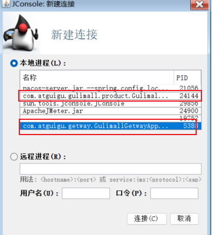
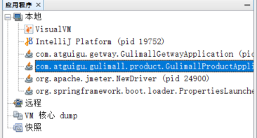
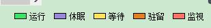
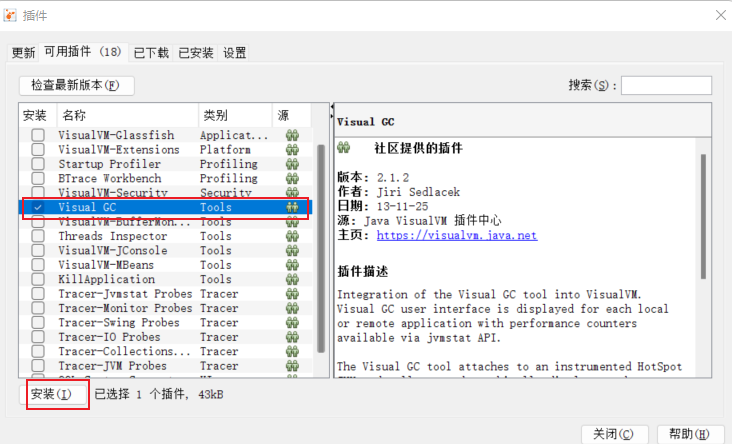
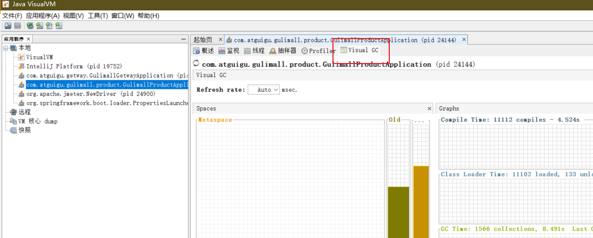
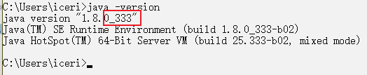
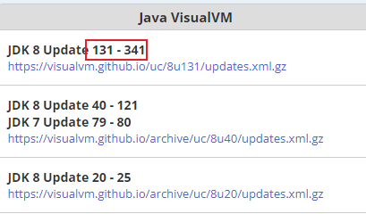
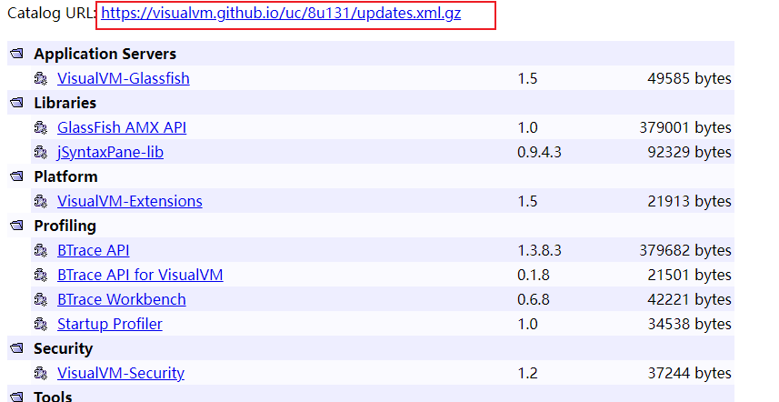
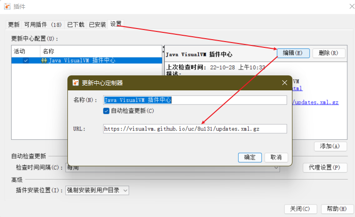

*性能监控主要是对 jvm 的堆空间进行管理，涉及到对象创建与回收，所以需要使用 jvm 工具。*
<!-- more -->

## 1. 工具简介

jvisualvm 是升级版的 jconsole，二者都是 JDK 自带的小工具，配置了 java 的环境变量后，可以通过命令行启动【我的怎么启动不了】， 可监控本地和远程应用。 远程应用需要配置。

## 2. jconsole 的使用

- 启动后选择要连接的进程（选中后双击）：
  - 

## 3. jvisualvm

### 3.1 基本使用

- 启动后选择要连接的进程
  - 
- 主要作用：监控内存泄露， 跟踪垃圾回收， 执行时内存、 cpu 分析， 线程分析...
- 线程分析的相关概念：
  - 
  - 运行： 正在运行的
  - 休眠： sleep
  - 等待： wait
  - 驻留： 线程池里面的空闲线程
  - 监视： 阻塞的线程， 正在等待锁

### 3.2 安装插件

- 安装插件方便查看 gc
  - 选择工具》插件》可用插件，找到 visualgc，然后安装
  - 
- 安装了插件后就可以查看了
  - 

### 3.3 安装插件 503 错误的解决

- cmd 查看自己的 jdk 版本（查看小版本）
  - 
- 打开网址：https://visualvm.github.io/pluginscenters.html，找到对应的版本
  - 
  - 点击下面的连接，进去后复制插件连接
  - 
- 在工具》插件》设置中粘贴上面复制的连接
  - 
