*JUC 是 java.util.concurrent 包的简称，该包提供了一系列多线程开发的工具类，使用该包的工具类能够快速进行多线程开发。（Java 并发编程）*
<!-- more -->

## 1. 多线程基础

### 1.1 什么是 JUC

在 Java 5.0 提供了 java.util.concurrent（简称 JUC） 包， 在此包中增加了在并发编程中很常用的实用工具类， 用于定义类似于线程的自定义子系统， 包括线程池、 异步 IO 和轻量级任务框架。提供可调的、 灵活的线程池。 还提供了设计用于多线程上下文中的 Collection 实现等。
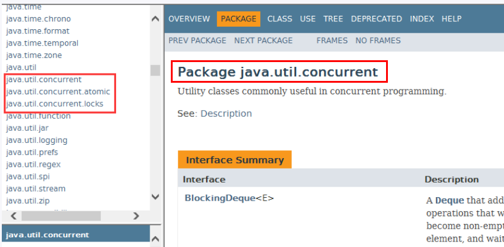

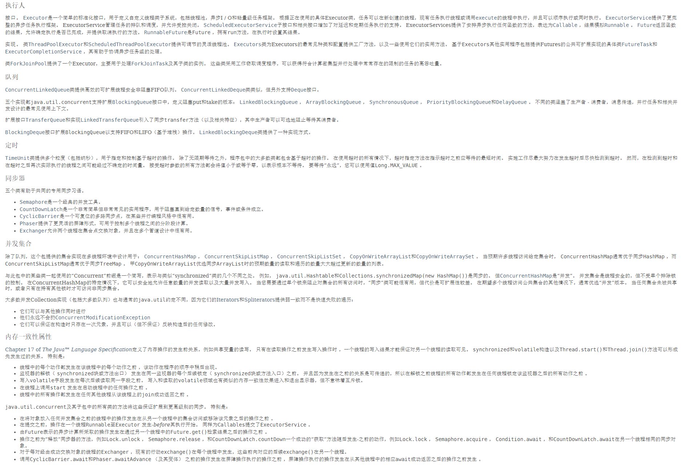
使用并发编程的背景：2003 年后，CPU 的主频不再翻倍，硬件厂商采用了多核而不是更快的主频的发展方向。在不提高主频、而核心数在不断增加的背景下，要想让程序更快运行，就要用并行或者并发编程。

使用高并发的优势：
  - 充分利用多核处理器。
  - 使用高并发系统，提高程序性能。
  - 提高程序吞吐量，满足异步+回调等场景的生产需求。

使用高并发的弊端及问题：
  - 线程安全性问题，如 i++，集合类的不安全
  - 线程锁问题，synchronized 重量级、死锁等问题，如何选用合适的锁，并适当的控制锁。
  - 线程性能问题

### 1.2 进程和线程

进程（Process） 是计算机中的程序关于某数据集合上的一次运行活动，是系统进行资源分配和调度的基本单位，是操作系统结构的基础。 在当代面向线程设计的计算机结构中，进程是线程的容器。程序是指令、数据及其组织形式的描述，进程是程序的实体。进程是计算机中的程序关于某数据集合上的一次运行活动，是系统进行资源分配和调度的基本单位，是操作系统结构的基础。

线程（thread） 是操作系统能够进行运算调度的最小单位。它被包含在进程之中，是进程中的实际运作单位。一条线程指的是进程中一个单一顺序的控制流，一个进程中可以并发多个线程，每条线程并行执行不同的任务。

总结来说:
- 进程：指在系统中正在运行的一个应用程序；程序一旦运行就是进程。进程——资源分配的最小单位。
- 线程：系统分配处理器时间资源的基本单元，或者说进程之内独立执行的一个单元执行流。线程——程序执行（CPU 时序调度）的最小单位。

### 1.3 线程的状态

#### 1.3.1 Thread.State

Thread 类中的内部枚举类 State 定义了线程的 6 种状态：

- [NEW](https://www.runoob.com/manual/jdk1.6/java.base/java/lang/Thread.State.html#NEW)：尚未启动的线程处于此状态。
- [RUNNABLE](https://www.runoob.com/manual/jdk1.6/java.base/java/lang/Thread.State.html#RUNNABLE)：在 Java 虚拟机中执行的线程处于此状态。
- [BLOCKED](https://www.runoob.com/manual/jdk1.6/java.base/java/lang/Thread.State.html#BLOCKED)：被阻塞等待监视器锁定的线程处于此状态。
- [WAITING](https://www.runoob.com/manual/jdk1.6/java.base/java/lang/Thread.State.html#WAITING)：无限期等待另一个线程执行特定操作的线程处于此状态。
- [TIMED_WAITING](https://www.runoob.com/manual/jdk1.6/java.base/java/lang/Thread.State.html#TIMED_WAITING)：正在等待另一个线程执行最多指定等待时间的操作的线程处于此状态。
- [TERMINATED](https://www.runoob.com/manual/jdk1.6/java.base/java/lang/Thread.State.html#TERMINATED)：已退出的线程处于此状态。

线程在给定时间点只能处于一种状态。 这些状态是虚拟机状态，不反映任何操作系统线程状态。

#### 1.3.2 wait 和 sleep

1. sleep 是 Thread 的静态方法， wait 是 Object 的方法，任何对象实例都能调用。
2. sleep 不会释放锁，它也不需要占用锁(？)。wait 会释放锁，但调用它的前提是当前线程占有锁(即代码要在 synchronized 中)。
3. 它们都可以被 interrupted 方法中断。

### 1.4 并行和并发

#### 1.4.1 串行模式

串行表示所有任务都一一按先后顺序进行。串行意味着必须先装完一车柴才能运送这车柴，只有运送到了，才能卸下这车柴，并且只有完成了这整个三个步骤，才能进行下一个步骤。串行是一次只能取得一个任务，并执行这个任务。

#### 1.4.2 并行模式

并行意味着可以同时取得多个任务，并同时去执行所取得的这些任务。并行模式相当于将长长的一条队列，划分成了多条短队列，所以并行缩短了任务队列的长度。并行的效率从代码层次上强依赖于多进程/多线程代码，从硬件角度上则依赖于多核 CPU。

#### 1.4.3 并发

并发(concurrent)指的是多个程序可以同时运行的现象，更细化的是多进程可以同时运行或者多指令可以同时运行，描述的是多进程同时运行的现象。

但实际上，对于单核心 CPU 来说，同一时刻只能运行一个线程。所以，这里的"同时运行"表示的不是真的同一时刻有多个线程运行的现象，这是并行的概念，而是提供一种功能让用户看来多个程序同时运行起来了，但实际上这些程序中的进程不是一直霸占 CPU 的，而是执行一会停一会。

要解决大并发问题，通常是将大任务分解成多个小任务, 由于操作系统对进程的调度是随机的，所以切分成多个小任务后，可能会从任一小任务处执行。这可能会出现一些现象：

- 可能出现一个小任务执行了多次，还没开始下个任务的情况。这时一般会采用队列或类似的数据结构来存放各个小任务的成果。
- 可能出现还没准备好第一步就执行第二步的可能。这时，一般采用多路复用或异步的方式，比如只有准备好产生了事件通知才执行某个任务。
- 可以多进程/多线程的方式并行执行这些小任务。也可以单进程/单线程执行这些小任务，这时很可能要配合多路复用才能达到较高的效率。

并发： 同一时刻多个线程在访问同一个资源，多个线程对一个点。例子：春运抢票、电商秒杀...

并行： 多项工作一起执行，之后再汇总结果。

### 1.5 管程

管程(monitor—**监视器—Java 中描述的锁**)是保证了同一时刻只有一个进程在管程内活动，即管程内定义的操作在同一时刻只被一个进程调用(由编译器实现).但是这样并不能保证进程以设计的顺序执行。

JVM 中同步是基于进入和退出管程(monitor)对象实现的，**每个对象都会有一个管程(monitor)对象**，管程(monitor)会随着 java 对象一同创建和销毁。

来源于 JVM 中的定义：执行线程首先要持有管程对象，然后才能执行方法，当方法完成之后会释放管程，方法在执行时候会持有管程，其他线程无法再获取同一个管程。

### 1.6 用户线程和守护线程

用户线程：平时用到的普通线程，自定义线程。

守护线程：运行在后台，是一种特殊的线程，一种为其他线程服务的线程，比如垃圾回收。

当主线程结束后，用户线程还在运行，JVM 存活。

如果没有用户线程，都是守护线程，JVM 结束，自动退出。

- Thread 类中的 final 方法 isDaemon()能够判断当前线程为用户线程（false）还是守护线程（true）。
	- 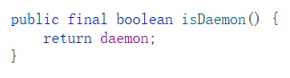
- setDaemon()能够设置当前线程为用户线程（false）还是守护线程（true）。
- etDaemon()需要在 start()方法之前调用，否则不起作用。
	- 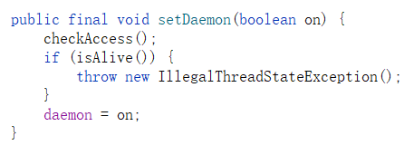

### 1.7 start()方法源码

通过 Thread.java 的 start()方法可以看到，内部调用了 start0()方法，而 start0()是 Thread.java 中的 native 方法。[start()源码](https://www.yuque.com/zhuyuqi/java/qmt25a)
想要查看 native 方法，需要下载 openjdk 查看源码，下载地址：[http://hg.openjdk.java.net/jdk8](http://hg.openjdk.java.net/jdk8)，结合本课程，需要下载 hotspot 源码和 jdk 源码。
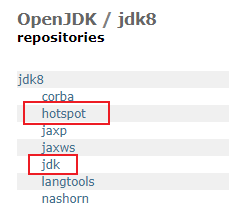
`jdk\src\sharr\native\java`目录，里面有各种 xxx.c 文件，因为 JNI 机制（JVM 的本地方法接口调用的就是 native 方法），所以 Thread.java 文件中的 native 方法（jdk 中的文件与 Java 中的文件一一对应）能在 java\lang\Thread.c 文件中找到：
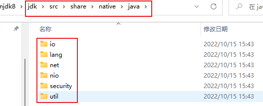
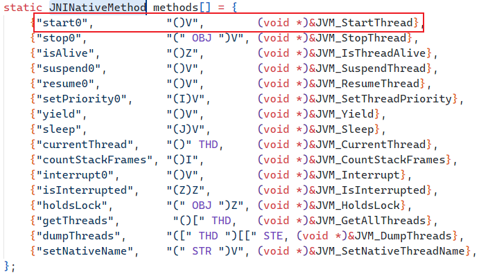
Thread.c 中的 start0 对应着的 JVM_StartThread 在`\hotspot\src\share\vm\prims\jvm.cpp`文件中，jvm.cpp 中的 JVM_StartThread 调用了 Thread::start(native_thread)，该方法在`\hotspot\src\share\vm\prims\thread.cpp`中，thread.cpp 中的 Thread::start(native_thread)调用了 os::start_thread(thread)，这里的 os 代表操作系统。

总结：
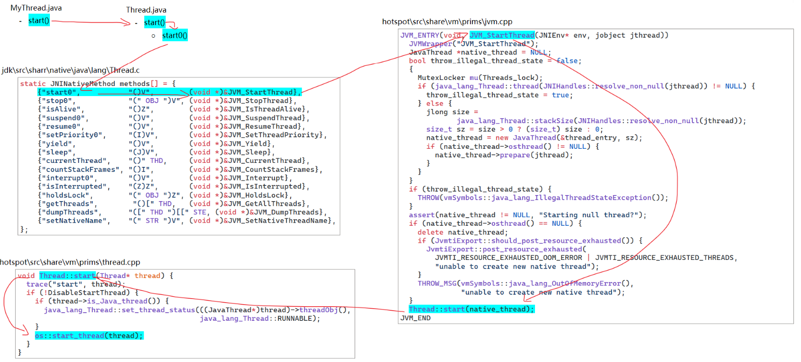

```java
public synchronized void start() {
    if (threadStatus != 0)
        throw new IllegalThreadStateException();
    group.add(this);
    boolean started = false;
    try {
        start0();
        started = true;
    } finally {
        try {
            if (!started) {
                group.threadStartFailed(this);
            }
        } catch (Throwable ignore) {
        }
    }
}
private native void start0();
```

## 2. Lock 接口

### 2.1 synchronized 关键字

> - 同步锁：保证每个线程都能正常执行的标记锁。
> - 每个 Java 对象都有且只有一个同步锁，在任何时刻，最多只允许一个线程拥有这把锁

synchronized 是 Java 中的关键字，是一种同步锁。它修饰的对象有以下几种：

1. 修饰一个代码块，被修饰的代码块称为同步语句块，其作用的范围是大括号{}括起来的代码，作用的对象是调用这个代码块的对象。
2. 修饰一个方法，被修饰的方法称为同步方法，其作用的范围是整个方法，作用的对象是调用这个方法的对象。
   - 虽然可以使用 synchronized 来定义方法，但 synchronized 并不属于方法定义的一部分，因此，synchronized 关键字不能被继承。
   - 如果在父类中的某个方法使用了 synchronized 关键字，而在子类中覆盖了这个方法，在子类中的这个方法默认情况下并不是同步的，而必须显式地在子类的这个方法中加上 synchronized 关键字才可以。
   - 当然，还可以在子类方法中调用父类中相应的方法，这样虽然子类中的方法不是同步的，但子类调用了父类的同步方法，因此，子类的方法也就相当于同步了。
3. 修饰一个静态的方法，其作用的范围是整个静态方法，作用的对象是这个类的所有对象。
4. 修饰一个类，其作用的范围是 synchronized 后面括号括起来的部分，作用的对象是这个类的所有对象。

买票案例：假设 3 个售票员，每个都可以卖完所有票，所以要争夺资源（票数）。

```java
public class SaleTicket {
    public static void main(String[] args) {
        Ticket ticket = new Ticket();
        new Thread(()->{
            for (int i = 0; i < 30; i++) {
                ticket.sale();
            }
        }, "aa").start();

        new Thread(()->{
            for (int i = 0; i < 30; i++) {
                ticket.sale();
            }
        }, "bb").start();

        new Thread(()->{
            for (int i = 0; i < 30; i++) {
                ticket.sale();
            }
        }, "cc").start();
    }
}
class Ticket{
    private int number = 30;//30张票
    /**
     * 售出
     */
    public synchronized void sale(){
        if(number > 0){
            System.out.println("当前票数：" + this.number + "，" + Thread.currentThread().getName() + "卖出了1张票，目前剩余" + --number + "张票");
        }
    }
}
```

这里没有使用 Ticket 继承 Thread 的方式，所以创建线程对象时也没有使用`Tread ticket1 = new Ticket()`的方式，这是因为继承具有局限性，一般不这么用，所以要去习惯采用函数式接口的匿名内部类的方式。

### 2.2 创建多线程

使用`Thread(Runnable target, String name)`及 Lambda 表达式创建多线程对象：
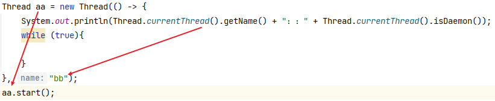
注意：

1. 启动线程需要使用线程对象的名字，即 aa。
2. 获取到的线程名字为`Thread(Runnable target, String name)`构造器种传入的字符串，即 bb。
3. 创建了线程对象，调用 start()方法并不一定马上创建线程，因为 start()方法内调用了 navtie 修饰的 start0()方法，表示由操作系统（JVM）确定何时创建。
   - 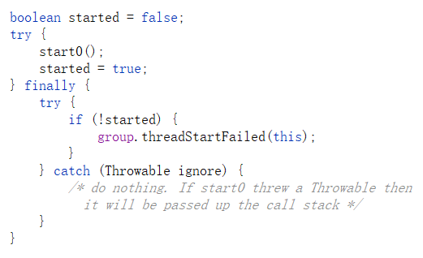

多线程编程步骤：

1. 创建资源类，在资源类创建属性和操作方法。
2. 创建多线程，调用资源类的操作方法。

### 2.3 Lock 概述

#### 2.3.1 Lock 实现类

Lock 锁是 java.util.concurrent.locks 包下的 Lock 接口，它的实现类有 ReentrantLock，ReentrantReadWriteLock.ReadLock ， ReentrantReadWriteLock.WriteLock，提供了比使用同步方法和语句可以获得的更广泛的锁操作。它们允许更灵活的结构，可能具有非常不同的属性，并且可能支持多个关联的条件对象。 Lock 提供了比 synchronized 更多的功能。
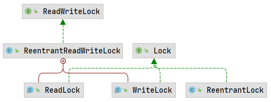
ReentrantLock 是唯一实现了 Lock 接口的类 ，意思是“可重入锁”。

#### 2.3.2 Lock 与 Synchronized 的区别

- Lock 不是 Java 语言内置的，synchronized 是 Java 语言的关键字，因此是内置特性。Lock 是一个接口，通过实现类类可以实现同步访问。
- synchronized 不需要用户去手动释放锁，当 synchronized 方法或者 synchronized 代码块执行完之后，系统会自动让线程释放对锁的占用；而 Lock 则必须要用户去手动释放锁，如果没有主动释放锁，就有可能导致出现死锁现象。
- synchronized 在发生异常时，会自动释放线程占有的锁，因此不会导致死锁现象发生。而 Lock 在发生异常时，如果没有主动通过 unLock()去释放锁，则很可能造成死锁现象，因此使用 Lock 时需要在 finally 块中释放锁。
- Lock 可以让等待锁的线程响应中断，而 synchronized 却不行，使用 synchronized 时，等待的线程会一直等待下去，不能够响应中断。通过 Lock 可以知道有没有成功获取锁，而 synchronized 却无法办到。

总结：Lock 可以提高多个线程进行读操作的效率。 在性能上来说，如果竞争资源不激烈，两者的性能是差不多的，而当竞争资源非常激烈时（即有大量线程同时竞争），此时 Lock 的性能要远远优于 synchronized。
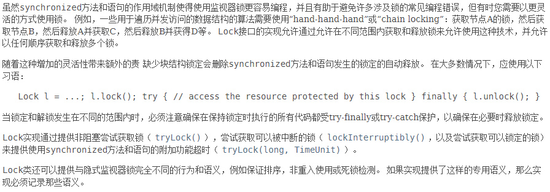
使用 ReentrantLock 重写上述代码

```java
public class SaleTicket {
    public static void main(String[] args) {
        Ticket ticket = new Ticket();
        new Thread(()->{
            for (int i = 0; i < 30; i++) {
                ticket.sale();
            }
        }, "aa").start();

        new Thread(()->{
            for (int i = 0; i < 30; i++) {
                ticket.sale();
            }
        }, "bb").start();

        new Thread(()->{
            for (int i = 0; i < 30; i++) {
                ticket.sale();
            }
        }, "cc").start();
    }
}
class Ticket{
    private int number = 30;//30张票
    private final ReentrantLock lock = new ReentrantLock();//创建可重入锁
    /**
     * 售出
     */
    public void sale(){
        lock.lock();
        try {
            if(number > 0){
                System.out.println("当前票数：" + this.number + "，" + Thread.currentThread().getName() + "卖出了1张票，目前剩余" + --number + "张票");
            }
        } finally {
            lock.unlock();//确保不论有无异常，均释放锁
        }
    }
}
```

### 2.4 Lock 接口方法

```java
public interface Lock {
    void lock();
    void lockInterruptibly() throws InterruptedException;
    boolean tryLock();
    boolean tryLock(long time, TimeUnit unit) throws InterruptedException;
    void unlock();
    Condition newCondition();
}
```

#### 2.4.1 lock()、unlock()

lock()方法是平常使用得最多的一个方法，就是用来获取锁。如果锁已被其他线程获取，则进行等待。

采用 Lock，必须主动去释放锁，并且在发生异常时，不会自动释放锁。因此一般来说，使用 Lock 必须在 try{}catch{}块中进行，并且将释放锁的操作放在 finally 块中进行，以保证锁一定被被释放，防止死锁的发生。通常使用 Lock 来进行同步的话，是以下面这种形式去使用的：

```java
Lock lock = ...;//获取锁
lock.lock();
try{
	//处理任务
}catch(Exception ex){
}finally{
    lock.unlock(); //释放锁
}
```

#### 2.4.2 newCondition()

关键字 synchronized 与 wait()/notify()这两个方法一起使用可以实现等待/通知模式，Lock 锁的 newContition()方法返回 Condition 对象，Condition 类也可以实现等待/通知模式。

用 notify()通知时，JVM 会随机唤醒某个等待的线程， 使用 Condition 类可以进行选择性通知，Condition 比较常用的两个方法：

- await()会使当前线程等待,同时会释放锁,当其他线程调用 signal()时,线程会重新获得锁并继续执行。
- signal()用于唤醒一个等待的线程。

注意：在调用 Condition 的 await()/signal()方法前，也需要线程持有相关的 Lock 锁，调用 await()后线程会释放这个锁，在 singal()调用后会从当前 Condition 对象的等待队列中，唤醒 一个线程，唤醒的线程尝试获得锁， 一旦获得锁成功就继续执行。

## 3. 线程间通信

### 3.1 概述

线程通信即线程按照既定的顺序执行。线程通信模型有共享内存和消息传递两种方式。

多线程通信编程步骤：
1. 创建资源类，在资源类创建属性和操作方法。
2. 在资源类操作方法中：（1）判断；（2）干活；（3）通知
3. 创建多线程，调用资源类的操作方法。

### 3.2 synchronized 实现线程通信

使用 Object()对象的 wait()和 notify()方法实现线程的通信：

```java
public class ThreadCommunication {
    public static void main(String[] args) {
        Share share = new Share();
        new Thread(()->{
            for (int i = 0; i < 10; i++) {
                try {
                    share.incr();
                } catch (InterruptedException e) {
                    e.printStackTrace();
                }
            }
        }, "aa").start();
        new Thread(()->{
            for (int i = 0; i < 10; i++) {
                try {
                    share.decr();
                } catch (InterruptedException e) {
                    e.printStackTrace();
                }
            }
        }, "bb").start();
    }
}
class Share{
    private int number = 0;
    public synchronized void incr() throws InterruptedException {
        if(this.number != 0){
            this.wait();//线程等待获取jvm资源
        }
        number++;
        System.out.println(Thread.currentThread().getName() + "：" + number);
        this.notify();//通知其他线程
    }
    public synchronized void decr() throws InterruptedException {
        if(this.number == 0){
            this.wait();//线程等待获取jvm资源
        }
        number--;
        System.out.println(Thread.currentThread().getName() + "：" + number);
        this.notify();//通知其他线程
    }
}
```

存在问题：上述案例只有两个线程对 number 进行操作，当一个线程 wait()时，由于它只能被另外一个线程唤醒，两个线程的执行次数是一定的，而且也是交替执行，执行结果总是 0。

但是当有多个线程进行 number++、多个线程进行 number--操作时，由于 notify()唤醒的线程不确定，当它唤醒了一个已经在 wait()的线程时，会直接执行 if 语句后的代码，而不会再进行 if 判断，导致执行结果每次不一样，有可能发生阻塞，且不一定是 0。
线程可以在没有被通知，中断或超时的情况下*唤醒* ，即所谓的***虚假唤醒***\*\* \*\*。上述例子使用 wile 条件判断即可解决运行结果不为 0 的问题。
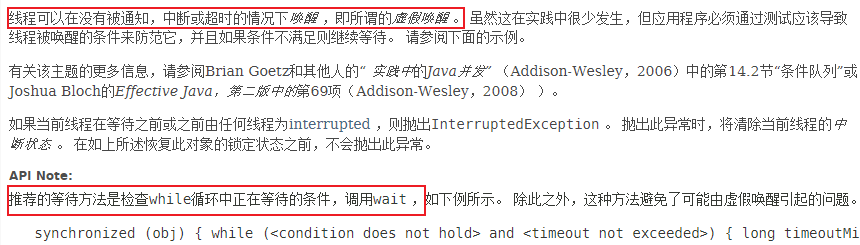

### 3.3 Lock 的方法实现线程通信

使用 Lock 实现上述代码：

```java
public class ThreadCommunication {
    public static void main(String[] args) {
        Share share = new Share();
        new Thread(()->{
            for (int i = 0; i < 10; i++) {
                try {
                    share.incr();
                } catch (InterruptedException e) {
                    e.printStackTrace();
                }
            }
        }, "aa").start();
        new Thread(()->{
            for (int i = 0; i < 10; i++) {
                try {
                    share.decr();
                } catch (InterruptedException e) {
                    e.printStackTrace();
                }
            }
        }, "bb").start();
        new Thread(()->{
            for (int i = 0; i < 10; i++) {
                try {
                    share.incr();
                } catch (InterruptedException e) {
                    e.printStackTrace();
                }
            }
        }, "cc").start();
        new Thread(()->{
            for (int i = 0; i < 10; i++) {
                try {
                    share.decr();
                } catch (InterruptedException e) {
                    e.printStackTrace();
                }
            }
        }, "dd").start();
    }
}
class Share{
    private int number = 0;
    private final Lock lock = new ReentrantLock();
    private final Condition condition = lock.newCondition();
    public void incr() throws InterruptedException {
        lock.lock();
        try {
            while (this.number != 0){
                condition.await();//线程等待获取jvm资源
            }
            number++;
            System.out.println(Thread.currentThread().getName() + "：" + number);
            condition.signalAll();//通知其他线程
        } finally {
            lock.unlock();
        }
    }
    public void decr() throws InterruptedException {
        lock.lock();
        try {
            while (this.number ==0 ){
                condition.await();//线程等待获取jvm资源
            }
            number--;
            System.out.println(Thread.currentThread().getName() + "：" + number);
            condition.signalAll();//通知其他线程
        } finally {
            lock.unlock();
        }
    }
}
```

注意：await()方法仍有虚假唤醒问题，所以要将 if 判断替换为 while()
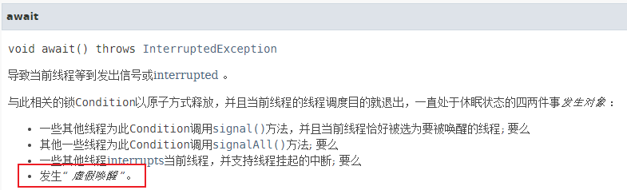

### 3.4 线程间定制化通信

既实现线程的执行顺序控制，又实现每次线程的执行次序控制。

案例：A 线程打印 5 次 A，B 线程打印 10 次 B，C 线程打印 15 次 C，按照此顺序循环 10 轮。

思路：给每个线程定制一个标志位，执行次数到了修改标志位，通知下一个线程。

```java
public class CustomizedCommunication {
    public static void main(String[] args) {
        ShareResource shareResource = new ShareResource();
        new Thread(() ->{
            for (int i = 0; i < 10; i++) {
                try {
                    shareResource.print5(i);
                } catch (InterruptedException e) {
                    e.printStackTrace();
                }
            }
        }, "AA").start();
        new Thread(() ->{
            for (int i = 0; i < 10; i++) {
                try {
                    shareResource.print10(i);
                } catch (InterruptedException e) {
                    e.printStackTrace();
                }
            }
        }, "BB").start();
        new Thread(() ->{
            for (int i = 0; i < 10; i++) {
                try {
                    shareResource.print15(i);
                } catch (InterruptedException e) {
                    e.printStackTrace();
                }
            }
        }, "CC").start();
    }
}
class ShareResource {
    private int flag = 1;
    private final Lock lock = new ReentrantLock();
    private Condition c1 = lock.newCondition();
    private Condition c2 = lock.newCondition();
    private Condition c3 = lock.newCondition();
    public void print5(int loop) throws InterruptedException {
        lock.lock();
        try {
            while (flag != 1){
                c1.await();
            }
            for (int i = 0; i < 5; i++) {
                System.out.println(Thread.currentThread().getName() + "：：" + i + "轮数：" + loop);
            }
            flag = 2;
            c2.signalAll();//通知指定线程
        }finally {
            lock.unlock();
        }
    }
    public void print10(int loop) throws InterruptedException {
        lock.lock();
        try {
            while (flag != 2){
                c2.await();
            }
            for (int i = 0; i < 10; i++) {
                System.out.println(Thread.currentThread().getName() + "：：" + i + "轮数：" + loop);
            }
            flag = 3;
            c3.signalAll();//通知指定线程
        }finally {
            lock.unlock();
        }
    }
    public void print15(int loop) throws InterruptedException {
        lock.lock();
        try {
            while (flag != 3){
                c3.await();
            }
            for (int i = 0; i < 15; i++) {
                System.out.println(Thread.currentThread().getName() + "：：" + i + "轮数：" + loop);
            }
            flag = 1;
            c1.signalAll();//通知指定线程
        }finally {
            lock.unlock();
        }
    }
}
```

## 4. 集合的线程不安全

### 4.1 List 的线程不安全

#### 4.1.1 ArryaList 线程不安全演示

并发修改异常：从集合中取数据的同时在存数据，出现 java.util.ConcurrentModificationException。原因是 ArrayList 的 add()方法没有 synchronized 修饰。

```java
public class ListDanger {
    public static void main(String[] args) {
        List<String> list = new ArrayList<>();
        for (int i = 0; i < 10; i++) {
            new Thread(() -> {
                list.add(UUID.randomUUID().toString().substring(0,8));
                System.out.println(list);
            },String.valueOf(i)).start();
        }
    }
}
```

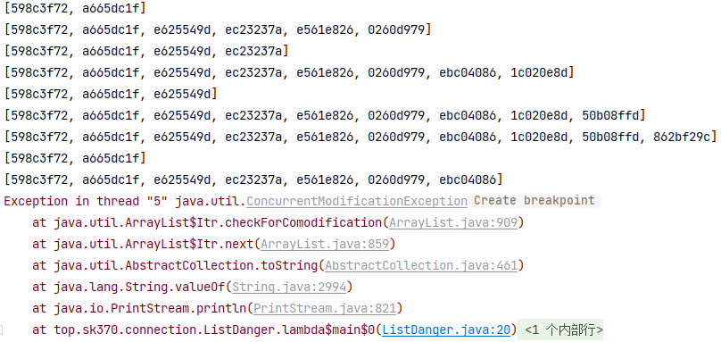

#### 4.1.2 解决方案

1. 使用 Vector 代替 ArrayList：Vector 的 add()方法使用了 synchronized 修饰。
2. 使用 Collections 工具类的 synchronizedList()方法：`List<String> list = Collections.synchronizedList(new ArrayList<>());`
3. 使用 CopyOnWriteArrayList：CopyOnWriteArrayList 是 java.util.concurrent 包下的类，实际开发中使用这种方案。

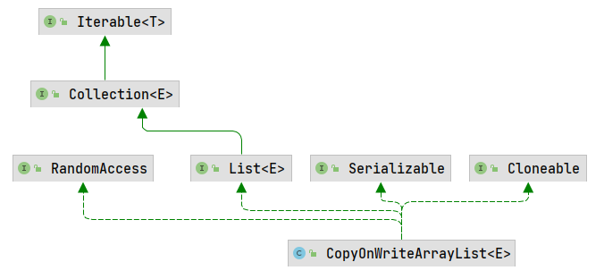
原理：写时复制技术。每次写入数据时，先创建原对象的拷贝，在拷贝的对象中进行数据写入，写入结束再将拷贝对象和原对象进行合并，如果要读取则读取合并产生的新对象。这样做的优势是可以兼顾并发读操作与独立写操作。

源码：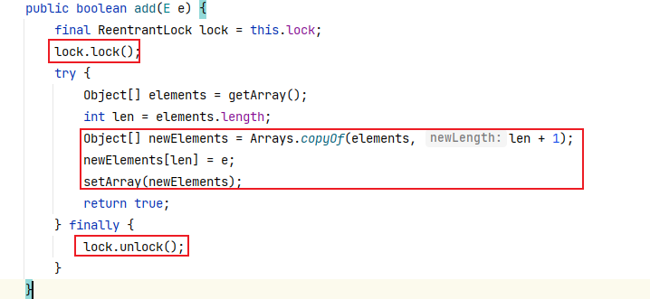

使用场景：List 大小保持很小，只读操作远多于可变操作。

### 4.2 Set 的线程不安全

#### 4.2.1 HashSet 的线程不安全演示

不安全原因：add()方法没有 synchronized 修饰。

```java
public class SetDanger {
    public static void main(String[] args) {
        Set<String> set = new HashSet<>();//线程不安全
        for (int i = 0; i < 10; i++) {
            new Thread(() -> {
                set.add(UUID.randomUUID().toString().substring(0,8));
                System.out.println(set);
            },String.valueOf(i)).start();
        }
    }
}
```

#### 4.2.2 解决方案

使用 CopyOnWriteArraySet：CopyOnWriteArraySet 是 java.util.concurrent 包下的类，实际开发中使用这种方案。
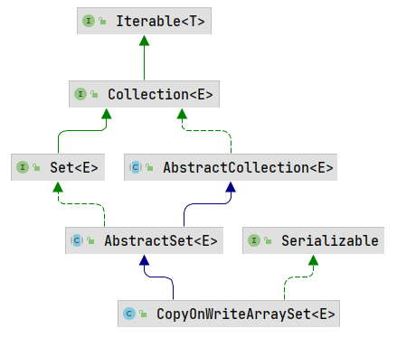
原理：写时复制技术。add()调用 addIfAbsent()方法：
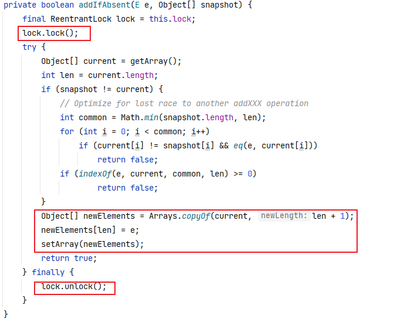

### 4.3 Map 的线程不安全

#### 4.3.1 HashMap 的线程不安全演示

HashSet 的底层就是 HashMap，put()方法没有 synchronized 修饰。

```java
public class MapDanger {
    public static void main(String[] args) {
        Map<String, String> map = new HashMap<>();//线程不安全
        for (int i = 0; i < 10; i++) {
            String key = String.valueOf(i);
            new Thread(() -> {
                map.put(key, UUID.randomUUID().toString().substring(0,8));
                System.out.println(map);
            },key).start();
        }
    }
}
```

#### 4.3.2 解决方案

使用 ConcurrentHashMap：ConcurrentHashMap 是 java.util.concurrent 包下的类，实际开发中使用这种方案。
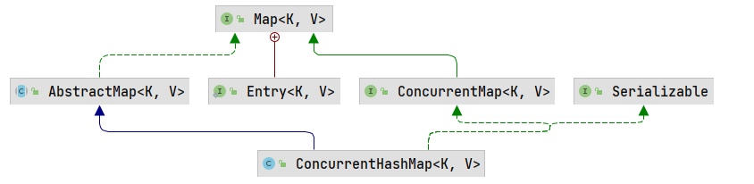
原理：put()方法调用了 putVal()方法，该方法中使用了 synchronized 修饰。
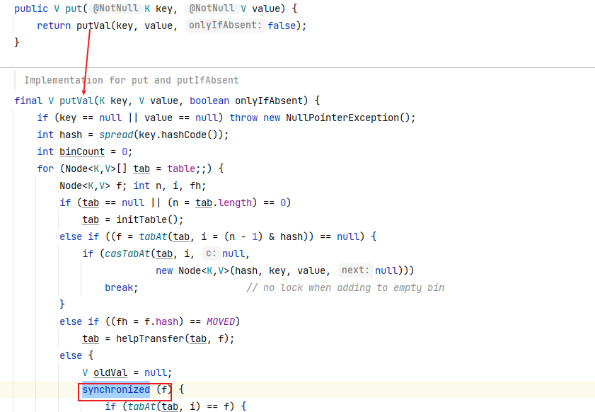

## 5. 多线程锁

### 5.1 synchronized 锁的 8 种情况

```java
class Phone {
    public static synchronized void sendSMS() throws Exception {
        TimeUnit.SECONDS.sleep(4);
        System.out.println("------sendSMS");
    }
    public synchronized void sendEmail() throws Exception {
        System.out.println("------sendEmail");
    }
    public void getHello() {
        System.out.println("------getHello");
    }
}
```

```
1 标准访问，先打印短信还是邮件
------sendSMS
------sendEmail

2 停4秒在短信方法内，先打印短信还是邮件
------sendSMS
------sendEmail

3 新增普通的hello方法，是先打短信还是hello
------getHello
------sendSMS

4 现在有两部手机，先打印短信还是邮件
------sendEmail
------sendSMS

5 两个静态同步方法，1部手机，先打印短信还是邮件
------sendSMS
------sendEmail

6 两个静态同步方法，2部手机，先打印短信还是邮件
------sendSMS
------sendEmail

7 1个静态同步方法,1个普通同步方法，1部手机，先打印短信还是邮件
------sendEmail
------sendSMS

8 1个静态同步方法,1个普通同步方法，2部手机，先打印短信还是邮件
------sendEmail
------sendSMS
```

main 线程中，多个分支线程的启动顺序不一定，为了”控制“执行顺序，可以在主线程代码中加入睡眠时间，让前面的线程先启动，后面的稍等待。


### 5.2 公平锁和非公平锁

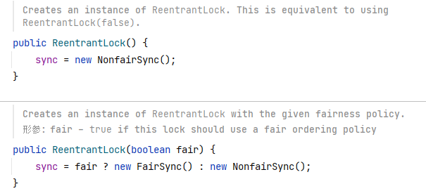
公平锁：private final ReentrantLock lock = new ReentrantLock()构造器不传参或传入 true，此时各线程抢夺资源，相对公平，单效率较低。

非公平锁：private final ReentrantLock lock = new ReentrantLock()构造器传入 false，此时第一个抢到资源的线程优先执行，且可能执行完，导致其他线程饿死，相对不公，单效率高。

### 5.3 可重入锁（递归锁）

synchronized 和 Lock 都是可重入锁。可重入锁指多层加锁的方法，只要获得了外层的锁，就可进入内层的方法（原理：实际上外层和内层都是同一把锁）。

由于 synchronized 加锁和释放锁自动完成，所以称为隐式可重入锁。

Lock 的加锁和释放锁需要手动操作，所以称为显式可重入锁。

### 5.4 死锁

死锁是指两个或两个以上的进程在执行过程中，由于竞争资源或者由于彼此通信而造成的一种阻塞的现象，若无外力作用，它们都将无法推进下去。

产生原因：

- 系统资源不足。
- 进程运行推进顺序不合适。
- 资源分配不当

```java
public class DeadLock {
    static Object a = new Object();
    static Object b = new Object();
    public static void main(String[] args) {
        new Thread(()->{
            synchronized (a){
                System.out.println(Thread.currentThread().getName() + "持有锁a，试图获取锁b");
                try {
                    Thread.sleep(1000);
                } catch (InterruptedException e) {
                    e.printStackTrace();
                }
                synchronized (b){
                    System.out.println(Thread.currentThread().getName() + "获取锁b");
                }
            }
        },"A").start();

        new Thread(()->{
            synchronized (b){
                System.out.println(Thread.currentThread().getName() + "持有锁b，试图获取锁a");
                try {
                    Thread.sleep(1000);
                } catch (InterruptedException e) {
                    e.printStackTrace();
                }
                synchronized (a){
                    System.out.println(Thread.currentThread().getName() + "获取锁a");
                }
            }
        },"B").start();
    }
}
```

上述案例中，需要加上 sleep()方法来让死锁更好的生效，不然执行太快，直接执行结束了，没有发生死锁。
验证是否是死锁：

1. jsp 命令：该工具在 jdk/bin 目录下，要么将该目录添加到环境变量，以让在各地运行，要么进入该目录，打开命令行终端执行`jps -l`
   - 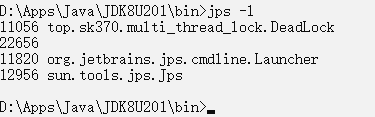
2. jstack 命令：同上，执行完`jps -l`命令后，执行如`jstack 11056`
   - 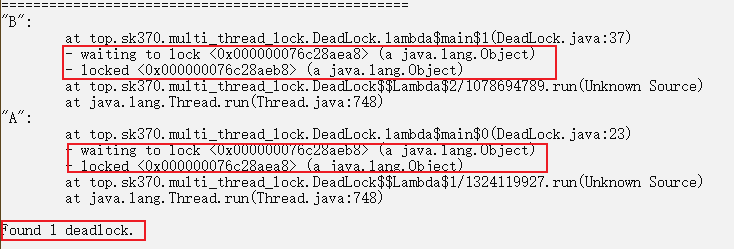

### 5.5 乐观锁和悲观锁

悲观锁：不支持并发操作，效率低。每个线程都进行加锁、释放锁操作，一次只能执行一个线程，其他等待。

乐观锁：给原始数据添加版本号，每个线程操作原始数据就修改版本号，其他线程要操作原始数据时使用版本号进行比较，看是否发生变化。

### 5.6 读写锁

#### 5.6.1 概念

特点：一个资源可以被多个读线程访问，或者被一个写线程访问，但是不能同时存在读写线程。即读写互斥，读读共享。

出现演变：多线程的场景下，① 如果没有锁，则各线程抢夺资源，线程运行较乱。② 使用了 synchronized 或 ReentrantLock 对资源加锁，由于是独占锁，每次只能有一个线程对资源进行读或者写操作，影响读读的效率。③ReentrantReadWriteLock 可以同时进行读读操作，但是读写互斥，也有可能影响一定的性能（可以对写锁进行降级，降级为读锁，参看 5.6.2）。

场景描述：共享资源有读和写的操作，且写操作没有读操作那么频繁。在没有写操作的时候，多个线程同时读一个资源没有任何问题，所以应该允许多个线程同时读取共享资源；但是如果一个线程想去写这些共享资源，就不应该允许其他线程对该资源进行读和写的操作了。

读锁：共享锁，可能发生死锁。

- 死锁情形描述：两个线程共同读取公共资源，此时持有读锁，而线程 1 要对内容进行修改，则要等到线程 2 读之后。线程 2 要修改时，相应地要等线程 1 读之后。

写锁：独占锁，可能发生死锁。

- 死锁情形描述：没明白。

线程进入读锁的前提条件：

- 没有其他线程的写锁
- 没有写请求, 或者有写请求，但调用线程和持有锁的线程是同一个(可重入锁)。

线程进入写锁的前提条件：

- 没有其他线程的读锁
- 没有其他线程的写锁

读写锁的三个重要的特性：

- 公平选择性：支持非公平（默认）和公平的锁获取方式，吞吐量还是非公平优于公平。
- 重进入：读锁和写锁都支持线程重进入。
- 锁降级：遵循获取写锁、获取读锁再释放写锁的次序，写锁能够降级成为读锁。

#### 5.6.2 ReentrantReadWriteLock

ReadWriteLock 是一个接口，内部只定义了两个方法：`Lock readLock()`和`Lock writeLock()`，一个用来获取读锁，一个用来获取写锁。也就是说将文件的读写操作分开，分成 2 个锁来分配给线程，从而使得多个线程可以同时进行读操作。

ReentrantReadWriteLock 实现了 ReadWriteLock 接口。

- 如果有一个线程已经占用了读锁，则此时其他线程如果要申请写锁，则申请写锁的线程会一直等待释放读锁。
- 如果有一个线程已经占用了写锁，则此时其他线程如果申请写锁或者读锁，则申请的线程会一直等待释放写锁。

```java
public class ReadWriteLockDemo {
    public static void main(String[] args) {
        MyCache myCache = new MyCache();
        for (int i = 0; i < 5; i++) {
            final int num = i;
            new Thread(()->{
                myCache.put(num+"",num+"");
            },String.valueOf(i)).start();
        }
        for (int i = 0; i < 5; i++) {
            final int num = i;
            new Thread(()->{
                myCache.get(num+"");
            },String.valueOf(i)).start();
        }
    }

}
class  MyCache{
    private volatile Map<String, Object> map = new HashMap<>();
    public void put(String key, Object value){
        System.out.println(Thread.currentThread().getName() + "正在进行写操作" + key);
        try {
            TimeUnit.MILLISECONDS.sleep(300);//模拟写入过程
        } catch (InterruptedException e) {
            e.printStackTrace();
        }
        map.put(key, value);
        System.out.println(Thread.currentThread().getName() + "写完了" + key);
    }
    public Object get(String key){
        Object result = null;
        System.out.println(Thread.currentThread().getName() + "正在进行读操作" + key);
        try {
            TimeUnit.MILLISECONDS.sleep(300);//模拟写入过程
        } catch (InterruptedException e) {
            e.printStackTrace();
        }
        result = map.get(key);
        System.out.println(Thread.currentThread().getName() + "读完了" + result);
        return result;
    }
}

```

没有使用读写锁的情况：读写顺序不受控制，可能读在写之前，导致得到空值。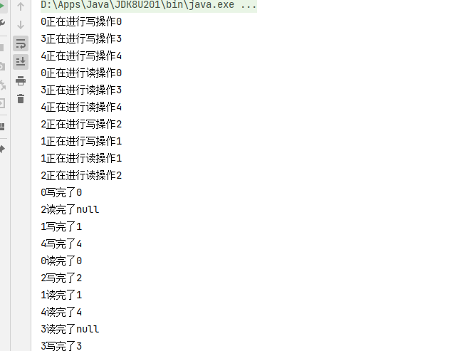

改造：

```java
public class ReadWriteLockDemo {
    public static void main(String[] args) {
        MyCache myCache = new MyCache();
        for (int i = 0; i < 5; i++) {
            final int num = i;
            new Thread(()->{
                myCache.put(num+"",num+"");
            },String.valueOf(i)).start();
        }
        for (int i = 0; i < 5; i++) {
            final int num = i;
            new Thread(()->{
                myCache.get(num+"");
            },String.valueOf(i)).start();
        }
    }

}
class  MyCache{
    private volatile Map<String, Object> map = new HashMap<>();
    private ReadWriteLock rwLock = new ReentrantReadWriteLock();
    public void put(String key, Object value){
        rwLock.writeLock().lock();//添加写锁
        try {
            System.out.println(Thread.currentThread().getName() + "正在进行写操作" + key);
            TimeUnit.MILLISECONDS.sleep(300);//模拟写入过程
            map.put(key, value);
            System.out.println(Thread.currentThread().getName() + "写完了" + key);
        } catch (InterruptedException e) {
            e.printStackTrace();
        }finally {
            rwLock.writeLock().unlock();//释放写锁
        }
    }
    public Object get(String key){
        rwLock.readLock().lock();//添加读锁
        Object result = null;
        try {
            System.out.println(Thread.currentThread().getName() + "正在进行读操作" + key);
            TimeUnit.MILLISECONDS.sleep(300);//模拟写入过程
            result = map.get(key);
            System.out.println(Thread.currentThread().getName() + "读完了" + result);
        } catch (InterruptedException e) {
            e.printStackTrace();
        }finally {
            rwLock.readLock().lock();//释放锁
        }
        return result;
    }
}
```

在线程持有读锁的情况下，该线程不能取得写锁(因为获取写锁的时候，如果发现当前的读锁被占用，就马上获取失败，不管读锁是不是被当前线程持有)。

在线程持有写锁的情况下，该线程可以继续获取读锁（获取读锁时如果发现写锁被占用，只有写锁没有被当前线程占用的情况才会获取失败）。

原因: 当线程获取读锁的时候，可能有其他线程同时也在持有读锁，因此不能把获取读锁的线程“升级” 为写锁；而对于获得写锁的线程，它一定独占了读写锁，因此可以继续让它获取读锁，当它同时获取了写锁和读锁后，还可以先释放写锁继续持有读锁，这样一个写锁就“降级” 为了读锁。

volatile 关键字在一个多线程应用中，出于计算性能的考虑，每个线程默认是从主内存将该变量拷贝到线程所在 CPU 的缓存中，然后进行读写操作的。现在电脑基本都是多核 CPU，不同的线程可能运行的不同的核上，而每个核都会有自己的缓存空间。

这里存在一个问题，JVM 既不会保证什么时候把 CPU 缓存里的数据写到主内存，也不会保证什么时候从主内存读数据到 CPU 缓存。也就是说，不同 CPU 上的线程，对同一个变量可能读取到的值是不一致的，这也就是通常说的：线程间的不可见问题。

volatile 关键字解决了线程间不可见性，通过 volatile 修饰的变量，都会变得线程间可见。即被 volatile 关键字修饰的变量会直接存储到主内存中。

#### 5.6.2 写锁降级

实现过程：获取写锁、获取读锁、释放写锁、释放读锁，写锁能够降级成为读锁。但是读锁不能升级为写锁。

降级演示：

```java
public class WriteLockDown {
    public static void main(String[] args) {
        ReentrantReadWriteLock rwLock = new ReentrantReadWriteLock();//可重入读写锁
        ReentrantReadWriteLock.ReadLock readLock = rwLock.readLock();//读锁
        ReentrantReadWriteLock.WriteLock writeLock = rwLock.writeLock();//写锁
        writeLock.lock();//获取写锁
        System.out.println(1);
        readLock.lock();//获取读锁
        System.out.println(2);
        writeLock.unlock();//释放写锁
        readLock.unlock();//释放读锁
    }
}

```

上述案例中，释放写锁之前，进行了读操作，可以看到可以正常输出 2，证明写锁没有影响到读锁（降级为了读锁，读读共享），没有出现读写互斥的情况，提升了效率和性能。

读锁升级写锁演示;

```java
public class WriteLockDown {
    public static void main(String[] args) {
        ReentrantReadWriteLock rwLock = new ReentrantReadWriteLock();//可重入读写锁
        ReentrantReadWriteLock.ReadLock readLock = rwLock.readLock();//读锁
        ReentrantReadWriteLock.WriteLock writeLock = rwLock.writeLock();//写锁
        readLock.lock();//获取读锁
        System.out.println(2);
        writeLock.lock();//获取写锁
        System.out.println(1);
        writeLock.unlock();//释放写锁
        readLock.unlock();//释放读锁
    }
}

```

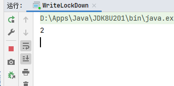
可以看到先加了读锁之后，程序不能继续进行，由于读写互斥，而读锁不能升级为写锁。

## 6. Callable 接口

### 6.1 Callable 和 Runalbe 接口比较

Runnable 缺少的一项功能是，当线程终止时（即 run()完成时），无法使线程返回结果。为了支持此功能，Java 5 中提供了 Callable 接口。
总结来说，二者有以下三点不同：

1. Callable 的执行方法有返回值，Runnable 没有
2. Callable 的执行方法可以抛出异常，Runnable 不可以
3. Callable 的执行方法叫 call()，Runnable 的执行方法叫 run()

```java
class MyThread1 implements Runnable{
    @Override
    public void run() {    }
}
class MyThread2 implements Callable{
    @Override
    public Object call() throws Exception {
        return null;
    }
}
```

### 6.2 使用 Callable 创建线程

#### 6.2.1 创建方式

要想使用 new Thread(Runnable, String)的方式创建 Callable 的线程，则需要找到 Callable 和 Runable 产生交集的部分。
FutureTask 是 Runnable 接口的实现类，而其构造方法 FutureTask(Callable<V> callable)可以使用 Callable，此时相当于创建了 Runable 接口的实现类对象，这样就可以使用 new Thread(runnable, string)了。
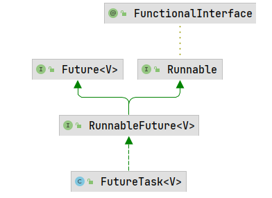

```java
public class CompareInterface {
    public static void main(String[] args) throws ExecutionException, InterruptedException {
        FutureTask<Integer> futureTask = new FutureTask<>(()->{
            return 200;
        });
        new Thread(futureTask, "lucy").start();
        System.out.println(futureTask.get());
    }
}
```

#### 6.2.2 FurtureTask 原理

在主线程中需要执行比较耗时的操作时，但又不想阻塞主线程时，可以把这些作业交给 Future 对象在后台完成。

- 当主线程将来需要时，就可以通过 Future 对象获得后台作业的计算结果或者执行状态。
- 一般 FutureTask 多用于耗时的计算，主线程可以在完成自己的任务后，再去获取结果。
- 仅在计算完成时才能检索结果；如果计算尚未完成，则阻塞 get 方法一旦计算完成，就不能再重新开始或取消计算。
- get 方法而获取结果只有在计算完成时获取，否则会一直阻塞直到任务转入完成状态，然后会返回结果或者抛出异常。
- get 只计算一次，因此 get 方法放到最后。

#### 6.2.3 FutureTask 优缺点

优点：使用 Future 配合线程池创建多线程异步任务，能够提升程序运行效率。

```java
public static void main(String[] args) throws ExecutionException, InterruptedException
{
    //3个任务，目前开启多个异步任务线程来处理，请问耗时多少？
    ExecutorService threadPool = Executors.newFixedThreadPool(3);
    long startTime = System.currentTimeMillis();
    FutureTask<String> futureTask1 = new FutureTask<String>(() -> {
        try { TimeUnit.MILLISECONDS.sleep(500); } catch (InterruptedException e) { e.printStackTrace(); }
        return "task1 over";
    });
    threadPool.submit(futureTask1);
    FutureTask<String> futureTask2 = new FutureTask<String>(() -> {
        try { TimeUnit.MILLISECONDS.sleep(300); } catch (InterruptedException e) { e.printStackTrace(); }
        return "task2 over";
    });
    threadPool.submit(futureTask2);
    System.out.println(futureTask1.get());
    System.out.println(futureTask2.get());
    try { TimeUnit.MILLISECONDS.sleep(300); } catch (InterruptedException e) { e.printStackTrace(); }
    long endTime = System.currentTimeMillis();
    System.out.println("----costTime: "+(endTime - startTime) +" 毫秒");
    System.out.println(Thread.currentThread().getName()+"\t -----end");
    threadPool.shutdown();
}
```

缺点：Future 对于结果获取不是很友好，只能通过使用阻塞或轮询地方式得到任务地结果。

- get()方法会发生阻塞。由于 get()方法只能等线程运行完才能获得结果，当线程运行时间较长 get()一直得不到结果，会导致后面的程序造成等待。
  - 所以一般将 get()放在程序的后面。
  - 避免程序阻塞可使用`get(long timeout, TimeUnit unit)`方法，让在等待的时间内得不到结果时抛出异常，然后捕获异常再做其他处理。
  - 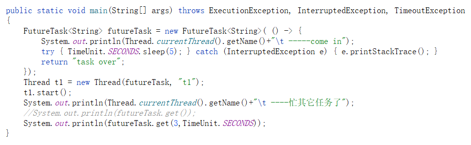
- isDone()轮询消耗 CPU 资源：使用 isDone()方法可以判断任务是否完成，完成了再调用 get()方法，但由于不停的进行 isDone()判断，不停地进入 while 循环，导致 CPU 一直要执行此代码，消耗资源。
  - 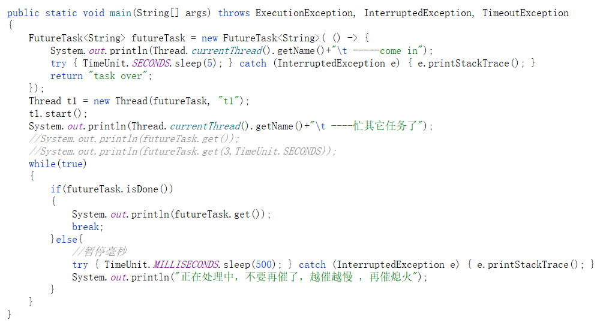

### 6.3 使用 FutureTask 使 Runnable 有返回值

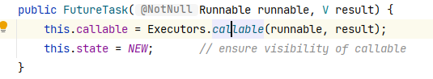

## 7. JUC 同步器

### 7.1 CountDownLatch（计数器）

CountDownLatch 类可以设置一个计数器，然后通过 countDown 方法来进行减 1 的操作，使用 await 方法等待计数器不大于 0，然后继续执行 await 方法之后的语句。

- CountDownLatch 主要有两个方法，当一个或多个线程调用 await 方法时，这些线程会阻塞。
- 其它线程调用 countDown 方法会将计数器减 1(调用 countDown 方法的线程不会阻塞)
- 当计数器的值变为 0 时，因 await 方法阻塞的线程会被唤醒，继续执行

```java
public class CountDownLatchDemo {
    public static void main(String[] args) {
        for (int i = 0; i < 6; i++) {
            new Thread(()->{
                System.out.println(Thread.currentThread().getName() + "号同学离开了教师");
            },String.valueOf(i)).start();
        }
        System.out.println("都走光了，锁门！");
    }
}
```

上述代码的执行异常：
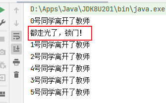
使用 CountDownLatch 进行改造：

```java
public class CountDownLatchDemo {
    public static void main(String[] args) {
        CountDownLatch countDownLatch = new CountDownLatch(6);//创建对象并设置初始值
        for (int i = 0; i < 6; i++) {
            new Thread(()->{
                System.out.println(Thread.currentThread().getName() + "号同学离开了教师");
                countDownLatch.countDown();//每次让计数器减一
            },String.valueOf(i)).start();
        }
        try {
            countDownLatch.await();//等待
        } catch (InterruptedException e) {
            e.printStackTrace();
        }
        System.out.println("都走光了，锁门！");
    }
}
```

### 7.2 CyclicBarrier（循环栅栏）

CyclicBarrier 英文是循环阻塞的意思，在使用中 CyclicBarrier 的构造方法第一个参数是目标障碍数，每次执行 CyclicBarrier 一次障碍数会加一，如果达到了目标障碍数，才会执行 cyclicBarrier.await()之后的语句。可以将 CyclicBarrier 理解为加 1 操作。

```java
public class CyclicBarrierDemo {
    private static final int NUMBER = 7;
    public static void main(String[] args) {
        CyclicBarrier cyclicBarrier = new CyclicBarrier(NUMBER, ()->{
            System.out.println("集齐七颗许愿");
        });
        for (int i = 0; i < 8; i++) {
            new Thread(()->{
                System.out.println(Thread.currentThread().getName() + "星龙珠收集到了");
                try {
                    cyclicBarrier.await();//等待
                } catch (InterruptedException | BrokenBarrierException e) {
                    e.printStackTrace();
                }
            },String.valueOf(i)).start();
        }
    }
}
```

上述案例中，当 i 最大数为 7 时，正好输出 7 次，程序正常结束。小于 7，输出不够，无法许愿（没有输出），程序没有正常停止。大于 7，输出已经多了，可以许愿，但是程序也没正常停止。

### 7.3 Semaphore（信号灯）

Semaphore 的构造方法中传入的第一个参数是最大信号量（可以看成最大线程池），每个信号量初始化为一个最多只能分发一个许可证。使用 acquire 方法获得许可证（消耗完阻塞，看作调用一次许可证-1），release 方法释放许可（看作调用一次许可证+1）。

```java
public class SemaphoreDemo {
    public static void main(String[] args) {
        Semaphore semaphore = new Semaphore(3);
        for (int i = 0; i < 6; i++) {
            new Thread(()->{
                try {
                    semaphore.acquire();//抢占
                    System.out.println(Thread.currentThread().getName() + "抢到了车位");
                    TimeUnit.SECONDS.sleep(new Random().nextInt(5));//设置停车时间，模拟线程占用
                    System.out.println(Thread.currentThread().getName() + "离开了车位");
                } catch (InterruptedException e) {
                    e.printStackTrace();
                }finally {
                    semaphore.release();//释放车位
                }
            },String.valueOf(i)).start();
        }

    }
}
```

## 8. 阻塞队列（Blocking Queue）

### 8.1 概述

阻塞队列，顾名思义，首先它是一个队列，通过一个共享的队列，可以使得数据由队列的一端输入，从另外一端输出。

- 当队列是空的，从队列中获取元素的操作将会被阻塞。
- 当队列是满的，从队列中添加元素的操作将会被阻塞。
- 试图从空的队列中获取元素的线程将会被阻塞，直到其他线程往空的队列插入新的元素。
- 试图向已满的队列中添加新元素的线程将会被阻塞，直到其他线程从队列中移除一个或多个元素或者完全清空，使队列变得空闲起来并后续新增。

分类：

- 先进先出（FIFO）：先插入的队列的元素也最先出队列，类似于排队的功能。从某种程度上来说这种队列也体现了一种公平性。
- 后进先出（LIFO）：后插入队列的元素最先出队列，这种队列优先处理最近发生的事件(栈) 。

在多线程领域：所谓阻塞，在某些情况下会挂起线程（即阻塞），一旦条件满足，被挂起的线程又会自动被唤起。

### 8.2 Blocking Queue

BlockingQueue 是 Concurrent 包中的接口，用于解决多线程高效安全“传输” 数据的问题。
生产者、消费者模型中：

- 当队列中没有数据的情况下，消费者端的所有线程都会被自动阻塞（挂起），直到有数据放入队列。
- 当队列中填满数据的情况下，生产者端的所有线程都会被自动阻塞（挂起），直到队列中有空的位置，线程被自动唤醒。

实现类：
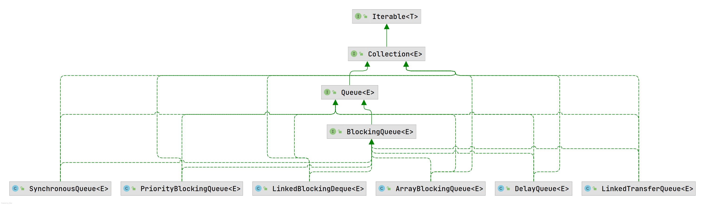
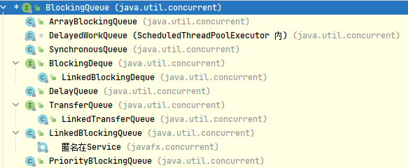
核心方法：
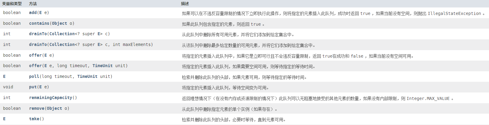
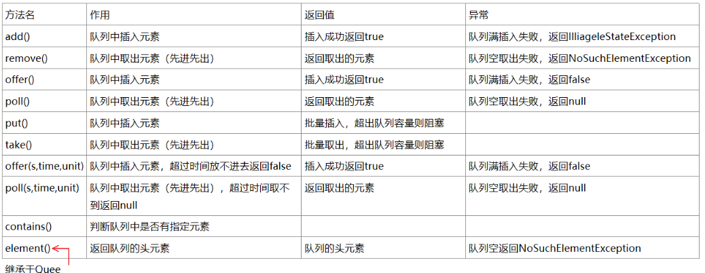

### 8.3 常见 Blocking Queue

#### 8.3.1 ArrayBlockingQueue

> - 由数组结构组成的有界阻塞队列

基于数组的阻塞队列实现，在 ArrayBlockingQueue 内部，维护了一个定长数组，以便缓存队列中的数据对象，这是一个常用的阻塞队列，除了一个定长数组外，ArrayBlockingQueue 内部还保存着两个整形变量，分别标识着队列的头部和尾部在数组中的位置。

ArrayBlockingQueue 在生产者放入数据和消费者获取数据，都是共用同一个锁对象，由此也意味着两者无法真正并行运行，这点尤其不同于 LinkedBlockingQueue；按照实现原理来分析， ArrayBlockingQueue 完全可以采用分离锁，从而实现生产者和消费者操作的完全并行运行。 Doug Lea 之所以没这样去做，也许是因为 ArrayBlockingQueue 的数据写入和获取操作已经足够轻巧，以至于引入独立的锁机制，除了给代码带来额外的复杂性外，其在性能上完全占不到任何便宜。

ArrayBlockingQueue 和 LinkedBlockingQueue 间还有一个明显的不同之处在于，前者在插入或删除元素时不会产生或销毁任何额外的对象实例，而后者则会生成一个额外的 Node 对象。这在长时间内需要高效并发地处理大批量数据的系统中，其对于 GC 的影响还是存在一定的区别。而在创建 ArrayBlockingQueue 时，我们还可以控制对象的内部锁是否采用公平锁，默认采用非公平锁。

#### 8.3.2 LinkedBlockingQueue

> - 由链表结构组成的有界（但大小默认值为 Integer.MAX_VALUE）阻塞队列

基于链表的阻塞队列，同 ArrayListBlockingQueue 类似，其内部也维持着一个数据缓冲队列（该队列由一个链表构成），当生产者往队列中放入一个数据时，队列会从生产者手中获取数据，并缓存在队列内部，而生产者立即返回；只有当队列缓冲区达到最大值缓存容量时（LinkedBlockingQueue 可以通过构造函数指定该值），才会阻塞生产者队列，直到消费者从队列中消费掉一份数据，生产者线程会被唤醒，反之对于消费者这端的处理也基于同样的原理。

而 LinkedBlockingQueue 之所以能够高效的处理并发数据，还因为其对于生产者端和消费者端分别采用了独立的锁来控制数据同步，这也意味着在高并发的情况下生产者和消费者可以并行地操作队列中的数据，以此来提高整个队列的并发性能。

#### 8.3.3 DelayQueue

> - 使用优先级队列实现的延迟无界阻塞队列。

DelayQueue 中的元素只有当其指定的延迟时间到了，才能够从队列中获取到该元素。 DelayQueue 是一个没有大小限制的队列，因此往队列中插入数据的操作（生产者）永远不会被阻塞，而只有获取数据的操作（消费者）才会被阻塞。

#### 8.3.4 PriorityBlockingQueue

> - 支持优先级排序的无界阻塞队列。

基于优先级的阻塞队列（优先级的判断通过构造函数传入的 Compator 对象来决定），但需要注意的是 PriorityBlockingQueue 并不会阻塞数据生产者，而只会在没有可消费的数据时，阻塞数据的消费者。

因此使用的时候要特别注意， 生产者生产数据的速度绝对不能快于消费者消费数据的速度，否则时间一长，会最终耗尽所有的可用堆内存空间。

在实现 PriorityBlockingQueue 时，内部控制线程同步的锁采用的是公平锁。

#### 8.3.5 SynchronousQueue

> - 不存储元素的阻塞队列，也即单个元素的队列。

一种无缓冲的等待队列，类似于无中介的直接交易，有点像原始社会中的生产者和消费者，生产者拿着产品去集市销售给产品的最终消费者，而消费者必须亲自去集市找到所要商品的直接生产者，如果一方没有找到合适的目标，那么对不起，大家都在集市等待。

相对于有缓冲的 BlockingQueue 来说，少了一个中间经销商的环节（缓冲区），如果有经销商，生产者直接把产品批发给经销商，而无需在意经销商最终会将这些产品卖给那些消费者，由于经销商可以库存一部分商品，因此相对于直接交易模式，总体来说采用中间经销商的模式会吞吐量高一些（可以批量买卖）；但另一方面，又因为经销商的引入，使得产品从生产者到消费者中间增加了额外的交易环节，单个产品的及时响应性能可能会降低。

声明一个 SynchronousQueue 有两种不同的方式，公平模式和非公平模式：

- 公平模式：SynchronousQueue 会采用公平锁，并配合一个 FIFO 队列来阻塞
  多余的生产者和消费者，从而体系整体的公平策略。
- 非公平模式（SynchronousQueue 默认）：SynchronousQueue 采用非公平锁，同时配合一个 LIFO 队列来管理多余的生产者和消费者，而后一种模式，如果生产者和消费者的处理速度有差距，则很容易出现饥渴的情况，即可能有某些生产者或者是消费者的数据永远都得不到处理。

#### 8.3.6 LinkedTransferQueue

> - 由链表组成的无界阻塞队列。

LinkedTransferQueue 是一个由链表结构组成的无界阻塞 TransferQueue 队列。相对于其他阻塞队列，LinkedTransferQueue 多了 tryTransfer 和 transfer 方法。

LinkedTransferQueue 采用一种预占模式。意思就是消费者线程取元素时，如果队列不为空，则直接取走数据，若队列为空，那就生成一个节点（节点元素为 null）入队，然后消费者线程被等待在这个节点上，后面生产者线程入队时发现有一个元素为 null 的节点，生产者线程就不入队了，直接就将元素填充到 该节点，并唤醒该节点等待的线程，被唤醒的消费者线程取走元素，从调用的方法返回。

#### 8.3.7 LinkedBlockingDeque

> - 由链表组成的双向阻塞队列

LinkedBlockingDeque 是一个由链表结构组成的双向阻塞队列， 即可以从队列的两端插入和移除元素。

对于一些指定的操作，在插入或者获取队列元素时如果队列状态不允许该操作可能会阻塞住该线程直到队列状态变更为允许操作，这里的阻塞一般有两种情况：

- 插入元素时: 如果当前队列已满将会进入阻塞状态，一直等到队列有空的位置时再将该元素插入，该操作可以通过设置超时参数，超时后返回 false 表示操作失败，也可以不设置超时参数一直阻塞，中断后抛出 InterruptedException 异常。
- 读取元素时: 如果当前队列为空会阻塞住直到队列不为空然后返回元素，同样可以通过设置超时参数 。

## 9. 线程池

### 9.1 概述

线程池（thread pool）：一种线程使用模式。线程过多会带来调度开销，进而影响缓存局部性和整体性能。而线程池维护着多个线程，等待着监督管理者分配可并发执行的任务。这避免了在处理短时间任务时创建与销毁线程的代价。线程池不仅能够保证内核的充分利用，还能防止过分调度。

优势：线程池做的工作只要是控制运行的线程数量，处理过程中将任务放入队列，然后在线程创建后启动这些任务，如果线程数量超过了最大数量，超出数量的线程排队等候，等其他线程执行完毕，再从队列中取出任务来执行。

它的主要特点为：

- 降低资源消耗: 通过重复利用已创建的线程降低线程创建和销毁造成的销耗。
- 提高响应速度: 当任务到达时，任务可以不需要等待线程创建就能立即执行。
- 提高线程的可管理性: 线程是稀缺资源，如果无限制的创建，不仅会销耗系统资源，还会降低系统的稳定性，使用线程池可以进行统一的分配，调优和监控，并提高系统稳定性。

Java 中的线程池是通过 Executor 框架实现的，该框架中用到了 Executor， Executors（工具类），ExecutorService，ThreadPoolExecutor 这几个类 。
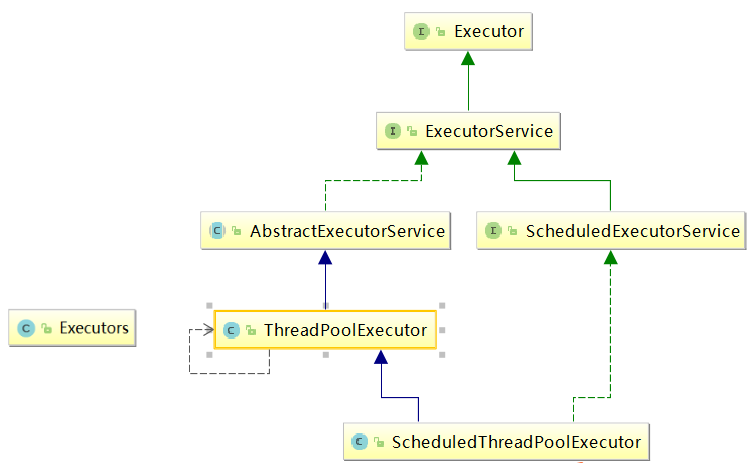
常用方法来自于 ExecutorService 接口：
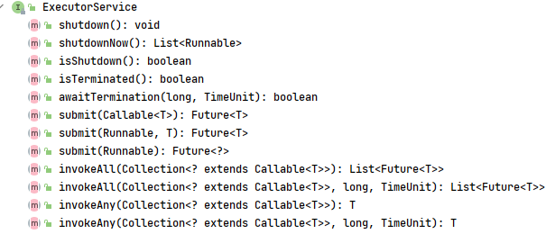

### 9.2 创建方式

#### 9.2.1 Executors.newCachedThreadPool

作用：创建一个可缓存线程池，如果线程池长度超过处理需要，可灵活回收空闲线程，若无可回收，则新建线程。（一池可扩容线程）
特点：

- core 线程数为 0
- 线程池中数量没有固定，可达到最大值（Interger. MAX_VALUE）
- 线程池中的线程可进行缓存重复利用和回收（回收默认时间为 1 分钟）
- 当线程池中，没有可用线程，会重新创建一个线程。

场景: 适用于创建一个可无限扩大的线程池，服务器负载压力较轻，执行时间较短，任务多的场景。

#### 9.2.2 Executors.newFixedThreadPool

作用：创建一个可重用固定线程数的线程池，以共享的无界队列方式来运行这些线程。在任意点，在大多数线程会处于处理任务的活动状态。如果在所有线程处于活动状态时提交附加任务，则在有可用线程之前，附加任务将在队列中等待。如果在关闭前的执行期间由于失败而导致任何线程终止，那么一个新线程将代替它执行后续的任务（如果需要）。在某个线程被显式地关闭之前，池中的线程将一直存在。 （一池 N 线程）

特征：

- 线程池中的线程处于一定的量，可以很好的控制线程的并发量
- 线程可以重复被使用，在显示关闭之前，都将一直存在
- 超出一定量的线程被提交时候需在队列中等待

场景: 适用于可以预测线程数量的业务中，或者服务器负载较重，对线程数有严格限制的场景。

#### 9.2.3 Executors.newSingleThreadExecutor

作用：创建一个使用单个 worker 线程的 Executor，以无界队列方式来运行该线程。（注意，如果因为在关闭前的执行期间出现失败而终止了此单个线程，那么如果需要，一个新线程将代替它执行后续的任务）。可保证顺序地执行各个任务，并且在任意给定的时间不会有多个线程是活动的。与其他等效的 newFixedThreadPool 不同，可保证无需重新配置此方法所返回的执行程序即可使用其他的线程。（一池一线程）

特征：线程池中最多执行 1 个线程，之后提交的线程活动将会排在队列中以此执行。

场景: 适用于需要保证顺序执行各个任务，并且在任意时间点，不会同时有多个线程的场景。

#### 9.2.4 Executors.newScheduleThreadPool

作用: 线程池支持定时以及周期性执行任务，创建一个 corePoolSize 为传入参数，最大线程数为整形的最大数的线程池。（定时线程）

特征：

- 线程池中具有指定数量的线程，即便是空线程也将保留。
- 可定时或者延迟执行线程活动。

场景: 适用于需要多个后台线程执行周期任务的场景。

#### 9.2.5 Executors.newWorkStealingPool

jdk1.8 提供的线程池，底层使用的是 ForkJoinPool 实现，创建一个拥有多个任务队列的线程池，可以减少连接数，创建当前可用 cpu 核数的线程来并行执行任务。（根据 CPU 核数创建线程）

场景: 适用于大耗时，可并行执行的场景。

### 9.3 底层原理

线程池底层是创建了 ThreadPoolExecutor 对象：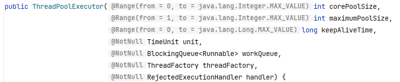

参数说明：

- corePoolSize：常驻线程数量，创建好以后就准备就绪（调用 start()）。核心线程数一直存在，除非设置 allowCoreThreadTimeOut。
- maximumPoolSize：能容纳的最大线程数。控制资源。
- keepAliveTime：空闲线程存活时间。释放的是（maximumPoolSize - corePoolSize）的线程。
- unit：存活的时间单位。
- workQueue：存放提交但未执行任务的队列。用来存储等待执行的任务， 如果当前对线程的需求超过了 corePoolSize 大小， 就会放在这里等待空闲线程执行。
- threadFactory：创建线程的工厂类。
- handler：等待队列满后的拒绝策略 。

```Java
* @param corePoolSize the number of threads to keep in the pool, even
* if they are idle, unless {@code allowCoreThreadTimeOut} is set
池中一直保持的线程的数量， 即使线程空闲。 除非设置了 allowCoreThreadTimeOut
* @param maximumPoolSize the maximum number of threads to allow in the
* pool
池中允许的最大的线程数
* @param keepAliveTime when the number of threads is greater than
* the core, this is the maximum time that excess idle threads
* will wait for new tasks before terminating.
当线程数大于核心线程数的时候， 线程在最大多长时间没有接到新任务就会终止释放，
最终线程池维持在 corePoolSize 大小
* @param unit the time unit for the {@code keepAliveTime} argument
时间单位
* @param workQueue the queue to use for holding tasks before they are
* executed. This queue will hold only the {@code Runnable}
* tasks submitted by the {@code execute} method.
阻塞队列， 用来存储等待执行的任务， 如果当前对线程的需求超过了 corePoolSize
大小， 就会放在这里等待空闲线程执行。
* @param threadFactory the factory to use when the executor
* creates a new thread
创建线程的工厂， 比如指定线程名等
* @param handler the handler to use when execution is blocked
* because the thread bounds and queue capacities are reached
拒绝策略， 如果线程满了， 线程池就会使用拒绝策略。
```

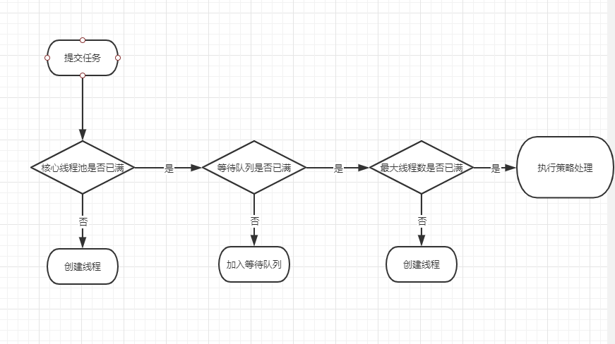

1. 在创建了线程池后，线程池中的线程数为零。
2. 当调用 execute()方法添加一个请求任务时，线程池会做出如下判断：
   - 如果正在运行的线程数量小于 corePoolSize，那么马上创建 corePoolSize 数量的线程运行这个任务。
   - 如果正在运行的线程数量大于或等于 corePoolSize，那么将这个任务放入队列。
   - 如果这个时候队列满了且正在运行的线程数量还小于 maximumPoolSize，那么还是要创建非核心线程立刻运行这个任务。队列中的继续等待。
   - 如果队列满了且正在运行的线程数量大于或等于 maximumPoolSize，那么线程池会启动饱和拒绝策略来执行。
3. 当一个线程完成任务时，它会从队列中取下一个任务来执行。
4. 当一个线程无事可做超过一定的时间（keepAliveTime）时，线程会判断：
   - 如果当前运行的线程数大于 corePoolSize，那么这个线程就被停掉。
   - 所以线程池的所有任务完成后，它最终会收缩到 corePoolSize 的大小。

#### 9.3.1 面试题

问：一个线程池 core 7； max 20 ， queue： 50， 100 并发进来怎么分配的？

答：先有 7 个能直接得到执行， 接下来 50 个进入队列排队，再多开 13 个继续执行。 现在 70 个被安排上了。 剩下 30 个默认拒绝策略。

### 9.4 拒绝策略

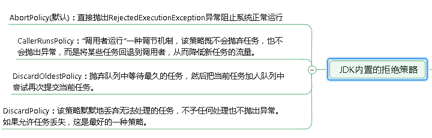

- AbortPolicy：丢弃任务，并抛出拒绝执行 RejectedExecutionException 异常信息。线程池默认的拒绝策略。必须处理好抛出的异常，否则会打断当前的执行流程，影响后续的任务执行。
- CallerRunsPolicy：当触发拒绝策略，只要线程池没有关闭的话，则使用调用线程直接运行任务。一般并发比较小，性能要求不高，不允许失败。但是，由于调用者自己运行任务，如果任务提交速度过快，可能导致程序阻塞，性能效率上必然的损失较大。
- DiscardOldestPolicy: 当触发拒绝策略，只要线程池没有关闭的话，丢弃阻塞队列 workQueue 中最老的一个任务，并将新任务加入。
- DiscardPolicy：直接丢弃，其他啥都没有。

### 9.5 自定义线程池

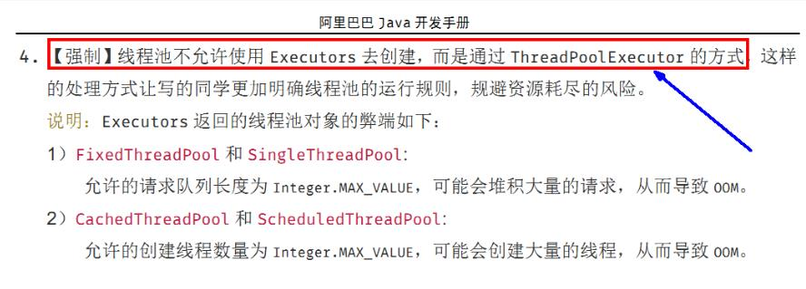
项目中创建多线程时，使用常见的三种线程池（单一、可变、定长）都有一定问题，原因是 FixedThreadPool 和 SingleThreadExecutor 底层都是用 LinkedBlockingQueue 实现的，这个队列最大长度为 Integer.MAX_VALUE，容易导致 OOM。

```java
public class MyThreadPool {
    public static void main(String[] args) {
        ThreadPoolExecutor threadPoolExecutor = new ThreadPoolExecutor(
                2,
                5,
                2L,
                TimeUnit.SECONDS,
                new ArrayBlockingQueue<>(3),
                Executors.defaultThreadFactory(), new ThreadPoolExecutor.AbortPolicy());
    }
}
```

## 10. 分支/合并（Fork/Join）框架

### 10.1 概述

#### 10.1.1 介绍

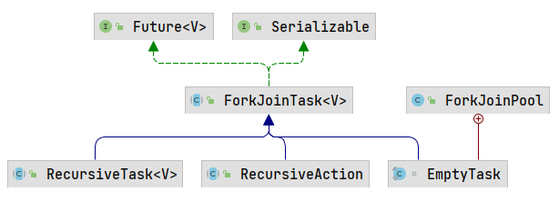
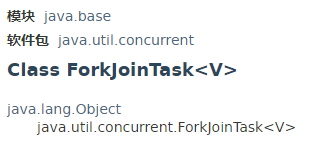
Fork/Join 可以将一个大的任务拆分成多个子任务进行并行处理，最后将子任务结果合并成最后的计算结果，并进行输出。 Fork/Join 框架要完成两件事情：

1. 任务分割：首先 Fork/Join 框架需要把大的任务分割成足够小的子任务，如果子任务比较大的话还要对子任务进行继续分割。
2. 执行任务并合并结果：分割的子任务分别放到双端队列里，然后几个启动线程分别从双端队列里获取任务执行。子任务执行完的结果都放在另外一个队列里，启动一个线程从队列里取数据，然后合并这些数据。

#### 10.1.2 创建

在 Java 的 Fork/Join 框架中，使用两个类完成上述操作：

- ForkJoinTask：创建一个 Fork/Join 任务。该类提供了在任务中执行 fork 和 join 的机制。通常情况下不需要直接继承 ForkJoinTask 类，只需要继承它的子类：
  - RecursiveAction：用于没有返回结果的任务。
  - RecursiveTask：用于有返回结果的任务。继承后可以实现递归(自己调自己)调用的任务。
- ForkJoinPool：ForkJoinTask 需要通过 ForkJoinPool 来执行。

#### 10.1.3 Fork/Join 框架的实现原理：

ForkJoinPool 由 ForkJoinTask 数组和 ForkJoinWorkerThread 数组组成，ForkJoinTask 数组负责将存放以及将程序提交给 ForkJoinPool，而 ForkJoinWorkerThread 负责执行这些任务。

#### 10.1.4 异常

ForkJoinTask 在执行的时候可能会抛出异常，但是没办法在主线程里直接捕获异常，所以 ForkJoinTask 提供了 isCompletedAbnormally()方法来检查任务是否已经抛出异常或已经被取消了，并且可以通过 ForkJoinTask 的 getException()方法获取异常。

- getException 方法返回 Throwable 对象，如果任务被取消了则返回 CancellationException。如果任务没有完成或者没有抛出异常则返回 null。

### 10.2 fork()方法

一般使用 ForkJoinPool 和 RecursiveTask 对象的 fork()实现拆分过程。

实现原理：当调用 ForkJoinTask 的 fork 方法时，程序会把任务放在 ForkJoinWorkerThread 的 workQueue 中，异步地执行这个任务，然后立即返回结果。

fork()源码：

```java
public final ForkJoinTask<V> fork() {
    Thread t;
    if ((t = Thread.currentThread()) instanceof ForkJoinWorkerThread)
        ((ForkJoinWorkerThread)t).workQueue.push(this);
    else
        ForkJoinPool.common.externalPush(this);
    return this;
}
```

push()方法把当前任务存放在 ForkJoinTask 数组队列里。然后再调用 ForkJoinPool 的 signalWork()方法唤醒或创建一个工作线程来执行任务。push()源码如下：

```java
final void push(ForkJoinTask<?> task) {
    ForkJoinTask<?>[] a; ForkJoinPool p;
    int b = base, s = top, n;
    if ((a = array) != null) {    // ignore if queue removed
        int m = a.length - 1;     // fenced write for task visibility
        U.putOrderedObject(a, ((m & s) << ASHIFT) + ABASE, task);
        U.putOrderedInt(this, QTOP, s + 1);
        if ((n = s - b) <= 1) {
            if ((p = pool) != null)
                p.signalWork(p.workQueues, this);
        }
        else if (n >= m)
            growArray();
    }
}
```

### 10.3 join()方法

join()方法的主要作用是阻塞当前线程并等待获取结果。

源码：

```java
public final V join() {
    int s;
    if ((s = doJoin() & DONE_MASK) != NORMAL)
    	reportException(s);
    return getRawResult();
}
```

join()方法首先调用 doJoin()方法，通过 doJoin()方法得到当前任务的状态来判断返回什么结果：

- 已完成（NORMAL）：直接返回任务结果,
- 被取消（CANCELLED）：抛出 CancellationException。
- 信号（SIGNAL）：
- 出现异常（EXCEPTIONAL） ：直接抛出对应的异常。

```java
private int doJoin() {
    int s; Thread t; ForkJoinWorkerThread wt; ForkJoinPool.WorkQueue w;
    return (s = status) < 0 ? s :
        ((t = Thread.currentThread()) instanceof ForkJoinWorkerThread) ?
        (w = (wt = (ForkJoinWorkerThread)t).workQueue).
        tryUnpush(this) && (s = doExec()) < 0 ? s :
        wt.pool.awaitJoin(w, this, 0L) :
        externalAwaitDone();
}
```

### 10.4 案例

```java
/**
 * 计算 1+2+3.........+1000,==每 100 个数切分一个子任务
 * 二分法拆分
 */
public class ForkJoinDemo{
    public static void main(String[] args) {
        MyTask myTask = new MyTask(0, 1000);
        ForkJoinPool forkJoinPool = new ForkJoinPool();
        ForkJoinTask<Integer> forkJoinTask = forkJoinPool.submit(myTask);
        try {
            Integer res = forkJoinTask.get();
            System.out.println(res);
        } catch (InterruptedException | ExecutionException e) {
            e.printStackTrace();
        }finally {
            forkJoinPool.shutdown();
        }

    }
}
class MyTask extends RecursiveTask<Integer> {
    private final static Integer VALUE = 10;//拆分差值不能超过10
    private int begin;
    private int end;
    private int result;
    public MyTask(int begin, int end) {
        this.begin = begin;
        this.end = end;
    }
    @Override
    protected Integer compute() {
        if(end - begin <= VALUE){
            for (int i = begin; i <= end; i++) {
                result += i;
            }
        }else {
            int middle = (begin + end)/2;
            MyTask taskExample1 = new MyTask(begin, middle);//拆分左边
            MyTask taskExample2 = new MyTask(middle + 1, end);//拆分右边
            taskExample1.fork();
            taskExample2.fork();
            result = taskExample1.join() + taskExample2.join();//合并结果
        }
        return result;
    }
}
```

## 11. CompletableFuture

### 11.1 再谈 FutureTask

Futrue 接口定义了操作异步任务的一些方法，如获取异步任务的执行结果，取消任务、判断任务是否被取消、判断任务是否执行完毕等。
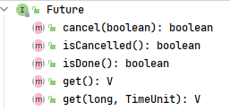
FutureTask 在 Java 里面通常用来表示一个异步任务的引用，比如将任务提交到线程池里面，就会得到一个 Futrue。FutureTask 对象的 isDone 方法判断任务是否处理结束，get 方法可以一直阻塞直到任务结束然后获取结果。但整体来说这种方式，还是同步的，因为需要客户端不断阻塞等待或者不断轮询才能知道任务是否完成。（详见[FutureTask 的优缺点](https://www.yuque.com/zhuyuqi/java/ys649d?inner=d7B5q)）

Future 的主要缺点如下：

1. 不支持手动完成：
   - 我提交了一个任务，但是执行太慢了，我通过其他路径已经获取到了任务结果，现在没法把这个任务结果通知到正在执行的线程，所以必须主动取消或者一直等待它执行完成。
2. 不支持进一步的非阻塞调用：
   - 通过 Future 的 get 方法会一直阻塞到任务完成，但是想在获取任务之后执行额外的任务，因为 Future 不支持回调函数，所以无法实现这个功能。
3. 不支持链式调用：
   - 对于 Future 的执行结果，我们想继续传到下一个 Future 处理使用，从而形成一个链式的 pipline 调用，这在 Future 中是没法实现的。
4. 不支持多个 Future 合并：
   - 比如我们有 10 个 Future 并行执行，我们想在所有的 Future 运行完毕之后，执行某些函数，是没法通过 Future 实现的。
5. 不支持异常处理：
   - Future 的 API 没有任何的异常处理的 api，所以在异步运行时，如果出了问题
     是不好定位的。

### 11.2 CompletableFuture 概述

由于 FutureTask 阻塞的方式与异步编程的设计理念违背，轮询又会消耗资源，所以 jdk8 设计了 CompletableFuture，提供了一种类似观察者模式的机制，可以让任务再执行完成后通知监听的一方。

CompletableFuture 实现了 Future、 CompletionStage 接口。实现了 Future 接口就可以兼容现在有线程池框架，而 CompletionStage 接口才是异步编程的接口抽象，里面定义多种异步方法，通过这两者集合，从而打造出了强大的 CompletableFuture 类。

CompletionStage 代表异步计算过程中的某一个阶段，一个阶段完成后就可能触发另外一个阶段。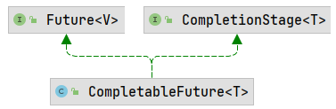
CompletableFuture 的优点：

- 异步任务结束后，会自动回调某个对象的方法。
- 主线程设置好回调后，不再关心异步任务的执行，异步任务之间可以顺序执行。
- 异步任务出错时，会自动回调某个对象的方法。

####

### 11.3 创建异步对象

CompletableFuture 提供了四个静态方法来创建一个异步操作。
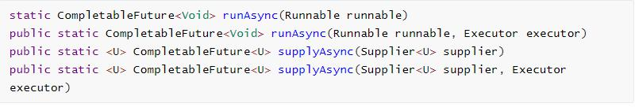

#### 11.3.1 没有返回值的异步任务

1. `runAsync(Runnable runnable)`：默认使用 ForkJoinPool.commonPool()创建的线程池

```java
/**
 * 没有返回值的异步任务
 */
public class Test02 {
    public static void main(String[] args) throws Exception{
        System.out.println("主线程开始");
        //运行一个没有返回值的异步任务
        CompletableFuture<Void> future = CompletableFuture.runAsync(() -> {
        try {
            System.out.println("子线程启动干活");
            Thread.sleep(5000);
            System.out.println("子线程完成");
        } catch (Exception e) {
            e.printStackTrace();
        }
    });
        //主线程阻塞
        future.get();
        System.out.println("主线程结束");
    }
}
```


2. `runAsync(Runnable runnable, Executor executor)`：指定线程池

#### 11.3.2 有返回值的异步任务

1. `supplyAsync(Supplier<U> supplier)`：默认使用 ForkJoinPool.commonPool()创建的线程池

```java
/**
 * 有返回值的异步任务
 */
public class Test03 {
    public static void main(String[] args) throws Exception{
        System.out.println("主线程开始");
        //运行一个有返回值的异步任务
        CompletableFuture<String> future = CompletableFuture.supplyAsync(() -> {
                    try {
                        System.out.println("子线程开始任务");
                        Thread.sleep(5000);
                    } catch (Exception e) {
                        e.printStackTrace();
                    }
                    return "子线程完成了!";
                });
        //主线程阻塞
        String s = future.get();
        System.out.println("主线程结束, 子线程的结果为:" + s);
    }
}
```

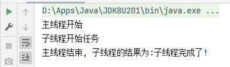

2. `supplyAsync(Supplier<U> supplier, Executor executor)`：【开发使用这个】

#### 11.3.3 异步任务对象常用方法

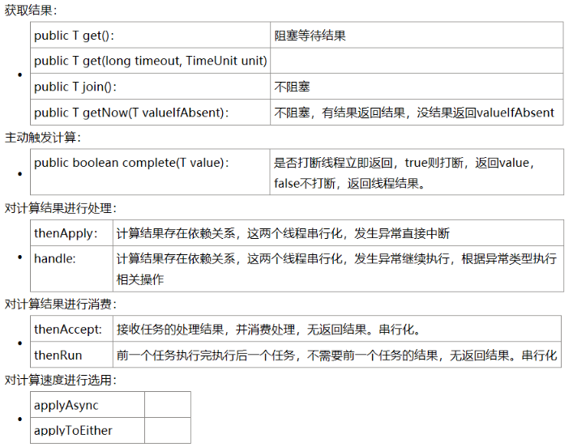

### 11.4 链式调用方法

Lambda 表达式参数编程经验：
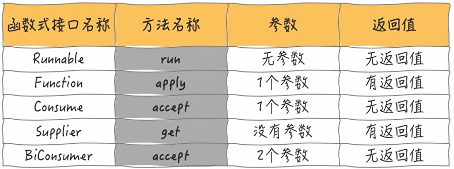

#### 11.4.1 whenComplete()和 whenCompleteAsync()

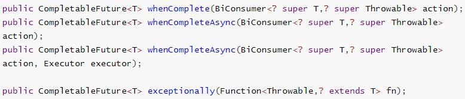
whenComplete 和 whenCompleteAsync 表示异步对象计算完成时的回调，二者的区别是：

- whenComplete： 执行当前任务的线程执行继续执行 whenComplete 的任务。
- whenCompleteAsync： 把 whenCompleteAsync 这个任务继续提交给线程池来进行执行。

方法不以 Async 结尾， 意味着 Action 使用相同的线程执行， 而 Async 可能会使用其他线程执行（如果是使用相同的线程池， 也可能会被同一个线程选中执行）

特点：正常完成返回结果，发生异常只能感知。

1. whenComplete(v,e)：结果是 v，异常是 e，发生异常时不能提供返回结果，只能感知有无异常。

```java
public class Test11 {
    public static void main(String[] args) throws Exception {
        System.out.println("主线程开始");
        CompletableFuture<String> future = CompletableFuture.supplyAsync(() -> {
            try {
                System.out.println("子线程开始任务");
                Thread.sleep(5000);
            } catch (Exception e) {
                e.printStackTrace();
            }
            return "子线程完成了!";
        }).whenComplete((v, e) -> {
            if(e==null){
                System.out.println("子线程执行完没有发生异常。");
            }
        });
        //主线程阻塞
        String s = future.get();
        System.out.println("主线程结束, 子线程的结果为:" + s);
    }
}
```

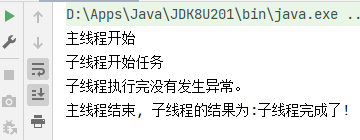

#### 11.4.2 异常处理

##### 11.4.2.1 exceptionally 异常处理

出现异常时触发。有返回结果。

特点：正常完成返回结果，发生异常返回指定结果（有异常才进入 exceptionally()方法）。


```java
/**
 * 异常处理
 */
public class Test06 {
    private static Integer num = 10;
    public static void main(String[] args) throws Exception{
        System.out.println("主线程开始");
        CompletableFuture<Integer> future = CompletableFuture.supplyAsync(() -> {
            int i= 1/0;
            System.out.println("加 10 任务开始");
            num += 10;
            return num;
        }).exceptionally(ex -> {
            System.out.println(ex.getMessage());
            return -1;
        });
        System.out.println(future.get());
    }
}
```

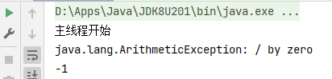

##### 11.4.2.2 handle 异常处理

handle 类似于 thenAccept/thenRun 方法，是最后一步的处理调用，但是同时可以处理异常。

特点：正常完成返回结果，发生异常返回指定结果（有无异常均进入 handle()方法）。
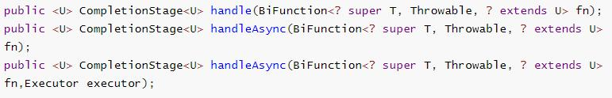

```java
/**
 * 异常处理2
 */
public class Test07 {
    private static Integer num = 10;
    public static void main(String[] args) throws Exception{
        System.out.println("主线程开始");
        CompletableFuture<Integer> future = CompletableFuture.supplyAsync(() -> {
            System.out.println("加 10 任务开始");
            num += 10;
            return num;
        }).handle((i,ex) ->{
            System.out.println("进入 handle 方法");
            if(ex != null){
                System.out.println("发生了异常,内容为:" + ex.getMessage());
                return -1;
            }else{
                System.out.println("正常完成,内容为: " + i);
                return i;
            }});
        System.out.println(future.get());
    }
}
```

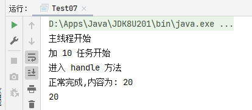

#### 11.4.3 线程串行化

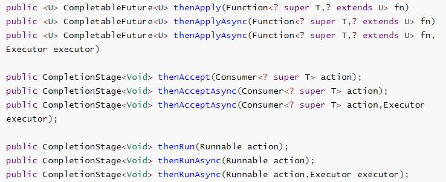

都要前置任务成功完成。

##### 11.4.3.1 线程依赖——thenApply()

当一个线程依赖另一个线程时， 获取上一个任务返回的结果， 并返回当前任务的返回值。

特点：接受前一个任务的返回结果，同时自身处理结果还要返回。

```java
/**
 * 依赖线程串行化：先对一个数加 10,然后取平方
 */
public class Test04 {
    private static Integer num = 10;
    public static void main(String[] args) throws Exception {
        System.out.println("主线程开始");
        CompletableFuture<Integer> future = CompletableFuture.supplyAsync(() -> {
                    try {
                        System.out.println("加 10 任务开始");
                        num += 10;
                    } catch (Exception e) {
                        e.printStackTrace();
                    }
                    return num;
                }).thenApply(integer -> {
                    return num * num;
                });
        Integer integer = future.get();
        System.out.println("主线程结束, 子线程的结果为:" + integer);
    }
}
```

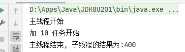

##### 11.4.3.2 消费处理结果——thenAccept

thenAccept 消费处理结果, 接收任务的处理结果，并消费处理，无返回结果。

特点：接受前一个任务的返回结果，但自身无返回结果。

```java
/**
 * 消费处理结果
 */
public class Test05 {
    private static Integer num = 10;
    public static void main(String[] args) throws Exception{
        System.out.println("主线程开始");
        CompletableFuture.supplyAsync(() -> {
            try {
                System.out.println("加 10 任务开始");
                num += 10;
            } catch (Exception e) {
                e.printStackTrace();
            }
            return num;
        }).thenApply(integer -> {
            return num * num;
        }).thenAccept(new Consumer<Integer>() {
            @Override
            public void accept(Integer integer) {
                System.out.println("子线程全部处理完成,最后调用了 accept,结果为:" + integer);
            }
        });
    }
}
```

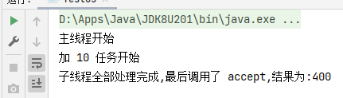

##### 11.4.3.3 thenRun

只要上面的任务执行完成， 就开始执行 thenRun——继续执行一个新线程，新线程与前一个线程共用同一个线程。thenRunAsync 表示新开的线程异步执行。

特点：不接受前一个任务的返回结果。
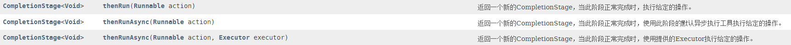

多个 thenRun 链式调用和多个 thenRunAsync 链式调用的异同：

- 相同：
  - 没有传入自定义线程池，默认都是 ForkJoinPool
- 不同：
  - 第一个任务传入了自定义线程池，则 thenRun 的后续任务都使用该线程池
  - 第一个任务传入了自定义线程池，则 thenRunAsync 只有第一个任务使用指定线程池，后续任务都是 ForkJoinPool
- 特殊：
  - 如果分支线程执行太快，根据系统优化切换原则，后续线程有可能直接使用 main 线程处理。

#### 11.4.4 结果合并

##### 11.4.5.1 两任务组合——两个任务都要完成

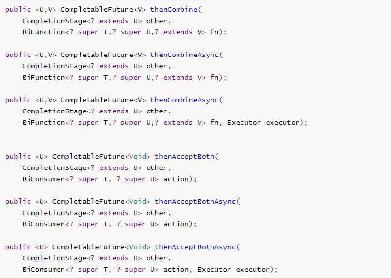
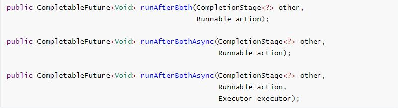
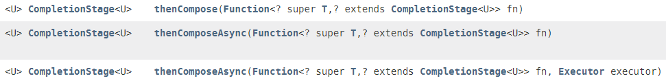
两个任务必须都完成， 触发该任务。

- thenCombine： 组合两个 future， 获取两个 future 的返回结果， 并返回当前任务的返回值。
- thenAcceptBoth： 组合两个 future， 获取两个 future 任务的返回结果， 然后处理任务， 没有返回值。
- runAfterBoth： 组合两个 future， 不需要获取 future 的结果， 只需两个 future 处理完任务后，处理该任务，无返回值。
- thenCompose：组合两个 future， 获取两个 future（二者的返回结果有依赖关系） 的返回结果， 并返回当前任务的返回值。

1. thenCompose：合并两个有依赖关系的 CompletableFuture 的执行结果。

```java
/**
 * 结果合并1
 */
public class Test08 {
    private static Integer num = 10;
    public static void main(String[] args) throws Exception{
        System.out.println("主线程开始");
        //第一步加 10
        CompletableFuture<Integer> future = CompletableFuture.supplyAsync(() -> {
            System.out.println("加 10 任务开始");
            num += 10;
            return num;
        });
        //合并
        CompletableFuture<Integer> future1 = future.thenCompose(i ->
                //再来一个 CompletableFuture
                CompletableFuture.supplyAsync(() -> {
                    return i + 1;
                }));
        System.out.println(future.get());
        System.out.println(future1.get());
    }
}
```

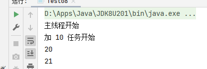

2. thenCombine：合并两个没有依赖关系的 CompletableFutures 任务

```java
/**
 * 结果合并2
 */
public class Test09 {
    private static Integer num = 10;
    public static void main(String[] args) throws Exception{
        System.out.println("主线程开始");
        CompletableFuture<Integer> job1 = CompletableFuture.supplyAsync(() -> {
            System.out.println("加 10 任务开始");
            num += 10;
            return num;
        });
        CompletableFuture<Integer> job2 = CompletableFuture.supplyAsync(() -> {System.out.println("乘以 10 任务开始");
            num = num * 10;
            return num;
        });
        //合并两个结果
        CompletableFuture<Object> future = job1.thenCombine(job2, new BiFunction<Integer, Integer, List<Integer>>() {
            @Override
            public List<Integer> apply(Integer a, Integer b) {
                List<Integer> list = new ArrayList<>();
                list.add(a);
                list.add(b);
                return list;
                }
            });
        System.out.println("合并结果为:" + future.get());
    }
}
```


##### 11.4.5.2 两任务组合 - 一个完成

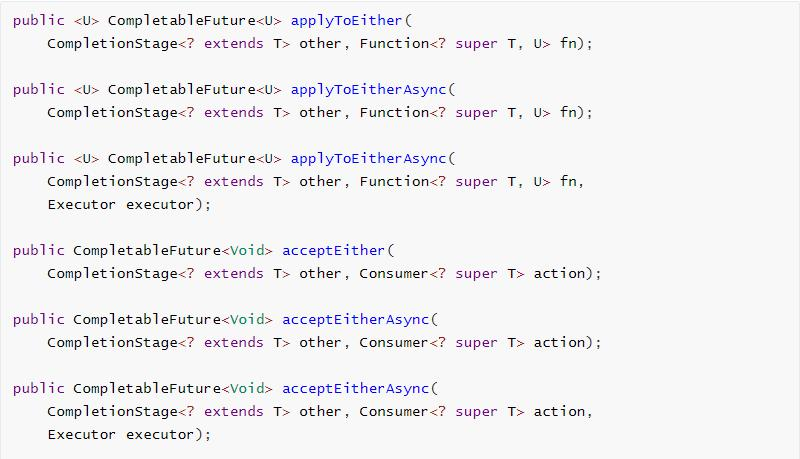
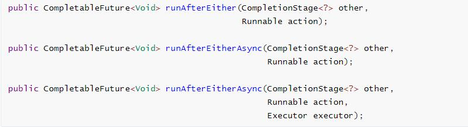
当两个任务中， 任意一个 future 任务完成的时候， 执行任务。

- applyToEither： 两个任务有一个执行完成， 获取它的返回值， 处理任务并有新的返回值。
- acceptEither： 两个任务有一个执行完成， 获取它的返回值， 处理任务， 没有新的返回值。
- runAfterEither： 两个任务有一个执行完成， 不需要获取 future 的结果， 处理任务， 也没有返回值。

applyToEither：选择并获取执行速度快的线程

```java
public class CompletableFutureFastDemo{
    public static void main(String[] args){
        CompletableFuture<String> playA = CompletableFuture.supplyAsync(() -> {
            System.out.println("A come in");
            try { TimeUnit.SECONDS.sleep(3); } catch (InterruptedException e) { e.printStackTrace(); }
            return "playA";
        });
        CompletableFuture<String> playB = CompletableFuture.supplyAsync(() -> {
            System.out.println("B come in");
            try { TimeUnit.SECONDS.sleep(1); } catch (InterruptedException e) { e.printStackTrace(); }
            return "playB";
        });
        CompletableFuture<String> result = playA.applyToEither(playB, f -> f + " is winer");
        System.out.println(Thread.currentThread().getName()+"\t"+"-----: "+result.join());
    }
}
```

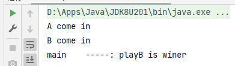

##### 11.4.5.3 多任务组合

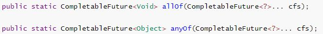

- allOf： 一系列独立的 future 任务，等其所有的任务执行完后做一些事情

```java
/**
 * 合并多个结果1
 */
public class Test10_1 {
    private static Integer num = 10;
    public static void main(String[] args) throws Exception{
        System.out.println("主线程开始");
        List<CompletableFuture> list = new ArrayList<>();
        CompletableFuture<Integer> job1 = CompletableFuture.supplyAsync(() -> {
            System.out.println("加 10 任务开始");
            num += 10;
            return num;
        });
        list.add(job1);
        CompletableFuture<Integer> job2 = CompletableFuture.supplyAsync(() -> {
            System.out.println("乘以 10 任务开始");num = num * 10;
            return num;
        });
        list.add(job2);
        CompletableFuture<Integer> job3 = CompletableFuture.supplyAsync(() -> {
            System.out.println("减以 10 任务开始");
            num = num * 10;
            return num;
        });
        list.add(job3);
        CompletableFuture<Integer> job4 = CompletableFuture.supplyAsync(() -> {
            System.out.println("除以 10 任务开始");
            num = num * 10;
            return num;
        });
        list.add(job4);
        //多任务合并
        List<Integer> collect =
                list.stream().map(CompletableFuture<Integer>::join).collect(Collectors.toList());
        System.out.println(collect);
    }
}
```

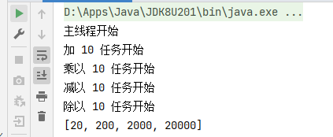

- anyOf：只要在多个 future 里面有一个返回，整个任务就可以结束，而不需要等到每一个 future 结束

```java
/**
 * 多结果合并2
 */
public class Test10_2 {
    private static Integer num = 10;
    public static void main(String[] args) throws Exception{
        System.out.println("主线程开始");
        CompletableFuture<Integer>[] futures = new CompletableFuture[4];
        CompletableFuture<Integer> job1 = CompletableFuture.supplyAsync(() -> {
            try{
                Thread.sleep(5000);
                System.out.println("加 10 任务开始");num += 10;
                return num;
            }catch (Exception e){
                return 0;
            }
        });
        futures[0] = job1;
        CompletableFuture<Integer> job2 = CompletableFuture.supplyAsync(() -> {
            try{
                Thread.sleep(2000);
                System.out.println("乘以 10 任务开始");
                num = num * 10;
                return num;
            }catch (Exception e){
                return 1;
            }
        });
        futures[1] = job2;
        CompletableFuture<Integer> job3 = CompletableFuture.supplyAsync(() -> {
            try{
                Thread.sleep(3000);
                System.out.println("减以 10 任务开始");
                num = num * 10;
                return num;
            }catch (Exception e){
                return 2;
            }
        });
        futures[2] = job3;
        CompletableFuture<Integer> job4 = CompletableFuture.supplyAsync(() -> {
            try{
                Thread.sleep(4000);
                System.out.println("除以 10 任务开始");num = num * 10;
                return num;
            }catch (Exception e){
                return 3;
            }
        });
        futures[3] = job4;
        CompletableFuture<Object> future = CompletableFuture.anyOf(futures);
        System.out.println(future.get());
    }
}
```

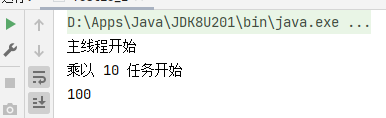

#### 11.4.5 手动终止线程

```java
/**
 * 主线程里面创建一个CompletableFuture，然后主线程调用get方法阻塞，最后在一个子线程中使其终止
 */
public class Test01 {
    public static void main(String[] args) throws Exception{
        CompletableFuture<String> future = new CompletableFuture<>();
        new Thread(() -> {
            try{
                System.out.println(Thread.currentThread().getName() + "子线程开始干活");
                //子线程睡 5 秒
                Thread.sleep(5000);
                //在子线程中完成主线程
                future.complete("success");
            }catch (Exception e){
                e.printStackTrace();
            }
        }, "A").start();
        //主线程调用get方法阻塞
        System.out.println("主线程调用 get 方法获取结果为: " + future.get());
        System.out.println("主线程完成,阻塞结束!!!!!!");
    }
}

```

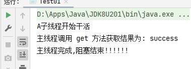
一般不建议通过 new 的方式创建 CompletableFuture 对象。

### 11.5 电商比价案例

#### 11.5.1 需求描述

1. 需求说明：
   - 同一款产品，同时搜索出同款产品在各大电商平台的售价。
   - 同一款产品，同时搜索出本产品在同一电商平台下不同卖家的售价。
2. 输出返回：
   - 返回同款产品在不同地方（平台或卖家）的价格清单列表——List<String>
   - 《mysql》 in jd price is 88.5
   - 《mysql》 in dangdang price is 86.11
   - 《mysql》 in taobao price is 90.43
3. 技术要求：
   - 函数式编程
   - 链式编程
   - Strream 流式计算
4. 解决方案：
   - 按部就班：一个一个查
   - 万箭齐发：同时查多个，进行结果合并

#### 11.5.2 按部就班

```java
public class CompletableFutureMallDemo {
    static List<NetMall> list = Arrays.asList(
            new NetMall("jd"),
            new NetMall("dangdang"),
            new NetMall("taobao"),
            new NetMall("pdd"),
            new NetMall("tmall")
    );
    public static List<String> getPrice(List<NetMall> list,String productName) {
        return list
                .stream()
                .map(netMall ->
                        String.format(productName + " in %s price is %.2f",
                                netMall.getNetMallName(),
                                netMall.calcPrice(productName)))
                .collect(Collectors.toList());
    }
    public static void main(String[] args) {
        long startTime = System.currentTimeMillis();
        List<String> list1 = getPrice(list, "mysql");
        for (String element : list1) {
            System.out.println(element);
        }
        long endTime = System.currentTimeMillis();
        System.out.println("----costTime: "+(endTime - startTime) +" 毫秒");
    }
}
class NetMall
{
    @Getter
    private String netMallName;
    public NetMall(String netMallName) {
        this.netMallName = netMallName;
    }
    public double calcPrice(String productName) {
        try { TimeUnit.SECONDS.sleep(1); } catch (InterruptedException e) { e.printStackTrace(); }//模拟查询耗时，1s
        return ThreadLocalRandom.current().nextDouble() * 2 + productName.charAt(0);//模拟书的价格
    }
}
```

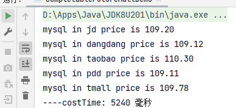

#### 11.5.3 万箭齐发

```java
public class CompletableFutureMallDemo {
    static List<NetMall> list = Arrays.asList(
            new NetMall("jd"),
            new NetMall("dangdang"),
            new NetMall("taobao"),
            new NetMall("pdd"),
            new NetMall("tmall")
    );
//List<NetMall> ----->List<CompletableFuture<String>>------> List<String>
public static List<String> getPriceByCompletableFuture(List<NetMall> list,String productName)
    {
        return list.stream().map(netMall ->
                CompletableFuture.supplyAsync(() -> String.format(productName + " in %s price is %.2f",
                netMall.getNetMallName(),
                netMall.calcPrice(productName))))
                .collect(Collectors.toList())
                .stream()
                .map(s -> s.join())
                .collect(Collectors.toList());
    }
    public static void main(String[] args) {
        long startTime2 = System.currentTimeMillis();
        List<String> list2 = getPriceByCompletableFuture(list, "mysql");
        for (String element : list2) {
            System.out.println(element);
        }
        long endTime2 = System.currentTimeMillis();
        System.out.println("----costTime: "+(endTime2 - startTime2) +" 毫秒");
    }
}
class NetMall
{
    @Getter
    private String netMallName;
    public NetMall(String netMallName) {
        this.netMallName = netMallName;
    }
    public double calcPrice(String productName) {
        try { TimeUnit.SECONDS.sleep(1); } catch (InterruptedException e) { e.printStackTrace(); }//模拟查询耗时，1s
        return ThreadLocalRandom.current().nextDouble() * 2 + productName.charAt(0);//模拟书的价格
    }
}
```

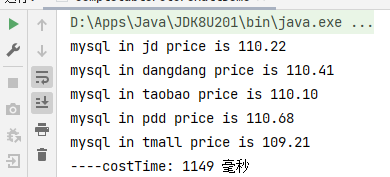
方法解析：
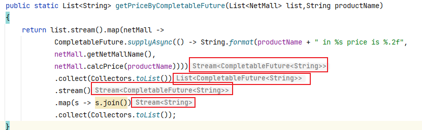
