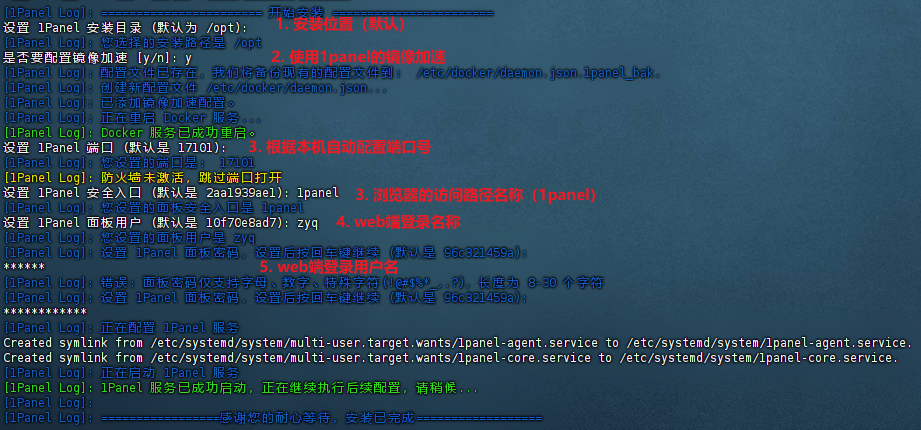
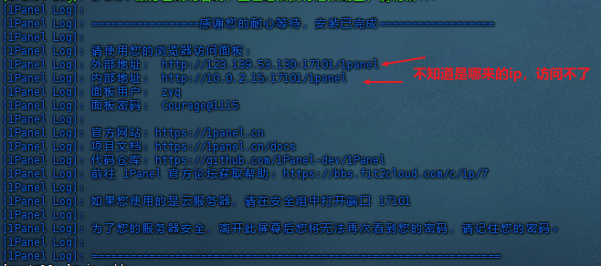
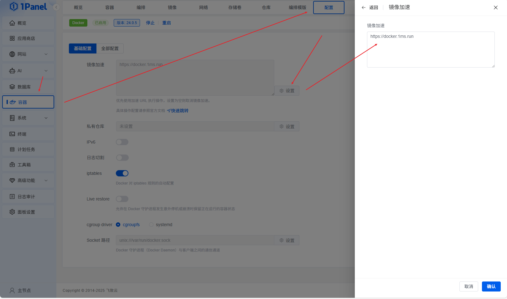
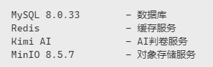
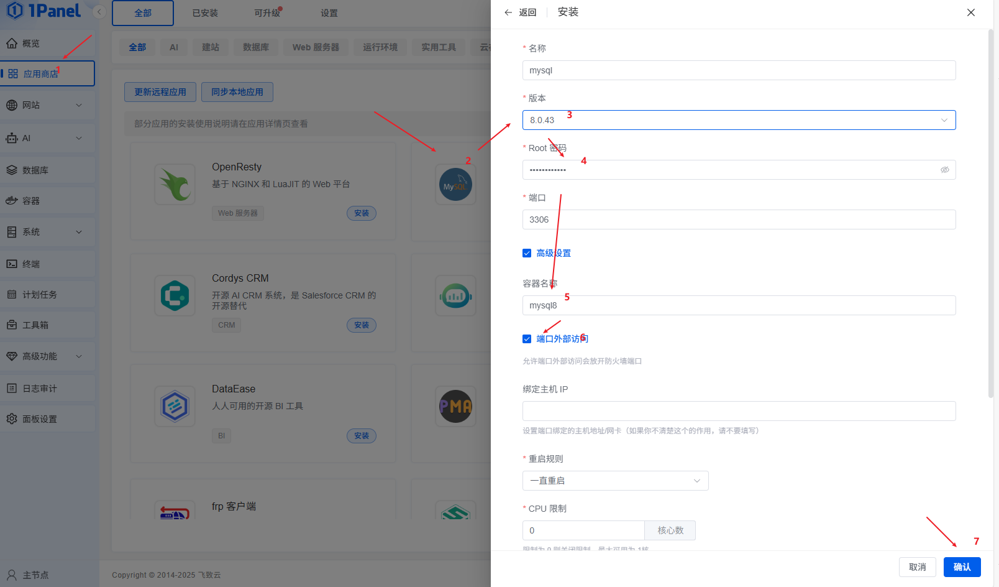
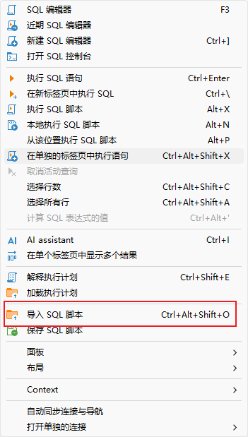
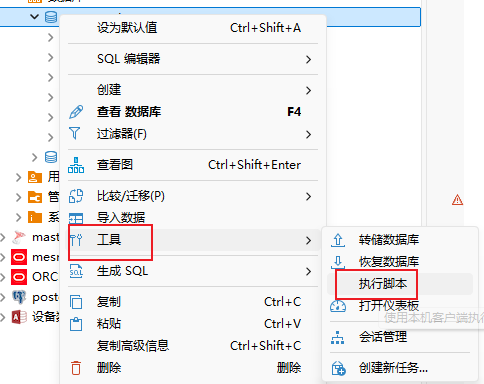
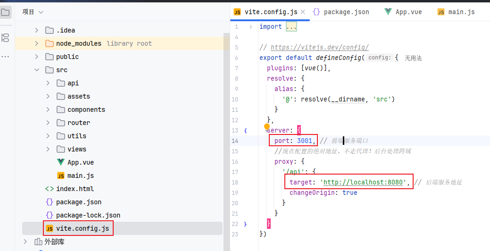
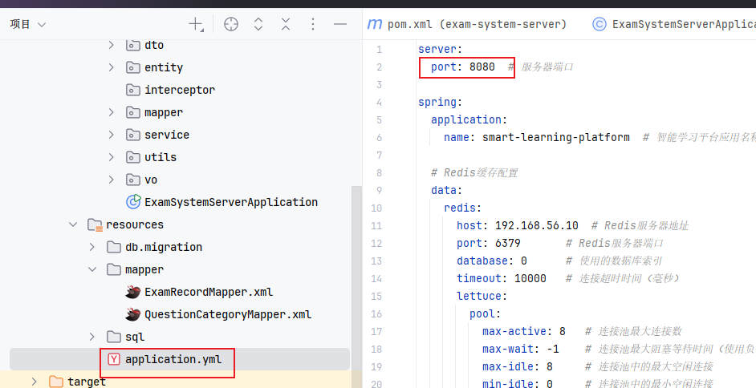

## 1. 环境搭建

### 1.1 安装1panel

安装1panel简化docker容器管理。

1. 安装：执行命令：`bash <(curl -Ls https://raw.githubusercontent.com/1Panel-dev/1Panel/master/scripts/install.sh)`
2. 配置：

    - 

3. 配置结果：

    - 

### 1.2 配置镜像加速

由于使用时发现安装时配置的1panel镜像无法正常使用，因此进行了更换：`https://docker.1ms.run`

### 1.3 安装mysql

本项目要求的mysql为8.0.33版本：

具体安装过程（随便选了个8.0.x版本）：

### 1.4 安装minio

安装minio与mysql安装过程一样，这里不再赘述。

**注意：minio的密码不能低于8位数，否则第一次启动正常，但第二次启动则会失败。**

### 1.5 dbeaver执行mysql脚本

**方式一：无数据库**

1. 选中要执行脚本的服务器。
2. 新建sql编辑器

    - 

3. 导入sql脚本

    - 

**方式二：已有数据库**

1. 选中数据库。
2. 右键选择工具》执行脚本

## 2. 认识项目

### 2.1 前端项目

通过查看vit.config.js文件：

- 前端访问端口为：3001
- 后台服务器端口为：8080

### 2.2 后端项目

查看application.yml文件：

后端端口为8080，与前端一致。