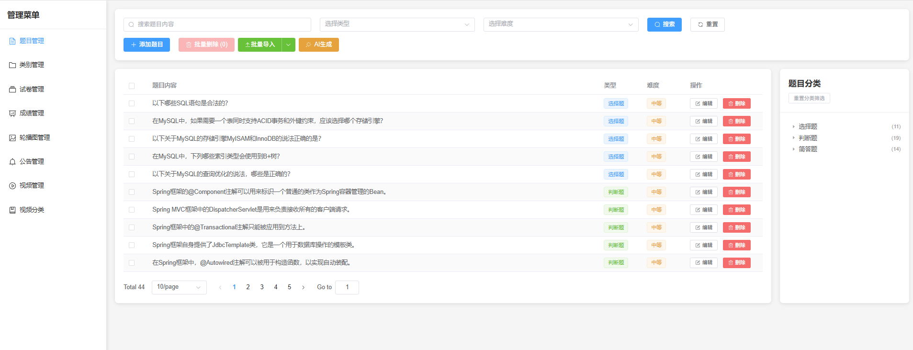

# 硅谷AI链习室项目介绍

[TOC]

## 一、项目概述

### 1.1 项目业务概述

**硅谷AI链习室**是一个以**AI驱动**为核心的现代化智能学习平台，深度融合**智能生成题目**、**智能刷题**和**智能考试**三大学习场景。系统通过集成**AI大模型（Kimi）**，实现了从智能题目生成、智能组卷到自动批阅的全流程AI赋能，为学习者提供个性化、智能化的学习体验。

**🎯 核心价值：**

- **AI智能出题**：基于知识点和难度要求，AI自动生成高质量题目
- **智能算法组卷**：根据教学目标和学生水平，智能匹配最优题目组合  
- **AI智能批阅**：支持主观题自动评分，提供详细的批改意见和学习建议

🏗️ **系统架构：**
系统采用前后端分离架构，包含**学生端学习界面**和**管理员后台系统**：

- **学生端**：面向广大学习者，提供AI驱动的个性化学习体验

  

- **管理端**：面向教师和管理员，提供AI辅助的教学管理工具

  

### 1.2 项目特色

- 🎯 **多题型支持**：选择题（单多选）、判断题、简答题全覆盖
- 🤖 **AI智能批阅**：集成Kimi AI判卷能力，支持主观题自动评分
- 📊 **智能组卷**：基于题型、难度、分类等规则自动生成试卷
- 📁 **批量导入**：支持Excel批量导入题目，提高录题效率
- 🎬 **视频学习**：完整的视频学习体系，支持分类管理、观看统计、点赞互动
- 💾 **文件存储**：支持MinIO对象存储，管理视频、图片等资源
- 📱 **响应式设计**：适配桌面端和移动端访问
- 🔄 **实时反馈**：考试结果即时反馈，支持排行榜展示
- 🚀 **高性能缓存**：Redis缓存优化，提升热门题目和分类查询性能

## 二、技术栈详解

### 2.1 前端技术栈
```
Vue.js 3.3.4        - 前端框架
Element Plus 2.3.8  - UI组件库
Vue Router 4.2.4    - 路由管理
Pinia 2.1.6         - 状态管理
Axios 1.4.0         - HTTP请求
html2canvas 1.4.1   - 截图功能
Vite 4.4.5          - 构建工具
```

### 2.2 后端技术栈
```
Spring Boot 3.0.5   - 主框架
Spring MVC          - Web层框架
MyBatis Plus 3.5.3  - ORM框架
Java 17             - 开发语言
Maven               - 构建工具
Lombok              - 代码简化
Knife4j 4.4.0       - API文档工具
Apache POI 5.2.4    - Excel处理
Jackson             - JSON处理
Validation          - 参数校验
```

### 2.3 第三方服务

```
MySQL 8.0.33        - 数据库
Redis               - 缓存服务
Kimi AI             - AI判卷服务
MinIO 8.5.7         - 对象存储服务
```

## 三、功能模块详解

系统共包含**9个核心功能模块**，分为学生端和管理员后台两大部分。下表提供了系统功能的宏观视图：

<table>
  <tr>
    <th>模块类别</th>
    <th>模块名称</th>
    <th>核心功能</th>
    <th>技术亮点</th>
  </tr>
  <tr>
    <td rowspan="4"><strong>学生端</strong><br>(4个模块)</td>
    <td>首页展示模块</td>
    <td>轮播图、系统公告、快速入口</td>
    <td>响应式设计、动态内容加载</td>
  </tr>
  <tr>
    <td>在线考试模块</td>
    <td>选择试卷、在线答题、考试计时、防作弊监控</td>
    <td>AI智能批阅、实时计时、答案自动保存</td>
  </tr>
  <tr>
    <td>视频学习模块</td>
    <td>视频浏览、在线观看、点赞互动、热门推荐</td>
    <td>流媒体播放、MinIO存储、观看统计</td>
  </tr>
  <tr>
    <td>成绩查询模块</td>
    <td>考试记录、成绩详情、排行榜</td>
    <td>实时反馈、数据可视化</td>
  </tr>
  <tr>
    <td rowspan="5"><strong>管理端</strong><br>(5个模块)</td>
    <td>题目管理模块</td>
    <td>题目CRUD、多题型支持、题目分类、难度管理</td>
    <td>Redis缓存优化、批量操作、N+1问题优化</td>
  </tr>
  <tr>
    <td>题目批量操作模块</td>
    <td>Excel导入导出、AI智能生成题目</td>
    <td>POI处理Excel、AI接口集成</td>
  </tr>
  <tr>
    <td>试卷管理模块</td>
    <td>手动组卷、AI智能组卷、试卷编辑、状态管理</td>
    <td>智能算法、事务管理</td>
  </tr>
  <tr>
    <td>考试记录管理模块</td>
    <td>记录查询、多条件筛选、详情查看</td>
    <td>复杂查询优化、数据聚合</td>
  </tr>
  <tr>
    <td>系统管理模块</td>
    <td>公告管理、轮播图管理、用户管理、数据统计</td>
    <td>富文本编辑、图片上传、数据可视化</td>
  </tr>
</table>
## 四、数据库设计

### 4.1 用户管理相关

```sql
users                - 用户表（用户基本信息、角色权限）
```

### 4.2 题目管理相关  

```sql
questions            - 题目表（题目基本信息）
question_choices     - 题目选项表（选择题选项）
question_answers     - 题目答案表（标准答案和关键词）
question_categories  - 题目分类表（分类体系）
```

### 4.3 考试管理相关

```sql
paper               - 试卷表（试卷基本信息）
paper_question      - 试卷题目关联表（试卷包含的题目）
exam_records        - 考试记录表（考试过程和结果）
answer_record       - 答题记录表（每道题的答题详情）
```

### 4.4 视频学习相关

```sql
videos              - 视频表（视频基本信息）
video_categories    - 视频分类表（视频分类体系）
video_views         - 视频观看记录表（观看统计）
video_likes         - 视频点赞表（点赞记录）
```

### 4.5 系统管理相关

```sql
notices             - 系统公告表（公告信息）
banners             - 轮播图表（首页轮播图）
```
