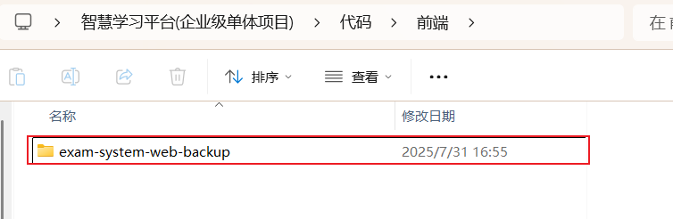

## 硅谷AI链习室项目搭建

[TOC]

### 一、 前端项目初始化

#### 1.1 导入前端程序



   当前根路径下，cmd / 并且执行npm相关命令即可！

#### 1.2 下载启动依赖

```  
npm  install
```

注意: 因为依赖量较大,建议配置npm的镜像地址再进行下载!!

#### 1.3 启动测试

``` 
npm run dev
```

#### 1.4 明确访问配置和调整

* 访问后台地址配置

  位置: `src/utils/request.js` 

  ``` js
  // 创建axios实例
  const request = axios.create({
    baseURL: 'http://localhost:8081', 
    timeout: 10000, // 请求超时时间
    headers: {
      'Content-Type': 'application/json'
    }
  })
  ```

* 前端启动端口配置

  位置: `.env.development`
  
  ``` js
  // https://vitejs.dev/config/
  export default defineConfig({
    plugins: [vue()],
    resolve: {
      alias: {
        '@': resolve(__dirname, 'src')
      }
    },
    server: {
      port: 3001, // 前端服务端口
    }
  }) 
  ```

### 二、后台项目初始化

#### 2.1 数据库初始化

1. **创建数据库**

   在MySQL中创建一个`lease`数据库，建库语句如下

   ```sql
   CREATE DATABASE exam_system_new CHARACTER SET utf8mb4 COLLATE utf8mb4_general_ci;
   ```

2. **导入数据库脚本**

   将资料中的`exam_system_new.sql`脚本导入`exam_system_new`数据库，其中包含了建表语句和少量的原始数据。

#### 2.2 创建工程

> 按照如下目录结构创建一个多模块的Maven工程。  [项目目录结构！单体项目不涉及模块化拆分！！]

```txt
exam-system-server-new
├── src
│   ├── main
│   │   ├── java
│   │   │   └── com.atguigu.exam
│   │   │       ├── common（result，常量类）
│   │   │       ├── config（配置模块——系统配置类）
│   │   │       ├── controller（控制层模块）
│   │   │       ├── entity（实体模块）
│   │   │       ├── mapper（数据访问层模块）
│   │   │       ├── service（业务逻辑层模块）
│   │   │       ├── utils（工具模块——各种工具类）
│   │   │       ├── vo（视图对象模块——用于封装前端需要的数据格式）
│   │   │       └── AdminWebApplication（应用启动类——Spring Boot 应用的入口）
│   │   └── resources
│   │       ├── mapper（Mapper XML 文件目录）
│   │       └── application.yml（应用配置文件）
│   └── test（测试模块——存放单元测试、集成测试等代码，用于验证各模块功能正确性 ）
└── pom.xml（Maven 项目核心配置文件——定义项目依赖、插件、构建等信息，管理项目的构建和依赖 ）
```

### 三、后台项目基础类导入

#### 3.1 项目初始配置

##### 3.1.1 SpringBoot配置

**1. pom文件配置**

在pom.xml文件中增加如下依赖内容

```xml
<parent>
    <groupId>org.springframework.boot</groupId>
    <artifactId>spring-boot-starter-parent</artifactId>
    <version>3.0.5</version>
</parent>

<properties>
    <java.version>17</java.version>
    <mybatis-plus.version>3.5.3.1</mybatis-plus.version>
    <mysql.version>8.0.33</mysql.version>
    <maven.compiler.source>17</maven.compiler.source>
    <maven.compiler.target>17</maven.compiler.target>
    <project.build.sourceEncoding>UTF-8</project.build.sourceEncoding>
</properties>

<dependencies>
    <dependency>
        <groupId>org.springframework.boot</groupId>
        <artifactId>spring-boot-starter-actuator</artifactId>
    </dependency>

    <!-- Spring Boot Web Starter -->
    <dependency>
        <groupId>org.springframework.boot</groupId>
        <artifactId>spring-boot-starter-web</artifactId>
    </dependency>

    <!-- Spring Boot Validation -->
    <dependency>
        <groupId>org.springframework.boot</groupId>
        <artifactId>spring-boot-starter-validation</artifactId>
    </dependency>

    <!-- MyBatis Plus -->
    <dependency>
        <groupId>com.baomidou</groupId>
        <artifactId>mybatis-plus-boot-starter</artifactId>
        <version>${mybatis-plus.version}</version>
    </dependency>

    <!-- MySQL 驱动 -->
    <dependency>
        <groupId>com.mysql</groupId>
        <artifactId>mysql-connector-j</artifactId>
        <version>${mysql.version}</version>
    </dependency>

    <!-- Lombok -->
    <dependency>
        <groupId>org.projectlombok</groupId>
        <artifactId>lombok</artifactId>
        <optional>true</optional>
    </dependency>

    <!-- Jackson JSON处理 -->
    <dependency>
        <groupId>com.fasterxml.jackson.core</groupId>
        <artifactId>jackson-databind</artifactId>
    </dependency>

    <!-- Fastjson -->
    <dependency>
        <groupId>com.alibaba</groupId>
        <artifactId>fastjson</artifactId>
        <version>2.0.25</version>
    </dependency>

    <!-- Excel文件处理 - Apache POI -->
    <dependency>
        <groupId>org.apache.poi</groupId>
        <artifactId>poi</artifactId>
        <version>5.2.4</version>
    </dependency>
    <dependency>
        <groupId>org.apache.poi</groupId>
        <artifactId>poi-ooxml</artifactId>
        <version>5.2.4</version>
    </dependency>

    <!-- HTTP客户端 - 用于调用Kimi API -->
    <dependency>
        <groupId>org.springframework.boot</groupId>
        <artifactId>spring-boot-starter-webflux</artifactId>
    </dependency>

    <!-- MinIO 对象存储客户端 -->  <!-- MinIO文件存储依赖 -->
    <dependency>
        <groupId>io.minio</groupId>
        <artifactId>minio</artifactId>
        <version>8.5.7</version>
    </dependency>

    <!-- Knife4j API文档增强工具 - 提供美观的Swagger UI界面 -->
    <dependency>
        <groupId>com.github.xiaoymin</groupId>
        <artifactId>knife4j-openapi3-jakarta-spring-boot-starter</artifactId>
        <version>4.4.0</version>
    </dependency>

        <!-- Redis 缓存依赖  redis的依赖后续导入-->
<!--        <dependency>-->
<!--            <groupId>org.springframework.boot</groupId>-->
<!--            <artifactId>spring-boot-starter-data-redis</artifactId>-->
<!--        </dependency>-->

        <!-- Redis 连接池依赖 -->
<!--        <dependency>-->
<!--            <groupId>org.apache.commons</groupId>-->
<!--            <artifactId>commons-pool2</artifactId>-->
<!--        </dependency>-->

    <!-- Redisson 分布式锁 -->
    <dependency>
        <groupId>org.redisson</groupId>
        <artifactId>redisson</artifactId>
        <version>3.24.3</version>
    </dependency>

    <!-- 测试依赖 -->
    <dependency>
        <groupId>org.springframework.boot</groupId>
        <artifactId>spring-boot-starter-test</artifactId>
        <scope>test</scope>
    </dependency>
</dependencies>
```

添加插件内容

```xml
<!-- Spring Boot Maven插件，用于打包可执行的JAR文件 -->
<build>
    <!-- build 标签用于配置 Maven 项目的构建相关设置，包含插件、资源等配置 -->
    <plugins>
        <!-- plugins 标签用于配置构建过程中要使用的插件集合 -->
        
        <!-- 配置 Spring Boot Maven 插件，主要用于打包 Spring Boot 应用等功能 -->
        <plugin>
            <groupId>org.springframework.boot</groupId>
            <artifactId>spring-boot-maven-plugin</artifactId>
            <configuration>
                <!-- configuration 用于配置当前插件的具体参数 -->
                <excludes>
                    <!-- excludes 用于配置要排除的依赖，这里针对的是打包等过程中排除特定依赖 -->
                    <exclude>
                        <!-- 排除 Lombok 依赖，Lombok 一般在编译期生效，打包后无需再包含其依赖（避免可能的冲突等情况） -->
                        <groupId>org.projectlombok</groupId>
                        <artifactId>lombok</artifactId>
                    </exclude>
                </excludes>
            </configuration>
        </plugin>

        <!-- 配置 Lombok Maven 插件，用于处理 Lombok 注解相关的操作，比如 delombok 功能 -->
        <plugin>
            <groupId>org.projectlombok</groupId>
            <artifactId>lombok-maven-plugin</artifactId>
            <version>1.18.20.0</version> <!-- 指定插件的版本 -->
            <executions>
                <!-- executions 用于配置插件在构建生命周期的哪个阶段执行哪些目标（goal） -->
                <execution>
                    <phase>generate-sources</phase> 
                    <!-- phase 指定该插件执行的生命周期阶段，这里是在生成源码阶段执行，
                         generate-sources 阶段主要用于生成额外的 Java 源码（比如根据模板、注解等生成） -->
                    <goals>
                        <!-- goals 配置要执行的具体目标，delombok 目标的作用是将使用 Lombok 注解的类转换为
                             不使用 Lombok 注解的标准 Java 类（展开 Lombok 注解对应的代码，方便一些场景下使用，
                             比如某些代码分析工具可能对 Lombok 注解处理不太友好时） -->
                        <goal>delombok</goal>
                    </goals>
                </execution>
            </executions>
        </plugin>
    </plugins>
</build>
```

**2. 创建application.yml文件**

```yaml
server:
  port: 8080
```

**3. 创建SpringBoot启动类**

在项目下创建`com.atguigu.exam.AdminWebApplication`启动类，内容如下：

```java
@SpringBootApplication
public class AdminWebApplication {
    public static void main(String[] args) {
        SpringApplication.run(AdminWebApplication.class, args);
    }
}
```

##### 3.1.2 Mybatis-Plus配置

Mybatis-Plus设计依赖导入（已完成）、mapper接口包扫描、连接池以及Mybatis-plus相关配置参数配置。具体配置可参考其[官方文档](https://baomidou.com/pages/bab2db/#release)。

**1. application.yml配置**

在**`application.yml`文件增加如下内容（配置连接池和Mybatis-plus相关配置）：

```yaml
spring:
  datasource:
    type: com.zaxxer.hikari.HikariDataSource
    url: jdbc:mysql://<hostname>:<port>/<database>?useUnicode=true&characterEncoding=utf-8&useSSL=false&allowPublicKeyRetrieval=true&serverTimezone=GMT%2b8
    username: <username>
    password: <password>
    hikari:
      connection-test-query: SELECT 1 # 自动检测连接
      connection-timeout: 60000 #数据库连接超时时间,默认30秒
      idle-timeout: 500000 #空闲连接存活最大时间，默认600000（10分钟）
      max-lifetime: 540000 #此属性控制池中连接的最长生命周期，值0表示无限生命周期，默认1800000即30分钟
      maximum-pool-size: 12 #连接池最大连接数，默认是10
      minimum-idle: 10 #最小空闲连接数量
      pool-name: SPHHikariPool # 连接池名称
      
#用于打印框架生成的sql语句，便于调试
mybatis-plus:
  configuration:
    log-impl: org.apache.ibatis.logging.stdout.StdOutImpl
```

**注意**：需根据实际情况修改`hostname`、`port`、`database`、`username`、`password`。

**2. 配置类**

在项目下创建`com.atguigu.exam.config.MybatisPlusConfiguration`类，内容如下：

```java
@Configuration
@MapperScan("com.atguigu.exam.mapper")
public class MybatisPlusConfiguration {

}
```

**注意**：`@MapperScan()`的包路径需要根据实际情况进行修改。

##### 3.1.3 Knife4j配置

在项目下创建`com.atguigu.exam.config.Knife4jConfiguration`类，内容如下：

```java
package com.atguigu.exam.config;

import io.swagger.v3.oas.models.OpenAPI;
import io.swagger.v3.oas.models.info.Info;
import org.springdoc.core.models.GroupedOpenApi;
import org.springframework.context.annotation.Bean;
import org.springframework.context.annotation.Configuration;

/**
 * projectName: com.atguigu.exam.config
 *
 * @author: 赵伟风
 * description:
 */
@Configuration
public class Knife4jConfiguration {


    /**
     * 配置OpenAPI文档信息
     * 设置API文档的标题、描述、版本等基本信息
     * Knife4j会自动读取这些信息并生成美观的文档页面
     *
     * @return OpenAPI配置对象
     */
    @Bean
    public OpenAPI customOpenAPI() {
        return new OpenAPI()
                .info(new Info()
                        .title("🎓 智能考试系统API文档") // API文档标题，添加emoji图标
                        .description("📚 智能考试系统后端接口文档，提供完整的RESTful API服务\n\n" +
                                "✨ 主要功能模块：\n" +
                                "• 🧠 题目管理：支持选择题、判断题、简答题的增删改查\n" +
                                "• 📝 试卷管理：手动组卷和AI智能组卷\n" +
                                "• 🎨 轮播图管理：首页轮播图的图片上传和管理\n" +
                                "• 📊 考试记录：考试结果统计和分析\n" +
                                "• 🔔 公告管理：系统公告的发布和管理") // API文档描述，使用markdown格式
                        .version("v1.0.0"));
    }


    //1.用户管理两套结构 【实现】
    @Bean
    public GroupedOpenApi userAPI() {

        return GroupedOpenApi.builder().group("用户信息管理").
                pathsToMatch(
                        "/api/user/**"
                ).
                build();
    }

    //2.试题信息管理5+16 = 21套接口 【实现】
    @Bean
    public GroupedOpenApi questionsAPI() {

        return GroupedOpenApi.builder().group("试题信息管理").
                pathsToMatch(
                        "/api/categories/**",
                        "/api/questions/**"
                ).
                build();
    }


    //3.试卷信息管理7+5+4=16套接口 【实现】
    @Bean
    public GroupedOpenApi papersAPI() {

        return GroupedOpenApi.builder().group("考试信息管理").
                pathsToMatch(
                        "/api/papers/**",
                        "/api/exams/**",
                        "/api/exam-records/**"
                ).
                build();
    }

    //4.视频信息管理（管理端视频，客户端视频，视频分类）8+7+7=22套接口 【不实现】
    @Bean
    public GroupedOpenApi videosAPI() {

        return GroupedOpenApi.builder().group("视频信息管理").
                pathsToMatch(
                        "/api/admin/videos/**",
                        "/api/videos/**",
                        "/api/video-categories/**"
                ).
                build();
    }


    //5.系统信息管理（视频和轮播图）十六套接口 【实现轮播图，讲解文件上传】
    @Bean
    public GroupedOpenApi systemAPI() {

        return GroupedOpenApi.builder().group("系统信息管理").
                pathsToMatch(
                        "/api/banners/**",
                        "/api/notices/**"
                ).
                build();
    }


    //6.其他信息管理（数据统计，文件查询，debug）四套接口 【实现文件查询】
    @Bean
    public GroupedOpenApi otherAPI() {

        return GroupedOpenApi.builder().group("其他内容管理").
                pathsToMatch(
                        "/api/stats/**",
                        "/files/**",
                        "/api/debug/**"
                ).
                build();
    }


}
```

**注意**：`pathsToMatch`参数需要根据实际情况进行配置。

#### 3.2 生成或导入基础代码（mybatisx）

在完成上述配置后，便可使用一些逆向工具自动生成基础代码了（例如实体类、mapper、service等），在使用Mybatis-Plus作为存储层框架时，推荐使用IDEA中的[Mybatis X](https://baomidou.com/pages/ba5b24/)插件。除了可自动生成这些代码，也可直接导入资料中提供的代码。推荐大家直接导入。

导入的代码和目标位置如下：

| 导入代码    | 包名/路径                       | 说明               |
| ----------- | ------------------------------- | ------------------ |
| 实体类      | `com.atguigu.exam.entity`       | 与数据库表一一对应 |
| mapper接口  | `com.atguigu.exam.mapper`       | 略                 |
| mapper xml  | `src/main/resources/mapper`     | 略                 |
| service     | `com.atguigu.exam.service`      | 略                 |
| serviceImpl | `com.atguigu.exam.service.impl` | 略                 |

**注意：**此时NoticeService，StatsService , VideoService相关爆红为正常现象，因为后续的其他通用工具尚未导入

**知识点**：

- 实体类中的公共字段（例如`id`、`create_time`、`update_time`、`is_deleted`）抽取到一个基类，进行统一管理，然后让各实体类继承该基类。
- 所有的实体类均实现了`Serializable`接口，方便对实体对象进行缓存。
- 所有的`Mapper`接口均没有使用`@Mapper`注解，而是使用`@MapperScan`注解统一扫描。
- 不用使用的`Mapper`接口中部分使用@Select注解，省去`Mapperxml`定义标签方法
- video相关实体类没有创建时间，修改时间和逻辑删除，也没有继承BaseEntity

#### 3.3 导入接口对应控制层和工具类等

资料中提供了所有的Controller代码，并且Controller中定义好了每个接口（只有定义，没有实现），大家可直接导入接口定义相关的代码，然后只专注于接口逻辑的实现。

导入的代码和目标位置如下：

| 导入代码   | 包名/路径                     | 说明                                                |
| ---------- | ----------------------------- | --------------------------------------------------- |
| controller | `com.atguigu.exam.controller` | 略                                                  |
| vo         | `com.atguigu.exam.vo`         | View Object，用于封装或定义接口接受及返回的数据结构 |
| result     | `com.atguigu.exam.common`     | 统一定义接口返回的数据结构和redis常量               |
| utils      | `com.atguigu.exam.utils`      | 定义表格导出和ip地址查询工具类                      |

导入完成后，便可启动SpringBoot项目，并访问接口文档了，Knife4j文档的url为：http://localhost:8080/doc.html。

**知识点**：

- vo（View Object）：用于封装或定义接口接收及返回的数据的结构。

- 统一接口返回数据结构：为方便前端对接口数据进行处理，统一接口返回数据结构是一个良好的习惯。

  以下是所有接口统一返回的数据结构，成功：200  失败： 500 其他资源问题：4xx

  ```json
  {
      "code": 200,
      "message": "正常",
      "data": {
          "id": "1",
          "name": "zhangsan",
          "age": 10
      }
  }
  ```
  

