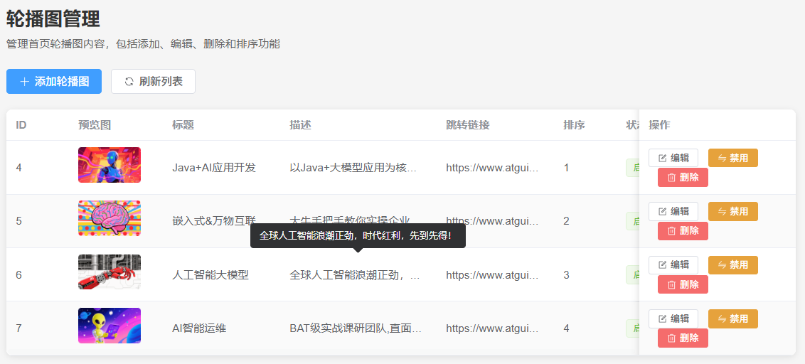
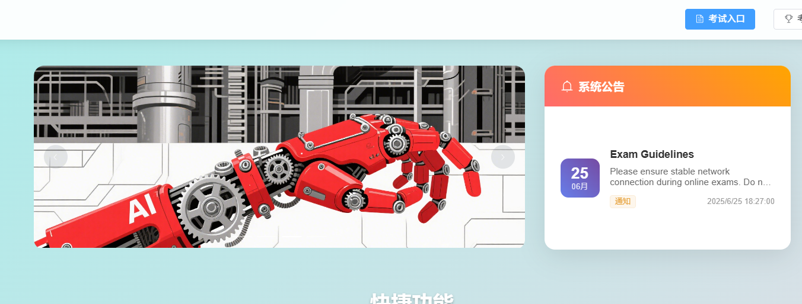
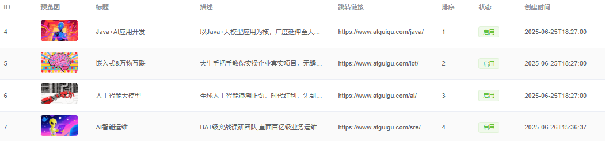
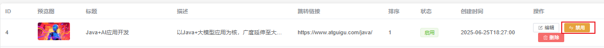
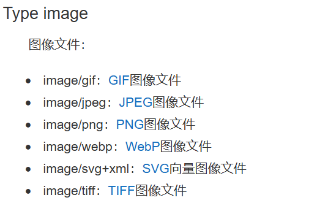

# 硅谷AI链习室开发- 轮播图管理篇

[TOC]

## 一、模块概述

轮播图管理模块是智能学习平台的首页展示核心，负责平台轮播图的上传、管理和动态展示功能。本模块采用Spring Boot + MyBatis Plus + 文件上传 架构，实现了轮播图的全生命周期管理。

管理端：



客户端：



### 核心功能特性

- **文件上传**：多格式图片上传支持（jpg、png、gif等）
- **智能排序**：sort字段实现显示顺序控制
- **状态切换**：一键启用/禁用轮播图功能
- **数据安全**：文件类型和大小校验机制

banner管理共包含以下8个接口：

1. **上传轮播图图片** post `/api/banners/upload-image` - 将图片文件上传到MinIO服务器，返回访问图片URL
2. **获取启用的轮播图** get`/api/banners/active` - 获取状态为启用的轮播图列表，供前台首页展示使用
3. **获取所有轮播图** get`/api/banners/list` - 获取所有轮播图列表，包括启用和禁用的，供管理后台使用
4. **根据ID获取轮播图** get`/api/banners/{id}` - 根据轮播图ID获取单个轮播图的详细信息(未启用)
5. **添加轮播图** post `/api/banners/add` - 创建新的轮播图，需要提供图片URL、标题、跳转链接等信息
6. **更新轮播图** put`/api/banners/update` - 更新轮播图的信息，包括图片、标题、跳转链接、排序等
7. **删除轮播图** delete `/api/banners/delete/{id}` - 根据ID删除指定的轮播图
8. **切换轮播图状态** put `/api/banners/toggle/{id}` - 启用或禁用指定的轮播图，禁用后不会在前台显示

## 二、数据库表结构

### 2.1 轮播图表 (banners)

```sql
CREATE TABLE `banners`  (
  `id` bigint NOT NULL AUTO_INCREMENT COMMENT '轮播图ID',
  `title` varchar(255) CHARACTER SET utf8mb4 COLLATE utf8mb4_0900_ai_ci NOT NULL COMMENT '轮播图标题',
  `description` text CHARACTER SET utf8mb4 COLLATE utf8mb4_0900_ai_ci NULL COMMENT '轮播图描述',
  `image_url` varchar(500) CHARACTER SET utf8mb4 COLLATE utf8mb4_0900_ai_ci NOT NULL COMMENT '图片URL',
  `link_url` varchar(500) CHARACTER SET utf8mb4 COLLATE utf8mb4_0900_ai_ci NULL DEFAULT NULL COMMENT '跳转链接',
  `sort_order` int NULL DEFAULT 0 COMMENT '排序顺序',
  `is_active` tinyint(1) NULL DEFAULT 1 COMMENT '是否启用',
  `create_time` timestamp NULL DEFAULT CURRENT_TIMESTAMP COMMENT '创建时间',
  `update_time` timestamp NULL DEFAULT CURRENT_TIMESTAMP ON UPDATE CURRENT_TIMESTAMP COMMENT '更新时间',
  `is_deleted` tinyint NULL DEFAULT 0 COMMENT '0-未删除，1-已删除',
  PRIMARY KEY (`id`) USING BTREE,
  INDEX `idx_sort_order`(`sort_order` ASC) USING BTREE,
  INDEX `idx_is_active`(`is_active` ASC) USING BTREE
) ENGINE = InnoDB AUTO_INCREMENT = 8 CHARACTER SET = utf8mb4 COLLATE = utf8mb4_0900_ai_ci COMMENT = '轮播图表' ROW_FORMAT = Dynamic;
```

**字段说明：**
- `id`：主键，自增长的轮播图唯一标识
- `title`：轮播图标题，最大200字符
- `description`：轮播图描述，可选字段
- `image_url`：图片URL地址，必填字段
- `link_url`：跳转链接，点击轮播图跳转的目标URL
- `sort_order`：排序字段，数字越小显示越靠前
- `is_active`：启用状态，1-显示，0-隐藏
- `create_time`：创建时间，自动生成
- `update_time`：更新时间，自动维护
- `is_deleted`: 逻辑删除字段，0未删除 1已删除

## 三、实体类设计

### 3.1 轮播图实体类

```java
/**
 * 轮播图实体类 - 首页轮播图展示信息
 */
@Data
@TableName("banners")
@Schema(description = "轮播图信息")
public class Banner extends BaseEntity{

    @Schema(description = "轮播图标题", 
            example = "智能考试系统介绍")
    private String title; // 轮播图标题
    
    @Schema(description = "轮播图描述内容", 
            example = "基于AI技术的智能考试平台，支持在线考试、智能组卷等功能")
    private String description; // 轮播图描述
    
    @Schema(description = "轮播图片URL地址", 
            example = "https://example.com/images/banner1.jpg")
    private String imageUrl; // 图片URL
    
    @Schema(description = "点击跳转链接，可选", 
            example = "https://example.com/about")
    private String linkUrl; // 跳转链接
    
    @Schema(description = "排序顺序，数字越小越靠前", 
            example = "1")
    private Integer sortOrder; // 排序顺序
    
    @Schema(description = "是否启用显示", 
            example = "true")
    private Boolean isActive; // 是否启用
} 
```

注意： id  create_time update_time  is_deleted 对应属性， 我们封装到了BaseEntity中！

## 四、轮播图接口功能实现

### 4.1 查询所有轮播图接口（ get `/api/banners/list`）



#### 4.1.1 接口分析

**接口地址**:`/api/banners/list`

**请求方式**:`GET`

**请求参数**: 暂无

**响应参数**:

```json
{
	"code": 200,
	"message": "操作成功",
	"data": [
		{
			"id": 1,
			"title": "智能考试系统介绍",
			"description": "基于AI技术的智能考试平台，支持在线考试、智能组卷等功能",
			"imageUrl": "https://example.com/images/banner1.jpg",
			"linkUrl": "https://example.com/about",
			"sortOrder": 1,
			"isActive": true,
			"createTime": ""
		}
	]
}
```

#### 4.1.2 功能实现

* **BannerController层**

  ``` java
  @Autowired
  private BannerService bannerService;
  
  /**
    * 实现逻辑：
    *    单表查询
    *    根据优先级倒序
    * 注意：
    *    逻辑删除
    *    逻辑删除字段和更新时间字段不返回
    *    创建时间格式化问题
    * 获取所有轮播图（管理后台使用）
    * @return 轮播图列表
    */
  @GetMapping("/list")  // 处理GET请求
  @Operation(summary = "获取所有轮播图", description = "获取所有轮播图列表，包括启用和禁用的，供管理后台使用")  // API描述
  public Result<List<Banner>> getAllBanners() {
      //1.拼接条件，进行排序
      LambdaQueryWrapper<Banner> lambdaQueryWrapper = new LambdaQueryWrapper<>();
      lambdaQueryWrapper.orderByAsc(Banner::getSortOrder); //根据sort正序排序
      //2.查询所有符合集合
      List<Banner> bannerList = bannerService.list(lambdaQueryWrapper);
      //3.进行结果拼接
      log.info("查询所有后台需要的轮播信息业务执行成功！结果为：{}",bannerList);
      return Result.success(bannerList,"查询所有banner信息成功！");
}
  ```
  
  注意：类需要添加@Slf4j注解！！
  
  访问：http://localhost:8080/doc.html进行测试

#### 4.1.3 知识点

- **逻辑删除功能**

  由于数据库中所有表均采用逻辑删除策略，所以查询数据时均需要增加过滤条件`is_deleted=0`。

  上述操作虽不难实现，但是每个查询接口都要考虑到，也显得有些繁琐。为简化上述操作，可以使用Mybatis-Plus提供的逻辑删除功能，它可以自动为查询操作增加`is_deleted=0`过滤条件，并将删除操作转为更新语句。具体配置如下，详细信息可参考[官方文档](https://baomidou.com/pages/6b03c5/#%E4%BD%BF%E7%94%A8%E6%96%B9%E6%B3%95)。

  - 步骤一：在`application.yml`中增加如下内容

    ```yml
    mybatis-plus:
      global-config:
        db-config:
          logic-delete-field: isDeleted # 全局逻辑删除的实体属性名(配置后可以忽略不配置步骤二)
          logic-delete-value: 1 # 逻辑已删除值(默认为 1)
          logic-not-delete-value: 0 # 逻辑未删除值(默认为 0)
    ```

  - 步骤二：在实体类中的删除标识字段上增加`@TableLogic`注解

    ```java
    @Data
    public class BaseEntity {
    
        @Schema(description = "主键")
        @TableId(value = "id", type = IdType.AUTO)
        private Long id;
    
        @Schema(description = "创建时间")
        private Date createTime;
    
        @Schema(description = "更新时间")
        private Date updateTime;
    
        @Schema(description = "逻辑删除")
        @TableLogic
        @TableField("is_deleted")
        private Byte isDeleted;
    
    }
    ```
    
    **注意**：
    

逻辑删除功能只对Mybatis-Plus自动注入的sql起效，也就是说，对于手动在`Mapper.xml`文件配置的sql不会生效，需要单独考虑。

- **忽略特定字段（扩展）**

  通常情况下接口响应的Json对象中并不需要`update_time`、`is_deleted`等字段，这时只需在实体类中的相应字段添加`@JsonIgnore`注解，该字段就会在序列化时被忽略。

  具体配置如下，详细信息可参考Jackson[官方文档](https://github.com/FasterXML/jackson-annotations#annotations-for-ignoring-properties)。

  ```java
  @Data
  public class BaseEntity {
  
      @Schema(description = "主键")
      @TableId(value = "id", type = IdType.AUTO)
      private Long id;
  
      @Schema(description = "创建时间")
      @TableField(value = "create_time")
      private Date createTime;
  
      @Schema(description = "更新时间")
      @JsonIgnore
      @TableField(value = "update_time")
      private Date updateTime;
  
      @Schema(description = "逻辑删除")
      @TableField("is_deleted")
      private Byte isDeleted;
  
  }
  ```

* **创建时间格式问题**

  `Banner`实体类中的`createTime`字段为`Date`类型，`Date`类型的字段在序列化成JSON字符串时，需要考虑两个点，分别是**格式**和**时区**。本项目使用JSON序列化框架为Jackson，具体配置如下

  - **格式**

    格式可按照字段单独配置，也可全局配置，下面分别介绍

    - **单独配置**

      在`BaseEntity`实体类指定字段增加`@JsonFormat`注解，如下

      ```java
      @JsonFormat(pattern = "yyyy-MM-dd HH:mm:ss")
      private Date createTime;
      ```

    - **全局配置**

      在`application.yml`中增加如下内容

      ```yml
      spring:
        jackson:
          date-format: yyyy-MM-dd HH:mm:ss
      ```

  - **时区**

    时区同样可按照字段单独配置，也可全局配置，下面分别介绍

    - **单独配置**

      在指定字段增加`@JsonFormat`注解，如下

      ```java
      @JsonFormat(timezone = "GMT+8")
      private Date createTime;
      ```

    - **全局配置**

      ```yml
      spring:
        jackson:
          time-zone: GMT+8
      ```

  推荐格式按照字段单独配置，时区全局配置。

### 4.2 查询激活状态轮播图接口（ get `/api/banners/active`）


#### 4.2.1 接口分析

**接口地址**:`/api/banners/active`

**请求方式**:`GET`

**请求参数**: 暂无

**响应参数**:

```json
{
	"code": 200,
	"message": "操作成功",
	"data": [
		{
			"id": 1,
			"title": "智能考试系统介绍",
			"description": "基于AI技术的智能考试平台，支持在线考试、智能组卷等功能",
			"imageUrl": "https://example.com/images/banner1.jpg",
			"linkUrl": "https://example.com/about",
			"sortOrder": 1,
			"isActive": true,
			"createTime": ""
		}
	]
}
```

#### 4.2.2 功能实现

- **BannerController层**

  ```java
  @Autowired
  private BannerService bannerService;
  
  /**
    * 实现逻辑：
    *    单表查询
    *    条件 = 激活状态 true
    *    根据优先级排序
    * 获取启用的轮播图（前台首页使用）
    * @return 轮播图列表
    */
  @GetMapping("/active")  // 处理GET请求
  @Operation(summary = "获取启用的轮播图", description = "获取状态为启用的轮播图列表，供前台首页展示使用")  // API描述
  public Result<List<Banner>> getActiveBanners() {
      LambdaQueryWrapper<Banner> lambdaQueryWrapper
          = new LambdaQueryWrapper<>();
      lambdaQueryWrapper.eq(Banner::getIsActive,true);
      //根据优先级倒序，数字越小越靠前！
      lambdaQueryWrapper.orderByAsc(Banner::getSortOrder);
      List<Banner> bannerList = bannerService.list(lambdaQueryWrapper);
      return Result.success(bannerList);
  }
  ```

  访问：http://localhost:8080/doc.html进行测试

### 4.3 切换轮播图状态接口（ put `/api/banners/toggle/{id}`）



#### 4.3.1 接口分析

**接口地址**:`/api/banners/toggle/{id}`?isActive=true false

**请求方式**:`PUT`

**接口描述**:<p>启用或禁用指定的轮播图，禁用后不会在前台显示</p>

**请求参数**:

| 参数名称 | 参数说明                          | 请求类型     | 是否必须 | 数据类型       | schema |
| -------- | --------------------------------- | ------------ | -------- | -------------- | ------ |
| id       | 轮播图ID                          | path         | true     | integer(int64) |        |
| isActive | 是否启用，true为启用，false为禁用 | query\|param | true     | boolean        |        |

**响应参数**:

```json
{
	"code": 200,
	"message": "操作成功",
	"data": ""
}
```

#### 4.3.2 功能实现

- **BannerController层**

  ```java
  @Autowired
  private BannerService bannerService;
  
  /**
    * 实现逻辑：
    *    单表操作
    *    根据id更新banner状态
    *    状态可能是启用，也可以是禁用
    * 启用/禁用轮播图
    * @param id 轮播图ID
    * @param isActive 是否启用
    * @return 操作结果
    */
  @PutMapping("/toggle/{id}")  // 处理PUT请求
  @Operation(summary = "切换轮播图状态", description = "启用或禁用指定的轮播图，禁用后不会在前台显示")  // API描述
  public Result<String> toggleBannerStatus(
      @Parameter(description = "轮播图ID") @PathVariable Long id, 
      @Parameter(description = "是否启用，true为启用，false为禁用") @RequestParam Boolean isActive) {
  
      LambdaUpdateWrapper<Banner> lambdaUpdateWrapper =
          new LambdaUpdateWrapper<>();
      lambdaUpdateWrapper.eq(Banner::getId,id);
      lambdaUpdateWrapper.set(Banner::getIsActive,isActive);
      bannerService.update(lambdaUpdateWrapper);
      return Result.success("banner状态更新成功！");
  }
  ```

  访问：http://localhost:8080/doc.html进行测试

### 4.4 删除轮播图接口（ delete `/api/banners/delete/{id}`）


#### 4.4.1 接口分析

**接口地址**:`/api/banners/delete/{id}`

**请求方式**:`delete`

**请求参数**:

| 参数名称 | 参数说明 | 请求类型 | 是否必须 | 数据类型       | schema |
| -------- | -------- | -------- | -------- | -------------- | ------ |
| id       | 轮播图ID | path     | true     | integer(int64) |        |

**响应参数**:

```json
{
	"code": 200,
	"message": "操作成功",
	"data": ""
}
```

#### 4.4.2 功能实现

- **BannerController层**

  ```java
  @Autowired
  private BannerService bannerService;
  
  /**
    *
    * 实现逻辑：
    *    单表操作
    *    逻辑删除
    *    已经配置直接调用业务即可
    * 删除轮播图
    * @param id 轮播图ID
    * @return 操作结果
    */
  @DeleteMapping("/delete/{id}")  // 处理DELETE请求
  @Operation(summary = "删除轮播图", description = "根据ID删除指定的轮播图")  // API描述
  public Result<String> deleteBanner(@Parameter(description = "轮播图ID") @PathVariable Long id) {
      bannerService.removeById(id);
      return Result.success("删除数据成功");
  }
  ```

  访问：http://localhost:8080/doc.html进行测试

### 4.5 获取轮播图详情接口（ get `/api/banners/{id}`）


#### 4.5.1 接口分析

**接口地址**:`/api/banners/{id}`

**请求方式**:`get`

**请求参数**:

| 参数名称 | 参数说明 | 请求类型 | 是否必须 | 数据类型       | schema |
| -------- | -------- | -------- | -------- | -------------- | ------ |
| id       | 轮播图ID | path     | true     | integer(int64) |        |

**响应参数**:

```json
{
	"code": 200,
	"message": "操作成功",
	"data": {
		"id": 1,
		"title": "智能考试系统介绍",
		"description": "基于AI技术的智能考试平台，支持在线考试、智能组卷等功能",
		"imageUrl": "https://example.com/images/banner1.jpg",
		"linkUrl": "https://example.com/about",
		"sortOrder": 1,
		"isActive": true,
		"createTime": ""
	}
}
```

#### 4.5.2 功能实现

- **BannerController层**

  ```java
  @Autowired
  private BannerService bannerService;
  
  /**
    * 实现思路：
    *    单表普通查询
    *    根据id查询
    *    注意逻辑删除，不过已经实现
    * 接口前期设计，但是前端并未调用，而是直接记录上次列表数据实现的！！
    * 根据ID获取轮播图
    * @param id 轮播图ID
    * @return 轮播图详情
    */
  @GetMapping("/{id}")  // 处理GET请求
  @Operation(summary = "根据ID获取轮播图", description = "根据轮播图ID获取单个轮播图的详细信息")  // API描述  
  public Result<Banner> getBannerById(@Parameter(description = "轮播图ID") @PathVariable Long id) {
      Banner banner = bannerService.getById(id);
      return Result.success(banner);
  }
  ```

  访问：http://localhost:8080/doc.html进行测试

### 4.6 实现通用文件上传业务（业务层）

轮播图、视频管理都要用到文件上传。

为什么单独做个上传的业务方法，而不是直接弄完整接口？

因为轮播图（要验图片格式、尺寸）和视频（要验视频格式、时长）的校验要求不一样。但它们的上传核心步骤是一样的。

所以让这个业务方法只负责上传，具体校验交给各自的接口。这样代码不重复，职责也清楚。

#### 4.6.1 文件上传流程

![img](data:image/svg+xml;base64,PHN2ZyB4bWxucz0iaHR0cDovL3d3dy53My5vcmcvMjAwMC9zdmciIHN0eWxlPSJiYWNrZ3JvdW5kOiB0cmFuc3BhcmVudDsgYmFja2dyb3VuZC1jb2xvcjogdHJhbnNwYXJlbnQ7IiB4bWxuczp4bGluaz0iaHR0cDovL3d3dy53My5vcmcvMTk5OS94bGluayIgdmVyc2lvbj0iMS4xIiB3aWR0aD0iNzMxcHgiIGhlaWdodD0iMzA5cHgiIHZpZXdCb3g9Ii0wLjUgLTAuNSA3MzEgMzA5IiBjb250ZW50PSImbHQ7bXhHcmFwaE1vZGVsJmd0OyZsdDtyb290Jmd0OyZsdDtteENlbGwgaWQ9JnF1b3Q7MCZxdW90Oy8mZ3Q7Jmx0O214Q2VsbCBpZD0mcXVvdDsxJnF1b3Q7IHBhcmVudD0mcXVvdDswJnF1b3Q7LyZndDsmbHQ7bXhDZWxsIGlkPSZxdW90OzImcXVvdDsgdmFsdWU9JnF1b3Q7TXlTUUwmcXVvdDsgc3R5bGU9JnF1b3Q7c2hhcGU9Y3lsaW5kZXIzO3doaXRlU3BhY2U9d3JhcDtodG1sPTE7Ym91bmRlZExibD0xO2JhY2tncm91bmRPdXRsaW5lPTE7c2l6ZT0xNTtmaWxsQ29sb3I9I2RhZThmYztzdHJva2VDb2xvcj0jNmM4ZWJmOyZxdW90OyB2ZXJ0ZXg9JnF1b3Q7MSZxdW90OyBwYXJlbnQ9JnF1b3Q7MSZxdW90OyZndDsmbHQ7bXhHZW9tZXRyeSB4PSZxdW90OzQwJnF1b3Q7IHk9JnF1b3Q7NjgwJnF1b3Q7IHdpZHRoPSZxdW90OzYwJnF1b3Q7IGhlaWdodD0mcXVvdDs4MCZxdW90OyBhcz0mcXVvdDtnZW9tZXRyeSZxdW90Oy8mZ3Q7Jmx0Oy9teENlbGwmZ3Q7Jmx0O214Q2VsbCBpZD0mcXVvdDszJnF1b3Q7IHN0eWxlPSZxdW90O2VkZ2VTdHlsZT1vcnRob2dvbmFsRWRnZVN0eWxlO3JvdW5kZWQ9MDtvcnRob2dvbmFsTG9vcD0xO2pldHR5U2l6ZT1hdXRvO2h0bWw9MTtleGl0WD0xO2V4aXRZPTAuNTtleGl0RHg9MDtleGl0RHk9MDtlbnRyeVg9LTAuMDA4O2VudHJ5WT0wLjU3NTtlbnRyeUR4PTA7ZW50cnlEeT0wO2VudHJ5UGVyaW1ldGVyPTA7ZGFzaGVkPTE7c3Ryb2tlQ29sb3I9bGlnaHQtZGFyaygjZDcxNDE0LCAjZWRlZGVkKTtzdHJva2VXaWR0aD0yOyZxdW90OyBlZGdlPSZxdW90OzEmcXVvdDsgc291cmNlPSZxdW90OzQmcXVvdDsgdGFyZ2V0PSZxdW90OzUmcXVvdDsgcGFyZW50PSZxdW90OzEmcXVvdDsmZ3Q7Jmx0O214R2VvbWV0cnkgcmVsYXRpdmU9JnF1b3Q7MSZxdW90OyBhcz0mcXVvdDtnZW9tZXRyeSZxdW90OyZndDsmbHQ7bXhQb2ludCB4PSZxdW90OzY1MCZxdW90OyB5PSZxdW90OzcyMCZxdW90OyBhcz0mcXVvdDt0YXJnZXRQb2ludCZxdW90Oy8mZ3Q7Jmx0Oy9teEdlb21ldHJ5Jmd0OyZsdDsvbXhDZWxsJmd0OyZsdDtteENlbGwgaWQ9JnF1b3Q7NCZxdW90OyB2YWx1ZT0mcXVvdDvmlofku7bkuIrkvKDmnI3liqEmcXVvdDsgc3R5bGU9JnF1b3Q7cm91bmRlZD0xO3doaXRlU3BhY2U9d3JhcDtodG1sPTE7ZmlsbENvbG9yPSNkNWU4ZDQ7c3Ryb2tlQ29sb3I9IzgyYjM2NjsmcXVvdDsgdmVydGV4PSZxdW90OzEmcXVvdDsgcGFyZW50PSZxdW90OzEmcXVvdDsmZ3Q7Jmx0O214R2VvbWV0cnkgeD0mcXVvdDs0OTAmcXVvdDsgeT0mcXVvdDs3MDAmcXVvdDsgd2lkdGg9JnF1b3Q7MTIwJnF1b3Q7IGhlaWdodD0mcXVvdDs0MCZxdW90OyBhcz0mcXVvdDtnZW9tZXRyeSZxdW90Oy8mZ3Q7Jmx0Oy9teENlbGwmZ3Q7Jmx0O214Q2VsbCBpZD0mcXVvdDs1JnF1b3Q7IHZhbHVlPSZxdW90O01pbmlv5paH5Lu25pyN5YqhJnF1b3Q7IHN0eWxlPSZxdW90O3NoYXBlPWN1YmU7d2hpdGVTcGFjZT13cmFwO2h0bWw9MTtib3VuZGVkTGJsPTE7YmFja2dyb3VuZE91dGxpbmU9MTtkYXJrT3BhY2l0eT0wLjA1O2RhcmtPcGFjaXR5Mj0wLjE7ZmlsbENvbG9yPSNmOGNlY2M7c3Ryb2tlQ29sb3I9I2I4NTQ1MDsmcXVvdDsgdmVydGV4PSZxdW90OzEmcXVvdDsgcGFyZW50PSZxdW90OzEmcXVvdDsmZ3Q7Jmx0O214R2VvbWV0cnkgeD0mcXVvdDs2NjAmcXVvdDsgeT0mcXVvdDs2ODAmcXVvdDsgd2lkdGg9JnF1b3Q7MTEwJnF1b3Q7IGhlaWdodD0mcXVvdDs3MCZxdW90OyBhcz0mcXVvdDtnZW9tZXRyeSZxdW90Oy8mZ3Q7Jmx0Oy9teENlbGwmZ3Q7Jmx0O214Q2VsbCBpZD0mcXVvdDs2JnF1b3Q7IHN0eWxlPSZxdW90O2VkZ2VTdHlsZT1vcnRob2dvbmFsRWRnZVN0eWxlO3JvdW5kZWQ9MDtvcnRob2dvbmFsTG9vcD0xO2pldHR5U2l6ZT1hdXRvO2h0bWw9MTtleGl0WD0xO2V4aXRZPTAuNTtleGl0RHg9MDtleGl0RHk9MDtlbnRyeVg9MDtlbnRyeVk9MC41O2VudHJ5RHg9MDtlbnRyeUR5PTA7ZGFzaGVkPTE7c3Ryb2tlQ29sb3I9bGlnaHQtZGFyaygjZDcxNDE0LCAjZWRlZGVkKTtzdHJva2VXaWR0aD0yOyZxdW90OyBlZGdlPSZxdW90OzEmcXVvdDsgc291cmNlPSZxdW90OzcmcXVvdDsgdGFyZ2V0PSZxdW90OzQmcXVvdDsgcGFyZW50PSZxdW90OzEmcXVvdDsmZ3Q7Jmx0O214R2VvbWV0cnkgcmVsYXRpdmU9JnF1b3Q7MSZxdW90OyBhcz0mcXVvdDtnZW9tZXRyeSZxdW90Oy8mZ3Q7Jmx0Oy9teENlbGwmZ3Q7Jmx0O214Q2VsbCBpZD0mcXVvdDs3JnF1b3Q7IHZhbHVlPSZxdW90O+aWh+S7tuS4iuS8oOaOpeWPoyZxdW90OyBzdHlsZT0mcXVvdDtyb3VuZGVkPTE7d2hpdGVTcGFjZT13cmFwO2h0bWw9MTtmaWxsQ29sb3I9I2Q1ZThkNDtzdHJva2VDb2xvcj0jODJiMzY2OyZxdW90OyB2ZXJ0ZXg9JnF1b3Q7MSZxdW90OyBwYXJlbnQ9JnF1b3Q7MSZxdW90OyZndDsmbHQ7bXhHZW9tZXRyeSB4PSZxdW90OzMyMCZxdW90OyB5PSZxdW90OzcwMCZxdW90OyB3aWR0aD0mcXVvdDsxMjAmcXVvdDsgaGVpZ2h0PSZxdW90OzQwJnF1b3Q7IGFzPSZxdW90O2dlb21ldHJ5JnF1b3Q7LyZndDsmbHQ7L214Q2VsbCZndDsmbHQ7bXhDZWxsIGlkPSZxdW90OzgmcXVvdDsgdmFsdWU9JnF1b3Q75pWw5o2u5L+d5a2Y5o6l5Y+jJnF1b3Q7IHN0eWxlPSZxdW90O3JvdW5kZWQ9MTt3aGl0ZVNwYWNlPXdyYXA7aHRtbD0xO2ZpbGxDb2xvcj0jZmZlNmNjO3N0cm9rZUNvbG9yPSNkNzliMDA7JnF1b3Q7IHZlcnRleD0mcXVvdDsxJnF1b3Q7IHBhcmVudD0mcXVvdDsxJnF1b3Q7Jmd0OyZsdDtteEdlb21ldHJ5IHg9JnF1b3Q7MTYwJnF1b3Q7IHk9JnF1b3Q7NzAwJnF1b3Q7IHdpZHRoPSZxdW90OzEyMCZxdW90OyBoZWlnaHQ9JnF1b3Q7NDAmcXVvdDsgYXM9JnF1b3Q7Z2VvbWV0cnkmcXVvdDsvJmd0OyZsdDsvbXhDZWxsJmd0OyZsdDtteENlbGwgaWQ9JnF1b3Q7OSZxdW90OyBzdHlsZT0mcXVvdDtlZGdlU3R5bGU9b3J0aG9nb25hbEVkZ2VTdHlsZTtyb3VuZGVkPTA7b3J0aG9nb25hbExvb3A9MTtqZXR0eVNpemU9YXV0bztodG1sPTE7ZXhpdFg9MC41O2V4aXRZPTA7ZXhpdER4PTA7ZXhpdER5PTA7ZXhpdFBlcmltZXRlcj0wO2VudHJ5WD0wLjU7ZW50cnlZPTE7ZW50cnlEeD0wO2VudHJ5RHk9MDtkYXNoZWQ9MTtzdHJva2VDb2xvcj1saWdodC1kYXJrKCNkNzE0MTQsICNlZGVkZWQpO3N0cm9rZVdpZHRoPTI7JnF1b3Q7IGVkZ2U9JnF1b3Q7MSZxdW90OyBzb3VyY2U9JnF1b3Q7MTMmcXVvdDsgdGFyZ2V0PSZxdW90OzcmcXVvdDsgcGFyZW50PSZxdW90OzEmcXVvdDsmZ3Q7Jmx0O214R2VvbWV0cnkgcmVsYXRpdmU9JnF1b3Q7MSZxdW90OyBhcz0mcXVvdDtnZW9tZXRyeSZxdW90OyZndDsmbHQ7bXhQb2ludCB4PSZxdW90OzM4MCZxdW90OyB5PSZxdW90Ozc2MCZxdW90OyBhcz0mcXVvdDt0YXJnZXRQb2ludCZxdW90Oy8mZ3Q7Jmx0Oy9teEdlb21ldHJ5Jmd0OyZsdDsvbXhDZWxsJmd0OyZsdDtteENlbGwgaWQ9JnF1b3Q7MTAmcXVvdDsgdmFsdWU9JnF1b3Q7MS7kuIrkvKDlm77niYcmcXVvdDsgc3R5bGU9JnF1b3Q7ZWRnZUxhYmVsO2h0bWw9MTthbGlnbj1jZW50ZXI7dmVydGljYWxBbGlnbj1taWRkbGU7cmVzaXphYmxlPTA7cG9pbnRzPVtdO2ZvbnRTaXplPTExO2ZvbnRTdHlsZT0xJnF1b3Q7IHZlcnRleD0mcXVvdDsxJnF1b3Q7IGNvbm5lY3RhYmxlPSZxdW90OzAmcXVvdDsgcGFyZW50PSZxdW90OzkmcXVvdDsmZ3Q7Jmx0O214R2VvbWV0cnkgeD0mcXVvdDswLjE1NzEmcXVvdDsgeT0mcXVvdDstMSZxdW90OyByZWxhdGl2ZT0mcXVvdDsxJnF1b3Q7IGFzPSZxdW90O2dlb21ldHJ5JnF1b3Q7Jmd0OyZsdDtteFBvaW50IGFzPSZxdW90O29mZnNldCZxdW90Oy8mZ3Q7Jmx0Oy9teEdlb21ldHJ5Jmd0OyZsdDsvbXhDZWxsJmd0OyZsdDtteENlbGwgaWQ9JnF1b3Q7MTEmcXVvdDsgc3R5bGU9JnF1b3Q7ZWRnZVN0eWxlPW9ydGhvZ29uYWxFZGdlU3R5bGU7cm91bmRlZD0wO29ydGhvZ29uYWxMb29wPTE7amV0dHlTaXplPWF1dG87aHRtbD0xO2V4aXRYPTAuMTtleGl0WT0wLjAyO2V4aXREeD0wO2V4aXREeT0wO2V4aXRQZXJpbWV0ZXI9MDtlbnRyeVg9MC41O2VudHJ5WT0xO2VudHJ5RHg9MDtlbnRyeUR5PTA7ZmlsbENvbG9yPSMwMDUwZWY7c3Ryb2tlQ29sb3I9IzAwMURCQztkYXNoZWQ9MTtzdHJva2VXaWR0aD0yOyZxdW90OyBlZGdlPSZxdW90OzEmcXVvdDsgc291cmNlPSZxdW90OzEzJnF1b3Q7IHRhcmdldD0mcXVvdDs4JnF1b3Q7IHBhcmVudD0mcXVvdDsxJnF1b3Q7Jmd0OyZsdDtteEdlb21ldHJ5IHJlbGF0aXZlPSZxdW90OzEmcXVvdDsgYXM9JnF1b3Q7Z2VvbWV0cnkmcXVvdDsvJmd0OyZsdDsvbXhDZWxsJmd0OyZsdDtteENlbGwgaWQ9JnF1b3Q7MTImcXVvdDsgdmFsdWU9JnF1b3Q7My4g6LCD55So5L+d5a2Y5o6l5Y+j77yI6L2u5pKt5Zu+5ZKM6KeG6aKR77yJ77yM5Lyg6YCS5Zu+54mH5Zyw5Z2A5bm25L+d5a2Y77yBJnF1b3Q7IHN0eWxlPSZxdW90O2VkZ2VMYWJlbDtodG1sPTE7YWxpZ249Y2VudGVyO3ZlcnRpY2FsQWxpZ249bWlkZGxlO3Jlc2l6YWJsZT0wO3BvaW50cz1bXTtmb250U3R5bGU9MSZxdW90OyB2ZXJ0ZXg9JnF1b3Q7MSZxdW90OyBjb25uZWN0YWJsZT0mcXVvdDswJnF1b3Q7IHBhcmVudD0mcXVvdDsxMSZxdW90OyZndDsmbHQ7bXhHZW9tZXRyeSB4PSZxdW90OzAuMjE4MSZxdW90OyB5PSZxdW90OzMmcXVvdDsgcmVsYXRpdmU9JnF1b3Q7MSZxdW90OyBhcz0mcXVvdDtnZW9tZXRyeSZxdW90OyZndDsmbHQ7bXhQb2ludCBhcz0mcXVvdDtvZmZzZXQmcXVvdDsvJmd0OyZsdDsvbXhHZW9tZXRyeSZndDsmbHQ7L214Q2VsbCZndDsmbHQ7bXhDZWxsIGlkPSZxdW90OzEzJnF1b3Q7IHZhbHVlPSZxdW90OyZxdW90OyBzdHlsZT0mcXVvdDtza2V0Y2g9MDthc3BlY3Q9Zml4ZWQ7cG9pbnRlckV2ZW50cz0xO3NoYWRvdz0wO2Rhc2hlZD0wO2h0bWw9MTtzdHJva2VDb2xvcj1ub25lO2xhYmVsUG9zaXRpb249Y2VudGVyO3ZlcnRpY2FsTGFiZWxQb3NpdGlvbj1ib3R0b207dmVydGljYWxBbGlnbj10b3A7YWxpZ249Y2VudGVyO2ZpbGxDb2xvcj0jMDAxODhEO3NoYXBlPW14Z3JhcGguYXp1cmUubGFwdG9wJnF1b3Q7IHZlcnRleD0mcXVvdDsxJnF1b3Q7IHBhcmVudD0mcXVvdDsxJnF1b3Q7Jmd0OyZsdDtteEdlb21ldHJ5IHg9JnF1b3Q7MjkwLjAxJnF1b3Q7IHk9JnF1b3Q7ODgwJnF1b3Q7IHdpZHRoPSZxdW90OzE3OS45OSZxdW90OyBoZWlnaHQ9JnF1b3Q7MTA4JnF1b3Q7IGFzPSZxdW90O2dlb21ldHJ5JnF1b3Q7LyZndDsmbHQ7L214Q2VsbCZndDsmbHQ7bXhDZWxsIGlkPSZxdW90OzE0JnF1b3Q7IHN0eWxlPSZxdW90O2VkZ2VTdHlsZT1vcnRob2dvbmFsRWRnZVN0eWxlO3JvdW5kZWQ9MDtvcnRob2dvbmFsTG9vcD0xO2pldHR5U2l6ZT1hdXRvO2h0bWw9MTtleGl0WD0wLjU7ZXhpdFk9MTtleGl0RHg9MDtleGl0RHk9MDtleGl0UGVyaW1ldGVyPTA7ZW50cnlYPTAuNjQ0O2VudHJ5WT0wLjAwOTtlbnRyeUR4PTA7ZW50cnlEeT0wO2VudHJ5UGVyaW1ldGVyPTA7ZGFzaGVkPTE7c3Ryb2tlQ29sb3I9bGlnaHQtZGFyaygjZDcxNDE0LCAjZWRlZGVkKTtzdHJva2VXaWR0aD0yOyZxdW90OyBlZGdlPSZxdW90OzEmcXVvdDsgc291cmNlPSZxdW90OzUmcXVvdDsgdGFyZ2V0PSZxdW90OzEzJnF1b3Q7IHBhcmVudD0mcXVvdDsxJnF1b3Q7Jmd0OyZsdDtteEdlb21ldHJ5IHJlbGF0aXZlPSZxdW90OzEmcXVvdDsgYXM9JnF1b3Q7Z2VvbWV0cnkmcXVvdDsvJmd0OyZsdDsvbXhDZWxsJmd0OyZsdDtteENlbGwgaWQ9JnF1b3Q7MTUmcXVvdDsgdmFsdWU9JnF1b3Q7Mi7ov5Tlm57lm77niYflm57mmL7lnLDlnYAmcXVvdDsgc3R5bGU9JnF1b3Q7ZWRnZUxhYmVsO2h0bWw9MTthbGlnbj1jZW50ZXI7dmVydGljYWxBbGlnbj1taWRkbGU7cmVzaXphYmxlPTA7cG9pbnRzPVtdO2ZvbnRTaXplPTExO2ZvbnRTdHlsZT0xJnF1b3Q7IHZlcnRleD0mcXVvdDsxJnF1b3Q7IGNvbm5lY3RhYmxlPSZxdW90OzAmcXVvdDsgcGFyZW50PSZxdW90OzE0JnF1b3Q7Jmd0OyZsdDtteEdlb21ldHJ5IHg9JnF1b3Q7LTAuMTU5NyZxdW90OyB5PSZxdW90OzUmcXVvdDsgcmVsYXRpdmU9JnF1b3Q7MSZxdW90OyBhcz0mcXVvdDtnZW9tZXRyeSZxdW90OyZndDsmbHQ7bXhQb2ludCB5PSZxdW90Oy0xMCZxdW90OyBhcz0mcXVvdDtvZmZzZXQmcXVvdDsvJmd0OyZsdDsvbXhHZW9tZXRyeSZndDsmbHQ7L214Q2VsbCZndDsmbHQ7bXhDZWxsIGlkPSZxdW90OzE2JnF1b3Q7IHN0eWxlPSZxdW90O2VkZ2VTdHlsZT1vcnRob2dvbmFsRWRnZVN0eWxlO3JvdW5kZWQ9MDtvcnRob2dvbmFsTG9vcD0xO2pldHR5U2l6ZT1hdXRvO2h0bWw9MTtleGl0WD0wO2V4aXRZPTAuNTtleGl0RHg9MDtleGl0RHk9MDtlbnRyeVg9MTtlbnRyeVk9MC41O2VudHJ5RHg9MDtlbnRyeUR5PTA7ZW50cnlQZXJpbWV0ZXI9MDtmaWxsQ29sb3I9IzAwNTBlZjtzdHJva2VDb2xvcj0jMDAxREJDO2Rhc2hlZD0xO3N0cm9rZVdpZHRoPTI7JnF1b3Q7IGVkZ2U9JnF1b3Q7MSZxdW90OyBzb3VyY2U9JnF1b3Q7OCZxdW90OyB0YXJnZXQ9JnF1b3Q7MiZxdW90OyBwYXJlbnQ9JnF1b3Q7MSZxdW90OyZndDsmbHQ7bXhHZW9tZXRyeSByZWxhdGl2ZT0mcXVvdDsxJnF1b3Q7IGFzPSZxdW90O2dlb21ldHJ5JnF1b3Q7LyZndDsmbHQ7L214Q2VsbCZndDsmbHQ7L3Jvb3QmZ3Q7Jmx0Oy9teEdyYXBoTW9kZWwmZ3Q7Ij48ZGVmcy8+PGc+PGcgZGF0YS1jZWxsLWlkPSIwIj48ZyBkYXRhLWNlbGwtaWQ9IjEiPjxnIGRhdGEtY2VsbC1pZD0iLTUyX0Fma2sxTDRNSTloTXVPZUktMSI+PGcgZGF0YS1jZWxsLWlkPSItNTJfQWZrazFMNE1JOWhNdU9lSS0yIj48ZyBkYXRhLWNlbGwtaWQ9Ii01Ml9BZmtrMUw0TUk5aE11T2VJLTMiLz48ZyBkYXRhLWNlbGwtaWQ9Ii01Ml9BZmtrMUw0TUk5aE11T2VJLTQiLz48L2c+PGcgZGF0YS1jZWxsLWlkPSItNTJfQWZrazFMNE1JOWhNdU9lSS01Ij48ZyBkYXRhLWNlbGwtaWQ9Ii01Ml9BZmtrMUw0TUk5aE11T2VJLTYiLz48ZyBkYXRhLWNlbGwtaWQ9Ii01Ml9BZmtrMUw0TUk5aE11T2VJLTciLz48L2c+PGcgZGF0YS1jZWxsLWlkPSItNTJfQWZrazFMNE1JOWhNdU9lSS04Ij48ZyBkYXRhLWNlbGwtaWQ9Ii01Ml9BZmtrMUw0TUk5aE11T2VJLTkiLz48ZyBkYXRhLWNlbGwtaWQ9Ii01Ml9BZmtrMUw0TUk5aE11T2VJLTEwIi8+PC9nPjxnIGRhdGEtY2VsbC1pZD0iLTUyX0Fma2sxTDRNSTloTXVPZUktMTEiPjxnIGRhdGEtY2VsbC1pZD0iLTUyX0Fma2sxTDRNSTloTXVPZUktMTIiLz48ZyBkYXRhLWNlbGwtaWQ9Ii01Ml9BZmtrMUw0TUk5aE11T2VJLTEzIi8+PC9nPjxnIGRhdGEtY2VsbC1pZD0iLTUyX0Fma2sxTDRNSTloTXVPZUktMTQiPjxnIGRhdGEtY2VsbC1pZD0iLTUyX0Fma2sxTDRNSTloTXVPZUktMTUiLz48ZyBkYXRhLWNlbGwtaWQ9Ii01Ml9BZmtrMUw0TUk5aE11T2VJLTE2Ii8+PC9nPjxnIGRhdGEtY2VsbC1pZD0iLTUyX0Fma2sxTDRNSTloTXVPZUktMTciPjxnIGRhdGEtY2VsbC1pZD0iLTUyX0Fma2sxTDRNSTloTXVPZUktMTgiLz48ZyBkYXRhLWNlbGwtaWQ9Ii01Ml9BZmtrMUw0TUk5aE11T2VJLTE5Ii8+PC9nPjxnIGRhdGEtY2VsbC1pZD0iLTUyX0Fma2sxTDRNSTloTXVPZUktMjAiPjxnIGRhdGEtY2VsbC1pZD0iLTUyX0Fma2sxTDRNSTloTXVPZUktMjEiLz48ZyBkYXRhLWNlbGwtaWQ9Ii01Ml9BZmtrMUw0TUk5aE11T2VJLTIyIi8+PC9nPjwvZz48ZyBkYXRhLWNlbGwtaWQ9Ii01Ml9BZmtrMUw0TUk5aE11T2VJLTIzIj48ZyBkYXRhLWNlbGwtaWQ9Ii01Ml9BZmtrMUw0TUk5aE11T2VJLTI0Ij48ZyBkYXRhLWNlbGwtaWQ9Ii01Ml9BZmtrMUw0TUk5aE11T2VJLTI1Ii8+PGcgZGF0YS1jZWxsLWlkPSItNTJfQWZrazFMNE1JOWhNdU9lSS0yNiIvPjwvZz48ZyBkYXRhLWNlbGwtaWQ9Ii01Ml9BZmtrMUw0TUk5aE11T2VJLTI3Ij48ZyBkYXRhLWNlbGwtaWQ9Ii01Ml9BZmtrMUw0TUk5aE11T2VJLTI4Ii8+PGcgZGF0YS1jZWxsLWlkPSItNTJfQWZrazFMNE1JOWhNdU9lSS0yOSIvPjwvZz48ZyBkYXRhLWNlbGwtaWQ9Ii01Ml9BZmtrMUw0TUk5aE11T2VJLTMwIj48ZyBkYXRhLWNlbGwtaWQ9Ii01Ml9BZmtrMUw0TUk5aE11T2VJLTMxIi8+PGcgZGF0YS1jZWxsLWlkPSItNTJfQWZrazFMNE1JOWhNdU9lSS0zMiIvPjwvZz48ZyBkYXRhLWNlbGwtaWQ9Ii01Ml9BZmtrMUw0TUk5aE11T2VJLTMzIj48ZyBkYXRhLWNlbGwtaWQ9Ii01Ml9BZmtrMUw0TUk5aE11T2VJLTM0Ii8+PGcgZGF0YS1jZWxsLWlkPSItNTJfQWZrazFMNE1JOWhNdU9lSS0zNSIvPjwvZz48L2c+PGcgZGF0YS1jZWxsLWlkPSItNTJfQWZrazFMNE1JOWhNdU9lSS0zNiIvPjxnIGRhdGEtY2VsbC1pZD0iaFJkYW9MUC1rVmZuSGM3V3VGcXUtMSI+PGc+PHBhdGggZD0iTSAwIDE1IEMgMCA2LjcyIDEzLjQzIDAgMzAgMCBDIDM3Ljk2IDAgNDUuNTkgMS41OCA1MS4yMSA0LjM5IEMgNTYuODQgNy4yMSA2MCAxMS4wMiA2MCAxNSBMIDYwIDY1IEMgNjAgNzMuMjggNDYuNTcgODAgMzAgODAgQyAxMy40MyA4MCAwIDczLjI4IDAgNjUgWiIgZmlsbD0iI2RhZThmYyIgc3Ryb2tlPSIjNmM4ZWJmIiBzdHJva2UtbWl0ZXJsaW1pdD0iMTAiIHBvaW50ZXItZXZlbnRzPSJhbGwiIHN0eWxlPSJmaWxsOiBsaWdodC1kYXJrKHJnYigyMTgsIDIzMiwgMjUyKSwgcmdiKDI5LCA0MSwgNTkpKTsgc3Ryb2tlOiBsaWdodC1kYXJrKHJnYigxMDgsIDE0MiwgMTkxKSwgcmdiKDkyLCAxMjEsIDE2MykpOyIvPjxwYXRoIGQ9Ik0gNjAgMTUgQyA2MCAyMy4yOCA0Ni41NyAzMCAzMCAzMCBDIDEzLjQzIDMwIDAgMjMuMjggMCAxNSIgZmlsbD0ibm9uZSIgc3Ryb2tlPSIjNmM4ZWJmIiBzdHJva2UtbWl0ZXJsaW1pdD0iMTAiIHBvaW50ZXItZXZlbnRzPSJhbGwiIHN0eWxlPSJzdHJva2U6IGxpZ2h0LWRhcmsocmdiKDEwOCwgMTQyLCAxOTEpLCByZ2IoOTIsIDEyMSwgMTYzKSk7Ii8+PC9nPjxnPjxnPjxzd2l0Y2g+PGZvcmVpZ25PYmplY3Qgc3R5bGU9Im92ZXJmbG93OiB2aXNpYmxlOyB0ZXh0LWFsaWduOiBsZWZ0OyIgcG9pbnRlci1ldmVudHM9Im5vbmUiIHdpZHRoPSIxMDAlIiBoZWlnaHQ9IjEwMCUiIHJlcXVpcmVkRmVhdHVyZXM9Imh0dHA6Ly93d3cudzMub3JnL1RSL1NWRzExL2ZlYXR1cmUjRXh0ZW5zaWJpbGl0eSI+PGRpdiB4bWxucz0iaHR0cDovL3d3dy53My5vcmcvMTk5OS94aHRtbCIgc3R5bGU9ImRpc3BsYXk6IGZsZXg7IGFsaWduLWl0ZW1zOiB1bnNhZmUgY2VudGVyOyBqdXN0aWZ5LWNvbnRlbnQ6IHVuc2FmZSBjZW50ZXI7IHdpZHRoOiA1OHB4OyBoZWlnaHQ6IDFweDsgcGFkZGluZy10b3A6IDUzcHg7IG1hcmdpbi1sZWZ0OiAxcHg7Ij48ZGl2IHN0eWxlPSJib3gtc2l6aW5nOiBib3JkZXItYm94OyBmb250LXNpemU6IDA7IHRleHQtYWxpZ246IGNlbnRlcjsgY29sb3I6ICMwMDAwMDA7ICI+PGRpdiBzdHlsZT0iZGlzcGxheTogaW5saW5lLWJsb2NrOyBmb250LXNpemU6IDEycHg7IGZvbnQtZmFtaWx5OiBIZWx2ZXRpY2E7IGNvbG9yOiBsaWdodC1kYXJrKCMwMDAwMDAsICNmZmZmZmYpOyBsaW5lLWhlaWdodDogMS4yOyBwb2ludGVyLWV2ZW50czogYWxsOyB3aGl0ZS1zcGFjZTogbm9ybWFsOyB3b3JkLXdyYXA6IG5vcm1hbDsgIj5NeVNRTDwvZGl2PjwvZGl2PjwvZGl2PjwvZm9yZWlnbk9iamVjdD48dGV4dCB4PSIzMCIgeT0iNTYiIGZpbGw9ImxpZ2h0LWRhcmsoIzAwMDAwMCwgI2ZmZmZmZikiIGZvbnQtZmFtaWx5PSJIZWx2ZXRpY2EiIGZvbnQtc2l6ZT0iMTJweCIgdGV4dC1hbmNob3I9Im1pZGRsZSI+TXlTUUw8L3RleHQ+PC9zd2l0Y2g+PC9nPjwvZz48L2c+PGcgZGF0YS1jZWxsLWlkPSJoUmRhb0xQLWtWZm5IYzdXdUZxdS0xMSI+PGc+PHBhdGggZD0iTSA1NzAgNDAgTCA1OTQuNTYgNDAgTCA2MTAuODggNDAuMTciIGZpbGw9Im5vbmUiIHN0cm9rZT0iI2Q3MTQxNCIgc3Ryb2tlLXdpZHRoPSIyIiBzdHJva2UtbWl0ZXJsaW1pdD0iMTAiIHN0cm9rZS1kYXNoYXJyYXk9IjYgNiIgcG9pbnRlci1ldmVudHM9InN0cm9rZSIgc3R5bGU9InN0cm9rZTogbGlnaHQtZGFyayhyZ2IoMjE1LCAyMCwgMjApLCByZ2IoMjM3LCAyMzcsIDIzNykpOyIvPjxwYXRoIGQ9Ik0gNjE2Ljg4IDQwLjIzIEwgNjA4Ljg0IDQ0LjE1IEwgNjEwLjg4IDQwLjE3IEwgNjA4LjkzIDM2LjE1IFoiIGZpbGw9IiNkNzE0MTQiIHN0cm9rZT0iI2Q3MTQxNCIgc3Ryb2tlLXdpZHRoPSIyIiBzdHJva2UtbWl0ZXJsaW1pdD0iMTAiIHBvaW50ZXItZXZlbnRzPSJhbGwiIHN0eWxlPSJmaWxsOiBsaWdodC1kYXJrKHJnYigyMTUsIDIwLCAyMCksIHJnYigyMzcsIDIzNywgMjM3KSk7IHN0cm9rZTogbGlnaHQtZGFyayhyZ2IoMjE1LCAyMCwgMjApLCByZ2IoMjM3LCAyMzcsIDIzNykpOyIvPjwvZz48L2c+PGcgZGF0YS1jZWxsLWlkPSJoUmRhb0xQLWtWZm5IYzdXdUZxdS0yIj48Zz48cmVjdCB4PSI0NTAiIHk9IjIwIiB3aWR0aD0iMTIwIiBoZWlnaHQ9IjQwIiByeD0iNiIgcnk9IjYiIGZpbGw9IiNkNWU4ZDQiIHN0cm9rZT0iIzgyYjM2NiIgcG9pbnRlci1ldmVudHM9ImFsbCIgc3R5bGU9ImZpbGw6IGxpZ2h0LWRhcmsocmdiKDIxMywgMjMyLCAyMTIpLCByZ2IoMzEsIDQ3LCAzMCkpOyBzdHJva2U6IGxpZ2h0LWRhcmsocmdiKDEzMCwgMTc5LCAxMDIpLCByZ2IoNjgsIDExMCwgNDQpKTsiLz48L2c+PGc+PGc+PHN3aXRjaD48Zm9yZWlnbk9iamVjdCBzdHlsZT0ib3ZlcmZsb3c6IHZpc2libGU7IHRleHQtYWxpZ246IGxlZnQ7IiBwb2ludGVyLWV2ZW50cz0ibm9uZSIgd2lkdGg9IjEwMCUiIGhlaWdodD0iMTAwJSIgcmVxdWlyZWRGZWF0dXJlcz0iaHR0cDovL3d3dy53My5vcmcvVFIvU1ZHMTEvZmVhdHVyZSNFeHRlbnNpYmlsaXR5Ij48ZGl2IHhtbG5zPSJodHRwOi8vd3d3LnczLm9yZy8xOTk5L3hodG1sIiBzdHlsZT0iZGlzcGxheTogZmxleDsgYWxpZ24taXRlbXM6IHVuc2FmZSBjZW50ZXI7IGp1c3RpZnktY29udGVudDogdW5zYWZlIGNlbnRlcjsgd2lkdGg6IDExOHB4OyBoZWlnaHQ6IDFweDsgcGFkZGluZy10b3A6IDQwcHg7IG1hcmdpbi1sZWZ0OiA0NTFweDsiPjxkaXYgc3R5bGU9ImJveC1zaXppbmc6IGJvcmRlci1ib3g7IGZvbnQtc2l6ZTogMDsgdGV4dC1hbGlnbjogY2VudGVyOyBjb2xvcjogIzAwMDAwMDsgIj48ZGl2IHN0eWxlPSJkaXNwbGF5OiBpbmxpbmUtYmxvY2s7IGZvbnQtc2l6ZTogMTJweDsgZm9udC1mYW1pbHk6IEhlbHZldGljYTsgY29sb3I6IGxpZ2h0LWRhcmsoIzAwMDAwMCwgI2ZmZmZmZik7IGxpbmUtaGVpZ2h0OiAxLjI7IHBvaW50ZXItZXZlbnRzOiBhbGw7IHdoaXRlLXNwYWNlOiBub3JtYWw7IHdvcmQtd3JhcDogbm9ybWFsOyAiPuaWh+S7tuS4iuS8oOacjeWKoTwvZGl2PjwvZGl2PjwvZGl2PjwvZm9yZWlnbk9iamVjdD48dGV4dCB4PSI1MTAiIHk9IjQ0IiBmaWxsPSJsaWdodC1kYXJrKCMwMDAwMDAsICNmZmZmZmYpIiBmb250LWZhbWlseT0iSGVsdmV0aWNhIiBmb250LXNpemU9IjEycHgiIHRleHQtYW5jaG9yPSJtaWRkbGUiPuaWh+S7tuS4iuS8oOacjeWKoTwvdGV4dD48L3N3aXRjaD48L2c+PC9nPjwvZz48ZyBkYXRhLWNlbGwtaWQ9ImhSZGFvTFAta1ZmbkhjN1d1RnF1LTMiPjxnPjxwYXRoIGQ9Ik0gNjIwIDAgTCA3MTAgMCBMIDczMCAyMCBMIDczMCA3MCBMIDY0MCA3MCBMIDYyMCA1MCBMIDYyMCAwIFoiIGZpbGw9IiNmOGNlY2MiIHN0cm9rZT0iI2I4NTQ1MCIgc3Ryb2tlLW1pdGVybGltaXQ9IjEwIiBwb2ludGVyLWV2ZW50cz0iYWxsIiBzdHlsZT0iZmlsbDogbGlnaHQtZGFyayhyZ2IoMjQ4LCAyMDYsIDIwNCksIHJnYig4MSwgNDUsIDQzKSk7IHN0cm9rZTogbGlnaHQtZGFyayhyZ2IoMTg0LCA4NCwgODApLCByZ2IoMjE1LCAxMjksIDEyNikpOyIvPjxwYXRoIGQ9Ik0gNjIwIDAgTCA3MTAgMCBMIDczMCAyMCBMIDY0MCAyMCBaIiBmaWxsLW9wYWNpdHk9IjAuMDUiIGZpbGw9IiMwMDAwMDAiIHN0cm9rZT0ibm9uZSIgcG9pbnRlci1ldmVudHM9ImFsbCIgc3R5bGU9ImZpbGw6IGxpZ2h0LWRhcmsocmdiKDAsIDAsIDApLCByZ2IoMjM3LCAyMzcsIDIzNykpOyIvPjxwYXRoIGQ9Ik0gNjIwIDAgTCA2NDAgMjAgTCA2NDAgNzAgTCA2MjAgNTAgWiIgZmlsbC1vcGFjaXR5PSIwLjEiIGZpbGw9IiMwMDAwMDAiIHN0cm9rZT0ibm9uZSIgcG9pbnRlci1ldmVudHM9ImFsbCIgc3R5bGU9ImZpbGw6IGxpZ2h0LWRhcmsocmdiKDAsIDAsIDApLCByZ2IoMjM3LCAyMzcsIDIzNykpOyIvPjxwYXRoIGQ9Ik0gNjQwIDcwIEwgNjQwIDIwIEwgNjIwIDAgTSA2NDAgMjAgTCA3MzAgMjAiIGZpbGw9Im5vbmUiIHN0cm9rZT0iI2I4NTQ1MCIgc3Ryb2tlLW1pdGVybGltaXQ9IjEwIiBwb2ludGVyLWV2ZW50cz0iYWxsIiBzdHlsZT0ic3Ryb2tlOiBsaWdodC1kYXJrKHJnYigxODQsIDg0LCA4MCksIHJnYigyMTUsIDEyOSwgMTI2KSk7Ii8+PC9nPjxnPjxnPjxzd2l0Y2g+PGZvcmVpZ25PYmplY3Qgc3R5bGU9Im92ZXJmbG93OiB2aXNpYmxlOyB0ZXh0LWFsaWduOiBsZWZ0OyIgcG9pbnRlci1ldmVudHM9Im5vbmUiIHdpZHRoPSIxMDAlIiBoZWlnaHQ9IjEwMCUiIHJlcXVpcmVkRmVhdHVyZXM9Imh0dHA6Ly93d3cudzMub3JnL1RSL1NWRzExL2ZlYXR1cmUjRXh0ZW5zaWJpbGl0eSI+PGRpdiB4bWxucz0iaHR0cDovL3d3dy53My5vcmcvMTk5OS94aHRtbCIgc3R5bGU9ImRpc3BsYXk6IGZsZXg7IGFsaWduLWl0ZW1zOiB1bnNhZmUgY2VudGVyOyBqdXN0aWZ5LWNvbnRlbnQ6IHVuc2FmZSBjZW50ZXI7IHdpZHRoOiA4OHB4OyBoZWlnaHQ6IDFweDsgcGFkZGluZy10b3A6IDQ1cHg7IG1hcmdpbi1sZWZ0OiA2NDFweDsiPjxkaXYgc3R5bGU9ImJveC1zaXppbmc6IGJvcmRlci1ib3g7IGZvbnQtc2l6ZTogMDsgdGV4dC1hbGlnbjogY2VudGVyOyBjb2xvcjogIzAwMDAwMDsgIj48ZGl2IHN0eWxlPSJkaXNwbGF5OiBpbmxpbmUtYmxvY2s7IGZvbnQtc2l6ZTogMTJweDsgZm9udC1mYW1pbHk6IEhlbHZldGljYTsgY29sb3I6IGxpZ2h0LWRhcmsoIzAwMDAwMCwgI2ZmZmZmZik7IGxpbmUtaGVpZ2h0OiAxLjI7IHBvaW50ZXItZXZlbnRzOiBhbGw7IHdoaXRlLXNwYWNlOiBub3JtYWw7IHdvcmQtd3JhcDogbm9ybWFsOyAiPk1pbmlv5paH5Lu25pyN5YqhPC9kaXY+PC9kaXY+PC9kaXY+PC9mb3JlaWduT2JqZWN0Pjx0ZXh0IHg9IjY4NSIgeT0iNDkiIGZpbGw9ImxpZ2h0LWRhcmsoIzAwMDAwMCwgI2ZmZmZmZikiIGZvbnQtZmFtaWx5PSJIZWx2ZXRpY2EiIGZvbnQtc2l6ZT0iMTJweCIgdGV4dC1hbmNob3I9Im1pZGRsZSI+TWluaW/mlofku7bmnI3liqE8L3RleHQ+PC9zd2l0Y2g+PC9nPjwvZz48L2c+PGcgZGF0YS1jZWxsLWlkPSJoUmRhb0xQLWtWZm5IYzdXdUZxdS0xMCI+PGc+PHBhdGggZD0iTSA0MDAgNDAgTCA0NDEuNzYgNDAiIGZpbGw9Im5vbmUiIHN0cm9rZT0iI2Q3MTQxNCIgc3Ryb2tlLXdpZHRoPSIyIiBzdHJva2UtbWl0ZXJsaW1pdD0iMTAiIHN0cm9rZS1kYXNoYXJyYXk9IjYgNiIgcG9pbnRlci1ldmVudHM9InN0cm9rZSIgc3R5bGU9InN0cm9rZTogbGlnaHQtZGFyayhyZ2IoMjE1LCAyMCwgMjApLCByZ2IoMjM3LCAyMzcsIDIzNykpOyIvPjxwYXRoIGQ9Ik0gNDQ3Ljc2IDQwIEwgNDM5Ljc2IDQ0IEwgNDQxLjc2IDQwIEwgNDM5Ljc2IDM2IFoiIGZpbGw9IiNkNzE0MTQiIHN0cm9rZT0iI2Q3MTQxNCIgc3Ryb2tlLXdpZHRoPSIyIiBzdHJva2UtbWl0ZXJsaW1pdD0iMTAiIHBvaW50ZXItZXZlbnRzPSJhbGwiIHN0eWxlPSJmaWxsOiBsaWdodC1kYXJrKHJnYigyMTUsIDIwLCAyMCksIHJnYigyMzcsIDIzNywgMjM3KSk7IHN0cm9rZTogbGlnaHQtZGFyayhyZ2IoMjE1LCAyMCwgMjApLCByZ2IoMjM3LCAyMzcsIDIzNykpOyIvPjwvZz48L2c+PGcgZGF0YS1jZWxsLWlkPSJoUmRhb0xQLWtWZm5IYzdXdUZxdS00Ij48Zz48cmVjdCB4PSIyODAiIHk9IjIwIiB3aWR0aD0iMTIwIiBoZWlnaHQ9IjQwIiByeD0iNiIgcnk9IjYiIGZpbGw9IiNkNWU4ZDQiIHN0cm9rZT0iIzgyYjM2NiIgcG9pbnRlci1ldmVudHM9ImFsbCIgc3R5bGU9ImZpbGw6IGxpZ2h0LWRhcmsocmdiKDIxMywgMjMyLCAyMTIpLCByZ2IoMzEsIDQ3LCAzMCkpOyBzdHJva2U6IGxpZ2h0LWRhcmsocmdiKDEzMCwgMTc5LCAxMDIpLCByZ2IoNjgsIDExMCwgNDQpKTsiLz48L2c+PGc+PGc+PHN3aXRjaD48Zm9yZWlnbk9iamVjdCBzdHlsZT0ib3ZlcmZsb3c6IHZpc2libGU7IHRleHQtYWxpZ246IGxlZnQ7IiBwb2ludGVyLWV2ZW50cz0ibm9uZSIgd2lkdGg9IjEwMCUiIGhlaWdodD0iMTAwJSIgcmVxdWlyZWRGZWF0dXJlcz0iaHR0cDovL3d3dy53My5vcmcvVFIvU1ZHMTEvZmVhdHVyZSNFeHRlbnNpYmlsaXR5Ij48ZGl2IHhtbG5zPSJodHRwOi8vd3d3LnczLm9yZy8xOTk5L3hodG1sIiBzdHlsZT0iZGlzcGxheTogZmxleDsgYWxpZ24taXRlbXM6IHVuc2FmZSBjZW50ZXI7IGp1c3RpZnktY29udGVudDogdW5zYWZlIGNlbnRlcjsgd2lkdGg6IDExOHB4OyBoZWlnaHQ6IDFweDsgcGFkZGluZy10b3A6IDQwcHg7IG1hcmdpbi1sZWZ0OiAyODFweDsiPjxkaXYgc3R5bGU9ImJveC1zaXppbmc6IGJvcmRlci1ib3g7IGZvbnQtc2l6ZTogMDsgdGV4dC1hbGlnbjogY2VudGVyOyBjb2xvcjogIzAwMDAwMDsgIj48ZGl2IHN0eWxlPSJkaXNwbGF5OiBpbmxpbmUtYmxvY2s7IGZvbnQtc2l6ZTogMTJweDsgZm9udC1mYW1pbHk6IEhlbHZldGljYTsgY29sb3I6IGxpZ2h0LWRhcmsoIzAwMDAwMCwgI2ZmZmZmZik7IGxpbmUtaGVpZ2h0OiAxLjI7IHBvaW50ZXItZXZlbnRzOiBhbGw7IHdoaXRlLXNwYWNlOiBub3JtYWw7IHdvcmQtd3JhcDogbm9ybWFsOyAiPuaWh+S7tuS4iuS8oOaOpeWPozwvZGl2PjwvZGl2PjwvZGl2PjwvZm9yZWlnbk9iamVjdD48dGV4dCB4PSIzNDAiIHk9IjQ0IiBmaWxsPSJsaWdodC1kYXJrKCMwMDAwMDAsICNmZmZmZmYpIiBmb250LWZhbWlseT0iSGVsdmV0aWNhIiBmb250LXNpemU9IjEycHgiIHRleHQtYW5jaG9yPSJtaWRkbGUiPuaWh+S7tuS4iuS8oOaOpeWPozwvdGV4dD48L3N3aXRjaD48L2c+PC9nPjwvZz48ZyBkYXRhLWNlbGwtaWQ9ImhSZGFvTFAta1ZmbkhjN1d1RnF1LTYiPjxnPjxyZWN0IHg9IjEyMCIgeT0iMjAiIHdpZHRoPSIxMjAiIGhlaWdodD0iNDAiIHJ4PSI2IiByeT0iNiIgZmlsbD0iI2ZmZTZjYyIgc3Ryb2tlPSIjZDc5YjAwIiBwb2ludGVyLWV2ZW50cz0iYWxsIiBzdHlsZT0iZmlsbDogbGlnaHQtZGFyayhyZ2IoMjU1LCAyMzAsIDIwNCksIHJnYig1NCwgMzMsIDEwKSk7IHN0cm9rZTogbGlnaHQtZGFyayhyZ2IoMjE1LCAxNTUsIDApLCByZ2IoMTUzLCAxMDEsIDApKTsiLz48L2c+PGc+PGc+PHN3aXRjaD48Zm9yZWlnbk9iamVjdCBzdHlsZT0ib3ZlcmZsb3c6IHZpc2libGU7IHRleHQtYWxpZ246IGxlZnQ7IiBwb2ludGVyLWV2ZW50cz0ibm9uZSIgd2lkdGg9IjEwMCUiIGhlaWdodD0iMTAwJSIgcmVxdWlyZWRGZWF0dXJlcz0iaHR0cDovL3d3dy53My5vcmcvVFIvU1ZHMTEvZmVhdHVyZSNFeHRlbnNpYmlsaXR5Ij48ZGl2IHhtbG5zPSJodHRwOi8vd3d3LnczLm9yZy8xOTk5L3hodG1sIiBzdHlsZT0iZGlzcGxheTogZmxleDsgYWxpZ24taXRlbXM6IHVuc2FmZSBjZW50ZXI7IGp1c3RpZnktY29udGVudDogdW5zYWZlIGNlbnRlcjsgd2lkdGg6IDExOHB4OyBoZWlnaHQ6IDFweDsgcGFkZGluZy10b3A6IDQwcHg7IG1hcmdpbi1sZWZ0OiAxMjFweDsiPjxkaXYgc3R5bGU9ImJveC1zaXppbmc6IGJvcmRlci1ib3g7IGZvbnQtc2l6ZTogMDsgdGV4dC1hbGlnbjogY2VudGVyOyBjb2xvcjogIzAwMDAwMDsgIj48ZGl2IHN0eWxlPSJkaXNwbGF5OiBpbmxpbmUtYmxvY2s7IGZvbnQtc2l6ZTogMTJweDsgZm9udC1mYW1pbHk6IEhlbHZldGljYTsgY29sb3I6IGxpZ2h0LWRhcmsoIzAwMDAwMCwgI2ZmZmZmZik7IGxpbmUtaGVpZ2h0OiAxLjI7IHBvaW50ZXItZXZlbnRzOiBhbGw7IHdoaXRlLXNwYWNlOiBub3JtYWw7IHdvcmQtd3JhcDogbm9ybWFsOyAiPuaVsOaNruS/neWtmOaOpeWPozwvZGl2PjwvZGl2PjwvZGl2PjwvZm9yZWlnbk9iamVjdD48dGV4dCB4PSIxODAiIHk9IjQ0IiBmaWxsPSJsaWdodC1kYXJrKCMwMDAwMDAsICNmZmZmZmYpIiBmb250LWZhbWlseT0iSGVsdmV0aWNhIiBmb250LXNpemU9IjEycHgiIHRleHQtYW5jaG9yPSJtaWRkbGUiPuaVsOaNruS/neWtmOaOpeWPozwvdGV4dD48L3N3aXRjaD48L2c+PC9nPjwvZz48ZyBkYXRhLWNlbGwtaWQ9ImhSZGFvTFAta1ZmbkhjN1d1RnF1LTkiPjxnPjxwYXRoIGQ9Ik0gMzQwLjAxIDIwMCBMIDM0MCA2OC4yNCIgZmlsbD0ibm9uZSIgc3Ryb2tlPSIjZDcxNDE0IiBzdHJva2Utd2lkdGg9IjIiIHN0cm9rZS1taXRlcmxpbWl0PSIxMCIgc3Ryb2tlLWRhc2hhcnJheT0iNiA2IiBwb2ludGVyLWV2ZW50cz0ic3Ryb2tlIiBzdHlsZT0ic3Ryb2tlOiBsaWdodC1kYXJrKHJnYigyMTUsIDIwLCAyMCksIHJnYigyMzcsIDIzNywgMjM3KSk7Ii8+PHBhdGggZD0iTSAzNDAgNjIuMjQgTCAzNDQgNzAuMjQgTCAzNDAgNjguMjQgTCAzMzYgNzAuMjQgWiIgZmlsbD0iI2Q3MTQxNCIgc3Ryb2tlPSIjZDcxNDE0IiBzdHJva2Utd2lkdGg9IjIiIHN0cm9rZS1taXRlcmxpbWl0PSIxMCIgcG9pbnRlci1ldmVudHM9ImFsbCIgc3R5bGU9ImZpbGw6IGxpZ2h0LWRhcmsocmdiKDIxNSwgMjAsIDIwKSwgcmdiKDIzNywgMjM3LCAyMzcpKTsgc3Ryb2tlOiBsaWdodC1kYXJrKHJnYigyMTUsIDIwLCAyMCksIHJnYigyMzcsIDIzNywgMjM3KSk7Ii8+PC9nPjxnIGRhdGEtY2VsbC1pZD0iaFJkYW9MUC1rVmZuSGM3V3VGcXUtMTMiPjxnPjxnPjxzd2l0Y2g+PGZvcmVpZ25PYmplY3Qgc3R5bGU9Im92ZXJmbG93OiB2aXNpYmxlOyB0ZXh0LWFsaWduOiBsZWZ0OyIgcG9pbnRlci1ldmVudHM9Im5vbmUiIHdpZHRoPSIxMDAlIiBoZWlnaHQ9IjEwMCUiIHJlcXVpcmVkRmVhdHVyZXM9Imh0dHA6Ly93d3cudzMub3JnL1RSL1NWRzExL2ZlYXR1cmUjRXh0ZW5zaWJpbGl0eSI+PGRpdiB4bWxucz0iaHR0cDovL3d3dy53My5vcmcvMTk5OS94aHRtbCIgc3R5bGU9ImRpc3BsYXk6IGZsZXg7IGFsaWduLWl0ZW1zOiB1bnNhZmUgY2VudGVyOyBqdXN0aWZ5LWNvbnRlbnQ6IHVuc2FmZSBjZW50ZXI7IHdpZHRoOiAxcHg7IGhlaWdodDogMXB4OyBwYWRkaW5nLXRvcDogMTE5cHg7IG1hcmdpbi1sZWZ0OiAzNDJweDsiPjxkaXYgc3R5bGU9ImJveC1zaXppbmc6IGJvcmRlci1ib3g7IGZvbnQtc2l6ZTogMDsgdGV4dC1hbGlnbjogY2VudGVyOyBjb2xvcjogIzAwMDAwMDsgYmFja2dyb3VuZC1jb2xvcjogI2ZmZmZmZjsgIj48ZGl2IHN0eWxlPSJkaXNwbGF5OiBpbmxpbmUtYmxvY2s7IGZvbnQtc2l6ZTogMTFweDsgZm9udC1mYW1pbHk6IEhlbHZldGljYTsgY29sb3I6IGxpZ2h0LWRhcmsoIzAwMDAwMCwgI2ZmZmZmZik7IGxpbmUtaGVpZ2h0OiAxLjI7IHBvaW50ZXItZXZlbnRzOiBhbGw7IGZvbnQtd2VpZ2h0OiBib2xkOyBiYWNrZ3JvdW5kLWNvbG9yOiBsaWdodC1kYXJrKCNmZmZmZmYsIHZhcigtLWdlLWRhcmstY29sb3IsICMxMjEyMTIpKTsgd2hpdGUtc3BhY2U6IG5vd3JhcDsgIj4xLuS4iuS8oOWbvueJhzwvZGl2PjwvZGl2PjwvZGl2PjwvZm9yZWlnbk9iamVjdD48dGV4dCB4PSIzNDIiIHk9IjEyMyIgZmlsbD0ibGlnaHQtZGFyaygjMDAwMDAwLCAjZmZmZmZmKSIgZm9udC1mYW1pbHk9IkhlbHZldGljYSIgZm9udC1zaXplPSIxMXB4IiB0ZXh0LWFuY2hvcj0ibWlkZGxlIiBmb250LXdlaWdodD0iYm9sZCI+MS7kuIrkvKDlm77niYc8L3RleHQ+PC9zd2l0Y2g+PC9nPjwvZz48L2c+PC9nPjxnIGRhdGEtY2VsbC1pZD0iaFJkYW9MUC1rVmZuSGM3V3VGcXUtMTUiPjxnPjxwYXRoIGQ9Ik0gMjY4LjAxIDIwMi4xNiBMIDE4MCAyMDIuMiBMIDE4MCA2OC4yNCIgZmlsbD0ibm9uZSIgc3Ryb2tlPSIjMDAxZGJjIiBzdHJva2Utd2lkdGg9IjIiIHN0cm9rZS1taXRlcmxpbWl0PSIxMCIgc3Ryb2tlLWRhc2hhcnJheT0iNiA2IiBwb2ludGVyLWV2ZW50cz0ic3Ryb2tlIiBzdHlsZT0ic3Ryb2tlOiBsaWdodC1kYXJrKHJnYigwLCAyOSwgMTg4KSwgcmdiKDE3OCwgMjAzLCAyNTUpKTsiLz48cGF0aCBkPSJNIDE4MCA2Mi4yNCBMIDE4NCA3MC4yNCBMIDE4MCA2OC4yNCBMIDE3NiA3MC4yNCBaIiBmaWxsPSIjMDAxZGJjIiBzdHJva2U9IiMwMDFkYmMiIHN0cm9rZS13aWR0aD0iMiIgc3Ryb2tlLW1pdGVybGltaXQ9IjEwIiBwb2ludGVyLWV2ZW50cz0iYWxsIiBzdHlsZT0iZmlsbDogbGlnaHQtZGFyayhyZ2IoMCwgMjksIDE4OCksIHJnYigxNzgsIDIwMywgMjU1KSk7IHN0cm9rZTogbGlnaHQtZGFyayhyZ2IoMCwgMjksIDE4OCksIHJnYigxNzgsIDIwMywgMjU1KSk7Ii8+PC9nPjxnIGRhdGEtY2VsbC1pZD0iaFJkYW9MUC1rVmZuSGM3V3VGcXUtMTYiPjxnPjxnPjxzd2l0Y2g+PGZvcmVpZ25PYmplY3Qgc3R5bGU9Im92ZXJmbG93OiB2aXNpYmxlOyB0ZXh0LWFsaWduOiBsZWZ0OyIgcG9pbnRlci1ldmVudHM9Im5vbmUiIHdpZHRoPSIxMDAlIiBoZWlnaHQ9IjEwMCUiIHJlcXVpcmVkRmVhdHVyZXM9Imh0dHA6Ly93d3cudzMub3JnL1RSL1NWRzExL2ZlYXR1cmUjRXh0ZW5zaWJpbGl0eSI+PGRpdiB4bWxucz0iaHR0cDovL3d3dy53My5vcmcvMTk5OS94aHRtbCIgc3R5bGU9ImRpc3BsYXk6IGZsZXg7IGFsaWduLWl0ZW1zOiB1bnNhZmUgY2VudGVyOyBqdXN0aWZ5LWNvbnRlbnQ6IHVuc2FmZSBjZW50ZXI7IHdpZHRoOiAxcHg7IGhlaWdodDogMXB4OyBwYWRkaW5nLXRvcDogMTUxcHg7IG1hcmdpbi1sZWZ0OiAxNzhweDsiPjxkaXYgc3R5bGU9ImJveC1zaXppbmc6IGJvcmRlci1ib3g7IGZvbnQtc2l6ZTogMDsgdGV4dC1hbGlnbjogY2VudGVyOyBjb2xvcjogIzAwMDAwMDsgYmFja2dyb3VuZC1jb2xvcjogI2ZmZmZmZjsgIj48ZGl2IHN0eWxlPSJkaXNwbGF5OiBpbmxpbmUtYmxvY2s7IGZvbnQtc2l6ZTogMTFweDsgZm9udC1mYW1pbHk6IEhlbHZldGljYTsgY29sb3I6IGxpZ2h0LWRhcmsoIzAwMDAwMCwgI2ZmZmZmZik7IGxpbmUtaGVpZ2h0OiAxLjI7IHBvaW50ZXItZXZlbnRzOiBhbGw7IGZvbnQtd2VpZ2h0OiBib2xkOyBiYWNrZ3JvdW5kLWNvbG9yOiBsaWdodC1kYXJrKCNmZmZmZmYsIHZhcigtLWdlLWRhcmstY29sb3IsICMxMjEyMTIpKTsgd2hpdGUtc3BhY2U6IG5vd3JhcDsgIj4zLiDosIPnlKjkv53lrZjmjqXlj6PvvIjova7mkq3lm77lkozop4bpopHvvInvvIzkvKDpgJLlm77niYflnLDlnYDlubbkv53lrZjvvIE8L2Rpdj48L2Rpdj48L2Rpdj48L2ZvcmVpZ25PYmplY3Q+PHRleHQgeD0iMTc4IiB5PSIxNTQiIGZpbGw9ImxpZ2h0LWRhcmsoIzAwMDAwMCwgI2ZmZmZmZikiIGZvbnQtZmFtaWx5PSJIZWx2ZXRpY2EiIGZvbnQtc2l6ZT0iMTFweCIgdGV4dC1hbmNob3I9Im1pZGRsZSIgZm9udC13ZWlnaHQ9ImJvbGQiPjMuIOiwg+eUqOS/neWtmOaOpeWPo++8iOi9ruaSreWbvuWSjOinhumike+8ie+8jOS8oOmAkuWbvueJh+WcsOWdgOW5tuS/neWtmO+8gTwvdGV4dD48L3N3aXRjaD48L2c+PC9nPjwvZz48L2c+PGcgZGF0YS1jZWxsLWlkPSJoUmRhb0xQLWtWZm5IYzdXdUZxdS04Ij48Zz48cmVjdCB4PSIyNTAuMDEiIHk9IjIwMCIgd2lkdGg9IjE3OS45OSIgaGVpZ2h0PSIxMDgiIGZpbGw9Im5vbmUiIHN0cm9rZT0ibm9uZSIgcG9pbnRlci1ldmVudHM9ImFsbCIvPjxwYXRoIGQ9Ik0gMjY1LjI2IDI4My43OCBMIDI2NS4yNiAyMDQuODQgQyAyNjYuMzcgMjAyLjI0IDI2OC43NyAyMDAuNCAyNzEuNTggMjAwIEwgNDA3Ljg4IDIwMCBDIDQxMS4zNCAyMDAuMzggNDE0LjE3IDIwMi45IDQxNC45MyAyMDYuMjggTCA0MTQuOTMgMjgzLjc4IEwgNDI5LjM3IDI5OS4zOSBDIDQzMCAzMDEuMzMgNDI5LjM5IDMwMy4zNiA0MjcuNjggMzA0Ljk5IEMgNDI1Ljk3IDMwNi42MiA0MjMuMzEgMzA3LjcxIDQyMC4zNCAzMDggTCAyNTkuODUgMzA4IEMgMjU2Ljg1IDMwNy43NCAyNTQuMTUgMzA2LjY3IDI1Mi40IDMwNS4wMyBDIDI1MC42NSAzMDMuNCAyNTAuMDEgMzAxLjM1IDI1MC42NCAyOTkuMzkgWiBNIDI3MS4yMiAyODMuNzggTCA0MDkuNTEgMjgzLjk2IEwgNDA5LjUxIDIwNy44OSBDIDQwOC44NiAyMDUuOTkgNDA3LjE4IDIwNC42IDQwNS4xOCAyMDQuMzEgTCAyNzQuODMgMjA0LjMxIEMgMjcyLjg2IDIwNC45OCAyNzEuNDYgMjA2LjczIDI3MS4yMiAyMDguNzkgWiBNIDMyNi4xIDI5NC4zNyBMIDMyMS4yMyAzMDEuMzYgTCAzNTUuMTcgMzAxLjM2IEwgMzUxLjM4IDI5NC4zNyBaIiBmaWxsPSIjMDAxODhkIiBzdHJva2U9Im5vbmUiIHBvaW50ZXItZXZlbnRzPSJhbGwiIHN0eWxlPSJmaWxsOiBsaWdodC1kYXJrKHJnYigwLCAyNCwgMTQxKSwgcmdiKDE5MSwgMjExLCAyNTUpKTsiLz48L2c+PC9nPjxnIGRhdGEtY2VsbC1pZD0iaFJkYW9MUC1rVmZuSGM3V3VGcXUtMTIiPjxnPjxwYXRoIGQ9Ik0gNjc1IDcwIEwgNjc1IDEzNSBMIDM2NS45IDEzNSBMIDM2NS45MiAxOTIuNzQiIGZpbGw9Im5vbmUiIHN0cm9rZT0iI2Q3MTQxNCIgc3Ryb2tlLXdpZHRoPSIyIiBzdHJva2UtbWl0ZXJsaW1pdD0iMTAiIHN0cm9rZS1kYXNoYXJyYXk9IjYgNiIgcG9pbnRlci1ldmVudHM9InN0cm9rZSIgc3R5bGU9InN0cm9rZTogbGlnaHQtZGFyayhyZ2IoMjE1LCAyMCwgMjApLCByZ2IoMjM3LCAyMzcsIDIzNykpOyIvPjxwYXRoIGQ9Ik0gMzY1LjkyIDE5OC43NCBMIDM2MS45MiAxOTAuNzQgTCAzNjUuOTIgMTkyLjc0IEwgMzY5LjkyIDE5MC43MyBaIiBmaWxsPSIjZDcxNDE0IiBzdHJva2U9IiNkNzE0MTQiIHN0cm9rZS13aWR0aD0iMiIgc3Ryb2tlLW1pdGVybGltaXQ9IjEwIiBwb2ludGVyLWV2ZW50cz0iYWxsIiBzdHlsZT0iZmlsbDogbGlnaHQtZGFyayhyZ2IoMjE1LCAyMCwgMjApLCByZ2IoMjM3LCAyMzcsIDIzNykpOyBzdHJva2U6IGxpZ2h0LWRhcmsocmdiKDIxNSwgMjAsIDIwKSwgcmdiKDIzNywgMjM3LCAyMzcpKTsiLz48L2c+PGcgZGF0YS1jZWxsLWlkPSJoUmRhb0xQLWtWZm5IYzdXdUZxdS0xNCI+PGc+PGc+PHN3aXRjaD48Zm9yZWlnbk9iamVjdCBzdHlsZT0ib3ZlcmZsb3c6IHZpc2libGU7IHRleHQtYWxpZ246IGxlZnQ7IiBwb2ludGVyLWV2ZW50cz0ibm9uZSIgd2lkdGg9IjEwMCUiIGhlaWdodD0iMTAwJSIgcmVxdWlyZWRGZWF0dXJlcz0iaHR0cDovL3d3dy53My5vcmcvVFIvU1ZHMTEvZmVhdHVyZSNFeHRlbnNpYmlsaXR5Ij48ZGl2IHhtbG5zPSJodHRwOi8vd3d3LnczLm9yZy8xOTk5L3hodG1sIiBzdHlsZT0iZGlzcGxheTogZmxleDsgYWxpZ24taXRlbXM6IHVuc2FmZSBjZW50ZXI7IGp1c3RpZnktY29udGVudDogdW5zYWZlIGNlbnRlcjsgd2lkdGg6IDFweDsgaGVpZ2h0OiAxcHg7IHBhZGRpbmctdG9wOiAxMzFweDsgbWFyZ2luLWxlZnQ6IDU1NnB4OyI+PGRpdiBzdHlsZT0iYm94LXNpemluZzogYm9yZGVyLWJveDsgZm9udC1zaXplOiAwOyB0ZXh0LWFsaWduOiBjZW50ZXI7IGNvbG9yOiAjMDAwMDAwOyBiYWNrZ3JvdW5kLWNvbG9yOiAjZmZmZmZmOyAiPjxkaXYgc3R5bGU9ImRpc3BsYXk6IGlubGluZS1ibG9jazsgZm9udC1zaXplOiAxMXB4OyBmb250LWZhbWlseTogSGVsdmV0aWNhOyBjb2xvcjogbGlnaHQtZGFyaygjMDAwMDAwLCAjZmZmZmZmKTsgbGluZS1oZWlnaHQ6IDEuMjsgcG9pbnRlci1ldmVudHM6IGFsbDsgZm9udC13ZWlnaHQ6IGJvbGQ7IGJhY2tncm91bmQtY29sb3I6IGxpZ2h0LWRhcmsoI2ZmZmZmZiwgdmFyKC0tZ2UtZGFyay1jb2xvciwgIzEyMTIxMikpOyB3aGl0ZS1zcGFjZTogbm93cmFwOyAiPjIu6L+U5Zue5Zu+54mH5Zue5pi+5Zyw5Z2APC9kaXY+PC9kaXY+PC9kaXY+PC9mb3JlaWduT2JqZWN0Pjx0ZXh0IHg9IjU1NiIgeT0iMTM0IiBmaWxsPSJsaWdodC1kYXJrKCMwMDAwMDAsICNmZmZmZmYpIiBmb250LWZhbWlseT0iSGVsdmV0aWNhIiBmb250LXNpemU9IjExcHgiIHRleHQtYW5jaG9yPSJtaWRkbGUiIGZvbnQtd2VpZ2h0PSJib2xkIj4yLui/lOWbnuWbvueJh+WbnuaYvuWcsOWdgDwvdGV4dD48L3N3aXRjaD48L2c+PC9nPjwvZz48L2c+PGcgZGF0YS1jZWxsLWlkPSJoUmRhb0xQLWtWZm5IYzdXdUZxdS0xNyI+PGc+PHBhdGggZD0iTSAxMjAgNDAgTCA2OC4yNCA0MCIgZmlsbD0ibm9uZSIgc3Ryb2tlPSIjMDAxZGJjIiBzdHJva2Utd2lkdGg9IjIiIHN0cm9rZS1taXRlcmxpbWl0PSIxMCIgc3Ryb2tlLWRhc2hhcnJheT0iNiA2IiBwb2ludGVyLWV2ZW50cz0ic3Ryb2tlIiBzdHlsZT0ic3Ryb2tlOiBsaWdodC1kYXJrKHJnYigwLCAyOSwgMTg4KSwgcmdiKDE3OCwgMjAzLCAyNTUpKTsiLz48cGF0aCBkPSJNIDYyLjI0IDQwIEwgNzAuMjQgMzYgTCA2OC4yNCA0MCBMIDcwLjI0IDQ0IFoiIGZpbGw9IiMwMDFkYmMiIHN0cm9rZT0iIzAwMWRiYyIgc3Ryb2tlLXdpZHRoPSIyIiBzdHJva2UtbWl0ZXJsaW1pdD0iMTAiIHBvaW50ZXItZXZlbnRzPSJhbGwiIHN0eWxlPSJmaWxsOiBsaWdodC1kYXJrKHJnYigwLCAyOSwgMTg4KSwgcmdiKDE3OCwgMjAzLCAyNTUpKTsgc3Ryb2tlOiBsaWdodC1kYXJrKHJnYigwLCAyOSwgMTg4KSwgcmdiKDE3OCwgMjAzLCAyNTUpKTsiLz48L2c+PC9nPjwvZz48L2c+PC9nPjxzd2l0Y2g+PGcgcmVxdWlyZWRGZWF0dXJlcz0iaHR0cDovL3d3dy53My5vcmcvVFIvU1ZHMTEvZmVhdHVyZSNFeHRlbnNpYmlsaXR5Ii8+PGEgdHJhbnNmb3JtPSJ0cmFuc2xhdGUoMCwtNSkiIHhsaW5rOmhyZWY9Imh0dHBzOi8vd3d3LmRyYXdpby5jb20vZG9jL2ZhcS9zdmctZXhwb3J0LXRleHQtcHJvYmxlbXMiIHRhcmdldD0iX2JsYW5rIj48dGV4dCB0ZXh0LWFuY2hvcj0ibWlkZGxlIiBmb250LXNpemU9IjEwcHgiIHg9IjUwJSIgeT0iMTAwJSI+VGV4dCBpcyBub3QgU1ZHIC0gY2Fubm90IGRpc3BsYXk8L3RleHQ+PC9hPjwvc3dpdGNoPjwvc3ZnPg==)

#### 4.6.2 Minio准备工作（非场景启动器第三方集成）

* 引入Minio Maven依赖

  在`pom.xml`文件增加如下内容：

  ```xml
  <dependency>
      <groupId>io.minio</groupId>
      <artifactId>minio</artifactId>
      <version>8.5.7</version>
  </dependency>
  ```

* 配置Minio相关参数

  在`application.yml`中配置Minio的`endpoint`、`accessKey`、`secretKey`、`bucketName`等参数

  ```yml
  minio:
    endpoint: http://<hostname>:<port>
    access-key: <access-key>
    secret-key: <secret-key>
    bucket-name: <bucket-name>
  ```

  **注意**：上述`<hostname>`、`<port>`等信息需根据实际情况进行修改。

* 在**项目**中创建`com.atguigu.exam.config.properties.MinioProperties`，内容如下

  ```java
  @ConfigurationProperties(prefix = "minio")
  @Data
  public class MinioProperties {
  
      private String endpoint;
  
      private String accessKey;
  
      private String secretKey;
      
      private String bucketName;
  }
  ```

* 在**common模块**中创建`com.atguigu.exam.config.MinioConfiguration`，内容如下

  ```java
  @Configuration
  @EnableConfigurationProperties(MinioProperties.class)
  public class MinioConfiguration {
  
      @Autowired
      private MinioProperties properties;
  
      @Bean
      public MinioClient minioClient() {
          return MinioClient.builder().endpoint(properties.getEndpoint()).credentials(properties.getAccessKey(), properties.getSecretKey()).build();
      }
  }
  ```

  * `@EnableConfigurationProperties(MinioProperties.class)`

    **作用**：这个注解用于启用对指定配置属性类（这里是 `MinioProperties.class` ）的支持。如果没有这个注解，即使定义了带有 `@ConfigurationProperties` 注解的配置类，Spring 也不会自动将配置文件中的属性绑定到该类的实例上。

#### 4.6.3 文件上传服务实现

* FileUploadService接口

  ``` java
  /**
   * 文件上传服务
   * 支持MinIO和本地文件存储两种方式
   */
  public interface FileUploadService {
  
      /**
       * 上传文件（自动选择MinIO或本地存储）
       * @param file 上传的文件
       * @param folder 文件夹名称（如：banners, avatars等）
       * @return 返回图片可访问地址
       */
      String uploadFile(MultipartFile file,String folder) throws ServerException, InsufficientDataException, ErrorResponseException, IOException, NoSuchAlgorithmException, InvalidKeyException, InvalidResponseException, XmlParserException, InternalException;
  } 
  ```

* FileUploadServiceImpl实现类

  ```java
  @Service
  @Slf4j
  public class FileUploadServiceImpl implements FileUploadService {
  
      @Autowired
      private MinioClient minioClient;
      @Autowired
      private MinioProperties minioProperties;
  
      @Override
      public String uploadFile(String folder, MultipartFile file) throws Exception {
          //1. 判断桶是否存在
          boolean bucketExists = minioClient.bucketExists(BucketExistsArgs.builder().bucket(minioProperties.getBucketName()).build());
          //2. 不存在，创建桶，同时设置访问权限
          if (!bucketExists) {
              //创建桶
              minioClient.makeBucket(MakeBucketArgs.builder().bucket(minioProperties.getBucketName()).build());
              String config = """
                          {
                                "Statement" : [ {
                                  "Action" : "s3:GetObject",
                                  "Effect" : "Allow",
                                  "Principal" : "*",
                                  "Resource" : "arn:aws:s3:::%s/*"
                                } ],
                                "Version" : "2012-10-17"
                          }
                      """.formatted(minioProperties.getBucketName());
              minioClient.setBucketPolicy(SetBucketPolicyArgs.builder()
                              .bucket(minioProperties.getBucketName())
                              .config(config)
                      .build());
          }
          //3. 处理上传的对象名（影响，minio桶中的文件结构！）
          //现在： 桶名 / folder / ai.png  缺点： 所有文件都平铺（banner，video）不好区分！ 核心缺点，可能覆盖！
          //小知识点： x/x/x.png -> exam0625 /x/x/ x.png
          //解决覆盖问题： 确保对象和文件的名字唯一即可！！ uuid - - -
          //1.需要添加文件夹 2.添加uuid确保不重复
          String objectName = folder + "/" + new SimpleDateFormat("yyyyMMdd").format(new Date()) + "/" +
                  UUID.randomUUID().toString().replaceAll("-","")+"_"+ file.getOriginalFilename();
  
          log.debug("文件上传核心业务方法，处理后的文件对象名：{}",objectName);
  
          //4. 上传文件 putObject方法
          //putObject . 上传文件数据 .steam(文件输入流)
          //uploadObject .上传文件数据 .filename(文件的磁盘地址 c:\\)
          minioClient.putObject(PutObjectArgs.builder()
                          .bucket(minioProperties.getBucketName())
                          .contentType(file.getContentType())
                          .object(objectName) //对象
                          .stream(file.getInputStream(),file.getSize(),-1) //-1 我们不指定文件切割大小！让minio自动处理！
                  .build());
  
          //5. 拼接回显地址 【端点 + 桶 + 对象名】
          String url = String.join("/", minioProperties.getEndpoint(), minioProperties.getBucketName(), objectName);
          log.info("文件上传核心业务，完成{}文件上传，返回地址为：{}",objectName,url);
          return url;
      }
  }
  ```

#### 4.6.4 全局异常处理

在使用上述配置实现功能时，若所有 Controller 层方法都直接写 `try - catch` 处理异常，会让代码冗余又难维护。而 **Spring MVC 全局异常处理** 能把所有异常逻辑集中，统一处理各类异常 。这样无需每个 Controller 重复写 `try - catch`，代码更简洁，后续改异常处理逻辑也只需改一处，维护轻松，让代码结构更清晰合理 。

具体用法如下，详细信息可参考[官方文档](https://docs.spring.io/spring-framework/reference/web/webmvc/mvc-controller/ann-exceptionhandler.html)：

在**common模块**中创建`com.atguigu.exam.common.GlobalExceptionHandler`类，内容如下

```java
@Slf4j
@RestControllerAdvice
public class GlobalExceptionHandler {

    @ExceptionHandler(Exception.class)
    public Result exception(Exception e) {
        e.printStackTrace();
        //记录异常日志
        log.error("服务器发生运行时异常！异常信息为：{}",e.getMessage());
        //返回对应的提示
        return Result.error(e.getMessage());
    }
}
```

上述代码中的关键注解的作用如下

`@ControllerAdvice`用于声明处理全局Controller方法异常的类

`@ExceptionHandler`用于声明处理异常的方法，`value`属性用于声明该方法处理的异常类型

`@ResponseBody`表示将方法的返回值作为HTTP的响应体

### 4.7 上传轮播图图接口（ post `/api/banners/upload-image`）


#### 4.7.1 接口分析

**接口地址**:`/api/banners/upload-image`

**请求方式**:`POST`

**请求数据类型**:`application/x-www-form-urlencoded,application/json`

**响应数据类型**:`*/*`

**接口描述**:将图片文件上传到MinIO服务器，返回可访问的图片URL

**响应参数**:

```json
{
	"code": 200,
	"message": "操作成功",
	"data": "imgUrl访问地址"
}
```

#### 4.7.2 功能实现

- **BannerController层**

  ```java
  @Autowired
  private BannerService bannerService;
  
  /**
    * 上传轮播图图片
    * @param file 图片文件
    * @return 图片访问URL
    */
  @PostMapping("/upload-image")  // 处理POST请求
  @Operation(summary = "上传轮播图图片", description = "将图片文件上传到MinIO服务器，返回可访问的图片URL")  // API描述
  public Result<String> uploadBannerImage(
      @Parameter(description = "要上传的图片文件，支持jpg、png、gif等格式，大小限制5MB") 
      @RequestParam("file") MultipartFile file) throws ServerException, InsufficientDataException, ErrorResponseException, IOException, NoSuchAlgorithmException, InvalidKeyException, InvalidResponseException, XmlParserException, InternalException {
  
      String imgUrl = bannerService.uploadImage(file);
  
      return Result.success(imgUrl, "图片上传成功");
  }
  ```

* **BannerService接口**

  ```java
  /**
   * 轮播图服务接口
   */
  public interface BannerService extends IService<Banner> {
  
      /**
       * 上传图片页面
       * @param file
       * @return 返回图片
       */
      String uploadImage(MultipartFile file) throws ServerException, InsufficientDataException, ErrorResponseException, IOException, NoSuchAlgorithmException, InvalidKeyException, InvalidResponseException, XmlParserException, InternalException;
  }
  ```

* **BannerServiceImpl实现类**

  ```java
  @Slf4j
  @Service
  public class BannerServiceImpl extends ServiceImpl<BannerMapper, Banner> implements BannerService {
  
      @Autowired
      private FileUploadService fileUploadService;
  
      /**
       *
       * 实现逻辑：
       *   核心校验 【1.文件非空校验 2.格式校验需要是image 3. 文件大小限制】
       *   文件上传
       * 上传图片页面
       * @param file
       * @return 返回图片
       */
      @Override
      public String uploadImage(MultipartFile file) throws ServerException, InsufficientDataException, ErrorResponseException, IOException, NoSuchAlgorithmException, InvalidKeyException, InvalidResponseException, XmlParserException, InternalException {
          //1. 非空校验
          if (file.isEmpty()) {
              //配合全局异常处理，快速返回失败结果！！
              throw new RuntimeException("请选择要上传的文件！");
          }
          //2. 图片格式校验
          //获取文件的mimetype类型
          String contentType = file.getContentType();
          if (ObjectUtils.isEmpty(contentType) || !contentType.startsWith("image")) {
              //配合全局异常处理，快速返回失败结果！！
              throw new RuntimeException("轮播图只能上传图片文件！");
          }
          //3. 文件大小限制
          if (file.getSize() > 5 * 1024 * 1024) {
              //配合全局异常处理，快速返回失败结果！！
              throw new RuntimeException("图片文件大小不能超过5MB");
          }
          //4. 调用文件上传业务
          String imgUrl = fileUploadService.upload(file, "banners");
          //5. 返回结果
          log.info("完成banner图片上传，图片回显地址：{}",imgUrl);
          return imgUrl;
      }
  }
  ```

* 测试

  访问：http://localhost:8080/doc.html进行测试

#### 4.7.3 知识点

- **默认上传文件限制**

  默认servlet限制上传数据大小为10MB, 测试大图片会出现！

  ```json
  {
    "code": 500,
    "message": "Maximum upload size exceeded",
    "data": null
  }
  ```

  修改添加如何配置：

  ```yaml
  spring:      
    servlet:
      multipart:
        max-file-size: 100MB
        max-request-size: 150MB    
  ```

  *所以，可以省去代码中大小校验代码！*

- **文件类型校验**

  MIME（Multipurpose Internet Mail Extensions，多用途互联网邮件扩展）是一种互联网标准，**用字符串标记文件的「类型 + 格式」** 。比如：

  - `image/jpeg` 代表 JPEG 格式的图片
  - `video/mp4` 代表 MP4 格式的视频
  - `application/pdf` 代表 PDF 文档

  它的核心作用是 **让系统（浏览器、服务器、应用）快速识别文件本质内容** ，避免「后缀名造假」等问题（比如把 `.exe` 改成 `.jpg` ，但 MIME 仍会暴露其真实类型）

  

  ```java
  //获取文件的mimetype类型
  String contentType = file.getContentType();
  if (ObjectUtils.isEmpty(contentType) || !contentType.startsWith("image")) {
  	//配合全局异常处理，快速返回失败结果！！
  	throw new RuntimeException("轮播图只能上传图片文件！");
  }
  ```

### 4.8 保存轮播图接口（ post `/api/banners/add`）


#### 4.8.1 接口分析

**接口地址**:`/api/banners/add`

**请求方式**:`POST`

**请求数据类型**:`application/x-www-form-urlencoded,application/json`

**响应数据类型**:`*/*`

**接口描述**:<p>创建新的轮播图，需要提供图片URL、标题、跳转链接等信息</p>

``` json
{
  "title": "智能考试系统介绍",
  "description": "基于AI技术的智能考试平台，支持在线考试、智能组卷等功能",
  "imageUrl": "https://example.com/images/banner1.jpg",
  "linkUrl": "https://example.com/about",
  "sortOrder": 1,
  "isActive": true
}
```

**响应参数**:

```json
{
	"code": 200,
	"message": "操作成功",
	"data": ""
}
```

#### 4.8.2 功能实现

- **BannerController层**

  ```java
  @Autowired
  private BannerService bannerService;
  
  /**
    * 实现思路：
    *    确认时间 创建和修改时间赋值
    *    确认激活状态true
    *    确认优先级没有默认 0
    *    进行保存即可
    *    单表动作，直接调用mybatis-plus业务层
    * 添加轮播图git
    * @param banner 轮播图对象
    * @return 操作结果
    */
  @PostMapping("/add")  // 处理POST请求
  @Operation(summary = "添加轮播图", description = "创建新的轮播图，需要提供图片URL、标题、跳转链接等信息")  // API描述
  public Result<String> addBanner(@RequestBody Banner banner) {
      bannerService.addBanner(banner);
      return Result.success("添加轮播图成功！");
  }
  ```

* **BannerService接口**

  ```java
  /**
    * 完成轮播图添加
    * 插入失败抛出异常
    * @param banner 【要插入的轮播图】
    */
  void addBanner(Banner banner);
  ```

* **BannerServiceImpl实现类**

  ```java
  /**
    * 完成轮播图添加
    * 插入失败抛出异常
    * @param banner 【要插入的轮播图】
    */
  @Override
  public void addBanner(Banner banner) {
      //1.确认banner createTime和updateTime有时间
      //方式1：数据库设置时间  DEFAULT CURRENT_TIMESTAMP ON UPDATE CURRENT_TIMESTAMP COMMENT '更新时间'
      //方案2：代码时间赋值   set new Date();
      //方案3：使用mybatis-plus自动填充功能 [知识点中会说明]
      //2.判断下启动状态
      if (banner.getIsActive() == null){
          banner.setIsActive(true);
      }
      //3.判断优先级
      if (banner.getSortOrder() == null){
          banner.setSortOrder(0);
      }
      //4.进行保存
      boolean isSuccess = save(banner);
  
      if (!isSuccess) {
          throw new RuntimeException("轮播图保存失败！");
      }
  
      log.info("轮播图保存成功！！");
  }
  ```

* 测试

  访问：http://localhost:8080/doc.html进行测试

#### 4.8.3 知识点

- **Mybatis-Plus的自动填充**

  保存或更新数据时，前端通常不会传入`isDeleted`、`createTime`、`updateTime`这三个字段，因此我们需要手动赋值。但是数据库中几乎每张表都有上述字段，所以手动去赋值就显得有些繁琐。为简化上述操作，我们可采取以下措施。

  - `is_deleted`字段：可将数据库中该字段的默认值设置为`0`。

  - `create_time`和`update_time`：可使用mybatis-plus的自动填充功能，所谓自动填充，就是通过统一配置，在插入或更新数据时，自动为某些字段赋值，具体配置如下，详细信息可参考[官方文档](https://baomidou.com/pages/4c6bcf/)。

    - 为相关字段配置触发填充的时机，例如`create_time`需要在插入数据时填充，而`update_time`需要在更新数据时填充。具体配置如下，观察`@TableField`注解中的`fill`属性。

      ```java
      @Data
      public class BaseEntity {
      
          @Schema(description = "主键")
          @TableId(value = "id", type = IdType.AUTO)
          private Long id;
      
          @Schema(description = "创建时间")
          @JsonIgnore
          @TableField(value = "create_time", fill = FieldFill.INSERT)
          private Date createTime;
      
          @Schema(description = "更新时间")
          @JsonIgnore
          @TableField(value = "update_time", fill = FieldFill.UPDATE)
          private Date updateTime;
      
          @Schema(description = "逻辑删除")
          @JsonIgnore
          @TableLogic
          @TableField("is_deleted")
          private Byte isDeleted;
      
      }
      ```

    - 配置自动填充的内容，具体配置如下

      在**common模块**下创建`com.atguigu.exam.common.MybatisMetaObjectHandler`类，内容如下：

      ```java
      @Component
      public class MybatisMetaObjectHandler implements MetaObjectHandler {
          @Override
          public void insertFill(MetaObject metaObject) {
              this.strictInsertFill(metaObject, "createTime", Date.class, new Date());
          }
      
          @Override
          public void updateFill(MetaObject metaObject) {
              this.strictUpdateFill(metaObject, "updateTime", Date.class, new Date());
          }
      }
      ```

    在做完上述配置后，当写入数据时，Mybatis-Plus会自动将实体对象的`create_time`字段填充为当前时间，当更新数据时，则会自动将实体对象的`update_time`字段填充为当前时间。

### 4.9 更新轮播图接口（ put `/api/banners/update`）


#### 4.9.1 接口分析

**接口地址**:`/api/banners/update`

**请求方式**:`PUT`

**请求数据类型**:`application/x-www-form-urlencoded,application/json`

**响应数据类型**:`*/*`

**接口描述**:<p>更新轮播图的信息，包括图片、标题、跳转链接、排序等</p>

```json
{
  "id": 1,
  "title": "智能考试系统介绍",
  "description": "基于AI技术的智能考试平台，支持在线考试、智能组卷等功能",
  "imageUrl": "https://example.com/images/banner1.jpg",
  "linkUrl": "https://example.com/about",
  "sortOrder": 1,
  "isActive": true
}
```

**响应参数**:

```json
{
	"code": 200,
	"message": "操作成功",
	"data": ""
}
```

#### 4.9.2 功能实现

- **BannerController层**

  ```java
  @Autowired
  private BannerService bannerService;
  
  /**
    * 更新轮播图
    * @param banner 轮播图对象
    * @return 操作结果
    */
  @PutMapping("/update")  // 处理PUT请求
  @Operation(summary = "更新轮播图", description = "更新轮播图的信息，包括图片、标题、跳转链接、排序等")  // API描述
  public Result<String> updateBanner(@RequestBody Banner banner) {
      bannerService.updateBanner(banner);
      return Result.success("更新轮播图成功！");
  }
  ```

- **BannerService接口**

  ```java
   /**
     * 轮播图更新业务！
     * 更新错误，抛出异常
     * @param banner
     */
  void updateBanner(Banner banner);
  ```

- **BannerServiceImpl实现类**

  ```java
  /**
    * 轮播图更新业务！
    * 更新错误，抛出异常
    * @param banner
    */
  @Override
  public void updateBanner(Banner banner) {
      boolean success = this.updateById(banner);
      if (!success) {
          throw new RuntimeException("轮播图更新失败");
      }
  }
  ```

- 测试

  访问：http://localhost:8080/doc.html进行测试

## 五、前后端接口对接

启动前端程序测试即可！

``` 
npm run dev
```