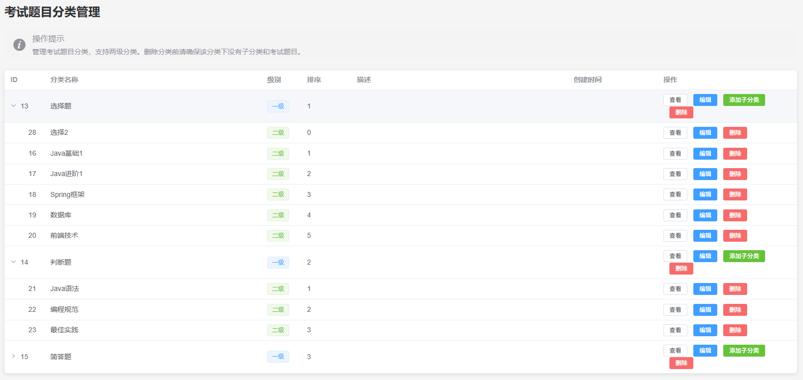

# 硅谷AI链习室- 题目类别管理篇

[TOC]

## 一、模块概述

题目类别管理是智能学习平台内容组织的核心模块，它负责对所有的题目进行系统化、层级化的分类。一个结构清晰的分类体系能够帮助管理员高效地管理题库，也便于后续智能组卷、按知识点练习等功能的实现。

本模块采用Spring Boot + MyBatis Plus技术栈，实现了对题目分类的增、删、改、查以及层级展示等全方位的管理功能。



### 核心功能特性

- **层级结构管理**：支持二级层级的分类，以树形结构清晰展示。
- **动态题目统计**：实时计算并展示每个分类下的题目数量。
- **操作安全校验**：删除分类时，自动检查其下是否存在子分类或题目，防止误删。
- **优雅的树形构建**：在服务端通过高效算法将列表数据转换为树形结构，减轻前端负担。

题目类别管理共包含以下5个核心接口：

1.  **获取分类列表** `GET /api/categories` - 获取所有题目分类列表，包含每个分类下的题目数量统计。
2.  **获取分类树** `GET /api/categories/tree` - 获取题目分类的树形层级结构，用于前端树形组件展示。
3.  **添加新分类** `POST /api/categories` - 创建新的题目分类，支持设置父分类实现层级结构。
4.  **更新分类信息** `PUT /api/categories` - 修改分类的名称、排序等信息。
5.  **删除分类** `DELETE /api/categories/{id}` - 删除指定的题目分类。

## 二、数据库表结构

### 2.1 题目分类表 (categories)

题目分类信息存储在`categories`表中，其核心是`parent_id`字段，通过它来建立分类之间的父子关系，从而构成整个分类树。

```sql
-- 摘自 exam_system_new.sql
CREATE TABLE `categories`  (
  `id` bigint NOT NULL AUTO_INCREMENT,
  `name` varchar(100) CHARACTER SET utf8mb4 COLLATE utf8mb4_0900_ai_ci NOT NULL,
  `parent_id` bigint NULL DEFAULT 0,
  `sort` int NULL DEFAULT 0,
  `create_time` timestamp NULL DEFAULT CURRENT_TIMESTAMP COMMENT '创建时间',
  `update_time` timestamp NULL DEFAULT CURRENT_TIMESTAMP ON UPDATE CURRENT_TIMESTAMP COMMENT '更新时间',
  `is_deleted` tinyint NULL DEFAULT 0 COMMENT '0-未删除，1-已删除',
  PRIMARY KEY (`id`) USING BTREE
) ENGINE = InnoDB COMMENT = '题目分类表';
```

**字段说明：**

-   `id`：主键，自增长的分类唯一标识。
-   `name`：分类名称，如“Java基础”、“Spring框架”等。
-   `parent_id`：父分类ID。如果为`0`，表示这是一个顶级（一级）分类。
-   `sort`：排序字段，数字越小显示越靠前，用于控制同级分类的显示顺序。
-   `is_deleted`采用逻辑删除而非物理删除，避免误删后数据无法恢复，同时保留历史数据用于统计分析（如 “已删除分类的题目迁移记录”）。
-   注意：一级分类（选择题、判断题、简单题）为业务基础分类，直接关联题目类型字段，因此不允许删除或修改，确保题库数据一致性。

## 三、实体类设计

### 3.1 题目分类实体类 (Category.java)

为了匹配数据库表结构和业务需求，我们设计了`Category`实体类。

```java
/**
 * 题目分类实体类
 */
@Data
@TableName("categories")
@Schema(description = "题目分类信息")
public class Category extends BaseEntity {
    
    @Schema(description = "分类名称", 
            example = "Java基础")
    private String name;  // 分类名称
    
    @Schema(description = "父分类ID，顶级分类为0", 
            example = "0")
    private Long parentId;  // 父分类ID，顶级分类为0
    
    @Schema(description = "排序序号，数字越小越靠前", 
            example = "1")
    private Integer sort;  // 排序字段
    
    @Schema(description = "子分类列表，用于构建分类树结构")
    @TableField(exist = false)
    private List<Category> children;  // 子分类列表，不映射到数据库

    @Schema(description = "该分类下的题目数量", 
            example = "25")
    @TableField(exist = false)
    private Long count;  // 题目数量，不映射到数据库
} 
```

**设计说明：**

* 添加了多表结果存储设计

-   `@TableName("categories")`：将实体类与数据库中的`categories`表进行映射。
-   `@TableField(exist = false)`：`children`和`count`字段是业务需要的数据，并不在数据库表`categories`中真实存在，因此使用此注解告诉MyBatis Plus不要将它们映射到数据库字段，避免查询和插入时出错。`children`用于构建树形结构，`count`用于存放该分类下的题目总数。

## 四、题目分类接口功能实现

### 4.1 获取分类列表接口（ GET /api/categories）

此接口用于获取所有分类的扁平列表，并为每个分类附带其下的题目数量。

#### 4.1.1 接口分析

**接口地址**:`/api/categories`

**请求方式**:`GET`

**请求参数**: 无

**响应参数**:

```json
{
  "code": 200,
  "message": "操作成功",
  "data": [
    {
      "id": 1,
      "name": "Java基础",
      "parentId": 0,
      "sort": 1,
      "children": null,
      "count": 50  # 题目数量
    }
  ]
}
```

#### 4.1.2 功能实现

该功能的实现分为三层：Controller -> Service -> Mapper。

*   **CategoryController.java**

    Controller层负责接收请求、调用Service层处理业务并返回统一格式的响应。

    ```java
    @RestController
    @RequestMapping("/api/categories")
    @Tag(name = "分类管理", description = "题目分类相关操作...")
    public class CategoryController {
    
        @Autowired
        private CategoryService categoryService;
    
        /**
         * 获取分类列表（包含题目数量）
         * @return 分类列表数据
         */
        @GetMapping
        @Operation(summary = "获取分类列表", description = "获取所有题目分类列表，包含每个分类下的题目数量统计")
        public Result<List<Category>> getCategories() {
            // 调用Service层获取处理后的数据
            List<Category> allCategories = categoryService.getAllCategories();
            // 封装成统一响应格式返回
            return Result.success(allCategories);
        }
    }
    ```

*   **CategoryServiceImpl.java**

    Service层是业务逻辑的核心，它需要组合调用Mapper层的功能来完成复杂的业务。在这里，它需要做两件事：1. 获取所有分类。2. 为每个分类填充题目数量。

    ```java
    @Service
    public class CategoryServiceImpl implements CategoryService {
    
        @Autowired
        private CategoryMapper categoryMapper;
    
        @Autowired
        private QuestionMapper questionMapper;
    
        @Override
        public List<Category> getAllCategories() {
            // 1. 获取所有分类的基础信息，并按sort字段排序
            List<Category> categories = categoryMapper.selectList(
                new LambdaQueryWrapper<Category>()
                    .orderByAsc(Category::getSort)
            );
            
            // 2. 为分类列表填充题目数量【进行子分类和count数量填充】
            fillQuestionCount(categories);
            
            return categories;
        }
    
        // 这是一个私有的辅助方法，用于填充题目数
        private void fillQuestionCount(List<Category> categories) {
            // 1. 一次性查询出所有分类的题目数量
             List<Map<Long, Object>> questionCountList = questionMapper.getCategoryQuestionCount();
            
            // 2. 将查询结果从 List<Map> 转换为 Map<categoryId, count>，便于快速查找
             Map<Long, Long> questionCountMap = questionCountList.stream().collect(Collectors.toMap(
                    map -> Long.valueOf(map.get("category_id").toString()),
                    map -> Long.valueOf(map.get("count").toString())
            ));
            
            // 3. 遍历分类列表，为每个分类设置其对应的题目数量
           categories.forEach(category -> {
                category.setCount(questionCountMap.getOrDefault(category.getId(),0L));
            });
        }
    }
    ```
    
*   **QuestionMapper.java**

    Mapper层负责与数据库直接交互。这里我们需要一个自定义的SQL查询来按分类统计题目数量。

    ```java
    @Mapper
    public interface QuestionMapper extends BaseMapper<Question> {
        
        /**
         * 获取每个分类的题目数量
         * @return 包含分类ID和题目数量的结果列表
         */
       @Select("SELECT category_id, COUNT(*) as count FROM questions where is_deleted = 0  GROUP BY category_id ; ")
        List<Map<Long, Object>> getCategoryQuestionCount();
    }
    ```

#### 4.1.3 知识点

- **业务分层思想**：Controller、Service、Mapper各司其职，是典型的三层架构思想。Controller负责调度，Service负责业务编排，Mapper负责数据访问，使得代码结构清晰，易于维护。

- **避免N+1查询问题**：在`fillQuestionCount`方法中，我们没有遍历分类列表然后逐个去查询每个分类的题目数（这会导致N+1次数据库查询，性能极差）。而是通过一次`GROUP BY`查询获取所有分类的题目总数，然后在内存中进行匹配。这是重要的性能优化技巧。

- **Java Stream API的使用**：我们使用了Java 8的Stream API将`List<Map<String, Object>>`高效地转换为了`Map<Long, Long>`。这种函数式编程风格让数据处理代码更简洁、易读。

  ```JAVA
  为什么用 Stream 流？
  传统做法需要循环遍历 List，逐个取出 Map 中的 category_id 和 count，手动转换类型后 put 到新 Map 中，代码繁琐且可读性低。而 Stream 流提供了更简洁的「声明式编程」方式，让我们只关注「做什么」，而非「怎么做」。
  Map<Long, Long> questionCountMap = questionCountList.stream()  // 1. 开启流
      .collect(Collectors.toMap(  // 2. 收集流元素，转换为 Map
          map -> Long.valueOf(map.get("category_id").toString()),  // 键的生成规则
          map -> Long.valueOf(map.get("count").toString())         // 值的生成规则
      ));
  ```

-   **MyBatis自定义SQL查询**：虽然MyBatis Plus提供了强大的CRUD功能，但对于复杂的统计查询，我们仍然需要借助`@Select`等注解编写自定义的SQL语句，这展示了MyBatis Plus的灵活性。

### 4.2 获取分类树接口（ GET /api/categories/tree）

此接口是分类管理的核心，它返回一个具有层级结构的树形数据，非常适合在前端UI（如Element Plus的`el-tree`组件）中进行展示。

#### 4.2.1 接口分析

**接口地址**:`/api/categories/tree`

**请求方式**:`GET`

**请求参数**: 无

**响应参数**:

```json
{
  "code": 200,
  "message": "操作成功",
  "data": [
    {
      "id": 1,
      "name": "Java技术",
      "parentId": 0,
      "sort": 1,
      "count": 85, // 父分类的count是所有子分类count的总和
      "children": [
        {
          "id": 4,
          "name": "Java基础",
          "parentId": 1,
          "sort": 1,
          "count": 50, // 自身的count
          "children": []
        },
        {
          "id": 5,
          "name": "Spring框架",
          "parentId": 1,
          "sort": 2,
          "count": 35,
          "children": []
        }
      ]
    }
  ]
}
```

#### 4.2.2 功能实现

* **CategoryController.java**

  ```java
  /**
    * 获取分类树形结构
    * @return 分类树数据
    */
  @GetMapping("/tree")  // 处理GET请求
  @Operation(summary = "获取分类树形结构", description = "获取题目分类的树形层级结构，用于前端树形组件展示")  // API描述
  public Result<List<Category>> getCategoryTree() {
      List<Category> categoryTreeList = categoryService.getCategoryTree();
      return Result.success(categoryTreeList);
  }
  ```

*   **CategoryService.java**

    类别接口规范方法！

    ```JAVA
    /**
      * 查询所有类别信息的树状集合，并按照sort字段排序
      * @return
    */
    List<Category> getCategoryTree();
    ```
    
*   **CategoryServiceImpl.java**

    构建树形结构是这里的核心和难点。我们需要将从数据库查出的扁平列表数据，在内存中高效地组装成树。

    ```java
    @Service
    public class CategoryServiceImpl implements CategoryService {
        // ... 已有的代码 ...
    
        /**
         * 查询所有类别信息的树状集合，并按照sort字段排序
         * @return
         */
        @Override
        public List<Category> getCategoryTree() {
            // 1. 获取所有分类，并按sort排序
            List<Category> allCategories = categoryMapper.selectList(
                    new LambdaQueryWrapper<Category>()
                            .orderByAsc(Category::getSort)
            );
    
            // 2. 为每个分类填充其自身的题目数量
            fillQuestionCount(allCategories);
            // 3. 构建树形结构并返回
            List<Category> buildTree = buildTree(allCategories);
            log.info("查询类别树状结构集合：{}",buildTree);
            return buildTree;
        }
    
        // 构建树形结构的私有辅助方法
        private List<Category> buildTree(List<Category> categories) {
            // 1. 使用Stream API按parentId进行分组，得到 Map<parentId, List<children>>
            Map<Long, List<Category>> childrenMap = categories.stream()
                    .collect(Collectors.groupingBy(Category::getParentId));
    
            /*
                stream()：把 List<Category> 转成 Stream 流，开启流式操作。
                Collectors.groupingBy：按指定规则分组，这里用方法引用 Category::getParentId ，提取分类的 parentId 作为分组 key，value 是对应 parentId 的分类列表，快速构建 父 ID - 子分类列表 映射。
             */
    
            // 2. 遍历所有分类，为它们设置children属性，并递归地累加题目数量
            categories.forEach(category -> {
                // 从Map中找到当前分类的所有子分类
                List<Category> children = childrenMap.getOrDefault(category.getId(), new ArrayList<>());
                category.setChildren(children);
    
                // 汇总子分类的题目数量到父分类
                long childrenQuestionCount = children.stream()
                        .mapToLong(c -> c.getCount() != null ? c.getCount() : 0L)
                        .sum();
                /*
                    forEach：遍历每个分类，对单个分类做处理，类似增强 for 循环，但结合 Stream 更灵活。
                    getOrDefault：从分组好的 childrenMap 取当前分类的子分类，无对应值时给默认空列表，避免空指针。
                    嵌套 stream().mapToLong().sum()：先转成 LongStream ，通过 mapToLong 处理 count （空值转 0 ），再用 sum 汇总子分类题目数，结合自身题目数，设置到当前分类，完成递归汇总逻辑。
                 */
    
                long selfQuestionCount = category.getCount() != null ? category.getCount() : 0L;
                // 父分类的总数 = 自身的题目数 + 所有子分类的题目数总和
                category.setCount(selfQuestionCount + childrenQuestionCount);
            });
    
            // 3. 最后，筛选出所有顶级分类（parentId为0），它们是树的根节点
            /*
                filter：按条件（parentId == 0 ）过滤分类，只保留顶级分类。
                collect(Collectors.toList())：把过滤后的 Stream 流转为 List ，作为分类树的根节点集合返回。
             */
            return categories.stream()
                    .filter(c -> c.getParentId() == 0)
                    .collect(Collectors.toList());
        }
    }
    ```

#### 4.2.3 知识点

- **递归与迭代思想**：构建树形结构是一个经典的数据结构问题。`buildTree`方法利用Map实现了高效的查找，避免了传统的双重循环或多次递归查询，性能更优。

- **空间换时间**：`childrenMap`的创建是典型的“空间换时间”策略。我们额外使用了一个Map的内存空间，来存储父子关系，从而将查找子节点的时间复杂度从O(N)降低到O(1)。

- **数据聚合**：在构建树的过程中，我们不仅建立了父子关系，还完成了题目数量的自底向上聚合计算。这种在一次遍历中完成多项任务的思路值得借鉴。

- **跨域问题：**

  当前接口前端调用没有走代理，所以需要再当前controller解决跨域问题！

  ``` java
  @CrossOrigin("*")
  @RestController  // REST控制器，返回JSON数据
  @RequestMapping("/api/categories")  // 分类API路径前缀
  @Tag(name = "分类管理", description = "题目分类相关操作，包括分类的增删改查、树形结构管理等功能")  // Swagger API分组
  public class CategoryController {
  ```

### 4.3 添加新分类接口（ POST /api/categories）

此接口用于创建一个新的题目分类。

#### 4.3.1 接口分析

**接口地址**:`/api/categories`

**请求方式**:`POST`

**请求体 (JSON)**:

```json
{
  "name": "微服务架构",
  "parentId": 3, // 父分类ID，如果是顶级分类则为0
  "sort": 5
}
```

**响应参数**:

```json
{
  "code": 200,
  "message": "操作成功",
  "data": null
}
```

#### 4.3.2 功能实现

*   **CategoryController.java**

    ```java
    @PostMapping
    @Operation(summary = "添加新分类", description = "创建新的题目分类，支持设置父分类实现层级结构")
    public Result<Void> addCategory(@RequestBody Category category) {
        categoryService.addCategory(category);
        return Result.success(null); // 通常创建操作成功后无需返回特定数据
    }
    ```

*   **CategoryService.java**

    ```java
    /**
      * 保存分类信息
      * @param category
      */
    void saveCategory(Category category);
    ```
    
*   **CategoryServiceImpl.java**

    ```java
    /**
      * 保存分类信息
      *   需要检查名称是否重复！
      * @param category
      */
    @Override
    public void saveCategory(Category category) {
        //1.判断同一个父类分类下不允许重名
        // parent_id = 传入 and name = 传入
        LambdaQueryWrapper<Category> lambdaQueryWrapper = new LambdaQueryWrapper<>();
        lambdaQueryWrapper.eq(Category::getParentId, category.getParentId());
        lambdaQueryWrapper.eq(Category::getName,category.getName());
        long count = count(lambdaQueryWrapper);// count 查询存在的数量
        //知识点： 我们可以在自己的service获取自己的mapper -> CategoryMapper baseMapper = getBaseMapper();
        if (count > 0) {
            Category parent = getById(category.getParentId());
            //不能添加，同一个父类下名称重复了
            throw new RuntimeException("在%s父分类下，已经存在名为：%s的子分类，本次添加失败！".formatted(parent.getName(),category.getName()));
        }
        //2.保存
        save(category);
    }
    ```

#### 4.3.3 知识点

-   **RESTful API设计**：使用`POST`方法表示“创建”资源，是RESTful风格的最佳实践。
-   **@RequestBody注解**：此注解告诉Spring MVC框架，将HTTP请求体中的JSON数据反序列化（转换）为`Category`对象。
-   **业务校验**：在Service层实现中，通常会在执行数据库操作前进行业务规则校验（如名称唯一性），以保证数据的完整性和正确性。

### 4.4 更新分类信息接口（ PUT /api/categories）

此接口用于修改一个已存在的分类信息。

#### 4.4.1 接口分析

**接口地址**:`/api/categories`

**请求方式**:`PUT`

**请求体 (JSON)**:

```json
{
  "id": 16, // 必须提供要更新的分类ID
  "name": "微服务技术",
  "parentId": 3,
  "sort": 6
}
```

**响应参数**:

```json
{
  "code": 200,
  "message": "操作成功",
  "data": null
}
```

#### 4.4.2 功能实现

* **CategoryController.java**

  ```java
  /**
    * 更新分类
    * @param category 分类对象
    * @return 操作结果
    */
  @PutMapping  // 处理PUT请求
  @Operation(summary = "更新分类信息", description = "修改分类的名称、描述、排序等信息")  // API描述
  public Result<Void> updateCategory(@RequestBody Category category) {
      categoryService.updateCategory(category);
      log.info("在{}父分类下，更新{}子分类成功！",category.getParentId(),category.getName());
      return Result.success("更新分类接口调用成功！");
  }
  ```

*   **CategoryServiceImpl.java**

    ```java
    @Service
    public class CategoryServiceImpl implements CategoryService {
        // ... 已有的代码 ...
    
          @Override
        public void updateCategory(Category category) {
            //1.先校验  同一父分类下！ 可以跟自己的name重复，不能跟其他的子分类name重复！
            LambdaQueryWrapper<Category> lambdaQueryWrapper = new LambdaQueryWrapper<>();
            lambdaQueryWrapper.eq(Category::getParentId, category.getParentId()); // 同一父分类下！
            lambdaQueryWrapper.ne(Category::getId, category.getId());
            lambdaQueryWrapper.eq(Category::getName, category.getName());
            CategoryMapper categoryMapper = getBaseMapper();
            boolean exists = categoryMapper.exists(lambdaQueryWrapper);
            if (exists) {
                Category parent = getById(category.getParentId());
                //不能添加，同一个父类下名称重复了
                throw new RuntimeException("在%s父分类下，已经存在名为：%s的子分类，本次更新失败！".formatted(parent.getName(),category.getName()));
            }
            //2.再更新
            updateById(category);
        }
    }
    ```

#### 4.4.3 知识点

-   **RESTful API设计**：使用`PUT`方法表示“更新”或“替换”一个完整的资源。
-   **幂等性**：`PUT`操作应该是幂等的，即无论调用一次还是多次，对资源产生的影响都是相同的。更新操作天然符合此特性。

### 4.5 删除分类接口（ DELETE /api/categories/{id}）

此接口用于删除一个分类。为保证数据完整性，删除前必须进行严格的检查。

#### 4.5.1 接口分析

**接口地址**:`/api/categories/{id}`

**请求方式**:`DELETE`

**路径参数**:

| 参数名 | 说明     | 数据类型 |
| :------- | :------- | :------- |
| `id`     | 分类ID | `Long`   |

**响应参数**:

```json
{
  "code": 200,
  "message": "操作成功",
  "data": null
}
```

#### 4.5.2 功能实现

*   **CategoryController.java**

    ```java
    @DeleteMapping("/{id}")
    @Operation(summary = "删除分类", description = "删除指定的题目分类，注意：删除前需确保分类下没有题目")
    public Result<Void> deleteCategory(@Parameter(description = "分类ID") @PathVariable Long id) {
        categoryService.deleteCategory(id);
        return Result.success(null);
    }
    ```

*   **CategoryServiceImpl.java**

    删除操作的业务逻辑相对复杂，需要进行前置检查。

    ```java
    @Service
    public class CategoryServiceImpl implements CategoryService {
        // ... 已有的代码 ...
    
        @Override
        public void deleteCategory(Long id) {
             //1.检查是否一级标题
            Category category = getById(id);
            if (category.getParentId() == 0){
                throw new RuntimeException("不能删除一级标题！");
            }
            //2.检查是否存在关联的题目
            LambdaQueryWrapper<Question> lambdaQueryWrapper = new LambdaQueryWrapper<>();
            lambdaQueryWrapper.eq(Question::getCategoryId,id);
            long count = questionMapper.selectCount(lambdaQueryWrapper);
            if (count>0){
                throw new RuntimeException("当前的:%s分类，关联了%s道题目,无法删除！".formatted(category.getName(),count));
            }
            //3.以上不都不满足，删除即可【子关联数据，一并删除】
            removeById(id);
        }
    }
    ```

#### 4.5.3 知识点

-   **路径参数@PathVariable**：用于从URL路径中（如`/api/categories/16`）提取变量值。
-   **防御性编程**：在执行删除这种破坏性操作前，进行充分的校验（检查子分类、检查关联数据）是保证系统健壮性的重要手段。通过抛出运行时异常`RuntimeException`来中断操作并向前端返回错误信息。
-   **LambdaQueryWrapper**：MyBatis Plus提供的Lambda风格的查询构造器，相比于字符串拼接SQL，它更安全（防止SQL注入）、更易读，并且有编译时检查，是推荐的查询方式。

## 五、前后端接口对接

完成上述后端接口后，即可启动后端服务，并与前端管理页面进行对接测试，验证各个功能的正确性。

启动前端程序：

```bash
npm run dev
```
