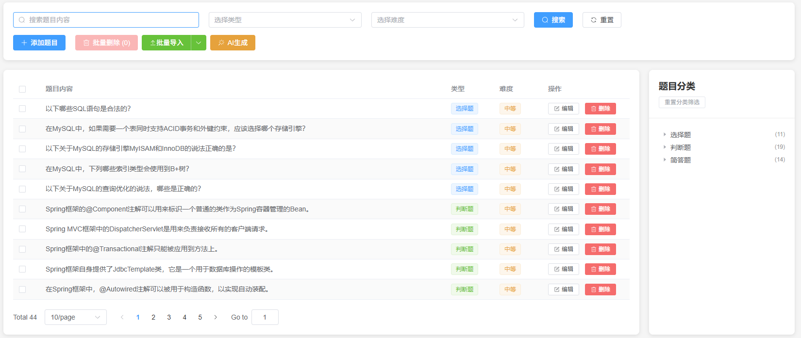
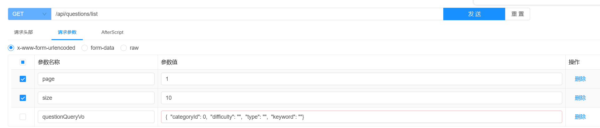
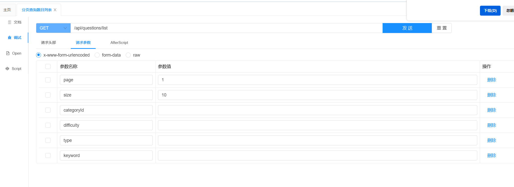

# 硅谷AI链习室- 题目管理篇

[TOC]

## 一、模块概述

题目管理是智能学习平台的核心，它负责题库中所有试题的生命周期管理，包括题目的创建、查询、更新和删除。一个功能完善、接口设计优良的题目管理模块，是实现智能组卷、在线考试、练习评估等上层业务的基础。

本模块基于Spring Boot + MyBatis Plus技术栈，提供了一套完整的RESTful API，用于对题目资源进行精细化操作。



### 核心功能特性

- **全生命周期管理**：提供对题目的增、删、改、查（CRUD）完整操作。
- **多维度组合查询**：支持按题目类别、难度、题型、关键词进行灵活的筛选和分页查询。
- **多种题型支持**：内置支持选择题（CHOICE）、判断题（JUDGE）、简答题（TEXT）等多种题型，并具备良好的扩展性。
- **事务性操作**：对题目的创建和更新操作采用事务管理，确保题目主体、选项、答案数据的完整性和一致性。
- **高性能查询优化**：通过批量加载和缓存技术，有效解决N+1查询问题，提升复杂查询场景下的性能。
- **智能化功能**：包含随机抽题、热门题目推荐等高级功能，为智能组卷和个性化学习提供支持。

## 二、数据库表结构与实体类

题目模块的数据分散在三张表中：`questions`（题目主表）、`question_choices`（选择题选项表）和`question_answers`（题目答案表），通过外键`question_id`进行关联。

### 2.1 数据库表

**题目主表 (questions)**
```sql
CREATE TABLE `questions`  (
  `id` bigint NOT NULL AUTO_INCREMENT,
  `title` text CHARACTER SET utf8mb4 COLLATE utf8mb4_0900_ai_ci NOT NULL,
  `type` varchar(20) CHARACTER SET utf8mb4 COLLATE utf8mb4_0900_ai_ci NOT NULL,
  `multi` tinyint(1) NULL DEFAULT 0,
  `category_id` bigint NOT NULL,
  `difficulty` varchar(10) CHARACTER SET utf8mb4 COLLATE utf8mb4_0900_ai_ci NOT NULL,
  `score` int NULL DEFAULT 5,
  `analysis` text CHARACTER SET utf8mb4 COLLATE utf8mb4_0900_ai_ci NULL,
  `create_time` timestamp NULL DEFAULT CURRENT_TIMESTAMP COMMENT '创建时间',
  `update_time` timestamp NULL DEFAULT CURRENT_TIMESTAMP ON UPDATE CURRENT_TIMESTAMP COMMENT '更新时间',
  `is_deleted` tinyint NULL DEFAULT 0 COMMENT '0-未删除，1-已删除',
  PRIMARY KEY (`id`) USING BTREE
) ENGINE = InnoDB AUTO_INCREMENT = 65 CHARACTER SET = utf8mb4 COLLATE = utf8mb4_0900_ai_ci ROW_FORMAT = DYNAMIC;

/*
(11, '数据库类型介绍', 'CHOICE', 0, 19, 'MEDIUM', 5, '数据库的数据类型', '2025-06-23 23:07:00', '2025-06-23 23:07:00');
(12, 'Java不是世界上最好的语言！', 'JUDGE', 0, 21, 'HARD', 5, 'java 是世界上最好的语言！', '2025-06-23 23:07:35', '2025-06-23 23:07:35');
(14, '说一说什么是SpringIoC', 'TEXT', 0, 24, 'MEDIUM', 5, '核心容器！', '2025-06-23 23:08:38', '2025-06-23 23:08:38');
*/
```

**题目选项表 (question_choices)**
```sql
CREATE TABLE `question_choices`  (
  `id` bigint NOT NULL AUTO_INCREMENT,
  `question_id` bigint NOT NULL,
  `content` text CHARACTER SET utf8mb4 COLLATE utf8mb4_0900_ai_ci NOT NULL,
  `is_correct` tinyint(1) NULL DEFAULT 0,
  `sort` int NULL DEFAULT 0,
  `create_time` timestamp NULL DEFAULT CURRENT_TIMESTAMP COMMENT '创建时间',
  `update_time` timestamp NULL DEFAULT CURRENT_TIMESTAMP ON UPDATE CURRENT_TIMESTAMP COMMENT '更新时间',
  `is_deleted` tinyint NULL DEFAULT 0 COMMENT '0-未删除，1-已删除',
  PRIMARY KEY (`id`) USING BTREE
) ENGINE = InnoDB AUTO_INCREMENT = 62 CHARACTER SET = utf8mb4 COLLATE = utf8mb4_0900_ai_ci ROW_FORMAT = DYNAMIC;
/*
  INSERT INTO `question_choices` VALUES (42, 60, 'PRIMARY KEY', 1, 1);
  INSERT INTO `question_choices` VALUES (43, 60, 'SECONDARY KEY', 1, 2);
  INSERT INTO `question_choices` VALUES (44, 60, 'FULLTEXT', 0, 3);
  INSERT INTO `question_choices` VALUES (45, 60, 'HASH', 0, 4);
*/
```

**题目答案表 (question_answers)**

```sql
CREATE TABLE `question_answers`  (
  `id` bigint NOT NULL AUTO_INCREMENT,
  `question_id` bigint NOT NULL,
  `answer` text CHARACTER SET utf8mb4 COLLATE utf8mb4_0900_ai_ci NOT NULL,
  `keywords` text CHARACTER SET utf8mb4 COLLATE utf8mb4_0900_ai_ci NULL,
  `create_time` timestamp NULL DEFAULT CURRENT_TIMESTAMP COMMENT '创建时间',
  `update_time` timestamp NULL DEFAULT CURRENT_TIMESTAMP ON UPDATE CURRENT_TIMESTAMP COMMENT '更新时间',
  `is_deleted` tinyint NULL DEFAULT 0 COMMENT '0-未删除，1-已删除',
  PRIMARY KEY (`id`) USING BTREE
) ENGINE = InnoDB AUTO_INCREMENT = 59 CHARACTER SET = utf8mb4 COLLATE = utf8mb4_0900_ai_ci ROW_FORMAT = DYNAMIC;

/*
INSERT INTO `question_answers` VALUES (1, 3, 'TRUE', 'interface,public');
INSERT INTO `question_answers` VALUES (2, 4, 'IoC is Inversion of Control', 'IoC,control,Spring');
INSERT INTO `question_answers` VALUES (3, 9, 'A,D', NULL);
INSERT INTO `question_answers` VALUES (4, 10, 'A,B', NULL);
*/
```

### 2.2 实体类

**题目实体类 (Question.java)**
```java
/**
 * 题目实体类 - 考试题目信息模型
 * 
 * 这是系统的核心实体类之一，用于存储各种类型的考试题目
 * 
 * MyBatis Plus高级特性教学：
 * 1. @TableField(exist = false)：标记非数据库字段，用于关联查询结果
 * 2. FieldFill.INSERT/INSERT_UPDATE：自动填充创建和更新时间
 * 3. 实体类关联：通过@TableField(exist = false)实现多表关联
 * 
 * 业务设计：
 * - 支持多种题型：选择题(CHOICE)、判断题(JUDGE)、简答题(TEXT)
 * - 支持难度分级：简单(EASY)、中等(MEDIUM)、困难(HARD)
 * - 支持分类管理：通过categoryId关联分类表
 */
@Data  // Lombok注解：自动生成所有getter、setter方法
@TableName("questions")  // 对应数据库表：questions
@Schema(description = "题目信息")
public class Question extends BaseEntity {
    
    @Schema(description = "题目标题内容", 
            example = "以下关于Java面向对象编程的说法正确的是？")
    private String title;
    
    @Schema(description = "题目类型", 
            example = "CHOICE", 
            allowableValues = {"CHOICE", "JUDGE", "TEXT"})
    private String type;
    
    @Schema(description = "是否为多选题，仅选择题有效", 
            example = "false")
    private Boolean multi;
    
    @Schema(description = "题目分类ID", 
            example = "1")
    private Long categoryId;
    
    @Schema(description = "题目难度等级", 
            example = "MEDIUM", 
            allowableValues = {"EASY", "MEDIUM", "HARD"})
    private String difficulty;
    
    @Schema(description = "题目默认分值", 
            example = "5")
    private Integer score;
    
    @Schema(description = "在特定试卷中的分值", 
            example = "10.0")
    @TableField(exist = false)  // 标记为非数据库字段
    private BigDecimal paperScore;
    
    @Schema(description = "题目解析，详细的答案说明", 
            example = "Java是面向对象编程语言，支持封装、继承、多态三大特性...")
    private String analysis;

    //多表
    @Schema(description = "选择题选项列表，包含A、B、C、D等选项")
    @TableField(exist = false)
    private List<QuestionChoice> choices;

    //多表
    @Schema(description = "题目答案信息，包含正确答案和评分标准")
    @TableField(exist = false)
    private QuestionAnswer answer;

    //多表
    @Schema(description = "题目所属分类信息")
    @TableField(exist = false)
    private Category category;
} 
```

**题目选项实体类 (QuestionChoice.java)**
```java
/**
 * 题目选项实体类 - 选择题的选项信息
 */
@Data
@TableName("question_choices")
@Schema(description = "题目选项信息")
public class QuestionChoice extends BaseEntity{

    
    @Schema(description = "关联的题目ID", 
            example = "1")
    private Long questionId;  // 题目ID
    
    @Schema(description = "选项内容", 
            example = "Java是面向对象编程语言")
    private String content;  // 选项内容
    
    @Schema(description = "是否为正确答案", 
            example = "true")
    private Boolean isCorrect;  // 是否正确答案
    
    @Schema(description = "选项排序序号", 
            example = "1")
    private Integer sort;  // 排序
} 
```

**题目答案实体类 (QuestionAnswer.java)**
```java
@Data
@TableName("question_answers")
@Schema(description = "题目答案信息")
public class QuestionAnswer  extends BaseEntity{

    @Schema(description = "关联的题目ID", 
            example = "1")
    private Long questionId;  // 题目ID
    
    @Schema(description = "标准答案内容", 
            example = "正确")
    private String answer;  // 答案内容
    
    @Schema(description = "评分关键词，用于简答题AI评分", 
            example = "面向对象,封装,继承,多态")
    private String keywords;  // 关键词（用于简答题评分）
} 
```

## 三、题目管理接口功能实现

### 3.1 分页查询题目列表（GET /api/questions/list）

#### 3.1.1 接口分析

**功能描述**: 根据传入的多个筛选条件，返回分页后的题目列表。结果中需包含题目的选项和答案等详细信息。

**接口地址**:`/api/questions/list`

**请求方式**:`GET`

**请求数据类型**:`application/x-www-form-urlencoded`

**响应数据类型**:`*/*`

**接口描述**:<p>支持按分类、难度、题型、关键词进行多条件筛选的分页查询</p>

**请求参数**:

| 参数名称   | 参数说明                                | 请求类型 | 是否必须 | 数据类型       | schema |
| ---------- | --------------------------------------- | -------- | -------- | -------------- | ------ |
| page       | 当前页码，从1开始                       | query    | false    | integer(int32) |        |
| size       | 每页显示数量                            | query    | false    | integer(int32) |        |
| categoryId | 分类ID筛选条件                          | query    | false    | integer(int64) |        |
| difficulty | 难度筛选条件，可选值：EASY/MEDIUM/HARD  | query    | false    | string         |        |
| type       | 题型筛选条件，可选值：CHOICE/JUDGE/TEXT | query    | false    | string         |        |
| keyword    | 关键词搜索，对题目标题进行模糊查询      | query    | false    | string         |        |

**响应数据**:

```json
{
    "code": 200,
    "message": "操作成功",
    "data": {
        "records": [
            {
                "id": 63,
                "title": "以下哪些SQL语句是合法的？",
                "type": "CHOICE",
                "multi": true,
                "categoryId": 16,
                "difficulty": "MEDIUM",
                "score": 5,
                "analysis": "前两个选项中的SQL语句均是合法的，分别用于查询、更新数据。第三个选项中的SQL语句'DELETE FROM users WHERE name = 'John' OR delete_flag = 1'是非法的，因为DELETE语句不支持条件中的OR逻辑。最后一个选项中的INSERT语句是合法的，用于插入数据。",
                "createTime": "2025-07-18T10:59:04",
                "updateTime": "2025-07-18T10:59:04",
                "choices": [
                    {
                        "id": 54,
                        "questionId": 63,
                        "content": "SELECT * FROM users WHERE email LIKE '%@example.com'",
                        "isCorrect": true,
                        "sort": 1
                    },
                    {
                        "id": 55,
                        "questionId": 63,
                        "content": "UPDATE users SET age = age + 1 WHERE id = 1",
                        "isCorrect": true,
                        "sort": 2
                    },
                    {
                        "id": 56,
                        "questionId": 63,
                        "content": "DELETE FROM users WHERE name = 'John' OR delete_flag = 1",
                        "isCorrect": false,
                        "sort": 3
                    },
                    {
                        "id": 57,
                        "questionId": 63,
                        "content": "INSERT INTO users (name, email) VALUES ('Jane', 'jane@example.com')",
                        "isCorrect": true,
                        "sort": 4
                    }
                ],
                "answer": {
                    "id": 57,
                    "questionId": 63,
                    "answer": "A,B,D"
                }
            },
            {
                "id": 59,
                "title": "Spring框架的@Component注解可以用来标识一个普通的类作为Spring容器管理的Bean。",
                "type": "JUDGE",
                "multi": false,
                "categoryId": 21,
                "difficulty": "MEDIUM",
                "score": 5,
                "analysis": "这个陈述是正确的。Spring框架中的@Component注解被用来标识一个普通的类成为Spring容器的Bean。它是一个泛化的形式，可以被更具体的注解如@Service、@Controller、@Repository等替代，这些注解都间接继承自@Component。",
                "createTime": "2025-07-09T17:51:22",
                "updateTime": "2025-07-09T17:51:22",
                "answer": {
                    "id": 53,
                    "questionId": 59,
                    "answer": "TRUE"
                }
            },
            {
                "id": 54,
                "title": "Spring MVC框架中的DispatcherServlet是用来负责接收所有的客户端请求。",
                "type": "JUDGE",
                "multi": false,
                "categoryId": 21,
                "difficulty": "MEDIUM",
                "score": 5,
                "analysis": "在Spring MVC框架中，DispatcherServlet是前端控制器，它负责接收所有的请求然后决定请求应该发送到哪个处理器上，因此这个陈述是正确的。",
                "createTime": "2025-07-09T17:51:22",
                "updateTime": "2025-07-09T17:51:22",
                "answer": {
                    "id": 48,
                    "questionId": 54,
                    "answer": "TRUE"
                }
            },
            {
                "id": 39,
                "title": "Spring MVC在SSM框架中扮演什么角色？",
                "type": "TEXT",
                "multi": false,
                "categoryId": 24,
                "difficulty": "MEDIUM",
                "score": 5,
                "analysis": "Spring MVC框架在SSM中作为模型（Model）、视图（View）和控制器（Controller）的中介，它处理用户的HTTP请求，并返回响应，是实现Web应用的核心组件之一。",
                "createTime": "2025-06-25T09:08:54",
                "updateTime": "2025-06-25T09:08:54",
                "answer": {
                    "id": 33,
                    "questionId": 39,
                    "answer": "Spring MVC负责处理Web应用中的请求和响应，实现Web层的MVC模式，提供路由、分发、数据绑定等功能。"
                }
            }
        ],
        "total": 44,
        "size": 10,
        "current": 1,
        "orders": [],
        "optimizeCountSql": true,
        "searchCount": true,
        "pages": 5
    }
}
```

#### 3.1.2 功能实现

- **配置Mybatis-Plus分页插件**

  在**项目**中的`com.atguigu.exam.config.MybatisPlusConfiguration`中增加如下内容：

  ```java
  @Bean
  public MybatisPlusInterceptor mybatisPlusInterceptor() {
      MybatisPlusInterceptor interceptor = new MybatisPlusInterceptor();
      interceptor.addInnerInterceptor(new PaginationInnerInterceptor(DbType.MYSQL));
      return interceptor;
  }
  ```

- **Mybatis-Plus分页插件注意事项**

  使用Mybatis-Plus的分页插件进行分页查询时，若查询语句中包含一对多的查询，只能使用**[嵌套查询（Nested Select for Collection）](https://mybatis.org/mybatis-3/sqlmap-xml.html#nested-select-for-collection)**，而不能使用**[嵌套结果映射（Nested Results for Collection）](https://mybatis.org/mybatis-3/sqlmap-xml.html#nested-results-for-collection)**。

  嵌套结果用多表连查，一对多关系会导致主数据重复出现（比如 1 道题对应 3 个选项，连查后会生成 3 条包含这道题的记录）。而分页插件是按 “记录条数” 分页的，它会把这些重复记录当成不同的主数据，导致分页结果和实际需要的主数据数量对不上。

  **举例说明**

  假设要查 “第 1 页，每页 10 道题”，且每道题平均有 3 个选项：

  **用嵌套结果映射（多表连查）：**

  1. 连查后，10 道题会变成 30 条记录（每道题重复 3 次，对应 3 个选项）；
  2. 分页插件按 “30 条记录” 分页，取前 10 条 → 这 10 条记录实际只对应 3-4 道题（每道题占 3 条记录）；
  3. 结果：本想查 10 道题，实际只返回了 3-4 道，分页完全错误。

  **用嵌套查询（分步查）：**

  1. 先查题目表，分页插件直接取前 10 道题（无重复，准确）；
  2. 再用这 10 道题的 ID 查对应的选项，组装后返回 → 正好 10 道题，每道题带 3 个选项；
  3. 结果：符合预期，分页正确。

- **修改和定义接收参数vo**

  > 常见的领域模型介绍请看扩展文档！

  在项目下创建vo,接收前端传递的四个参数： com.atguigu.exam.vo.QuestionQueryVo

  ```java
  @Data
  public class QuestionQueryVo {
  
      //@Parameter(description = "分类ID筛选条件") @RequestParam(required = false)
      private Long categoryId;
      //@Parameter(description = "难度筛选条件，可选值：EASY/MEDIUM/HARD") @RequestParam(required = false)
      private String difficulty;
      //@Parameter(description = "题型筛选条件，可选值：CHOICE/JUDGE/TEXT") @RequestParam(required = false)
      private String type;
      //@Parameter(description = "关键词搜索，对题目标题进行模糊查询") @RequestParam(required = false)
      private String keyword;
  }
  ```

- **修改controller接收参数方式**

  **原结构**

  ``` java
   @GetMapping("/list")  // 映射GET请求到/api/questions/list
      @Operation(summary = "分页查询题目列表", description = "支持按分类、难度、题型、关键词进行多条件筛选的分页查询")  // Swagger接口描述
      public Result<Page<Question>> getQuestionList(
              @Parameter(description = "当前页码，从1开始", example = "1") @RequestParam(defaultValue = "1") Integer page,  // 参数描述
              @Parameter(description = "每页显示数量", example = "10") @RequestParam(defaultValue = "10") Integer size,
              @Parameter(description = "分类ID筛选条件") @RequestParam(required = false) Long categoryId,
              @Parameter(description = "难度筛选条件，可选值：EASY/MEDIUM/HARD") @RequestParam(required = false) String difficulty,
              @Parameter(description = "题型筛选条件，可选值：CHOICE/JUDGE/TEXT") @RequestParam(required = false) String type,
              @Parameter(description = "关键词搜索，对题目标题进行模糊查询") @RequestParam(required = false) String keyword) {  	
      }
  ```

  参数太乱，也不方便向后传递！

  **新结构**

  ```java
  @GetMapping("/list")  // 映射GET请求到/api/questions/list
  @Operation(summary = "分页查询题目列表", description = "支持按分类、难度、题型、关键词进行多条件筛选的分页查询")  // Swagger接口描述
  public Result<Page<Question>> getQuestionList(
      @Parameter(description = "当前页码，从1开始", example = "1") @RequestParam(defaultValue = "1") Integer page,  // 参数描述
      @Parameter(description = "每页显示数量", example = "10") @RequestParam(defaultValue = "10") Integer size,
      QuestionQueryVo questionQueryVo) {
  }
  ```

- **实现方案1： 嵌套查询**

  - **QuestionController**

    ```JAVA
    /**
      * 分页查询题目列表（支持多条件筛选）
      * @param page 当前页码，从1开始，默认第1页
      * @param size 每页显示数量，默认10条
      * @return 封装的分页查询结果，包含题目列表和分页信息
      */
    @GetMapping("/list")  // 映射GET请求到/api/questions/list
    @Operation(summary = "分页查询题目列表", description = "支持按分类、难度、题型、关键词进行多条件筛选的分页查询")  // Swagger接口描述
    public Result<Page<Question>> getQuestionList(
        @Parameter(description = "当前页码，从1开始", example = "1") @RequestParam(defaultValue = "1") Integer page,  // 参数描述
        @Parameter(description = "每页显示数量", example = "10") @RequestParam(defaultValue = "10") Integer size,
        QuestionPageVo questionQueryVo) {
        // 返回统一格式的成功响应
        Page<Question> pageBean = new Page<>(page, size);
        questionService.customPageService(pageBean,questionQueryVo);
        //questionService.customPageJavaService(pageBean,questionPageVo);
        log.info("分页查询数据成功！total为：{},数据为：{}" ,pageBean.getTotal(),pageBean.getRecords());
        return Result.success(pageBean);
    }
    ```

  - **QuestionService**

    ```java
    /**
      * 分页查询题目数据
      * @param pageBean
      * @param questionPageDto
      */
    void customPageService(Page<Question> pageBean, QuestionPageVo questionPageVo);
    ```

  - **QuestionServiceImpl**

    ```java
    @Autowired
    private PaperQuestionMapper paperQuestionMapper;
    
    @Override
    public void customPageService(Page<Question> pageBean, QuestionPageVo questionQueryVo) {
        questionMapper.customPage(pageBean,questionQueryVo);
    }
    ```

  - **QuestionMapper**

    ```java 
    /**
      * 分页查询题目信息，第一步！一会要触发，根据题目id查询选项！！
      * @param page 分页对象
      * @param questionQueryVo 自己实体类,封装的查询对象！
      * @return
      */
    IPage<Question> customPage(IPage page, @Param("queryVo") QuestionPageVo questionQueryVo);
    ```

  - **QuestionMapper.xml**

    ```xml
    <resultMap id="questionMap" type="com.atguigu.exam.entity.Question">
        <id column="id" property="id" />
        <association property="answer" javaType="com.atguigu.exam.entity.QuestionAnswer">
            <id column="qas_id" property="id" />
            <result column="qas_create_time" property="createTime" />
            <result column="qas_update_time" property="updateTime" />
            <result column="id" property="questionId" />
        </association>
        <collection property="choices" ofType="com.atguigu.exam.entity.QuestionChoice"
                    column="id" select="com.atguigu.exam.mapper.QuestionChoiceMapper.selectListByQuestionId" />
    </resultMap>
    
    <select id="customPage" resultMap="questionMap">
        select
        qs.*,
        qas.id qas_id,
        qas.answer,
        qas.keywords,
        qas.create_time qas_create_time,
        qas.update_time qas_update_time
        from questions qs left join question_answers qas on qs.id = qas.question_id
        where qs.is_deleted = 0 and qas.is_deleted = 0
        <if test="queryVo.type != null and queryVo.type != ''">
            and qs.type = #{queryVo.type}
        </if>
        <if test="queryVo.difficulty != null and queryVo.difficulty != ''">
            and qs.difficulty = #{queryVo.difficulty}
        </if>
        <if test="queryVo.categoryId != null">
            and qs.category_id = #{queryVo.categoryId}
        </if>
        <if test="queryVo.keyword != null and queryVo.keyword != ''">
            and title like concat('%',#{queryVo.keyword},'%')
        </if>
        order by qs.create_time desc 
    </select>
    ```

  - **QuestionChoiceMapper**

    ``` java
    /**
     * 题目选项
     */
    public interface QuestionChoiceMapper extends BaseMapper<QuestionChoice> {
    
        //第二步：根据题目id查询对应的选项集合
        @Select("select * from question_choices where is_deleted = 0 and question_id = #{questionId} order by sort asc ;")
        List<QuestionChoice> selectListByQuestionId(Long questionId);
    } 
    ```

  - **修改application关于mybatis-plus的配置参数**

    ``` yml
    #用于打印框架生成的sql语句，便于调试
    mybatis-plus:
      configuration:
        log-impl: org.apache.ibatis.logging.stdout.StdOutImpl
        auto-mapping-behavior: full #开启嵌套自动映射
        map-underscore-to-camel-case: true
    ```

- **实现方案2： Java代码+Stream流处理**

  - **QuestionController**

    ``` java
    /**
      * 分页查询题目列表（支持多条件筛选）
      * 
      * @param page 当前页码，从1开始，默认第1页
      * @param size 每页显示数量，默认10条
      * @return 封装的分页查询结果，包含题目列表和分页信息
      */
    @GetMapping("/list")  // 映射GET请求到/api/questions/list
    @Operation(summary = "分页查询题目列表", description = "支持按分类、难度、题型、关键词进行多条件筛选的分页查询")  // Swagger接口描述
    public Result<Page<Question>> getQuestionList(
        @Parameter(description = "当前页码，从1开始", example = "1") @RequestParam(defaultValue = "1") Integer page,  // 参数描述
        @Parameter(description = "每页显示数量", example = "10") @RequestParam(defaultValue = "10") Integer size,
        QuestionPageVo questionPageVo) {
        // 返回统一格式的成功响应
        Page<Question> pageBean = new Page<>(page, size);
        questionService.customPageJavaService(pageBean,questionPageVo);
        log.info("分页查询数据成功！total为：{},数据为：{}" ,pageBean.getTotal(),pageBean.getRecords());
        return Result.success(pageBean);
    }
    ```

  - **QuestionService**

    ```java
    /**
      * Java代码进行数据拼装！ 1+n -> 1+1+1  1
      * @param pageBean
      * @param questionPageVo
      */
    void customPageJavaService(Page<Question> pageBean, QuestionPageVo questionPageVo);
    ```

  - **QuestionServiceImpl.java**

    ``` java
    @Override
    public void customPageJavaService(Page<Question> pageBean, QuestionPageVo questionPageVo) {
      //1.分页查询题目列表（多条件）
      LambdaQueryWrapper<Question> lambdaQueryWrapper = new LambdaQueryWrapper<>();
      lambdaQueryWrapper.eq(!ObjectUtils.isEmpty(questionPageVo.getType()),Question::getType,questionPageVo.getType());
      lambdaQueryWrapper.eq(!ObjectUtils.isEmpty(questionPageVo.getDifficulty()),Question::getDifficulty,questionPageVo.getDifficulty());
      lambdaQueryWrapper.eq(!ObjectUtils.isEmpty(questionPageVo.getCategoryId()),Question::getCategoryId,questionPageVo.getCategoryId());
      lambdaQueryWrapper.like(!ObjectUtils.isEmpty(questionPageVo.getKeyword()),Question::getTitle,questionPageVo.getKeyword());
        //时间的倒序排序！！
        lambdaQueryWrapper.orderByDesc(Question::getCreateTime);
        page(pageBean,lambdaQueryWrapper);
        //2.提取一个方法， 给题目进行选项和答案装填（热门题目也需要所以提取方法）
        fillQuestionChoiceAndAnswer(pageBean.getRecords());
    }
    ```

    定义答案和选项填充方法，热门题目也需要所以提取方法！

    ``` java
    private void fillQuestionChoiceAndAnswer(List<Question> questionList) {
        //1. 非空判断
        if (questionList == null || questionList.size() == 0) {
            log.debug("没有查询对应的问题集合数据！！");
            return;
        }
        //2. 查询所有答案和选项 
        //优化查询本次题目的答案和选项
        //查询本地题目集合对应的id集合！！
        List<Long> ids = questionList.stream().map(Question::getId).collect(Collectors.toList());
        //查询本次题目的选项集合
        List<QuestionChoice> questionChoiceList =
            questionChoiceMapper.selectList(new LambdaQueryWrapper<QuestionChoice>().in(QuestionChoice::getQuestionId,ids));
        //查询本次题目的答案
        List<QuestionAnswer> questionAnswers =
            questionAnswerMapper.selectList(new LambdaQueryWrapper<QuestionAnswer>().in(QuestionAnswer::getQuestionId,ids));
        //3. 答案和选项进行map转化
        Map<Long, List<QuestionChoice>> questionChoiceMap =
            questionChoiceList.stream().collect(Collectors.groupingBy(QuestionChoice::getQuestionId));
        Map<Long, QuestionAnswer> answerMap =
            questionAnswers.stream().collect(Collectors.toMap(QuestionAnswer::getQuestionId, a -> a));
        //4. 循环问题集合，进行选项和答案配置
        questionList.forEach(question -> {
            //每个题目一定答案
            question.setAnswer(answerMap.get(question.getId()));
            //选择题才有选项
            if ("CHOICE".equals(question.getType())){
                List<QuestionChoice> questionChoices = questionChoiceMap.get(question.getId());
                questionChoices.sort(Comparator.comparingInt(QuestionChoice::getSort));
                question.setChoices(questionChoices);
            }
        });
    }
    ```


#### 3.1.3 技术点

默认情况下Knife4j为该接口生成的接口文档如下图所示，其中的queryVo参数错误会被误识别成json格式！



可在application.yml文件中增加如下配置，将queryVo做打平处理

```yml
springdoc:
  default-flat-param-object: true
```

将`spring.default-flat-param-object`参数设置为`true`后，效果如下。



### 3.2 根据ID查询题目详情（GET /api/questions/{id}）

#### 3.2.1 接口分析

**接口地址**:`/api/questions/{id}`

**请求方式**:`GET`

**请求数据类型**:`application/x-www-form-urlencoded`

**响应数据类型**:`*/*`

**接口描述**:<p>获取指定ID的题目完整信息，包括题目内容、选项、答案等详细数据</p>

**请求参数**:

| 参数名称 | 参数说明 | 请求类型 | 是否必须 | 数据类型       | schema |
| -------- | -------- | -------- | -------- | -------------- | ------ |
| id       | 题目ID   | path     | true     | integer(int64) |        |

**响应数据**:

```json
{
	"code": 200,
	"message": "操作成功",
	"data": {
		"id": 0,
		"title": "以下关于Java面向对象编程的说法正确的是？",
		"type": "CHOICE",
		"multi": false,
		"categoryId": 1,
		"difficulty": "MEDIUM",
		"score": 5,
		"paperScore": 10,
		"analysis": "Java是面向对象编程语言，支持封装、继承、多态三大特性...",
		"choices": [
			{
				"id": 0,
				"createTime": "",
				"isDeleted": "",
				"questionId": 1,
				"content": "Java是面向对象编程语言",
				"isCorrect": true,
				"sort": 1
			}
		],
		"answer": {
			"id": 0,
			"createTime": "",
			"isDeleted": "",
			"questionId": 1,
			"answer": "正确",
			"keywords": "面向对象,封装,继承,多态"
		}
    }    
}
```

#### 3.2.2 分析和缓存应用

业务需求：实现一个高效的热门题目排行榜，能够实时更新，并快速查询。

技术选型：Redis的有序集合（Sorted Set）是实现此类需求的完美工具。

数据结构：我们使用一个Redis Key（例如`popular_questions:zset`）来存储排行榜。

- **Member**: 题目ID (`questionId`)
- **Score**: 题目的热度值（访问次数）

热度累加：当用户访问某个题目的详情页时（即调用`GET /api/questions/{id}`接口），在Service层中异步地对该题目的热度进行累加。调用Redis的`ZINCRBY popular_questions:zset 1 member_id`命令。此命令会将指定`member_id`（即题目ID）的`score`加1。如果该member不存在，会自动创建并设置score为1。操作是原子性的，且效率极高。

**优雅降级**：首先尝试从Service获取热门题目。如果因为缓存为空或数据不足，返回的列表数量小于请求的`size`，它不会直接返回，而是会计算出还差多少个题目(`needMore`)，然后去数据库查询最新的题目作为补充，确保前端总能拿到足够数量的数据。

```
┌───────────┐          ┌───────────┐          ┌───────────┐
│   用户     │          │ 应用服务器 │          │   Redis    │
└─────┬─────┘          └──────┬────┘          └────── ┬────┘
      │                       │                       │
      │ 1. 访问题目详情         │                       │
      ├───────────────────────>                       │
      │                       │ 2. ZSet热度+1（记录访问）│
      │                       ├──────────────────────>│
      │ 3. 返回题目详情         │                       │
      │<──────────────────────│                       │
      │                       │                       │
      │ 4. 访问首页热门列表      │                       │
      ├───────────────────────>                       │
      │                       │ 5. 查询ZSet前N名        │
      │                       ├──────────────────────>│
      │                       │ 6. 返回热门题目ID列表    │
      │                       │<──────────────────────┤
      │ 7. 返回热门题目列表      │                       |
      │<──────────────────────│                       │
```

#### 3.2.2 功能实现

1. **redis缓存环境准备工作**

   1. redis缓存相关场景启动器和配置

      在项目的pom.xml中增加如下内容

      ```xml
      <!--         Redis 缓存依赖  redis的依赖后续导入-->
      <dependency>
          <groupId>org.springframework.boot</groupId>
          <artifactId>spring-boot-starter-data-redis</artifactId>
      </dependency>
      <!--         Redis 连接池依赖 -->
      <dependency>
          <groupId>org.apache.commons</groupId>
          <artifactId>commons-pool2</artifactId>
      </dependency>
      ```

      在`application.yml`中增加如下配置

      ```yml
      spring:
        data:
          redis:
            host: <hostname>
            port: <port>
            database: 0
      ```

      **注意**：`hostname`和`port`需根据实际情况进行修改，连接的redis服务一定要已经启动并取消bind限制！

   2. redisTemplate设置配置类导入

      位置：com.atguigu.exam.config包

      ```java
      @Configuration
      public class RedisConfig {
      
          /**
           * 配置RedisTemplate
           * @param connectionFactory Redis连接工厂
           * @return RedisTemplate
           */
          @Bean
          public RedisTemplate<String, Object> redisTemplate(RedisConnectionFactory connectionFactory) {
              RedisTemplate<String, Object> template = new RedisTemplate<>();
              template.setConnectionFactory(connectionFactory);
              
              // 设置key的序列化方式
              template.setKeySerializer(new StringRedisSerializer());
              // 设置value的序列化方式
              template.setValueSerializer(new GenericJackson2JsonRedisSerializer());
              
              // 设置hash key的序列化方式
              template.setHashKeySerializer(new StringRedisSerializer());
              // 设置hash value的序列化方式
              template.setHashValueSerializer(new GenericJackson2JsonRedisSerializer());
              
              template.afterPropertiesSet();
              return template;
          }
      }
      ```

   3. 缓存key配置常量类[初始化项目已导入]

      ```JAVA
      /**
       * 缓存常量类
       * 定义系统中使用的缓存名称和key前缀
       */
      public class CacheConstants {
          
          /**
           * 题目模块缓存名称
           */
          public static final String QUESTION_CACHE = "question";
          
          /**
           * 试卷模块缓存名称
           */
          public static final String PAPER_CACHE = "paper";
          
          /**
           * 考试记录模块缓存名称
           */
          public static final String EXAM_RECORD_CACHE = "exam_record";
          
          /**
           * 题目详情缓存key前缀
           */
          public static final String QUESTION_DETAIL_KEY = "question:detail:";
          
          /**
           * 分类题目列表缓存key前缀
           */
          public static final String QUESTION_CATEGORY_KEY = "question:category:";
          
          /**
           * 试卷详情缓存key前缀
           */
          public static final String PAPER_DETAIL_KEY = "paper:detail:";
          
          /**
           * 考试记录详情缓存key前缀
           */
          public static final String EXAM_RECORD_DETAIL_KEY = "exam_record:detail:";
          
          /**
           * 热门题目缓存key
           */
          public static final String POPULAR_QUESTIONS_KEY = "question:popular";
          
          /**
           * 题目访问计数key
           */
          public static final String QUESTION_VIEW_COUNT_KEY = "question:view_count";
          
          /**
           * 热门题目数量
           */
          public static final int POPULAR_QUESTIONS_COUNT = 10;
          
          /**
           * 缓存过期时间（秒）
           */
          public static final long DEFAULT_EXPIRE_SECONDS = 1800; // 30分钟
          
          /**
           * 热点数据缓存过期时间（秒）
           */
          public static final long HOT_DATA_EXPIRE_SECONDS = 3600; // 1小时
      }
      ```

   4. 缓存处理工具类

      在utils包下，创建工具类：com/atguigu/exam/utils/RedisUtils.java

      ```java
      /**
       * Redis工具类
       * 封装RedisTemplate操作，提供更便捷的API
       */
      @Component
      public class RedisUtils {
      
          @Autowired
          private RedisTemplate<String, Object> redisTemplate;
      
          /**
           * 设置缓存
           * @param key 缓存键
           * @param value 缓存值
           */
          public void set(String key, Object value) {
              redisTemplate.opsForValue().set(key, value);
          }
      
          /**
           * 设置缓存并设置过期时间
           * @param key 缓存键
           * @param value 缓存值
           * @param timeout 过期时间（秒）
           */
          public void set(String key, Object value, long timeout) {
              redisTemplate.opsForValue().set(key, value, timeout, TimeUnit.SECONDS);
          }
      
          /**
           * 获取缓存
           * @param key 缓存键
           * @return 缓存值
           */
          public Object get(String key) {
              return redisTemplate.opsForValue().get(key);
          }
      
          /**
           * 删除缓存
           * @param key 缓存键
           */
          public void delete(String key) {
              redisTemplate.delete(key);
          }
      
          /**
           * 批量删除缓存
           * @param keys 缓存键集合
           */
          public void delete(Collection<String> keys) {
              redisTemplate.delete(keys);
          }
      
          /**
           * 设置过期时间
           * @param key 缓存键
           * @param timeout 过期时间（秒）
           * @return 是否成功
           */
          public Boolean expire(String key, long timeout) {
              return redisTemplate.expire(key, timeout, TimeUnit.SECONDS);
          }
      
          /**
           * 判断key是否存在
           * @param key 缓存键
           * @return 是否存在
           */
          public Boolean hasKey(String key) {
              return redisTemplate.hasKey(key);
          }
      
          /**
           * 根据前缀获取所有匹配的key
           * @param pattern key前缀
           * @return 匹配的key集合
           */
          public Set<String> keys(String pattern) {
              return redisTemplate.keys(pattern);
          }
      
          /**
           * 根据前缀删除所有匹配的key
           * @param pattern key前缀
           */
          public void deleteByPattern(String pattern) {
              Set<String> keys = redisTemplate.keys(pattern);
              if (keys != null && !keys.isEmpty()) {
                  redisTemplate.delete(keys);
              }
          }
      
          /**
           * 设置Hash缓存
           * @param key 缓存键
           * @param hashKey Hash键
           * @param value Hash值
           */
          public void hSet(String key, String hashKey, Object value) {
              redisTemplate.opsForHash().put(key, hashKey, value);
          }
      
          /**
           * 获取Hash缓存
           * @param key 缓存键
           * @param hashKey Hash键
           * @return Hash值
           */
          public Object hGet(String key, String hashKey) {
              return redisTemplate.opsForHash().get(key, hashKey);
          }
      
          /**
           * 设置整个Hash缓存
           * @param key 缓存键
           * @param map Hash表
           */
          public void hSetAll(String key, Map<String, Object> map) {
              redisTemplate.opsForHash().putAll(key, map);
          }
      
          /**
           * 获取整个Hash缓存
           * @param key 缓存键
           * @return Hash表
           */
          public Map<Object, Object> hGetAll(String key) {
              return redisTemplate.opsForHash().entries(key);
          }
      
          /**
           * 删除Hash缓存中的某个键
           * @param key 缓存键
           * @param hashKey Hash键
           */
          public void hDelete(String key, Object... hashKey) {
              redisTemplate.opsForHash().delete(key, hashKey);
          }
      
          /**
           * 判断Hash缓存中是否存在某个键
           * @param key 缓存键
           * @param hashKey Hash键
           * @return 是否存在
           */
          public Boolean hHasKey(String key, String hashKey) {
              return redisTemplate.opsForHash().hasKey(key, hashKey);
          }
      
          /**
           * 将列表放入缓存
           * @param key 缓存键
           * @param value 列表值
           * @return 列表长度
           */
          public Long lPush(String key, Object value) {
              return redisTemplate.opsForList().rightPush(key, value);
          }
      
          /**
           * 将列表放入缓存
           * @param key 缓存键
           * @param value 列表值
           * @param timeout 过期时间（秒）
           * @return 列表长度
           */
          public Long lPush(String key, Object value, long timeout) {
              Long count = redisTemplate.opsForList().rightPush(key, value);
              expire(key, timeout);
              return count;
          }
      
          /**
           * 将多个值放入列表缓存
           * @param key 缓存键
           * @param values 值列表
           * @return 列表长度
           */
          public Long lPushAll(String key, List<Object> values) {
              return redisTemplate.opsForList().rightPushAll(key, values);
          }
      
          /**
           * 将多个值放入列表缓存并设置过期时间
           * @param key 缓存键
           * @param values 值列表
           * @param timeout 过期时间（秒）
           * @return 列表长度
           */
          public Long lPushAll(String key, List<Object> values, long timeout) {
              Long count = redisTemplate.opsForList().rightPushAll(key, values);
              expire(key, timeout);
              return count;
          }
      
          /**
           * 获取列表缓存
           * @param key 缓存键
           * @param start 开始索引
           * @param end 结束索引
           * @return 列表
           */
          public List<Object> lRange(String key, long start, long end) {
              return redisTemplate.opsForList().range(key, start, end);
          }
      
          /**
           * 获取列表长度
           * @param key 缓存键
           * @return 列表长度
           */
          public Long lSize(String key) {
              return redisTemplate.opsForList().size(key);
          }
      
          /**
           * 获取列表中指定索引的值
           * @param key 缓存键
           * @param index 索引
           * @return 值
           */
          public Object lIndex(String key, long index) {
              return redisTemplate.opsForList().index(key, index);
          }
      
          /**
           * 移除列表中的值
           * @param key 缓存键
           * @param count 移除数量
           * @param value 值
           * @return 移除数量
           */
          public Long lRemove(String key, long count, Object value) {
              return redisTemplate.opsForList().remove(key, count, value);
          }
          
          /**
           * 向有序集合添加元素，如果已存在则更新分数
           * @param key 缓存键
           * @param value 值
           * @param score 分数
           * @return 是否成功
           */
          public Boolean zAdd(String key, Object value, double score) {
              return redisTemplate.opsForZSet().add(key, value, score);
          }
          
          /**
           * 增加有序集合中元素的分数
           * @param key 缓存键
           * @param value 值
           * @param delta 增加的分数
           * @return 新的分数
           */
          public Double zIncrementScore(String key, Object value, double delta) {
              return redisTemplate.opsForZSet().incrementScore(key, value, delta);
          }
          
          /**
           * 获取有序集合中元素的分数
           * @param key 缓存键
           * @param value 值
           * @return 分数
           */
          public Double zScore(String key, Object value) {
              return redisTemplate.opsForZSet().score(key, value);
          }
          
          /**
           * 获取有序集合的大小
           * @param key 缓存键
           * @return 集合大小
           */
          public Long zSize(String key) {
              return redisTemplate.opsForZSet().size(key);
          }
          
          /**
           * 获取有序集合中指定分数范围的元素
           * @param key 缓存键
           * @param min 最小分数
           * @param max 最大分数
           * @return 元素集合
           */
          public Set<Object> zRangeByScore(String key, double min, double max) {
              return redisTemplate.opsForZSet().rangeByScore(key, min, max);
          }
          
          /**
           * 获取有序集合中指定排名范围的元素（从高到低）
           * @param key 缓存键
           * @param start 开始排名（0表示第一个）
           * @param end 结束排名
           * @return 元素集合
           */
          public Set<Object> zReverseRange(String key, long start, long end) {
              return redisTemplate.opsForZSet().reverseRange(key, start, end);
          }
          
          /**
           * 获取有序集合中指定排名范围的元素和分数（从高到低）
           * @param key 缓存键
           * @param start 开始排名（0表示第一个）
           * @param end 结束排名
           * @return 元素和分数的集合
           */
          public Set<ZSetOperations.TypedTuple<Object>> zReverseRangeWithScores(String key, long start, long end) {
              return redisTemplate.opsForZSet().reverseRangeWithScores(key, start, end);
          }
          
          /**
           * 移除有序集合中的元素
           * @param key 缓存键
           * @param values 要移除的元素
           * @return 移除的数量
           */
          public Long zRemove(String key, Object... values) {
              return redisTemplate.opsForZSet().remove(key, values);
          }
      }
      ```

2. **Controller层** (`QuestionController.java`)

   ```java
   /**
     * 根据ID查询单个题目详情
     * RESTful API教学：
     * - URL模式：GET /api/questions/{id}
     * - 路径参数：通过@PathVariable获取URL中的参数
     * - 语义化：URL直观表达资源和操作
     * @param id 题目主键ID，通过URL路径传递
     * @return 题目详细信息，包含选项和答案
     */
   @GetMapping("/{id}")  // {id}是路径变量，会映射到方法参数
   @Operation(summary = "根据ID查询题目详情", description = "获取指定ID的题目完整信息，包括题目内容、选项、答案等详细数据")  // API描述
   public Result<Question> getQuestionById(
       @Parameter(description = "题目ID", example = "1") @PathVariable Long id) {
       Question question =  questionService.customDetailQuestion(id);
       log.info("查询题目详情调用成功！ 返回数据为：{}",question);
       return Result.success(question);
   }
   ```
   
3. **Service层** (`QuestionServiceImpl.java` )

   ```java
   @Override
   public Question customDetailQuestion(Long id) {
       //1.查询题目详情
       Question question = questionMapper.customGetById(id);
       if (question == null){
           throw  new RuntimeException("题目查询详情失败！原因可能提前被删除！题目id为：" + id);
       }
       //2.进行热点题目缓存
       new Thread(() -> {
           incrementQuestion(question.getId());
       }).start();
       return question;
   }
   
   //定义进行题目访问次数增长的方法
   //异步方法
   private void incrementQuestion(Long questionId){
       Double score = redisUtils.zIncrementScore(CacheConstants.POPULAR_QUESTIONS_KEY,questionId,1);
       log.info("完成{}题目分数累计，累计后分数为：{}",questionId,score);
   }
   ```

4. **Mapper层（QuestionMapper.java）**

   ```java
    Question customGetById(Long questionId);
   ```

5. **Mapper层（QuestionMapper.xml）**

   ``` xml
   <resultMap id="detailQuestionMap" type="com.atguigu.exam.entity.Question">
       <id column="id" property="id" />
       <association property="answer" javaType="com.atguigu.exam.entity.QuestionAnswer">
           <id column="qas_id" property="id" />
           <result column="qas_create_time" property="createTime" />
           <result column="qas_update_time" property="updateTime" />
           <result column="question_id" property="questionId" />
       </association>
       <collection property="choices" ofType="com.atguigu.exam.entity.QuestionChoice" notNullColumn="qcs_id">
           <id column="qcs_id" property="id" />
           <result column="qcs_question_id" property="questionId" />
           <result column="qcs_create_time" property="createTime" />
           <result column="qcs_update_time" property="updateTime" />
       </collection>
   </resultMap>
   
   <select id="customGetById" resultMap="detailQuestionMap">
       select qs.*,
       qas.id qas_id,
       qas.question_id,
       qas.answer,
       qas.keywords,
       qas.create_time qas_create_time,
       qas.update_time qas_update_time,
       qcs.id qcs_id,
       qcs.question_id qcs_question_id,
       qcs.content,
       qcs.is_correct,
       qcs.sort,
       qcs.create_time qcs_create_time,
       qcs.update_time qcs_update_time
       from  questions  qs
       left join question_answers qas  on qs.id = qas.question_id
       left join question_choices qcs  on qs.id = qcs.question_id  and qcs.is_deleted = 0
       where qs.is_deleted = 0 and qas.is_deleted = 0  and qs.id= #{questionId}
       order by qcs.sort asc;
   </select>
   ```

### 3.3 创建新题目（POST /api/questions）

#### 3.3.1 接口分析

**接口地址**:`/api/questions`

**请求方式**:`POST`

**请求数据类型**:`application/x-www-form-urlencoded,application/json`

**响应数据类型**:`*/*`

**接口描述**:<p>添加新的考试题目，支持选择题、判断题、简答题等多种题型</p>

**请求示例**:

```javascript
{
  "id": 0,
  "title": "以下关于Java面向对象编程的说法正确的是？",
  "type": "CHOICE",
  "multi": false,
  "categoryId": 1,
  "difficulty": "MEDIUM",
  "score": 5,
  "paperScore": 10,
  "analysis": "Java是面向对象编程语言，支持封装、继承、多态三大特性...",
  "choices": [
    {
      "id": 0,
      "createTime": "",
      "isDeleted": "",
      "questionId": 1,
      "content": "Java是面向对象编程语言",
      "isCorrect": true,
      "sort": 1
    }
  ],
  "answer": {
    "id": 0,
    "createTime": "",
    "isDeleted": "",
    "questionId": 1,
    "answer": "正确",
    "keywords": "面向对象,封装,继承,多态"
  }
}
```

**响应示例**: 同响应， 只不过是带主键的问题对象！

#### 3.3.2 功能实现

1. **Controller层** (`QuestionController.java`)

   ```java
   /**
     * 创建新题目
     * 事务处理：
     * - 题目创建涉及多张表（题目、选项、答案）
     * - Service层方法应该使用@Transactional保证数据一致性
     * @param question 前端提交的题目数据（JSON格式）
     * @return 创建成功后的题目信息
     */
   @PostMapping  // 映射POST请求到/api/questions
   @Operation(summary = "创建新题目", description = "添加新的考试题目，支持选择题、判断题、简答题等多种题型")  // API描述
   public Result<Question> createQuestion(@RequestBody Question question) {
       questionService.customSaveQuestion(question);
       log.info("保存题目信息接口调用成功！最终结果为：{}",question);
       return Result.success(question);
   }
   ```

2.  **QuestionService接口** 

    ```java
    /**
      * 进行题目信息保存
      * @param question
      */
    void customSaveQuestion(Question question);
    ```
    
3. **QuestServiceImpl实现类**

   ```java
   @Transactional(rollbackFor = Exception.class)
   @Override
   public void customSaveQuestion(Question question) {
       //1.一定插入题目信息 （回显题目id）
       //同一个类型不能题目title相同
       LambdaQueryWrapper<Question> queryWrapper = new LambdaQueryWrapper<>();
       queryWrapper.eq(Question::getType,question.getType());
       queryWrapper.eq(Question::getTitle,question.getTitle());
       //自己的业务或者自己的mapper: getBaseMapper() baseMapper
       boolean exists = baseMapper.exists(queryWrapper);
       if (exists) {
           //同一类型，title相同
           throw new RuntimeException("在%s下，存在%s 名称的题目已经存在！保存失败！".formatted(question.getType(),question.getTitle()));
       }
   
       boolean saved = save(question);
       if (!saved){
           //同一类型，title相同
           throw new RuntimeException("在%s下，存在%s 名称的题目！保存失败！".formatted(question.getType(),question.getTitle()));
       }
       //2.获取答案对象，并先配置题目id
       QuestionAnswer answer = question.getAnswer();
       answer.setQuestionId(question.getId());
       //3.判断是不是选择题
       if ("CHOICE".equals(question.getType())){
           //是 -》 循环 -》 选项 + 题目id -> 保存 -》 判断是不是正确 进行 AD
           List<QuestionChoice> choices = question.getChoices();
           StringBuilder sb = new StringBuilder();
           for (int i = 0; i < choices.size(); i++) {
               //给每个选项匹配questionId
               // [0 [1] 2 [3] ]
               QuestionChoice choice = choices.get(i);
               //确保，正确顺序！ 否则默认是0 随机了
               choice.setSort(i);
               choice.setQuestionId(question.getId());
               questionChoiceMapper.insert(choice);
               if (choice.getIsCorrect()){
                   //true 本次是正确答案
                   if (sb.length() > 0){
                       sb.append(",");
                   }
                   //B,D
                   sb.append((char)('A'+i));
               }
           }
   
           //进行答案赋值
           answer.setAnswer(sb.toString());
       }
       // 4.保存答案对象
       questionAnswerMapper.insert(answer);
       // 5.保证方法的一致性！ 需要添加事务
   }
   ```

#### 3.3.3 知识点


在 ASCII 码表中，字符是按照一定的顺序排列的，每个字符都有对应的整数值。大写字母 'A' 到 'Z' 在 ASCII 码表中是连续排列的，'A' 的 ASCII 码值为 65，'B' 为 66，'C' 为 67，以此类推。

当执行`('A' + i)`时，实际上是在对 'A' 的 ASCII 码值进行加法运算。例如，当`i = 0`时，`'A' + 0`就是 65 + 0 = 65，将这个整数值强制转换为字符类型`(char)`后，得到的就是 ASCII 码值为 65 的字符 'A'。当`i = 1`时，`'A' + 1`等于 65 + 1 = 66，转换为字符后就是 'B'。当`i = 2`时，`'A' + 2`等于 65 + 2 = 67，转换为字符后就是 'C'。

因此，通过循环让`i`从 0 开始递增，每次将`('A' + i)`转换为字符并添加到`correctAnswer`中，就可以依次得到选择题的选项 'A'、'B'、'C'…… 直到`i`达到`n`为止。


### 3.4 更新题目信息（PUT /api/questions/{id}）

#### 3.4.1 接口分析

**接口地址**:`/api/questions/{id}`

**请求方式**:`PUT`

**请求数据类型**:`application/x-www-form-urlencoded,application/json`

**响应数据类型**:`*/*`

**接口描述**:<p>修改指定题目的内容、选项、答案等信息</p>

**请求示例**:

```javascript
{
  "id": 1,
  "title": "以下关于Java面向对象编程的说法正确的是？",
  "type": "CHOICE",
  "multi": false,
  "categoryId": 1,
  "difficulty": "MEDIUM",
  "score": 5,
  "paperScore": 10,
  "analysis": "Java是面向对象编程语言，支持封装、继承、多态三大特性...",
  "choices": [
    {
      "id": 0,
      "createTime": "",
      "isDeleted": "",
      "questionId": 1,
      "content": "Java是面向对象编程语言",
      "isCorrect": true,
      "sort": 1
    }
  ],
  "answer": {
    "id": 0,
    "createTime": "",
    "isDeleted": "",
    "questionId": 1,
    "answer": "正确",
    "keywords": "面向对象,封装,继承,多态"
  }
}
```

**响应数据**: 同请求参数！

#### 3.4.2 功能实现

1. **Controller层** (`QuestionController.java`)

   ```java
   /**
     * 更新题目信息
     * 
     * RESTful API教学：
     * - HTTP方法：PUT表示更新操作
     * - URL设计：PUT /api/questions/{id} 语义明确
     * - 参数组合：路径参数(ID) + 请求体(数据)
     * 
     * @param id 要更新的题目ID
     * @param question 更新的题目数据
     * @return 更新后的题目信息
     */
   @PutMapping("/{id}")  // 处理PUT请求
   @Operation(summary = "更新题目信息", description = "修改指定题目的内容、选项、答案等信息")  // API描述
   public Result<Question> updateQuestion(
       @Parameter(description = "题目ID") @PathVariable Long id, 
       @RequestBody Question question) {
       questionService.customUpdateQuestion(question);
       log.info("修改题目信息成功！！");
       return Result.success(question);
   }
   ```
   
2.  **QuestionService** 

    ```java
    /**
         * 更新题目及其完整信息（包含选项和答案）
         *
         * 业务复杂性：
         * - 需要处理选项的增删改：删除旧选项，添加新选项
         * - 答案更新：覆盖原有答案或新增答案
         * - 数据完整性：确保更新过程中数据一致
         *
         * 实现策略：
         * 1. 更新题目主表信息
         * 2. 删除原有选项，重新插入新选项（简化逻辑）
         * 3. 更新或插入答案信息
         *
         * @param question 包含更新信息的题目对象
         */
    void customUpdateQuestion(Question question);
    ```
3. **QuestionServiceImpl**

   ```java
   /**
        * 更新题目及其完整信息（包含选项和答案）
        * <p>
        * 业务复杂性：
        * - 需要处理选项的增删改：删除旧选项，添加新选项
        * - 答案更新：覆盖原有答案或新增答案
        * - 数据完整性：确保更新过程中数据一致
        * <p>
        * 实现策略：
        * 1. 更新题目主表信息
        * 2. 删除原有选项，重新插入新选项（简化逻辑）
        * 3. 更新或插入答案信息
        *
        * @param question 包含更新信息的题目对象
        */
   @Transactional(rollbackFor = Exception.class)
   @Override
   public void customUpdateQuestion(Question question) {
       //1. 题目的校验 （不同id不运行title重复）
       LambdaQueryWrapper<Question> queryWrapper = new LambdaQueryWrapper<>();
       queryWrapper.eq(Question::getTitle,question.getTitle());
       queryWrapper.ne(Question::getId,question.getId());
       boolean exists = baseMapper.exists(queryWrapper);
       if (exists) {
           throw new RuntimeException("修改：%s题目的新标题：%s和其他的题目重复了！修改失败！".formatted(question.getId(),question.getTitle()));
       }
       //2. 修改题目
       boolean updated = updateById(question);
       if (!updated){
           throw new RuntimeException("修改：%s题目失败！！".formatted(question.getId()));
       }
       //3. 获取答案对象
       QuestionAnswer answer = question.getAnswer();
       //4. 判断是选择题
       if ("CHOICE".equals(question.getType())){
           List<QuestionChoice> choiceList = question.getChoices();
           //删除题目对应的所有选项（原） [根据题目id删除]
           LambdaQueryWrapper<QuestionChoice> lambdaQueryWrapper = new LambdaQueryWrapper<>();
           lambdaQueryWrapper.eq(QuestionChoice::getQuestionId,question.getId());
           questionChoiceMapper.delete(lambdaQueryWrapper);
           //循环新增选项（选项上id == null）
           // 拼接正确的档案 a,b
           StringBuilder sb = new StringBuilder();
           for (int i = 0; i < choiceList.size(); i++) {
               QuestionChoice choice = choiceList.get(i);
               choice.setId(null);
               //确保，正确顺序！ 否则默认是0 随机了
               choice.setSort(i);
               choice.setCreateTime(null);
               choice.setUpdateTime(null);
               //新增选项需要！！
               choice.setQuestionId(question.getId());
               questionChoiceMapper.insert(choice);
               if (choice.getIsCorrect()){
                   if (sb.length() > 0){
                       sb.append(",");
                   }
                   sb.append((char)('A'+i));
               }
           }
           //答案对象赋值选择题答案
           answer.setAnswer(sb.toString());
       }
       //5. 进行答案的修改
       questionAnswerMapper.updateById(answer);
       //6. 保证一致性，添加事务
   }
   ```

### 3.5 删除题目（DELETE /api/questions/{id}）

#### 3.5.1 接口分析

**接口地址**:`/api/questions/{id}`

**请求方式**:`DELETE`

**请求数据类型**:`application/x-www-form-urlencoded`

**响应数据类型**:`*/*`

**接口描述**:<p>根据ID删除指定的题目，包括关联的选项和答案数据</p>

**请求参数**:

| 参数名称 | 参数说明 | 请求类型 | 是否必须 | 数据类型       | schema |
| -------- | -------- | -------- | -------- | -------------- | ------ |
| id       | 题目ID   | path     | true     | integer(int64) |        |

**响应示例**:

```javascript
{
	"code": 200,
	"message": "操作成功",
	"data": ""
}
```

#### 3.5.2 功能实现

1. **Controller层** (`QuestionController.java`)

   ```java
   /**
     * 删除题目
     * 
     * RESTful API教学：
     * - HTTP方法：DELETE表示删除操作
     * - 响应设计：删除成功返回确认消息，失败返回错误信息
     * 
     * 注意事项：
     * - 删除前应检查题目是否被试卷引用
     * - 考虑使用逻辑删除而非物理删除，保留数据完整性
     * 
     * @param id 要删除的题目ID
     * @return 删除操作结果
     */
   @DeleteMapping("/{id}")  // 处理DELETE请求
   @Operation(summary = "删除题目", description = "根据ID删除指定的题目，包括关联的选项和答案数据")  // API描述
   public Result<String> deleteQuestion(
       @Parameter(description = "题目ID") @PathVariable Long id) {
       questionService.customRemoveQuestionById(id);
       log.info("删除指定id:{} 题目信息成功！！",id);
       // 根据操作结果返回不同的响应
       return Result.success("题目删除成功");
   }
   ```

2.  **Service层接口** 

    ``` java
    /**
      * 删除题目
      * 实现策略：
      *  1. 判断试卷是有有引用题目，有，删除失败！提示！
      *  2. 先删除子数据（选项和答案）
      *  3. 删除主数据题目表
      * @param id
      */
void customRemoveQuestionById(Long id);
    ```
    
3. **Service层实现类**

   ```java
   @Autowired
   private PaperQuestionMapper paperQuestionMapper;
   
   /**
     * 删除题目
     * 实现策略：
     * 1. 判断试卷是有有引用题目，有，删除失败！提示！
     * 2. 先删除子数据（选项和答案）
     * 3. 删除主数据题目表
     *
     * @param id
     */
   @Transactional(rollbackFor = Exception.class)
   @Override
   public void customRemoveQuestionById(Long id) {
       //1. 判断试卷题目表，存在删除失败！
       LambdaQueryWrapper<PaperQuestion> queryWrapper = new LambdaQueryWrapper<>();
       queryWrapper.eq(PaperQuestion::getQuestionId,id);
       Long count = paperQuestionMapper.selectCount(queryWrapper);
       if (count > 0){
           throw new RuntimeException("该题目：%s 被试卷表中引用%s次，删除失败！".formatted(id,count));
       }
       //2. 删除主表 题目表
       boolean removed = removeById(id);
       if (!removed){
           throw new RuntimeException("该题目：%s 信息删除失败！！");
       }
       //3. 删除子表 答案和选项表
       questionAnswerMapper.delete(new LambdaQueryWrapper<QuestionAnswer>().eq(QuestionAnswer::getQuestionId,id));
       questionChoiceMapper.delete(new LambdaQueryWrapper<QuestionChoice>().eq(QuestionChoice::getQuestionId,id));
   }
   ```

### 3.6 获取热门题目（GET /api/questions/popular）

#### 3.6.1 接口分析

**接口地址**:`/api/questions/popular`

**请求方式**:`GET`

**接口描述**:<p>获取访问次数最多的热门题目，用于首页推荐展示</p>

**请求参数**:

| 参数名称 | 参数说明     | 请求类型 | 是否必须 | 数据类型       | schema |
| -------- | ------------ | -------- | -------- | -------------- | ------ |
| size     | 返回题目数量 | query    | false    | integer(int32) |        |

**响应示例**:

```javascript
{
	"code": 200,
	"message": "操作成功",
	"data": [
		{
			"id": 0,
			"title": "以下关于Java面向对象编程的说法正确的是？",
			"type": "CHOICE",
			"multi": false,
			"categoryId": 1,
			"difficulty": "MEDIUM",
			"score": 5,
			"paperScore": 10,
			"analysis": "Java是面向对象编程语言，支持封装、继承、多态三大特性...",
			"choices": [
				{
					"id": 0,
					"questionId": 1,
					"content": "Java是面向对象编程语言",
					"isCorrect": true,
					"sort": 1
				}
			],
			"answer": {
				"id": 0,
				"questionId": 1,
				"answer": "正确",
				"keywords": "面向对象,封装,继承,多态"
			}
	]
}
```

#### 3.6.2 业务步骤分析

先处理输入的数量参数（保证有效），从 Redis 拿到热门题目 ID 后，去数据库查对应题目；如果热门题目不够，就用最新题目补上（不重复），最后补充完整详情再返回。整个流程优先用热门题，不足就补最新题，同时避免各种异常情况。

```
            入参校验（size处理为非负）​
                ↓​
            查询Redis热门题目ID（按访问量排序）​
                ↓​
            用热门ID查数据库题目​
                ↓​
            判断数量是否够size？​
            	├─ 够 → 直接到下一步​
            	└─ 不够 → 查最新题目补全（排除已有的热门题）​
                ↓​
            补充题目详情（选项、答案等）​
                ↓​
              返回结果
```

#### 3.6.3 功能实现

1.  **Controller层** (`QuestionController.java`)

    ```java
    /**
      * 获取热门题目 - 首页展示推荐题目
      * 
      * 业务逻辑：
      * - 热门度定义：按创建时间倒序，展示最新题目
      * - 可扩展：未来可按答题次数、正确率等指标排序
      * 
      * SQL优化教学：
      * - 使用LIMIT限制结果集大小，提高查询性能
      * - 建议在create_time字段上建立索引
      * 
      * @param size 返回题目数量，默认6条（适合首页展示）
      * @return 热门题目列表
      */
    @GetMapping("/popular")  // 处理GET请求
    @Operation(summary = "获取热门题目", description = "获取访问次数最多的热门题目，用于首页推荐展示")  // API描述
    public Result<List<Question>> getPopularQuestions(
        @Parameter(description = "返回题目数量", example = "10") @RequestParam(defaultValue = "6") Integer size) {
        List<Question> questionList =  questionService.customFindPopularQuestions(size);
        log.info("查询热门题目接口调用成功！热门题目数量：{},具体数据集合为：{}",questionList.size(),questionList);
        // 异常处理：记录日志并返回友好的错误信息
        return Result.success(questionList);
    }
    ```
    
2. **Service层** (`QuestionService.java`)

   ```java
   /**
     * 查询指定数量的热门题目
     * @param size 默认：6
     * @return
    */
   List<Question> customFindPopularQuestions(Integer size);
   
   @Override
   public List<Question> customFindPopularQuestions(Integer size) {
       //1. 定义热门题目集合（总集合）
       List<Question> popularQuestions = new ArrayList<>();
   
       //2. 去zset中获取热门题目，并且添加到总集合中
       // 获取题目排行，需要获取id和分数！ 分数用于后续的排序处理！
       Set<ZSetOperations.TypedTuple<Object>> tupleSet = redisUtils.zReverseRangeWithScores(CacheConstants.POPULAR_QUESTIONS_KEY, 0, size - 1);
       //定义接收id的集合
       List<Long> idsSet = new ArrayList<>();
       if (tupleSet != null && tupleSet.size() > 0) {
           //根据排行榜的积分，倒序进行Id查询！
           List<Long> idsList = tupleSet.stream().sorted((o1, o2) -> Integer.compare(o2.getScore().intValue(), o1.getScore().intValue()))
               .map(o -> Long.valueOf(o.getValue().toString())).collect(Collectors.toList());
           //复制，用于后面补充！！
           idsSet.addAll(idsList);
           log.debug("从redis获取热门题目的id集合，且保证顺序：{}",idsList);
   
           for (Long id : idsList) {
               Question question = getById(id);
               if (question != null){
                   //防止redis有缓存，但是数据库中没有！ 后续优化，删除题目，应该删除热题榜单中对应的value
                   popularQuestions.add(question);
               }
           }
           log.debug("去redis查询的热门题目，题目数：{},题目内容为：{}",popularQuestions.size(),popularQuestions);
       }
   
       //3. 检查是否已经满足size
       int diff = size - popularQuestions.size();
       if(diff > 0){
           //4. 不满足，题目表中 非热门题目 时间倒序 limit 差数量
           LambdaQueryWrapper<Question> lambdaQueryWrapper = new LambdaQueryWrapper<>();
           lambdaQueryWrapper.notIn(Question::getId,idsSet);
           lambdaQueryWrapper.orderByDesc(Question::getCreateTime);
           //limit diff;
           lambdaQueryWrapper.last("limit " + diff);
           List<Question> questionDiffList = list(lambdaQueryWrapper);
           log.debug("去question表中补充热门题目，题目数：{},题目内容为：{}",questionDiffList.size(),questionDiffList);
           if (questionDiffList != null && questionDiffList.size() > 0) {
               // 5. 补充也添加到总集合中
               popularQuestions.addAll(questionDiffList);
           }
       }
       //6. 总集合一起进行答案和选项填充
       fillQuestionChoiceAndAnswer(popularQuestions);
       //7. 返回即可
       return popularQuestions;
   }
   ```

## 四、核心技术点深度解析

### 4.1 性能优化：批量加载与N+1问题解决方案

**问题场景**：在查询题目列表时，如果天真地遍历列表，然后对每个题目都去数据库查询一次它的选项和答案，就会导致`1`次主查询 + `N`次关联查询（N+1问题），在N较大时，数据库交互次数过多，性能急剧下降。

**解决方案**：`fillQuestionsDetailsBatch`方法采用“批量化处理”的思想。

1.  **收集ID**：首先遍历一次从数据库查出的`List<Question>`，将所有`question.getId()`收集到一个`List<Long>`中。
2.  **批量查询**：使用MyBatis Plus的`in`条件，发起两次批量查询：
    -   `questionChoiceMapper.selectList(new QueryWrapper<...>().in("question_id", ids))`
    -   `questionAnswerMapper.selectList(new QueryWrapper<...>().in("question_id", ids))`
    这两次查询利用SQL的`WHERE question_id IN (...)`语句，一次性从数据库取回所有相关联的选项和答案数据。
3.  **内存组装**：为了方便匹配，将上一步查回的`List<QuestionChoice>`和`List<QuestionAnswer>`转换为`Map`结构（Key为`questionId`）。
4.  **数据填充**：最后，再次遍历`List<Question>`，根据每个`question.getId()`去Map中获取其对应的选项和答案，并设置到对象属性中。这个过程完全在内存中进行，速度极快。

通过这种方式，无论N是10还是1000，始终只需要`1+2=3`次数据库查询，从根本上解决了N+1问题。

### 4.2 事务管理：@Transactional保证数据一致性

**问题场景**：创建一个题目需要同时向`questions`、`question_choices`、`question_answers`三张表插入数据。如果插入题目主表成功，但在插入选项时发生网络错误或数据库异常，就会导致数据不一致（有题目但没选项）。

**解决方案**：Spring的声明式事务`@Transactional`。

-   在Service层的`saveQuestionWithDetails`和`updateQuestionWithDetails`等执行写操作的方法上，添加`@Transactional(rollbackFor = Exception.class)`注解。
-   **工作原理**：当调用这些方法时，Spring会通过AOP技术自动开启一个数据库事务。方法内的所有数据库操作都会在这个事务的上下文中执行。如果方法正常执行完毕，事务会自动提交。如果方法执行过程中抛出了任何异常（通过`rollbackFor`指定），事务会自动回滚，撤销所有已执行的数据库操作，就像什么都没发生过一样。
-   这使得开发者无需编写繁琐的`try-catch-finally`和手动控制事务的代码，就能轻松保证多表操作的原子性，确保了数据的完整性和一致性。

### 4.3 缓存应用：Redis实现热门题目推荐

**业务需求**：实现一个高效的热门题目排行榜，能够实时更新，并快速查询。

**技术选型**：Redis的有序集合（Sorted Set）是实现此类需求的完美工具。

1.  **数据结构**：我们使用一个Redis Key（例如`popular_questions:zset`）来存储排行榜。
    -   **Member**: 题目ID (`questionId`)
    -   **Score**: 题目的热度值（访问次数）

2.  **热度累加**：当用户访问某个题目的详情页时（即调用`GET /api/questions/{id}`接口），在Service层中异步地对该题目的热度进行累加。
    -   调用Redis的`ZINCRBY popular_questions:zset 1 member_id`命令。此命令会将指定`member_id`（即题目ID）的`score`加1。如果该member不存在，会自动创建并设置score为1。操作是原子性的，且效率极高。

3.  **获取热门榜单** (`GET /api/questions/popular`)
    -   **Service层逻辑** (`getPopularQuestions`):
        -   调用Redis的`ZREVRANGE popular_questions:zset 0 size-1`命令。此命令会返回排行榜中分数从高到低的前`size`个成员（即题目ID）。
        -   根据获取到的ID列表，去数据库中批量查询这些题目的详细信息。
        -   **优雅降级**：`QuestionController`中的实现非常巧妙。它首先尝试从Service获取热门题目。如果因为缓存为空或数据不足，返回的列表数量小于请求的`size`，它不会直接返回，而是会计算出还差多少个题目(`needMore`)，然后去数据库查询最新的题目作为补充，确保前端总能拿到足够数量的数据。这是一种非常健壮的接口设计。

4.  **缓存刷新/预热** (`POST /api/questions/popular/refresh`)
    -   **Service层逻辑** (`refreshPopularQuestionsCache`):
        -   这是一个后台管理功能，用于系统初始化或数据重置。
        -   **步骤1**: 可以先删除旧的Redis Key: `DEL popular_questions:zset`。
        -   **步骤2**: 查询数据库中所有的题目ID。
        -   **步骤3**: 遍历所有题目ID，为每个ID执行`ZADD popular_questions:zset 0 member_id`，将所有题目以0分加入排行榜，完成缓存的初始化（预热）。

通过Redis缓存，热门题目的查询无需访问数据库进行复杂排序，响应速度极快。同时，通过异步更新和优雅降级策略，保证了系统的高性能和高可用性。

## 五、前后端接口对接

完成上述后端接口后，即可启动后端服务，并与前端管理页面进行对接测试，验证题目管理各个功能的正确性。

启动前端程序：

```bash
npm run dev
```