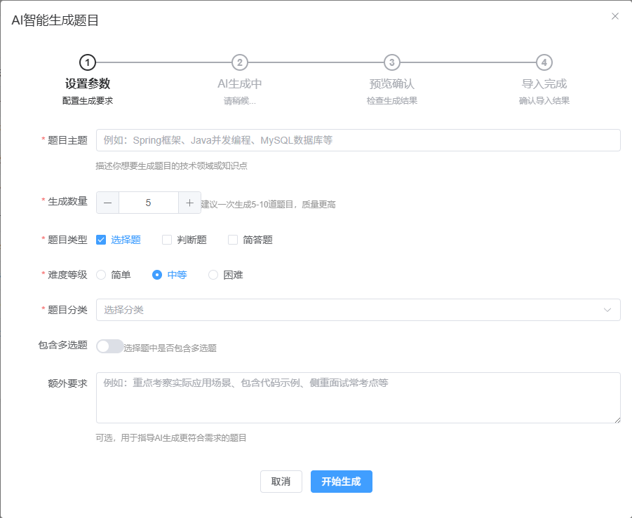

# 硅谷AI链习室- 批量题目操作篇

## 一、模块概述

题目批量操作模块是智能学习平台的高效管理工具，负责题目的批量导入、AI智能生成和数据验证功能。本模块采用Spring Boot + Excel处理 + AI集成 + Swagger架构，大幅提升题目管理效率。



**核心功能特性**

- **6个核心接口**：涉及Excel表格批量导入以及AI批量题目生成
- **Excel集成**：支持Excel模板下载、预览和批量导入
- **AI生成**：Kimi AI智能生成题目功能
- **数据验证**：完整的题目数据格式验证机制
- **通用导入**：支持多种来源的题目批量导入

| 接口名称          | HTTP方法 | URL路径                               | 功能描述         |
| ----------------- | -------- | ------------------------------------- | ---------------- |
| 下载Excel导入模板 | GET      | /api/questions/batch/template         | 获取标准模板文件 |
| 预览Excel文件内容 | POST     | /api/questions/batch/preview-excel    | 解析但不入库     |
| AI智能生成题目    | POST     | /api/questions/batch/ai-generate      | AI生成题目       |
| 批量导入题目      | POST     | /api/questions/batch/import-questions | 通用导入接口     |

## 二、关联数据库

批量操作模块主要操作以下表：

- **questions** - 题目主表
- **question_choices** - 题目选项表  
- **question_answers** - 题目答案表

## 三、Execl批量管理接口实现

### 3.1 下载Excel导入模板（GET /api/questions/batch/template ）

#### 3.1.1 接口分析

**接口地址**:`/api/questions/batch/template`

**请求方式**:`GET`

**请求数据类型**:`application/x-www-form-urlencoded`

**响应数据类型**:`*/*`

**接口描述**:<p>下载题目批量导入的Excel模板文件</p>

**请求参数**: 无

**响应数据**: xlsx表格文件

#### 3.1.2 功能实现

- **POI快速入门**

  详情查看扩展教案 `poi快速入门文档`！！

- **POI准备工作和工具类解读**

  - 列规划

    ```
  String[] headers = {
        "题目内容", "题目类型", "是否多选", "分类ID", "难度", "分值",
        "选项A", "选项B", "选项C", "选项D", "正确答案", "解析"
    };
    ```
    
  - 确保正确导入依赖

    ```xml
    <!-- Excel文件处理 - Apache POI -->
    <dependency>
    	<groupId>org.apache.poi</groupId>
    	<artifactId>poi</artifactId>
    	<version>5.2.4</version>
    </dependency>
    <dependency>
    	<groupId>org.apache.poi</groupId>
    	<artifactId>poi-ooxml</artifactId>
    	<version>5.2.4</version>
    </dependency>
    ```

  - 确保正确导入工具类

    utils包下，导入ExcelUtil工具类，并且解读工具类设计方法和功能！！

    ```java
    /**
     * Excel文件处理工具类
     * 用于解析题目导入的Excel文件
     */
    public class ExcelUtil {
        
        /**
         * 解析Excel文件并转换为题目导入DTO列表
         * 
         * Excel格式要求：
         * 第一行为标题行：题目内容|题目类型|是否多选|分类ID|难度|分值|选项A|选项B|选项C|选项D|正确答案|解析
         * 
         * @param file Excel文件
         * @return 题目导入DTO列表
         * @throws IOException 文件读取异常
         */
        public static List<QuestionImportVo> parseExcel(MultipartFile file) throws IOException {
            List<QuestionImportVo> questions = new ArrayList<>();
            
            // 获取文件输入流
            InputStream inputStream = file.getInputStream();
            Workbook workbook = null;
            
            try {
                // 根据文件扩展名选择对应的工作簿类型
                String fileName = file.getOriginalFilename();
                if (fileName != null && fileName.endsWith(".xlsx")) {
                    workbook = new XSSFWorkbook(inputStream); // Excel 2007+
                } else {
                    workbook = new HSSFWorkbook(inputStream); // Excel 97-2003
                }
                
                // 获取第一个工作表
                Sheet sheet = workbook.getSheetAt(0);
                
                // 从第二行开始读取数据（第一行是标题）
                for (int i = 1; i <= sheet.getLastRowNum(); i++) {
                    Row row = sheet.getRow(i);
                    if (row == null) continue;
                    
                    QuestionImportVo question = new QuestionImportVo();
                    
                    // 读取基本信息
                    question.setTitle(getCellValue(row.getCell(0))); // 题目内容
                    question.setType(getCellValue(row.getCell(1))); // 题目类型
                    question.setMulti("是".equals(getCellValue(row.getCell(2))) || "true".equalsIgnoreCase(getCellValue(row.getCell(2)))); // 是否多选
                    
                    // 分类ID
                    String categoryIdStr = getCellValue(row.getCell(3));
                    if (categoryIdStr != null && !categoryIdStr.isEmpty()) {
                        try {
                            question.setCategoryId(Long.parseLong(categoryIdStr));
                        } catch (NumberFormatException e) {
                            question.setCategoryId(1L); // 默认分类
                        }
                    }
                    
                    question.setDifficulty(getCellValue(row.getCell(4))); // 难度
                    
                    // 分值
                    String scoreStr = getCellValue(row.getCell(5));
                    if (scoreStr != null && !scoreStr.isEmpty()) {
                        try {
                            question.setScore(Integer.parseInt(scoreStr));
                        } catch (NumberFormatException e) {
                            question.setScore(5); // 默认分值
                        }
                    }
                    
                    // 处理选择题选项
                    if ("CHOICE".equals(question.getType())) {
                        List<QuestionImportVo.ChoiceImportDto> choices = new ArrayList<>();
                        String correctAnswer = getCellValue(row.getCell(10)); // 正确答案列
                        
                        // 读取选项A-D
                        for (int j = 0; j < 4; j++) {
                            String optionContent = getCellValue(row.getCell(6 + j));
                            if (optionContent != null && !optionContent.trim().isEmpty()) {
                                QuestionImportVo.ChoiceImportDto choice = new QuestionImportVo.ChoiceImportDto();
                                choice.setContent(optionContent);
                                choice.setSort(j + 1);
                                
                                // 判断是否为正确答案
                                char optionLabel = (char) ('A' + j);
                                boolean isCorrect = correctAnswer != null && correctAnswer.contains(String.valueOf(optionLabel));
                                choice.setIsCorrect(isCorrect);
                                
                                choices.add(choice);
                            }
                        }
                        question.setChoices(choices);
                    } else {
                        // 判断题和简答题直接设置答案
                        question.setAnswer(getCellValue(row.getCell(10)));
                    }
                    
                    question.setAnalysis(getCellValue(row.getCell(11))); // 解析
                    
                    // 验证必填字段
                    if (question.getTitle() != null && !question.getTitle().trim().isEmpty() &&
                        question.getType() != null && !question.getType().trim().isEmpty()) {
                        questions.add(question);
                    }
                }
                
            } finally {
                if (workbook != null) {
                    workbook.close();
                }
                inputStream.close();
            }
            
            return questions;
        }
        
        /**
         * 获取单元格的字符串值
         * @param cell 单元格
         * @return 字符串值
         */
        private static String getCellValue(Cell cell) {
            if (cell == null) {
                return null;
            }
            
            switch (cell.getCellType()) {
                case STRING:
                    return cell.getStringCellValue().trim();
                case NUMERIC:
                    // 如果是数字，转换为字符串
                    if (DateUtil.isCellDateFormatted(cell)) {
                        return cell.getDateCellValue().toString();
                    } else {
                        return String.valueOf((long) cell.getNumericCellValue());
                    }
                case BOOLEAN:
                    return String.valueOf(cell.getBooleanCellValue());
                case FORMULA:
                    return cell.getCellFormula();
                default:
                    return null;
            }
        }
        
        /**
         * 生成Excel模板文件的字节数组
         * @return Excel模板文件的字节数组
         */
        public static byte[] generateTemplate() throws IOException {
            Workbook workbook = new XSSFWorkbook();
            Sheet sheet = workbook.createSheet("题目导入模板");
            
            // 创建标题行
            Row headerRow = sheet.createRow(0);
            String[] headers = {
                "题目内容", "题目类型", "是否多选", "分类ID", "难度", "分值",
                "选项A", "选项B", "选项C", "选项D", "正确答案", "解析"
            };
            
            for (int i = 0; i < headers.length; i++) {
                Cell cell = headerRow.createCell(i);
                cell.setCellValue(headers[i]);
            }
            
            // 创建示例数据行
            Row exampleRow = sheet.createRow(1);
            exampleRow.createCell(0).setCellValue("以下哪个是Spring框架的核心特性？");
            exampleRow.createCell(1).setCellValue("CHOICE");
            exampleRow.createCell(2).setCellValue("否");
            exampleRow.createCell(3).setCellValue("1");
            exampleRow.createCell(4).setCellValue("MEDIUM");
            exampleRow.createCell(5).setCellValue("5");
            exampleRow.createCell(6).setCellValue("依赖注入");
            exampleRow.createCell(7).setCellValue("面向切面编程");
            exampleRow.createCell(8).setCellValue("事务管理");
            exampleRow.createCell(9).setCellValue("以上都是");
            exampleRow.createCell(10).setCellValue("D");
            exampleRow.createCell(11).setCellValue("Spring框架的核心特性包括依赖注入、面向切面编程和事务管理等。");
            
            // 自动调整列宽
            for (int i = 0; i < headers.length; i++) {
                sheet.autoSizeColumn(i);
            }
            
            try (java.io.ByteArrayOutputStream out = new java.io.ByteArrayOutputStream()) {
                workbook.write(out);
                workbook.close();
                return out.toByteArray();
            }
        }
    } 
    ```

- **QuestionBatchController**

  ```java
/**
    * 下载Excel导入模板
    * @return Excel模板文件
    */
  @GetMapping("/template")  // 处理GET请求
  @Operation(summary = "下载Excel导入模板", description = "下载题目批量导入的Excel模板文件")  // API描述
  public ResponseEntity<byte[]> downloadTemplate() throws IOException {
      //1.获取下载模板字节数组
      byte[] template = ExcelUtil.generateTemplate();
      //2.封装ResponseEntity
      ResponseEntity<byte[]> responseEntity = ResponseEntity.ok()
          .header("Content-Disposition","attachment;filename=question_import_template.xlsx")
          .contentType(MediaType.APPLICATION_OCTET_STREAM) //二进制文件，不确定类型！！
        .body(template);
      return responseEntity;
  }
  ```


#### 3.1.3 技术点

在接口开发中，ResponseEntity 是专门用来 “包装接口返回结果” 的工具类。它不仅能返回数据（比如文件字节、JSON），还能灵活设置响应头（如文件名称）、响应状态码（如 200 成功、404 未找到），是处理 “带附加信息的响应” 的常用工具。

``` JAVA
// 下载Excel模板的接口
public ResponseEntity<byte[]> downloadTemplate() throws IOException {
    // 1. 生成模板文件的字节数组（核心数据）
    byte[] template = ExcelUtil.generateTemplate();
    
    // 2. 用ResponseEntity包装结果
    ResponseEntity<byte[]> response = ResponseEntity.ok()  // 设置状态码为200（成功）
        .header(HttpHeaders.CONTENT_DISPOSITION, "attachment; filename=question_import_template.xlsx")  // 响应头：告诉浏览器“这是附件，文件名是xxx”
        .contentType(MediaType.APPLICATION_OCTET_STREAM)  // 响应头：说明数据是二进制流（文件类型）
        .body(template);  // 设置要返回的核心数据（模板字节数组）
    
    return response;
}
```

* 控制响应状态码

  通过 ResponseEntity.ok() 设置状态码为 200（成功），还可以用 ResponseEntity.notFound() 设置 404（未找到）等，让前端明确知道请求结果。

* 设置响应头

  比如代码中的 header(...) 用来指定下载文件的名称，contentType(...) 告诉浏览器 “这是二进制文件，需要下载而不是直接打开”。

* 携带响应数据

  通过 body(...) 方法传入实际要返回的数据（这里是模板文件的字节数组），作为接口的核心返回内容。


### 3.2 预览Excel文件内容（POST /api/questions/batch/preview-excel）

#### 3.2.1 接口分析

**接口地址**:`/api/questions/batch/import-excel`

**请求方式**:`POST`

**接口描述**:<p>>解析并预览Excel文件中的题目内容，不会导入到数据库</p>

**请求参数**:

| 参数名称 | 参数说明                | 请求类型 | 是否必须 | 数据类型 | schema |
| -------- | ----------------------- | -------- | -------- | -------- | ------ |
| file     | Excel文件，包含题目数据 | query    | true     | file     |        |

**响应示例**:

```javascript
{
	"code": 200,
	"message": "操作成功",
	"data": [
		{
			"title": "以下关于Java面向对象编程的说法正确的是？",
			"type": "CHOICE",
			"multi": false,
			"categoryId": 1,
			"categoryName": "Java基础",
			"difficulty": "MEDIUM",
			"score": 5,
			"analysis": "Java是面向对象编程语言，支持封装、继承、多态三大特性...",
			"choices": [
				{
					"content": "Java支持多重继承",
					"isCorrect": false,
					"sort": 1
				}
			],
			"answer": "正确",
			"keywords": "面向对象,封装,继承,多态"
		}
	]
}
```

#### 3.2.2 功能实现

* **ExcelUtil 、parseExcel方法**

  ```java
  /**
    * 解析Excel文件并转换为题目导入DTO列表
    * 
    * Excel格式要求：
    * 第一行为标题行：题目内容|题目类型|是否多选|分类ID|难度|分值|选项A|选项B|选项C|选项D|正确答案|解析
    * 
    * @param file Excel文件
    * @return 题目导入DTO列表
    * @throws IOException 文件读取异常
    */
  public static List<QuestionImportVo> parseExcel(MultipartFile file) throws IOException {
      List<QuestionImportVo> questions = new ArrayList<>();
  
      // 获取文件输入流
      InputStream inputStream = file.getInputStream();
      Workbook workbook = null;
  
      try {
          // 根据文件扩展名选择对应的工作簿类型
          String fileName = file.getOriginalFilename();
          if (fileName != null && fileName.endsWith(".xlsx")) {
              workbook = new XSSFWorkbook(inputStream); // Excel 2007+
          } else {
              workbook = new HSSFWorkbook(inputStream); // Excel 97-2003
          }
  
          // 获取第一个工作表
          Sheet sheet = workbook.getSheetAt(0);
  
          // 从第二行开始读取数据（第一行是标题）
          for (int i = 1; i <= sheet.getLastRowNum(); i++) {
              Row row = sheet.getRow(i);
              if (row == null) continue;
  
              QuestionImportVo question = new QuestionImportVo();
  
              // 读取基本信息
              question.setTitle(getCellValue(row.getCell(0))); // 题目内容
              question.setType(getCellValue(row.getCell(1))); // 题目类型
              question.setMulti("是".equals(getCellValue(row.getCell(2))) || "true".equalsIgnoreCase(getCellValue(row.getCell(2)))); // 是否多选
  
              // 分类ID
              String categoryIdStr = getCellValue(row.getCell(3));
              if (categoryIdStr != null && !categoryIdStr.isEmpty()) {
                  try {
                      question.setCategoryId(Long.parseLong(categoryIdStr));
                  } catch (NumberFormatException e) {
                      question.setCategoryId(1L); // 默认分类
                  }
              }
  
              question.setDifficulty(getCellValue(row.getCell(4))); // 难度
  
              // 分值
              String scoreStr = getCellValue(row.getCell(5));
              if (scoreStr != null && !scoreStr.isEmpty()) {
                  try {
                      question.setScore(Integer.parseInt(scoreStr));
                  } catch (NumberFormatException e) {
                      question.setScore(5); // 默认分值
                  }
              }
  
              // 处理选择题选项
              if ("CHOICE".equals(question.getType())) {
                  List<QuestionImportVo.ChoiceImportDto> choices = new ArrayList<>();
                  String correctAnswer = getCellValue(row.getCell(10)); // 正确答案列
  
                  // 读取选项A-D
                  for (int j = 0; j < 4; j++) {
                      String optionContent = getCellValue(row.getCell(6 + j));
                      if (optionContent != null && !optionContent.trim().isEmpty()) {
                          QuestionImportVo.ChoiceImportDto choice = new QuestionImportVo.ChoiceImportDto();
                          choice.setContent(optionContent);
                          choice.setSort(j + 1);
  
                          // 判断是否为正确答案
                          char optionLabel = (char) ('A' + j);
                          boolean isCorrect = correctAnswer != null && correctAnswer.contains(String.valueOf(optionLabel));
                          choice.setIsCorrect(isCorrect);
  
                          choices.add(choice);
                      }
                  }
                  question.setChoices(choices);
              } else {
                  // 判断题和简答题直接设置答案
                  question.setAnswer(getCellValue(row.getCell(10)));
              }
  
              question.setAnalysis(getCellValue(row.getCell(11))); // 解析
  
              // 验证必填字段
              if (question.getTitle() != null && !question.getTitle().trim().isEmpty() &&
                  question.getType() != null && !question.getType().trim().isEmpty()) {
                  questions.add(question);
              }
          }
  
      } finally {
          if (workbook != null) {
              workbook.close();
          }
          inputStream.close();
      }
  
      return questions;
  }
  ```

* **QuestionBatchController**

  ```java
  /**
    * 预览Excel文件内容（不入库）
    * @param file Excel文件
    * @return 解析出的题目列表
    */
  @PostMapping("/preview-excel")  // 处理POST请求
  @Operation(summary = "预览Excel文件内容", description = "解析并预览Excel文件中的题目内容，不会导入到数据库")  // API描述
  public Result<List<QuestionImportVo>> previewExcel(
      @Parameter(description = "Excel文件，支持.xls和.xlsx格式") @RequestParam("file") MultipartFile file) throws IOException {
      List<QuestionImportVo> questionImportVoList = questionService.preViewExcel(file);
      log.info("预览解析execl接口调用成功！题目数量：{},数据为：{}",questionImportVoList.size(),questionImportVoList);
      return Result.success(questionImportVoList);
  }
  ```

* **QuestionService**

  ```java
  /**
    * 解析并预览Excel文件中的题目内容，不会导入到数据库
    *   文件和格式校验
    *   文件解析处理
    * @param file
    * @return
    */
   List<QuestionImportVo> preViewExcel(MultipartFile file) throws IOException;
  ```

* **QuestionServiceImpl**

  ```java
  /**
    * 解析并预览Excel文件中的题目内容，不会导入到数据库
    * 文件和格式校验
    * 文件解析处理
    * @param file
    * @return
  */
  @Override
  public List<QuestionImportVo> preViewExcel(MultipartFile file) throws IOException {
      //数据校验
      if (file == null || file.isEmpty()){
          throw new RuntimeException("预览数据的文件为空！");
      }
      String fileName = file.getOriginalFilename();
      //xls xlsx
      if (!fileName.endsWith(".xls") && !fileName.endsWith(".xlsx")){
          throw new RuntimeException("预览数据的文件格式错误，必须是 .xls或者.xlsx！");
      }
      //解析数据
      List<QuestionImportVo> questionImportVoList = ExcelUtil.parseExcel(file);
      //返回结果
      return questionImportVoList;
  }
  ```

### 3.3 批量导入题目（POST /api/questions/batch/import-questions）

#### 3.3.1 接口分析

**接口地址**:`/api/questions/batch/import-questions`

**请求方式**:`POST`

**接口描述**:<p>将题目列表批量导入到数据库，支持Excel解析后的导入或AI生成后的确认导入</p>

**请求示例**:

```javascript
[
  {
    "title": "以下关于Java面向对象编程的说法正确的是？",
    "type": "CHOICE",
    "multi": false,
    "categoryId": 1,
    "categoryName": "Java基础",
    "difficulty": "MEDIUM",
    "score": 5,
    "analysis": "Java是面向对象编程语言，支持封装、继承、多态三大特性...",
    "choices": [
      {
        "content": "Java支持多重继承",
        "isCorrect": false,
        "sort": 1
      }
    ],
    "answer": "正确",
    "keywords": "面向对象,封装,继承,多态"
  }
]
```

**响应示例**:

```javascript
{
	"code": 200,
	"message": "操作成功",
	"data": "Excel导入完成！成功导入 %d [工程导入] / %d [题目总数] 道题目"
}
```

#### 3.3.2 功能实现

- **QuestionBatchController**

  ```java
  /**
    * 批量导入题目（通用接口，支持Excel导入或AI生成后的确认导入）
    * @param questions 题目导入DTO列表
    * @return 导入结果
    */
  @PostMapping("/import-questions")  // 处理POST请求
  @Operation(summary = "批量导入题目", description = "将题目列表批量导入到数据库，支持Excel解析后的导入或AI生成后的确认导入")  // API描述
  public Result<String> importQuestions(@RequestBody List<QuestionImportVo> questions) {
      int successCount =  questionService.importBatchQuestions(questions);
      log.info("批量导入题目接口调用成功！ 一共：{}题目需要导入，成功导入了：{}道题！" ,questions.size(),successCount);
      return Result.success("批量导入题目接口调用成功！ 一共：%s 题目需要导入，成功导入了：%s 道题！".formatted(questions.size(),successCount));
  }
  ```

- **QuestionService**

  ```java
  /**
    * 【方法重载】
    * 批量题目导入 [execl和ai生成批量导入]
    *   批量数据库添加
    * @param questionImportVoList
    * @return Excel导入完成！成功导入 %d [工程导入] / %d [题目总数] 道题目
    */
  String importBatchQuestions(List<QuestionImportVo> questionImportVoList) throws IOException;
  ```

- **QuestionServiceImpl**

  ```java
  /**
    * 批量题目导入 [execl和ai生成批量导入]
    * 批量数据库添加
    * @param questionImportVoList
    * @return Excel导入完成！成功导入 %d [工程导入] / %d [题目总数] 道题目
    */
  @Override
  public int importBatchQuestions(List<QuestionImportVo> questions) {
      //1. 进行数据校验
      if (questions == null || questions.isEmpty()){
          throw new RuntimeException("导入的题目集合为空！");
      }
  
      //3. 循环 + try 调用保存的方法 [部分成功]
      int successCount = 0;
      for (int i = 0; i < questions.size(); i++) {
          try {
              //2. 进行vo - question [提取一个方法]
              Question question =  convertQuestionImportVoToQuestion(questions.get(i));
              //数据单体保存
              customSaveQuestion(question);
              //正确技术统计
              successCount++;
          }catch (Exception e){
              //导入失败的提示
              log.debug("{}题目导入失败！",questions.get(i).getTitle());
          }
      }
      return successCount;
  }
  ```

  定义QuestionImportVo转Question方法

  ```java 
  private Question convertQuestionImportVoToQuestion(QuestionImportVo questionImportVo) {
      //1. 给question本体属性赋值
      Question question = new Question();
      //question.setTitle(questionImportVo.getTitle());
      /**
           * 作用：给对象的属性进行赋值！根据另一个对象的相同属性值！
           * 参数1：source 源对象 【提供值】
           * 参数2：target 目标对象 【接收值】
           */
      BeanUtils.copyProperties(questionImportVo,question);
  
      //2. 判断是选择，给选项集合进行赋值
      if ("CHOICE".equals(questionImportVo.getType())){
          if (questionImportVo.getChoices().size() > 0) {
              List<QuestionChoice> questionChoices = new ArrayList<>(questionImportVo.getChoices().size());
              for (QuestionImportVo.ChoiceImportDto importVoChoice : questionImportVo.getChoices()) {
                  QuestionChoice questionChoice = new QuestionChoice();
                  questionChoice.setContent(importVoChoice.getContent());
                  questionChoice.setIsCorrect(importVoChoice.getIsCorrect());
                  questionChoice.setSort(importVoChoice.getSort());
                  questionChoices.add(questionChoice);
              }
              question.setChoices(questionChoices);
          }
      }
      //3. 不管是不是选择题创建答案对象并赋值 【保存的时候，获取答案对象，选择题可以没有答案值，保存会判断答案值】
      QuestionAnswer questionAnswer = new QuestionAnswer();
      //判断题，需要将true和false转成大写！ 否则无法识别！！
      if ("JUDGE".equals(questionImportVo.getType())){
          questionAnswer.setAnswer(questionImportVo.getAnswer().toUpperCase());
      }else{
          questionAnswer.setAnswer(questionImportVo.getAnswer());
      }
      questionAnswer.setKeywords(questionImportVo.getKeywords());
      question.setAnswer(questionAnswer);
  
      return question;
  }
  ```

### 3.4 从Excel文件批量导入题目（POST /api/questions/batch/import-excel）【废弃】

#### 3.4.1 接口分析

**接口地址**:`/api/questions/batch/import-excel`

**请求方式**:`POST`

**接口描述**:<p>解析Excel文件并将题目批量导入到数据库</p>

**请求参数**:

| 参数名称 | 参数说明                | 请求类型 | 是否必须 | 数据类型 | schema |
| -------- | ----------------------- | -------- | -------- | -------- | ------ |
| file     | Excel文件，包含题目数据 | query    | true     | file     |        |

**响应示例**:

```javascript
{
	"code": 200,
	"message": "操作成功",
	"data": "Excel导入完成！成功导入 %d [工程导入] / %d [题目总数] 道题目"
}
```

#### 3.4.2 功能实现

- **QuestionBatchController**

  ```java
  /**
    * [前端调用按钮被屏蔽，可以使用doc.html页面导入]
    * 从Excel文件批量导入题目
    * @param file Excel文件
    * @return 导入结果
    */
  @PostMapping("/import-excel")  // 处理POST请求
  @Operation(summary = "从Excel文件批量导入题目", description = "解析Excel文件并将题目批量导入到数据库")  // API描述
  public Result<String> importFromExcel(
      @Parameter(description = "Excel文件，包含题目数据") @RequestParam("file") MultipartFile file) throws IOException {
      String result =  questionService.importExeclBatchQuestions(file);
      log.info(result);
      return Result.success(result);
  }
  ```
  
- **QuestionService**

  ```java
  /**
    * 进行题目批量导入
    * @param file
    * @return
    */
  String importExeclBatchQuestions(MultipartFile file) throws IOException;
  ```
  
- **QuestionServiceImpl**

  ```java
  /**
    * 进行题目批量导入
    * @param file
    * @return
    */
  @Override
  public String importExeclBatchQuestions(MultipartFile file) throws IOException {
      //1.校验
      if (file == null || file.isEmpty()){
          throw new RuntimeException("批量导入的文件为空！");
      }
      String filename = file.getOriginalFilename();
      if (!filename.endsWith(".xls") && !filename.endsWith(".xlsx")){
          throw new RuntimeException("批量导入的文件格式错误，必须是xls或者xlsx格式！");
      }
      //2.解析文件
      List<QuestionImportVo> questionImportVoList = ExcelUtil.parseExcel(file);
      //3.调用批量导入业务
      int successCount = importBatchQuestions(questionImportVoList);
      String result = "批量导入题目接口调用成功！ 一共：%s 题目需要导入，成功导入了：%s 道题！".formatted(questionImportVoList.size(),successCount);
      return result;
  }
  ```
  

## 四、Kimi AI(模型)服务使用流程

### 4.1 AI出题业务流程思考和分析

ai批量题目生成流程如下图

/%E8%AF%BE%E4%BB%B6/%E6%95%99%E6%A1%88/assets/%E6%9C%AA%E5%91%BD%E5%90%8D%E7%BB%98%E5%9B%BE.drawio-1753769813763.png)

步骤解析，如下：

1. 前端发起 AI 批量出题请求，传递关键参数（题目主题、数量、难度、类型及其他特殊要求）
2. 后台 AI 批量出题接口接收参数，完成校验后调用 KIMI 交互业务
3. KIMI 交互业务执行三步操作：生成针对性提示词 → 通过 WebClient 调用大模型 → 解析返回结果
4. 接口将解析后的题目数据返回前端
5. 前端展示 AI 生成的题目预览
6. 预览结束以后，进行题目批量导入**（已经实现）**

### 4.2 程序进行AI交互方案

1. **原生 HTTP 客户端直接调用（基础方案）**

   * 核心工具：WebClient（Spring WebFlux）、RestTemplate（Spring MVC）、OkHttp、HttpClient

   * 实现方式：手动构建 HTTP 请求，直接调用 AI 模型的 API 接口

   * 特点

     * 轻量灵活，无额外依赖
     * 需要手动处理认证、请求构建、响应解析
     * 适合简单场景或需要高度定制化的交互

   * 示例

     ```JAVA
     // WebClient调用示例
     webClient.post()
              .uri("https://api.kimi.moonshot.cn/v1/chat/completions")
              .header("Authorization", "Bearer " + apiKey)
              .bodyValue(buildRequest(prompt))
              .retrieve()
              .bodyToMono(ChatResponse.class)
     ```

2. **LangChain4（for）j(java)（专注 LLM 应用开发框架）**
   
   * 定位：专为大语言模型设计的 Java 开发框架
   * 统一接口适配多种模型（OpenAI、KIMI、本地模型等）
   * 提供提示词模板、记忆机制、工具调用等组件
   * 支持链（Chain）和代理（Agent）模式
   * 特点
     * 专注 LLM 应用开发，抽象层次高
     * 内置丰富的 LLM 交互模式
     * 社区活跃，支持多种模型集成
* **典型场景**：复杂对话系统、智能代理、带记忆的交互
  
3. **Spring AI（Spring 生态官方解决方案）**
   * 定位：Spring 官方推出的 AI 集成框架
   * 与 Spring 生态无缝集成（依赖注入、配置管理等）
   * 统一的 AI 模型接口，支持多模型切换
   * 提供向量存储、嵌入模型、提示词模板等组件
   * 支持流式响应、函数调用等高级特性
   * 特点
     * 符合 Spring 开发者习惯，学习成本低
     * 标准化配置，易于维护和扩展
     * 适合企业级 Spring 应用快速集成 AI 能力
* **优势**：未来会成为 Spring 生态 AI 集成的标准方案
4. **厂商官方 SDK（特定模型方案）**
   * 代表：OpenAI Java SDK、阿里云通义千问 SDK 等
   * 特点
     * 针对特定模型深度优化
     * 提供完整的模型能力封装
     * 版本更新与官方 API 同步
   * 适用场景：项目确定使用单一 AI 服务提供商时

**方案选择建议**

- 简单场景或需要极致灵活：WebClient 等原生 HTTP 客户端
- Spring 生态项目：优先选择 Spring AI
- 复杂 LLM 应用（多模型、记忆、工具调用）：LangChain4j
- 单一厂商深度集成：官方 SDK

这些方案各有侧重，实际项目中可根据团队技术栈、业务复杂度和模型选择进行适配，核心目标都是简化 AI 交互流程，提升开发效率。

### 4.3 Kimi AI和WebClient使用教程

详情见 `教案/扩展笔记/kimi-webclient-使用指南.md`

### 4.4  AI 出题业务提示词设计

#### 4.4.1 提示词是什么？

提示词（Prompt）是用户输入给AI系统的指令或信息，用于引导AI生成特定的输出或执行特定的任务。简单来说，提示词就是我们与AI“对话”时所使用的语言，它可以是一个简单的问题，一段详细的指令，也可以是一个复杂的任务描述。

提示词的**基本结构**包括指令、上下文和期望

- **指令（Instruction)：**这是提示词的核心，明确告诉AI你希望它执行什么任务。
- **上下文（Context)：**为AI提供背景信息，帮助它更准确地理解和执行任务。
- **期望（Expectation)：**明确或隐含地表达你对AI输出的要求和预期。

提示词（Prompt）是人类与AI系统交互的语言载体，其核心功能是完成从主观意图到机器可执行指令的精确转化。根据2023年OpenAI的研究，85%的AI生成结果偏差源自提示词设计缺陷，而非模型能力局限。

#### 4.4.2 基础提示词示例

**举例 1：生成旅行攻略**

```
角色：旅行规划师
任务：为用户生成特定目的地的旅行攻略
指示：攻略需包含行程安排、必去景点、特色美食及注意事项，内容要实用且贴合当地实际情况
总结：作为旅行规划师，为用户生成【目的地】的实用旅行攻略，包含 5 天行程安排、当地必去景点、特色美食推荐以及出行注意事项，确保内容贴合当地实际情况。
```

**举例 2：撰写工作总结**

```
角色：职场员工
任务：撰写月度工作总结
指示：总结需涵盖工作内容、完成成果、存在不足及下月计划，语言简洁明了、重点突出
总结：作为职场员工，撰写一份月度工作总结，内容包括本月完成的【工作内容】、取得的【工作成果】、工作中存在的【不足】以及下月的【工作计划】，要求语言简洁明了，重点突出。
```

**举例 3：生成学习计划**

```
角色：学习顾问
任务：为学生生成特定学科的学习计划
指示：计划需结合学科特点和学习目标，合理分配学习时间，包含学习内容和方法建议
总结：作为学习顾问，为学生生成【学科名称】的学习计划，以【学习目标】为导向，结合学科特点合理分配每周学习时间，明确各阶段的学习内容并提供相应的学习方法建议。
```

#### 4.4.3 提示词语法和格式问题

提示词没有统一的 “标准语法”，但不同呈现形式会影响模型对信息的理解效率。

1. **纯文本格式（最常用）**
   * 形式：无特殊符号，用自然语言直接描述（如之前举例中的提示公式）
   * 优势：简单直观，适合所有场景，模型对纯文本的兼容性最佳
   * 示例：“作为职场员工，撰写月度工作总结，包含本月工作内容、成果、不足及下月计划”

2. **带标记的结构化格式**

   * 形式：使用##（标题）、-（列表）、【】（占位符）等符号划分信息层级

   * 优势：通过视觉分隔突出核心信息，帮助模型快速识别关键指令

   * 示例：

     ```
     ## 角色：学习顾问
     ## 任务：生成数学学习计划
     ## 要求：
     - 结合高一数学知识点
     - 每周学习时长不超过10小时
     - 包含课后练习建议
     ```

**格式对模型的影响总结：**

- 核心逻辑：标记符号本身无 “语法意义”，但结构化格式能减少模型的信息提取成本

- 实际效果：复杂需求（如多条件约束、多步骤任务）用结构化格式更易得到精准结果；简单需求用纯文本足够

- 注意：不同模型对标记的敏感程度有差异（如 Kimi 对列表、标题的识别效果较好），但均能理解纯文本

实用建议

- 日常使用：优先用 “自然语言 + 简单标记”（如【】标注入参、-罗列要求），兼顾可读性和精准度

- 复杂场景：对角色、任务、约束条件较多的需求，用##划分模块，让逻辑更清晰

- 核心原则：无论用哪种格式，确保 “角色明确、任务具体、要求清晰” 比纠结符号更重要

#### 4.4.4 AI出题提示词设计

参考：https://platform.moonshot.cn/docs/guide/use-json-mode-feature-of-kimi-api#json-mode-%E5%BA%94%E7%94%A8%E7%A4%BA%E4%BE%8B

请为我生成【题目数量】道关于【题目主题】的题目。

要求：

- 题目类型：【根据请求类型展示，如 “选择题 (包含单选和多选)  ， 判断题（**重要：确保正确答案和错误答案的数量大致平衡，不要全部都是正确或错误**） 简答题”】

- 难度等级：【根据请求难度展示，如 “简单”“中等”“困难”】

- 特殊要求：【根据请求的额外要求展示】

- 【若包含判断题则显示】判断题特别要求：

- 确保生成的判断题中，正确答案 (TRUE) 和错误答案 (FALSE) 的数量尽量平衡

- 不要所有判断题都是正确的或都是错误的

- 错误的陈述应该是常见的误解或容易混淆的概念

- 正确的陈述应该是重要的基础知识点

请严格按照以下 JSON 格式返回，不要包含任何其他文字：

```json
{
  "questions": [
    {
      "title": "题目内容",
      "type": "CHOICE|JUDGE|TEXT",
      "multi": true/false,
      "difficulty": "EASY|MEDIUM|HARD",
      "score": 5,
      "choices": [
        {"content": "选项内容", "isCorrect": true/false, "sort": 1}
      ],
      "answer": "TRUE或FALSE(判断题专用)|文本答案(简答题专用)",
      "analysis": "题目解析"
    }
  ]
}
```

注意：

1. 选择题必须有 choices 数组，判断题和简答题设置 answer 字段

2. 多选题的 multi 字段设为 true，单选题设为 false

3. **判断题的 answer 字段只能是 "TRUE" 或 "FALSE"，请确保答案分布合理**

4. 每道题都要有详细的解析

5. 题目要有实际价值，贴近实际应用场景

6. 严格按照 JSON 格式返回，确保可以正确解析

### 4.5 Kimi AIService工具提示词方法

不在带写提示词拼接

“kimi接口**

* ```java
/**
   * Kimi AI服务接口
   * 用于调用Kimi API生成题目
   */
  public interface KimiAiService {
  
      String buildPrompt(AiGenerateRequestVo request)；
  } 
  ```
  
* **KimiAiServiceImpl实现类**

  ```java
  package com.exam.service.impl;
  /**
   * Kimi AI生成服务实现类
   */
  @Slf4j
  @Service
  public class KimiAiServiceImpl implements KimiAiService { 
      /**
       * 构建发送给AI的提示词
       */
      public String buildPrompt(AiGenerateRequestVo request) {
          StringBuilder prompt = new StringBuilder();
          
          prompt.append("请为我生成").append(request.getCount()).append("道关于【")
                .append(request.getTopic()).append("】的题目。\n\n");
          
          prompt.append("要求：\n");
          
          // 题目类型要求
          if (request.getTypes() != null && !request.getTypes().isEmpty()) {
              List<String> typeList = Arrays.asList(request.getTypes().split(","));
              prompt.append("- 题目类型：");
              for (String type : typeList) {
                  switch (type.trim()) {
                      case "CHOICE":
                          prompt.append("选择题");
                          if (request.getIncludeMultiple() != null && request.getIncludeMultiple()) {
                              prompt.append("(包含单选和多选)");
                          }
                          prompt.append(" ");
                          break;
                      case "JUDGE":
                          prompt.append("判断题（**重要：确保正确答案和错误答案的数量大致平衡，不要全部都是正确或错误**） ");
                          break;
                      case "TEXT":
                          prompt.append("简答题 ");
                          break;
                  }
              }
              prompt.append("\n");
          }
          
          // 难度要求
          if (request.getDifficulty() != null) {
              String difficultyText = switch (request.getDifficulty()) {
                  case "EASY" -> "简单";
                  case "MEDIUM" -> "中等";
                  case "HARD" -> "困难";
                  default -> "中等";
              };
              prompt.append("- 难度等级：").append(difficultyText).append("\n");
          }
          
          // 额外要求
          if (request.getRequirements() != null && !request.getRequirements().isEmpty()) {
              prompt.append("- 特殊要求：").append(request.getRequirements()).append("\n");
          }
          
          // 判断题特别要求
          if (request.getTypes() != null && request.getTypes().contains("JUDGE")) {
              prompt.append("- **判断题特别要求**：\n");
              prompt.append("  * 确保生成的判断题中，正确答案(TRUE)和错误答案(FALSE)的数量尽量平衡\n");
              prompt.append("  * 不要所有判断题都是正确的或都是错误的\n");
              prompt.append("  * 错误的陈述应该是常见的误解或容易混淆的概念\n");
              prompt.append("  * 正确的陈述应该是重要的基础知识点\n");
          }
          
          prompt.append("\n请严格按照以下JSON格式返回，不要包含任何其他文字：\n");
          prompt.append("```json\n");
          prompt.append("{\n");
          prompt.append("  \"questions\": [\n");
          prompt.append("    {\n");
          prompt.append("      \"title\": \"题目内容\",\n");
          prompt.append("      \"type\": \"CHOICE|JUDGE|TEXT\",\n");
          prompt.append("      \"multi\": true/false,\n");
          prompt.append("      \"difficulty\": \"EASY|MEDIUM|HARD\",\n");
          prompt.append("      \"score\": 5,\n");
          prompt.append("      \"choices\": [\n");
          prompt.append("        {\"content\": \"选项内容\", \"isCorrect\": true/false, \"sort\": 1}\n");
          prompt.append("      ],\n");
          prompt.append("      \"answer\": \"TRUE或FALSE(判断题专用)|文本答案(简答题专用)\",\n");
          prompt.append("      \"analysis\": \"题目解析\"\n");
          prompt.append("    }\n");
          prompt.append("  ]\n");
          prompt.append("}\n");
          prompt.append("```\n\n");
          
          prompt.append("注意：\n");
          prompt.append("1. 选择题必须有choices数组，判断题和简答题设置answer字段\n");
          prompt.append("2. 多选题的multi字段设为true，单选题设为false\n");
          prompt.append("3. **判断题的answer字段只能是\"TRUE\"或\"FALSE\"，请确保答案分布合理**\n");
          prompt.append("4. 每道题都要有详细的解析\n");
          prompt.append("5. 题目要有实际价值，贴近实际应用场景\n");
          prompt.append("6. 严格按照JSON格式返回，确保可以正确解析\n");
          
          // 如果只生成判断题，额外强调答案平衡
          if (request.getTypes() != null && request.getTypes().equals("JUDGE") && request.getCount() > 1) {
              prompt.append("7. **判断题答案分布要求**：在").append(request.getCount()).append("道判断题中，");
              int halfCount = request.getCount() / 2;
              if (request.getCount() % 2 == 0) {
                  prompt.append("请生成").append(halfCount).append("道正确(TRUE)和").append(halfCount).append("道错误(FALSE)的题目");
              } else {
                  prompt.append("请生成约").append(halfCount).append("-").append(halfCount + 1).append("道正确(TRUE)和约").append(halfCount).append("-").append(halfCount + 1).append("道错误(FALSE)的题目");
              }
          }
          
          return prompt.toString();
      }  
  }
  ```

## 五、AI题目批量生成类接口实现

### 5.1 AI批量生成题目接口实现

#### 5.1.1 接口分析

**接口地址**:`/api/questions/batch/ai-generate`

**请求方式**:`POST`

**接口描述**:<p>使用AI技术根据指定主题和要求智能生成题目，支持预览后再决定是否导入</p>

**请求示例**:

```javascript
{
  "topic": "Java面向对象编程",
  "count": 5,
  "types": "CHOICE,JUDGE,TEXT",
  "difficulty": "MEDIUM",
  "categoryId": 1,
  "includeMultiple": false,
  "requirements": "重点考察实际应用，包含代码示例"
}
```

**响应示例**: （QuestionImportVo）

```javascript
{
	"code": 200,
	"message": "操作成功",
	"data": [
		{
			"title": "以下关于Java面向对象编程的说法正确的是？",
			"type": "CHOICE",
			"multi": false,
			"categoryId": 1,
			"categoryName": "Java基础",
			"difficulty": "MEDIUM",
			"score": 5,
			"analysis": "Java是面向对象编程语言，支持封装、继承、多态三大特性...",
			"choices": [
				{
					"content": "Java支持多重继承",
					"isCorrect": false,
					"sort": 1
				}
			],
			"answer": "正确",
			"keywords": "面向对象,封装,继承,多态"
		}
	]
}
```

#### 5.1.2 功能实现

- **WebClient集成和Kimi参数配置**

  - 依赖导入

    ```xml 
    <!-- HTTP客户端 - 用于调用Kimi API -->
    <dependency>
        <groupId>org.springframework.boot</groupId>
        <artifactId>spring-boot-starter-webflux</artifactId>
    </dependency>
    ```

  - 自定义kimi相关参数

    ``` yml
    # AI 服务配置
    kimi:
      api:
        base-url: https://api.moonshot.cn/v1
        api-key: 你的key  # 从环境变量获取，或使用默认值
        model: moonshot-v1-32k  # 使用8k上下文模型进行判卷
        max-tokens: 2000  # 最大生成token数
        temperature: 0.3  # 较低的temperature确保判卷结果稳定
    ```

    api-key和model根据实际情况进行调整！

    model模型列表：https://platform.moonshot.cn/docs/introduction

    api-key申请地址：https://platform.moonshot.cn/console/api-keys

  - 自定义读取kimi参数类

    ```java 
    @ConfigurationProperties(prefix = "kimi.api")
    @Data
    public class KimiProperties {
    
        private String model;
        private String uri;
        private String apiKey;
        private Integer maxTokens;
        private Double temperature;
    }
    ```

  - 自定义实例WebClient配置类

    ```java 
    @Configuration
    @EnableConfigurationProperties(KimiProperties.class)
    public class WebClientConfiguration {
        
        @Autowired
        private KimiProperties kimiProperties;
    
        @Bean
        public WebClient webClient() {
            WebClient webClient = WebClient.builder().
                    baseUrl(kimiProperties.getUri())
                    .defaultHeader(HttpHeaders.CONTENT_TYPE, MediaType.APPLICATION_JSON_VALUE)
                    .defaultHeader("Authorization", "Bearer " + kimiProperties.getApiKey())
                    .build();
            return webClient;
        }
    }
    ```

- **QuestionBatchController**

  ```java
  /**
    * 使用AI生成题目（预览，不入库）
    * @param request AI生成请求参数
    * @return 生成的题目列表
    */
  @PostMapping("/ai-generate")  // 处理POST请求
  @Operation(summary = "AI智能生成题目", description = "使用AI技术根据指定主题和要求智能生成题目，支持预览后再决定是否导入")  // API描述
  public Result<List<QuestionImportVo>> generateQuestionsByAi(
      @RequestBody @Validated AiGenerateRequestVo request) throws InterruptedException {
      List<QuestionImportVo> questionImportVoList = kimiAiService.aiGenerateQuestions(request);
      log.info("使用ai生成：{} 为标题的题目成功！ 计划生成：{}道题，实际生成：{}道题！",
               request.getTopic(),request.getCount(),questionImportVoList.size());
      return Result.success(questionImportVoList);
  }
  ```
  
- **KimiAiService接口**

  ```java
  /**
    * ai题目信息生成
    * @param request
    * @return
    */
  List<QuestionImportVo> aiGenerateQuestions(AiGenerateRequestVo request) throws InterruptedException;
  ```
  
- **KimiAiServiceImpl实现类** 

  ~~~java
@Autowired
  private WebClient webClient;
  
  @Autowired
  private KimiProperties kimiProperties;
  
  
  /**
    * ai题目信息生成
    * @param request
    * @return
    */
  @Override
  public List<QuestionImportVo> aiGenerateQuestions(AiGenerateRequestVo request) throws InterruptedException {
      //1. 校验工作
      //2. 调用方法生成提示词
      String prompt = buildPrompt(request);
      //3. 调用kimi调用方法获取结果
      String content = callKimiAi(prompt);
      //4. 结果内容解析
      /*
             ```json
                {
                   questions:[{},{},{}]
                }
             ```
           */
      int startIndex = content.indexOf("```json");
      int endIndex = content.lastIndexOf("```");
      //保证有数据，且下标正确！
      if (startIndex != -1 && endIndex != -1 && startIndex < endIndex) {
          //获取真正结果
          String realResult = content.substring(startIndex+7,endIndex);
          System.out.println("realResult = " + realResult);
          JSONObject jsonObject = JSONObject.parseObject(realResult);
          JSONArray questions = jsonObject.getJSONArray("questions");
          List<QuestionImportVo> questionImportVoList = new ArrayList<>();
          for (int i = 0; i < questions.size(); i++) {
              //获取对象
              JSONObject questionJson = questions.getJSONObject(i);
              QuestionImportVo questionImportVo = new QuestionImportVo();
              questionImportVo.setTitle(questionJson.getString("title"));
              questionImportVo.setType(questionJson.getString("type"));
              questionImportVo.setMulti(questionJson.getBoolean("multi"));
              questionImportVo.setDifficulty(questionJson.getString("difficulty"));
              questionImportVo.setScore(questionJson.getInteger("score"));
              questionImportVo.setAnalysis(questionJson.getString("analysis"));
              questionImportVo.setCategoryId(request.getCategoryId());
  
              //选择题处理选项
              if ("CHOICE".equals(questionImportVo.getType())) {
                  JSONArray choices = questionJson.getJSONArray("choices");
                  List<QuestionImportVo.ChoiceImportDto> choiceImportDtoList = new ArrayList<>(choices.size());
                  for (int i1 = 0; i1 < choices.size(); i1++) {
                      JSONObject choicesJSONObject = choices.getJSONObject(i1);
                      QuestionImportVo.ChoiceImportDto choiceImportDto = new QuestionImportVo.ChoiceImportDto();
                      choiceImportDto.setContent(choicesJSONObject.getString("content"));
                      choiceImportDto.setIsCorrect(choicesJSONObject.getBoolean("isCorrect"));
                      choiceImportDto.setSort(choicesJSONObject.getInteger("sort"));
                      choiceImportDtoList.add(choiceImportDto);
                  }
                  questionImportVo.setChoices(choiceImportDtoList);
              }
              //答案 [判断题！ TRUE |FALSE  false true  f  t 是 否]
              questionImportVo.setAnswer(questionJson.getString("answer"));
              questionImportVoList.add(questionImportVo);
          }
          return questionImportVoList;
      }
      throw new RuntimeException("ai生成题目json数据结构错误，无法正常解析！数据为：%s".formatted(content));
  }
  ~~~
  
  kimi调用过程封装
  
  ```java
  /**
    * 
    * 进行失败重试 给3次机会！！！
    *    kimi失败场景
    *      假失败 -》 调用成功 1. 结果格式不对  2. 速率限制 -> try
    *        |
    *      真失败 -》 抛出异常 -> catch
    * 封装调用kimi模型，最终返结果
    * @param prompt
    * @return 返回生成题目json 结果 / choices / message / content
    */
  @Override
  public String callKimiAi(String prompt) throws InterruptedException {
  
      int maxTry = 3; //最多重试3次
      for (int i = 1; i <= 3; i++) {
          try {
              //请求体的内容 https://platform.moonshot.cn/docs/api/chat#%E8%AF%B7%E6%B1%82%E5%86%85%E5%AE%B9
              Map<String,String> userMap = new HashMap<>();
              userMap.put("role","user");
              userMap.put("content",prompt); //提示词
              List<Map> messagesList = new ArrayList<>();
              messagesList.add(userMap);
  
              Map<String,Object> requestBody = new HashMap<>();
              requestBody.put("model",kimiProperties.getModel());
              requestBody.put("messages",messagesList);
              requestBody.put("temperature", kimiProperties.getTemperature());
              requestBody.put("max_tokens", kimiProperties.getMaxTokens());
  
              //2. 发起网络请求调用
              Mono<String> stringMono = webClient.post()
                  .bodyValue(requestBody)
                  .retrieve() //准备了
                  .bodyToMono(String.class)
                  .timeout(Duration.ofSeconds(100));
  
              //webClient异步请求
              //同步
              String result = stringMono.block();
              //jackson工具！ JsonObject JsonArray
              JSONObject resultJsonObject = JSONObject.parseObject(result);
  
              //错误结果：https://platform.moonshot.cn/docs/api/chat#错误说明
              if (resultJsonObject.containsKey("error")){
                  throw new RuntimeException("访问错误了，错误信息为:" +
                  resultJsonObject.getJSONObject("error").getString("message") );
              }
              //正确结果：https://platform.moonshot.cn/docs/api/chat#%E8%BF%94%E5%9B%9E%E5%86%85%E5%AE%B9
              //获取返回内容content
              // ```json  ```
              String content = resultJsonObject.getJSONArray("choices").getJSONObject(0).
                  getJSONObject("message").getString("content");
              log.debug("调用kimi返回的结果为：{}",content);
  
              if (content == null || content.isEmpty()){
                  throw new RuntimeException("调用成功！但是没有返回结果！！");
              }
              return content;
          }catch (Exception e){
              //打印信息
              log.debug("第{}次尝试调用失败了！",i);
              Thread.sleep(1000);
              //                第几次尝试 i 次！
              if(i == maxTry){
                  e.printStackTrace();
                  throw new RuntimeException("已经重试3次！依然失败！请稍后再试！！");
              }
          }
      }
      throw new RuntimeException("已经重试3次！依然失败！请稍后再试！！");
  }
  ```

#### 5.1.3 知识点

##### **知识点一：JSON 对象与数组的使用**

1. 作用：Java数据和JSON数据转化

   - 用`JSONObject`创建和解析键值对结构（如请求参数、问题信息）
   - 用`JSONArray`处理有序列表（如对话记录、题目选项）

2. **案例**

   ```java
   // 创建问题对象
   '{title:1+1等于几？}'
   JSONObject question = new JSONObject();
   question.put("title", "1+1等于几？");
   
   // 创建选项数组
   '[{content:2,isCorrect:true}]'
   JSONArray choices = new JSONArray();
   choices.add(new JSONObject().put("content", "2").put("isCorrect", true));
   ```

##### 知识点二：重试机制的设计

1. **作用**：解决临时网络问题或限流

   - 设定最大重试次数（如 3 次）
   - 失败后等待一段时间再试
   - 最后一次失败才报错

2. **实现结构**

   ```java
   for (int i = 1; i <= 3; i++) {
     try {
       // 调用API
       return result; // 成功则返回
     } catch (Exception e) {
       if (i == 3) throw new RuntimeException("多次失败");
       Thread.sleep(2000); // 等待后重试
     }
   }
   ```

3. **核心价值**：提高 API 调用成功率，减少临时故障影响

##### 知识点三：WebClient 的使用

1. **作用**：发送网络请求的工具，用于调用 API 接口

   - 支持发送 POST/GET 等各种请求
   - 可以设置请求头、请求体和超时时间
   - 适合调用 RESTful API（如 Kimi 大模型接口）

2. **简单案例**

   ```java
   // 发送POST请求调用API
   String response = webClient.post()
       .uri("https://api.example.com/chat") // API地址
       .header("Authorization", "Bearer 密钥") // 认证信息
       .bodyValue("请求内容") // 发送的数据
       .retrieve() // 获取响应
       .bodyToMono(String.class) // 转换响应格式
       .timeout(Duration.ofSeconds(30)) // 超时设置
       .block(); // 等待结果
   ```

3. **核心价值**：简化网络请求代码，轻松实现与第三方 API 的通信

##### 知识点四：Mono 的基本理解

1. **作用**：表示一个异步的、可能包含单个结果的操作

   - 是 Spring WebFlux 中的核心类型，用于异步处理
   - 不立即执行，需通过`block()`等方法触发并获取结果

2. **关键特点**

   - **异步性**：不会阻塞当前线程，提高程序效率
   - **延迟执行**：创建时不执行，调用`block()`才真正发起请求
   - **单一结果**：要么返回一个结果，要么返回错误

3. **使用场景**

   ```java
   // 创建Mono对象（此时未执行请求）
   Mono<String> responseMono = webClient.post()
       .uri("https://api.example.com/chat")
       .retrieve()
       .bodyToMono(String.class);
   
   // 触发执行并等待结果（阻塞当前线程直到获取结果）
   String response = responseMono.block();
   ```

4. **核心价值**：让网络请求可以异步执行，避免程序 "卡壳"，提高系统响应速度

## 六、总结

本教案完整介绍了智能学习平台批量操作模块的开发过程，实现了：

1. **Excel模板生成**：标准化的Excel导入模板和填写说明
2. **Excel文件解析**：robust的Excel数据解析和错误处理
3. **AI智能生成**：集成AI服务自动生成题目
4. **数据验证**：完善的数据格式和完整性验证
5. **批量导入**：高效的批量数据导入机制

**关键技术点**

- **Excel处理**：Apache POI库的使用和优化
- **数据验证**：多层次的数据校验机制
- **错误处理**：友好的错误信息和异常处理
- **AI集成**：外部AI服务的集成和调用
- **事务管理**：批量操作的事务一致性保证 