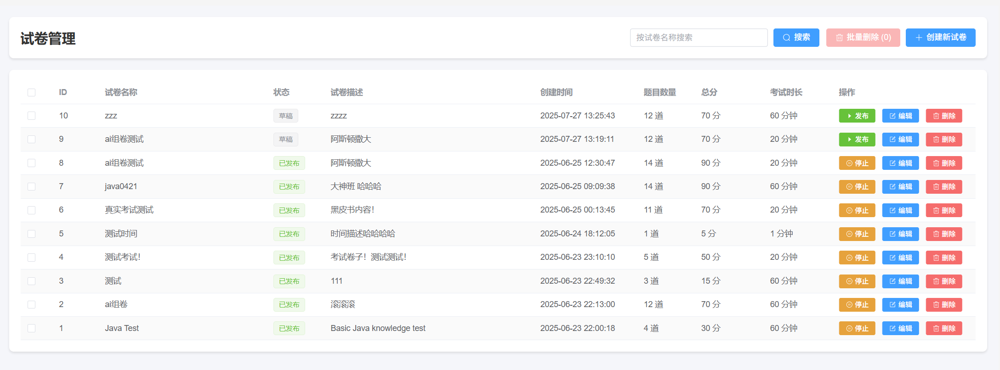
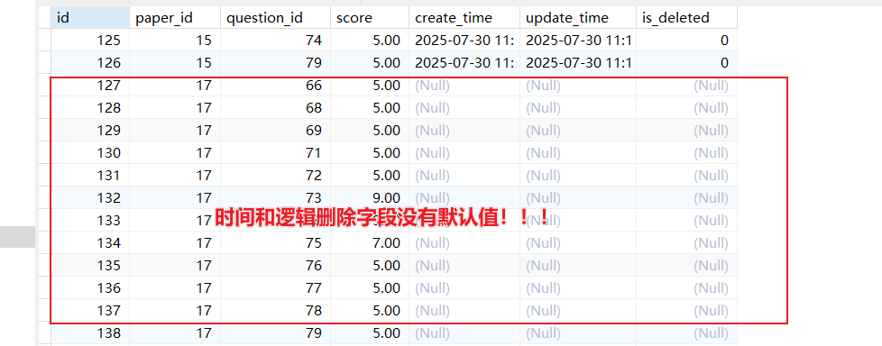

# 硅谷AI链习室- 试卷管理篇

[TOC]

## 一、模块概述

试卷管理是智能学习平台的核心功能模块之一，它直接关系到考试能否顺利创建和进行。本模块旨在提供一个全面、灵活且强大的试卷创建与管理解决方案，支持**手动组卷**和**AI智能组卷**两种模式，满足不同场景下的组卷需求。

本模块采用Spring Boot + MyBatis Plus技术栈，实现了对试卷的增、删、改、查、发布、停用等全生命周期管理功能。



### 核心功能特性

-   **两种组卷模式**：
    -   **手动组卷**：允许管理员从题库中精确挑选题目，并为每道题设置特定分数，实现对试卷内容的完全掌控。
    -   **AI智能组卷**：根据预设规则（如题型、知识点、题目数量、分数）自动从题库中抽取题目，快速生成一份符合要求的试卷，极大提升组卷效率。
-   **全生命周期管理**：支持试卷从“草稿”到“发布”再到“停用”的状态流转。
-   **动态数据计算**：在创建和更新试卷时，自动计算并存储试卷的总分和题目总数。
-   **数据完整性校验**：在删除试卷时，检查其状态，防止已发布的试卷被误删，确保考试数据的严肃性。

试卷管理共包含以下7个核心接口：

1.  **获取试卷列表** `GET /api/papers/list` - 获取所有试卷的列表，支持按名称和状态进行筛选查询。
2.  **获取试卷详情** `GET /api/papers/{id}` - 获取单份试卷的完整信息，包括其包含的所有题目详情及分值。
3.  **手动创建试卷** `POST /api/papers` - 通过手动选择题目并指定分数的方式创建一份新试卷。
4.  **AI智能组卷** `POST /api/papers/ai` - 根据设定的规则（题型、分类、数量、分数）自动生成一份新试卷。
5.  **更新试卷信息** `PUT /api/papers/{id}` - 修改已存在的试卷信息，包括题目构成和各题分值。
6.  **更新试卷状态** `POST /api/papers/{id}/status` - 用于发布或停用试卷。
7.  **删除试卷** `DELETE /api/papers/{id}` - 删除一份处于“草稿”状态的试卷。

## 二、数据库表结构

试卷管理模块主要涉及两张核心表：`paper`（试卷主表）和 `paper_question`（试卷与题目的关联表）。

### 2.1 试卷表 (paper)

用于存储试卷的基本信息，如名称、描述、总分、时长和状态等。

```sql
-- 摘自 exam_system_new.sql
CREATE TABLE `paper`  (
  `id` int NOT NULL AUTO_INCREMENT,
  `name` varchar(100) CHARACTER SET utf8mb4 COLLATE utf8mb4_0900_ai_ci NOT NULL,
  `description` text CHARACTER SET utf8mb4 COLLATE utf8mb4_0900_ai_ci NULL,
  `status` varchar(20) CHARACTER SET utf8mb4 COLLATE utf8mb4_0900_ai_ci NULL DEFAULT 'DRAFT',
  `total_score` decimal(10, 2) NULL DEFAULT 0.00,
  `question_count` int NULL DEFAULT 0,
  `duration` int NOT NULL,
  `create_time` timestamp NULL DEFAULT CURRENT_TIMESTAMP COMMENT '创建时间',
  `update_time` timestamp NULL DEFAULT CURRENT_TIMESTAMP ON UPDATE CURRENT_TIMESTAMP COMMENT '更新时间',
  `is_deleted` tinyint NULL DEFAULT 0 COMMENT '0-未删除，1-已删除',
  PRIMARY KEY (`id`) USING BTREE
) ENGINE = InnoDB COMMENT = '试卷信息表';
```

**字段说明：**

-   `id`：主键，自增唯一标识。
-   `name`：试卷名称。
-   `description`：试卷的详细描述。
-   `status`：试卷状态，枚举值，如 `DRAFT` (草稿), `PUBLISHED` (已发布), `STOPPED` (已停用)。
-   `total_score`：试卷总分，由所有题目分数累加得出。
-   `question_count`：试卷包含的题目总数。
-   `duration`：考试时长，单位为分钟。

### 2.2 试卷-题目关联表 (paper_question)

这是一张中间表，用于记录试卷与题目之间的多对多关系，并存储每道题目在特定试卷中的分值。

```sql
-- 摘自 exam_system_new.sql
CREATE TABLE `paper_question`  (
  `id` int NOT NULL AUTO_INCREMENT,
  `paper_id` int NOT NULL,
  `question_id` bigint NOT NULL,
  `score` decimal(10, 2) NOT NULL,
  `create_time` timestamp NULL DEFAULT CURRENT_TIMESTAMP COMMENT '创建时间',
  `update_time` timestamp NULL DEFAULT CURRENT_TIMESTAMP ON UPDATE CURRENT_TIMESTAMP COMMENT '更新时间',
  `is_deleted` tinyint NULL DEFAULT 0 COMMENT '0-未删除，1-已删除',
  PRIMARY KEY (`id`) USING BTREE
) ENGINE = InnoDB COMMENT = '试卷题目关联表';
```

**字段说明：**

-   `paper_id`：外键，关联 `paper` 表的 `id`。
-   `question_id`：外键，关联 `questions` 表的 `id`。
-   `score`：该题目在这份试卷中所占的分数。

## 三、实体类设计

### 3.1 试卷实体类 (Paper.java)

与 `paper` 表对应，并增加了业务所需的字段。

```java
/**
 * 试卷实体类
 */
@Data
@TableName("paper")
@Schema(description = "试卷信息")
public class Paper extends BaseEntity {

    @Schema(description = "试卷名称")
    private String name;

    @Schema(description = "试卷描述")
    private String description;

    @Schema(description = "试卷状态，如 DRAFT, PUBLISHED, STOPPED")
    private String status;

    @Schema(description = "试卷总分")
    private BigDecimal totalScore;

    @Schema(description = "题目数量")
    private Integer questionCount;

    @Schema(description = "考试时长（分钟）")
    private Integer duration;

    @Schema(description = "试卷包含的题目列表")
    @TableField(exist = false)
    private List<Question> questions;
}
```

**设计说明：**

-   `@TableName("paper")`：将实体类与数据库的 `paper` 表映射。
-   `@TableField(exist = false)`：`questions` 字段是业务需要，用于在查询详情时承载该试卷下的所有题目信息，它在 `paper` 表中没有对应的物理字段，因此需要此注解来忽略映射。

### 3.2 试卷-题目关联实体类 (PaperQuestion.java)

与 `paper_question` 表对应。

```java
/**
 * 试卷-题目关联实体类
 */
@Data
@TableName("paper_question")
@Schema(description = "试卷与题目的关联信息")
public class PaperQuestion extends BaseEntity {

    @Schema(description = "试卷ID")
    private Integer paperId;

    @Schema(description = "题目ID")
    private Long questionId;

    @Schema(description = "该题目在此试卷中的分数")
    private BigDecimal score;
    
    // 构造函数，方便创建实例
    public PaperQuestion(Integer paperId, Long questionId, BigDecimal score) {
        this.paperId = paperId;
        this.questionId = questionId;
        this.score = score;
    }
}
```

## 四、试卷管理接口功能实现

### 4.1 获取试卷列表接口（GET /api/papers/list）

此接口用于获取所有试卷的列表，支持按名称和状态进行条件筛选。

#### 4.1.1 接口分析

**接口地址**: `/api/papers/list`
**请求方式**: `GET`
**请求参数**:

| 参数名  | 说明                                       | 数据类型 | 是否必须 |
| :------ | :----------------------------------------- | :------- | :------- |
| `name`  | 试卷名称，用于模糊查询                     | `String` | 否       |
| `status`| 试卷状态 (`DRAFT`, `PUBLISHED`, `STOPPED`) | `String` | 否       |

**响应参数**:

```json
{
  "code": 200,
  "message": "操作成功",
  "data": [
    {
      "id": 1,
      "name": "Java基础知识摸底测试",
      "description": "考察Java基础语法和面向对象",
      "status": "PUBLISHED",
      "totalScore": 100.00,
      "questionCount": 20,
      "duration": 120,
      "createTime": "2025-07-29T10:00:00"
    }
  ]
}
```

#### 4.1.2 功能实现

*   **PaperController.java**

    Controller层负责接收HTTP请求，构建查询条件，并调用Service层。

    ```java
    @Autowired
    private PaperService paperService;
    
    /**
      * 获取所有试卷列表（支持模糊搜索和状态筛选）
      */
    @GetMapping("/list")  // 处理GET请求
    @Operation(summary = "获取试卷列表", description = "支持按名称模糊搜索和状态筛选的试卷列表查询")  // API描述
    public Result<java.util.List<Paper>> listPapers(
        @Parameter(description = "试卷名称，支持模糊查询") @RequestParam(required = false) String name,
        @Parameter(description = "试卷状态，可选值：DRAFT/PUBLISHED/STOPPED") @RequestParam(required = false) String status) {
    
        LambdaQueryWrapper<Paper> queryWrapper = new LambdaQueryWrapper<>();
        queryWrapper.like(!ObjectUtils.isEmpty(name), Paper::getName, name);
        queryWrapper.eq(!ObjectUtils.isEmpty(status), Paper::getStatus, status);
        List<Paper> paperList = paperService.list(queryWrapper);
        log.info("试卷列表接口调用成功！本次条件：name = {} , status = {} , 查询列表为：{}",
                 name, status, paperList);
        return Result.success(paperList);
    }
    ```
    
*   **PaperService.java (MyBatis Plus自带)**

    由于只是简单的条件查询，MyBatis Plus提供的 `list(queryWrapper)` 方法已经能满足需求，因此 `PaperService` 接口和 `PaperServiceImpl` 中无需额外编写代码。

#### 4.1.3 知识点

-   **动态条件查询**：通过 `QueryWrapper` 动态构建SQL的 `WHERE` 子句，实现了灵活的筛选功能。`StringUtils.hasText()` 用于判断查询参数是否有效，避免了对空字符串或`null`的查询。
-   **RESTful API设计**：使用 `GET` 方法获取资源列表，并通过URL查询参数（Query Parameters）传递筛选条件，符合RESTful设计规范。
-   **@CrossOrigin:**  解决跨域问题

### 4.2 获取试卷详情接口（GET /api/papers/{id}）

此接口是获取一份试卷完整数据的入口，包括试卷基本信息和其包含的所有题目详情。

#### 4.2.1 接口分析

**接口地址**: `/api/papers/{id}`
**请求方式**: `GET`
**路径参数**:

| 参数名 | 说明   | 数据类型 |
| :----- | :----- | :------- |
| `id`   | 试卷ID | `Integer`|

**响应参数**:

```json
{
  "code": 200,
  "message": "操作成功",
  "data": {
    "id": 1,
    "name": "Java基础知识摸底测试",
    // ...其他试卷信息...
    "questions": [
      {
        "id": 101,
        "title": "Java中哪个关键字用于声明一个类？",
        "type": "CHOICE",
        "paperScore": 5.00, // 在本试卷中的分值
        "choices": [
          {"content": "class", "isCorrect": true},
          {"content": "interface", "isCorrect": false}
        ]
        答案:{}  
      }
    ]
  }
}
```

#### 4.2.2 功能实现

该功能的实现涉及多表关联查询，是Service层复杂业务逻辑的典型体现。

* 实现逻辑和步骤

  ```
  单表java代码进行paper查询
  校验paper == null -> 抛异常
  根据paperid查询题目集合（中间，题目，答案，选项）
  校验题目集合 == null -> 赋空集合！ log->做好记录
  对题目进行排序（选择 -> 判断 -> 简答）
  注意：type排序，是字符类型 -》 字符 -》 对应 -》 固定的数字 1 2 3
  进行paper题目集合赋值
  ```
  
* **PaperController.java**

  ```java
  /**
    * 获取试卷详情（包含题目）
    */
  @GetMapping("/{id}")  // 处理GET请求
  @Operation(summary = "获取试卷详情", description = "获取试卷的详细信息，包括试卷基本信息和包含的所有题目")  // API描述
  public Result<Paper> getPaperById(@Parameter(description = "试卷ID") @PathVariable Long id) {
      Paper paper =  paperService.customPaperDetailById(id);
      log.info("查询试卷详情接口成功！试卷信息为:{}",paper);
      return Result.success(paper);
  }
  ```

* **PaperService.java**

  ```java
  public interface PaperService extends IService<Paper> {
      /**
       * 根据试卷id试卷详情
       *    试卷对象
       *    题目集合
       *    注意： 题目的选项sort正序
       *    注意： 所有题目根据类型排序
       * @param id 试卷id
       * @return
       */
      Paper customPaperDetailById(Long id);
  }
  ```

*   **PaperServiceImpl.java**

    这是实现的核心，需要精心设计以避免“N+1查询”问题。

    ```java
    **
     * 试卷服务实现类
     */
    @Slf4j
    @Service
    public class PaperServiceImpl extends ServiceImpl<PaperMapper, Paper> implements PaperService {
    
       @Autowired
        private QuestionMapper questionMapper;
    
        @Autowired
        private PaperQuestionService paperQuestionService;
    
        @Autowired
        private ExamRecordMapper examRecordMapper;
    
        /**
         * 根据试卷id试卷详情
         * 试卷对象
         * 题目集合
         * 注意： 题目的选项sort正序
         * 注意： 所有题目根据类型排序
         * @param id 试卷id
         * @return
         */
        @Override
        public Paper customPaperDetailById(Long id) {
            //1. 单表java代码进行paper查询
            Paper paper = getById(id);
            //2. 校验paper == null -> 抛异常
            if (paper == null){
                throw new RuntimeException("指定id:%s试卷已经被删除，无法查看详情！".formatted(id));
            }
            //3. 根据paperid查询题目集合（中间，题目，答案，选项）
            List<Question> questionList = questionMapper.customQueryQuestionListByPaperId(id);
            //4. 校验题目集合 == null -> 赋空集合！ log->做好记录
            if (ObjectUtils.isEmpty(questionList)){
                paper.setQuestions(new ArrayList<Question>());
                log.warn("试卷中没有题目！可以进行试卷编辑！但是不能用于考试！！,对应试卷id：{}",id);
                return paper;
            }
            log.debug("题目信息排序前：{}",questionList);
            //对题目进行排序（选择 -> 判断 -> 简答）
            questionList.sort((o1, o2) -> Integer.compare(typeToInt(o1.getType()),typeToInt(o2.getType())));
            //注意：type排序，是字符类型 -》 字符 -》 对应 -》 固定的数字 1 2 3
            log.debug("题目信息排序后：{}",questionList);
            //进行paper题目集合赋值
            paper.setQuestions(questionList);
            return paper;
        }
        
        /**
         * 获取题目类型的排序顺序
         * @param type 题目类型
         * @return 排序序号
         */
        private int typeToInt(String type) {
            switch (type) {
                case "CHOICE": return 1; // 选择题
                case "JUDGE": return 2;  // 判断题
                case "TEXT": return 3;   // 简答题
                default: return 4;       // 其他类型
            }
        }
    }
    ```

* **QuestionMapper.java**

  ```java
   /**
     * 根据试卷id查询题目集合
     * @param paperId
     * @return
   */
  List<Question> customQueryQuestionListByPaperId(Long paperId);
  ```

* **QuestionMapper.xml**

  ```xml
  <resultMap id="detailQuestionMap" type="com.atguigu.exam.entity.Question">
      <id column="id" property="id" />
      <association property="answer" javaType="com.atguigu.exam.entity.QuestionAnswer">
          <id column="qas_id" property="id" />
          <result column="qas_create_time" property="createTime" />
          <result column="qas_update_time" property="updateTime" />
          <result column="question_id" property="questionId" />
      </association>
      <collection property="choices" ofType="com.atguigu.exam.entity.QuestionChoice" notNullColumn="qcs_id">
          <id column="qcs_id" property="id" />
          <result column="qcs_question_id" property="questionId" />
          <result column="qcs_create_time" property="createTime" />
          <result column="qcs_update_time" property="updateTime" />
      </collection>
  </resultMap>
  
  <select id="customQueryQuestionListByPaperId" resultMap="detailQuestionMap">
      select
      qs.*,
      qas.id qas_id,
      qas.question_id,
      qas.answer,
      qas.keywords,
      qas.create_time qas_create_time,
      qas.update_time qas_update_time,
      qcs.id qcs_id,
      qcs.question_id qcs_question_id,
      qcs.content,
      qcs.is_correct,
      qcs.sort,
      qcs.create_time qcs_create_time,
      qcs.update_time qcs_update_time,
      pq.score  paper_score
      from paper_question pq
      join questions qs on pq.question_id = qs.id
      join question_answers qas on qs.id = qas.question_id
      left join question_choices qcs on qs.id = qcs.question_id and qcs.is_deleted  = 0
      where pq.is_deleted = 0 and qs.is_deleted = 0 and qas.is_deleted = 0 and pq.paper_id = #{paperId} order by qcs.sort asc ;
  </select>
  ```

#### 4.2.3 知识点

-   **避免N+1查询**：这是该接口实现最重要的优化点。我们没有遍历`questions`列表然后逐个查询其选项和答案（这会引发N+1次数据库查询），而是通过`selectBatchIds`和`in`查询将所有相关数据一次性捞取到内存中，再利用`Map`进行高效组装。这是提升复杂查询性能的关键技巧。
-   **Stream API高级应用**：通过`Collectors.toMap`和`Collectors.groupingBy`将列表数据转换成`Map`，极大地简化了数据匹配和组装的逻辑，代码更具可读性和表现力。
-   **业务逻辑的内聚**：将复杂的、涉及多表操作的业务逻辑封装在`PaperServiceImpl`的`getPaperWithQuestions`方法中，保持了Controller的简洁性，符合分层架构的最佳实践。

### 4.3 手动创建试卷接口（POST /api/papers）

此接口用于通过手动选择题目并为每道题指定分数的方式，来创建一份试卷。

#### 4.3.1 接口分析

**接口地址**: `/api/papers`
**请求方式**: `POST`
**请求体 (JSON)**:

```json
{
  "name": "Java高级特性-期中考试",
  "description": "考察多线程、JVM、设计模式等知识点",
  "duration": 90,
  "questions": {
    "105": 10,  // Key: 题目ID, Value: 分数
    "108": 10,
    "210": 20
  }
}
```

**响应参数**: 成功创建后的试卷信息。

#### 4.3.2 功能实现

* **PaperController.java**

  ```java
  /**
    * 手动创建试卷
    */
  @PostMapping  // 处理POST请求
  @Operation(summary = "手动创建试卷", description = "通过手动选择题目的方式创建试卷")  // API描述
  public Result<Paper> createPaper(@RequestBody PaperVo paperVo) {
      Paper paper = paperService.customCreatePaper(paperVo);
      log.info("手动组卷成功！试卷信息为：{}",paper);
      return Result.success(paper, "试卷创建成功");
  }
  ```

*   **PaperService.java**

    ```java
    public interface PaperService extends IService<Paper> {
       /**
         * 手动组卷
         * @param paperVo
         * @return
         */
        Paper customCreatePaper(PaperVo paperVo);
    }
    ```

*   **PaperServiceImpl.java**

    ```java
    @Override
    public Paper customCreatePaper(PaperVo paperVo) {
        //1. 完善试卷内信息 名字 描述 时间  -> 状态 ，总题目数 ， 总分数
        Paper paper = new Paper();
        //名字 描述 时间
        BeanUtils.copyProperties(paperVo,paper);
        //态 ，总题目数, 总分数
        paper.setStatus("DRAFT");
        if (ObjectUtils.isEmpty(paperVo.getQuestions())){
            //本次没选题目
            paper.setTotalScore(BigDecimal.ZERO);
            paper.setQuestionCount(0);
            save(paper);
            log.warn("本次{}组卷，没有选择题目！注意没有题目的试卷无法进行考试！！",paper);
            return paper;
        }
        /*
            状态默认值： DRAFT
            总题目数： question长度
            总分数： question分数的和
         */
        paper.setQuestionCount(paperVo.getQuestions().size());
        paper.setTotalScore(paperVo.getQuestions().values().stream().reduce(BigDecimal.ZERO, BigDecimal::add));
        //2. 完成试卷的插入 -》 主键回显 paperId
        save(paper);
    
        //3. 中间表集合插入 【批量插入】 -》 中间表的service对象
        List<PaperQuestion> paperQuestionList = paperVo.getQuestions().entrySet().stream().
            map(entry -> new PaperQuestion(paper.getId().intValue(), Long.valueOf(entry.getKey()), entry.getValue()))
            .collect(Collectors.toList());
    
        //4. 中间表的批量插入
        paperQuestionService.saveBatch(paperQuestionList);
        return paper;
    }
    ```

#### 4.3.3 知识点

-   **事务管理 (`@Transactional`)**：由于该操作涉及对`paper`和`paper_question`两张表的写入，必须使用`@Transactional`注解。这能保证所有数据库操作要么全部成功，要么在任何一步失败时全部回滚，从而避免了数据不一致（例如，只创建了试卷但没有关联题目）的脏数据问题。
-   **数据传输对象 (Vo)**：`PaperVo`作为数据传输对象，专门用于接收前端的请求数据。它的结构与前端请求体完全对应，使得Controller层代码更清晰，并且将表现层数据与领域实体Paper解耦。

#### 4.3.4 批量插入扩展和优化

* 优化场景

  在手动组卷场景中，需批量插入试卷与题目关联数据（paperQuestion）。由于当前未实现 paperQuestion 对应的 Service 层，只能通过 Mapper 直接操作数据库；而 MyBatis-Plus 的 BaseMapper 默认不提供批量插入方法，导致现有代码不得不通过循环逐条插入来实现批量效果，这种方式会产生大量数据库交互，性能较差。

  ```java
   paperQuestions.forEach(paperQuestionMapper::insert); // 批量插入
  ```

* 优化方案

  针对手动组卷中试卷问题（paperQuestion）的批量插入性能问题，可通过 MyBatis-Plus 扩展Mapper层批量插入方法优化！

  需使用 3.3.0 及以上版本（支持`InsertBatchSomeColumn`批量插入器），在 pom.xml 中确认版本：·

  ```xml
  <dependency>
      <groupId>com.baomidou</groupId>
      <artifactId>mybatis-plus-boot-starter</artifactId>
      <version>3.5.3.1</version> <!-- 3.3.0+版本 -->
  </dependency>
  ```

* 优化实现

  * 配置批量插入 SQL 注入器

    在`com.atguigu.exam.config.MybatisPlusConfiguration`配置类，向 MyBatis-Plus 注册批量插入方法，使其自动生成批量插入 SQL：

    ```java
    @Configuration
    @MapperScan("com.atguigu.exam.mapper")
    public class MybatisPlusConfiguration {
    
        @Bean
        public MybatisPlusInterceptor mybatisPlusInterceptor() {
            MybatisPlusInterceptor interceptor = new MybatisPlusInterceptor();
            interceptor.addInnerInterceptor(new PaginationInnerInterceptor(DbType.MYSQL));
            return interceptor;
        }
    
        @Bean
        public DefaultSqlInjector sqlInjector() {
            return new DefaultSqlInjector() {
                @Override
                public List<AbstractMethod> getMethodList(Class<?> mapperClass, TableInfo tableInfo) {
                    List<AbstractMethod> methods = super.getMethodList(mapperClass, tableInfo);
                    // 注册批量插入方法（默认方法名为insertBatchSomeColumn）
                    methods.add(new InsertBatchSomeColumn());
                    return methods;
                }
            };
        }
    }
    ```

    关于 DefaultSqlInjector 的简单解释：

    DefaultSqlInjector是 MyBatis-Plus 的默认 SQL 注入器，它的核心作用是**自动为 Mapper 接口生成基础 CRUD（增删改查）方法对应的 SQL 语句**，无需手动编写 XML 映射。

    它默认包含了insert（新增）、updateById（根据 ID 更新）、selectById（根据 ID 查询）等常用方法的 SQL 生成逻辑。当我们需要扩展自定义方法（如批量插入）时，通过继承它并重写getMethodList方法，可将自定义的 SQL 生成规则（如InsertBatchSomeColumn）添加进去，让 Mapper 接口自动拥有该方法的实现。

  *  在 PaperQuestionMapper 中声明批量插入方法

    ```java
    // 声明批量插入方法，参数为实体列表
    
    /**
      1. 要求1 方法名称固定 insertBatchSomeColumn
      2. 要求2 参数必须是list实体类集合
    */
    int insertBatchSomeColumn(List<PaperQuestion> list);
    ```

  * 修改手动组卷批量业务（createPaper方法）

    ```java
    //替换原有代码
    paperQuestionMapper.insertBatchSomeColumn(paperQuestions);
    //paperQuestions.forEach(paperQuestionMapper::insert); // 批量插入
    ```

* 问题和解决方案

  * 问题

    ```  
    /**
     *
     * <li> 注意: 这是自选字段 insert !!,如果个别字段在 entity 里为 null 但是数据库中有配置默认值, insert 后数据库字段是为 null 而不是默认值 </li>
     */
    @SuppressWarnings("serial")
    public class InsertBatchSomeColumn extends AbstractMethod {
    ```
    

批量插入插件自带bug! 数据库中默认值字段不会生效！
    
组卷结果为：
    

    
* 解决
  
  https://baomidou.com/guides/auto-fill-field/
  
  MyBatis-Plus 提供了一个便捷的自动填充功能，用于在插入或更新数据时自动填充某些字段，如创建时间、更新时间等。以下是如何使用这一功能的详细说明。
  
  修改BaseEntity设置自动填充规则：
  
  ```java
    @Data
    public class BaseEntity implements Serializable {
    
        @Schema(description = "主键")
        @TableId(value = "id", type = IdType.AUTO)
        private Long id;
    
        @Schema(description = "创建时间")
        @TableField(fill = FieldFill.INSERT)
        private Date createTime;
    
        @Schema(description = "修改时间")
        @JsonIgnore
        @TableField(fill = FieldFill.UPDATE)
        private Date updateTime;
    
        @Schema(description = "逻辑删除")
        @TableField(value = "is_deleted",fill = FieldFill.INSERT)
        @TableLogic
        private Byte isDeleted;
    }
  ```
  
  编写自动填充实现配置类：
  
  `com.atguigu.exam.common.MyMetaObjectHandler`
  
  ```java
    @Slf4j
    @Component
    public class MyMetaObjectHandler implements MetaObjectHandler {
    
        @Override
        public void insertFill(MetaObject metaObject) {
            log.info("开始插入填充...");
            this.strictInsertFill(metaObject, "createTime", Date.class, new Date());
            this.strictInsertFill(metaObject, "isDeleted", Byte.class, (byte)0);
        }
    
        @Override
        public void updateFill(MetaObject metaObject) {
            log.info("开始更新填充...");
    //        this.strictInsertFill(metaObject, "updateUserId", Long.class, 123456L)
            this.strictUpdateFill(metaObject, "updateTime", Date.class, new Date());
        }
    }
  ```

### 4.4 AI智能组卷接口（POST /api/papers/ai）

此接口是本模块的一大亮点，它根据用户设定的规则自动、快速地生成一份试卷。

**智能创建试卷（AI 组卷）业务流程**：

1. **初始化并保存试卷基本信息**
   - 创建试卷对象，设置名称、描述、时长等基本信息，初始状态为 “草稿”。
   - 先插入数据库获取试卷 ID（为后续关联题目做准备）。
2. **遍历组卷规则，处理每个题型规则**
   - 跳过题目数量为 0 的无效规则。
   - 构建查询条件：根据题型（如选择题、判断题）和指定分类筛选可用题目，仅查询题目 ID（提高效率）。
   - 随机抽取题目：打乱符合条件的题目 ID，选取不超过规则数量的题目（取规则数量与实际可用数量的最小值）。
3. **累计试卷真实数据（题数和分数）**
   - 累加实际选取的题目总数（`totalQuestionCount`）。
   - 按 “实际题数 × 单题分值” 累加试卷总分（`totalScore`）。
4. **建立试卷与题目的关联关系**
   - 为选中的题目创建关联记录（`PaperQuestion`），存储试卷 ID、题目 ID 和单题分值。
   - 批量插入关联记录（优化后），减少数据库交互。
5. **更新试卷最终信息**
   - 将累计的总题数和总分更新到试卷对象中。
   - 保存更新后的试卷信息。
6. **返回结果**
   - 返回包含完整信息的试卷对象。

#### 4.4.1 接口分析

**接口地址**: `/api/papers/ai`
**请求方式**: `POST`
**请求体 (JSON)**:

```json
{
  "name": "AI生成的Java综合能力测试",
  "description": "AI自动生成，全面考察",
  "duration": 60,
  "rules": [
    {
      "type": "CHOICE",
      "categoryIds": [16, 17], // Java基础, Java进阶
      "count": 5,
      "score": 10
    },
    {
      "type": "JUDGE",
      "categoryIds": [21], // Java语法
      "count": 5,
      "score": 5
    },
    {
      "type": "TEXT",
      "categoryIds": [24], // 系统设计
      "count": 1,
      "score": 25
    }
  ]
}
```

**响应参数**: 成功创建后的试卷信息。

#### 4.4.2 功能实现

* **PaperController.java**

  ```java
  /**
    * AI智能组卷（新版）
    * @param aiPaperVo 包含试卷信息和组卷规则的数据
    * @return 创建好的试卷
    */
  @PostMapping("/ai")  // 处理POST请求
  @Operation(summary = "AI智能组卷", description = "基于设定的规则（题型分布、难度配比等）使用AI自动生成试卷")  // API描述
  public Result<Paper> createPaperWithAI(@RequestBody AiPaperVo aiPaperVo) {
      Paper paper = paperService.customAiCreatePaper(aiPaperVo);
      log.info("智能组卷成功！试卷信息为：{}",paper);
      return Result.success(paper, "AI智能组卷成功");
  }
  ```

*   **PaperService.java**

    ```java
    public interface PaperService extends IService<Paper> {
        /**
         * 智能组卷
         * @param aiPaperVo
         * @return
         */
        Paper customAiCreatePaper(AiPaperVo aiPaperVo);
    }
    ```

*   **PaperServiceImpl.java**

    这是AI组卷的核心逻辑，关键在于如何根据规则高效、随机地从题库中抽取题目。

    ```java
    @Service
    public class PaperServiceImpl extends ServiceImpl<PaperMapper, Paper> implements PaperService {
    
        @Override
        public Paper customAiCreatePaper(AiPaperVo aiPaperVo) {
            //1. 试卷的基本属性赋值并保存 （名字 描述 时间 状态）
            Paper paper = new Paper();
            BeanUtils.copyProperties(aiPaperVo,paper);
            paper.setStatus("DRAFT");
            save(paper);
    
            //2. 组卷规则下的试题选择和中间表的保存
            int questionCount = 0;
            BigDecimal totalScore = BigDecimal.ZERO;
            for (RuleVo rule : aiPaperVo.getRules()) {
                //步骤1：校验规则下的题目数量 = 0 跳过
                if (rule.getCount() == 0){
                    log.warn("在：{}类型下，不需要出题！",rule.getType().name());
                    continue;
                }
                //步骤2：查询当前规则下的所有题目集合 【type categoryIds】
                LambdaQueryWrapper<Question> queryWrapper = new LambdaQueryWrapper<>();
                queryWrapper.eq(Question::getType, rule.getType().name());
                queryWrapper.in(!ObjectUtils.isEmpty(rule.getCategoryIds()),Question::getCategoryId, rule.getCategoryIds());
                List<Question> allQuestionList = questionMapper.selectList(queryWrapper);
    
                //步骤3：校验查询的题目集合，集合为空！跳过本次！
                if (ObjectUtils.isEmpty(allQuestionList)){
                    log.warn("在：{}类型下，我们指定的分类：{},没有查询到题目信息！",rule.getType().name(),rule.getCategoryIds());
                    continue;
                }
    
                //步骤4：判断下是否有规则下count数量！ 没有要全部了
                int realNumbers = Math.min(rule.getCount(), allQuestionList.size());
    
                //步骤5：本次规则下添加的数量和分数累加
                questionCount += realNumbers;
                totalScore =  totalScore.add(BigDecimal.valueOf((long) realNumbers * rule.getScore()));
    
                //步骤6：先打乱数据，再截取需要题目数量
                Collections.shuffle(allQuestionList);
                List<Question> realQuestionList = allQuestionList.subList(0, realNumbers);
    
                //步骤7：转成中间表并进行保存
                List<PaperQuestion> paperQuestionList = realQuestionList.stream().map(question ->
                        new PaperQuestion(paper.getId().intValue(), question.getId(), BigDecimal.valueOf(rule.getScore()))
                ).collect(Collectors.toList());
                paperQuestionService.saveBatch(paperQuestionList);
            }
            //3. 修改试卷信息（总题数，总分数）
            paper.setQuestionCount(questionCount);
            paper.setTotalScore(totalScore);
            updateById(paper);
            //4. 返回试卷对象
            return paper;
        }
    }
    ```

#### 4.4.3 知识点

- **随机抽题算法**：`Collections.shuffle()` 是实现随机抽题的核心。它能高效地将一个列表（这里是符合条件的题目ID列表）的元素顺序随机打乱。之后只需从列表头部按需取出指定数量的题目即可。

- **数据库查询优化**：在抽题时，先`select("id")`只查询出符合条件的题目ID，而不是捞取所有题目的完整信息。这大大减少了数据库到应用服务器的数据传输量，提升了查询效率。待确定最终的题目ID后，再进行关联表的插入。

- **鲁棒性处理**：代码中考虑了题库题目数量不足的情况，并记录了警告日志。这是保证程序在非理想情况下依然能合理运行（而不是抛出异常中断）的重要实践。

  > **鲁棒性（Robustness）** 是计算机科学和软件工程中的一个重要概念，指的是系统或程序在面对**异常、错误、非法输入或非理想条件**时，依然能够保持稳定运行、合理处理问题而不崩溃的能力。

- **Stream流返回的列表类型**：

  - `stream.toList()`：返回**不可修改的列表**（如`ImmutableList`），不能添加 / 删除元素，否则抛异常。
  - `collect(Collectors.toList())`：返回**可修改的列表**（通常是`ArrayList`），支持增删操作。

  - `toList()`是 Java 16 + 新增方法。
  - `Collectors.toList()`在 Java 8 及以上可用，兼容性更广。

### 4.5 更新试卷信息接口（PUT /api/papers/{id}）

此接口用于修改一份已存在的试卷，功能与手动创建类似，但作用于已有数据。

#### 4.5.1 接口分析

**接口地址**: `/api/papers/{id}`
**请求方式**: `PUT`
**请求体 (JSON)**: 与手动创建接口一致。

#### 4.5.2 功能实现

* **PaperController.java**

  ```java
  /**
    * 更新试卷
    * @param id 试卷ID
    * @param paperVo 试卷更新数据
    * @return 操作结果
    */
  @PutMapping("/{id}")  // 处理PUT请求
  @Operation(summary = "更新试卷信息", description = "更新试卷的基本信息和题目配置")  // API描述
  public Result<Paper> updatePaper(
      @Parameter(description = "试卷ID") @PathVariable Integer id, 
      @RequestBody PaperVo paperVo) {
      Paper paper = paperService.customUpdatePaper(id,paperVo);
      log.info("试卷{}信息更新成功！！",paper);
      return Result.success(paper, "试卷更新成功");
  }
  ```

*   **PaperService.java**

    ``` java
/**
      * 更新试卷内信息
      * @param id
      * @param paperVo
      * @return
      */
    Paper customUpdatePaper(Integer id, PaperVo paperVo);
    ```
    
*   **PaperServiceImpl.java**

    更新操作通常采用“先删除旧关联，再插入新关联”的策略，以简化逻辑。

    ```java
    @Override
    public Paper customUpdatePaper(Integer id, PaperVo paperVo) {
    
        //1.校验 （不能发布状态 ， 不能不同id,name相同）
        Paper paper = getById(id);
        if ("PUBLISHED".equals(paper.getStatus())){
            throw new RuntimeException("发布状态下的试卷不允许修改！");
        }
        //校验id name
        LambdaQueryWrapper<Paper> queryWrapper = new LambdaQueryWrapper<>();
        queryWrapper.ne(Paper::getId, id);
        queryWrapper.eq(Paper::getName,paperVo.getName());
        long count = count(queryWrapper);
        if (count > 0){
            throw new RuntimeException("%s 试卷名字已经存在，请重新修改！".formatted(paperVo.getName()));
        }
        //2.试卷的主体
        BeanUtils.copyProperties(paperVo,paper);
        /*
          状态默认值： DRAFT
          总题目数： question长度
          总分数： question分数的和
         */
        paper.setQuestionCount(paperVo.getQuestions().size());
        paper.setTotalScore(paperVo.getQuestions().values().stream().reduce(BigDecimal.ZERO, BigDecimal::add));
        updateById(paper);
    
        //3. 中间表的批量插入
        paperQuestionService.remove(new LambdaQueryWrapper<PaperQuestion>().eq(PaperQuestion::getPaperId,paper.getId()));
        List<PaperQuestion> paperQuestionList = paperVo.getQuestions().entrySet().stream().
            map(entry -> new PaperQuestion(paper.getId().intValue(), Long.valueOf(entry.getKey()), entry.getValue()))
            .collect(Collectors.toList());
    
        //4. 中间表的批量插入
        paperQuestionService.saveBatch(paperQuestionList);
        return paper;
    }
    ```

#### 4.5.3 知识点

-   **幂等性操作**：`PUT`请求在RESTful设计中应具备幂等性，即多次使用相同的参数执行请求，其结果应与一次执行相同。本实现通过“先删后插”保证了这一点，无论调用多少次，最终试卷的题目构成都是由最后一次的`paperVo`决定的。
-   **原子性操作**：同样，`@Transactional`注解在此处至关重要，它确保了“更新主表”、“删除旧关联”、“插入新关联”这三个步骤被捆绑成一个原子操作。

### 4.6 更新试卷状态接口（POST /api/papers/{id}/status）

此接口专门用于改变试卷的状态，如“发布”或“停用”。

#### 4.6.1 接口分析

**接口地址**: `/api/papers/{id}/status`
**请求方式**: `POST`
**路径参数**: `id` (试卷ID)
**查询参数**: `status` (新的状态值, 如 `PUBLISHED` 或 `STOPPED`)

#### 4.6.2 功能实现

* **PaperController.java**

  ```java
  /**
    * 更新试卷状态（发布/停止）
    * @param id 试卷ID
    * @param status 新的状态
    * @return 操作结果
    */
  @PostMapping("/{id}/status")  // 处理POST请求
  @Operation(summary = "更新试卷状态", description = "修改试卷状态：发布试卷供学生考试或停止试卷禁止考试")  // API描述
  public Result<Void> updatePaperStatus(
      @Parameter(description = "试卷ID") @PathVariable Integer id, 
      @Parameter(description = "新的状态，可选值：PUBLISHED/STOPPED") @RequestParam String status) {
      paperService.customUpdatePaperStatus(id,status);
      return Result.success(null, "状态更新成功");
  }
  ```


### 4.7 删除试卷接口（DELETE /api/papers/{id}）

此接口用于删除一份试卷，但增加了业务校验，只允许删除处于特定状态（如“草稿”）的试卷。

#### 4.7.1 接口分析

**接口地址**: `/api/papers/{id}`
**请求方式**: `DELETE`
**路径参数**: `id` (试卷ID)

#### 4.7.2 功能实现

* **PaperController.java**

  ```java
  /**
    * 删除试卷
    * @param id 试卷ID
    * @return 操作结果
    */
  @DeleteMapping("/{id}")  // 处理DELETE请求
  @Operation(summary = "删除试卷", description = "删除指定的试卷，注意：已发布的试卷不能删除")  // API描述
  public Result<Void> deletePaper(@Parameter(description = "试卷ID") @PathVariable Integer id) {
      // 检查试卷是否存在  // 验证试卷存在性
      paperService.customRemoveId(id);
      log.info("id:{}的试卷删除成功！",id);
      return Result.success("试卷删除成功！！");
  }
  ```
  
*   **PaperServiceImpl.java**

    ```java
    @Override
    public void customRemoveId(Integer id) {
        //1.不是发布状态
        Paper paper = getById(id);
        if (paper == null || "PUBLISHED".equals(paper.getStatus())){
            throw new RuntimeException("发布状态的试卷不能删除！");
        }
        //2.不能有关联的考试记录
        LambdaQueryWrapper<ExamRecord> lambdaQueryWrapper = new LambdaQueryWrapper<>();
        lambdaQueryWrapper.eq(ExamRecord::getExamId,id);
        Long count = examRecordMapper.selectCount(lambdaQueryWrapper);
        if (count > 0){
            throw new RuntimeException("当前试卷：%s 下面有关联 %s条考试记录！无法直接删除！".formatted(id,count));
        }
        //3.删除自身表
        removeById(Long.valueOf(id));
        //4.删除中间表
        paperQuestionService.remove(new LambdaQueryWrapper<PaperQuestion>().eq(PaperQuestion::getPaperId,id));
    }
    ```

#### 4.7.3 知识点

-   **防御性编程**：在执行删除这种破坏性操作前，必须进行严格的业务校验。这里检查了试卷是否存在以及其状态是否满足删除条件，有效防止了误操作导致的数据丢失。
-   **级联删除处理**：在删除`paper`主记录的同时，必须手动删除`paper_question`中的关联记录。这是因为数据库层面可能没有设置外键的级联删除（或者为了业务逻辑更可控，我们选择在代码中处理），所以应用层需要保证数据的一致性。如果删除`paper`后，`paper_question`中还残留着它的关联数据，这些就成了无法访问的“孤儿数据”。

## 五、前后端接口对接

完成上述后端接口后，即可启动后端服务，并与前端管理页面进行对接测试，验证各个功能的正确性。

启动前端程序：

```bash
npm run dev
```

至此，试卷管理模块后端的教案已全部完成。