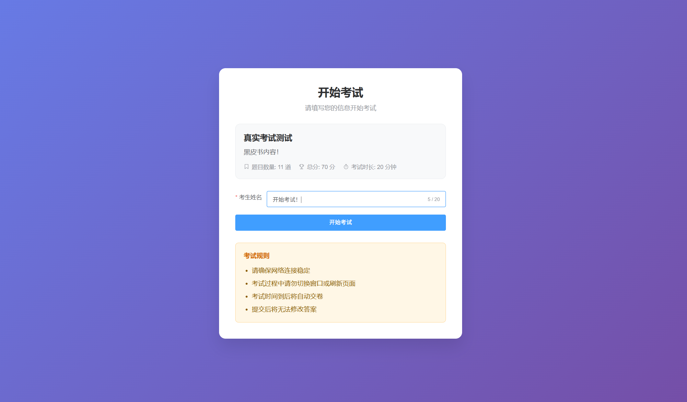
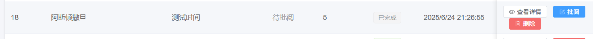

# 硅谷AI链习室 - 考试管理篇

[TOC]

## 一、模块概述

考试管理是智能学习平台的核心业务模块，它串联了试卷、题目和学生，形成了完整的在线考试闭环。本模块不仅负责处理考试的核心流程，如开始考试、提交答案，还引入了AI技术，实现了简答题的自动批阅和打分，极大地提升了教学评估的效率和智能化水平。

本模块基于Spring Boot + MyBatis Plus技术栈，紧密围绕`ExamRecord`（考试记录）和`AnswerRecord`（答题记录）两个核心实体，构建了从考试开始到结束，再到智能批阅的全流程服务。



### 核心功能特性

- **标准化考试流程**：提供开始考试、提交答案、查询结果等一系列标准化的考试接口。
- **AI智能批阅**：集成AI服务，对主观题（简答题）进行智能打分和点评，减轻教师阅卷负担。
- **精细化答题记录**：为学生的每一次考试、每一道题都生成详细的答题记录，便于后续分析和复盘。
- **事务性数据一致性**：在提交答案、批阅试卷等关键操作上采用事务管理，确保数据操作的原子性和一致性。

考试管理共包含以下4个核心接口：

1.  **开始考试** `POST /api/exams/start` - 学生选择试卷开始考试，系统为此创建一条唯一的考试记录。
2.  **提交考试答案** `POST /api/exams/{examRecordId}/submit` - 学生完成答题后，提交所有答案，系统记录并准备批阅。
3.  **AI自动批阅** `POST /api/exams/{examRecordId}/grade` - 对已提交的试卷进行自动批阅，客观题直接比对答案，主观题调用AI接口评分。
4.  **查询考试记录详情** `GET /api/exams/{id}` - 获取单次考试的详细情况，包括试卷信息、学生答案、得分和AI评语。

## 二、数据库表结构

### 2.1 考试记录表 (exam_records)

`exam_records`表是考试管理的核心，用于存储每一次考试会话的宏观信息。

```sql
-- 摘自 exam_system_new.sql
CREATE TABLE `exam_records`  (
  `id` int NOT NULL AUTO_INCREMENT,
  `exam_id` int NOT NULL,
  `student_name` varchar(50) CHARACTER SET utf8mb4 COLLATE utf8mb4_0900_ai_ci NOT NULL,
  `score` int NULL DEFAULT 0,
  `answers` text CHARACTER SET utf8mb4 COLLATE utf8mb4_0900_ai_ci NULL,
  `start_time` timestamp NULL DEFAULT NULL,
  `end_time` timestamp NULL DEFAULT NULL,
  `status` varchar(20) CHARACTER SET utf8mb4 COLLATE utf8mb4_0900_ai_ci NULL DEFAULT 'ONGOING',
  `window_switches` int NULL DEFAULT 0,
  `create_time` timestamp NULL DEFAULT CURRENT_TIMESTAMP COMMENT '创建时间',
  `update_time` timestamp NULL DEFAULT CURRENT_TIMESTAMP ON UPDATE CURRENT_TIMESTAMP COMMENT '更新时间',
  `is_deleted` tinyint NULL DEFAULT 0 COMMENT '0-未删除，1-已删除',
  PRIMARY KEY (`id`) USING BTREE
) ENGINE = InnoDB COMMENT = '考试记录表';
```

**字段说明：**

-   `id`：主键，考试记录的唯一标识。
-   `exam_id`：外键，关联`paper`表的ID，指明本次考试所用的试卷。
-   `student_name`：考生姓名。
-   `score`：本次考试的总得分。
-   `answers`：**（优化后用途变更）** 此字段最初设计用于存储学生答案的JSON串，但在新设计中，它被用来存储AI生成的**考试总评**，而具体的答题记录则由`answer_record`表管理。
-   `start_time` / `end_time`：考试的开始和结束时间。
-   `status`：考试状态，如“进行中”、“已完成”、“已批阅”。
-   `window_switches`：窗口切换次数，用于防作弊。

### 2.2 答题记录表 (answer_record)

`answer_record`表详细记录了学生在一次考试中对每一道题的作答情况。

```sql
-- 摘自 exam_system_new.sql
CREATE TABLE `answer_record`  (
  `id` int NOT NULL AUTO_INCREMENT,
  `exam_record_id` int NOT NULL,
  `question_id` int NOT NULL,
  `user_answer` text CHARACTER SET utf8mb4 COLLATE utf8mb4_0900_ai_ci NULL,
  `score` int NULL DEFAULT 0,
  `is_correct` int NULL DEFAULT 0,
  `ai_correction` text CHARACTER SET utf8mb4 COLLATE utf8mb4_0900_ai_ci NULL,
  PRIMARY KEY (`id`) USING BTREE
) ENGINE = InnoDB COMMENT = '答题记录表';
```

**字段说明：**

-   `exam_record_id`：外键，关联`exam_records`表，表明此答题记录属于哪一次考试。
-   `question_id`：外键，关联`questions`表，指明回答的是哪道题。
-   `user_answer`：学生提交的原始答案。
-   `score`：该题的得分。
-   `is_correct`：答题正确性标记（0: 错误, 1: 正确, 2: 部分正确）。
-   `ai_correction`：AI对简答题的智能批改意见。

## 三、实体类设计

### 3.1 考试记录实体类 (ExamRecord.java)

`ExamRecord`实体类映射`exam_records`表，并扩展了两个非数据库字段`answerRecords`和`paper`，用于在业务中方便地聚合答题记录和试卷信息。

```java
@TableName(value ="exam_records")
@Data
@Schema(description = "考试记录信息")
public class ExamRecord implements Serializable {
    
    @TableId(type = IdType.AUTO)
    private Integer id; // 主键ID

    private Integer examId; // 试卷ID

    private String studentName; // 考生姓名

    private Integer score; // 得分

    private String answers; // 答题记录 (AI总评)

    private LocalDateTime startTime; // 开始时间

    private LocalDateTime endTime; // 结束时间

    private String status; // 考试状态

    private Integer windowSwitches; // 窗口切换次数

    @TableField(exist = false)
    private List<AnswerRecord> answerRecords; // 答案记录列表

    @TableField(exist = false)
    private Paper paper; // 试卷信息
}
```

### 3.2 答题记录实体类 (AnswerRecord.java)

`AnswerRecord`实体类直接映射`answer_record`表结构。

```java
@TableName(value ="answer_record")
@Data
@NoArgsConstructor
@Schema(description = "答题记录信息")
public class AnswerRecord implements Serializable {
    
    @TableId(type = IdType.AUTO)
    private Integer id; // 主键ID

    private Integer examRecordId; // 考试记录ID

    private Integer questionId; // 题目ID

    private String userAnswer; // 用户答案

    private Integer score; // 得分

    private Integer isCorrect; // 是否正确 (0: 错误, 1: 正确, 2: 部分正确)

    private String aiCorrection; // AI批改意见
}
```

## 四、考试管理接口功能实现

### 4.1 开始考试接口（ POST /api/exams/start）

此接口是学生参加考试的入口。

#### 4.1.1 接口分析

**接口地址**:`/api/exams/start`

**请求方式**:`POST`

**请求体 (JSON)**:

```json
{
  "paperId": 1,
  "studentName": "张三"
}
```

**响应参数**: 返回一个包含试卷完整信息的`ExamRecord`对象。

```json
{
    "code": 200,
    "message": "考试开始成功",
    "data": {
        "id": 37,
        "examId": 6,
        "studentName": "开始考试！",
        "score": 0,
        "startTime": "2025-07-30 14:43:13",
        "status": "进行中",
        "windowSwitches": 0
    }
}
```

#### 4.1.2 功能实现

* **ExamController.java**

  ```java
  /**
    * 开始考试 - 创建新的考试记录
    * @param startExamVo 开始考试请求DTO
    * @return 考试记录
    */
  @PostMapping("/start")  // 处理POST请求
  @Operation(summary = "开始考试", description = "学生开始考试，创建考试记录并返回试卷内容")  // API描述
  public Result<ExamRecord> startExam(@RequestBody StartExamVo startExamVo) {
      ExamRecord examRecord =  examService.startExam(startExamVo);
      log.info("开始考试，考试对象创建成功！{}",examRecord);
      return Result.success(examRecord, "考试开始成功");
  }
  ```

*   **ExamService.java**

    ```java
    /**
     * 考试服务接口
     */
    public interface ExamService extends IService<ExamRecord> {
    
       /**
         * 开始考试业务
         * @param startExamVo
         * @return
         */
        ExamRecord startExam(StartExamVo startExamVo);
    } 
    ```

*   **ExamServiceImpl.java**

    ```java
    @Service
    @Slf4j
    public class ExamServiceImpl extends ServiceImpl<ExamRecordMapper, ExamRecord> implements ExamService {
    
       //开始考试
        @Override
        public ExamRecord startExam(StartExamVo startExamVo) {
            //宏观： 创建一个考试对象，并存储到数据库即可
            //1. 校验，该学生当前试卷是否存在正在考试的记录！ 存在进行中，返回即可
            LambdaQueryWrapper<ExamRecord> lambdaQueryWrapper = new LambdaQueryWrapper<>();
            lambdaQueryWrapper.eq(ExamRecord::getStudentName, startExamVo.getStudentName());
            lambdaQueryWrapper.eq(ExamRecord::getExamId,startExamVo.getPaperId());
            lambdaQueryWrapper.eq(ExamRecord::getStatus,"进行中");
            ExamRecord examRecord = getOne(lambdaQueryWrapper);
            if (examRecord != null) {
                log.debug("{}在当前试卷：{}有未完成考试记录！直接返回了！", startExamVo.getStudentName(), startExamVo.getPaperId());
                return examRecord;
            }
            //2. 创建新的考试记录！赋予传入的参数（学生姓名，试卷id） 补全（状态，时间，切屏数）
            examRecord = new ExamRecord();
            examRecord.setStudentName(startExamVo.getStudentName());
            examRecord.setExamId(startExamVo.getPaperId());
            examRecord.setStatus("进行中");
            examRecord.setWindowSwitches(0);
            examRecord.setStartTime(LocalDateTime.now());
            //3. 保存即可！
            save(examRecord);
            //4. 返回即可
            return examRecord;
        }
    }
    ```

#### 4.1.3 知识点

-   **幂等性设计**：通过检查是否存在“进行中”的考试，保证了学生重复点击“开始考试”时，不会创建多余的考试记录，而是返回已有的记录，这对于处理网络延迟或用户误操作非常重要。
-   **事务管理**：`@Transactional`注解确保创建考试记录的操作是一个原子操作。


### 4.2 查询考试记录详情接口（ GET /api/exams/{id}）

获取某次考试的全部详细信息。

#### 4.2.1 接口分析

**接口地址**:`/api/exams/{id}`

**请求方式**:`GET`

**路径参数**: `id` - 考试记录ID

**响应参数**: 返回一个聚合了试卷、题目、学生答案、得分、AI评语等所有信息的`ExamRecord`对象。

```java
{
	"code": 200,
	"message": "操作成功",
	"data": {
		"id": 0,
		"createTime": "",
		"isDeleted": "",
		"examId": 1,
		"studentName": "张三",
		"score": 85,
		"answers": "[{\"questionId\":1,\"userAnswer\":\"A\"},{\"questionId\":2,\"userAnswer\":\"B\"}]",
		"startTime": "",
		"endTime": "",
		"status": "已批阅",
		"windowSwitches": 2,
		"answerRecords": [
			{
				"id": 0,
				"createTime": "",
				"isDeleted": "",
				"examRecordId": 1,
				"questionId": 5,
				"userAnswer": "A",
				"score": 5,
				"isCorrect": 1,
				"aiCorrection": "答案基本正确，但缺少关键概念的解释..."
			}
		],
		"paper": {
			"id": 0,
			"createTime": "",
			"isDeleted": "",
			"name": "Java基础知识测试",
			"description": "本试卷主要考察Java基础语法、面向对象编程等知识点",
			"status": "PUBLISHED",
			"totalScore": 100,
			"questionCount": 20,
			"duration": 120,
			"questions": [
				{
					"id": 0,
					"createTime": "",
					"isDeleted": "",
					"title": "以下关于Java面向对象编程的说法正确的是？",
					"type": "CHOICE",
					"multi": false,
					"categoryId": 1,
					"difficulty": "MEDIUM",
					"score": 5,
					"paperScore": 10,
					"analysis": "Java是面向对象编程语言，支持封装、继承、多态三大特性...",
					"choices": [
						{
							"id": 0,
							"createTime": "",
							"isDeleted": "",
							"questionId": 1,
							"content": "Java是面向对象编程语言",
							"isCorrect": true,
							"sort": 1
						}
					],
					"answer": {
						"id": 0,
						"createTime": "",
						"isDeleted": "",
						"questionId": 1,
						"answer": "正确",
						"keywords": "面向对象,封装,继承,多态"
					},
					"category": {
						"id": 0,
						"createTime": "",
						"isDeleted": "",
						"name": "Java基础",
						"parentId": 0,
						"sort": 1,
						"children": [
							{
								"id": 0,
								"createTime": "",
								"isDeleted": "",
								"name": "Java基础",
								"parentId": 0,
								"sort": 1,
								"children": [
									{}
								],
								"count": 25
							}
						],
						"count": 25
					}
				}
			]
		}
	}
}
```

#### 4.2.2 功能实现

- **ExamController.java**

  ```java
  /**
    * 根据ID获取考试记录详情 - 查询具体考试结果
    */
  @GetMapping("/{id}")  // 处理GET请求
  @Operation(summary = "查询考试记录详情", description = "获取指定考试记录的详细信息，包括答题情况和得分")  // API描述
  public Result<ExamRecord> getExamRecordById(
      @Parameter(description = "考试记录ID") @PathVariable Integer id) {
      ExamRecord examRecord = examService.customGetExamRecordById(id);
      log.info("获取试卷详情信息接口调用成功！数据为：{}",examRecord);
      return Result.success(examRecord);
  }
  ```

- **ExamService.java**

  ```java 
  /**
    * 获取考试记录详情
    * @param id
    * @return
    */
  ExamRecord customGetExamRecordById(Integer id);
  ```

- **ExamServiceImpl.java**

  ```java
  @Override
  public ExamRecord customGetExamRecordById(Integer id) {
      //宏观：获取考试记录，考试记录对应的试卷对象，获取考试记录对应的答题记录集合
      //注意： 答题记录和顺序和考试记录的顺序相同！
      //1. 获取考试记录详情
      ExamRecord examRecord = getById(id);
      if (examRecord == null) {
          throw new RuntimeException("开始考试的记录已经被删除！");
      }
      //2. 获取考试记录对应试卷对象详情 【试卷 题目 选项 和 答案】
      Paper paper = paperService.customPaperDetailById(examRecord.getExamId().longValue());
      if (paper == null) {
          throw new RuntimeException("当前考试记录的试卷被删除！获取考试记录详情失败！");
      }
      //3. 获取考试记录对应的答题记录集合
      LambdaQueryWrapper<AnswerRecord> lambdaQueryWrapper = new LambdaQueryWrapper<>();
      lambdaQueryWrapper.eq(AnswerRecord::getExamRecordId,id);
      List<AnswerRecord> answerRecords = answerRecordService.list(lambdaQueryWrapper);
      if (!ObjectUtils.isEmpty(answerRecords)){
          //[8,2,1,3,7,4] -> 题目id
          List<Long> questionIdList = paper.getQuestions().stream().map(Question::getId).collect(Collectors.toList());
          //[{questionId:1} -> 2 ,{questionId:2} -> 1 ,{questionId:3} -> 3,{questionId:4} ->5,{questionId:7} -> 4,{questionId:8} -> 0]
          answerRecords.sort((o1, o2) -> {
              int x = questionIdList.indexOf(o1.getQuestionId());
              int y = questionIdList.indexOf(o2.getQuestionId());
              return Integer.compare(o1.getQuestionId(),o2.getQuestionId());
          });
      }
      //4. 数据组装即可
      examRecord.setPaper(paper);
      examRecord.setAnswerRecords(answerRecords);
      return examRecord;
  }
  ```

#### 4.2.3 知识点

- **数据聚合**：此接口是数据聚合的典型范例。它从`exam_records`表出发，关联查询`paper`、`questions`、`answer_record`等多张表的数据，最后将这些分散的数据组装成一个完整的、对前端友好的`ExamRecord`视图对象。

- **有序性保证**：为了保证前端展示的答题卡顺序与学生考试时一致，代码特地根据试卷中题目的原始顺序对查询出的`answerRecords`列表进行了重新排序。这是一个提升用户体验的细节处理。

  ```java
  // 1. 先获取试卷题目原本的顺序（用题目ID列表表示）
  List<Long> questionOrder = paper.getQuestions().stream()
      .map(Question::getId) // 提取每道题的ID
      .toList(); // 结果类似：[101, 103, 105]（假设这是试卷题目ID的原始顺序）
  
  // 2. 对答题记录按题目顺序排序
  answerRecords.sort((a, b) -> {
      // 找到答题记录a对应的题目在试卷中的位置（索引）
      int idxA = questionOrder.indexOf(a.getQuestionId().longValue());
      // 找到答题记录b对应的题目在试卷中的位置（索引）
      int idxB = questionOrder.indexOf(b.getQuestionId().longValue());
      // 按索引大小排序（索引小的排前面）
      return Integer.compare(idxA, idxB);
  });
  ```

  **举个例子：**

  - 试卷题目顺序（questionOrder）：`[101, 103, 105]`（第 1 题 ID=101，第 2 题 ID=103，第 3 题 ID=105）
  - 未排序的答题记录（answerRecords）可能是：`[103题记录, 101题记录, 105题记录]`
  - 排序后：
    - 101 题记录的索引是 0，103 题记录的索引是 1，105 题记录的索引是 2
    - 最终顺序变为 `[101题记录, 103题记录, 105题记录]`，与试卷题目顺序完全一致

  通过`sort`方法中的比较器：

  - 先确定每道题在试卷原始顺序中的位置（索引）
  - 再按索引从小到大排序，就能让答题记录的顺序和试卷题目顺序保持一致，确保前端展示正确。


### 4.3 提交考试答案接口（ POST /api/exams/{examRecordId}/submit）

学生完成答题后，通过此接口一次性提交所有答案。

#### 4.3.1 接口分析

**接口地址**:`/api/exams/{examRecordId}/submit`

**请求方式**:`POST`

**路径参数**: `examRecordId` - 考试记录ID

**请求体 (JSON)**:

```json
[
  { "questionId": 1, "userAnswer": "A" },
  { "questionId": 2, "userAnswer": "T / F" },
  { "questionId": 5, "userAnswer": "这是我的简答题答案..." }
]
```

**响应参数**: 成功时返回操作成功的消息。

#### 4.2.2 功能实现

* **ExamController.java**

  ```java
  /**
    * 提交答案 - 学生提交考试答案
    * @param examRecordId 考试记录ID
    * @param answers      答案列表
    */
  @PostMapping("/{examRecordId}/submit")  // 处理POST请求
  @Operation(summary = "提交考试答案", description = "学生提交考试答案，系统记录答题情况")  // API描述
  public Result<Void> submitAnswers(
      @Parameter(description = "考试记录ID") @PathVariable Integer examRecordId, 
      @RequestBody List<SubmitAnswerVo> answers) throws InterruptedException {
      examService.customSubmitAnswer(examRecordId,answers);
      log.info("提交答案接口调用成功！");
      return Result.success("答案提交成功");
  }
  ```

*   **ExamService.java**

    ```java 
     /**
       * 提交考试答案
       * @param examRecordId
       * @param answers
      */
    void customSubmitAnswer(Integer examRecordId, List<SubmitAnswerVo> answers) throws InterruptedException;
    ```
    
*   **ExamServiceImpl.java**

    ```java
    @Override
    public void customSubmitAnswer(Integer examRecordId, List<SubmitAnswerVo> answers) throws InterruptedException {
        //宏观： 提交答案中间表保存  修改考试记录数据（已完成 ，结束时间）  触发开始判卷（examRecordId）
        //1.中间表保存问题
        if (!ObjectUtils.isEmpty(answers)) {
            List<AnswerRecord> answerRecordList = answers.stream().map(vo -> new AnswerRecord(examRecordId, vo.getQuestionId(), vo.getUserAnswer()))
                .collect(Collectors.toList());
            answerRecordService.saveBatch(answerRecordList);
    }
        //2. 暂时修改下考试记录状态（状态 -》 已完成 || 结束时间 - 设置）
        ExamRecord examRecord = getById(examRecordId);
        examRecord.setEndTime(LocalDateTime.now());
        examRecord.setStatus("已完成");
        updateById(examRecord);
    
        //3.调用判卷的接口
        gradeExam(examRecordId);
    }
    ```
    
* **完善ExamServiceImpl.java判卷方法（gradeExam）**

  ```java
  /**
    * AI判卷方法
    * @param examRecordId
    * @return
    */
  @Override
  public ExamRecord gradeExam(Integer examRecordId) throws InterruptedException {
      //宏观：  获取考试记录相关的信息（考试记录对象 考试记录答题记录 考试对应试卷）
      //  进行循环判断（1.答题记录进行修改 2.总体提到总分数 总正确数量）  修改考试记录（状态 -》 已批阅  修改 -》 总分数）   进行ai评语生成（总正确的题目数量）
      //  修改考试记录表  返回考试记录对象
      //1.获取考试记录和相关的信息（试卷和答题记录）
      ExamRecord examRecord = customGetExamRecordById(examRecordId);
      Paper paper = examRecord.getPaper();
      if (paper == null){
          examRecord.setStatus("已批阅");
          examRecord.setAnswers("考试对应的试卷被删除！无法进行成绩判定！");
          updateById(examRecord);
          throw new RuntimeException("考试对应的试卷被删除！无法进行成绩判定！");
      }
      List<AnswerRecord> answerRecords = examRecord.getAnswerRecords();
      if (ObjectUtils.isEmpty(answerRecords)){
          //没有提交
          examRecord.setStatus("已批阅");
          examRecord.setScore(0);
          examRecord.setAnswers("没有提交记录！成绩为零！继续加油！");
          updateById(examRecord);
          return examRecord;
      }
  
      //2.进行循环的判卷（1.记录总分数 2.记录正确题目数量 3. 修改每个答题记录的状态（得分，是否正确 0 1 2 ，text-》ai评语））
      int correctNumber = 0 ; //正确题目数量
      int totalScore = 0; //总得分
  
      //报错继续！ 某个记录错了，后续还需要继续判卷
      //将正确题目转成map,方便每次判断获取正确答案
      Map<Long, Question> questionMap = paper.getQuestions().stream().collect(Collectors.toMap(Question::getId, q -> q));
  
      for (AnswerRecord answerRecord : answerRecords) {
          try {
              //1.先获取 答题记录对应的题目对象
              Question question = questionMap.get(answerRecord.getQuestionId().longValue());
              String systemAnswer = question.getAnswer().getAnswer();
              String userAnswer = answerRecord.getUserAnswer();
              if ("JUDGE".equalsIgnoreCase(question.getType())){
                  //true false
                  userAnswer = normalizeJudgeAnswer(userAnswer);
              }
              if (!"TEXT".equals(question.getType())) {
                  //2.判断题目类型(选择和判断直接判卷)
                  if (systemAnswer.equalsIgnoreCase(userAnswer)){
                      answerRecord.setIsCorrect(1); //正确
                      answerRecord.setScore(question.getPaperScore().intValue());
                  }else{
                      answerRecord.setIsCorrect(0); //正确
                      answerRecord.setScore(0);
                  }
              }else{
                  //3.简答题进行ai判断
                  //简答题
                  GradingResult result =
            kimiAiService.gradingTextQuestion(question,userAnswer,question.getPaperScore().intValue());
                  //分
                  answerRecord.setScore(result.getScore());
                  //ai评价 正确  feedback  非正确 reason
                  //是否正确 （满分 1 0分 0 其余就是2）
                  if (result.getScore() == 0){
                      answerRecord.setIsCorrect(0);
                      answerRecord.setAiCorrection(result.getReason());
                  }else if (result.getScore() == question.getPaperScore().intValue()){
                      answerRecord.setIsCorrect(1);
                      answerRecord.setAiCorrection(result.getFeedback());
                  }else{
                      answerRecord.setIsCorrect(2);
                      answerRecord.setAiCorrection(result.getReason());
                  }
              }
          } catch (Exception e) {
              answerRecord.setScore(0);
              answerRecord.setIsCorrect(0);
              answerRecord.setAiCorrection("判题过程出错！");
          }
          //进行记录修改
          //进行总分数赋值
          totalScore += answerRecord.getScore();
          //正确题目数量累加
          if (answerRecord.getIsCorrect() == 1){
              correctNumber++;
          }
      }
      answerRecordService.updateBatchById(answerRecords);
  
      //进行ai生成评价，进行考试记录修改和完善
      String summary = kimiAiService.
          buildSummary(totalScore, paper.getTotalScore().intValue(), paper.getQuestionCount(), correctNumber);
  
      examRecord.setScore(totalScore);
      examRecord.setAnswers(summary);
      examRecord.setStatus("已批阅");
      updateById(examRecord);
  
      return examRecord;
  }
  ```
  
* 标准化判断题答案，将T/F转换为TRUE/FALSE

  ```java
  /**
    * 标准化判断题答案，将T/F转换为TRUE/FALSE
    * @param answer 原始答案
    * @return 标准化后的答案
    */
  private String normalizeJudgeAnswer(String answer) {
      if (answer == null || answer.trim().isEmpty()) {
          return "";
      }
  
      String normalized = answer.trim().toUpperCase();
      switch (normalized) {
          case "T":
          case "TRUE":
          case "正确":
              return "TRUE";
          case "F":
          case "FALSE":
          case "错":
              return "FALSE";
          default:
              return normalized;
      }
  }
  ```

#### 4.2.3 KimiService完善AI方法

* **简答题ai提示词和方法**

  > 你是一名专业的考试阅卷老师，请对以下题目进行判卷：
  >
  > 【题目信息】
  >
  > - 题型：简答题
  >
  > - 题目：[具体题目内容]
  >
  > - 标准答案：[题目标准答案]
  >
  > - 满分：[满分分值] 分
  >
  > 【学生答案】
  >
  > [学生提交的答案，若未作答则显示 “（未作答）”]
  >
  > 【判卷要求】
  >
  > - 主观题：根据答案的准确性、完整性、逻辑性进行评分
  >
  > - 答案要点正确且完整：80-100% 分数
  >
  > - 答案基本正确但不够完整：60-80% 分数
  >
  > - 答案部分正确：30-60% 分数
  >
  > - 答案完全错误或未作答：0 分
  >
  > 请按以下 JSON 格式返回判卷结果：
  >
  > {
  >
  >    "score": 实际得分 (整数),
  >
  >    "feedback": "具体的评价反馈 (50 字以内)",
  >
  >    "reason": "扣分原因或得分依据 (30 字以内)"
  >
  > }

  `com.atguigu.exam.service.KimiAiService` 简单题判断提示词生成方法：

  ```java
  /**
    * 构建判卷提示词
    */
  private String buildGradingPrompt(Question question, String userAnswer, Integer maxScore) {
      StringBuilder prompt = new StringBuilder();
      prompt.append("你是一名专业的考试阅卷老师，请对以下题目进行判卷：\n\n");
  
      prompt.append("【题目信息】\n");
      prompt.append("题型：").append(getQuestionTypeText(question.getType())).append("\n");
      prompt.append("题目：").append(question.getTitle()).append("\n");
      prompt.append("标准答案：").append(question.getAnswer().getAnswer()).append("\n");
      prompt.append("满分：").append(maxScore).append("分\n\n");
  
      prompt.append("【学生答案】\n");
      prompt.append(userAnswer.trim().isEmpty() ? "（未作答）" : userAnswer).append("\n\n");
  
      prompt.append("【判卷要求】\n");
      if ("CHOICE".equals(question.getType()) || "JUDGE".equals(question.getType())) {
          prompt.append("- 客观题：答案完全正确得满分，答案错误得0分\n");
      } else if ("TEXT".equals(question.getType())) {
          prompt.append("- 主观题：根据答案的准确性、完整性、逻辑性进行评分\n");
          prompt.append("- 答案要点正确且完整：80-100%分数\n");
          prompt.append("- 答案基本正确但不够完整：60-80%分数\n");
          prompt.append("- 答案部分正确：30-60%分数\n");
          prompt.append("- 答案完全错误或未作答：0分\n");
      }
  
      prompt.append("\n请按以下JSON格式返回判卷结果：\n");
      prompt.append("{\n");
      prompt.append("  \"score\": 实际得分(整数),\n");
      prompt.append("  \"feedback\": \"具体的评价反馈(50字以内)\",\n");
      prompt.append("  \"reason\": \"扣分原因或得分依据(30字以内)\"\n");
      prompt.append("}");
  
      return prompt.toString();
  }
  
  /**
    * 获取题目类型文本
    */
  private String getQuestionTypeText(String type) {
      Map<String, String> typeMap = new HashMap<>();
      typeMap.put("CHOICE", "选择题");
      typeMap.put("JUDGE", "判断题");
      typeMap.put("TEXT", "简答题");
      return typeMap.getOrDefault(type, "未知题型");
  }
  ```

* **考试评语ai提示词和方法**

  > 你是一名资深的教育专家，请为学生的考试表现提供专业的总评和学习建议：
  >
  > 【考试成绩】
  >
  > - 总得分：[实际总得分]/[满分分值] 分
  >
  > - 得分率：[得分率]%
  >
  > - 题目总数：[题目总数] 道
  >
  > - 答对题数：[答对题数] 道
  >
  > 【要求】
  >
  > 请提供一份 150 字左右的考试总评，包括：
  >
  > 1. 对本次考试表现的客观评价
  >
  > 1. 指出优势和不足之处
  >
  > 1. 提供具体的学习建议和改进方向
  >
  > 1. 给予鼓励和激励
  >
  > 请直接返回总评内容，无需特殊格式：

  ```java
  /**
       * 构建考试总评提示词
       */
  private String buildSummaryPrompt(Integer totalScore, Integer maxScore, Integer questionCount, Integer correctCount) {
      double percentage = (double) totalScore / maxScore * 100;
  
      StringBuilder prompt = new StringBuilder();
      prompt.append("你是一名资深的教育专家，请为学生的考试表现提供专业的总评和学习建议：\n\n");
  
      prompt.append("【考试成绩】\n");
      prompt.append("总得分：").append(totalScore).append("/").append(maxScore).append("分\n");
      prompt.append("得分率：").append(String.format("%.1f", percentage)).append("%\n");
      prompt.append("题目总数：").append(questionCount).append("道\n");
      prompt.append("答对题数：").append(correctCount).append("道\n\n");
  
      prompt.append("【要求】\n");
      prompt.append("请提供一份150字左右的考试总评，包括：\n");
      prompt.append("1. 对本次考试表现的客观评价\n");
      prompt.append("2. 指出优势和不足之处\n");
      prompt.append("3. 提供具体的学习建议和改进方向\n");
      prompt.append("4. 给予鼓励和激励\n\n");
  
      prompt.append("请直接返回总评内容，无需特殊格式：");
  
      return prompt.toString();
  }
  ```

* 准备简答题判断返回结果实体类

  `com.atguigu.exam.vo.GradingResult`

  ```java
  /**
   * 判卷结果内部类
   */
  public  class GradingResult {
  
      private Integer score;
      private String feedback;
      private String reason;
  
      public GradingResult(Integer score, String feedback, String reason) {
          this.score = score;
          this.feedback = feedback;
          this.reason = reason;
      }
  
      // Getters
      public Integer getScore() { return score; }
      public String getFeedback() { return feedback; }
      public String getReason() { return reason; }
  }
  ```

* 完成简单题判卷kimi调用方法封装

  `com.atguigu.exam.service.KimiAiServiceImpl` 

  ```java
   /**
    * 使用ai,进行简答题判断
    * @param question
    * @param userAnswer
    * @param maxScore
    * @return
    */
  GradingResult gradingTextQuestion(Question question, String userAnswer, Integer maxScore) throws InterruptedException;
  
  @Override
  public GradingResult gradingTextQuestion(Question question, String userAnswer, Integer maxScore) throws InterruptedException {
      //1.生成ai调用的提示词
      String gradingPrompt = buildGradingPrompt(question, userAnswer, maxScore);
      //2.调用ai模型，获取返回结果
      String content = callKimiAi(gradingPrompt);
      //3.进行结果的解析 -》GradingResult
      /*
              prompt.append("{\n");
              prompt.append("  \"score\": 实际得分(整数),\n");
              prompt.append("  \"feedback\": \"具体的评价反馈(50字以内)\",\n");
              prompt.append("  \"reason\": \"扣分原因或得分依据(30字以内)\"\n");
              prompt.append("}");
           */
      com.alibaba.fastjson2.JSONObject jsonObject = JSON.parseObject(content);
      Integer aiScore = jsonObject.getInteger("score");
      String feedback = jsonObject.getString("feedback");
      String reason = jsonObject.getString("reason");
      if (aiScore > maxScore) aiScore = maxScore;
      if (aiScore < 0) aiScore = 0;
      return  new GradingResult(aiScore, feedback, reason);
  }
  ```

* 完成试卷评语kimi调用方法封装

  `com.atguigu.exam.service.KimiAiServiceImpl` 

  ```java
  /**
    * 生成ai评语
    * @param totalScore
    * @param maxScore
    * @param questionCount
    * @param correctCount
    * @return
    */
  String buildSummary(Integer totalScore, Integer maxScore, Integer questionCount, Integer correctCount) throws InterruptedException;
  
  
  /**
    * 生成考试总评和建议
    * @param totalScore 总得分
    * @param maxScore 总满分
    * @param questionCount 题目总数
    * @param correctCount 答对题目数
    * @return 考试总评
    */
  @Override
  public String buildSummary(Integer totalScore, Integer maxScore, Integer questionCount, Integer correctCount) throws InterruptedException {
      //1. 构建提示词
      String summaryPrompt  = buildSummaryPrompt(totalScore,maxScore,questionCount,correctCount);
      //2. 调用kimiai
      String summary = callKimiAi(summaryPrompt);
      //3. 结果解析
      return summary;
  }
  ```

* 完善ai判断业务方法（gradeExam）

  `com.atguigu.exam.service.impl.ExamServiceImpl`

#### 4.2.3 知识点

-   **批量操作**：通过`forEach`循环批量插入学生的答题记录，虽然不是最高效的方式（更优的方式是使用MyBatis的批量插入功能），但在小批量数据下是可接受的。
-   **异步处理建议**：提交答案后立即触发AI批阅。这是一个耗时操作，理想情况下应采用异步执行（如`@Async`注解或消息队列），以避免长时间阻塞API响应，提升用户体验。

### 4.3 AI自动批阅接口（ POST /api/exams/{examRecordId}/grade）

定义位置：exam-system-web-backup/src/api/exam.js 第29-34行
调用位置：exam-system-web-backup/src/views/ScoreManage.vue 第246-256行
使用场景：在成绩管理页面中，当考试状态为"已完成"时，管理员可以点击"批阅"按钮触发AI自动批阅
路由访问：通过 /score-manage 路由可以访问到ScoreManage页面
集成方式：ScoreManage组件被集成在QuestionManage.vue的"成绩管理"视图中



#### 4.3.1 接口分析

**接口地址**:`/api/exams/{examRecordId}/grade`

**请求方式**:`POST`

**路径参数**: `examRecordId` - 考试记录ID

**响应参数**: 返回批阅完成后的`ExamRecord`对象，包含总分和各题得分。

#### 4.3.2 功能实现

*   **ExamController.java**

    ```java
    @PostMapping("/{examRecordId}/grade")
    @Operation(summary = "AI自动批阅", description = "使用AI技术自动批阅试卷，特别是简答题的智能评分")
    public Result<ExamRecord> gradeExam(@PathVariable Integer examRecordId) {
        ExamRecord examRecord = examService.gradeExam(examRecordId);
        return Result.success(examRecord, "试卷批阅完成");
    }
    ```


#### 4.3.3 知识点

-   **混合评分策略**：系统采用了混合评分策略。对于客观题（选择题、判断题），采用精确的答案比对，保证评分的准确性；对于主观题（简答题），则利用AI的自然语言理解能力进行智能评分，实现了效率与质量的平衡。
-   **答案标准化**：`normalizeJudgeAnswer`方法体现了数据预处理的重要性。在比对判断题答案前，将各种可能的输入（如"T", "TRUE", "正确"）统一转换为标准格式（"TRUE"），大大增强了系统的容错性。
-   **AI服务集成**：通过`KimiService`封装了对外部AI接口的调用，实现了业务逻辑与AI能力的解耦。`gradeQuestion`和`generateExamSummary`两个方法分别对应了对单个题目和整份试卷的AI处理。

## 五、前后端接口对接

完成上述后端接口后，即可启动后端服务，并与前端管理页面进行对接测试，验证考试流程中各个功能的正确性和流畅性。

启动前端程序：

```bash
npm run dev
```