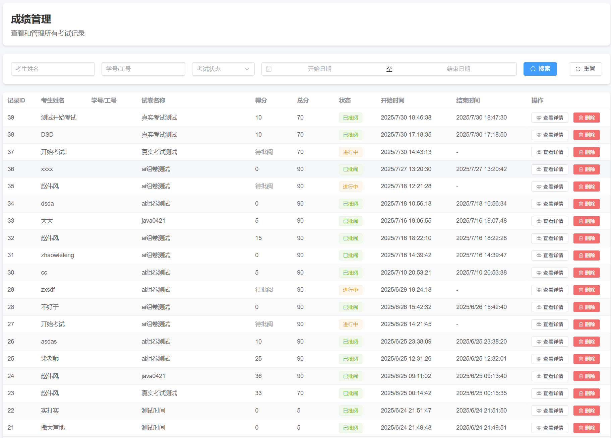

# 硅谷AI链习室 - 考试记录管理篇

[TOC]

## 一、模块概述

考试记录管理是后台管理系统的核心功能之一，它为管理员提供了监控、分析和管理所有学生考试数据的重要工具。通过此模块，管理员可以高效地查询、筛选、查看和删除考试记录，并能直观地通过排行榜了解学生的整体表现。

本模块的实现重点在于**高性能的数据查询与展示**。特别是在排行榜功能上，通过精心设计的SQL关联查询，有效解决了N+1查询问题，确保了在大数据量下系统依然能够快速响应。



### 核心功能特性

- **多条件复合查询**：支持按考生姓名、考试状态、日期范围等多个维度进行组合筛选和分页查询。
- **数据关联展示**：在展示考试记录列表时，能同时显示关联的试卷名称和总分，信息一目了然。
- **高性能排行榜**：提供一个经过高度优化的考试排行榜，支持按不同试卷进行排名，并通过单次SQL查询获取所有必要数据。
- **精细化权限操作**：提供对单条考试记录的查看详情和删除操作。

考试记录管理共包含以下4个核心接口：

1.  **分页查询考试记录** `GET /api/exam-records/list` - 支持多条件筛选的分页查询，是后台管理页面的主要数据来源。
2.  **获取考试记录详情** `GET /api/exam-records/{id}` - 查看某次考试的完整信息，包括试卷快照和答题详情。
3.  **删除考试记录** `DELETE /api/exam-records/{id}` - 从系统中移除指定的考试记录。
4.  **获取考试排行榜** `GET /api/exam-records/ranking` - 获取按分数和用时排序的成绩排行榜。

## 二、数据库与VO设计

### 2.1 考试记录表 (exam_records)

本模块的核心数据存储在`exam_records`表中，其结构与“考试管理篇”中所述一致，这里不再赘述。关键字段包括`student_name`, `score`, `status`, `start_time`, `end_time`等。

### 2.2 考试排行榜值对象 (ExamRankingVO.java)

为了实现高性能的排行榜查询，我们特别设计了一个值对象（View Object, VO）——`ExamRankingVO`。它的作用是创建一个专门用于封装排行榜展示所需数据的数据结构，**避免直接返回沉重的、包含多层嵌套的数据库实体对象**。

```java
/**
 * 考试排行榜VO - 排行榜展示专用数据对象
 */
@Data
@Schema(description = "考试排行榜信息")
public class ExamRankingVO implements Serializable {

    private Integer id; // 考试记录ID
    private String studentName; // 考生姓名
    private Integer score; // 考试得分
    private Integer examId; // 试卷ID
    private String paperName; // 试卷名称（通过关联查询获取）
    private BigDecimal paperTotalScore; // 试卷总分（通过关联查询获取）
    private LocalDateTime startTime; // 开始时间
    private LocalDateTime endTime; // 结束时间
    private Long duration; // 考试用时，单位分钟

    /**
     * 为了保持前端兼容性，提供paper对象格式的数据
     */
    @Schema(description = "试卷信息对象（兼容前端）")
    public Map<String, Object> getPaper() {
        Map<String, Object> paper = new HashMap<>();
        paper.put("id", this.examId);
        paper.put("name", this.paperName);
        paper.put("totalScore", this.paperTotalScore);
        return paper;
    }
}
```

**设计说明：**

-   **扁平化结构**：`ExamRankingVO`是一个扁平的Java对象，所有字段都是基本类型或简单对象。这与通过JOIN查询直接从数据库获取的扁平结果集完美匹配，无需进行复杂的嵌套组装。
-   **按需定制**：只包含排行榜页面需要展示的字段，如考生姓名、分数、试卷名称、用时等，避免了传输不必要的数据，减轻了网络负担。
-   **前端兼容**：提供了一个`getPaper()`方法，巧妙地模拟了`ExamRecord`实体中嵌套的`Paper`对象结构。这样做可以最大程度地复用前端已有的展示组件，而无需为排行榜重写一套显示逻辑，体现了良好的后端兼容性设计。

## 三、考试记录接口功能实现

### 4.1 分页查询考试记录接口（ GET /api/exam-records/list）

此接口是后台管理系统的核心，提供了强大的数据筛选和分页能力。

#### 4.1.1 接口分析

**接口地址**:`/api/exam-records/list`

**请求方式**:`GET`

**请求参数**:

| 参数名        | 说明                     | 数据类型 | 是否必须 |
| :------------- | :----------------------- | :------- | :------- |
| `page`         | 当前页码，从1开始        | `Integer`  | 否       |
| `size`         | 每页显示数量             | `Integer`  | 否       |
| `studentName`  | 按学生姓名模糊查询       | `String`   | 否       |
| `status`       | 按考试状态筛选(0/1/2)    | `Integer`  | 否       |
| `startDate`    | 按开始日期筛选(yyyy-MM-dd) | `String`   | 否       |
| `endDate`      | 按结束日期筛选(yyyy-MM-dd) | `String`   | 否       |

**响应参数**: 返回一个包含`ExamRecord`列表和分页信息的`Page`对象。

#### 4.1.2 功能实现

*   **ExamRecordController.java**

    Controller层负责接收前端请求参数，并使用MyBatis Plus的`QueryWrapper`动态构建查询条件。

    ```java
    @Slf4j
    @CrossOrigin
    @RestController  // REST控制器，返回JSON数据
    @RequestMapping("/api/exam-records")  // 考试记录API路径前缀
    @Tag(name = "考试记录管理", description = "考试记录相关操作，包括记录查询、成绩管理、排行榜展示等功能")  // Swagger API分组
    public class ExamRecordController {
    
        @Autowired
        private ExamService examService;
        
        @Autowired
        private PaperService paperService;
    
        /**
         * 分页查询考试记录
         */
        @GetMapping("/list")  // 处理GET请求
        @Operation(summary = "分页查询考试记录", description = "支持多条件筛选的考试记录分页查询，包括按姓名、状态、时间范围等筛选")  // API描述
        public Result<Page<ExamRecord>> getExamRecords(
                @Parameter(description = "当前页码，从1开始", example = "1") @RequestParam(defaultValue = "1") Integer page,
                @Parameter(description = "每页显示数量", example = "20") @RequestParam(defaultValue = "20") Integer size,
                @Parameter(description = "学生姓名筛选条件") @RequestParam(required = false) String studentName,
                @Parameter(description = "学号筛选条件") @RequestParam(required = false) String studentNumber,
                @Parameter(description = "考试状态，0-进行中，1-已完成，2-已批阅") @RequestParam(required = false) Integer status,
                @Parameter(description = "开始日期，格式：yyyy-MM-dd") @RequestParam(required = false) String startDate,
                @Parameter(description = "结束日期，格式：yyyy-MM-dd") @RequestParam(required = false) String endDate
        ) {
            Page<ExamRecord> myPage = new Page<>(page,size);
            LambdaQueryWrapper<ExamRecord> lambdaQueryWrapper = new LambdaQueryWrapper<>();
            lambdaQueryWrapper.like(!ObjectUtils.isEmpty(studentName), ExamRecord::getStudentName, studentName);
            if (status != null){
               String strStatus = switch (status) {
                   case 0 -> "进行中";
                   case 1 -> "已完成";
                   case 2 -> "已批阅";
                   default -> null;
           };        lambdaQueryWrapper.eq(!ObjectUtils.isEmpty(strStatus),ExamRecord::getStatus,strStatus);
            }
        lambdaQueryWrapper.ge(!ObjectUtils.isEmpty(startDate),ExamRecord::getStartTime,startDate);
          lambdaQueryWrapper.le(!ObjectUtils.isEmpty(endDate),ExamRecord::getStartTime,endDate);
    	    examService.page(myPage,lambdaQueryWrapper);
            List<Integer> paperIdList = myPage.getRecords().stream().map(ExamRecord::getExamId).toList();
            LambdaQueryWrapper<Paper> paperLambdaQueryWrapper = new LambdaQueryWrapper<>();
         paperLambdaQueryWrapper.in(!ObjectUtils.isEmpty(paperIdList),Paper::getId,paperIdList);
            List<Paper> paperList = paperService.list(paperLambdaQueryWrapper);
            Map<Long, Paper> paperMap = paperList.stream().collect(Collectors.toMap(Paper::getId, p -> p));
            myPage.getRecords().forEach(examRecord -> examRecord.setPaper(paperMap.get(examRecord.getExamId().longValue())));
            return Result.success(myPage);
        }
    }
    ```

#### 4.1.3 知识点

-   **动态SQL构建**：`QueryWrapper`是MyBatis Plus的强大功能，它允许开发者通过链式调用的方式，根据前端传入的参数动态、安全地构建复杂的SQL `WHERE`子句，避免了手动拼接SQL带来的SQL注入风险和繁琐的`if`判断。
-   **分页查询实现**：通过传入一个`Page`对象（包含了页码和每页大小），MyBatis Plus的分页插件会自动拦截SQL，并将其改写为物理分页查询（如MySQL的`LIMIT`），同时会执行一条`COUNT`查询以获取总记录数，最终将所有分页信息封装返回。
-   **跨域问题**：`@CrossOrigin`跨域注解添加

### 4.2 获取考试记录详情接口（ GET /api/exam-records/{id}）

此接口的实现与“考试管理篇”中的`GET /api/exams/{id}`完全相同，都是调用`examService.getExamRecordDetail(id)`方法来获取包含所有关联信息的单个考试记录。此处不再重复。

```java
@Autowired
private ExamService examService;

/**
  * 根据ID获取考试记录详情
  */
@GetMapping("/{id}")  // 处理GET请求
@Operation(summary = "获取考试记录详情", description = "根据记录ID获取考试记录的详细信息，包括试卷内容和答题情况")  // API描述
public Result<ExamRecord> getExamRecordById(
    @Parameter(description = "考试记录ID") @PathVariable Integer id) {
    ExamRecord examRecord = examService.customGetExamRecordById(id);
    return Result.success(examRecord);
}
```

### 4.3 删除考试记录接口（ DELETE /api/exam-records/{id}）

提供删除指定考试记录的功能。

#### 4.3.1 接口分析

**接口地址**:`/api/exam-records/{id}`

**请求方式**:`DELETE`

**路径参数**: `id` - 考试记录ID

**响应参数**: 返回操作结果消息。

```java
{
	"code": 200,
	"message": "操作成功",
	"data": {}
}
```

#### 4.3.2 功能实现

*   **ExamRecordController.java**

    ```java
    /**
      * 删除考试记录
      */
    @DeleteMapping("/{id}")  // 处理DELETE请求
    @Operation(summary = "删除考试记录", description = "根据ID删除指定的考试记录")  // API描述
    public Result<Void> deleteExamRecord(
        @Parameter(description = "考试记录ID") @PathVariable Integer id) {
        examService.customRemoveById(id);
        log.info("删除考试记录成功！id:{}",id);
        return Result.success("删除考试记录成功！id:{}");
    }
    ```

* **ExamRecordService.java**

  ```java 
  /**
    * 删除考试记录
    * @param id
    */
  void customRemoveById(Integer id);
  ```

* **ExamRecordServiceImpl.java**

  ```java 
  @Override
  public void customRemoveById(Integer id) {
      //重要的关联数据校验，有删除失败！
      //判断自身状态，进行中不能删除
      ExamRecord examRecord = getById(id);
      if ("进行中".equals(examRecord.getStatus())){
          throw new RuntimeException("正在考试中，无法直接删除！");
      }
      //删除自身数据，同时删除答题记录
      removeById(id);
      answerRecordService.remove(new LambdaQueryWrapper<AnswerRecord>().eq(AnswerRecord::getExamRecordId,id));
  }
  ```

#### 4.3.3 知识点

-   **RESTful设计**：使用`DELETE` HTTP方法来表示删除资源的操作，符合RESTful API的设计规范。
-   **逻辑删除与物理删除**：当前实现是**物理删除**。在更复杂的业务场景中，通常会采用**逻辑删除**（即更新一个`is_deleted`标志位），以保留数据用于审计或恢复。MyBatis Plus对逻辑删除有很好的内置支持。

### 4.4 获取考试排行榜接口（ GET /api/exam-records/ranking）

这是本模块性能优化的核心体现，展示了如何通过优化的SQL查询来构建一个高效的排行榜。

#### 4.4.1 接口分析

**接口地址**:`/api/exam-records/ranking`

**请求方式**:`GET`

**请求参数**:

| 参数名    | 说明                     | 数据类型 | 是否必须 |
| :--------- | :----------------------- | :------- | :------- |
| `paperId`  | 按试卷ID筛选，不传则全局排名 | `Integer`  | 否       |
| `limit`    | 限制返回的排名数量       | `Integer`  | 否       |

**响应参数**: 返回`ExamRankingVO`对象的列表。

  private Integer id; // 考试记录ID
    private String studentName; // 考生姓名
    private Integer score; // 考试得分
    private Integer examId; // 试卷ID
    private String paperName; // 试卷名称（通过关联查询获取）
    private BigDecimal paperTotalScore; // 试卷总分（通过关联查询获取）
    private LocalDateTime startTime; // 开始时间
    private LocalDateTime endTime; // 结束时间
    private Long duration; // 考试用时，单位分钟

#### 4.4.2 功能实现

* **ExamRecordController.java**

  ```java
  /**
    * 获取考试排行榜 - 优化版本
    * 使用SQL关联查询，一次性获取所有需要的数据，性能提升数百倍
    * 
    * @param paperId 试卷ID，可选参数
    * @param limit 显示数量限制，可选参数
    * @return 排行榜列表
    */
  @GetMapping("/ranking")  // 处理GET请求
  @Operation(summary = "获取考试排行榜", description = "获取考试成绩排行榜，支持按试卷筛选和限制显示数量，使用优化的SQL关联查询提升性能")  // API描述
  public Result<List<ExamRankingVO>> getExamRanking(
      @Parameter(description = "试卷ID，可选，不传则显示所有试卷的排行") @RequestParam(required = false) Integer paperId,
      @Parameter(description = "显示数量限制，可选，不传则返回所有记录") @RequestParam(required = false) Integer limit
      ) {
          // 使用优化的查询方法，避免N+1查询问题
          List<ExamRankingVO> examRankingVOS =  examService.customGetRanking(paperId,limit);
          log.info("查询：{}试卷下的{}条数据成功！数据为：{}",paperId,limit,examRankingVOS);
          return Result.success(examRankingVOS);
      }
  ```

* **ExamRecordServiceImpl.java**

  ```java
  /**
    * 获取考试排行榜 - 优化版本
    * 使用SQL关联查询，一次性获取所有需要的数据，避免N+1查询问题
    * @param paperId 试卷ID，可选参数，不传则查询所有试卷
    * @param limit 显示数量限制，可选参数，不传则返回所有记录
    * @return 排行榜列表
    */
  @Override
  public List<ExamRankingVO> customGetRanking(Integer paperId, Integer limit) {
      return examRecordMapper.customQueryRanking(paperId,limit);
  }
  ```
  
*   **ExamRecordMapper.java**

    ```java
@Mapper
    public interface ExamRecordMapper extends BaseMapper<ExamRecord> {
    
        List<ExamRankingVO> customQueryRanking(@Param("paperId") Integer paperId, @Param("limit") Integer limit);
    }
    ```
    
*   **ExamRecordMapper.xml**

    **这是解决N+1查询问题的关键所在**。通过编写自定义的XML映射文件，我们可以利用SQL的`JOIN`能力，将多次数据库查询合并为一次。

    ```xml
    <?xml version="1.0" encoding="UTF-8" ?>
    <!DOCTYPE mapper
            PUBLIC "-//mybatis.org//DTD Mapper 3.0//EN"
            "https://mybatis.org/dtd/mybatis-3-mapper.dtd">
    <mapper namespace="com.atguigu.exam.mapper.ExamRecordMapper">
        <select id="customQueryRanking" resultType="com.atguigu.exam.vo.ExamRankingVO">
            select
                er.*,
                pr.`name` paper_name ,
                pr. total_score paper_total_score,
                TIMESTAMPDIFF(MINUTE, er.start_time, er.end_time) duration
            from exam_records er left join paper pr
            on er.exam_id = pr.id
            where er.is_deleted = 0 and pr.is_deleted = 0
            and er.`status` = '已批阅'
            <if test="paperId != null">
                and pr.id=#{paperId}
            </if>
            order by er.score desc , duration asc
            <if test="limit != null">
                limit #{limit};
            </if>
        </select>
    </mapper>
    ```

#### 4.4.3 知识点

-   **性能优化之王：JOIN查询**：此接口最大的亮点是彻底解决了N+1查询问题。通过`LEFT JOIN`，数据库在一次查询中就完成了`exam_records`和`paper`表的关联，并将所有需要的数据返回。对于大数据量的排行榜，这种优化可以将响应时间从秒级降低到毫秒级。
-   **MyBatis XML的威力**：当遇到MyBatis Plus的`QueryWrapper`难以表达的复杂查询（如`JOIN`、函数计算`TIMESTAMPDIFF`）时，XML映射文件就成了最佳选择。它提供了编写原生SQL的全部灵活性，同时支持动态SQL（如`<if>`标签），实现了性能与灵活性的完美结合。
-   **数据库函数应用**：巧妙地使用了MySQL的`TIMESTAMPDIFF(MINUTE, ...)`函数，直接在数据库层面计算出考试用时，避免了在Java代码中进行额外的日期计算，减轻了应用服务器的负担。
-   **复合排序**：`ORDER BY er.score DESC, duration ASC`实现了按分数降序、分数相同时按用时升序的复合排序规则，这是排行榜业务的常见需求。

## 五、前后端接口对接

完成上述后端接口后，即可启动后端服务，并与前端管理页面进行对接测试，验证考试记录管理、成绩查询、排行榜等功能的正确性。

启动前端程序：

```bash
npm run dev
```