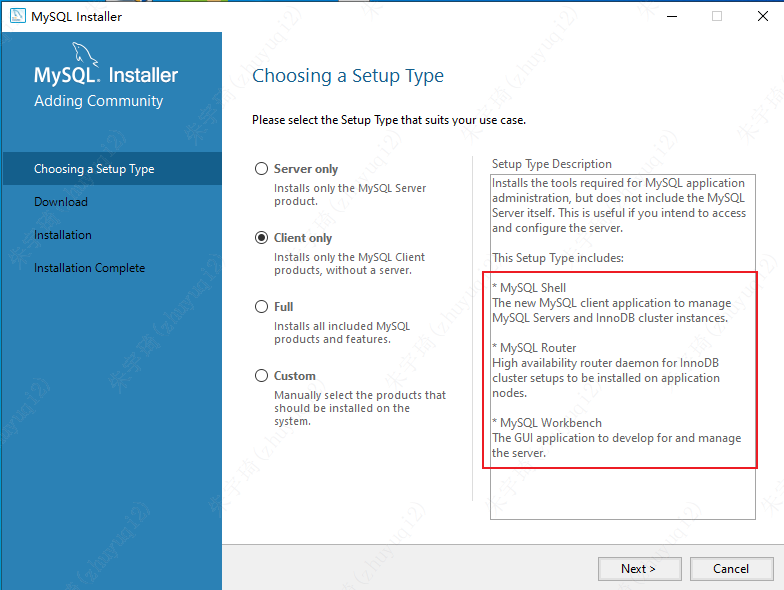
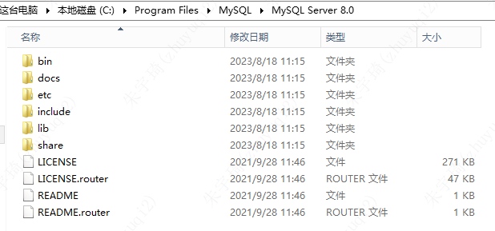
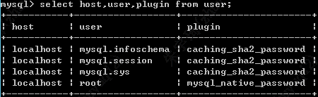
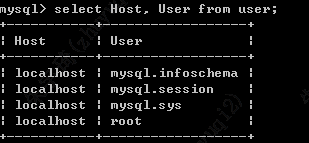
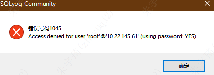

## MySql安装

### windows安装community版本




1. server only安装完：
    - 
2. client only安装完：
    - 
    - mysql shell和mysql router用于搭建集群。
        - 集群搭建：[搭建MySQL（8.0版本）集群（MySQL-shell、MySQL-router） - 雷雨客 - 博客园 (cnblogs.com)](https://www.cnblogs.com/javasl/p/14653506.html)
        - mysql shell连接数据库：[如何使用MySQL Shell连接数据库_shell进入mysql_zhbaodong的博客-CSDN博客](https://blog.csdn.net/zhbaodong/article/details/104983880?ydreferer=aHR0cHM6Ly9jbi5iaW5nLmNvbS8%3D)
    - mysql workbench：
        - 类似于sqlyog
        - [MySQL Workbench 安装及使用_AnZhiJiaShu的博客-CSDN博客](https://blog.csdn.net/unauna9739/article/details/124702155?ydreferer=aHR0cHM6Ly9jbi5iaW5nLmNvbS8%3D)

### windows安装server版本


[win10 MySQL安装及配置mysql-8.0.27-winx64_Ting廷帅的博客-CSDN博客](https://blog.csdn.net/weixin_48716320/article/details/121047768)

安装后内容：



### 远程连接mysql

1. 本地登录mysql，切换到mysql数据库，查看是否允许远程访问：

```mysql
use mysql
select host,user,plugin from user;
```



2. root 用户的host为localhost，要远程访问，需要将它改成%。

```mysql
update user set host='%' where user ='root';
```

3. 刷新权限：

```mysql
FLUSH PRIVILEGES;
```

### 异常处置

#### 远程用户无法连接1

连接情形：server和client在不同设备上，不能连接但可以相互ping通。

报错提示：


原因：可以看到报错提示的但是不允许主机为desktop-k86tj66的用户登录。说明mysql允许连接的用户没有这个设备。

解决措施：

- 登录server服务器，进入mysql安装目录的bin目录，打开终端：`mysql -u root -p`
- `show databases;`
- `use mysql;`
- `show tables;`
- 查看允许登录的ip和用户名：`select Host, User from user;`
 	- 
- 允许所有IP登录：`update user set Host='%' where User='root';`，再查询允许登录的ip和用户名：`select Host, User from user;`
 	- 
- 刷新权限：`flush privileges;`

参考链接：

- [Mysql连接报错：1130-host ... is not allowed to connect to this MySql server如何处理 - youqc - 博客园 (cnblogs.com)](https://www.cnblogs.com/youqc/p/10476605.html)
- [Mysql—用户表详解(mysql.user) - 刘_love_田 - 博客园 (cnblogs.com)](https://www.cnblogs.com/liuhaidon/archive/2019/09/12/11511129.html)

#### 远程用户无法连接2

报错提示：



原因：MySQL8的特性，关闭了root用户的登陆。

解决措施：

- 关闭mysql服务。
- 管理员模式进入终端，在mysql/bin目录下执行：`mysqld --console --skip-grant-tables --shared-memory`，然后不要关闭窗口。
- 新建一个管理员模式进入终端，在mysql/bin目录下执行：`mysql -u root -p`，将管理员用户的密码置空：`update mysql.user set authentication_string='' where user='root'`
- 关闭第一个终端的窗口，启动mysql服务（不关闭则不能启动）
- sqlyog连接mysql，不要输入密码：
 	- 

#### 无法启动服务且无报错

可能原因：my.ini文件的编码变成了UTF-8，应该为ANSI。
