## 官方文档

[https://docs.oracle.com/cd/E11882_01/server.112/e41084/functions089.htm#SQLRF30030](https://docs.oracle.com/cd/E11882_01/server.112/e41084/functions089.htm#SQLRF30030)

## Oracle和MySQL的区别

[浅谈Oracle和mysql数据语法的区别 - 知乎 (zhihu.com)](https://zhuanlan.zhihu.com/p/448175793)  
[Oracle和MySQL语法区别_oracle和mysql语法区别大吗_初尘19的博客-CSDN博客](https://blog.csdn.net/lanmuhhh2015/article/details/97763615)

## 合并所有查询结果为一行

### listagg实现

原始数据：

```sql
SELECT
	aor.A1_SAW_MARK_QTY_I,--A2线痕	
	aor.B_LINE_MARK_QTY_I,--B5线痕
	aor.SERIAL_NUMBER_S,
	aod.STEELWIRE_CUT_COUNT_I,
	aod.UP_STEELWIRE_NUMBER_S
FROM
	AT_OM_RETESTINFO aor
LEFT JOIN AT_OM_DATACOLLECTION aod ON aor.SERIAL_NUMBER_S = aod.SERIAL_NUMBER_S
WHERE (aor.A1_SAW_MARK_QTY_I IS NOT NULL OR aor.B_LINE_MARK_QTY_I IS NOT NULL) AND aod.UP_STEELWIRE_NUMBER_S ='V21212H03A0B0'
ORDER BY aod.STEELWIRE_CUT_COUNT_I;

A1_SAW_MARK_QTY_I|B_LINE_MARK_QTY_I|SERIAL_NUMBER_S |STEELWIRE_CUT_COUNT_I|UP_STEELWIRE_NUMBER_S|
-----------------+-----------------+----------------+---------------------+---------------------+
              272|                 |JZL122C0422-0048|                    1|V21212H03A0B0        |
               73|                 |JZL122C0422-0092|                    2|V21212H03A0B0        |
              565|               27|JZL122C0423-0004|                    3|V21212H03A0B0        |
              970|               32|JZL122C0423-0042|                    5|V21212H03A0B0        |
```

需求结果：1/187，3/42，5/540

格式：第几刀/(A2线痕 + B5线痕)，第几刀/(A2线痕 + B5线痕)

思路：

1. 计算A2线痕+B5线痕总和

```sql
SELECT
	aod.STEELWIRE_CUT_COUNT_I,
	aod.UP_STEELWIRE_NUMBER_S,
	NVL(aor.B_LINE_MARK_QTY_I,0) + NVL(aor.A1_SAW_MARK_QTY_I,0),
	aor.B_LINE_MARK_QTY_I,
	aor.A1_SAW_MARK_QTY_I
FROM
	AT_OM_RETESTINFO aor
LEFT JOIN AT_OM_DATACOLLECTION aod ON aor.SERIAL_NUMBER_S = aod.SERIAL_NUMBER_S
WHERE (aor.A1_SAW_MARK_QTY_I IS NOT NULL OR aor.B_LINE_MARK_QTY_I IS NOT NULL) AND aod.UP_STEELWIRE_NUMBER_S ='V21212H03A0B0'
ORDER BY aod.STEELWIRE_CUT_COUNT_I;
```

2. 拼接第几刀和线痕总和

```sql
SELECT
	CONCAT(CONCAT(aod.STEELWIRE_CUT_COUNT_I,'/'),NVL(aor.B_LINE_MARK_QTY_I,0) + NVL(aor.A1_SAW_MARK_QTY_I,0)),
	aod.UP_STEELWIRE_NUMBER_S,
	aor.B_LINE_MARK_QTY_I,
	aor.A1_SAW_MARK_QTY_I
FROM
	AT_OM_RETESTINFO aor
LEFT JOIN AT_OM_DATACOLLECTION aod ON aor.SERIAL_NUMBER_S = aod.SERIAL_NUMBER_S
WHERE (aor.A1_SAW_MARK_QTY_I IS NOT NULL OR aor.B_LINE_MARK_QTY_I IS NOT NULL) AND aod.UP_STEELWIRE_NUMBER_S ='V21212H03A0B0'
ORDER BY aod.STEELWIRE_CUT_COUNT_I;
```

3. 合并列显示（列转行）

```sql
SELECT
--	aod.UP_STEELWIRE_NUMBER_S,
--	aod.STEELWIRE_CUT_COUNT_I ,
	LISTAGG(CONCAT(CONCAT(aod.STEELWIRE_CUT_COUNT_I,'/'),NVL(aor.B_LINE_MARK_QTY_I,0) + NVL(aor.A1_SAW_MARK_QTY_I,0)),', ') WITHIN GROUP (ORDER BY aod.UP_STEELWIRE_NUMBER_S)
FROM
	AT_OM_RETESTINFO aor
LEFT JOIN AT_OM_DATACOLLECTION aod ON aor.SERIAL_NUMBER_S = aod.SERIAL_NUMBER_S
WHERE (aor.A1_SAW_MARK_QTY_I IS NOT NULL OR aor.B_LINE_MARK_QTY_I IS NOT NULL) AND aod.UP_STEELWIRE_NUMBER_S ='V21212H03A0B0';
```

注意：

- listagg可以取别名
- 注释掉的内容不能打开，打开报错。

分组写法：

```sql
SELECT
	aod.UP_STEELWIRE_NUMBER_S,
--	aod.STEELWIRE_CUT_COUNT_I ,
	LISTAGG(CONCAT(CONCAT(aod.STEELWIRE_CUT_COUNT_I,'/'),NVL(aor.B_LINE_MARK_QTY_I,0) + NVL(aor.A1_SAW_MARK_QTY_I,0)),', ') WITHIN GROUP (ORDER BY aod.UP_STEELWIRE_NUMBER_S) description
FROM
	AT_OM_RETESTINFO aor
LEFT JOIN AT_OM_DATACOLLECTION aod ON aor.SERIAL_NUMBER_S = aod.SERIAL_NUMBER_S
WHERE (aor.A1_SAW_MARK_QTY_I IS NOT NULL OR aor.B_LINE_MARK_QTY_I IS NOT NULL) 
GROUP BY aod.UP_STEELWIRE_NUMBER_S ;
```

### xmlagg实现

listagg对字段长度有限制，会报下列错误：

[Oracle字符串拼接函数（wm_concat、listagg、xmlagg）踩过的坑_xmlagg拼接内容去重_水中摇曳的浮萍的博客-CSDN博客](https://blog.csdn.net/qq_35253970/article/details/102819323)

可以使用xmlagg实现：

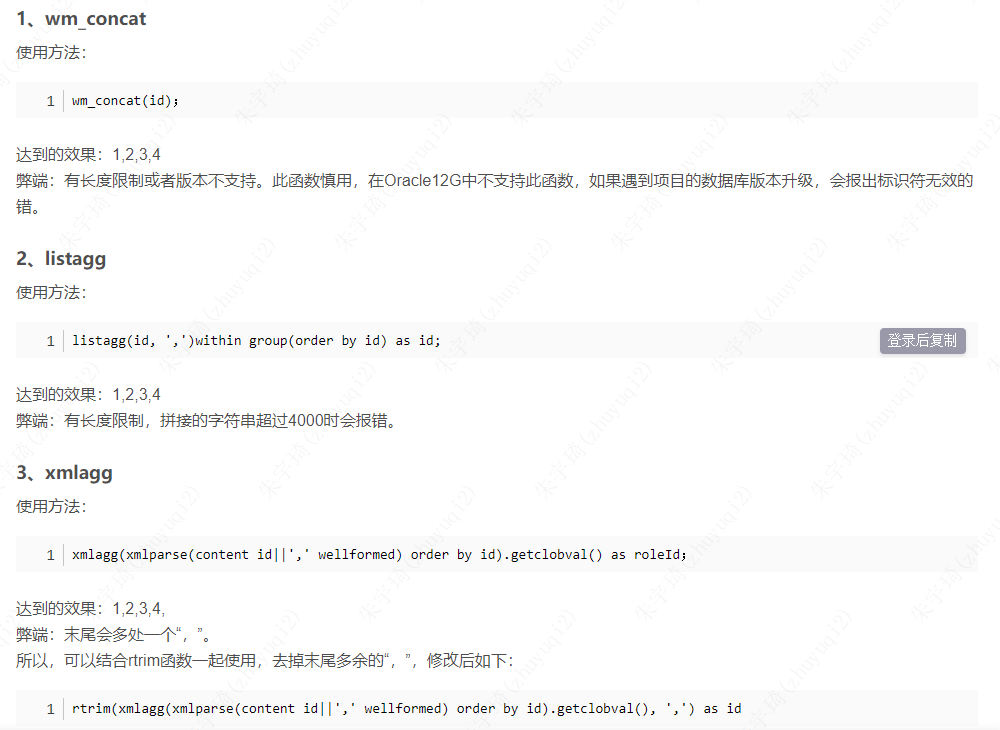

## WHERE和HAVING的区别

1. “Where” 是一个约束声明，使用Where来约束来之数据库的数据，Where是在结果返回之前起作用的，且Where中不能使用聚合函数。
2. “Having”是一个过滤声明，是在查询返回结果集以后对查询结果进行的过滤操作，在Having中可以使用聚合函数。

## Group By

### 不是group by 表达式

1. 没有把所有的**非聚合函数字**段加入到group by 中
2. 在group by 中**不能用别名**。

**聚合函数：也可以叫做聚组函数、组函数、集合函数，具体包括：count、sum、avg、max、min、stddev、variance。**

substr函数也能用。

对于string使用max则比较的是长度。

### 一种写法

```sql
SELECT   max(ex.CREATION_TIME),
max(ex.STEELLINE_WASTE_F) AS STEELLINE_WASTE_F,                          --钢线损失长度
max(ex.STEEL_WASTE_REASON_S) AS STEEL_WASTE_REASON_S,                       --钢线损失原因
max(ex.BREAK_DEPTH_F) AS BREAK_DEPTH_F,                              --断线深度
max(ex.BREAK_DEPTH2_F) AS BREAK_DEPTH2_F,
max(ex.BREAK_DEPTH3_F) AS BREAK_DEPTH3_F,
max(ex.BREAK_USER_S) AS BREAK_USER_S,
max(ex.COLUMN_8_S) AS WELDER_S, 
max(ex.BREAK_TYPE_S) AS BREAK_TYPE_S ,                              --断线类型
max(ex.BREAK_REASON_S) AS BREAK_REASON_S,                             --断线原因
max(ex.IS_TENACITYLINE_S) AS IS_TENACITYLINE_S,                          --是否韧线
ex.SERIAL_NUMBER_S                             --随工单
FROM AT_OM_SECTIONPROCESSEXC ex 
GROUP BY ex.SERIAL_NUMBER_S
```

## SQL

### 函数

#### trunc()

截取时间或者数值，返回指定的值。

**截取时间：**

```sql
SELECT
	trunc(sysdate, 'yyyy'),--返回当年第一天
	trunc(sysdate, 'mm'),--返回当月第一天
	trunc(sysdate, 'dd'),--返回当天年月
	trunc(sysdate, 'd'),--返回当前星期的第一天(星期日开始)
	trunc(sysdate, 'hh'),--返回当前日期截取到小时,分秒补0
	trunc(sysdate, 'mi')--返回当前日期截取到分,秒补0
FROM
	dual ;
```

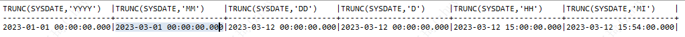

**截取小数：**

- 语法：`trunc(number,[decimals])`

  - `number`：指需要截取的数字。
  - `decimals`：截取位数，可选参数，如果参数是负数表示从小数点左边截取。注意这里的截取都不做四舍五入，直接舍掉。


```sql
SELECT
	trunc(122.555), --默认取整
	trunc(122.555, 2),
	trunc(122.555,-2)--负数表示从小数点左边开始截取2位
FROM
	dual;
```

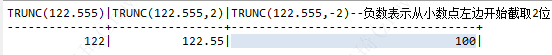

**格式化小数（舍去）：**

```sql
SELECT to_char(to_number(trunc(2.306,2)),'9.99'), to_char(to_number(trunc(2.304,2)),'9.99')FROM DUAL;

结果：
TO_CHAR(TO_NUMBER(TRUNC(2.306,2)),'9.99')|TO_CHAR(TO_NUMBER(TRUNC(2.304,2)),'9.99')|
-----------------------------------------+-----------------------------------------+
 2.30                                    | 2.30                                    |
```

### 别名

#### 表别名

sql语句中from后面是子查询，mysql需要使用别名，oracle不需要使用别名。

#### 列别名

子查询中的列，使用别名时，不要写双引号（oracle）——*原因未知*。使用了双引号，列名会是引号内的内容（区分大小写），不适用双引号，列名全大写。

```sql
-- 不会报错，列名：equip
SELECT * FROM (
	SELECT aod.SECTION_EQUIPMENT_S AS "equip"
	FROM AT_OM_DAILYREPORT aod 
	WHERE aod.SECTION_EQUIPMENT_S IS NOT NULL
	GROUP BY aod.SECTION_EQUIPMENT_S
);
-- 不会报错，列名：EQUIP
SELECT * FROM (
	SELECT aod.SECTION_EQUIPMENT_S AS equip
	FROM AT_OM_DAILYREPORT aod 
	WHERE aod.SECTION_EQUIPMENT_S IS NOT NULL
	GROUP BY aod.SECTION_EQUIPMENT_S
);
-- 不会报错，列名：equip
SELECT * FROM (
	SELECT aod.SECTION_EQUIPMENT_S "equip"
	FROM AT_OM_DAILYREPORT aod 
	WHERE aod.SECTION_EQUIPMENT_S IS NOT NULL
	GROUP BY aod.SECTION_EQUIPMENT_S
);
-- 不会报错，列名：EQUIP
SELECT * FROM (
	SELECT aod.SECTION_EQUIPMENT_S equip
	FROM AT_OM_DAILYREPORT aod 
	WHERE aod.SECTION_EQUIPMENT_S IS NOT NULL
	GROUP BY aod.SECTION_EQUIPMENT_S
);

-- 不会报错，列名：EQUIP
SELECT equip FROM (
	SELECT aod.SECTION_EQUIPMENT_S AS equip
	FROM AT_OM_DAILYREPORT aod 
	WHERE aod.SECTION_EQUIPMENT_S IS NOT NULL
	GROUP BY aod.SECTION_EQUIPMENT_S
);
-- 不会报错，列名：EQUIP
SELECT equip FROM (
	SELECT aod.SECTION_EQUIPMENT_S equip
	FROM AT_OM_DAILYREPORT aod 
	WHERE aod.SECTION_EQUIPMENT_S IS NOT NULL
	GROUP BY aod.SECTION_EQUIPMENT_S
);
-- 不会报错，列名：EQUIP
SELECT EQUIP FROM (
	SELECT aod.SECTION_EQUIPMENT_S AS equip
	FROM AT_OM_DAILYREPORT aod 
	WHERE aod.SECTION_EQUIPMENT_S IS NOT NULL
	GROUP BY aod.SECTION_EQUIPMENT_S
);
-- 不会报错，列名：EQUIP
SELECT EQUIP FROM (
	SELECT aod.SECTION_EQUIPMENT_S equip
	FROM AT_OM_DAILYREPORT aod 
	WHERE aod.SECTION_EQUIPMENT_S IS NOT NULL
	GROUP BY aod.SECTION_EQUIPMENT_S
);

-- 报错，列名EQUIP无效
SELECT equip FROM (
	SELECT aod.SECTION_EQUIPMENT_S "equip"
	FROM AT_OM_DAILYREPORT aod 
	WHERE aod.SECTION_EQUIPMENT_S IS NOT NULL
	GROUP BY aod.SECTION_EQUIPMENT_S
);
-- 报错，列名EQUIP无效
SELECT equip FROM (
	SELECT aod.SECTION_EQUIPMENT_S AS  "equip"
	FROM AT_OM_DAILYREPORT aod 
	WHERE aod.SECTION_EQUIPMENT_S IS NOT NULL
	--AND aod.SECTION_EQUIPMENT_S LIKE 'A1%'
	GROUP BY aod.SECTION_EQUIPMENT_S
);
-- 报错，列名EQUIP无效
SELECT EQUIP FROM (
	SELECT aod.SECTION_EQUIPMENT_S "equip"
	FROM AT_OM_DAILYREPORT aod 
	WHERE aod.SECTION_EQUIPMENT_S IS NOT NULL
	GROUP BY aod.SECTION_EQUIPMENT_S
);
-- 报错，列名EQUIP无效
SELECT EQUIP FROM (
	SELECT aod.SECTION_EQUIPMENT_S AS  "equip"
	FROM AT_OM_DAILYREPORT aod 
	WHERE aod.SECTION_EQUIPMENT_S IS NOT NULL
	--AND aod.SECTION_EQUIPMENT_S LIKE 'A1%'
	GROUP BY aod.SECTION_EQUIPMENT_S
);
```

总结：

- `select *`时：别名是否使用双引号`"` ，是否使用`AS`，都不会报错。
- `select 列名`时：别名不使用双引号`"` ，是否使用`AS`，都不会报错。
- `select 列名`时：别名使用双引号`"` ，是否使用`AS`，都会报错。

指南：`select *`，并不使用双引号`"`，`AS`无所谓。

## 分析执行效率

针对以下sql对查询效率进行分析：

```sql
SELECT
	'XX-西咸' AS base, 
	TO_CHAR(OL.COMPLETE_TIME_T-7 / 24, 'yyyy') || '年' || TO_CHAR(OL.COMPLETE_TIME_T-7 / 24, 'mm') || '月' || TO_CHAR(OL.COMPLETE_TIME_T-7 / 24, 'dd') || '日' AS "DATE",
	OL.SHOP_NAME_S AS workshop,
	CASE
		WHEN TO_NUMBER(TO_CHAR(OL.COMPLETE_TIME_T , 'HH24')) >= 7 AND TO_NUMBER(TO_CHAR(OL.COMPLETE_TIME_T , 'HH24')) < 19 THEN '白班'
		ELSE '夜班'
	END AS shiftnum,	
	OL.EQUIP_NAME_S AS equipment,
	ol.PART_NUMBER_S AS prodnum,
	aop.PRODUCT_TYPE_OLD_S AS prodspec5,
	aop.ATTRIBUTE3_S AS prodtype,
	aop.THICKNESS_S AS thickness,
	OL.SERIAL_NUMBER_S AS seriesnum,
	OL.START_TIME_T AS time_loading,
	OL.COMPLETE_TIME_T AS time_unloading,
	eu.C_STORAGEAREA_S workshop_area,
	aop.PRODUCT_TYPE_NEW_S AS prodspec8,
	TO_CHAR(eu.MANUFACTURER_S) || '8500'  AS equipment_type,
	aodl.SPEC_S AS diameter_code,
	ol.LAST_MODIFIED_TIME last_modified_time
FROM
	XXQPMES.AT_OM_LOTHISTORY OL
	--过站历史信息表
LEFT JOIN XXQPMES.LOT_UV lu 
	ON
	lu.LOT_NAME = Ol.SERIAL_NUMBER_S
LEFT JOIN
	XXQPMES.EQUIPMENT_UV eu
	--设备台账视图 
	ON
	eu.EQUIP_NAME = ol.EQUIP_NAME_S
LEFT JOIN 
	XXQPMES.AT_OM_DATACOLLECTION aodc
	--datacollection
	ON
	aodc.SERIAL_NUMBER_S = ol.SERIAL_NUMBER_S
LEFT JOIN 
	XXQPMES.AT_OM_DIAMONDLINE aodl
	--钢线
	ON
	aodl.SPOOL_NO_S = aodc.UP_STEELWIRE_NUMBER_S
LEFT JOIN 
	XXQPMES.PART_UV pu ON
	pu.PART_NUMBER = lu.PART_NUMBER
LEFT JOIN 
	XXQPMES.AT_OM_PRODUCTCATEGORY aop 
	ON
	aop.INVENTORY_ITEM_ID_I = pu.ITEM_ID_I
WHERE
	OL.OP_NAME_S = 'section'
--	AND OL.COMPLETE_TIME_T >= to_date('2023-02-14 07:00:00', 'yyyy-mm-dd hh24:mi:ss')
--	AND OL.COMPLETE_TIME_T < to_date('2023-02-15 07:00:00', 'yyyy-mm-dd hh24:mi:ss')
ORDER BY
	OL.START_TIME_T,
	OL.EQUIP_NAME_S ASC;
```

### 方式一：使用图形化工具

分析步骤：

1. 在pl/slq工具中新建解释计划窗口：

   - 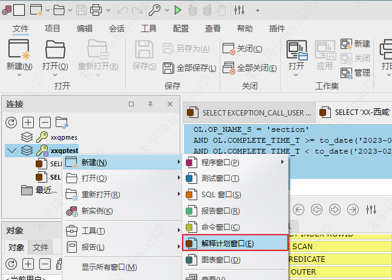

2. 粘贴sql语句，点击执行：

   - 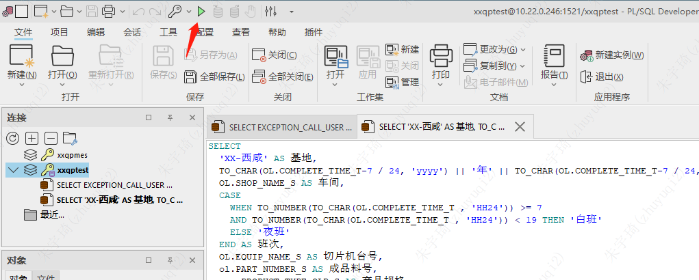

3. 查看执行结果：

   - 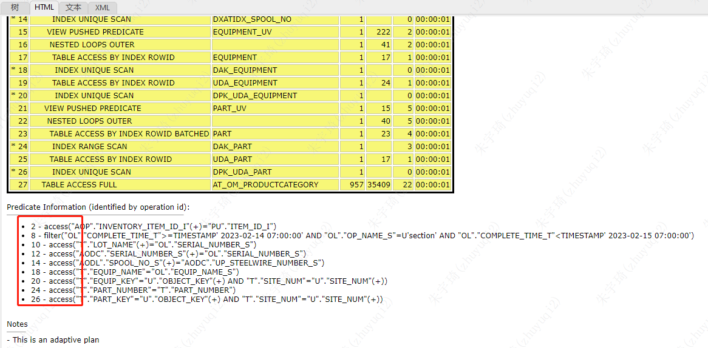

4. 分析执行结果：

   - filter表示全表过滤
   - acesss表示根据索引查询
   - 上述sql主表进行了全表过滤，但其他关联表均通过索引查询，**所以执行效率没有问题**。

### 方式二：使用sql语句

## 创建视图

需求：为以下sql语句创建视图。

```sql
SELECT
	'XX-西咸' AS base, 
	TO_CHAR(OL.COMPLETE_TIME_T-7 / 24, 'yyyy') || '年' || TO_CHAR(OL.COMPLETE_TIME_T-7 / 24, 'mm') || '月' || TO_CHAR(OL.COMPLETE_TIME_T-7 / 24, 'dd') || '日' AS "DATE",
	OL.SHOP_NAME_S AS workshop,
	CASE
		WHEN TO_NUMBER(TO_CHAR(OL.COMPLETE_TIME_T , 'HH24')) >= 7 AND TO_NUMBER(TO_CHAR(OL.COMPLETE_TIME_T , 'HH24')) < 19 THEN '白班'
		ELSE '夜班'
	END AS shiftnum,	
	OL.EQUIP_NAME_S AS equipment,
	ol.PART_NUMBER_S AS prodnum,
	aop.PRODUCT_TYPE_OLD_S AS prodspec5,
	aop.ATTRIBUTE3_S AS prodtype,
	aop.THICKNESS_S AS thickness,
	OL.SERIAL_NUMBER_S AS seriesnum,
	OL.START_TIME_T AS time_loading,
	OL.COMPLETE_TIME_T AS time_unloading,
	eu.C_STORAGEAREA_S workshop_area,
	aop.PRODUCT_TYPE_NEW_S AS prodspec8,
	TO_CHAR(eu.MANUFACTURER_S) || '8500'  AS equipment_type,
	aodl.SPEC_S AS diameter_code,
	ol.LAST_MODIFIED_TIME last_modified_time
FROM
	XXQPMES.AT_OM_LOTHISTORY OL
	--过站历史信息表
LEFT JOIN XXQPMES.LOT_UV lu 
	ON
	lu.LOT_NAME = Ol.SERIAL_NUMBER_S
LEFT JOIN
	XXQPMES.EQUIPMENT_UV eu
	--设备台账视图 
	ON
	eu.EQUIP_NAME = ol.EQUIP_NAME_S
LEFT JOIN 
	XXQPMES.AT_OM_DATACOLLECTION aodc
	--datacollection
	ON
	aodc.SERIAL_NUMBER_S = ol.SERIAL_NUMBER_S
LEFT JOIN 
	XXQPMES.AT_OM_DIAMONDLINE aodl
	--钢线
	ON
	aodl.SPOOL_NO_S = aodc.UP_STEELWIRE_NUMBER_S
LEFT JOIN 
	XXQPMES.PART_UV pu ON
	pu.PART_NUMBER = lu.PART_NUMBER
LEFT JOIN 
	XXQPMES.AT_OM_PRODUCTCATEGORY aop 
	ON
	aop.INVENTORY_ITEM_ID_I = pu.ITEM_ID_I
WHERE
	OL.OP_NAME_S = 'section'
--	AND OL.COMPLETE_TIME_T >= to_date('2023-02-14 07:00:00', 'yyyy-mm-dd hh24:mi:ss')
--	AND OL.COMPLETE_TIME_T < to_date('2023-02-15 07:00:00', 'yyyy-mm-dd hh24:mi:ss')
ORDER BY
	OL.START_TIME_T,
	OL.EQUIP_NAME_S ASC;
```

视图创建语法：

语法一：

```sql
create or replace view 视图名（别名,........）  
as  
select  
字段,  
....... 
from 表名
```

语法二：

```sql
create or replace view 视图名  
as  
select  
字段 as "别名",  
....... 
from 表名
```

注意事项：

- `--注释内容`可能存在部分工具无法识别。
- `where`条件中时间条件可能将视图的数据范围产生限制，建议删除【需验证】。
- `order by`条件不会生效。
- `date`字段为Oracle关键字，使用它作为视图列名时，不论使用哪种方式创建视图，均需要使用引号，且使用大写（规范）。
- 注意：方式二字段别名使用了`""`，所以查询某一字段时，也需要带引号，所以建议不要使用`""`

最终语法：

```sql
CREATE OR REPLACE VIEW xxcutsperqp_v AS 
SELECT
	'XX-西咸' AS base, 
	TO_CHAR(OL.COMPLETE_TIME_T-7 / 24, 'yyyy') || '年' || TO_CHAR(OL.COMPLETE_TIME_T-7 / 24, 'mm') || '月' || TO_CHAR(OL.COMPLETE_TIME_T-7 / 24, 'dd') || '日' AS "DATE",
	OL.SHOP_NAME_S AS workshop,
	CASE
		WHEN TO_NUMBER(TO_CHAR(OL.COMPLETE_TIME_T , 'HH24')) >= 7
		AND TO_NUMBER(TO_CHAR(OL.COMPLETE_TIME_T , 'HH24')) < 19 THEN '白班'
		ELSE '夜班'
	END AS shiftnum,	
	OL.EQUIP_NAME_S AS equipment,
	ol.PART_NUMBER_S AS prodnum,
	aop.PRODUCT_TYPE_OLD_S AS prodspec5,
	aop.ATTRIBUTE3_S AS prodtype,
	aop.THICKNESS_S AS thickness,
	OL.SERIAL_NUMBER_S AS seriesnum,
	OL.START_TIME_T AS time_loading,
	OL.COMPLETE_TIME_T AS time_unloading,
	eu.C_STORAGEAREA_S workshop_area,
	aop.PRODUCT_TYPE_NEW_S AS prodspec8,
	TO_CHAR(eu.MANUFACTURER_S) || '8500'  AS equipment_type,
	aodl.SPEC_S AS diameter_code,
	ol.LAST_MODIFIED_TIME last_modified_time
FROM
	XXQPMES.AT_OM_LOTHISTORY OL
LEFT JOIN XXQPMES.LOT_UV lu 
	ON
	lu.LOT_NAME = Ol.SERIAL_NUMBER_S
LEFT JOIN
	XXQPMES.EQUIPMENT_UV eu
	ON
	eu.EQUIP_NAME = ol.EQUIP_NAME_S
LEFT JOIN 
	XXQPMES.AT_OM_DATACOLLECTION aodc
	ON
	aodc.SERIAL_NUMBER_S = ol.SERIAL_NUMBER_S
LEFT JOIN 
	XXQPMES.AT_OM_DIAMONDLINE aodl
	ON
	aodl.SPOOL_NO_S = aodc.UP_STEELWIRE_NUMBER_S
LEFT JOIN 
	XXQPMES.PART_UV pu ON
	pu.PART_NUMBER = lu.PART_NUMBER
LEFT JOIN 
	XXQPMES.AT_OM_PRODUCTCATEGORY aop 
	ON
	aop.INVENTORY_ITEM_ID_I = pu.ITEM_ID_I
WHERE
	OL.OP_NAME_S = 'section'
WITH READ ONLY;
```

## Oracle表访问方式

### table access full（全表扫描）

- Oracle 会读取表中所有的行，并检查每一行是否满足 where 限制条件
- 全表扫描时可以使用多块读（一次 I/O 读取多块数据块）操作，提升吞吐量
- 使用建议：数据量太大的表不建议使用全表扫描，除非本身需要取出的数据较多，占到表数据总量的 5% ~ 10% 或以上。
- 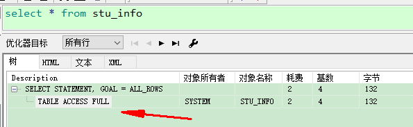

### table access by rowid（通过 rowid 扫描）

- rowid：伪列，Oracle 自带的，不会存储 rowid 的值，不能被增、删、改
- 一旦一行数据插入后，则其对应的 rowid 在该行的生命周期内是唯一的，即使发生行迁移，该行的 rowid 值也不变
- `select ROWID form dual`可以查询行数据的rowid。
- 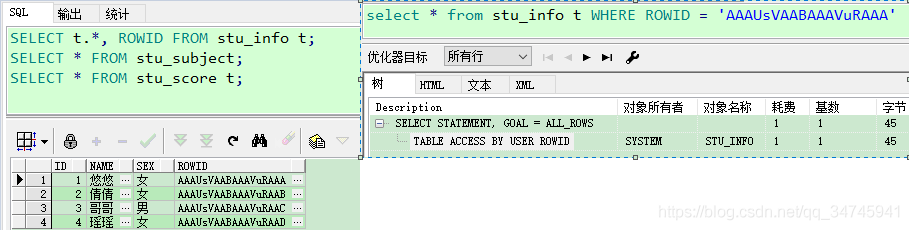

### table access by index scan（索引扫描）

- 在索引块中，既存储每个索引的键值，也存储具有该键值行的 rowid
- 所以索引扫描其实分为两步：

  - 扫描索引得到对应的 rowid
  - 通过 rowid 定位到具体的行读取数据

- 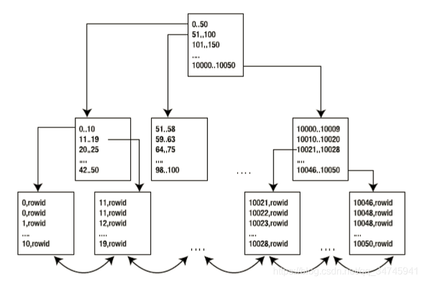

#### index unique scan（索引唯一扫描）

- 每次至多返回一条记录
- 有下列两种情况（当查询字段有下列约束时）

  - unique
  - primary key

- 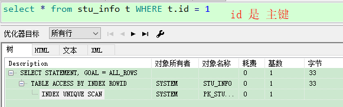

#### index range scan（索引范围扫描）

- 每次至少返回一条记录
- 一般有下列三种情况

  - 在唯一索引列上使用了范围操作符（如：`>` 、`<`、`>`、`=`、 `<=` 、`between`）
  - 在组合索引上，只使用部分列进行查询（查询时必须包含前导列，否则会走全表扫描）
  - 对非唯一索引列上进行的任何查询


#### index full scan（索引全扫描）

- order by 唯一索引列
- 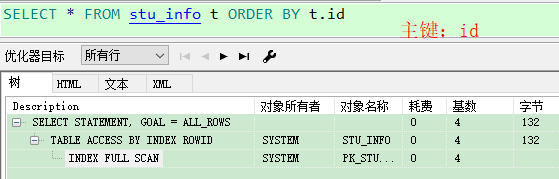

#### index fast full scan（索引快速扫描）

- 与 index full scan 类似，只是不进行排序。

#### index skip scan（索引跳跃扫描）

- 必须是 组合索引
- 除了前导列（索引中第一列）外的其他列作为条件

### 参考文档

[https://blog.csdn.net/qq_34745941/article/details/96475940](https://blog.csdn.net/qq_34745941/article/details/96475940)

## Oracle表连接方式

### 概念

- 表连接类型：写 sql 语句时，表之间的关联关系
- 表连接方式：执行计划里面的表连接方式

### 表连接类型——等值连接

#### 分类

- 内连接  inner join，简写 join
- 左连接  left  join
- 右连接  right join
- 全连接  full  join

#### 写法

写法一：

```sql
select a.*, b.* from a left join b on a.id = b.id;
```

写法二：(+) 一侧，表示左连接

```sql
select a.*, b.* from a, b where a.id = b.id(+);
```

## Oracle表连接类型

### 概念

- Driving Table（驱动表）：执行计划最先执行的那个表 /*+ leading(t1)*/
- Probed Table（匹配表）：与驱动表进行连接的表

### 分类

三种连接方式：hint

- nested loops：
- hash join
- merge
- 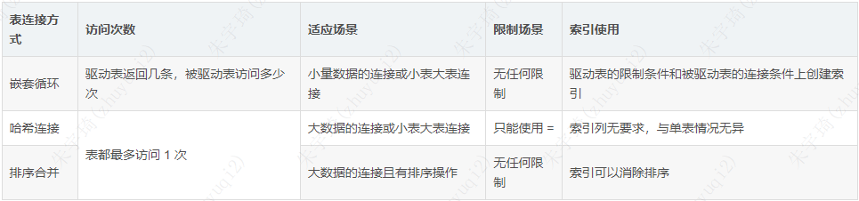

#### nested loops

1. 工作原理：

```sql
驱动表 t1，有 m 条记录
匹配表 t2，有 n 条记录

for i in 1 .. m loop
 for j in 1 .. n loop
   if t1[i].col = t2[j].col then
	  匹配成功;
   end if;
 end loop;  
end loop; 
```

2. 结论：

   - T1 表每返回一条记录，都要去 T2 表去轮询一次，得到与其匹配的数据，推送到结果集中。所以，在嵌套表循环的使用中，必须设置 '返回记录少' 的表作为驱动表。
   - 可以通过以下两点来提高嵌套循环的速度：

     - 第一：尽量提高 T1 表 '取'  记录的速度(T1 表的连接列上创建索引)
     - 第二：尽量提高 T2 表 '匹配' 记录的速度(T2 表的连接列上创建索引)


3. 示例：

```sql
设：
	scott.emp -- 14 条记录
	scott.dept -- 4 条记录
```

以 scott.dept（小表） 为驱动表，执行计划如下：

```sql
SQL> alter session set statistics_level = all;

SQL> select /*+ leading(d) use_nl(e)*/
            e.*,
            d.*
       from scott.emp  e,
            scott.dept d
      where d.deptno = e.deptno;

SQL> select t.*
       from v$sql t
      where t.sql_text like '%FROM scott.emp  e,%'
      order by t.last_active_time desc;
 
SQL> select * from table(dbms_xplan.display_cursor('c2ckftf2gj7qv',null,'allstats last')); 

-------------------------------------------------------------------------------------
| Id  | Operation          | Name | Starts | E-Rows | A-Rows |   A-Time   | Buffers |
-------------------------------------------------------------------------------------
|   0 | SELECT STATEMENT   |      |      1 |        |     14 |00:00:00.02 |      35 |
|   1 |  NESTED LOOPS      |      |      1 |     14 |     14 |00:00:00.02 |      35 |
|   2 |   TABLE ACCESS FULL| DEPT |      1 |      4 |      4 |00:00:00.02 |       7 |
|*  3 |   TABLE ACCESS FULL| EMP  |      4 |      4 |     14 |00:00:00.01 |      28 |
-------------------------------------------------------------------------------------
Predicate Information (identified by operation id):
---------------------------------------------------
   3 - filter("D"."DEPTNO"="E"."DEPTNO")
```

执行结果解释：

```sql
1. 首先，读取表 DEPT，读取次数 Starts = 1，实际读取记录数 A-Rows = 4 条(dept表行数)
2. 其次，读取表 EMP，读取次数 Starts = 4，实际读取记录数（每次） A-Rows = 14 条 （emp表行数）
3. 然后，将两表进行 '嵌套循环'
4. 最后，查询最终结果
```

以 scott.emp（“大表”） 为驱动表，执行结果如下：

```sql
--------------------------------------------------------------------------------------------------
| Id  | Operation                    | Name    | Starts | E-Rows | A-Rows |   A-Time   | Buffers |
--------------------------------------------------------------------------------------------------
|   0 | SELECT STATEMENT             |         |      1 |        |     14 |00:00:00.01 |      25 |
|   1 |  NESTED LOOPS                |         |      1 |        |     14 |00:00:00.01 |      25 |
|   2 |   NESTED LOOPS               |         |      1 |     14 |     14 |00:00:00.01 |      11 |
|   3 |    TABLE ACCESS FULL         | EMP     |      1 |     14 |     14 |00:00:00.01 |       7 |
|*  4 |    INDEX UNIQUE SCAN         | PK_DEPT |     14 |      1 |     14 |00:00:00.01 |       4 |
|   5 |   TABLE ACCESS BY INDEX ROWID| DEPT    |     14 |      1 |     14 |00:00:00.01 |      14 |
--------------------------------------------------------------------------------------------------

1. 首先，读取表 EMP，读取次数 Starts = 1，实际读取记录数 A-Rows = 14 条(emp表行数)
2. 其次，读取表 DEPT，读取次数 Starts = 14，实际读取记录数（每次） A-Rows = 4 条 （emp表行数）
3. 然后，将两表进行 '嵌套循环'
4. 最后，查询最终结果
```

#### hash join

```sql
SQL> SELECT /*+ leading(e) use_hash(d)*/ e.*, d.* FROM scott.emp e, scott.dept d WHERE d.deptno = e.deptno;
```

## 技巧

### 空值判断

1. 判断是否为空：`select * from dual where field is null`
2. 判断是否不为空：`select * from dual where field is not null`
3. 注意：不能使用`=`、`!=`、`<>`、`in`、`not in`进行判断。

### 日期时间

#### 日期格式化

格式化日期指的是将日期转为字符串，或将字符串转为日期，下面几个函数可以用来格式化日期：

- `TO_CHAR(datetime, 'format')`
- `TO_DATE(character, 'format')`
- `TO_TIMESTAMP(character, 'format')`
- `TO_TIMESTAMP_TZ(character, 'format')`

format格式：

| **Format**                    | **List item**                  |
| ----------------------------- | ------------------------------ |
| YYYY-MM-DD                    | 2015-06-15                     |
| YYYY-MON-DD                   | 2015-JUN-15                    |
| YYYY-MM-DD HH24:MI:SS FF3     | 2015-06-15 13:18:10 700        |
| YYYY-MM-DD HH24:MI:SS FF3 TZR | 2015-06-15 13:18:10 700 +08:00 |
| DS                            | 6/15/2015                      |
| DL                            | Monday, June 15, 2015          |
| TS                            | 1:18:10 PM                     |

#### 计算时间差分钟数

```sql
round(to_NUMBER(to_date( to_char(NVL(curing_end_time_T, SYSDATE), 'yyyy-MM-dd HH24:mi:ss'), 'yyyy-MM-dd HH24:mi:ss') - to_date(to_char(curing_start_time_T, 'yyyy-MM-dd HH24:mi:ss'), 'yyyy-MM-dd HH24:mi:ss' ))* 24 * 60)
```

不可直接用：`round(to_NUMBER(NVL(curing_end_time_T, SYSDATE)) - curing_start_time_T)* 24 * 60)`的方式，原因未知。需要先转换为to_char再to_date计算。

### 哪个字段有值用哪个

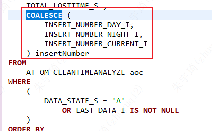

### case when判断null

要求：判断LAST_DATA_I的值，不同的显示效果

| 判断值 | 显示值   |
| ------ | -------- |
| null   | 当前     |
| 10     | 白班最终 |
| 20     | 夜班最终 |

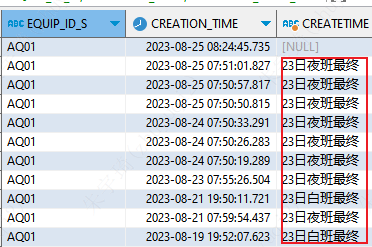

错误写法一：

```sql
CASE LAST_DATA_I
WHEN NULL THEN '当前'
WHEN 10 THEN substr(CREATION_TIME,8,2) || '日白班最终'
WHEN 20 THEN substr(CREATION_TIME,8,2) || '日夜班最终'
END AS createTime,
```

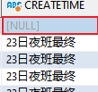

错误写法二：

```sql
CASE  LAST_DATA_I
WHEN IS NULL THEN '当前'
WHEN 10 THEN substr(CREATION_TIME,8,2) || '日白班最终'
WHEN 20 THEN substr(CREATION_TIME,8,2) || '日夜班最终'
END AS createTime,
```

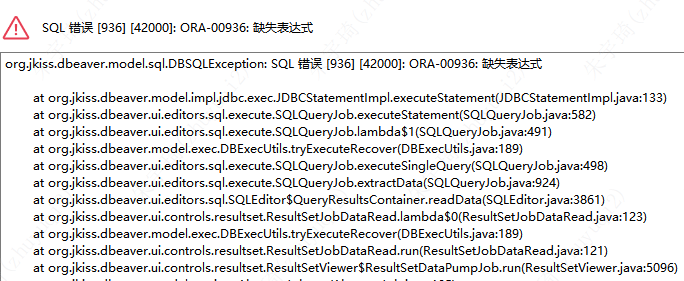

正确写法：

```sql
CASE
WHEN LAST_DATA_I IS NULL THEN '当前'
WHEN LAST_DATA_I = 10 THEN substr(CREATION_TIME,8,2) || '日白班最终'
WHEN LAST_DATA_I = 20 THEN substr(CREATION_TIME,8,2) || '日夜班最终'
END AS createTime,
```

**有bug，显示时间是同一天**

### 获取指定行

#### 排序后获取第二条数据

```sql
SELECT
*
FROM
	(
		SELECT
			aod.SERIAL_NUMBER_S
		FROM
			AT_OM_DATACOLLECTION aod ,
			AT_OM_LOTHISTORY aol
		WHERE
			aod.SERIAL_NUMBER_S = aol.SERIAL_NUMBER_S
			AND aol.OP_NAME_S = 'section'
			AND aol.EQUIP_NAME_S = 'A2-01'
		ORDER BY
			aod.CREATION_TIME DESC
	)
WHERE
	rownum = 2;
```

上述查询获取到结果为null。正确写法：

**方法一：两表相减**

```sql
SELECT
	*
FROM
	(
		SELECT
			aod.SERIAL_NUMBER_S
		FROM
			AT_OM_DATACOLLECTION aod ,
			AT_OM_LOTHISTORY aol
		WHERE
			aod.SERIAL_NUMBER_S = aol.SERIAL_NUMBER_S
			AND aol.OP_NAME_S = 'section'
			AND aol.EQUIP_NAME_S = 'A2-01'
		ORDER BY
			aod.CREATION_TIME DESC
	) 
WHERE rownum <=2
MINUS 
SELECT
	*
FROM
	(
		SELECT
			aod.SERIAL_NUMBER_S
		FROM
			AT_OM_DATACOLLECTION aod ,
			AT_OM_LOTHISTORY aol
		WHERE
			aod.SERIAL_NUMBER_S = aol.SERIAL_NUMBER_S
			AND aol.OP_NAME_S = 'section'
			AND aol.EQUIP_NAME_S = 'A2-01'
		ORDER BY
			aod.CREATION_TIME DESC
	) 
WHERE rownum <=1;
```

**方法二：子查询**

```sql
SELECT
	*
FROM
	(
		-- 获取排序后的行号
		SELECT
			rownum rm,
			t.*
		FROM
			(
				SELECT
					aod.SERIAL_NUMBER_S
				FROM
					AT_OM_DATACOLLECTION aod ,
					AT_OM_LOTHISTORY aol
				WHERE
					aod.SERIAL_NUMBER_S = aol.SERIAL_NUMBER_S
					AND aol.OP_NAME_S = 'section'
					AND aol.EQUIP_NAME_S = 'A2-01'
				ORDER BY
					aod.CREATION_TIME DESC
			) t
	)
WHERE
	rm = 2;
```

#### 分组后查询第一条数据

**方式一：子查询**

```sql
SELECT
	*
FROM
	AT_OM_DATACOLLECTION aod3
WHERE
	CREATION_TIME IN (
		SELECT
			MAX(CREATION_TIME)
		FROM
			AT_OM_DATACOLLECTION aod
		GROUP BY
			UP_STEELWIRE_NUMBER_S
	);
```

执行计划：

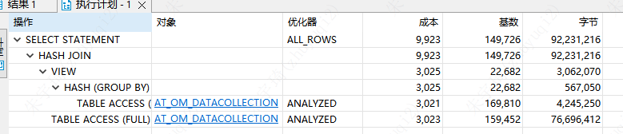

**方式二：内连接**

```sql
SELECT
	*
FROM
	AT_OM_DATACOLLECTION aod1
INNER JOIN (
		SELECT
			MAX(CREATION_TIME) ss,
			UP_STEELWIRE_NUMBER_S
		FROM
			AT_OM_DATACOLLECTION aod
		GROUP BY
			UP_STEELWIRE_NUMBER_S
	) aod2 ON
	aod1.CREATION_TIME = aod2.ss
```

执行计划：

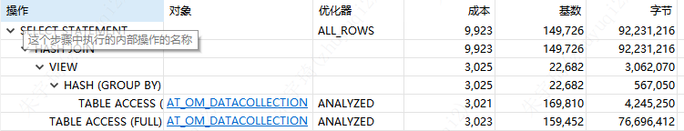

两种方式比较：本案例中，内连接稍优。实际业务中，也建议使用内连接。

### sum求和和加法

- 整数 + null 会得到null
- sum(字段)，字段中存在的null值会处理为0。

### 查询结果显示两字段值是否相等

使用`decode`函数：

```sql
decode(100,101,'相等','不相等') 
```

使用示例：

```sql
select t.a,t.b,decode(t.a,t.b,'相等','不相等') 
from t
```

## 数据类型

### 字符类型

- char：定长字符类型（未达到指定长度时，自动在末尾用空格补全）；默认值为1；最大2000字节；非unicode。
- nchar：定长字符类型（未达到指定长度时，自动在末尾用空格补全）；默认值为1；最大1000字节；根据unicode，所有字符都占两个字节。
- varchar2：变长字符类型（未达到指定长度时，不自动补全空格）；定义时需指定长度；最大为4000字节；非unicode。
- nvarchar2：变长字符类型（未达到指定长度时，不自动补全空格）；定义时需指定长度；最大为2000字节；根据unicode，所有字符都占两个字节。

*unicode字符集是为了解决字符集不兼容的问题而产生的，所有字符都用两个字节表示，即英文字符也用两个字节表示。*

## 官方工具

### Oracle Install Client

官方工具有（[Instant Client for Microsoft Windows (x64) 64-bit (oracle.com)](https://www.oracle.com/database/technologies/instant-client/winx64-64-downloads.html)）：

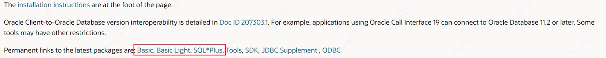

区别如下：

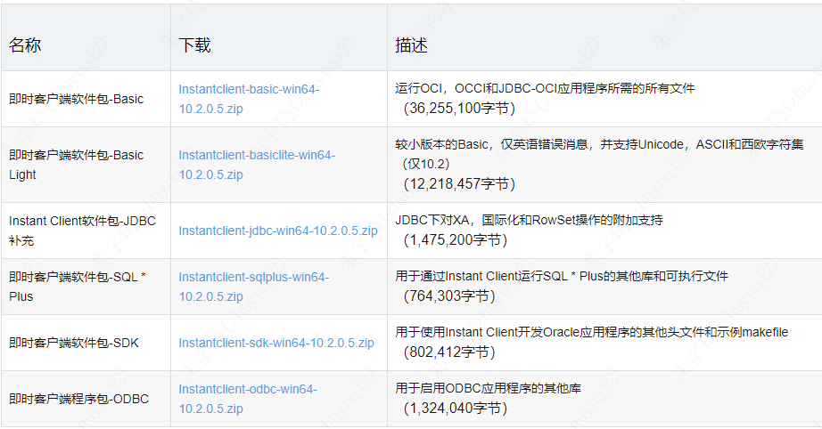

安装使用pl/sql一般使用basic。

#### SQL PLUS

自带的sql命令行执行窗口。

### Oracle SQL Developer


- 官方使用文档：[Oracle SQL Developer 入门](https://www.oracle.com/ocom/groups/public/@otn/documents/webcontent/229078_zhs.htm)
- 下载地址：[Oracle SQL Developer Downloads](https://www.oracle.com/database/sqldeveloper/technologies/download/)

保存数据连接密码：

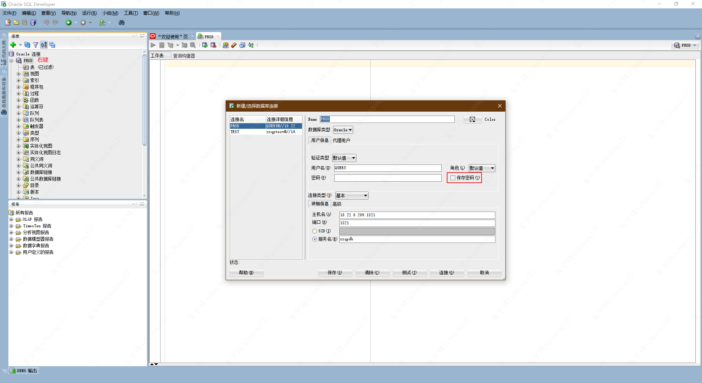

#### 对比PL/SQL

[【ORACLE】SQL Developer 与 PL/SQL Developer与SQL PLUS - 花未名 - 博客园 (cnblogs.com)](https://www.cnblogs.com/huaweiming/p/9316414.html)

plsql安装过程如下：

1. 使用plsql需要先安装oracle客户端，即Oracle install client，同时，plsql与oracle client的版本（32/64）要一致。。

   - 下载地址：[Oracle Instant Client Downloads](https://www.oracle.com/database/technologies/instant-client/downloads.html)
   - 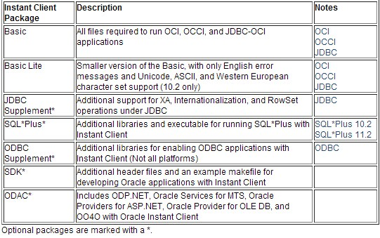
   - 

2. 选择激活安装：

   - 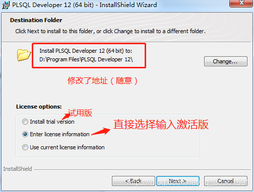
   - 激活码：


```bash
 product code : ke4tv8t5jtxz493kl8s2nn3t6xgngcmgf3
 serial Number: 264452
 password: xs374ca
```

3. 首次登录报错解决：

   - 首次登录及报错：

     - 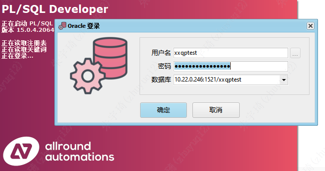
     - 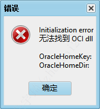

   - 解决步骤：

     - 登录界面选择取消。
     - 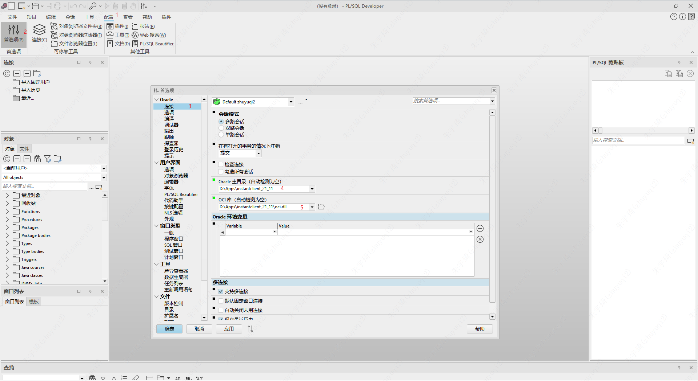
     - 重启plsql。


4. 保存登录密码：

   - 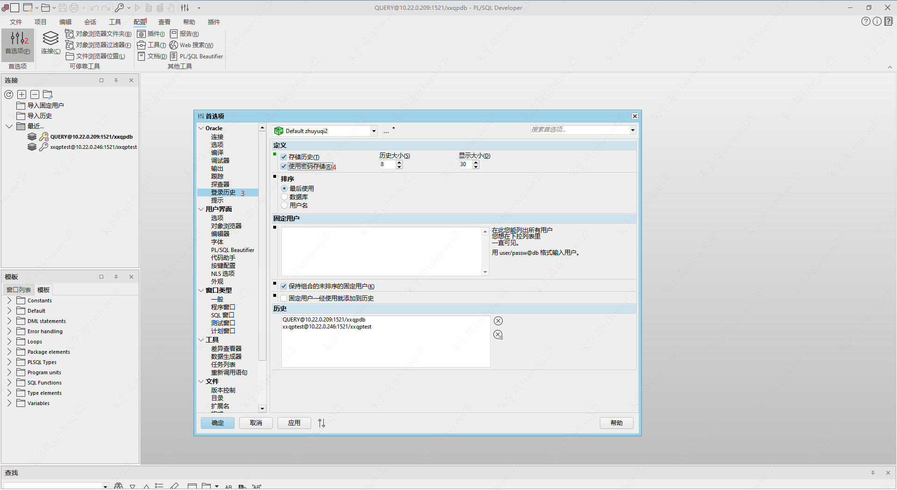


## SQL Developer Data Modeler

数据建模软件。

- 下载地址：[SQL Developer Data Modeler Downloads (oracle.com)](https://www.oracle.com/database/sqldeveloper/technologies/sql-data-modeler/download/#sqldev-install-windows)
- 官方文档：[List of Figures (oracle.com)](https://docs.oracle.com/en/database/oracle/sql-developer-data-modeler/23.1/dmdug/lof.html#List-of-Figures)

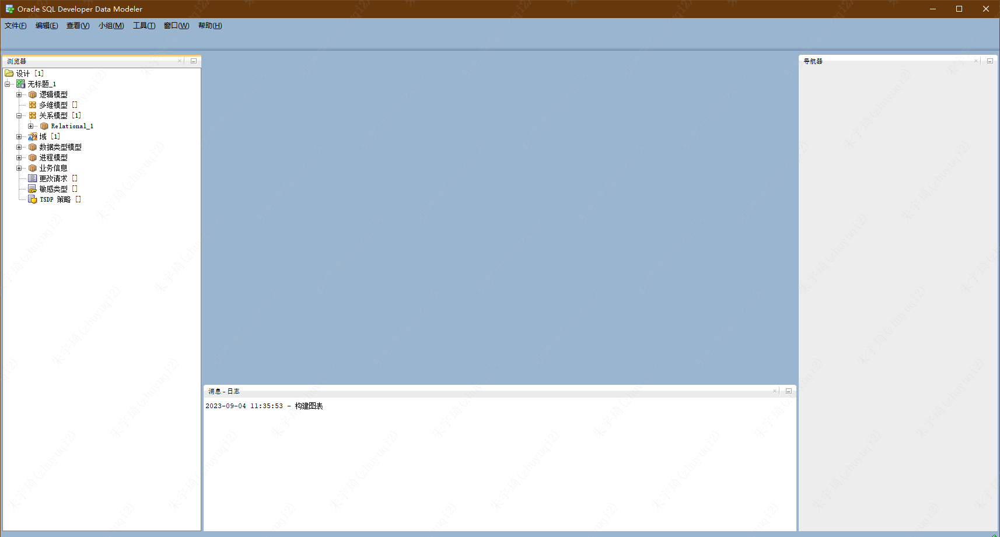

### Live SQL

oracle官方sql训练工具。

地址：[Oracle Live SQL](https://livesql.oracle.com/apex/f?p=590:1000)