*Redis（Remote Dictionary Server )，即远程字典服务，是一个开源的使用ANSI C语言编写、支持网络、可基于内存亦可持久化的日志型、Key-Value数据库，并提供多种语言的API。*

[尚硅谷\_Redis6 课件.docx](https://www.yuque.com/attachments/yuque/0/2022/docx/1604140/1660638593883-8d8d1335-7e87-4500-a518-77c7647c7dc6.docx)

> - 在这个虚拟机中
> - 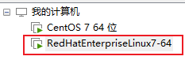

## 第 1 章 数据库

### 1.1 技术发展

1、解决功能性的问题：Java、Jsp、RDBMS、Tomcat、HTML、Linux、JDBC、SVN
2、解决扩展性的问题：Struts、Spring、SpringMVC、Hibernate、Mybatis
3、解决性能的问题：NoSQL、Java 线程、Hadoop、Nginx、MQ、ElasticSearch
    - NoSQL：解决 cpu 及内存压力、解决 IO 压力

### 1.2 **NoSQL 数据库**

#### 1.2.1 概述

1. 概念：NoSQL(NoSQL = Not Only SQL )，意即“不仅仅是 SQL”，泛指非关系型的数据库。
2. 存储方式：NoSQL 不依赖业务逻辑方式存储，而以简单的 key-value 模式存储。因此大大的增加了数据库的扩展能力。
3. 特点：
   - 不遵循 SQL 标准。
   - 不支持 ACID。
   - 远超于 SQL 的性能。
4. 适用场景：
   - 对数据高并发的读写
   - 海量数据的读写
   - 对数据高可扩展性
5. 不适用场景：
   - 需要事务支持
   - 基于 sql 的结构化查询存储，处理复杂的关系,需要即席查询——自定义查询。

#### 1.2.2 各类 NoSQL 数据库对比

1. Memcache：
   - 很早出现的 NoSql 数据库
   - 数据都在内存中，一般不持久化
   - 支持简单的 key-value 模式，支持类型单一
   - 一般是作为缓存数据库辅助持久化的数据库
2. Redis：
   - 几乎覆盖了 Memcached 的绝大部分功能
   - 数据都在内存中，支持持久化，主要用作备份恢复
   - 除了支持简单的 key-value 模式，还支持多种数据结构的存储，比如 list、set、hash、zset 等。
   - 一般是作为缓存数据库辅助持久化的数据库
3. MongoDB：
   - 高性能、开源、模式自由(schema free)的**文档型数据库**
   - 数据都在内存中， 如果内存不足，把不常用的数据保存到硬盘
   - 虽然是 key-value 模式，但是对 value（尤其是**json**）提供了丰富的查询功能
   - 支持二进制数据及大型对象
   - 可以根据数据的特点**替代 RDBMS**，成为独立的数据库。或者配合 RDBMS，存储特定的数据。

### 1.3 行式数据库

### 1.4 列式数据库

#### 1.4.1 HBase

HBase 是 Hadoop 项目中的数据库。它用于需要对大量的数据进行随机、实时的读写操作的场景中。
HBase 的目标就是处理数据量非常庞大的表，可以用普通的计算机处理超过 10 亿行数据，还可处理有数百万列元素的数据表。

#### 1.4.2 **Cassandra[kəˈsændrə]**

Apache Cassandra 是一款免费的开源 NoSQL 数据库，其设计目的在于管理由大量商用服务器构建起来的庞大集群上的海量数据集(数据量通常达到 PB 级别)。
在众多显著特性当中，Cassandra 最为卓越的长处是对写入及读取操作进行规模调整，而且其不强调主集群的设计思路能够以相对直观的方式简化各集群的创建与扩展流程。

### 1.5 图关系数据库

#### 1.5.1 Neo4j

## 第 2 章 Redis 数据库

### 2.1 Redis 数据库概述

1. Redis 是一个开源的 key-value 存储系统。
2. 和 Memcached 类似，它支持存储的 value 类型相对更多，包括 string(字符串)、list(链表)、set(集合)、zset(sorted set --有序集合)和 hash（哈希类型）。
3. 这些数据类型都支持 push/pop、add/remove 及取交集并集和差集及更丰富的操作，而且这些操作都是原子性的。
4. 在此基础上，Redis 支持各种不同方式的排序。
5. 与 memcached 一样，为了保证效率，数据都是缓存在内存中。
6. 区别的是 Redis 会周期性的把更新的数据写入磁盘或者把修改操作写入追加的记录文件。
7. 并且在此基础上实现了 master-slave(主从)同步。

### 2.2 应用场景

#### 2.2.1 配合关系型数据库做高速缓存

1. 高频次，热门访问的数据，降低数据库 IO
2. 分布式架构，做 session 共享

#### 2.2.2 持久化数据（多样化）


### 2.3 Redis 安装

#### 2.3.1 安装 C 语言环境（gcc 编译器）

yum install centos-release-scl scl-utils-build
yum install -y devtoolset-8-toolchain
scl enable devtoolset-8 bash
gcc --version

#### 2.3.2 解压 redis 并安装

tar -zxvf redis-6.2.1.tar.gz
cd redis-6.2.1
编译：make
安装：make install
默认安装至：`/usr/local/bin`目录下：

- redis-benchmark：性能测试工具，可以在自己本子运行，看看自己本子性能如何
- redis-check-aof：修复有问题的 AOF 文件，rdb 和 aof 后面讲
- redis-check-dump：修复有问题的 dump.rdb 文件
- redis-sentinel：Redis 集群使用
- redis-server：Redis 服务器启动命令
- redis-cli：客户端，操作入口

### 2.4 启动 Redis 服务

#### 2.4.1 前台启动

在任意目录下执行`redis-server`，此时窗口不能关闭

#### 2.4.2 后台启动

进入 redis 解压后的目录
将目录中的 redis-conf 文件拷贝至其他位置，如 etc 目录`cp redis.conf /etc/redis.conf`【也可以不复制，直接改】
修改/etc/redis.conf(128 行)文件将里面的 daemonize no 改成 yes，让服务在后台启动
进入`/usr/local/bin`目录下，执行`redis-server /etc/redis.conf`命令，表示按指定的配置文件启动：

- 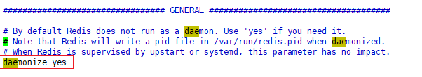

查看 redis 进程：`ps -ef | grep redis`，此时还未启动

- 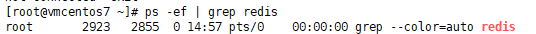

#### 2.4.3 进入 redis 操作

在任意目录下执行`redis-server /etc/redis.conf`，并使用`ps -ef | grep redis`查看进程：

- 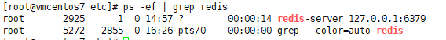
- 127.0.0.1:6379 表示只允许本地连接

在任意目录下执行`redis-cli`即可完成连接

### 2.5 关闭 redis

#### 2.5.1 方式一

1. 查看 redis 进程：`ps -ef | grep redis`
   - 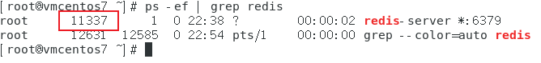
2. 杀死进程：`kill -9 11337`

#### 2.5.2 方式二

未进入实例时：`redis-cli shutdown`
进入实例时：`shutdown`或者`exit`（不会停止服务）

### 2.6 Redis 相关知识

端口号 6379 是 merz 的 9 键输入
redis 默认默认 16 个数据库，类似数组下标从 0 开始，初始默认使用 0 号库
使用命令 select <dbid>来切换数据库。如: select 8
所有库同样密码。
dbsize 查看当前数据库的 key 的数量
flushdb 清空当前库
flushall 通杀全部库
Redis 是单线程+多路 IO 复用技术
多路复用是指使用一个线程来检查多个文件描述符（Socket）的就绪状态，比如调用 select 和 poll 函数，传入多个文件描述符，如果有一个文件描述符就绪，则返回，否则阻塞直到超时。得到就绪状态后进行真正的操作可以在同一个线程里执行，也可以启动线程执行（比如使用线程池）
串行 vs 多线程+锁（memcached） vs 单线程+多路 IO 复用(Redis)
（与 Memcache 三点不同: 支持多数据类型，支持持久化，单线程+多路 IO 复用）

## 第 3 章 常用五大数据类型

### 3.0 Redis 常见数据类型操作命令

- `keys *` 查看当前库所有 key (匹配：keys \*1)
- `exists key` 判断某个 key 是否存在
- `type key` 查看你的 key 是什么类型
- `del key ` 删除指定的 key 数据
- `unlink key` 根据 value 选择非阻塞删除
  - 仅将 keys 从 keyspace 元数据中删除，真正的删除会在后续异步操作。
- `expire key 10 ` 10 秒钟：为给定的 key 设置过期时间
- `ttl key` 查看还有多少秒过期，-1 表示永不过期，-2 表示已过期
- `select n` 命令切换数据库
- `dbsize` 查看当前数据库的 key 的数量
- `flushdb` 清空当前库
- `flushall` 通杀全部库

### 3.2 String 字符串

#### 3.2.1 简介

String 是 Redis 最基本的类型，一个 key 对应一个 value。
String 类型是二进制安全的。意味着 Redis 的 string 可以包含任何数据。比如 jpg 图片或者序列化的对象。
String 类型是 Redis 最基本的数据类型，一个 Redis 中字符串 value 最多可以是 512M。

#### 3.2.2 常用命令

- `set <key><value>` 添加键值对
  - 给已有 key 设置 value 会发生数据覆盖
- `setnx <key><value>` 只有在 key 不存在时，设置 key 的值
  - \*NX：当数据库中 key 不存在时，可以将 key-value 添加数据库
  - \*XX：当数据库中 key 存在时，可以将 key-value 添加数据库，与 NX 参数互斥
  - \*EX：key 的超时秒数
  - \*PX：key 的超时毫秒数，与 EX 互斥
- `get <key>` 查询对应键的值
- `append <key><value>` 将给定的<value> 追加到原值的末尾
- `strlen <key>` 获得值的长度
- `incr <key>` 将 key 中储存的数字值增 1，只能对数字值操作，如果为空，新增值为 1。
- `decr <key>` 将 key 中储存的数字值减 1，只能对数字值操作，如果为空，新增值为-1
- `incrby/decrby <key><步长>`将 key 中储存的数字值按步长增减。
- `mset <key1><value1><key2><value2>` 同时设置一个或多 key-value 对
- `mget  <key1><key2><key3>`同时获取一个或多个 value
- `msetnx <key1><value1><key2><value2>` 同时设置一个或多个 key-value 对，当且仅当所有给定 key 都不存在时成功。
  - 原子性：有一个失败则全部失败
- `etrange <key><起始位置><结束位置>`获得值的范围，前后均为闭区间
- `setrange <key><起始位置><value>`用 <value> 覆写<key>所储存的字符串值，从<起始位置>的下标插入
- `**setex <key><过期时间><value>**`设置键值的同时，设置过期时间，单位秒。
- `getset <key><value>`以新换旧，设置了新值同时返回旧值。

#### 3.2.3 原子操作

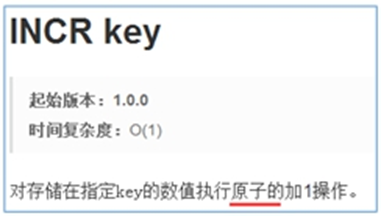
所谓**原子**操作是指不会被线程调度机制打断的操作，这种操作一旦开始，就一直运行到结束，中间不会有任何 context switch （切换到另一个线程）。
（1）在单线程中，能够在单条指令中完成的操作都可以认为是"原子操作"，因为中断只能发生于指令之间。
（2）在多线程中，不能被其它进程（线程）打断的操作就叫原子操作。
Redis 单命令的原子性主要得益于 Redis 的单线程。
**案例：**
java 中的 i++是否是原子操作？**不是**
redis 中 i=0;两个线程分别对 i 进行++100 次，最后的可能值是多少？** 2~200200**

#### 3.2.4 数据结构

String 的数据结构为简单动态字符串(Simple Dynamic String,缩写 SDS)。是可以修改的字符串，内部结构实现上类似于 Java 的 ArrayList，采用预分配冗余空间的方式来减少内存的频繁分配。

如图中所示，内部为当前字符串实际分配的空间 capacity 一般要高于实际字符串长度 len。当字符串长度小于 1M 时，扩容都是加倍现有的空间，如果超过 1M，扩容时一次只会多扩 1M 的空间。需要注意的是字符串最大长度为 512M。

### 3.3 列表 List

#### 3.3.1 简介

单键多值
Redis 列表是简单的字符串列表，按照插入顺序排序。你可以添加一个元素到列表的头部（左边）或者尾部（右边）。
它的底层实际是个双向链表，对两端的操作性能很高，通过索引下标的操作中间的节点性能会较差。


#### 3.3.2 常用命令

- `lpush/rpush <key><value1><value2><value3>`从左边/右边插入一个或多个值。
- `lpop/rpop <key>`从左边/右边吐出一个值。值在键在，值光键亡。
- `rpoplpush <key1><key2>`从<key1>列表右边吐出一个值，插到<key2>列表左边。
- `lrange <key><start><stop>`按照索引下标获得元素(从左到右)
  - `lrange <key> 0 -1` 0 左边第一个，-1 右边第一个，（0 -1 表示获取所有）
- `lindex <key><index>`按照索引下标获得元素(从左到右)
- `llen <key>`获得列表长度
- `linsert <key> before/after <value><newvalue>`在<value>的前/后面插入<newvalue>插入值
- `lrem <key><n><value>`从左边删除 n 个值为 value(从左到右)
- `lset <key><index><value>`将列表 key 下标为 index 的值替换成 value

#### 3.3.3 数据结构

List 的数据结构为快速链表 quickList：

- 首先在列表元素较少的情况下会使用一块连续的内存存储，这个结构是 ziplist，也即是压缩列表。它将所有的元素紧挨着一起存储，分配的是一块连续的内存。
- 当数据量比较多的时候才会改成 quicklist。

因为普通的链表需要的附加指针空间太大，会比较浪费空间。比如这个列表里存的只是 int 类型的数据，结构上还需要两个额外的指针 prev 和 next。

Redis 将链表和 ziplist 结合起来组成了 quicklist。也就是将多个 ziplist 使用双向指针串起来使用。这样既满足了快速的插入删除性能，又不会出现太大的空间冗余。

### 3.4 集合 set

#### 3.4.1 简介

Redis set 对外提供的功能与 list 类似是一个列表的功能，特殊之处在于 set 是可以**自动排重**的，当你需要存储一个列表数据，又不希望出现重复数据时，set 是一个很好的选择，并且 set 提供了判断某个成员是否在一个 set 集合内的重要接口，这个也是 list 所不能提供的。

#### 3.4.2 常用命令

- `sadd <key><value1><value2>` 将一个或多个 member 元素加入到集合 key 中，已经存在的 member 元素将被忽略
- `smembers <key>`取出该集合的所有值。
- `sismember <key><value>`判断集合<key>是否为含有该<value>值，有 1，没有 0
- `scard <key>`返回该集合的元素个数。
- `srem <key><value1><value2>` 删除集合中的某个元素。
- `spop <key>`**随机从该集合中吐出一个值，所有值取出则 key 也不存在。**
- `srandmember <key><n>`随机从该集合中取出 n 个值。不会从集合中删除。
- `smove <sourcekey><destinationkey><value>`把集合中一个值从一个集合移动到另一个集合
- `sinter <key1><key2>`返回两个集合的交集元素。
- `sunion <key1><key2>`返回两个集合的并集元素。
- `sdiff <key1><key2>`返回两个集合的**差集**元素(key1 中的特有的)

#### 3.4.3 数据结构

Set 数据结构是 dict 字典，字典是用哈希表实现的。
Java 中 HashSet 的内部实现使用的是 HashMap，只不过所有的 value 都指向同一个对象。Redis 的 set 结构也是一样，它的内部也使用 hash 结构，所有的 value 都指向同一个内部值。
Redis 的 Set 是 string 类型的无序集合。它底层其实是一个 value 为 null 的 hash 表，所以添加，删除，查找的**复杂度都是 O(1)**。

### 3.5 哈希 Hash

#### 3.5.1 简介

Redis hash 是一个键值对集合。
Redis hash 的 value 是一个 string 类型的 field 和 value 的映射表，hash 特别适合用于存储对象。类似 Java 里面的 Map<String,Object>。
用户 ID 为查找的 key，存储的 value 用户对象包含姓名，年龄，生日等信息，如果用普通的 key/value 结构来存储

#### 3.5.2 常用命令

- `hset <key><field><value>`给<key>集合中的 <field>键赋值<value>
- `hget <key1><field>从<key1>`集合<field>取出 value
- `hmset <key1><field1><value1><field2><value2>`批量设置 hash 的值
- `hexists<key1><field>`查看哈希表 key 中，给定域 field 是否存在。
- `hkeys <key>`列出该 hash 集合的所有 field
- `hvals <key>`列出该 hash 集合的所有 value
- `hincrby <key><field><increment>`为哈希表 key 中的域 field 的值加上增量 1
- `hsetnx <key><field><value>`将哈希表 key 中的域 field 的值设置为 value ，当且仅当域 field 不存在时能够加入

#### 3.5.3 数据结构

Hash 类型对应的数据结构是两种：ziplist（压缩列表），hashtable（哈希表）。当 field-value 长度较短且个数较少时，使用 ziplist，否则使用 hashtable。

### 3.6 有序集合 zset

#### 3.6.1 简介

Redis 有序集合 zset 与普通集合 set 非常相似，是一个没有重复元素的字符串集合。
不同之处是有序集合的每个成员都关联了一个**评分（score）**,这个评分（score）被用来按照从最低分到最高分的方式排序集合中的成员。集合的成员是唯一的，但是评分可以是重复了。
因为元素是有序的, 所以你也可以很快的根据评分（score）或者次序（position）来获取一个范围的元素。
访问有序集合的中间元素也是非常快的,因此你能够使用有序集合作为一个没有重复成员的智能列表。

#### 3.6.2 常用命令

- `zadd  <key><score1><value1><score2><value2>`将一个或多个 member 元素及其 score 值加入到有序集 key 当中。
- `**zrange <key><start><stop> [WITHSCORES]**`\*\* \*\*返回有序集 key 中，下标在<start><stop>之间的元素
  - 带 WITHSCORES，可以让分数一起和值返回到结果集。
- `zrangebyscore key minmax [withscores] [limit offset count]`返回有序集 key 中，所有 score 值介于 min 和 max 之间(包括等于 min 或 max )的成员。有序集成员按 score 值递增(从小到大)次序排列。
- `zrevrangebyscore key maxmin [withscores] [limit offset count]` 同上，改为从大到小排列。
- `zincrby <key><increment><value>` 为元素的 score 加上增量
- `zrem  <key><value>`删除该集合下指定值的元素
- `zcount <key><min><max>`统计该集合，分数区间内的元素个数
- `zrank <key><value>`返回该值在集合中的排名，从 0 开始。

#### 3.6.3 使用案例

实现一个文章访问量的排行榜。

#### 3.6.4 数据结构

SortedSet(zset)是 Redis 提供的一个非常特别的数据结构，一方面它等价于 Java 的数据结构 Map<String, Double>，可以给每一个元素 value 赋予一个权重 score，另一方面它又类似于 TreeSet，内部的元素会按照权重 score 进行排序，可以得到每个元素的名次，还可以通过 score 的范围来获取元素的列表。
zset 底层使用了两个数据结构
（1）hash，hash 的作用就是关联元素 value 和权重 score，保障元素 value 的唯一性，可以通过元素 value 找到相应的 score 值。
（2）跳跃表，跳跃表的目的在于给元素 value 排序，根据 score 的范围获取元素列表。

#### 3.6.5 跳跃表

1、简介
有序集合在生活中比较常见，例如根据成绩对学生排名，根据得分对玩家排名等。对于有序集合的底层实现，可以用数组、平衡树、链表等。数组不便元素的插入、删除；平衡树或红黑树虽然效率高但结构复杂；链表查询需要遍历所有效率低。Redis 采用的是跳跃表。跳跃表效率堪比红黑树，实现远比红黑树简单。
2、实例
对比有序链表和跳跃表，从链表中查询出 51
（1） 有序链表
要查找值为 51 的元素，需要从第一个元素开始依次查找、比较才能找到。共需要 6 次比较。

（2） 跳跃表
从第 2 层开始，1 节点比 51 节点小，向后比较。
21 节点比 51 节点小，继续向后比较，后面就是 NULL 了，所以从 21 节点向下到第 1 层
在第 1 层，41 节点比 51 节点小，继续向后，61 节点比 51 节点大，所以从 41 向下
在第 0 层，51 节点为要查找的节点，节点被找到，共查找 4 次。
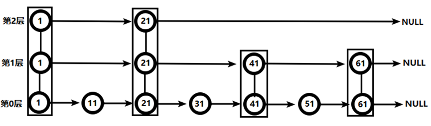
从此可以看出跳跃表比有序链表效率要高

### 3.7 **Bitmaps（特殊的字符串）**

#### 3.7.1 简介

现代计算机用二进制（位）作为信息的基础单位， 1 个字节等于 8 位，例如“abc”字符串是由 3 个字节组成，但实际在计算机存储时将其用二进制表示，“abc”分别对应的 ASCII 码分别是 97、98、99，对应的二进制分别是 01100001、 01100010 和 01100011，如下图：
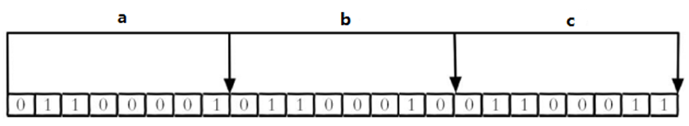
合理地使用操作位能够有效地提高内存使用率和开发效率。
Redis 提供了 Bitmaps 这个“数据类型”可以实现对位的操作：

- Bitmaps 本身不是一种数据类型，实际上它就是字符串（key-value），但是它可以对字符串的位进行操作。
- Bitmaps 单独提供了一套命令，所以在 Redis 中使用 Bitmaps 和使用字符串的方法不太相同。可以把 Bitmaps 想象成一个以位为单位的数组，数组的每个单元只能存储 0 和 1，**数组的下标在 Bitmaps 中叫做偏移量。**


#### 3.7.2 常用命令

1. `setbit`

（1）格式：`setbit<key><offset><value>`设置 Bitmaps 中某个偏移量的值
（2）实例
每个独立用户是否访问过网站存放在 Bitmaps 中，将访问的用户记做 1，没有访问的用户记做 0，用偏移量作为用户的 id。
设置键的第 offset 个位的值（从 0 算起），假设现在有 20 个用户，userid=1， 6， 11， 15， 19 的用户对网站进行了访问，那么当前 Bitmaps 初始化结果如图
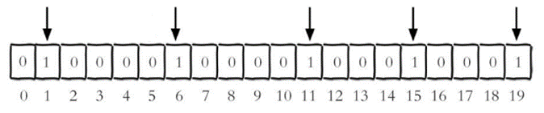
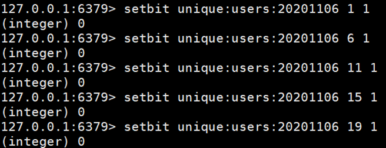
注：

- 很多应用的用户 id 以一个指定数字（例如 10000）开头，直接将用户 id 和 Bitmaps 的偏移量对应势必会造成一定的浪费，通常的做法是每次做 setbit 操作时将用户 id 减去这个指定数字。
- 在第一次初始化 Bitmaps 时，假如偏移量非常大，那么整个初始化过程执行会比较慢，可能会造成 Redis 的阻塞。

2. getbit

（1）格式：`getbit<key><offset>`获取 Bitmaps 中某个偏移量的 value 值。即获取键的第 offset 位的值（从 0 开始算）
（2）实例
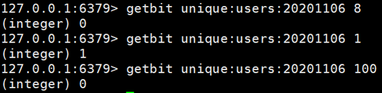
获取 id=8 的用户是否在 2020-11-06 这天访问过，返回 0 说明没有访问过：
注：因为 100 根本不存在，所以也是返回 0

3. bitcount

统计**字符串**被设置为 1 的 bit 数。一般情况下，给定的整个字符串都会被进行计数，通过指定额外的 start 或 end 参数，可以让计数只在特定的位上进行。start 和 end 参数的设置，都可以使用负数值：比如 -1 表示最后一个位，而 -2 表示倒数第二个位，start、end 是指 bit 组的字节的下标数，二者皆包含。
（1）格式：`bitcount<key>[start end]`统计字符串从 start 字节到 end 字节比特值为 1 的数量
举例： K1 【01000001 01000000 00000000 00100001】，对应【0，1，2，3】

- `bitcount K1 1 2`：统计下标 1、2 字节组中 bit=1 的个数，即 01000000 00000000--》bitcount K1 1 2 --》1
- `bitcount K1 1 3`：统计下标 1、2 字节组中 bit=1 的个数，即 01000000 00000000 00100001--》bitcount K1 1 3--》3
- `bitcount K1 0 -2`：统计下标 0 到下标倒数第 2，字节组中 bit=1 的个数，即 01000001 01000000 00000000--》bitcount K1 0 -2--》3

（2）实例
计算 2022-11-06 这天的独立访问用户数量
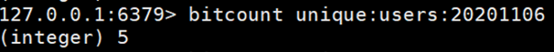
start 和 end 代表起始和结束字节数，下面操作计算用户 id 在第 1 个字节到第 3 个字节之间的独立访问用户数，对应的用户 id 是 11， 15， 19。
注意：redis 的 setbit 设置或清除的是 bit 位置，而 bitcount 计算的是 byte 位置。
4、bitop
(1)格式：`bitop and(or/not/xor) <destkey> [key…]`：bitop 是一个复合操作，它可以做多个 Bitmaps 的 and（交集）、or（并集）、not（非）、xor（异或）操作并将结果保存在 destkey 中。
(2)实例
**2020-11-04 日访问网站的 userid=1,2,5,9。**
`_setbit unique:users:20201104 1 1_`
`_setbit unique:users:20201104 2 1_`
`_setbit unique:users:20201104 5 1_`
`_setbit unique:users:20201104 9 1_`

**2020-11-03 日访问网站的 userid=0,1,4,9。**
`_setbit unique:users:20201103 0 1_`
`_setbit unique:users:20201103 1 1_`
`_setbit unique:users:20201103 4 1_`
`_setbit unique:users:20201103 9 1_`

**计算出两天都访问过网站的用户数量**
`_bitop and unique:users:and:20201104_03 unique:users:20201103 unique:users:20201104_`
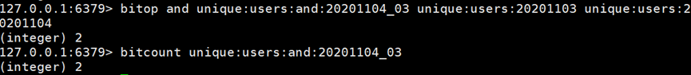
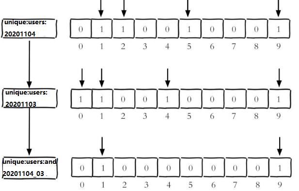
计算出任意一天都访问过网站的用户数量（例如月活跃就是类似这种），可以使用 or 求并集

#### 3.7.3 Bitmaps 与 set 对比

假设网站有 1 亿用户，每天独立访问的用户有 5 千万，如果每天用集合类型和 Bitmaps 分别存储活跃用户可以得到表

很明显，这种情况下使用 Bitmaps 能节省很多的内存空间，尤其是随着时间推移节省的内存还是非常可观的

但 Bitmaps 并不是万金油，假如该网站每天的独立访问用户很少，例如只有 10 万（大量的僵尸用户），那么两者的对比如下表所示，很显然，这时候使用 Bitmaps 就不太合适了，因为基本上大部分位都是 0。


### 3.8 **HyperLogLog**

#### 3.8.1 简介

在工作当中，我们经常会遇到与统计相关的功能需求，比如统计网站 PV（PageView 页面访问量）,可以使用 Redis 的 incr、incrby 轻松实现。
但像 UV（UniqueVisitor，独立访客）、独立 IP 数、搜索记录数等需要去重和计数的问题如何解决？这种求集合中不重复元素个数的问题称为基数问题。

- 基数：比如数据集 {1, 3, 5, 7, 5, 7, 8}，那么这个数据集的基数集为 {1, 3, 5 ,7, 8}, 基数(不重复元素)为 5。基数估计就是在误差可接受的范围内，快速计算基数。

解决基数问题有很多种方案：
（1）数据存储在 MySQL 表中，使用 distinct count 计算不重复个数
（2）使用 Redis 提供的 hash、set、bitmaps 等数据结构来处理
以上的方案结果精确，但随着数据不断增加，导致占用空间越来越大，对于非常大的数据集是不切实际的。
能否能够降低一定的精度来平衡存储空间？Redis 推出了 HyperLogLog
Redis HyperLogLog 是用来做基数统计的算法，HyperLogLog 的优点是，在输入元素的数量或者体积非常非常大时，计算基数所需的空间总是固定的、并且是很小的。
在 Redis 里面，每个 HyperLogLog 键只需要花费 12 KB 内存，就可以计算接近 2^64 个不同元素的基数。这和计算基数时，元素越多耗费内存就越多的集合形成鲜明对比。
但是，因为 HyperLogLog 只会根据输入元素来计算基数，而不会储存输入元素本身，所以 HyperLogLog 不能像集合那样，返回输入的各个元素。

#### 3.8.2 常用命令

1、pfadd
（1）格式：`pfadd <key>< element> [element ...]` 添加指定元素到 HyperLogLog 中
（2）实例
将所有元素添加到指定 HyperLogLog 数据结构中。如果执行命令后 HLL 估计的近似基数发生变化，则返回 1，否则返回 0。
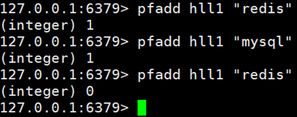
2、pfcount
（1）格式：`pfcount<key> [key ...]` 计算 HLL 的近似基数，可以计算多个 HLL，比如用 HLL 存储每天的 UV，计算一周的 UV 可以使用 7 天的 UV 合并计算即可
（2）实例
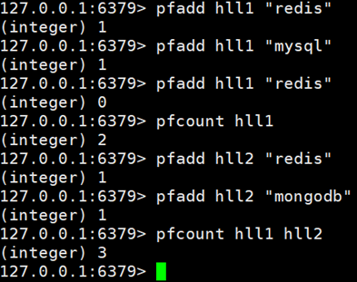
3、pfmerge
（1）格式：`pfmerge<destkey><sourcekey> [sourcekey ...]` 将一个或多个 HLL 合并后的结果存储在另一个 HLL 中，比如每月活跃用户可以使用每天的活跃用户来合并计算可得
（2）实例
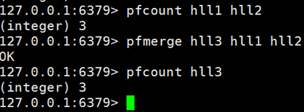

### 3.9 Geospatial

#### 3.9.1 简介

Redis 3.2 中增加了对 GEO 类型的支持。GEO，Geographic，地理信息的缩写。该类型，就是元素的 2 维坐标，在地图上就是经纬度。redis 基于该类型，提供了经纬度设置，查询，范围查询，距离查询，经纬度 Hash 等常见操作。

#### 3.6.2 常用命令

1、geoadd
（1）格式：`geoadd<key>< longitude><latitude><member> [longitude latitude member...]` 添加地理位置（经度，纬度，名称）
（2）实例：

- `geoadd china:city 121.47 31.23 shanghai`
- `geoadd china:city 106.50 29.53 chongqing 114.05 22.52 shenzhen 116.38 39.90 beijing`
- 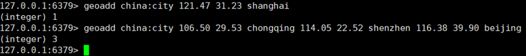

两极无法直接添加，一般会下载城市数据，直接通过 Java 程序一次性导入。
有效的经度从 -180 度到 180 度。有效的纬度从 -85.05112878 度到 85.05112878 度。
当坐标位置超出指定范围时，该命令将会返回一个错误。
已经添加的数据，是无法再次往里面添加的。
2、geopos  
（1）格式：`geopos  <key><member> [member...]` 获得指定地区的坐标值
（2）实例

3、geodist
（1）格式：`geodist<key><member1><member2>  [m|km|ft|mi ]` 获取两个位置之间的直线距离
（2）实例
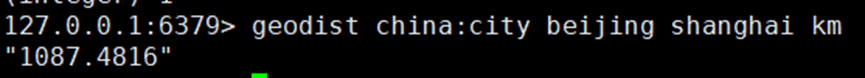
单位：
m 表示单位为米[默认值]。
km 表示单位为千米。
mi 表示单位为英里。
ft 表示单位为英尺。
如果用户没有显式地指定单位参数，那么 GEODIST 默认使用米作为单位
4、georadius
（1）格式：`georadius<key>< longitude><latitude>radius  m|km|ft|mi ` 以给定的经纬度为中心，找出某一半径内的元素经度纬度距离单位
（2）实例
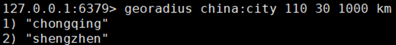

## 第 4 章 配置文件

### 4.1 Units 单位

配置大小单位,开头定义了一些基本的度量单位，只支持 bytes，不支持 bit。大小写不敏感。
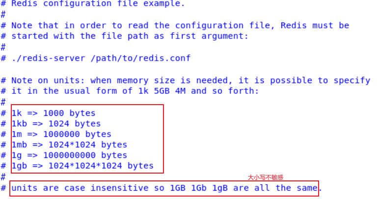

### 4.2 INCLUDES 包含

类似 jsp 中的 include，多实例的情况可以把公用的配置文件提取出来。
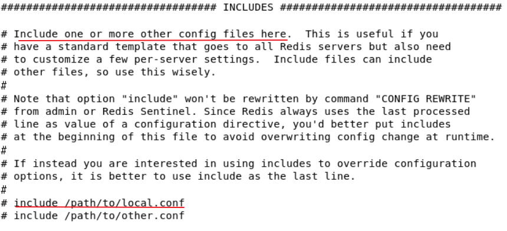

### 4.3 NETWORK 网络

#### 4.3.1 bind

默认情况 bind=127.0.0.1 只能接受本机的访问请求。
不写的情况下，无限制接受任何 ip 地址的访问。
生产环境肯定要写你应用服务器的地址；服务器是需要远程访问的，所以需要将其注释掉。
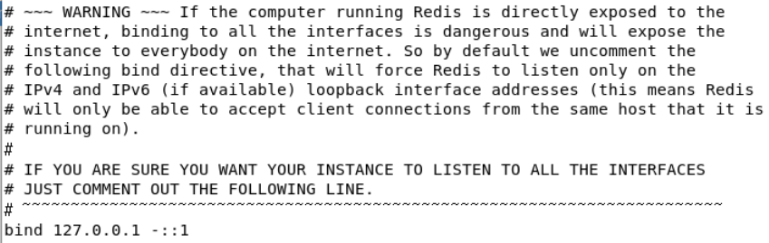

#### 4.3.2** protected-mode**

如果开启了 protected-mode，那么在没有设定 bind ip 且没有设密码的情况下，Redis 只允许接受本机的响应。需要设置为 no 满足学习要求。
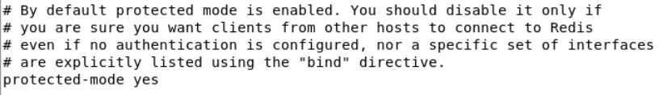
此时重启 redis，查看进程：

\*:6379 表示连接不受限制

#### 4.3.3 port

端口，默认 6379
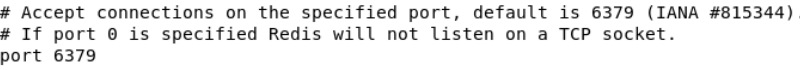

#### 4.3.4** tcp-backlog**

设置 tcp 的 backlog，backlog 其实是一个连接队列，backlog 队列总和=未完成三次握手队列+ 已经完成三次握手队列。
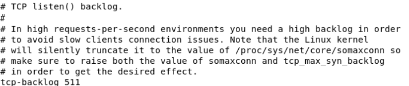
在高并发环境下你需要一个高 backlog 值来避免慢客户端连接问题。
注意 Linux 内核会将这个值减小到/proc/sys/net/core/somaxconn 的值（128），所以需要确认增大/proc/sys/net/core/somaxconn 和/proc/sys/net/ipv4/tcp_max_syn_backlog（128）两个值来达到想要的效果

#### 4.3.5 timeout

一个空闲的客户端维持多少秒会关闭，0 表示关闭该功能。即永不关闭。
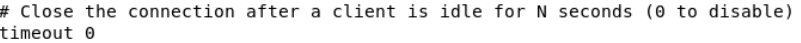

#### 4.3.6 tcp-keeplive

对访问客户端的一种心跳检测，每个 n 秒检测一次。
单位为秒，如果设置为 0，则不会进行 Keepalive 检测，建议设置成 60
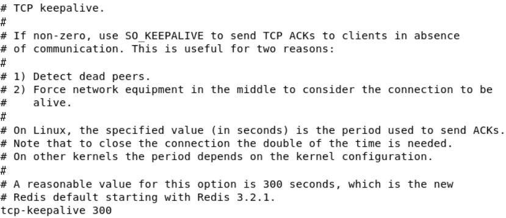

### 4.4 GENERAL 通用

#### 4.4.1 daemonize

是否为后台进程，设置为 yes。守护进程，后台启动。
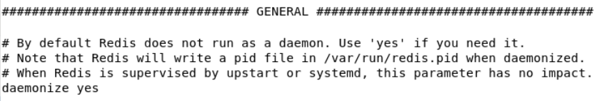

#### 4.4.2 pidfile

存放 pid 文件的位置，每个实例会产生一个不同的 pid 文件。保存每次操作 redis 的进程号。
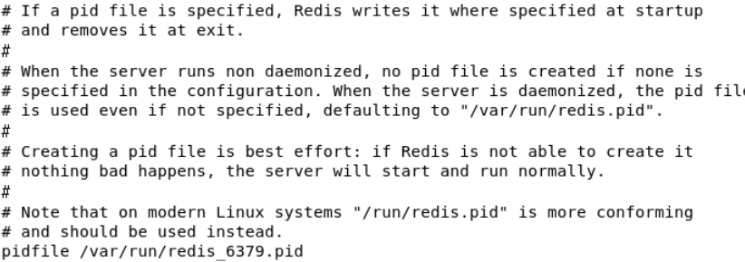

#### 4.4.3 loglevel

指定日志记录级别，Redis 总共支持四个级别：debug、verbose、notice、warning，默认为**notice。**
四个级别根据使用阶段来选择，生产环境选择 notice 或者 warning
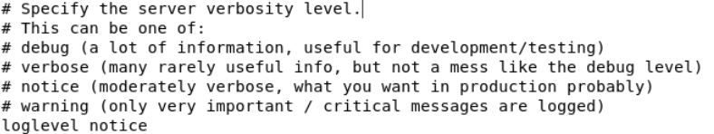

#### 4.4.4 logfile

日志文件名称
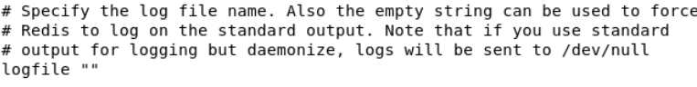

#### 4.4.5 **databases **

设定库的数量默认 16，默认数据库为 0，可以使用 SELECT <dbid>命令在连接上指定数据库 id
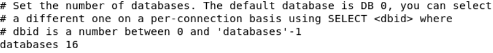

### 4.5 SECURITY

在命令中设置密码，只是临时的。重启 redis 服务器，密码就还原了。
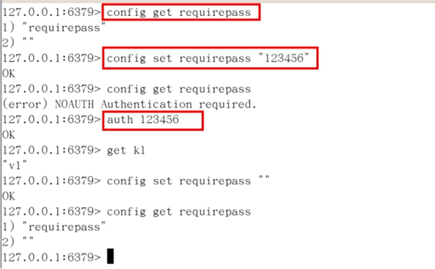
访问密码的查看、设置和取消。配置文件默认不需要密码。永久设置，需要再配置文件中进行设置。
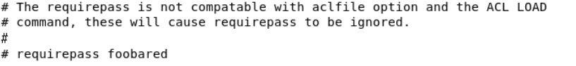

### 4.6 LIMITS 限制

#### 4.6.1 CLIENTS - **maxclients**

设置 redis 同时可以与多少个客户端进行连接。默认情况下为 10000 个客户端。如果达到了此限制，redis 则会拒绝新的连接请求，并且向这些连接请求方发出“max number of clients reached”以作回应。
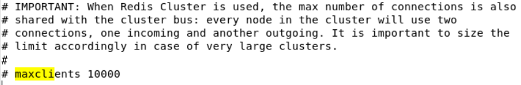

#### 4.6.2 MEMORY MANAGEMENT - **maxmemory **

建议**必须设置**，否则，将内存占满，造成服务器宕机
设置 redis 可以使用的内存量。一旦到达内存使用上限，redis 将会试图移除内部数据，移除规则可以通过 maxmemory-policy 来指定。
如果 redis 无法根据移除规则来移除内存中的数据，或者设置了“不允许移除”，那么 redis 则会针对那些需要申请内存的指令返回错误信息，比如 SET、LPUSH 等。
但是对于无内存申请的指令，仍然会正常响应，比如 GET 等。如果你的 redis 是主 redis（说明你的 redis 有从 redis），那么在设置内存使用上限时，需要在系统中留出一些内存空间给同步队列缓存，只有在你设置的是“不移除”的情况下，才不用考虑这个因素。
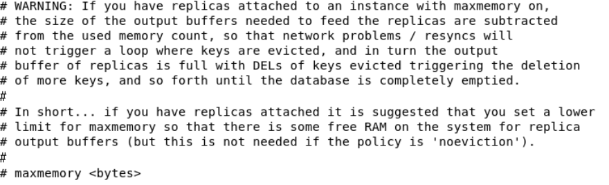

#### 4.6.3 MEMORY MANAGEMENT - **maxmemory-policy**

volatile-lru：使用 LRU 算法移除 key，只对设置了过期时间的键；（最近最少使用）
allkeys-lru：在所有集合 key 中，使用 LRU 算法移除 key
volatile-random：在过期集合中移除随机的 key，只对设置了过期时间的键
allkeys-random：在所有集合 key 中，移除随机的 key
volatile-ttl：移除那些 TTL 值最小的 key，即那些最近要过期的 key
noeviction：不进行移除。针对写操作，只是返回错误信息
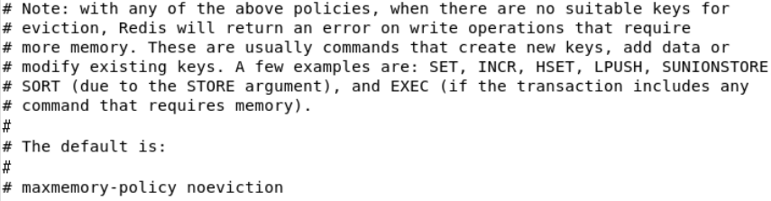

#### 4.6.4 MEMORY MANAGEMENT - **maxmemory-samples**

设置样本数量，LRU 算法和最小 TTL 算法都并非是精确的算法，而是估算值，所以你可以设置样本的大小，redis 默认会检查这么多个 key 并选择其中 LRU 的那个。
一般设置 3 到 7 的数字，数值越小样本越不准确，但性能消耗越小。
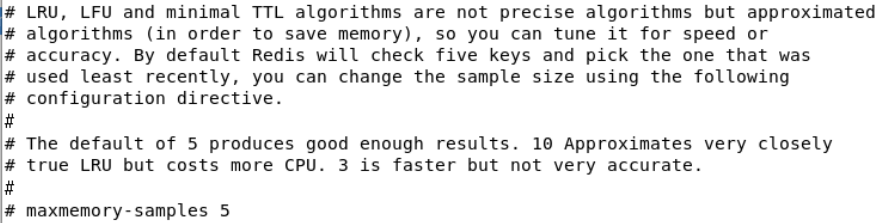

### 4.7 SNAPSHOTTING

#### 4.7.1 持久化 RDB 配置

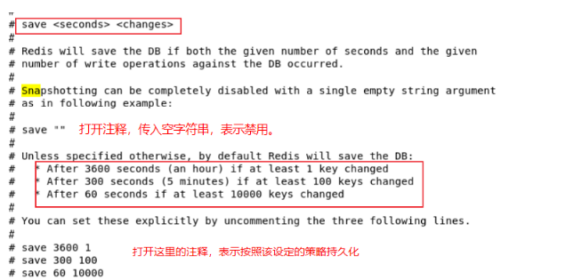
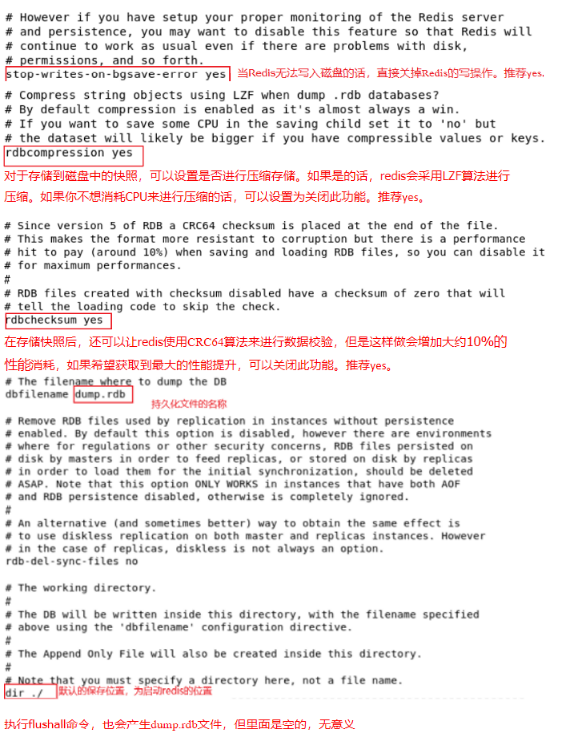

#### 4.7.2 AOF 配置

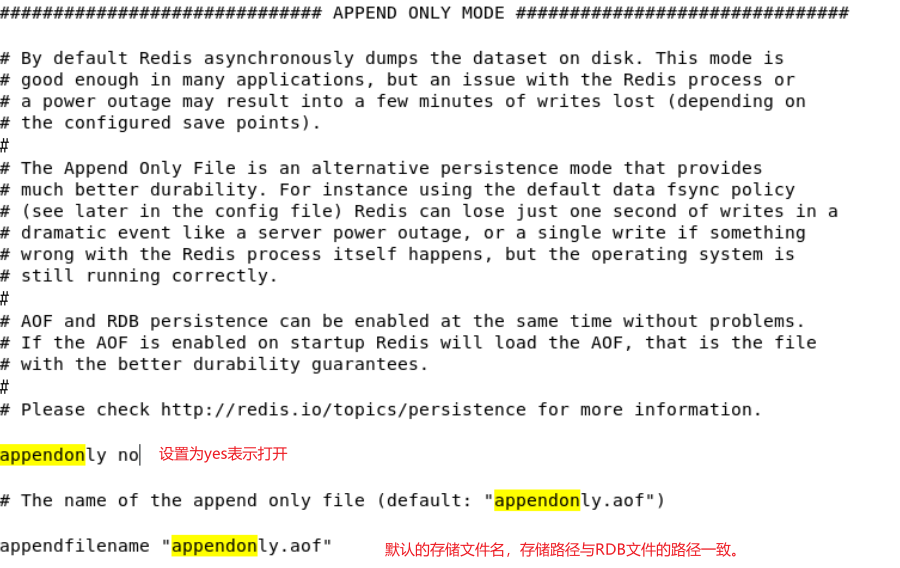
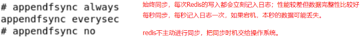
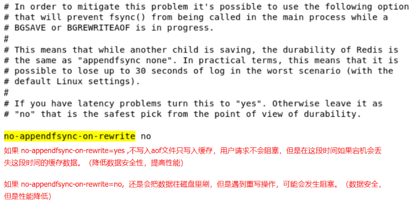
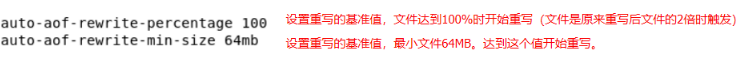

## 第 5 章 发布和订阅

### 5.1 发布和订阅概念

Redis 发布订阅 (pub/sub) 是一种消息通信模式：发送者 (pub) 发送消息，订阅者 (sub) 接收消息。
Redis 客户端可以订阅任意数量的频道。

### 5.2 图示

客户端可以订阅频道如下图：
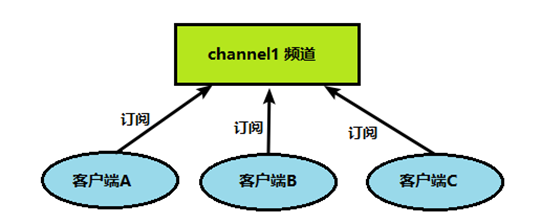
当给这个频道发布消息后，消息就会发送给订阅的客户端
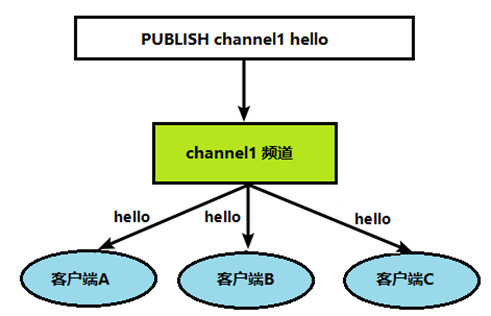

### 5.3 命令行实现

1、打开一个客户端订阅 channel1
`SUBSCRIBE channel1`
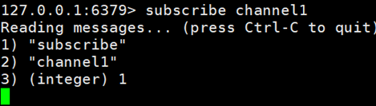
2、打开另一个客户端，给 channel1 发布消息 hello
`publish channel1 hello`
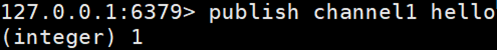
返回的 1 是订阅者数量
3、打开第一个客户端可以看到发送的消息
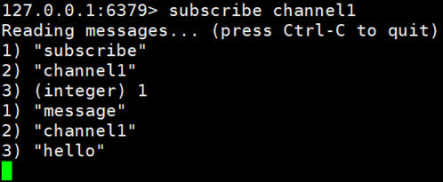
注：发布的消息没有持久化，如果在订阅的客户端收不到 hello，只能收到订阅后发布的消息

## 第 6 章 Jedis 工具

### 6.1 介绍

java 操作 redis 的客户端工具。
类似操作 mysql 的 jdbc

### 6.2 使用

#### 6.2.1 环境搭建

1. 引入依赖：
   - 
2. 创建测试类：
   - 
3. 执行测试：【注意 Redis 的配置文件设置需要满足 2 个条件】
   - 注释掉了本地访问地址 127.0.0.1
   - protected-mode 设置为 no
4. 连接 Linux 虚拟机中的 redis 如果出现连接超时，检查是否关闭防火墙
   - 查看防火墙状态：`systemctl status firewalld`
   - 关闭防火墙：`systemctl stop firewalld`

#### 6.2.2 API

#### 6.2.3 Jedis 连接池

```java
package iceriver.redis;

import redis.clients.jedis.Jedis;
import redis.clients.jedis.JedisPool;
import redis.clients.jedis.JedisPoolConfig;

public class JedisPoolUtil {
	private static volatile JedisPool jedisPool = null;

	private JedisPoolUtil() {
	}

	public static JedisPool getJedisPoolInstance() {
		if (null == jedisPool) {
			synchronized (JedisPoolUtil.class) {
				if (null == jedisPool) {
					JedisPoolConfig poolConfig = new JedisPoolConfig();
					poolConfig.setMaxTotal(200);
					poolConfig.setMaxIdle(32);
					poolConfig.setMaxWaitMillis(100*1000);
					poolConfig.setBlockWhenExhausted(true);
					poolConfig.setTestOnBorrow(true);  // ping  PONG

					jedisPool = new JedisPool(poolConfig, "192.168.150.133", 6379, 60000 );
				}
			}
		}
		return jedisPool;
	}

	public static void release(JedisPool jedisPool, Jedis jedis) {
		if (null != jedis) {
			jedisPool.returnResource(jedis);
		}
	}
}
```

节省每次连接 redis 服务带来的消耗，把连接好的实例反复利用。

- MaxTotal：控制一个 pool 可分配多少个 jedis 实例，通过 pool.getResource()来获取；如果赋值为-1，则表示不限制；如果 pool 已经分配了 MaxTotal 个 jedis 实例，则此时 pool 的状态为 exhausted。
- maxIdle：控制一个 pool 最多有多少个状态为 idle(空闲)的 jedis 实例；
- MaxWaitMillis：表示当 borrow 一个 jedis 实例时，最大的等待毫秒数，如果超过等待时间，则直接抛 JedisConnectionException；
- testOnBorrow：获得一个 jedis 实例的时候是否检查连接可用性（ping()）；如果为 true，则得到的 jedis 实例均是可用的；

### 6.3 手机验证码案例

要求：
1、输入手机号，点击发送后随机生成 6 位数字码，2 分钟有效
2、输入验证码，点击验证，返回成功或失败
3、每个手机号每天只能输入 3 次

```java
package iceriver.redis.jedis;

import redis.clients.jedis.Jedis;

import java.util.Random;

/**
 * TODO
 * 1、输入手机号，点击发送后随机生成6位数字码，2分钟有效
 * 2、输入验证码，点击验证，返回成功或失败
 * 3、每个手机号每天只能输入3次
 * @author zhuyuqi
 * @version v0.0.1
 * @className PhoneCode
 * @description https://developer.aliyun.com/profile/sagwrxp2ua66w
 * @date 2022/08/23 20:12
 */
public class PhoneCode {
    public static void main(String[] args) {
        //模拟发送验证码
        verifyCode("123456");
        //校验
//        getRedisCode("123456","061171");

    }

    /**
     * 每次生成1个[0, 9]的数，循环6次进行拼接
     * @return
     */
    public static String getCode(){
        Random random = new Random();
        String code = "";
        for (int i = 0; i < 6; i++) {
            int rand = random.nextInt(10);
            code += rand;
        }
        return code;
    }

    /**
     * 每个手机号每天只能发3次、每次的验证码放到redis中设置过期时间
     * @param phone
     */
    public static void verifyCode(String phone){
        Jedis jedis = new Jedis("192.168.150.132", 6379);
        String countKey = "VerifyCode" + phone + "count";//保存验证码使用次数
        String codeKey = "VerifyCode" + phone + "code";//保存验证码
        // 每个手机发送3次
        String count = jedis.get(countKey);
        if(count == null){
            jedis.setex(countKey, 24*60*60, "1");
        }else if(Integer.parseInt(count) < 3){
            jedis.incr(countKey);
        }else {
            System.out.println("今天的验证机会（3次）已经用完");
            jedis.close();
            return;
        }

        String vCode = getCode();
        jedis.setex(codeKey, 120, vCode);
        jedis.close();
    }

    /**
     * 验证码校验
     * @param phone
     * @param code
     */
    public static void getRedisCode(String phone, String code){
        Jedis jedis = new Jedis("192.168.150.132", 6379);
        // 手机发送次数的String设计，保证key的唯一性
        String codeKey = "VerifyCode" + phone + "code";
        String codeValue = jedis.get(codeKey);
        if(codeValue.equals(code)){
            System.out.println("成功");
        }else{
            System.out.println("失败");
        }
        jedis.close();
    }
}
```

## 第 7 章 Redis 整合 Springboot

1. 创建 springboot 项目
   - 
2. 引入 redis 依赖

```xml
<!-- redis -->
<dependency>
  <groupId>org.springframework.boot</groupId>
  <artifactId>spring-boot-starter-data-redis</artifactId>
</dependency>

<!-- spring2.X集成redis所需common-pool2-->
<dependency>
  <groupId>org.apache.commons</groupId>
  <artifactId>commons-pool2</artifactId>
  <version>2.6.0</version>
</dependency>
```

3. springboot 核心配置文件中添加 redis 配置信息

```xml

#Redis服务器地址
spring.redis.host=192.168.150.132
#Redis服务器连接端口
spring.redis.port=6379
#Redis数据库索引（默认为0）
spring.redis.database= 0
#连接超时时间（毫秒）
spring.redis.timeout=1800000
#连接池最大连接数（使用负值表示没有限制）
spring.redis.lettuce.pool.max-active=20
#最大阻塞等待时间(负数表示没限制)
spring.redis.lettuce.pool.max-wait=-1
#连接池中的最大空闲连接
spring.redis.lettuce.pool.max-idle=5
#连接池中的最小空闲连接
spring.redis.lettuce.pool.min-idle=0
```

4. 创建 redis 配置类

```java
public class RedisConfig extends CachingConfigurerSupport {
    @Bean
    public RedisTemplate<String, Object> redisTemplate(RedisConnectionFactory factory) {
        RedisTemplate<String, Object> template = new RedisTemplate<>();
        RedisSerializer<String> redisSerializer = new StringRedisSerializer();
        Jackson2JsonRedisSerializer jackson2JsonRedisSerializer = new Jackson2JsonRedisSerializer(Object.class);
        ObjectMapper om = new ObjectMapper();
        om.setVisibility(PropertyAccessor.ALL, JsonAutoDetect.Visibility.ANY);
        om.enableDefaultTyping(ObjectMapper.DefaultTyping.NON_FINAL);
        jackson2JsonRedisSerializer.setObjectMapper(om);
        template.setConnectionFactory(factory);
//key序列化方式
        template.setKeySerializer(redisSerializer);
//value序列化
        template.setValueSerializer(jackson2JsonRedisSerializer);
//value hashmap序列化
        template.setHashValueSerializer(jackson2JsonRedisSerializer);
        return template;
    }

    @Bean
    public CacheManager cacheManager(RedisConnectionFactory factory) {
        RedisSerializer<String> redisSerializer = new StringRedisSerializer();
        Jackson2JsonRedisSerializer jackson2JsonRedisSerializer = new Jackson2JsonRedisSerializer(Object.class);
//解决查询缓存转换异常的问题
        ObjectMapper om = new ObjectMapper();
        om.setVisibility(PropertyAccessor.ALL, JsonAutoDetect.Visibility.ANY);
        om.enableDefaultTyping(ObjectMapper.DefaultTyping.NON_FINAL);
        jackson2JsonRedisSerializer.setObjectMapper(om);
// 配置序列化（解决乱码的问题）,过期时间600秒
        RedisCacheConfiguration config = RedisCacheConfiguration.defaultCacheConfig()
                .entryTtl(Duration.ofSeconds(600))
                .serializeKeysWith(RedisSerializationContext.SerializationPair.fromSerializer(redisSerializer))
                .serializeValuesWith(RedisSerializationContext.SerializationPair.fromSerializer(jackson2JsonRedisSerializer))
                .disableCachingNullValues();
        RedisCacheManager cacheManager = RedisCacheManager.builder(factory)
                .cacheDefaults(config)
                .build();
        return cacheManager;
    }
}
```

## 第 8 章 事务操作

### 8.1 Redis 事务

#### 8.1.1 事务定义

Redis 事务是一个单独的隔离操作：事务中的所有命令都会序列化、按顺序地执行。事务在执行的过程中，不会被其他客户端发送来的命令请求所打断。
Redis 事务的主要作用就是串联多个命令防止别的命令插队。

#### 8.1.2 **Multi、Exec、discard**

从输入 Multi 命令开始，输入的命令都会依次进入命令队列中，但不会执行，直到输入 Exec 后，Redis 会将之前的命令队列中的命令依次执行。
组队的过程中可以通过 discard 来放弃组队。  


#### 8.1.3 事务错误处理

1. 组队情况下：组队中某个命令出现错误，执行时整个队列都会被取消。
   - 
2. 执行情况下：出错的命令不会被执行，其他的命令会被执行，不会回滚。
   - 

#### 8.1.4 乐观锁与悲观锁

乐观锁：每次去拿数据的时候都认为别人不会修改，所以不会上锁，但是在更新的时候会判断一下在此期间别人有没有去更新这个数据，可以使用版本号等机制。**乐观锁适用于多读的应用类型，这样可以提高吞吐量**。Redis 就是利用这种 check-and-set 机制实现事务的。
悲观锁：每次去拿数据的时候都认为别人会修改，所以每次在拿数据的时候都会上锁，这样别人想拿这个数据就会 block 直到它拿到锁。**传统的关系型数据库里边就用到了很多这种锁机制**，比如**行锁**，**表锁**等，**读锁**，**写锁**等，都是在做操作之前先上锁。

#### 8.1.5 WATCH KEY 和 UNWATCH

在执行 multi 之前，先执行 watch key1 [key2],可以监视一个(或多个) key ，如果在事务**执行之前这个(或这些) key 被其他命令所改动，那么事务将被打断。**
UNWATCH 取消 WATCH 命令对所有 key 的监视。
如果在执行 WATCH 命令之后，EXEC 命令或 DISCARD 命令先被执行了的话，那么就不需要再执行 UNWATCH 了。

#### 8.1.6 事务三特性

1. 单独的隔离操作
   - 事务中的所有命令都会序列化、按顺序地执行。事务在执行的过程中，不会被其他客户端发送来的命令请求所打断。
2. 没有隔离级别的概念
   - 队列中的命令没有提交之前都不会实际被执行，因为事务提交前任何指令都不会被实际执行
3. 不保证原子性
   - 事务中如果有一条命令执行失败，其后的命令仍然会被执行，没有回滚

### 8.2 秒杀案例

#### 8.2.1 解决计数器和人员记录的事务操作


秒杀成功：库存数量减少、秒杀成功的人员增加数量
库存使用 Sting 保存，用户使用 set 保存。

#### 8.2.2 思路


#### 8.2.3 代码实现

1. 极简版（存在超卖、连接超时问题）

```java
public class SecKill_redis {
	//秒杀过程
	public static boolean doSecKill(String uid,String prodid) throws IOException {
		//1 uid和prodid非空判断
		if(uid == null || prodid == null) {
			return false;
		}

		//2 连接redis
		Jedis jedis = new Jedis("192.168.150.133",6379);

		//3 拼接key
		// 3.1 库存key
		String kcKey = "sk:"+prodid+":qt";
		// 3.2 秒杀成功用户key
		String userKey = "sk:"+prodid+":user";

		//4 获取库存，如果库存null，秒杀还没有开始
		String kc = jedis.get(kcKey);
		if(kc == null) {
			System.out.println("秒杀还没有开始，请等待");
			jedis.close();
			return false;
		}

		// 5 判断用户是否重复秒杀操作
		if(jedis.sismember(userKey, uid)) {
			System.out.println("已经秒杀成功了，不能重复秒杀");
			jedis.close();
			return false;
		}

		//6 判断如果商品数量，库存数量小于1，秒杀结束
		if(Integer.parseInt(kc)<=0) {
			System.out.println("秒杀已经结束了");
			jedis.close();
			return false;
		}

		//7 秒杀过程
		//7.1 库存-1
		jedis.decr(kcKey);
		//7.2 把秒杀成功用户添加清单里面
		jedis.sadd(userKey,uid);
		System.out.println("秒杀成功了..");
		jedis.close();
		return true;
	}
}
```

2. 连接池版（解决连接超时问题）

```java
public class SecKill_redis {
	//秒杀过程
	public static boolean doSecKill(String uid,String prodid) throws IOException {
		//1 uid和prodid非空判断
		if(uid == null || prodid == null) {
			return false;
		}

		//2 连接redis
		JedisPool jedisPoolInstance = JedisPoolUtil.getJedisPoolInstance();
		Jedis jedis = jedisPoolInstance.getResource();

		//3 拼接key
		// 3.1 库存key
		String kcKey = "sk:"+prodid+":qt";
		// 3.2 秒杀成功用户key
		String userKey = "sk:"+prodid+":user";

		//4 获取库存，如果库存null，秒杀还没有开始
		String kc = jedis.get(kcKey);
		if(kc == null) {
			System.out.println("秒杀还没有开始，请等待");
			jedis.close();
			return false;
		}

		// 5 判断用户是否重复秒杀操作
		if(jedis.sismember(userKey, uid)) {
			System.out.println("已经秒杀成功了，不能重复秒杀");
			jedis.close();
			return false;
		}

		//6 判断如果商品数量，库存数量小于1，秒杀结束
		if(Integer.parseInt(kc)<=0) {
			System.out.println("秒杀已经结束了");
			jedis.close();
			return false;
		}

		//7 秒杀过程
		//7.1 库存-1
		jedis.decr(kcKey);
		//7.2 把秒杀成功用户添加清单里面
		jedis.sadd(userKey,uid);
		System.out.println("秒杀成功了..");
		jedis.close();
		return true;
	}
}
```

3. 事务版——乐观锁（解决超卖问题）
   - 在获取商品数量之前，就给商品加锁（watch)

```java
public class SecKill_redis {
	//秒杀过程
	public static boolean doSecKill(String uid,String prodid) throws IOException {
		//1 uid和prodid非空判断
		if(uid == null || prodid == null) {
			return false;
		}

		//2 连接redis
		JedisPool jedisPoolInstance = JedisPoolUtil.getJedisPoolInstance();
		Jedis jedis = jedisPoolInstance.getResource();

		//3 拼接key
		// 3.1 库存key
		String kcKey = "sk:"+prodid+":qt";
		// 3.2 秒杀成功用户key
		String userKey = "sk:"+prodid+":user";

		//7.1 监视库存
		jedis.watch(kcKey);
		//4 获取库存，如果库存null，秒杀还没有开始
		String kc = jedis.get(kcKey);
		if(kc == null) {
			System.out.println("秒杀还没有开始，请等待");
			jedis.close();
			return false;
		}

		// 5 判断用户是否重复秒杀操作
		if(jedis.sismember(userKey, uid)) {
			System.out.println("已经秒杀成功了，不能重复秒杀");
			jedis.close();
			return false;
		}

		//6 判断如果商品数量，库存数量小于1，秒杀结束
		if(Integer.parseInt(kc)<=0) {
			System.out.println("秒杀已经结束了");
			jedis.close();
			return false;
		}

		//7 秒杀过程
		//7.2 使用事务
		Transaction multi = jedis.multi();
		multi.decr(kcKey);//库存-1
		multi.sadd(userKey, uid);//添加到秒杀成功的用户清单
		List<Object> list = multi.exec();
		if(list == null || list.size() == 0){
			System.out.println("秒杀失败");
			jedis.close();
			return false;
		}
		System.out.println("秒杀成功了..");
		jedis.close();
		return true;
	}
}
```

4. 商品数量较多时，由于乐观锁会比较版本号，如果持有的版本号已经发生变化，即使还有商品，仍然不会去执行，会导致库存遗留。解决该问题可以使用悲观锁，但 Redis 不能直接使用悲观锁，需要借助 LUA 脚本语言。

```java
package iceriver.redis;

import java.io.IOException;
import java.util.HashSet;
import java.util.List;
import java.util.Set;

import org.apache.commons.pool2.impl.GenericObjectPoolConfig;
import org.slf4j.LoggerFactory;

import ch.qos.logback.core.joran.conditional.ElseAction;
import redis.clients.jedis.HostAndPort;
import redis.clients.jedis.Jedis;
import redis.clients.jedis.JedisCluster;
import redis.clients.jedis.JedisPool;
import redis.clients.jedis.JedisPoolConfig;
import redis.clients.jedis.ShardedJedisPool;
import redis.clients.jedis.Transaction;

public class SecKill_redisByScript {
    static String secKillScript ="local userid=KEYS[1];\r\n" +
    "local prodid=KEYS[2];\r\n" +
    "local qtkey='sk:'..prodid..\":qt\";\r\n" +
    "local usersKey='sk:'..prodid..\":usr\";\r\n" +
    "local userExists=redis.call(\"sismember\",usersKey,userid);\r\n" +
    "if tonumber(userExists)==1 then \r\n" +
    "   return 2;\r\n" +
    "end\r\n" +
    "local num= redis.call(\"get\" ,qtkey);\r\n" +
    "if tonumber(num)<=0 then \r\n" +
    "   return 0;\r\n" +
    "else \r\n" +
    "   redis.call(\"decr\",qtkey);\r\n" +
    "   redis.call(\"sadd\",usersKey,userid);\r\n" +
    "end\r\n" +
    "return 1" ;

    public static boolean doSecKill(String uid,String prodid) throws IOException {

        JedisPool jedispool =  JedisPoolUtil.getJedisPoolInstance();
        Jedis jedis=jedispool.getResource();

        String sha1=  jedis.scriptLoad(secKillScript);//加载脚本
        Object result= jedis.evalsha(sha1, 2, uid,prodid);//执行脚本，传入脚本、参数数量、参数名称——固定写法

        String reString=String.valueOf(result);
        if ("0".equals( reString )  ) {
            System.err.println("已抢空！！");
        }else if("1".equals( reString )  )  {
            System.out.println("抢购成功！！！！");
        }else if("2".equals( reString )  )  {
            System.err.println("该用户已抢过！！");
        }else{
            System.err.println("抢购异常！！");
        }
        jedis.close();
        return true;
    }
}

```

#### 8.2.4 模拟并发

使用 linux 中的 ab 工具，进行模拟测试。
centos6 默认安装了，centos7 需要手动安装
安装指令：`yum install httpd-tools`

`ab -n 2000 -c 200 -p /root/apps/profile -T application/x-www-form-urlencoded http://192.168.101.28:8080/pro03/doseckill`

- -n：共 2000 个请求
- -c：同一时间发起 200 个请求
- -p：创建文件，写入`prodid=0101&`，作为请求参数

在 linux 终端执行上述命令，会发现极简版的秒杀 redis 中的数据出现负数：

- 
- 同时有可能出现连接超时问题

### 8.3 LUA 脚本语言

#### 8.3.1 介绍

Lua 是一个小巧的[脚本语言](http://baike.baidu.com/item/%E8%84%9A%E6%9C%AC%E8%AF%AD%E8%A8%80)，Lua 脚本可以很容易的被 C/C++ 代码调用，也可以反过来调用 C/C++的函数，Lua 并没有提供强大的库，一个完整的 Lua 解释器不过 200k，所以 Lua 不适合作为开发独立应用程序的语言，而是作为嵌入式脚本语言。
很多应用程序、游戏使用 LUA 作为自己的嵌入式脚本语言，以此来实现可配置性、可扩展性。

#### 8.3.1 LUA 在 Redis 中的优势——悲观锁操作

将复杂的或者多步的 redis 操作，写为一个脚本，一次提交给 redis 执行，减少反复连接 redis 的次数。提升性能。
LUA 脚本是类似 redis 事务，有一定的原子性，不会被其他命令插队，可以完成一些 redis 事务性的操作。
但是注意 redis 的 lua 脚本功能，只有在 Redis 2.6 以上的版本才可以使用。
利用 lua 脚本淘汰用户，解决超卖问题。
redis 2.6 版本以后，通过 lua 脚本解决**争抢问题**，实际上是**redis 利用其单线程的特性，用任务队列的方式解决多任务并发问题**。

## 第 9 章 Redis 持久化

### 9.1 RDB（Redis Database）

#### 9.1.1 介绍

在指定的时间间隔内将内存中的数据集快照写入磁盘，也就是行话讲的 Snapshot 快照，它恢复时是将快照文件直接读到内存里。
Redis 中缺省配置时，持久化即采用这种机制。
Redis 会单独创建（fork）一个子进程来进行持久化，会先将数据写入到一个临时文件中，待持久化过程都结束了，再用这个临时文件替换上次持久化好的文件。
整个过程中，主进程不进行任何 IO 操作的，确保了极高的性能如果需要进行大规模数据的恢复，且对于数据恢复的完整性不是非常敏感，那 RDB 方式要比 AOF 方式更加的高效。**RDB 的缺点是最后一次持久化后的数据可能丢失**。
在命令行中可以使用`save`和`bgsave`指令进行当前的持久化操作：

- `save`：只管保存，在主线程中执行，会导致阻塞，所以请慎用；
- `bgsave`：当执行 bgsave 命令时，redis 会 fork 出一个子进程，专门用于写入 RDB 文件，避免了主线程的阻塞，这也是 Redis RDB 文件生成的默认配置。
- `lastsave`：获取最后一次成功执行快照的时间。
- `flushall`：产生 dump.rdb 文件，但里面是空的，无意义。
- `shutdown`：会触发一次持久化操作，即使持久化操作在配置文件中没有打开。

特点：

- 适合大规模的数据恢复
- 对数据完整性和一致性要求不高更适合使用
- 节省磁盘空间
- 恢复速度快
- Fork 的时候，内存中的数据被克隆了一份，大致 2 倍的膨胀性需要考虑
- 虽然 Redis 在 fork 时使用了写时拷贝技术,但是如果数据庞大时还是比较消耗性能。
- 在备份周期在一定间隔时间做一次备份，所以如果 Redis 意外 down 掉的话，就会丢失最后一次快照后的所有修改。

#### 9.1.2 Fork

Fork 的作用是复制一个与当前进程一样的进程。新进程的所有数据（变量、环境变量、程序计数器等）数值都和原进程一致，但是是一个全新的进程，并作为原进程的子进程。
在 Linux 程序中，fork()会产生一个和父进程完全相同的子进程，但子进程在此后多会 exec 系统调用，出于效率考虑，Linux 中引入了“写时复制技术”，即一般情况父进程和子进程会共用同一段物理内存，只有进程空间的各段的内容要发生变化时，才会将父进程的内容复制一份给子进程。

#### 9.1.3 RDB 持久化流程


#### 9.1.4 RDB 文件的备份及还原

- `config get dir`：查询 rdb 文件的目录
- 备份：使用 Linux 的`cp`，命令拷贝至其他地方。
- 还原：将 dup.rdb 文件移动至工作目录下，备份数据会自动加载。

#### 9.1.5 禁用 RDB

1. 动态停止：命令行执行：`redis-cli config set save ""`
2. 配置文件中关闭：修改配置文件，打开`save ""`

### 9.2 AOF（Append Of File）

#### 9.2.1 介绍

以日志的形式来记录每个写操作（增量保存），将 Redis 执行过的所有写指令记录下来(读操作不记录)，只许追加文件但不可以改写文件，redis 启动之初会读取该文件重新构建数据，换言之，redis 重启的话就根据日志文件的内容将写指令从前到后执行一次以完成数据的恢复工作。
即记录之前执行过的写操作，redis 重启就加载该文件，自动执行一边当时的写操作进行数据恢复。
AOF 默认不开启，可以在配置文件中修改，参见【4.7.2】。
AOF 和 RDB 同时开启时，系统默认读取 AOF 的数据。
特点：

- 备份机制更稳健，丢失数据概率更低。
- 可读的日志文本，通过操作 AOF 稳健，可以处理误操作
- 比起 RDB 占用更多的磁盘空间。
- 恢复备份速度要慢。
- 每次读写都同步的话，有一定的性能压力。
- 存在个别 Bug，造成恢复不能。

#### 9.2.2 持久化流程

1. 客户端的请求写命令会被 append 追加到 AOF 缓冲区内；
2. AOF 缓冲区根据 AOF 持久化策略[always,everysec,no]将操作 sync 同步到磁盘的 AOF 文件中；
3. AOF 文件大小超过重写策略或手动重写时，会对 AOF 文件 rewrite 重写，压缩 AOF 文件容量；
4. Redis 服务重启时，会重新 load 加载 AOF 文件中的写操作达到数据恢复的目的。


#### 9.2.3 AOF 启动、修复和恢复

AOF 的备份机制和性能虽然和 RDB 不同, 但是备份和恢复的操作同 RDB 一样，都是拷贝备份文件，需要恢复时再拷贝到 Redis 工作目录下，启动系统即加载。
如遇到 AOF 文件损坏，则在启动 redis 过程中会发生失败的情况。而在 redis 的安装目录（默认安装目录：/usr/local/bin/）下有 redis-check-aof--fix 工具，通过执行`/usr/local/bin/redis-check-aof--fix appendonly.aof`可以对 aof 的持久化文件进行恢复。

#### 9.2.4 Rewrite 压缩

1. 是什么：

AOF 采用文件追加方式，文件会越来越大。为避免出现此种情况，新增了重写机制, 当 AOF 文件的大小超过所设定的阈值时，Redis 就会启动 AOF 文件的内容压缩，只保留可以恢复数据的最小指令集。
命令`bgrewriteaof`可以手动触发一个体积优化的 aof 文件。

2. 重写原理：

AOF 文件持续增长而过大时，会 fork 出一条新进程来将文件重写(也是先写临时文件最后再 rename)，redis4.0 版本后的重写，是指上就是把 rdb 的快照，以二级制的形式附在新的 aof 头部，作为已有的历史数据，替换掉原来的流水账操作。

3. 触发机制：

Redis 会记录上次重写时的 AOF 大小，默认配置是当 AOF 文件大小是上次 rewrite 后大小的一倍且文件大于 64M 时触发。
配置文件中：auto-aof-rewrite-percentage、auto-aof-rewrite-min-size 指定触发机制，参见**4.7.2。**

3. 重写流程：

- bgrewriteaof 触发重写，判断是否当前有 bgsave 或 bgrewriteaof 在运行，如果有，则等待该命令结束后再继续执行。
- 主进程 fork 出子进程执行重写操作，保证主进程不会阻塞。
- 子进程遍历 redis 内存中数据到临时文件，客户端的写请求同时写入 aof_buf 缓冲区和 aof_rewrite_buf 重写缓冲区保证原 AOF 文件完整以及新 AOF 文件生成期间的新的数据修改动作不会丢失。
- 进程写完新的 AOF 文件后，向主进程发信号，父进程更新统计信息。
- 主进程把 aof_rewrite_buf 中的数据写入到新的 AOF 文件。
- 使用新的 AOF 文件覆盖旧的 AOF 文件，完成 AOF 重写。


### 9.3 RDB 和 AOF 的选择

官方推荐两个都启用。
如果对数据不敏感，可以选单独用 RDB。
不建议单独用 AOF，因为可能会出现 Bug。
如果只是做纯内存缓存，可以都不用。
性能建议：

- 因为 RDB 文件只用作后备用途，建议只在 Slave 上持久化 RDB 文件，而且只要 15 分钟备份一次就够了，只保留 save 900 1 这条规则。
- 启用 AOF 的情况下由于会持续 IO，造成新文件的阻塞不可避免，应当尽量把基础大小 64M 改到 5G 以上。

## 第 10 章 主从复制

### 10.1 介绍

主机数据更新后根据配置和策略，自动同步到备机的 master/slaver 机制，Master 以写为主，Slave 以读为主。（主服务器进行写操作，写完后复制到从服务器，读在从服务器进行）。一主多从。

作用：读写分离，性能扩展；容灾快速恢复。

### 10.2 模拟一主多从

【原本默认启动时不需要 redis.conf，本机为了按照指定的配置启动，将安装包中的 redis.conf 拷贝了一份，放到了/etc/redis.conf，现在在此基础上进一步进行优化】
新建/root/apps/data/目录，拷贝一份 redis.conf，并做好配置。
/root/apps/data/目录下创建三份 redis_xxx.conf
每个 redis_xxx.conf 文件中写入下列内容：

| include /root/apps/redis/redis.conf
pidfile /var/run/redis_6379.pid
port 6379
dbfilename dump6379.rdb | include /root/apps/redis/redis.conf
pidfile /var/run/redis_6380.pid
port 6380
dbfilename dump6380.rdb | include /root/apps/redis/redis.conf
pidfile /var/run/redis_6381.pid
port 6381
dbfilename dump6381.rdb |
| --- | --- | --- |

按照指定配置文件的方式启动：

查看进程

Redis-cli -p 指定端口号连接 3 台 redis 服务，并用 info replicaction 查看主机状态，可以地看到 3 台都是主服务器

设置从服务器：在 6380 和 6381 的从服务器中执行 slaveof 127.0.0.1 6379，再执行 info replication 查看状态


### 10.3 特点

1. 6379 主机：可以写入数据、也可以读取数据
2. 6380、6381 从机：只能读取数据，不能写入数据，写入数据报错。
3. 6379 主机挂掉，重启即可，数据仍然有效。

### 10.4 常用技巧

#### 10.4.1 一主二仆

1. 从服务挂掉，重启后是主服务器，不是从服务器。重新连接到主服务器，仍然可以获取主服务器的所有数据。
   - 这里如果有新加入的从服务器应该是同样的效果。
2. 主服务器挂掉，从服务器不会上位。主服务器重启，仍然能连接到两个从服务器。

原理：

- 从服务器成功连接到主服务器后发送一个 sync 命令给 master（主动方 slave）
- master 接到命令后启动后台存盘进程，同时收集所有接收到的用于修改数据集命令，在后台进程执行完毕之后，master 将传送整个数据文件到 slave，slave 完成数据的同步。
  - 全量复制：slave 服务在接收到数据库文件数据后，将其存盘并加载到内存中。
- 后续每次 master 进行写操作，就会和从服务器进行数据同步。（主动方 master）
  - 增量复制：Master 继续将新的所有收集到的修改命令依次传给 slave,完成同步

#### 10.4.2 薪火相传

上一个 Slave 可以是下一个 slave 的 Master，Slave 同样可以接收其他 slaves 的连接和同步请求，那么该 slave 作为了链条中下一个的 master, 可以有效减轻 master 的写压力,去中心化降低风险。
祖先服务器是主服务器，其他都是从服务器。
特点与一主二仆相同。

#### 10.4.3 反客为主

当一个 master 宕机后，后面的 slave 可以立刻升为 master，其后面的 slave 不用做任何修改。
用 slaveof no one 将从机变为主机。需要手动完成，且原先已经建立了主从关系。

#### 10.4.4 哨兵模式

**反客为主的自动版**，能够后台监控主机是否故障，如果故障了根据投票数自动将从库转换为主库。

---

在/root/apps/data/目录下创建 sentinel.conf
文件中写入：sentinel monitor mymaster 127.0.0.1 6379 1
mymaster 为监控对象起的服务器名称， 1 为至少有多少个哨兵同意迁移的数量。
启动哨兵：`redis-sentinel  /路径/sentinel.conf`
默认情况下，哨兵会监视主机状态，监控到机挂掉，会将一台从机升级为主机，将挂掉的主机当为从机。
选举策略：

- 从机的 Redis.conf 中 replica-priority 值设置最小的。
- 偏移量最大的：偏移量值获得原主机数据最完整的。
- 选择 runid 最小的：runid 是 redis 启动时随机生成的一个 40 位 runid


缺点：存在复制延时。由于所有的写操作都是先在 Master 上操作，然后同步更新到 Slave 上，所以从 Master 同步到 Slave 机器有一定的延迟，当系统很繁忙的时候，延迟问题会更加严重，Slave 机器数量的增加也会使这个问题更加严重。

---

java 代码实现哨兵模式，参考如下：

```java
private static JedisSentinelPool jedisSentinelPool=null;

public static  Jedis getJedisFromSentinel(){
if(jedisSentinelPool==null){
    Set<String> sentinelSet=new HashSet<>();
    sentinelSet.add("192.168.11.103:26379");//哨兵的地址

    JedisPoolConfig jedisPoolConfig =new JedisPoolConfig();
    jedisPoolConfig.setMaxTotal(10); //最大可用连接数
    jedisPoolConfig.setMaxIdle(5); //最大闲置连接数
    jedisPoolConfig.setMinIdle(5); //最小闲置连接数
    jedisPoolConfig.setBlockWhenExhausted(true); //连接耗尽是否等待
    jedisPoolConfig.setMaxWaitMillis(2000); //等待时间
    jedisPoolConfig.setTestOnBorrow(true); //取连接的时候进行一下测试 ping pong

    jedisSentinelPool=new JedisSentinelPool("mymaster",sentinelSet,jedisPoolConfig);//mymaster是sentinel.conf文件中指定的原主机名称
    return jedisSentinelPool.getResource();
    }else{
return jedisSentinelPool.getResource();
    }
}
```

## 第 11 章 Redis 集群

### 11.1 集群介绍

#### 11.1.1 设置集群的意义

- 解决容量问题
- 解决并发写操作，分摊压力。
- 主从模式，薪火相传模式，主机宕机，导致 ip 地址发生变化，应用程序中配置需要修改对应的主机地址、端口等信息。

不足：

- 多键操作是不被支持的
- 多键的 Redis 事务是不被支持的。lua 脚本不被支持
- 由于集群方案出现较晚，很多公司已经采用了其他的集群方案，而代理或者客户端分片的方案想要迁移至 redis cluster，需要整体迁移而不是逐步过渡，复杂度较大。

#### 11.1.2 集群概念

redis30 之前，通过代理主机处理上述问题，3.0 时，redis 提供了无中心化集群配置。
Redis 集群实现了对 Redis 的水平扩容，即启动 N 个 redis 节点，将整个数据库分布存储在这 N 个节点中，每个节点存储总数据的 1/N。
Redis 集群通过分区（partition）来提供一定程度的可用性（availability）：即使集群中有一部分节点失效或者无法进行通讯，集群也可以继续处理命令请求。

### 11.2 集群操作

#### 11.2.1 搭建集群

新建/root/apps/data/目录，拷贝一份 redis.conf，并做好配置。
/root/apps/data/目录下创建 6 份 redis_xxx.conf，每个 redis_xxx.conf 文件中写入下列内容：

| include /root/apps/redis/redis.conf
pidfile /var/run/redis_6379.pid
port 6379
dbfilename dump6379.rdb
cluster-enabled yes
cluster-config-file nodes-6379.conf
cluster-node-timeout 15000 | include /root/apps/redis/redis.conf
pidfile /var/run/redis_6380.pid
port 6380
dbfilename dump6380.rdb
cluster-enabled yes
cluster-config-file nodes-6380.conf
cluster-node-timeout 15000 | include /root/apps/redis/redis.conf
pidfile /var/run/redis_6381.pid
port 6381
dbfilename dump6381.rdb
cluster-enabled yes
cluster-config-file nodes-6381.conf
cluster-node-timeout 15000 |
| --- | --- | --- |
| include /root/apps/redis/redis.conf
pidfile /var/run/redis_6389.pid
port 6389
dbfilename dump6389.rdb
cluster-enabled yes
cluster-config-file nodes-6389.conf
cluster-node-timeout 15000 | include /root/apps/redis/redis.conf
pidfile /var/run/redis_6390.pid
port 6390
dbfilename dump6390.rdb
cluster-enabled yes
cluster-config-file nodes-6390.conf
cluster-node-timeout 15000 | include /root/apps/redis/redis.conf
pidfile /var/run/redis_6391.pid
port 6391
dbfilename dump6391.rdb
cluster-enabled yes
cluster-config-file nodes-6391.conf
cluster-node-timeout 15000 |

按照指定配置文件的方式启动并查看进程：

在启动 redis-server 的目录下，查看 nodes-xxxx.conf 节点文件是否生成

redis 安装后，会在/usr/loca 下存放一份 redis-cli 文件，平时连接 redis 时使用的就是这里的 redis-cli。但进行节点合体，需要找到 redis 的安装包，使用其 src 目录中原有的 redis-cli 文件：在改目录下执行下述命令：
`redis-cli --cluster create --cluster-replicas 1 192.168.150.135:6379 192.168.150.135:6380 192.168.150.135:6381 192.168.150.135:6389 192.168.150.135:6390 192.168.150.135:6391`

- 这里需要写真实 ip，不能写 127.0.0.1
- -replicas 1 采用最简单的方式配置集群，一台主机，一台从机，正好三组。


连接集群：在任意路径下执行`redis-cli -c -p 6379`，即可完成集群的连接，这里的端口任意，因为是集群，连接到哪一台都一样。
查看集群信息：`cluster nodes`。根据 id 确认主从关系。


#### 11.2.2 集群分配原理

一个集群至少要有三个主节点。
选项`--cluster-replicas 1 `表示为集群中的每个主节点创建一个从节点。
分配原则尽量保证每个主数据库运行在不同的 IP 地址，每个从库和主库不在一个 IP 地址上。
一个 Redis 集群包含 16384 个插槽（hash slot），数据库中的每个键都属于这 16384 个插槽的其中一个，集群使用公式 CRC16(key) % 16384 来计算键 key 属于哪个槽，其中 CRC16(key) 语句用于计算键 key 的 CRC16 校验和。

- CRC：循环校验码
- 校验和：传输位数的累加。

集群中的每个节点负责处理一部分插槽。上述例子中：

- 节点 A 负责处理 0 号至 5460 号插槽。
- 节点 B 负责处理 5461 号至 10922 号插槽。
- 节点 C 负责处理 10923 号至 16383 号插槽。

#### 11.2.3 数据保存、查询机制

插入数据时，首先根据 key 计算出 CRC16 校验和，根据校验和所在范围，连接到相应的主服务器。同时，要查询改 key 所对应的值，需要到对应的主机去。
如果一条语句插入多个数据，由于 key 计算的校验和不同，会导致数据分布到不同的的主机去，此时 redis 会报错，可以通过`{}`定义组的概念，这样计算校验和会根据`{}`中的名称去计算。

- 

查询集群中的值：

- `cluster keyslot <key>`：查询 key 所在的插槽值
- `cluster countkeysinslot 插槽值`：查询插槽值对应的数，要求这个插槽在当前主机插槽范围内，
- `cluster getkeysinslot 插槽值 数量`：返回改插槽值中对应数量的数据的 key

#### 11.2.4 集群故障恢复

主节点下线，从节点会在 15s 内上升位主节点。
主节点重新上线后，变为从节点。
如果某一段插槽的主从都挂掉，而配置文件的`cluster-require-full-coverage`为 yes ，那么，整个集群都挂掉
如果某一段插槽的主从都挂掉，而配置文件的`cluster-require-full-coverage` 为 no ，那么，该插槽数据全都不能使用，也无法存储。其他插槽的数据不受影响。

### 11.3 集群的 jedis 开发

即使连接的不是主机，集群会自动切换主机存储。主机写，从机读。
无中心化主从集群。无论从哪台主机写的数据，其他主机上都能读到数据。

```java
public class JedisClusterTest {
  public static void main(String[] args) {
     Set<HostAndPort>set =new HashSet<HostAndPort>();
     set.add(new HostAndPort("192.168.31.211",6379));//端口号只要是在集群内，就能连接上集群。
     JedisCluster jedisCluster=new JedisCluster(set);
     jedisCluster.set("k1", "v1");
     System.out.println(jedisCluster.get("k1"));
  }
}
```

### 11.4 Redis 集群的应用

#### 11.4.1 缓存穿透——不存在的 key

1. 问题描述：

一般情况下，如果有用户请求过来，先查缓存，如果缓存中存在数据，则直接返回。如果缓存中不存在，则再查数据库，如果数据库中存在，则将数据放入缓存，然后返回。如果数据库中也不存在，则直接返回失败。

但如果出现以下这两种特殊情况：用户请求的 id 在缓存中不存在、恶意用户伪造不存在的 id 发起请求。这样的用户请求导致的结果是：每次从缓存中都查不到数据，而需要查询数据库，同时数据库中也没有查到该数据，也没法放入缓存。也就是说，每次这个用户请求过来的时候，都要查询一次数据库。

很显然，缓存根本没起作用，好像被穿透了一样，每次都会去访问数据库。如果此时穿透了缓存，而直接数据库的请求数量非常多，数据库可能因为扛不住压力而挂掉。

2. 解决方案：

- **对空值缓存：**如果一个查询返回的数据为空（不管是数据是否不存在），我们仍然把这个空结果（null）进行缓存，设置空结果的过期时间会很短，最长不超过五分钟
- **设置可访问的名单（白名单）：**使用 bitmaps 类型定义一个可以访问的名单，名单 id 作为 bitmaps 的偏移量，每次访问和 bitmap 里面的 id 进行比较，如果访问 id 不在 bitmaps 里面，进行拦截，不允许访问。
- **采用布隆过滤器**：(布隆过滤器（Bloom Filter）是 1970 年由布隆提出的。它实际上是一个很长的二进制向量(位图)和一系列随机映射函数（哈希函数）。布隆过滤器可以用于检索一个元素是否在一个集合中。它的优点是空间效率和查询时间都远远超过一般的算法，缺点是有一定的误识别率和删除困难。)将所有可能存在的数据哈希到一个足够大的 bitmaps 中，一个一定不存在的数据会被这个 bitmaps 拦截掉，从而避免了对底层存储系统的查询压力。
- **进行实时监控：**当发现 Redis 的命中率开始急速降低，需要排查访问对象和访问的数据，和运维人员配合，可以设置黑名单限制服务。

#### 11.4.2 缓存击穿——热门 key 过期

1. 问题描述：

缓存击穿是一个热点的 Key，有大并发集中对其进行访问，突然间这个 Key 失效了，导致大并发全部打在数据库上，导致数据库压力剧增。这种现象就叫做缓存击穿。

2. 解决方案：
   - **预先设置热门数据：**在 redis 高峰访问之前，把一些热门数据提前存入到 redis 里面，加大这些热门数据 key 的有效时长，甚至永不过期。
   - **实时调整：**现场监控哪些数据热门，实时调整 key 的过期时长。
   - **使用锁：**
     - 就是在缓存失效的时候（判断拿出来的值为空），不是立即去 load db。
     - 先使用缓存工具的某些带成功操作返回值的操作（比如 Redis 的 SETNX）去 set 一个 mutex key
     - 当操作返回成功时，再进行 load db 的操作，并回设缓存,最后删除 mutex key；
     - 当操作返回失败，证明有线程在 load db，当前线程睡眠一段时间再重试整个 get 缓存的方法。
     - 

#### 11.4.3 缓存雪崩——大量 key 过期

1. 问题描述：

当某一个时刻出现大规模的缓存失效的情况，那么就会导致大量的请求直接打在数据库上面，导致数据库压力巨大，如果在高并发的情况下，可能瞬间就会导致数据库宕机。这时候如果运维马上又重启数据库，马上又会有新的流量把数据库打死。这就是缓存雪崩。

2. 解决方案：
   - 构建多级缓存架构：nginx 缓存 + redis 缓存 +其他缓存（ehcache 等）
   - 使用锁或队列：用加锁或者队列的方式保证来保证不会有大量的线程对数据库一次性进行读写，从而避免失效时大量的并发请求落到底层存储系统上。不适用高并发情况
   - 设置过期标志更新缓存：记录缓存数据是否过期（设置提前量），如果过期会触发通知另外的线程在后台去更新实际 key 的缓存。
   - 将缓存失效时间分散开：比如我们可以在原有的失效时间基础上增加一个随机值，比如 1-5 分钟随机，这样每一个缓存的过期时间的重复率就会降低，就很难引发集体失效的事件。

## 第 12 章 分布式锁

### 12.1 问题描述

随着业务发展的需要，原单体单机部署的系统被演化成分布式集群系统，由于分布式系统多线程、多进程并且分布在不同机器上，这将使原单机部署情况下的并发控制锁策略失效，单纯的 Java API 并不能提供分布式锁的能力。为了解决这个问题就需要一种跨 JVM 的互斥机制来控制共享资源的访问，这就是分布式锁要解决的问题！
分布式锁主流的实现方案：

- 基于数据库实现分布式锁
- 基于缓存（Redis 等）
- 基于 Zookeeper

每一种分布式锁解决方案都有各自的优缺点：

- 性能：redis 最高
- 可靠性：zookeeper 最高

为了确保分布式锁可用，至少要确保锁的实现同时**满足以下四个条件**：

- 互斥性。在任意时刻，只有一个客户端能持有锁。
- 不会发生死锁。即使有一个客户端在持有锁的期间崩溃而没有主动解锁，也能保证后续其他客户端能加锁。
- 解铃还须系铃人。加锁和解锁必须是同一个客户端，客户端自己不能把别人加的锁给解了。
- 加锁和解锁必须具有原子性。

### 12.2 Redis 实现分布式锁——指令操作

- `setnx <key> <value>`：使用 setnx 指令，对 key 加锁，只能再在删除 key 后设置新值。
  - 释放锁指令：`del <key>`
  - 也可以通过设置过期时间到期释放：`expire <key> 时间值`
  - 为了避免设置完锁后，无法设置过期时间的问题（如设置完锁后服务器挂掉），可以在设置锁的同时，指定过期时间：`set <key> <value> nx ex 时间值`
  - 

### 12.3 Redis 实现分布式锁——Jedis 操作

#### 12.3.1 简洁版（redis 指令版的转化，并做一点优化：设置锁的时候指定过期时间）

```java
@GetMapping("testLock")
public void testLock(){
    //1获取锁，setne
    Boolean lock = redisTemplate.opsForValue().setIfAbsent("lock", "111", 3, TimeUnit.SECOND);//等价于setnx lock 111 ex 3 nx
    //2获取锁成功、查询num的值
    if(lock){
        Object value = redisTemplate.opsForValue().get("num");
        //2.1判断num为空return
        if(StringUtils.isEmpty(value)){
            return;
        }
        //2.2有值就转成成int
        int num = Integer.parseInt(value+"");
        //2.3把redis的num加1
        redisTemplate.opsForValue().set("num", ++num);
        //2.4释放锁，del
        redisTemplate.delete("lock");

    }else{
        //3获取锁失败、每隔0.1秒再获取
        try {
            Thread.sleep(100);
            testLock();
        } catch (InterruptedException e) {
            e.printStackTrace();
        }
    }
}
```


#### 12.3.2 优化 1：设置锁唯一 id

上述方式中分布式锁存在的问题（可能会释放其他服务器的锁）：
场景：如果业务逻辑的执行时间是 7s。执行流程如下

- index1 业务逻辑没执行完（服务器卡顿），3 秒后锁被自动释放。
- index2 获取到锁，执行业务逻辑，3 秒后锁被自动释放。
- index3 获取到锁，执行业务逻辑
- index1 业务逻辑执行完成，开始调用 del 释放锁，这时释放的是 index3 的锁，导致 index3 的业务只执行 1s 就被别人释放。

最终等于没锁的情况。
解决：setnx 获取锁时，设置一个指定的唯一值（例如：uuid）；释放前获取这个值，判断是否自己的锁。
UUID 防止误删（将前面设置给 lock 的无意义的 111，修改为 uuid 值，确保不重复、唯一）：

```java
@GetMapping("testLock")
public void testLock(){
    //1获取锁，setnx
    String uuid = UUID.randomUUID.toString();
    Boolean lock = redisTemplate.opsForValue().setIfAbsent("lock", uuid, 3, TimeUnit.SECOND);//等价于setnx lock uuid ex 3 nx
    //2获取锁成功、查询num的值
    if(lock){
        Object value = redisTemplate.opsForValue().get("num");
        //2.1判断num为空return
        if(StringUtils.isEmpty(value)){
            return;
        }
        //2.2有值就转成成int
        int num = Integer.parseInt(value+"");
        //2.3把redis的num加1
        redisTemplate.opsForValue().set("num", ++num);
        //2.4释放锁，del
        if(uuid.equals((String)redisTemplate.opsForValue().get("lock"))){
            redisTemplate.delete("lock");
        }

    }else{
        //3获取锁失败、每隔0.1秒再获取
        try {
            Thread.sleep(100);
            testLock();
        } catch (InterruptedException e) {
            e.printStackTrace();
        }
    }
}
```


#### 12.3.3 优化 2：LUA 脚本保证原子性

上述操作中还存在的问题（删除缺乏原子性）：
问题：删除操作缺乏原子性。
场景：

- index1 执行删除时，查询到的 lock 值确实和 uuid 相等。
- index1 执行删除前，lock 刚好过期时间已到，被 redis 自动释放。
- index2 获取了 lock，index2 线程获取到了 cpu 的资源，开始执行方法。
- index1 执行删除，此时会把 index2 的 lock 删除。

6. 利用 LUA 脚本的原子性，进行代码优化

```java
@GetMapping("testLockLua")
public void testLockLua() {
    //1 声明一个uuid ,将做为一个value 放入我们的key所对应的值中
    String uuid = UUID.randomUUID().toString();
    //2 定义一个锁：lua 脚本可以使用同一把锁，来实现删除！
    String skuId = "25"; // 访问skuId 为25号的商品 100008348542
    String locKey = "lock:" + skuId; // 锁住的是每个商品的数据

    // 3 获取锁
    Boolean lock = redisTemplate.opsForValue().setIfAbsent(locKey, uuid, 3, TimeUnit.SECONDS);

    // 第一种： lock 与过期时间中间不写任何的代码。
    // redisTemplate.expire("lock",10, TimeUnit.SECONDS);//设置过期时间
    // 如果true
    if (lock) {
        // 执行的业务逻辑开始
        // 获取缓存中的num 数据
        Object value = redisTemplate.opsForValue().get("num");
        // 如果是空直接返回
        if (StringUtils.isEmpty(value)) {
            return;
        }
        // 不是空 如果说在这出现了异常！ 那么delete 就删除失败！ 也就是说锁永远存在！
        int num = Integer.parseInt(value + "");
        // 使num 每次+1 放入缓存
        redisTemplate.opsForValue().set("num", String.valueOf(++num));
        /*使用lua脚本来锁*/
        // 定义lua 脚本
        String script = "if redis.call('get', KEYS[1]) == ARGV[1] then return redis.call('del', KEYS[1]) else return 0 end";
        // 使用redis执行lua执行
        DefaultRedisScript<Long> redisScript = new DefaultRedisScript<>();
        redisScript.setScriptText(script);
        // 设置一下返回值类型 为Long
        // 因为删除判断的时候，返回的0,给其封装为数据类型。如果不封装那么默认返回String 类型，
        // 那么返回字符串与0 会有发生错误。
        redisScript.setResultType(Long.class);
        // 第一个要是script 脚本 ，第二个需要判断的key，第三个就是key所对应的值。
        redisTemplate.execute(redisScript, Arrays.asList(locKey), uuid);
    } else {
        // 其他线程等待
        try {
            // 睡眠
            Thread.sleep(1000);
            // 睡醒了之后，调用方法。
            testLockLua();
        } catch (InterruptedException e) {
            e.printStackTrace();
        }
    }
}
```


#### 12.3.4 项目中使用

定义 key 时应该是为每个 sku 定义的，也就是每个 sku 有一把锁。
String locKey ="lock:"+skuId; // 锁住的是每个商品的数据
Boolean lock = redisTemplate.opsForValue().setIfAbsent(locKey, uuid,3,TimeUnit.SECONDS);


## 第 13 章 Redis6.0 新特性

### 13.1 ACL

#### 13.1.1 简介

Redis ACL 是 Access Control List（访问控制列表）的缩写，该功能允许根据可以执行的命令和可以访问的键来限制某些连接。
在 Redis 5 版本之前，Redis 安全规则只有密码控制还有通过 rename 来调整高危命令比如 flushdb ， KEYS\* ， shutdown 等。Redis 6 则提供 ACL 的功能对用户进行更细粒度的权限控制：

- 接入权限:用户名和密码
- 可以执行的命令
- 可以操作的 KEY

#### 13.1.2 常用命令

- `acl list`：查看所有用户的权限列表
  - 
- `acl cat`：查看添加权限指令类别
  - 
  - 加参数类型名可以查看类型下具体命令
    - 
- `acl whoami`：查看当前用户
- `acl setuser user1`：创建新用户，赋予默认权限
  - 首次设置权限为 off，表示未启用。需要设置为 on
- `acl setuser user2 on >password ~cached:* +get`：设置有用户名、密码、ACL 权限、并启用的用户
  - 用户名：user2
  - 密码：password
  - 操作 key 要求：带 cached:操作
  - 操作权限：只能操作 get 指令
- `auth 用户名 密码`：切换用户


### 13.2 IO 多线程

#### 13.2.1 简介

IO 多线程其实指客户端交互部分的网络 IO 交互处理模块多线程，而非执行命令多线程。Redis6 执行命令依然是单线程。

#### 13.2.2 原理架构

Redis 6 加入多线程,但跟 Memcached 这种从 IO 处理到数据访问多线程的实现模式有些差异。Redis 的多线程部分只是用来处理网络数据的读写和协议解析，执行命令仍然是单线程。之所以这么设计是不想因为多线程而变得复杂，需要去控制 key、lua、事务，LPUSH/LPOP 等等的并发问题。整体的设计大体如下：

另外，多线程 IO 默认也是不开启的，需要再配置文件中配置
io-threads-do-reads yes
io-threads 4

#### 13.2.3 工具支持 Cluster

之前老版 Redis 想要搭集群需要单独安装 ruby 环境，Redis 5 将 redis-trib.rb 的功能集成到 redis-cli 。另外官方 redis-benchmark 工具开始支持 cluster 模式了，通过多线程的方式对多个分片进行压测。


### 13.3 其他新功能

1. RESP3 新的 Redis 通信协议：优化服务端与客户端之间通信
2. Client side caching 客户端缓存：基于 RESP3 协议实现的客户端缓存功能。为了进一步提升缓存的性能，将客户端经常访问的数据 cache 到客户端。减少 TCP 网络交互。
3. Proxy 集群代理模式：Proxy 功能，让 Cluster 拥有像单实例一样的接入方式，降低大家使用 cluster 的门槛。不过需要注意的是代理不改变 Cluster 的功能限制，不支持的命令还是不会支持，比如跨 slot 的多 Key 操作。
4. Modules API：Redis 6 中模块 API 开发进展非常大，因为 Redis Labs 为了开发复杂的功能，从一开始就用上 Redis 模块。Redis 可以变成一个框架，利用 Modules 来构建不同系统，而不需要从头开始写然后还要 BSD 许可。Redis 一开始就是一个向编写各种系统开放的平台。
5.
