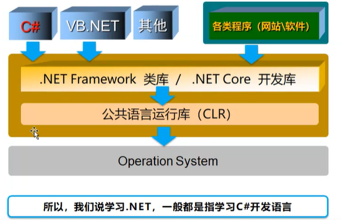
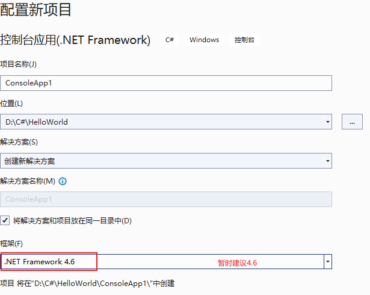

## 1. C sharp、.net framework、asp.net

`.net framework`是开发web服务和web应用程序的框架。

`C#`的出现是由 Anders Hejlsberg 和他的团队在 .Net 框架开发期间开发的，是 `.net`平台最常用的语言。

`asp.net`是内含于.NET框架中，专门用来发展Web应用程序的一组类别库集。

### 1.1 C sharp介绍

#### 1.1.1 语言特点

- 垃圾回收自动回收不可访问的未用对象所占用的内存。
- 可以为 null 的类型可防范不引用已分配对象的变量。
- 异常处理提供了一种结构化且可扩展的方法来进行错误检测和恢复。
- Lambda 表达式支持函数编程技术。
- 语言集成查询 (LINQ) 语法创建一个公共模式，用于处理来自任何源的数据。
- 异步操作语言支持提供用于构建分布式系统的语法。
- C# 有统一类型系统。 所有 C# 类型（包括 int 和 double 等基元类型）均继承自一个根 object 类型。 所有类型共用一组通用运算。 任何类型的值都可以一致地进行存储、传输和处理。 C# 还支持用户定义的引用类型和值类型。 C# 允许动态分配轻型结构的对象和内嵌存储。 C# 支持泛型方法和类型，因此增强了类型安全性和性能。
- C# 可提供迭代器，使集合类的实现者可以定义客户端代码的自定义行为。

#### 1.1.2 上位机语言对比

#### 1.1.3 C#和组态软件对比

#### 1.1.4 C#和LibView对比

### 1.2 `.net`介绍

#### 1.2.1 来源

C# 程序在 .NET 上运行，而 .NET 是名为**公共语言运行时** (CLR) 的虚执行系统和一组类库。 CLR 是 Microsoft 对**公共语言基础结构** (CLI) 国际标准的实现。 CLI 是创建执行和开发环境的基础，语言和库可以在其中无缝地协同工作。

#### 1.2.2 发展

#### 1.2.3 `.NET`平台和C#编程语言

### 1.3 编译及运行过程

程序集是包含代码和元数据的自描述功能单元，因此无需在 C# 中使用 `#include` 指令和头文件。

在编译程序时引用特定的程序集，即可在 C# 程序中使用此程序集中包含的公共类型和成员。

C# 程序可以存储在多个源文件中。 在编译 C# 程序时，将同时处理所有源文件，并且源文件可以自由地相互引用。 从概念上讲，就好像所有源文件在被处理之前都连接到一个大文件。

在 C# 中永远都不需要使用前向声明，因为声明顺序无关紧要（极少数例外情况除外）。

C# 并不限制源文件只能声明一种公共类型（`public`），也不要求源文件的文件名必须与其中声明的类型相匹配。

## 1. 学习阶段

### 1.1 第一阶段

- visual studio
  - 必装assets/20230504140312.png]
  - 建议
- SQLServer

### 1.2 第二阶段

- NetAssit UartAssist(串口以太网络助手）
- Modbus系列软件(Modbus)
- 博途系列软件（西门子）
- GX Works(三菱)
- CX Programmer(欧姆龙)
- KepServerEx6(OPC）

## 2. 创建上位机项目

## 3. Solution和project

- Solution：解决方案
- Poject：解决问题的方法。Solution包含Project。vs提供了Project模板。

