> 基于https://www.xinbaoku.com/archive/EAF5fytb.html

## 1. 创建项目

### 1.1 选择窗体sdk

在 Visual Studio 2022 软件中，依次选择“文件”→“新建”→“项目”命令，弹出如下图所示的对话框。

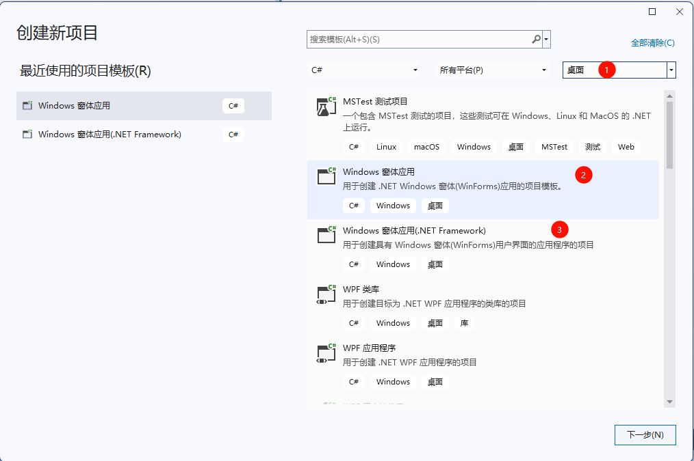

1. 选择“桌面”
2. *Windows窗体应用* 表示为`.net8`环境。
3. *Windows窗体应用（.NET Framework）* 表示为`.net6`环境。

> 一般winform应用，都是基于.net6的。

### 1.2 填写项目信息

以`.net6`为例，选择*Windows窗体应用（.NET Framework）*，点击 *下一步*，填写项目信息，点击 *创建*，创建项目成功。

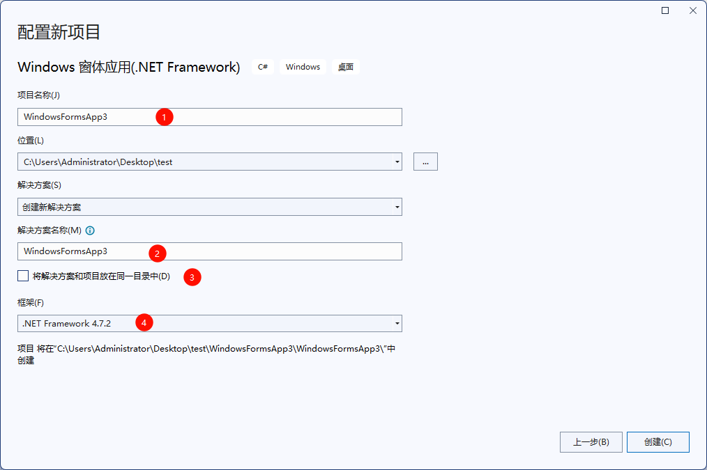

1. 项目类似于Java中的工程名。
2. 解决方案类似于Java中的模块。
3. 一个项目可以包括多个解决方案，当勾选 *将解决方案和项目放在同一目录中* 时，一个项目包含一个解决方案。

### 1.3 不同项目结构对比

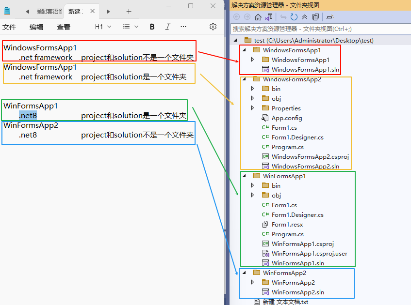

### 1.4  控件箱

在 Windows 窗体应用程序中界面是由不同类型的控件构成的。

系统中默认的控件全部存放到工具箱中，选择“视图”→“工具箱”，如下图所示。

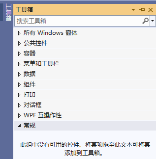

在工具箱中将控件划分为公共控件、容器、菜单和工具栏、数据、组件、打印、对话框等组。

如果工具箱中的控件不能满足开发项目的需求，也可以向工具箱中添加新的控件。或者对工具箱中的控件重置或进行分组等操作，都可以通过右击工具箱，在弹出的右键菜单中选择相应的命令实现。在右键菜单中选择“选择项”命令，弹出如下图所示的对话框。

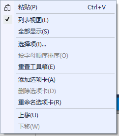

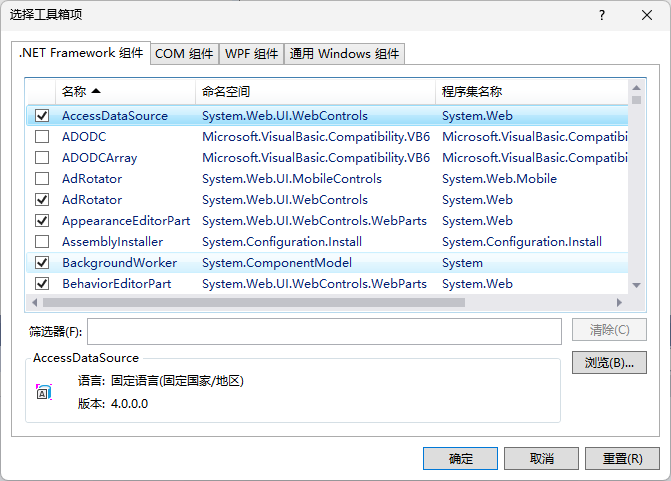

在该对话框中列出了不同组件中所带的控件，如果需要在工具箱中添加，直接选中相应组件名称前的复选框即可。

如果需要添加外部的控件，则单击“浏览”按钮，找到相应控件的 .dll 或 .exe 程序添加即可。

## 2. 窗体

自定义的窗体都继承自 System.Windows.Form 类，能使用 Form 类中已有的成员，包括属性、方法、事件等。

### 2.1 窗体属性


选中窗体，然后点击窗体界面，自动显示窗体的属性：

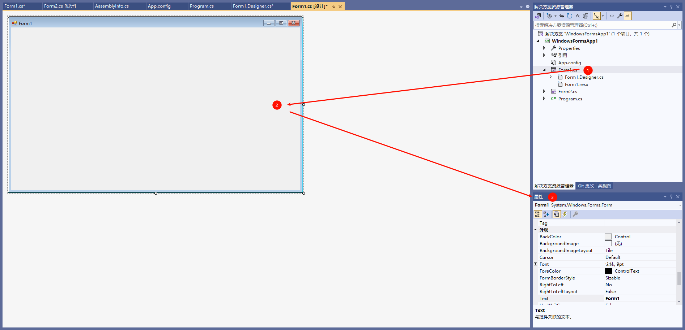

| 属性                    | 作用                                                                                                                                                                                                                                     |
| --------------------- | -------------------------------------------------------------------------------------------------------------------------------------------------------------------------------------------------------------------------------------- |
| Name                  | 用来获取或设置窗体的名称                                                                                                                                                                                                                           |
| WindowState           | 获取或设置窗体的窗口状态，取值有3种，即：<br>Normal（正常）、<br>Minimized（最小化）、<br>Maximized（最大化），<br>默认为 Normal，即正常显示                                                                                                                                         |
| StartPosition         | 获取或设置窗体运行时的起始位置，取值有 5 种，即 ：<br>Manual（窗体位置由 Location 属性决定）、<br>CenterScreen（屏幕居中）、<br>WindowsDefaultLocation（ Windows 默认位置）、WindowsDefaultBounds（Windows 默认位置，边界由 Windows 决定）、<br>CenterParent（在父窗体中居中），<br>默认为 WindowsDefaultLocation |
| Text                  | 获取或设置窗口标题栏中的文字                                                                                                                                                                                                                         |
| MaximizeBox           | 获取或设置窗体标题栏右上角是否有最大化按钮，默认为 True                                                                                                                                                                                                         |
| MinimizeBox           | 获取或设置窗体标题栏右上角是否有最小化按钮，默认为 True                                                                                                                                                                                                         |
| BackColor             | 获取或设置窗体的背景色                                                                                                                                                                                                                            |
| BackgroundImage       | 获取或设置窗体的背景图像                                                                                                                                                                                                                           |
| BackgroundImageLayout | 获取或设置图像布局，取值有 5 种，即：<br>None（图片居左显示）、<br>Tile（图像重复，默认值）、<br>Stretch（拉伸）、<br>Center（居中）、<br>Zoom（按比例放大到合适大小）                                                                                                                            |
| Enabled               | 获取或设置窗体是否可用                                                                                                                                                                                                                            |
| Font                  | 获取或设置窗体上文字的字体                                                                                                                                                                                                                          |
| ForeColor             | 获取或设置窗体上文字的颜色                                                                                                                                                                                                                          |
| Icon                  | 获取或设置窗体上显示的图标                                                                                                                                                                                                                          |

> Name属性会设置窗体Form的class名为该名称，但不会设置窗体Form的文件名为该名称。C#也允许文件名和类名不一致，但这不是一个优秀的做法。
> 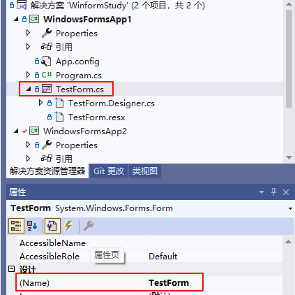

### 2.2 窗体属性

在窗体属性面板中单击闪电图标即可查看到窗体中的事件：

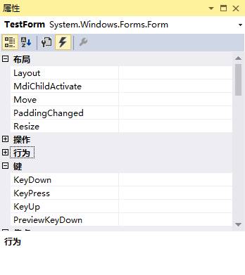

| 事件               | 作用                   |
| ---------------- | -------------------- |
| Load             | 窗体加载事件，在运行窗体时即可执行该事件 |
| MouseClick       | 鼠标单击事件               |
| MouseDoubleClick | 鼠标双击事件               |
| MouseMove        | 鼠标移动事件               |
| KeyDown          | 键盘按下事件               |
| KeyUp            | 键盘释放事件               |
| FormClosing      | 窗体关闭事件，关闭窗体时发生       |
| FormClosed       | 窗体关闭事件，关闭窗体后发生       |

### 2.3 窗体方法

|方法|作用|
|---|---|
|void Show()|显示窗体|
|void Hide()|隐藏窗体|
|DialogResult ShowDialog()|以对话框模式显示窗体|
|void CenterToParent()|使窗体在父窗体边界内居中|
|void CenterToScreen()|使窗体在当前屏幕上居中|
|void Activate()|激活窗体并给予它焦点|
|void Close()|关闭窗体|

## 3. MessageBox：消息框

消息框是通过 McssageBox 类来实现的，在 MessageBox 类中仅定义了 Show 的多个重载方法，该方法的作用就是弹出一个消息框。  

由于 Show 方法是一个静态的方法，因此调用该方法只需要使用`MessageBox.Show( 参数 )`的形式即可弹出消息框。  

|方法|说明|
|---|---|
|DialogResult Show(string text)|指定消息框中显示的文本（text）|
|DialogResult Show(string text, string caption)|指定消息框中显示的文本（text）以及消息框的标题（caption）|
|DialogResult Show(string text, string caption,  MessageBoxButtons buttons)|指定消息框中显示的文本（text）、消息框的 标题（caption）以及消息框中显示的按钮 （buttons）|
|DialogResult Show(string text, string caption, MessageBoxButtons buttons, MessageBoxIcon icon)|指定消息框中显示的文本（text）、消息框的 标题（caption ）、消息框中显示的按钮 （buttons）以及消息框中显示的图标（icon）|
MessageBoxButtons 枚举类型主要用于设置消息框中显示的按钮，具体的枚举值如下。

- OK：在消息框中显示“确定”按钮。
- OKCancel：在消息框中显示“确定”和“取消”按钮。
- AbortRetryIgnore：在消息框中显示“中止” “重试”和“忽略”按钮。
- YesNoCancel：在消息框中显示“是” “否”和“取消”按钮。
- YesNo：在消息框中显示“是”和“否”按钮。
- RetryCancel：在消息框中显示“重试”和“取消”按钮。

MessageBoxIcon 枚举类型主要用于设置消息框中显示的图标，具体的枚举值如下。

- None：在消息框中不显示任何图标。
- Hand、Stop、Error：在消息框中显示由一个红色背景的圆圈及其中的白色X组成 的图标。
- Question：在消息框中显示由圆圈和其中的一个问号组成的图标。
- Exclamation、Warning：在消息框中显示由一个黄色背景的三角形及其中的一个感叹号组成的图标。
- Asterisk、Information：在消息框中显示由一个圆圈及其中的小写字母 i 组成的图标。

调用 MessageBox 类中的 Show 方法将返回一个 DialogResult 类型的值，也是一个枚举类型，是消息框的返回值，通过单击消息框中不同的按钮得到不同的消息框返回值。  

DialogResult 枚举类型的具体值如下。  

- None：消息框没有返回值，表明有消息框继续运行。
- OK：消息框的返回值是 0K （通常从标签为“确定”的按钮发送）。
- Cancel：消息框的返回值是 Cancel （通常从标签为“取消”的按钮发送）。
- Abort：消息框的返回值是 Abort （通常从标签为“中止”的按钮发送）。
- Retry：消息框的返回值是 Retry （通常从标签为“重试”的按钮发送）。
- Ignore：消息框的返回值是 Ignore （通常从标签为“忽略“的按钮发送）。
- Yes：消息框的返回值是 Yes （通常从标签为“是“的按钮发送）。
- No：消息框的返回值是 No （通常从标签为“否“的按钮发送）。

## 4. 控件

所谓控件就是指能输入文本的位置、能选择的位置、能单击的位置、图片显示的位置等。其中：

- 能输入文本的位置对应于 Windows 窗体应用程序中的文本框、多行文本框等。
- 能选择的位置对应于 Windows 窗体应用程序中的复选框、单选按钮、下拉列表框。
- 能单击的位置对应于 Windows 窗体应用程序中的按钮、超链接标签、菜单栏、工具栏等。
- 图片显示的位置对应于 Windows 窗体应用程序中的图片控件。

Windows 窗体应用程序的实现主要依靠控件，并通过控件的事件和属性来实现窗体的效果。

### 4.1 公共控件

#### 4.1.1 Label标签

常用属性如下：

|属性名|作用|
|---|---|
|Name|标签对象的名称，区别不同标签唯一标志|
|Text|标签对象上显示的文本|
|Font|标签中显示文本的样式|
|ForeColor|标签中显示文本的颜色|
|BackColor|标签的背景颜色|
|Image|标签中显示的图片|
|AutoSize|标签的大小是否根据内容自动调整，True 为自动调整，False 为用户自定义大小|
|Size|指定标签控件的大小|
|Visible|标签是否可见，True 为可见，False 为不可见|

常用的事件与窗体的事件类似，主要有鼠标单击事件、 鼠标双击事件、标签上文本改变的事件等。

#### 4.1.2 LinkLabel标签

超链接标签控件 (LinkLabel) 与普通标签控件类似，具有相同的属性和事件。

超链接标签主要应用的事件是鼠标单击事件，通过单击标签完成不同的操作。

#### 4.1.3 TextBox：文本框控件

TextBox具有Label、LinkLabel的属性，还具有一些不同的属性：

|属性名|作用|
|---|---|
|Text|文本框对象中显示的文本|
|MaxLength|在文本框中最多输入的文本的字符个数|
|WordWrap|文本框中的文本是否自动换行，如果是 True，则自动换行，如果是 False，则不能自动换行|
|PasswordChar|将文本框中出现的字符使用指定的字符替换，通常会使用“*”字符|
|Multiline|指定文本框是否为多行文本框，如果为 True，则为多行文本框，如果 为 False，则为单行文本框|
|ReadOnly|指定文本框中的文本是否可以更改，如果为 True，则不能更改，即只读文本框，如果为 False，则允许更改文本框中的文本|
|Lines|指定文本框中文本的行数|
|ScrollBars|指定文本框中是否有滚动条，如果为 True，则有滚动条,如果为 False， 则没有滚动条|

文本框控件最常使用的事件是文本改变事件 (TextChange)。

#### 4.1.4 Button：按钮控件

按钮主要用于提交页面的内容，或者是确认某种操作等。

按钮包括普通的按钮 (Button)、单选按钮 (RadioButton)。

按钮常用的属性包括在按钮中显示的文字 (Text) 以及按钮外观设置的属性，最常用的事件是单击事件。

#### 4.1.5 RadioButton：单选按钮控件

多个 RadioButton 控件可以为一组（同一个容器内自动成一组），这一组内的 RadioButton 控件只能有一个被选中。

#### 4.1.6 checkBox：复选框控件

复选框主要的属性是：Name、Text、Checked。

- Name：表示这个组件的名称；
- Text：表示这个组件的标题；
- Checked：表示这个组件是否已经选中。

主要的事件就是 CheckedChanged 事件。

#### 4.1.7 CheckedListBox：复选列表框控件

复选列表框显示的效果与复选框类似，但在选择多个选项时操作比一般的复选框更方便。

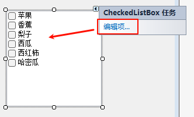

在使用复选列表框控件时，获取列表中的项使用的是 Checkedltems 属性，获取当前选中的文本使用的是 Selectedltem 属性。

#### 4.1.8 ListBox：列表框控件

列表框 (ListBox) 将所提供的内容以列表的形式显示出来，并可以选择其中的一项或多项内容，从形式上比使用复选框更好一些（没有复选框的那个框）。

在列表框控件中有一些属性与前面介绍的控件不同：

| 属性名           | 作用                                                                                                                                                  |
| ------------- | --------------------------------------------------------------------------------------------------------------------------------------------------- |
| MultiColumn   | 获取或设置列表框是否支持多列，<br>如果设置为 True，则表示支持多列； <br>如果设置为 False，则表示不支持多列，默认为 False                                                                           |
| Items         | 获取或设置列表框控件中的值                                                                                                                                       |
| SelectedItems | 获取列表框中所有选中项的集合                                                                                                                                      |
| SelectedItem  | 获取列表框中当前选中的项                                                                                                                                        |
| SelectedIndex | 获取列表框中当前选中项的索引，索引从 0 开始                                                                                                                             |
| SelectionMode | 获取或设置列表框中选择的模式，<br>当值为 One 时，代表只能选中一项， <br>当值为 MultiSimple 时，代表能选择多项，<br>当值为 None 时，代表不能选择，<br>当值为 MultiExtended 时，代表能选择多项，但要在按下 Shift 键后 再选择列表框中的项 |
列表框还提供了一些方法来操作列表框中的选项，由于列表框中的选项是一个集合形式的，列表项的操作都是用 Items 属性进行的。  

例如 `Items.Add` 方法用于向列表框中添加项，`Items.Insert` 方法用于向列表框中的指定位置添加项，`Items.Remove` 方法用于移除列表框中的项。

#### 4.1.9 ComboBox：组合框控件

组合框（ComboBox）控件也称下拉列表框，用于选择所需的选项。  

使用组合框可以有效地避免非法值的输入，常用属性如下：

| 属性名              | 作用                                                                                                                                                                        |
| ---------------- | ------------------------------------------------------------------------------------------------------------------------------------------------------------------------- |
| DropDownStyle    | 获取或设置组合框的外观，<br>如果值为 Simple，同时显示文本框和列表框，并且文本框可以编辑；<br>如果值为 DropDown，则只显示文本框，通过鼠标或键盘的单击事件展开文本框，并且文本框可以编辑；<br>如果值为 DropDownList，显示效果与 DropDown 值一样，但文本框不可编辑。默认情况下为 DropDown |
| Items            | 获取或设置组合框中的对象                                                                                                                                                              |
| Text             | 获取或设置组合框中显示的文本                                                                                                                                                            |
| MaxDropDownltems | 获取或设置组合框中最多显示的项数                                                                                                                                                          |
| Sorted           | 指定是否对组合框列表中的项进行排序，<br>如果值为 True，则排序， <br>如果值为 False，则不排序。默认情况下为 False                                                                                                     |
在组合框中常用的事件是改变组合框中的值时发生的，即组合框中的选项改变事件 SelectedlndexChanged。  此外，在组合框中常用的方法与列表框类似，也是向组合框中添加项、从组合框中删除项。

#### 4.1.10 PictureBox：图片控件

图片控件 ( PictureBox )中，图片的设置使用image属性。

| 属性名           | 作用                                                                                                                                                                                              |
| ------------- | ----------------------------------------------------------------------------------------------------------------------------------------------------------------------------------------------- |
| Image         | 获取或设置图片控件中显示的图片                                                                                                                                                                                 |
| ImageLocation | 获取或设置图片控件中显示图片的路径                                                                                                                                                                               |
| SizeMode      | 获取或设置图片控件中图片显示的大小和位置，<br>如果值为 Normal，则图片显不在控件的左上角；<br>如果值为 Stretchimage，则图片在图片控件中被拉伸或收缩，适合图片的大小；<br>如果值为AutoSize，则控件的大小适合图片的大小；<br>如果值为 Centerimage，图片在图片控件中居中；<br>如果值为 Zoom，则图片会自动缩放至符合图片控件的大小 |
图片控件中图片的设置除了可以直接使用 ImageLocation 属性指定图片路径以外，还可以通过 Image.FromFile 方法来设置。

```c#
图片控件的名称.Image = Image. FromFile( 图像的路径 );
```

在 Windows 窗体应用程序中，图片也可以用二进制的形式存放到数据库中，并使用文件流的方式读取数据库中的图片。  

通过图片控件的 FromStream 方法来设置使用流读取的图片文件。

#### 4.1.11 DateTimePicker：日期时间控件

日期时间控件用于在界面上显示当前的时间。 常用的属性是设置其日期显示格式的 Format 属性。  

Format 属性提供了 4 个属性值，如下所示。

- Short：短日期格式，例如2017/3/1；
- Long：长日期格式，例如2017年3月1日；
- Time：仅显示时间，例如，22:00:01；
- Custom：用户自定义的显示格式。

如果将 Format 属性设置为 Custom 值，则需要通过设置 CustomFormat 属性值来自定义显示日期时间的格式。

#### 4.1.12 日历控件：MonthCalendar

日历控件（MonthCalendar）用于显示日期，通常是与文本框联用，将日期控件中选择的日期添加到文本框中。

#### 4.1.13 RichTextBox：富文本框控件

实际开发中可能需要在读取文本信息时需要保留原有的文本格式，这时候就不能使用普通的文本控件 (TextBox) 了，而需要使用富文本框控件 (RichTextBox) 来完成。  

RichTextBox 控件在使用时与 TextBox 控件是非常类似的，但其对于读取多行文本更有优势，它可以处理特殊格式的文本。  

此外，在 RichTextBox 控件中还提供了文件加载和保存的方法，不需要使用文件流即可完成对文件的读写操作。

### 4.2 组件

#### 4.2.1  Timer：定时器控件

定时器控件（Timer）与其他的控件略有不同，它并不直接显示在窗体上，而是与其他控件连用，表示每隔一段时间执行一次 Tick 事件。  

定时器控件中常用的属性是 Interval，用于设置时间间隔，以毫秒为单位。  

此外，在使用定时器控件时还会用到启动定时器的方法（Start）、停止定时器的方法（Stop）。

### 4.3 菜单和工具栏

#### 4.1.1 ContextMenuStrip：右键菜单控件（上下文菜单）

右键菜单又叫上下文菜单，即右击某个控件或窗体时出现的菜单，它也是一种常用的菜单控件。  

在 Windows 窗体应用程序中，上下文菜单在设置时直接与控件的 ContextMenuStrip 属性绑定即可。

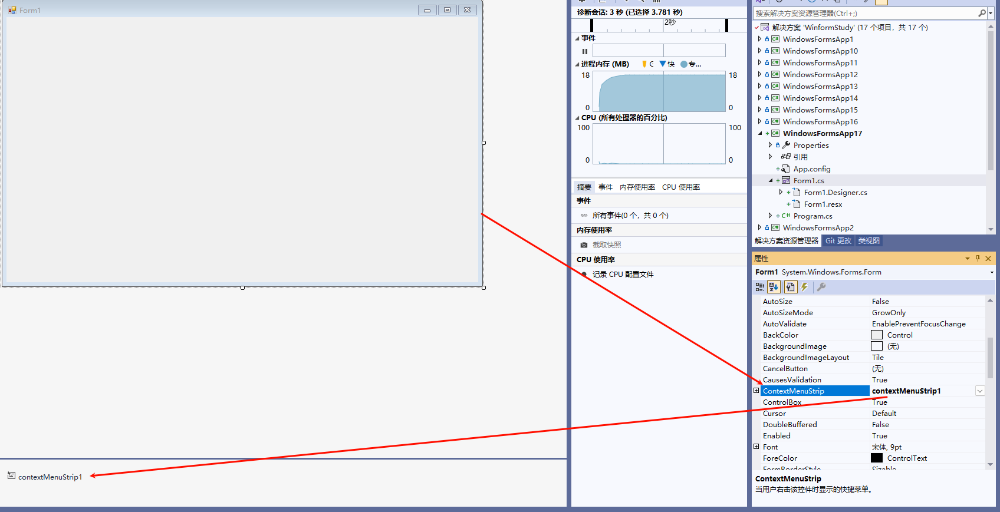

#### 4.1.2 MenuStrip：菜单栏控件

在窗体上添加菜单栏控件 MenuStrip，直接按住 MenuStrip 不放，将其拖到右边的 Windows 窗体中即可，如下图所示。  


完成 MenuStrip 控件的添加后，在 Windows 窗体设计界面中就能看到“请在此处键入” 选项，直接单击它，然后输入菜单的名称，例如，“文件”“编辑”“视图”等。  

此外，添加一级菜单后还能添加二级菜单，例如，为“文件”菜单添加“新建”“打开”“关闭”等二级菜单，如下图所示，模拟一个文件菜单（包括二级菜单）和编辑菜单。  


#### 4.1.3 StatusStrip：状态栏菜单控件

在 Windows 窗体应用程序中，状态栏菜单（StatusStrip）用于在界面中给用户一些提示，例如登录到一个系统后，在状态栏上显示登录人的用户名、系统时间等信息。  

在 Office 的 Word 软件中，状态中显示的是当前的页数、当前页的字数统计、页面分辨率等信息，如下图所示。  


在添加状态栏菜单时，按住 StatusStrip 选项不放，将其拖到右边的 Windows 窗体中即可，如下图所示。  


在状态栏上不能直接编辑文字，需要添加其他的控件来辅助。  

单击上图所示界面中新添加的状态栏控件，则会显示如下图所示的下拉菜单，其中包括标签控件（StatusLabel）、进度条（ProgressBar）、下拉列表按钮（DropDownButton）、分割按钮（SplitButton）。  


#### 4.1.4 ToolStrip：工具栏控件

添加工具栏（ToolStrip）和添加菜单栏类似，在工具箱中将 ToolStrip 控件直接拖到 Windows 窗体中即可。  

为了美观和界面的统一，应将其拖到菜单栏的下方，如下图所示。  


在添加了 ToolStrip 控件之后，它只是一个工具条，上面并没有控件，所以它不能响应 一些事件，从而没有功能。 可以把它理解成一个占位符，就像是占着一个区域的位置，然后在其上面再添加按钮。添加按钮也很简单，如下图所示。  


### 4.4 MDI窗体

在 Windows 窗体应用程序中，经常会在一个窗体中打开另一个窗体， 通过窗体上的不同菜单选择不同的操作，这种在一个窗体中打开另一个窗体的方式可以通过设置 MDI 窗体的方式实现。  

MDI (Multiple Document Interface) 窗体被称为多文档窗体，它是很多 Windows 应用程序中常用的界面设计。  

MDI 窗体的设置并不复杂，只需要将窗体的属性 IsMdiContainer 设置为 True 即可。  

该属性既可以在 Windows 窗体的属性窗口中设置，也可以通过代码设置，这里在窗体加载事件 Load 中设置窗体为 MDI 窗体，代码如下。  

```c#
this.IsMdiContainer = True;
```

此外，还可以在窗体类的构造方法中加入上面的代码。  

在设置 MDI 窗体以后，窗体的运行效果如下图所示。  


在 MDI 窗体中，弹出窗体的代码与直接弹出窗体有些不同，在使用 Show 方法显示窗体前需要使用窗体的 MdiParent 设置显示当前窗体的父窗体，实现的代码如下。

```c#
Test t = new Test();
t.MdiParent = this;
t.Show();
```

这里，`this`代表的是当前窗体。

### 4.5 对话框

#### 4.5.1 ColorDialog：颜色对话框控件

颜色对话框的运行效果如下图所示。  


在使用颜色对话框时不会在窗体中直接显示该控件，需要通过事件调用该控件的 ShowDialog 方法显示对话框。

#### 4.5.2 FontDialog：字体对话框控件

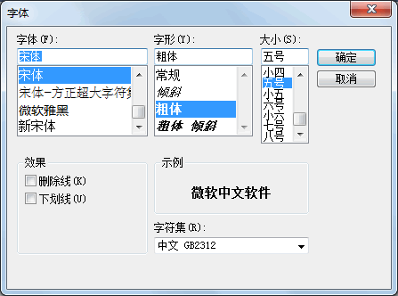

#### 4.5.2 OpenFileDialog和SaveFileDialog：打开文件与保存文件

## 5. DevExpress

### 5.1 安装

### 5.2 激活

### 5.3 创建新项目

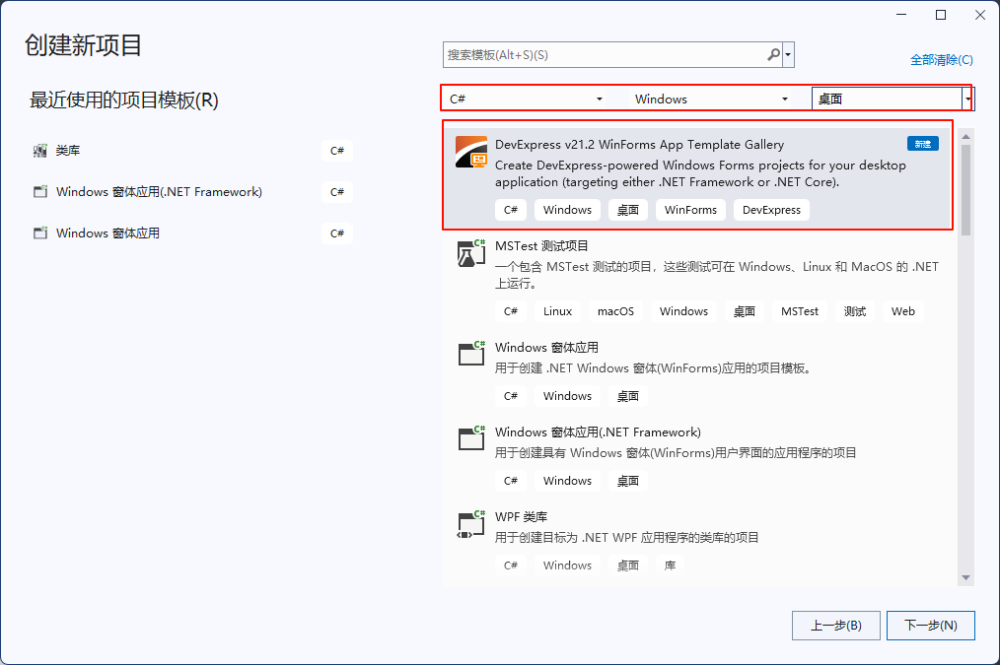

### 5.4 使用

#### 5.4.1 创建自定义控件

1. 右键程序集，创建一个名为“Ucs”的文件夹（规范）
   - 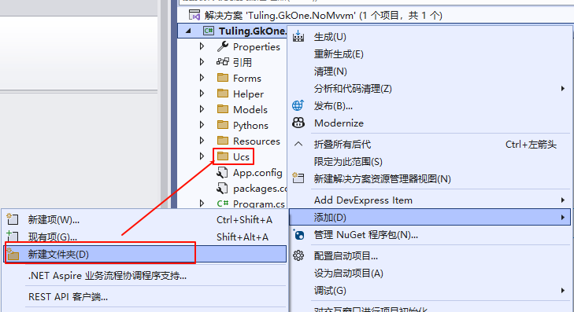
2. 右键“Ucs”文件夹，添加一个item
   - 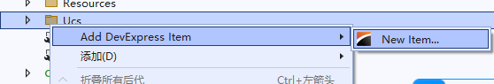
3. 选择usecontrol，设置名字进行添加
   - 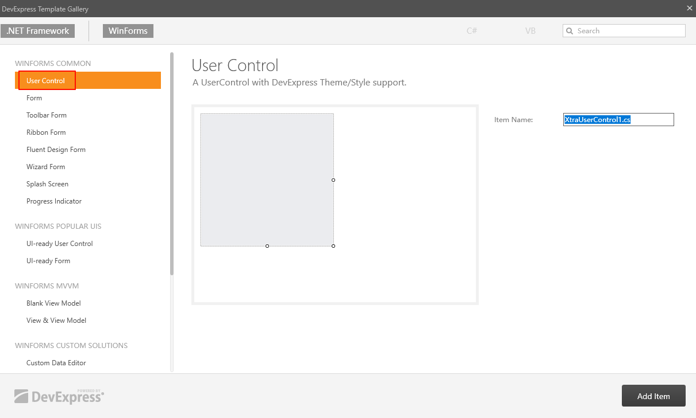

#### 5.4.2 使用自定义控件

1. 右键程序集，点击重新生成，将自定义控件添加到工具箱内，否则找不到。
   - 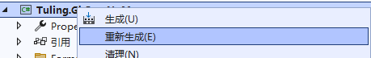
2. 工具箱选择自定义控件的名字，进行添加。

