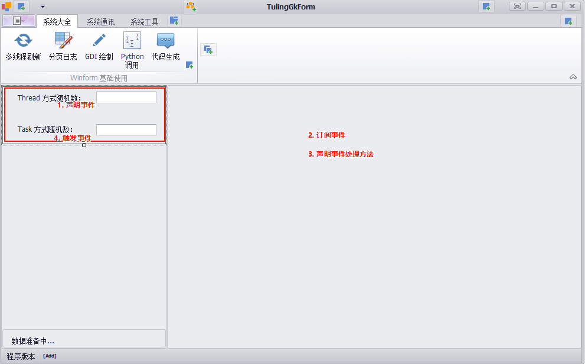

## 0. 上位机开发

### 0.1 上位机开发语言


### 0.3 C#和组态软件对比


### 0.3 C#和LibView对比


## 委托

### 基本案例

```c#
// 1. 声明一个委托
delegate void PrintDelegate();
delegate int InputDelegate(int num);

void Main()
{
 // 2. 使用委托，使用 new 关键字
 var printDelegate = new PrintDelegate(Print2); 
 
 // 3. 如何调用
 printDelegate();
 printDelegate.Invoke();
 
 var inputDelegate = new InputDelegate(Input1);
 var inputResult = inputDelegate(3);
 inputResult.Dump();
}

int Input1(int numInput){
 return numInput+1;
}

void Print()
{
 "Print".Dump();
}
```

### 常用案例

```c#
delegate void Callback();

//void Main()
//{
// HeavyJob(CallbackImp2);
//}
//等价于下面
void Main()
{
 var callback  = new Callback(CallbackImp2); 
 HeavyJob(callback);
}

void HeavyJob(Callback callBack){
 Thread.Sleep(1);
 
 callBack?.Invoke();
}

void CallbackImp1(){
 "Job1 Done".Dump();
}

void CallbackImp2()
{
 "Job2 Done".Dump();
}
```

