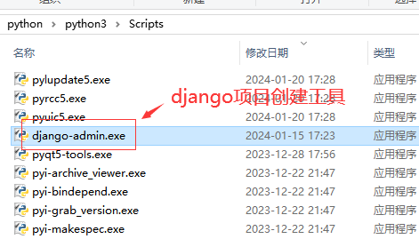

## 1. 环境搭建

### 1.1 django-admin安装

```bash
pip install Django==5.0.1 -i https://pypi.tuna.tsinghua.edu.cn/simple
```

安装完成后，在python目录的Scripts下，会多出一个diango-admin.exe，这个是django项目创建工具。



同时Lib下的site-packages目录下，也会有一个django目录，这个是开发项目会用到的django开发包。


**常用命令：**

- 安装pip：`python -m pip install -U pip`
- 安装虚拟环境工具：`pip install virtualenv`
- 创建项目虚拟环境：`virtualenv env_mysite`，env_mysite是虚拟环境名称，会在项目目录下创建env_mysite文件夹
- 激活虚拟环境：`env_mysite/scripts/activate`

### 1.2 创建项目

#### 1.2.1 命令行创建

```bash
django-admin startproject 项目名称
```

> 安装python时，`python/scripts`目录会加入环境变量，而django-admin在该目录下，因此可以直接使用该命令。
>
> 

默认目录结构如下：


#### 1.2.2 pycharm创建

需要使用专业版才可以。打开PyCharm并在左上方单击File→New Project，选择第一个Django，创建新项目，如下图：


默认目录结构如下：


相对于用命令方式，PyCharm创建的项目，多了templates目录（用来放html模版文件），以及settings.py文件中多了`BASE_DIR / 'templates'`

创建完成后，cmd执行`python manage.py runserver`，即可启动项目。

访问：http://127.0.0.1:8000/检查是否正常运行。

#### 1.2.3 默认文件解析

- manage.py:项目管理命令行工具，内置多种方式与项目进行交互，包括启动项目，创建app，数据管理等。【不用修改】
- `__init__.py`：初始化文件,一般情况下无须修改；
- settings.py ：项目的配置文件，项目的所有功能都需要在该文件中进行配置；
- urls.py ：项目的路由设置，设置网站的具体网址内容；
- wsgi.py ：全称为 Python Web Server Gateway Interface，即Python服务器⽹关接⼝，是Python应⽤与Web服务器之间的接⼝，⽤于Django项⽬在服务器上的部署和上线；【不用修改】
- asgi.py ：开启⼀个ASGI服务，ASGI是异步⽹关协议接⼝；【不用修改】

每次执行命令都要在Terminal终端输入python manage.py命令，比较繁琐，借助PyCharm开发工具，在菜单Tools里，有个Run manage.py Task...,直接点击


后续使用时，就可以不用输入python manage.py。

#### 1.2.4 创建应用

一个项目中可以包含多个应用，每个应用间可以相互独立。通过`python manage.py start app01`可以创建应用，具体表现为会创建app01的目录。


一般情况下，一个项目创建一个应用。

应用目录（app01）说明：

- `__init__.py`：说明目录是一个python模块
- migrations.py目录 ：用于存放数据库迁移历史文件
- models.py : 用于应用操作数据库的模型
- views.py : 用于编写Web应用视图，接收数据，处理数据，与Model(模型)，Template(模版)进行交互，返回应答
- apps.py ：应用配置文件。
- tests.py ：做单元测试。
- admin.py ：默认提供了admin后台管理，用作网站的后台管理站点配置相关

## 2. 项目开发流程

### 2.1 返回数据

1. 在应用目录的views.py中编写视图函数，用于处理请求，返回应答。

    ```python
    from django.http.response import HttpResponse

    def hello(request):
        return HttpResponse('Hello World!')
    ```

2. 在项目目录的urls.py中配置路由，用于匹配请求的网址。

    ```python
    urlpatterns = [
        path('admin/', admin.site.urls),
        path('hello/',app01.views.hello),
    ]
    ```

    > 注意，此时访问http://127.0.0.1:8000会报错，因为没有指定默认界面。
    > 要访问默认主页，需要设置`path('', views.index, name="index")`

### 2.2 返回html页面

1. 在项目目录下创建temmplates目录，用于存放html模版文件。并创建index.html文件。
2. 在项目目录的settings.py中配置模版路径`'DIRS': [BASE_DIR, 'templates']`或`'DIRS':[BASE_DIR/'templates']`。

    ```python
    TEMPLATES = [
    {
        'BACKEND': 'django.template.backends.django.DjangoTemplates',
        'DIRS': [BASE_DIR, 'templates'],
        'APP_DIRS': True,
        'OPTIONS': {
            'context_processors': [
                'django.template.context_processors.debug',
                'django.template.context_processors.request',
                'django.contrib.auth.context_processors.auth',
                'django.contrib.messages.context_processors.messages',
                ],
            },
        },
    ]
    ```

3. 在项目目录的urls.py中配置路由，用于匹配请求的网址。

    ```python
    urlpatterns = [
        path('admin/', admin.site.urls),
        path('hello/',app01.views.hello),
        path('index/',app01.views.index)
    ]
    ```

    > 注意，此时访问<http://127.0.0.1:8000会报错，因为没有指定默认界面。

## 3. 核心配置文件settings.py

settings.py是Django项目的核心配置文件，它定义了项目的基本配置，包括数据库连接、模板引擎、认证系统、URL映射等。

```python
# 通过os模块读取当前项目在计算机系统的具体路径,该代码在创建项目时自动生成,一般情况下无须修改。
# 对于请求地址而言，BASE_DIR是项目路径，即127.0.0.1:8000
BASE_DIR = Path(__file__).resolve().parent.parent

# 创建项目自动生成，一般无须修改。密钥主要用于用户密码、CSRF机制和会话Session等数据加密
SECRET_KEY = 'django-insecure-f7f63150^+p+b)00*woydtq83-i2_1dpj)x39#t$fguv&eh4v6'

# 启用调试模式，生产环境要设置为False
DEBUG = True

# 允许访问的域名，生产环境要设置为['*']，为空时只允许本地访问
ALLOWED_HOSTS = []

# Django项目拥有的应用列表，自己创建的应用要放在这里
INSTALLED_APPS = [
    'django.contrib.admin',         # 内置的后台管理系统
    'django.contrib.auth',          # 内置的认证系统
    'django.contrib.contenttypes',  # 内置的模型，Django的ORM框架
    'django.contrib.sessions',      # 会话功能
    'django.contrib.messages',      # 消息功能
    'django.contrib.staticfiles',   # 查找静态资源路径
    # 'app01.apps.App01Config',     # 前面的例子没注册 但是也能运行，不知道为什么
]

# 中间件，用于处理请求和响应，接受请求和返回响应式，均经过中间件处理
# 自定义中间件也要加到这里，写上全限定类名（从应用名开始的类名）
MIDDLEWARE = [
    'django.middleware.security.SecurityMiddleware',# 内置安全机制
    'django.contrib.sessions.middleware.SessionMiddleware',# 会话session功能
    'django.middleware.common.CommonMiddleware',#处理请求、规范请求内容
    'django.middleware.csrf.CsrfViewMiddleware',# 开启CSRF保护
    'django.contrib.auth.middleware.AuthenticationMiddleware',# 开启内置的用户认证
    'django.contrib.messages.middleware.MessageMiddleware',#开启内置消息提示功能
    'django.middleware.clickjacking.XFrameOptionsMiddleware',#防止恶意程序单机劫持
]

ROOT_URLCONF = 'test01.urls' #加载应用的路径配置

TEMPLATES = [
    {
        'BACKEND': 'django.template.backends.django.DjangoTemplates', # 定义模板引擎
        'DIRS': [BASE_DIR, 'templates'], # 指定模板路径，可以配置为元组多路径。多个模板路径下有同名文件时，优先使用第一个路径下的文件。
        'APP_DIRS': True, #是否在app里查找模板文件
        'OPTIONS': { # 用于填充在RequestConext的上下文
            'context_processors': [
                'django.template.context_processors.debug',
                'django.template.context_processors.request',
                'django.contrib.auth.context_processors.auth',
                'django.contrib.messages.context_processors.messages',
            ],
        },
    },
]

WSGI_APPLICATION = 'test01.wsgi.application'#部署项目时，

DATABASES = {
    'default': {
        'ENGINE': 'django.db.backends.sqlite3',
        'NAME': BASE_DIR / 'db.sqlite3',
    }
}

# mysql数据库配置，django5要求mysql8.0.11版本以上
# 配置数据库后，需要使用python manage.py migrate命令来创建数据库表。
# 或使用python manage.py makemigrations和迁移历史文件。
# DATABASES = {  
#     'default': {  
#         'ENGINE': 'django.db.backends.mysql',  
#         'NAME': 'django_test01',  
#         'USER': 'root',  
#         'PASSWORD': '123456',  
#         'HOST': 'localhost',  
#         'PORT': '3306'
#     }
# }

# 避免用户设置的密码等级不足
AUTH_PASSWORD_VALIDATORS = [
    {
        'NAME': 'django.contrib.auth.password_validation.UserAttributeSimilarityValidator',
    },
    {
        'NAME': 'django.contrib.auth.password_validation.MinimumLengthValidator',
    },
    {
        'NAME': 'django.contrib.auth.password_validation.CommonPasswordValidator',
    },
    {
        'NAME': 'django.contrib.auth.password_validation.NumericPasswordValidator',
    },
]

LANGUAGE_CODE = 'en-us'

TIME_ZONE = 'UTC'

USE_I18N = True

USE_TZ = True#设置存到数据库的时区类型为UTC

STATIC_URL = 'static/' # 默认的静态文件路由名称，,改名字随意设定，总是映射到应用目录下的static文件夹（app01/static），通过127.0.0.1:8000/static/111.img，方式访问。
STATICFILES_DIRS = [BASE_DIR / "static", BASE_DIR / "app01/images"] # 静态文件集合，设置该属性时，项目目录下创建的static文件夹（test01/static）、应用目录下创建的images文件夹（test01/app01/images）均能通过uri访问，访问路径同STATIC_URL：127.0.0.1:8000/static/111.img。
# STATIC_ROOT = BASE_DIR / 'static' # 当项目的配置属性 DEBUG 设为True的时候（开发阶段）,Django 会自动提供静态文件代理服务,无须使用STATIC_ROOT。发布时，需要设置该属性，且需要使用 Django操作指令collectstatic来收集所有静态资源。

MEDIA_URL = 'media/'  # 设置媒体路由，即uri的地址名称
MEDIA_ROOT = BASE_DIR / 'media'# 设置media目录的完整路径

DEFAULT_AUTO_FIELD = 'django.db.models.BigAutoField'#默认主键自增类型
```

1. 启用媒体文件时，除了在settings.py中配置MEDIA_URL和MEDIA_ROOT外，还需要在项目目录下创建media文件夹，用于存放媒体文件，也需要在项目的urls.py中配置路由，用于匹配媒体文件的网址。即可通过127.0.0.1:8000/media/111.img访问到媒体文件。

    ```python
    from django.conf import settings        # 引入
    from django.contrib import admin
    from django.urls import path, re_path
    from django.views.static import serve

    import app01.views

    urlpatterns = [
        path('admin/', admin.site.urls),
        path('hello/',app01.views.hello),
        path('index/',app01.views.index),
        # 配置媒体文件的路由地址  
        re_path('media/(?P<path>.*)', serve, {'document_root': settings.MEDIA_ROOT},  name='media')
    ]
    ```

2. 中间件可以定义5个方法，自定义中间件必须集成MiddlewareMixin：
    - process_request(self, request)：在请求处理之前调用，返回None或HttpResponse对象。
    - process_view(self, request, view_func, view_args, view_kwargs)：在视图函数处理之前调用，返回None或HttpResponse对象。
    - process_exception(self, request, exception)：在视图函数处理过程中发生异常时调用。
    - process_template_response(self, request, response)：在视图函数处理之后调用，返回HttpResponse对象。
    - process_response(self, request, response)：在视图函数处理之后调用，返回HttpResponse对象。

## 4. 路由定义

### 4.1 路由变量

1. 路径定义（在urls.py中）：`path('blog/<int:id>', app01.views.blog)`
2. 视图函数：

    ```python
    def blog(request, id):  
        return HttpResponse(str(id))
    ````

3. 访问：`127.0.0.1:8000/blog/1`

### 4.2 路由正则

1. 路径定义（在urls.py中）：`re_path('blog/(?P<id>\d+)', app01.views.blog)`
    - ?P开头固定格式
    - id：自定义变量名

### 4.3 路由重定向

#### 4.3.1 路由重定向

在urls.py中：`path('redirectTo', RedirectView.as_view(url="index/"))`

请求：`127.0.0.1:8000/redirectTo`时，会自动跳转到127.0.0.1:8000/index/。浏览器的路径会变化。

#### 4.3.2 视图重定向

```python
def blog(request, id):  
    if id == 0:  
        return redirect("/static/error.html")  
    else:  
        return HttpResponse('id是' + str(id) + "的博客页面")

```

### 4.4 命名空间

当一个工程，包含了多个项目，需要区分不同项目时，需要使用命名空间。

```python
path('user/', include(('user.urls', 'user'), namespace='user')),  
path('order/', include(('order.urls', 'order'), namespace='order'))
```

如：在主项目的urls.py中，添加上面两个路径，分别代表user和order两个项目，然后，在user和order两个项目中，定义路由，如：`path('index/', views.index)`，那么，在浏览器中访问127.0.0.1:8000/user/index/，会自动匹配到user项目下的index视图函数。

当然，user和order两个项目中，要定义自己的urls.py文件，并指向实际的页面地址。

### 4.5 reverse和resolve

#### 4.5.1 reverse

1. 作用：进行URL反转。
2. 使用场景：已知视图函数，想得到指向该视图函数的url。

```python
# urls.py
app_name = "front"
urlpatterns = [
    path('', views.index, name="index"),
    path('signIn/', views.login, name="login"),
]

# views.py
def index(request):
    username = request.GET.get('username')
    if username:
        return HttpResponse("front首页")
    else:
        return redirect(reverse('front:login')  + "?next=/")

def login(request):
    return HttpResponse('front登录页面')
```

上述案例中，已知视图函数为front应用下的login函数（front:login），通过reverse函数，可以得到urls.py中定义的signIn。

因此，当访问127.0.0.1/front地址时，实际会执行127.0.0.1/front/signIn

#### 4.5.2 resolve

```python
def index(request):  
    route_url = reverse('order:index')  
    print("reverse反向解析得到路由地址:" + route_url)  
    result = resolve(route_url)  
    print("resolve通过路由地址得到路由信息:" + str(result))  
    return HttpResponse("订单信息")
```

运行http://127.0.0.1:8000/order/index/时，会得到：

```bash
reverse反向解析得到路由地址:/order/index/  
resolve通过路由地址得到路由信息:ResolverMatch(func=order.views.index, args=(),  kwargs={}, url_name='index', app_names=['order'], namespaces=['order'],  route='order/index/')
```

## 5. 视图

###  5.1 