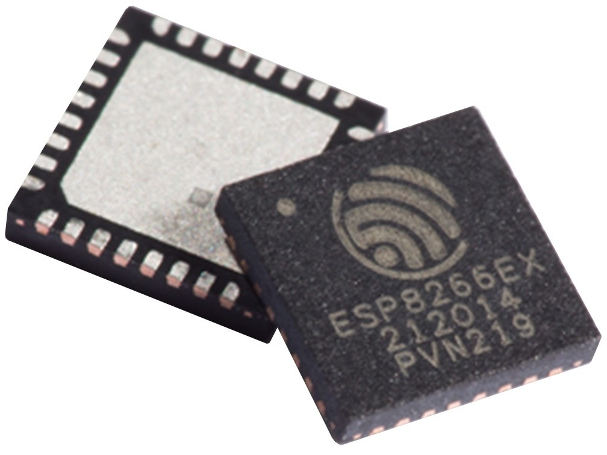
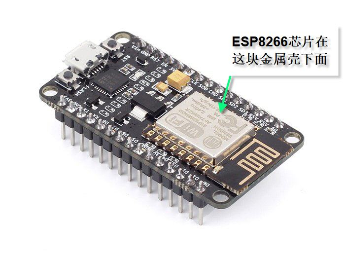
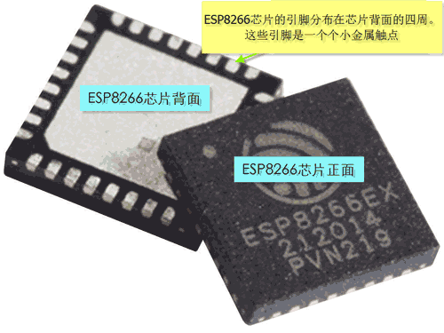
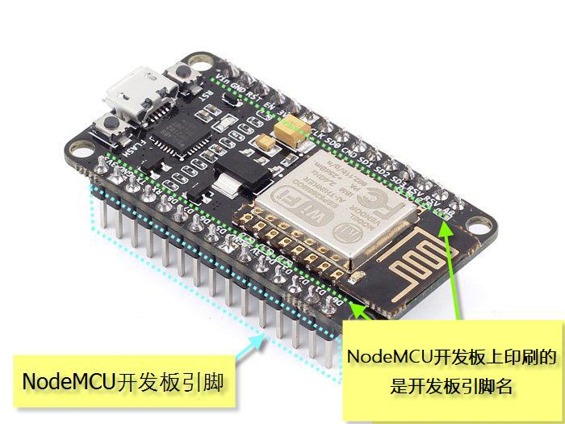
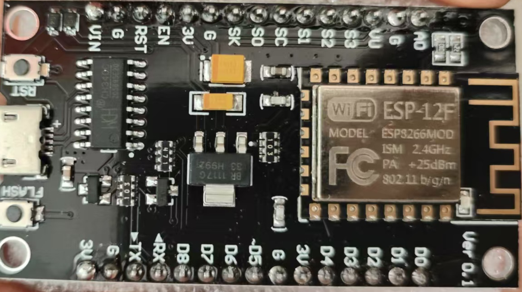
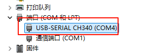
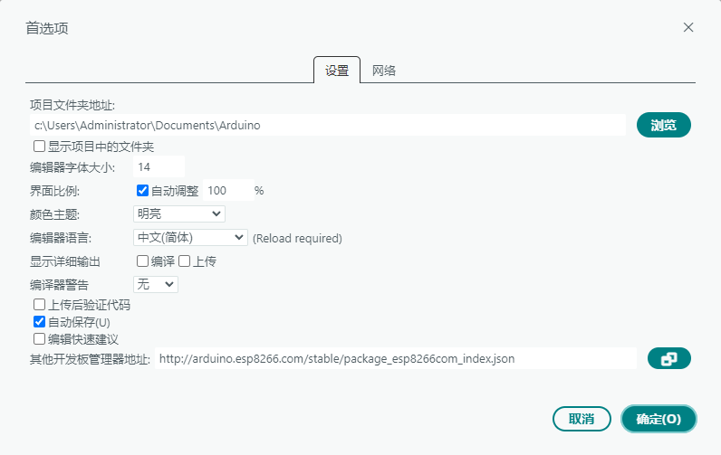
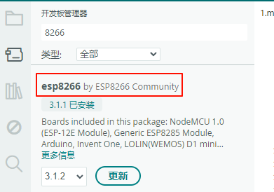
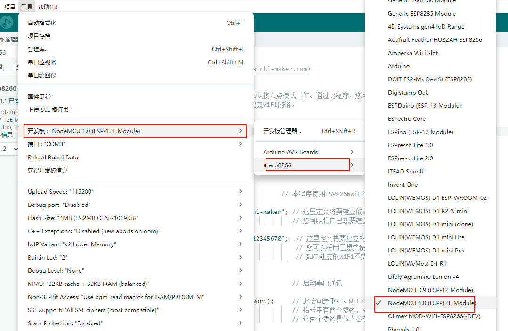
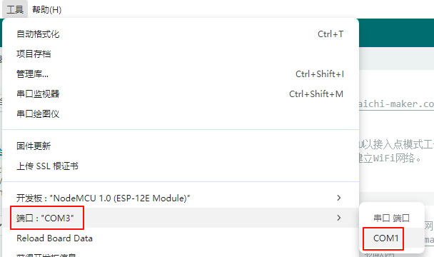

## 1. ESP8266

### 1.1 ESP8266和NodeMCU的关系

ESP8266是一块芯片：



而NodeMCU则是以ESP8266芯片为核心的开发板：



要想对ESP8266芯片来进行实验操作是很困难的，因为很难将小小一枚芯片上的引脚与电脑连接起来然后再进行上传程序等操作。

于是便诞生了围绕ESP8266芯片的各种开发板。NodeMCU就是这些开发板中的一员。

 NodeMCU开发板上的两排插针与ESP8266芯片的引脚是连在一起的。

### 1.2 NodeMCU开发板详解

#### 1.2.1 数字输入输出引脚（GPIO）

ESP8266芯片四周分布很多引脚。这些引脚大部分可用作输入输出使用。这些用作输入输出的引脚统称为**GPIO**。



ESP8266芯片的GPIO引脚可用作数字输入来读取引脚电平，也可用作数字输出向外围电路发出控制信号。在这一点上，GPIO引脚与Arduino开发板的引脚功能十分类似。

当引脚以数字输出模式工作时，低电平是0V (灌电流)，高电平是3.3V (拉电流)。

#### 1.2.2 GPIO编号与NodeMCU开发板引脚名的区别

GPIO编号指的是ESP8266芯片的引脚编号，而NodeMCU引脚名指的是电路板上印刷的引脚名称。



NodeMCU开发板的引脚名指的是开发板上印刷的文字。通常这些引脚名都是一个字符接一个数字的组合，如：D0、D1、A0… 

#### 1.2.3 ESP8266 GPIO编号与NodeMCU开发板引脚名的对应关系


上图片中深蓝底白色字的标识就是GPIO引脚编号。如“NodeMCU-GPIO4 ”。而开发板上所印刷的D2,D3等等就是NodeMCU开发板引脚名称。

引脚操作：

```c
digitalWrite（4，HIGH);
```

以上语句通过digitalWrite函数将引脚4设置为高电平。这里的4指的是GPIO4而不是D4。该语句实际是将NodeMCU开发板的D2引脚设置为高电平。因为D2对应的时GPIO4。

#### 1.2.4 可用引脚

ESP8266芯片有17个GPIO引脚（GPIO0～GPIO16）。这些引脚中的GPIO6～GPIO 11被用于连接开发板的闪存（Flash Memory），因此不建议使用这些引脚。

#### 1.2.5 电压电流限制

NodeMCU开发板引脚的输入输出电压限制是3.3 V。如果向引脚施加3.6V以上的电压就有可能对芯片电路造成损坏。同时请注意，这些引脚的最大输出电流是12mA。

由于NodeMCU开发板的引脚允许电压和电流都是低于Arduino开发板的引脚，所以想要将NodeMCU与Arduino引脚相互连接，请特别注意这两个开发板的引脚电压和电流的区别。如果操作不当可能会损坏NodeMCU开发板。

#### 1.2.6 特殊引脚情况说明

1. GPIO2引脚在NodeMCU开发板启动时是不能连接低电平。
2. GPIO15引脚在开发板运行中一直保持低电平状态。因此请不要使用GPIO15引脚来读取开关状态或进行I²C通讯。
3. GPIO0引脚在开发板运行中需要一直保持高电平状态。否则ESP8266将进入程序上传工作模式也就无法正常工作了。但无需对GPIO0引脚进行额外操作，因为NodeMCU的内置电路可以确保GPIO0引脚在工作时连接高电平而在上传程序时连接低电平。

#### 1.2.7 上拉电阻/下拉电阻

GPIO 0-15引脚都配有内置上拉电阻。这一点与Arduino十分类似。

GPIO16 引脚配有内置下拉电阻。

#### 1.2.8 模拟输入

ESP8266 只有一个模拟输入引脚（该引脚通过模拟-数字转换将引脚上的模拟电压数值转化为数字量）。此引脚可以读取的模拟电压值为 0 – 1.0V。

请注意：ESP8266 芯片模拟输入引脚连接在1.0V以上电压可能损坏ESP8266芯片。

以上所描述的是针对ESP8266芯片的引脚。而对于NodeMCU开发板引脚，情况就不同了。

NodeMCU开发板配有降压电路,可以用NodeMCU开发板的模拟输入引脚读取0-3.3V的模拟电压信号。

#### 1.2.9 通讯

**串行端口:**

ESP8266有2个硬件串行端口（UART）。

1. 串行端口0（UART0）使用GPIO1和GPIO3引脚。其中GPIO1引脚是TX0，GPIO3是RX0。

2. 串行端口1（UART1）使用GPIO2和GPIO8引脚。其中GPIO2引脚是TX1，GPIO8是RX1。请注意，由于GPIO8被用于连接闪存芯片，串行端口1只能使用GPIO2来向外发送串行数据。

**I²C**

ESP8266只有软件模拟的I²C端口，没有硬件I²C端口。

也就是说可以使用任意的两个GPIO引脚通过软件模拟来实现I²C通讯。ESP8266的数据表（datasheet）中，GPIO2标注为SDA，GPIO14标注为SCL。

**SPI**

ESP8266的SPI端口情况如下：

GPIO14 — CLK
GPIO12 — MISO
GPIO13 — MOSI
GPIO 15 — CS(SS)

**ESP8266引脚功能一览**

| GPIO   | 功能              | 状态   | 限制                                |
| ------ | --------------- | ---- | --------------------------------- |
| 0      | 引导模式选择          | 3.3V | 无Hi-Z                             |
| 1      | TX0             | –    | 串口通讯过程中不能使用                       |
| 2      | 引导模式选择  <br>TX1 | 3.3V | 启动时不能接地  <br>启动时发送调试信息            |
| 3      | RX0             | –    | 串口通讯过程中不能使用                       |
| 4      | SDA (I²C)       | –    | –                                 |
| 5      | SCL (I²C)       | –    | –                                 |
| 6 – 11 | 连接闪存            | x    | 不可用                               |
| 12     | MISO (SPI)      | –    | –                                 |
| 13     | MOSI (SPI)      | –    | –                                 |
| 14     | SCK (SPI)       | –    | –                                 |
| 15     | SS (SPI)        | 0V   | 上拉电阻不可用                           |
| 16     | 睡眠唤醒            | –    | 无上拉电阻，仅有下拉电阻  <br>连接 RST 引脚实现睡眠唤醒 |

## 2.ESP8266物联网开发基础

基于下面这块板子（与太极创客的有所不同）：



### 2.1 安装开发板驱动

教程说NodeMCU不是即插即用的，需要安装驱动，但是我的插上可以直接用，不知道是不是因为开发板不同的原因。总之，设备管理器可以看到开发板COM端口即可正常开发。



### 2.2 Arduino环境搭建

不同版本的Arduino操作过程不同，总结操作内容，主要有四点：

1. 添加开发板管理地址：
	- 
	- `http://arduino.esp8266.com/stable/package_esp8266com_index.json`
2. 下载8266管理器：
	- 
3. 选择对应的开发板：
	- 
4. 选择对应的端口：
	- 

搭建好环境后，可以上载Blink示例程序进行验证。

