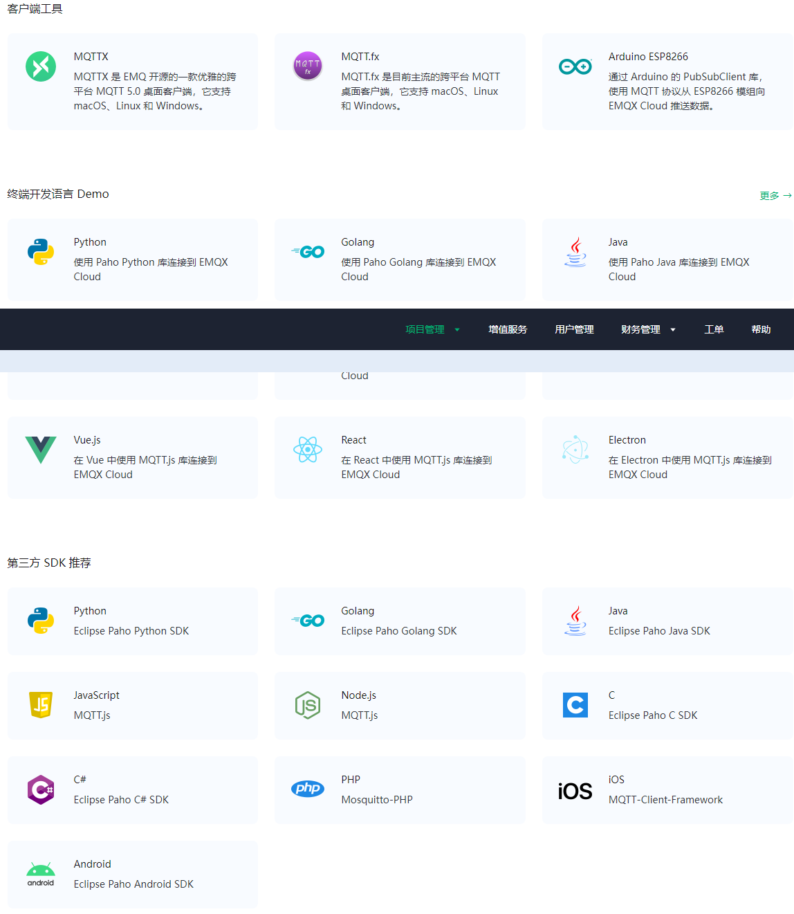

## MQTT

### 简介

MQTT（Message Queuing Telemetry Transport）是一种轻量级、基于发布-订阅模式的消息传输协议，适用于资源受限的设备和低带宽、高延迟或不稳定的网络环境。它在物联网应用中广受欢迎，能够实现传感器、执行器和其它设备之间的高效通信。

### MQTT 的工作原理

#### MQTT 客户端

任何运行 [MQTT 客户端库](https://www.emqx.com/zh/mqtt-client-sdk)的应用或设备都是 MQTT 客户端。例如，使用 MQTT 的即时通讯应用是客户端，使用 MQTT 上报数据的各种传感器是客户端，各种 [MQTT 测试工具](https://www.emqx.com/zh/blog/mqtt-client-tools)也是客户端。

1. 常见客户端：
    - 
2. mqtt explorer：[mqtt explorer](https://mqtt-explorer.com/)
3. MQTTX客户端
    1. 下载地址：[Releases · emqx/MQTTX (github.com)](https://github.com/emqx/MQTTX/releases)
        - 
    2. 使用教程：[MQTTX 桌面客户端使用指南 | EMQ (emqx.com)](https://www.emqx.com/zh/blog/mqtt-x-guideline)

#### MQTT Broker

MQTT Broker 是负责处理客户端请求的关键组件，包括建立连接、断开连接、订阅和取消订阅等操作，同时还负责消息的转发。一个高效强大的 MQTT Broker 能够轻松应对海量连接和百万级消息吞吐量，从而帮助物联网服务提供商专注于业务发展，快速构建可靠的 MQTT 应用。

- 使用EMQX的云服务器：MQTT Cloud：[EMQX Cloud 控制台](https://cloud.emqx.com/console/deployments/qbb8e2f6/overview)
- 本地安装一个EMQX服务器：Docker：[Deploy with Docker | EMQX 5.1 Documentation](https://www.emqx.io/docs/en/v5.1/deploy/install-docker.html#use-docker-to-run-a-single-emqx-node)

#### 发布-订阅模式

发布-订阅模式与客户端-服务器模式的不同之处在于，它将发送消息的客户端（发布者）和接收消息的客户端（订阅者）进行了解耦。发布者和订阅者之间无需建立直接连接，而是通过 MQTT Broker 来负责消息的路由和分发。

下图展示了 MQTT 发布/订阅过程。温度传感器作为客户端连接到 MQTT Broker，并通过发布操作将温度数据发布到一个特定主题（例如 `Temperature`）。MQTT Broker 接收到该消息后会负责将其转发给订阅了相应主题（`Temperature`）的订阅者客户端。


#### 主题

MQTT 协议根据主题来转发消息。主题通过 `/` 来区分层级，类似于 URL 路径，例如：

```bash
chat/room/1
sensor/10/temperature
sensor/+/temperature
```

MQTT 主题支持以下两种通配符：`+` 和 `#`。

- `+`：表示单层通配符，例如 `a/+` 匹配 `a/x` 或 `a/y`。
- `#`：表示多层通配符，例如 `a/#` 匹配 `a/x`、`a/b/c/d`。

> **注意**：通配符主题只能用于订阅，不能用于发布。

#### QoS

MQTT 提供了三种服务质量（QoS —— 消息服务质量等级（Quality of Service）），在不同网络环境下保证消息的可靠性。

- QoS 0：消息最多传送一次。如果当前客户端不可用，它将丢失这条消息。
- QoS 1：消息至少传送一次。
- QoS 2：消息只传送一次。

### 工作流程

1. **客户端使用 TCP/IP 协议与 Broker 建立连接**，可以选择使用 TLS/SSL 加密来实现安全通信。客户端提供认证信息，并指定会话类型（Clean Session 或 Persistent Session）。
2. **客户端既可以向特定主题发布消息，也可以订阅主题以接收消息**。当客户端发布消息时，它会将消息发送给 MQTT Broker；而当客户端订阅消息时，它会接收与订阅主题相关的消息。
3. **MQTT Broker 接收发布的消息**，并将这些消息转发给订阅了对应主题的客户端。它根据 QoS 等级确保消息可靠传递，并根据会话类型为断开连接的客户端存储消息。
