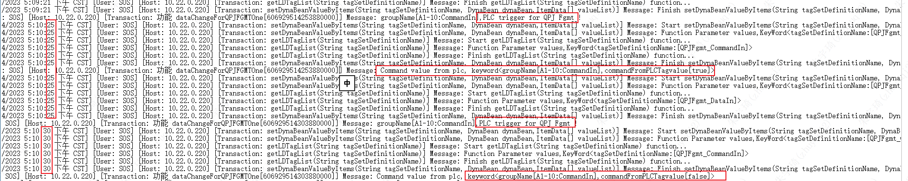
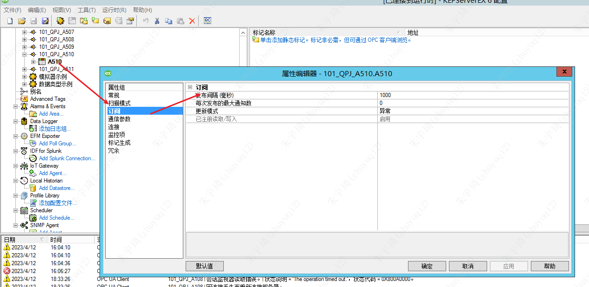
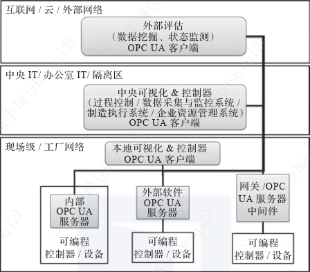
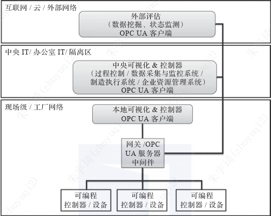
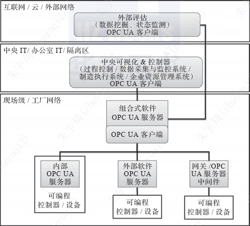
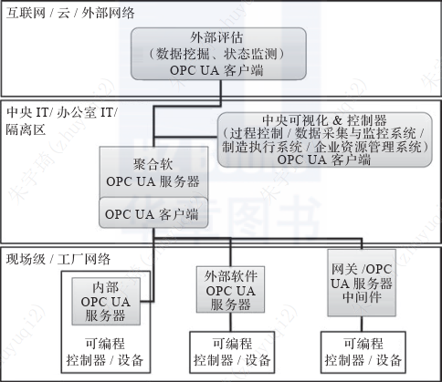
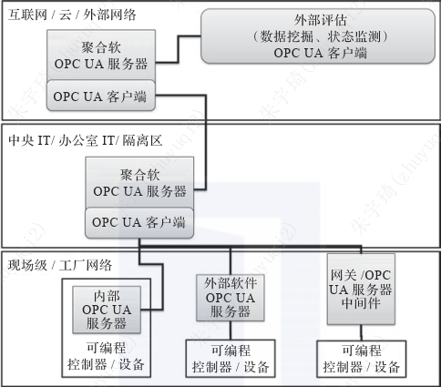
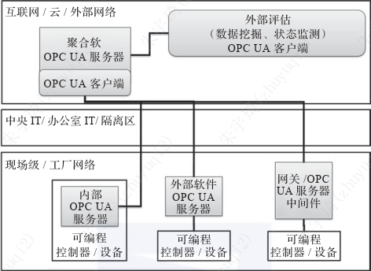
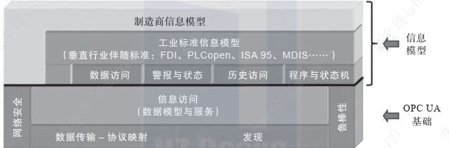

## OPC UA基础

### 出现背景

工业4.0和工业物联网主要要解决的问题是：解决设备、机器以及来自不同行业服务之间的安全和标准化的数据和信息交互。其中涉及到的数据的意义和对于数据的描述即信息建模。

以前情况下，不同的设备和机器之间都有一个信息模型：数据以及基于不同协议的通信接口。

2015年4月工业4.0参考架构模型将国际标准ICE 62541 OPC UA作为通信层实施的唯一推荐方案。

2016年11月工业4.0平台发布了指导纲要《工业4.0产品需要实现哪些准则》。要求所有产品必须能够基于OPC UA的信息模型，通过TCP/UDP或者IP协议进行访问。

所有符合工业4.0的产品，都内嵌或者网关支持OPC UA功能。

### OPC UA通信协议

OPC UA 是针对工业互操作性的一个框架结构。OPC UA本身未提供自定义的通信协议，而是基于现有的通信协议实现。

根据不同场景，OPC UA提供了两种机制实现数据交换：

- 客户端 - 服务端模型：客户端使用服务器授权的方式实现点对点通信。该模式下服务器和客户端之间的总连接数受限。
	- 使用协议：TCP和HTTP。
	- **ftsp连接kepserver是这种模式吗？数据值变化一次就相当于发送一次请求？**
		- 
- 发布者 - 订阅者模型：OPC UA服务器将一个可配置的信息子集提供给任意多个订阅者。无需信息接收方进行确认。
	- 使用协议：UDP、AMQP和MQTT。
	- kepserver连接OPC 应该为订阅者模式
		- 

绝大多数OPC UA都是基于分布式的客户端 - 服务端模型。

### OPC UA伴随标准

不同的设备厂商使用不同的数据和服务，OPC UA统一了这些数据和服务。但同时为了满足不同厂商的个性服务，OPC UA提供了满足标准模型之外扩展模型：能源模型、MES接口模型和其他模型。

同时，因为这些个性服务的存在，不同制造商及时满足了互操作性的行业标准，也不意味着数据具有可直接互换性。

### 发展

- SoA：信息模型不在基于位/字节进行信息交互，而是基于复杂数据类型的SoA服务。
- 服务到服务：设备可以直接与服务方进行数据交互。
- 小型化OPC UA：OPC UA从自动化核心领域扩展到其他行业，逐渐深入嵌入式设备。
- 基于TSN的OPC UA：基于TSN（时间敏感网络，Time-Sensitive Network）的OPC UA能够提供实时性保证。

## OPC UA理论基础

### 应用架构

架构：一个模型中所有元素的组合，并基于使用该模型进行设计和制造、后续开发和使用的原理和规则。

OPC UA统一架构提供了一种标准化、同步或一步，以及分布式的通信机制，在该机制下，允许横向或纵向对不同类型的数据进行访问。

绝大多数OPC UA都是基于分布式的客户端 - 服务端模型。

### 应用场景

下述场景并不全面，实际应用中也存在混合架构或者组合架构的情况（即使理论上不合理）。

#### 场景一：独立的内部OPC UA服务器

每台PLC、设备、机器或成套装备都有自己的OPC UA服务器，每台服务器上的信息模型由服务器提供商指定。

#### 场景二：共享外部软件OPC UA服务器

不同的PLC、设备、机器或成套装备共享一个外部的OPC UA服务器。

#### 场景三：共享中间件OPC UA服务器/外部网关

不同的PLC、设备、机器或成套装备共享一个外部的网关或OPC UA服务器中间件。

#### 场景四：集合软OPC UA服务器

不同的PLC、设备、机器或成套装备共享一个聚合的OPC UA服务器。

该场景常用语连接企业MES或ERP。

#### 场景五：不同网段聚合软OPC UA服务器

同四，不同之处在于OPC UA服务器运行在一个远程网络中，因而网络配置不同，可以设定更高的网络安全性以及访问权限的管理。

**公司应该采用了此种架构：其中设备使用10.22.1336.xxx网段，KEPServer和FTPS、MES服务使用了10.22.0.xxx网段，进行安全隔离。**

#### 场景六：外网多重软OPC UA服务器

#### 场景七：外网聚合软OPC UA服务器

### OPC UA行业伴随标准

行业伴随标准：特定利益团体定义并遵循更多相关规则的信息模型，称为行业伴随标准。位于工业标准模型之下。

OPC基金会只定义了一些基础类型，这些基础类型可以衍生出新的对象和类型。为了尽可能提高市场接受度和使用程度，OPC基金会与众多行业机构开展合作，在信息模型基础上建立了与行业标准相关的工业标准信息模型：

#### 伴随标准大类一

关注系统体系结构，如网络架构的描述、分层组织架构，帮助人们更容易描述和理解一个制造系统的逻辑或者物理体系结构。

- AutomationML
- FDI
- IEC 61850

#### 伴随标准大类二

关注设备本身的配置和描述，预先设定了一个用于描述设备的基础结构（包括参数和方法），并由此对组件、参数和方法等功能（配置、维护、诊断）进行组合。

- 分析仪器（ADI）
- Euromap77
- AutoID
- PackML
- CNC Systems
- PLCopen（PLC设备模型）

## 补充知识

### 概念

工业4.0：
工业物联网：
OPC：
OPC UA：
信息建模：数据的意义和对于数据的描述。
SOA：
伴随标准：
信息模型：描述数据和信息在OPC UA地址控件内是如何被管理的。

### 扩展

《工业4.0产品需要实现哪些准则》：
工业4.0平台：
工业4.0参考架构模型：RAMI 4.0，Reference Architecture Model for Industry 4.0。
