## 1. linux配置

虚拟机已经配置了静态ip：192.168.171.128。执行`docker ps`查看启动的容器服务，本项目需要启动的项目有：

1. mysql：保存指标、报警、看板、用户信息。
2. elasticsearch和kibana：保存设备信息，kibana是elasticsearch的可视化web端工具。
3. emqx：设备与亿可控项目之间的通信broker
4. influxdb：保存设备的指标信息
5. redis：mybatis缓存及数据透传的一些信息保存在这里。
6. consul：springcloud的配置中心和服务发现中心

## 2. 前端配置

### 2.1 确定后台服务地址

1. 执行npm install，注意npm包地址最好用原地址，不要用镜像地址。
2. 前端只需要确认proxy的地址是不是localhost:9093，其他的不需要动。
3. nodejs使用16以下，推荐12（但是我没试过）

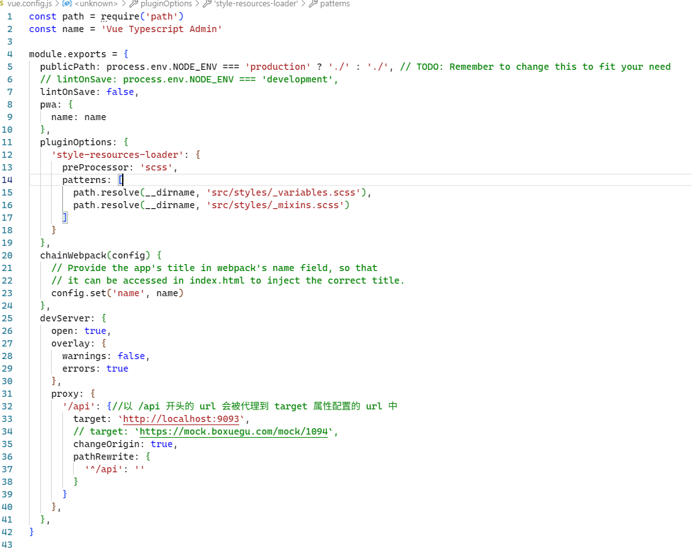

关于其他方面的解惑如下：

1. 这个项目的api文件夹下的地址都自带了/api路径，因此不需要启用.env文件的内容。

    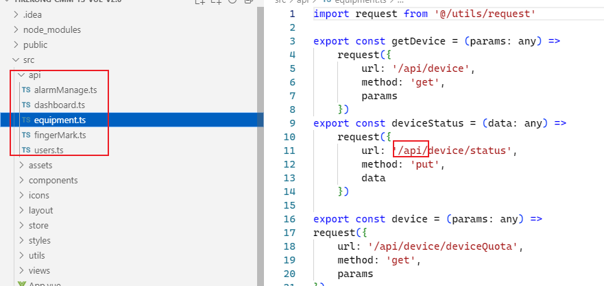
    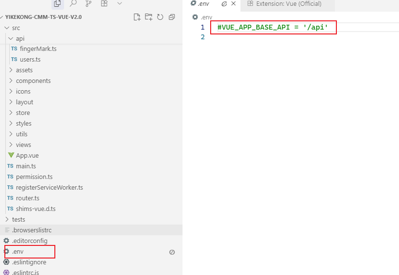

2. .env文件夹的内容被注释掉了，因此router.js文件夹中的base地址不会解析到/api路径

    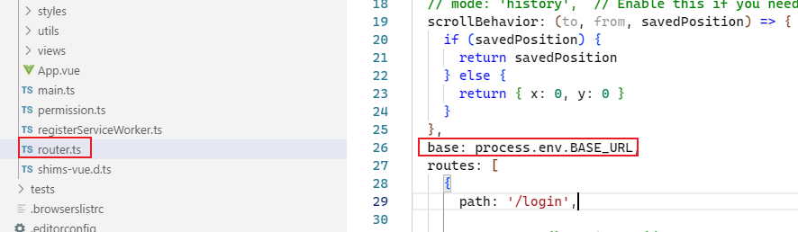

### 2.2 看板界面emq地址设置

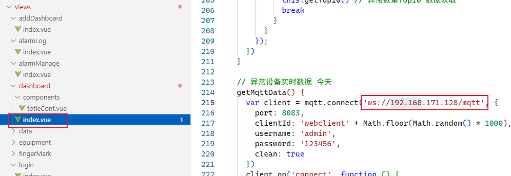

## 3. 配置文件

### 3.1 consul地址配置

只有配置了consul地址，才能加载到consul配置中心的配置文件。

在ykk-common的bootstrap.yml文件中：

```
spring:
  main:
    allow-bean-definition-overriding: true
  cloud:
    consul:
      discovery:
        service-name: ${spring.application.name}
        instance-id: ${spring.application.name}:${vcap.application.instance_id:${spring.application.instance_id:${random.value}}}
        prefer-ip-address: true
        health-check-interval: 10s
        enabled: true
        register: true
        health-check-critical-timeout: 2m #2分钟之后健康检查未通过取消注册
      host: 192.168.171.128 #${CONSUL-HOST:192.168.200.128}
      port: ${CONSUL-PORT:8500}
      config:
        enabled: true
        format: yaml
        prefix: config
        data-key: data
        fail-fast: false
        watch:
          enabled: true
          wait-time: 55
          delay: 5000
```

根据需要，修改host和port的地址，${CONSUL-PORT:8500}表示如果在配置文件配置了CONSUL-PORT，则使用配置文件中指定的，如果没有配置，则使用默认的8500。

### 1.2.2 application.yml配置

登录bootstrap.yml中配置的consul地址（192.168.171.128）

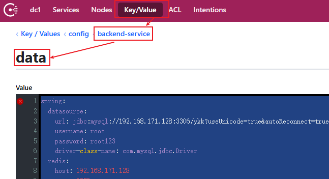

```
spring: 
  datasource:
    url: jdbc:mysql://192.168.171.128:3306/ykk?useUnicode=true&autoReconnect=true&autoReconnectForPools=true&characterEncoding=utf8&serverTimezone=Asia/Shanghai
    username: root
    password: root123
    driver-class-name: com.mysql.jdbc.Driver
  redis:
    host: 192.168.171.128
    port: 6379
    database: 0
    lettuce:
      pool:
        max-active: 10
        max-wait: -1
        max-idle: 5
        min-idle: 1
      shutdown-timeout: 100
    timeout: 1000
    password:  
  elasticsearch:
    rest:
      uris: http://192.168.171.128:9200
  influx:
    db: ykk
    url: http://192.168.171.128:8086
    user: root
    password: root

es:
  hostname: 192.168.171.128
  port: 8200

emq:
  mqttServerUrl: tcp://192.168.171.128:1883
  mqttPassword: 123456
  host: 192.168.200.128:8081

mybatis-plus:
  configuration:
    cache-enabled: true  
    log-impl: org.apache.ibatis.logging.stdout.StdOutImpl
#webhook:
  #online: http://www.lkd.com/device/online #数据透传目的地的业务地址
  #gps: http://www.lkd.com/device/gps #数据透传目的地的业务地址
```

### 1.2.3 emq的webhook配置

webhook是emq中设备断联自动给服务发送报警信息的插件。

1. 执行docker ps，查看emq的id：

    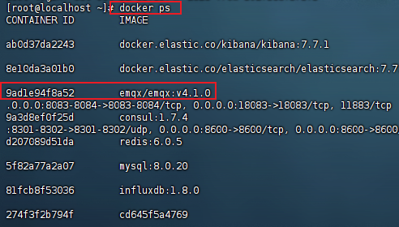

2. 进入emq容器：`docker exec -it 9ad /bin/sh`
3. 执行`vi etc/plugins/emqx_web_hook.conf`编辑emq的webhook地址。

    ```
    ##====================================================================
    ## WebHook
    ##====================================================================

    ## The web services URL for Hook request
    ##
    ## Value: String
    web.hook.api.url = http://192.168.33.1:9093/device/clientAction

    ## Encode message payload field
    ##
    ## Value: base64 | base62
    ## web.hook.encode_payload = base64

    ##--------------------------------------------------------------------
    ## Hook Rules

    ## These configuration items represent a list of events should be forwarded
    ##
    ## Format:
    ##   web.hook.rule.<HookName>.<No> = <Spec>
    web.hook.rule.client.connect.1       = {"action": "on_client_connect"}
    web.hook.rule.client.connack.1       = {"action": "on_client_connack"}
    web.hook.rule.client.connected.1     = {"action": "on_client_connected"}
    web.hook.rule.client.disconnected.1  = {"action": "on_client_disconnected"}
    web.hook.rule.client.subscribe.1     = {"action": "on_client_subscribe"}
    web.hook.rule.client.unsubscribe.1   = {"action": "on_client_unsubscribe"}
    web.hook.rule.session.subscribed.1   = {"action": "on_session_subscribed"}
    web.hook.rule.session.unsubscribed.1 = {"action": "on_session_unsubscribed"}
    web.hook.rule.session.terminated.1   = {"action": "on_session_terminated"}
    web.hook.rule.message.publish.1      = {"action": "on_message_publish"}
    web.hook.rule.message.delivered.1    = {"action": "on_message_delivered"}
    web.hook.rule.message.acked.1        = {"action": "on_message_acked"}
    ```

    - `web.hook.api.url = http://192.168.33.1:9093/device/clientAction`：
        - 192.168.33.1:9093是亿可控后台服务的地址和端口号。
        - /device/clientAction是亿可控后台服务，发生断联时请求的发送地址。

4. 登录emq的web端管理页面，在插件界面搜索webhook，点击启用。

    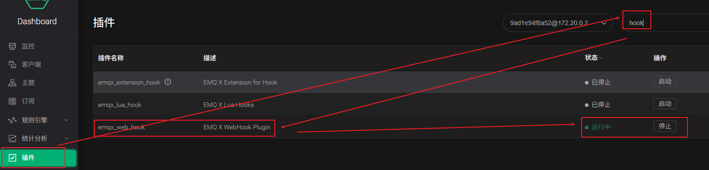

## 4. 数据库配置

### 4.1 tb_quota表

tb_quota（指标表）的配置跟报文格式相关，规定了报文json的key名，本项目中报文案例如下：

```json
temperature{
    "sn":123123,
    "temp":12
}
```

> temperature是报文的topic，sn代表设备编号，temp代表温度的key。
>
> 对应的tb_quota表时，报文的topic对应表的subject字段，报文的temp对应表的sn_key字段。其他字段的含义可以参考前端页面创建指标的表单名：
>
> 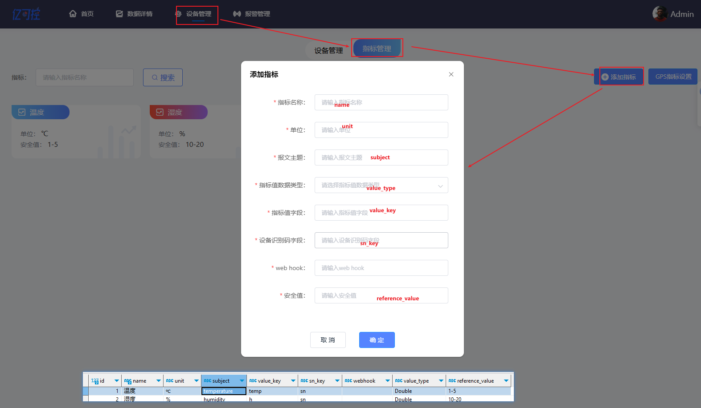
>
> 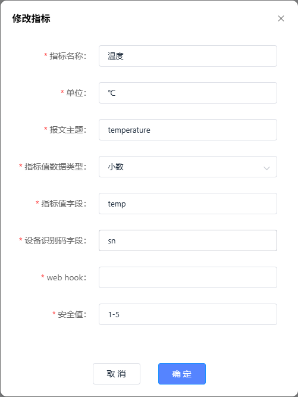

### 4.2 tb_gps表

tb_gps（指标表）的配置跟报文格式相关，规定了报文json的key名，本项目中报文案例如下：

  ```json
  gps{
      "sn":123123,
      "lon":12,
      "lat":12
  }

  或
  
  gps{
      "sn":123123,
      "gps":12,12
  }
    ```

> 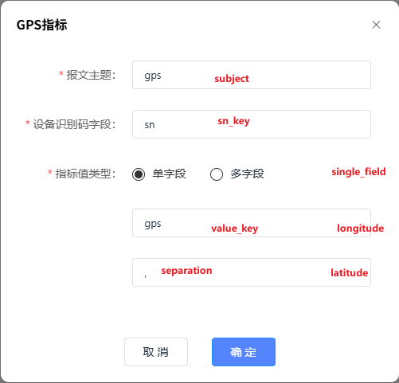

### 4.3 tb_alarm表

tb_alarm（报警表）的设置跟报文无关，本项目中设置如下：

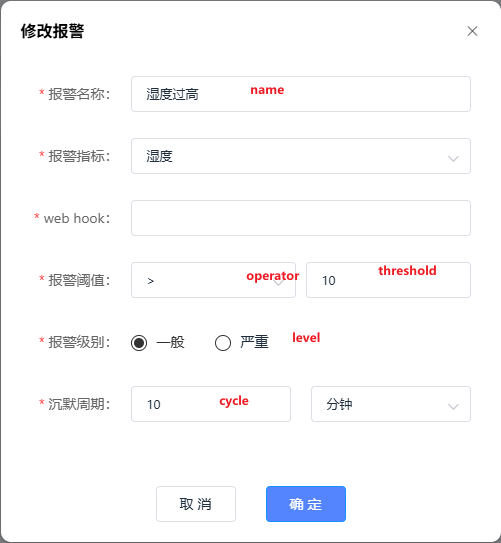

### 4.4 tb_admin表

由于本项目没有注册页面，只有一个admin账号，查看前端的login/index.vue页面，默认的账号密码均为admin：

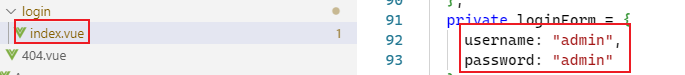

执行后台服务的TestLogin.java的testLogin()，复制打印的编码，粘贴到数据库中，作为密码。

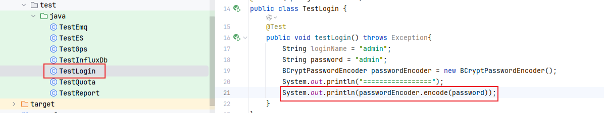

## 5. 百度地图配置

登录百度地图控制台，创建新的应用，选择为浏览器端，复制AK码。

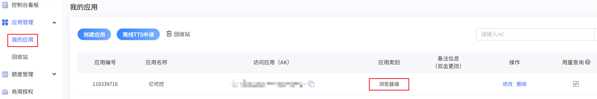

不知道的话选择全选：

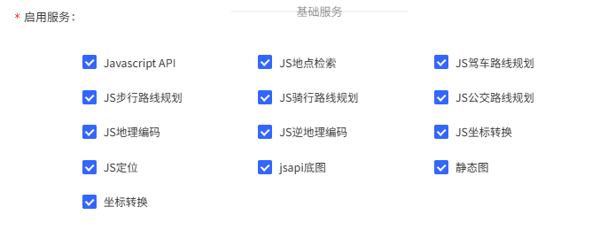

Referer白名单没有限制的话写*：


将前台components/baidu/index.vue页面的AK，设置为百度sdk的ak

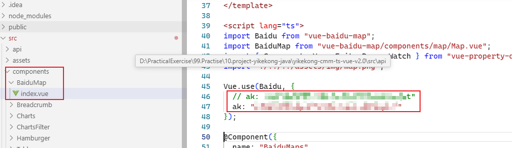

## 6. 其他

### 6.1 关闭模拟数据

后台有个Mock.java文件，是测试用的，注释掉代码就可以了。

### 6.2 浏览器访问

如果浏览器不显示百度地图，更换浏览器试试。

### 6.3 虚拟机资源

地址：[linux虚拟机](https://cloud.189.cn/t/jUBBbqJfIfUb（访问码：3pcp）)

### 6.4 项目地址

地址：[Gitee-yikekong](https://gitee.com/sk370/yikekong)

**总结：至此，已经完成了项目的所有配置，可以正常启动了。启动效果如下：**

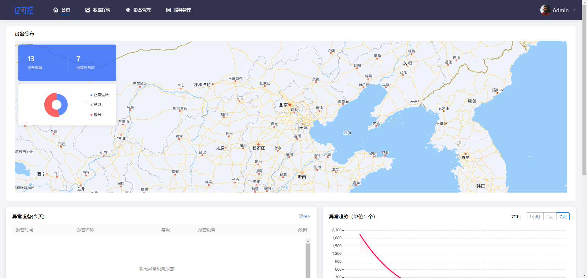
