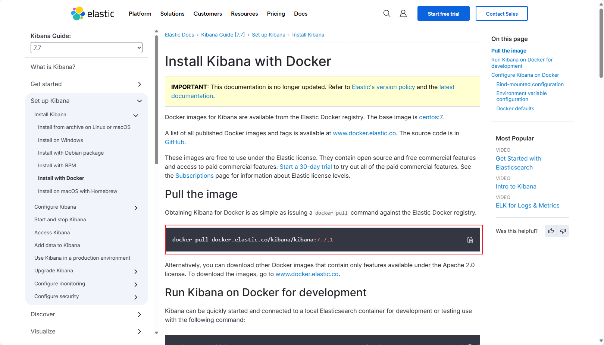
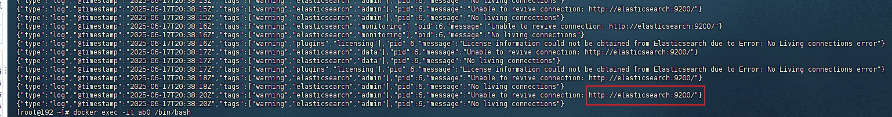
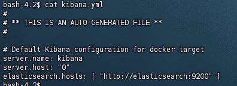
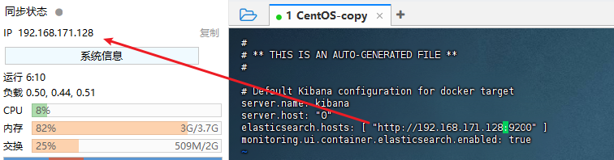

## 2025-06-19 

### vue2环境变量配置

[Title](https://www.bilibili.com/video/BV15W4y1f7Uo?spm_id_from=333.1387.favlist.content.click)

### vue3（vite）配置环境变量

[Title](https://www.bilibili.com/video/BV18d4y1F7Em?spm_id_from=333.1387.favlist.content.click)

### docker不能访问在线镜像库解决办法

这里指的是修改docker配置文件中的镜像地址已经不起作用。

#### 方法一：查看官方镜像拉取方式

一般都会指定拉取地址，而不是从在线镜像库：

#### 方法二：下载离线镜像，上传到服务器进行加载

*TODO:还没学会*

### kibana提示Kibana server is not ready yet

1. 步骤一：`docker logs kibana`查看日志

2. 步骤二：`docker exec -it kibana bash`进入容器

3. 步骤三：`cat /usr/share/kibana/config/kibana.yml`查看配置文件

4. 步骤四：`vi /usr/share/kibana/config/kibana.yml`修改配置文件

5. 步骤五：`docker restart kibana`重启kibana

## 2025-06-21

### JWT校验

[Title](https://www.bilibili.com/video/BV1cK4y197EM?spm_id_from=333.1387.favlist.content.click)

## 2025-06-22

### 首页加载的实现过程

1. 启动工程，访问根目录
2. 通过`permission.ts`转发请求路径为"/login"，并记录原始地址

### 登录的实现过程

