## 0. 博图了解

博图v18下载地址：`https://pan.baidu.com/s/1dVbf_6r5g3aINbjBi5O6zw?pwd=848h`

[Siemens 西门子博途、经典wincc、经典SETP7的区别](https://www.cnblogs.com/ybqjymy/p/17613513.html)

[【软件安装】11分钟学会博途V18软件安装（包含仿真和你懂得）](https://www.bilibili.com/video/BV1UY411m7Pf/?spm_id_from=333.337.search-card.all.click)

## 1. 博图v18安装

需要安装的软件：

- TIA_Portal_STEP7_Prof_Safety_WINCC_Adv_V18（必装）
- SIMATIC_PLCSIM_Advanced_V5（必装）

1. 准备工作：

	1. 控制面板打开：.NET FRAMEWORK3.5
	2. 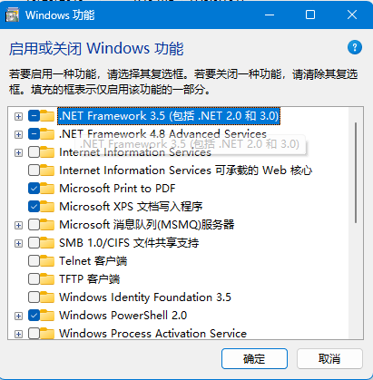

2. TIA_Portal_STEP7_Prof_Safety_WINCC_Adv_V18安装：

	1. 解压缩所有文件：
		1. 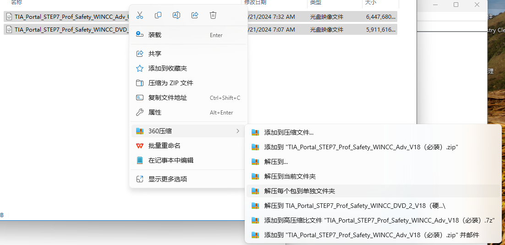
        2. （2025-07-24）测试可以只安装`TIA_Portal_STEP7_Prof_Safety_WINCC_Adv_Unified_V18`
	2. 注册表删除pending对象
		1. 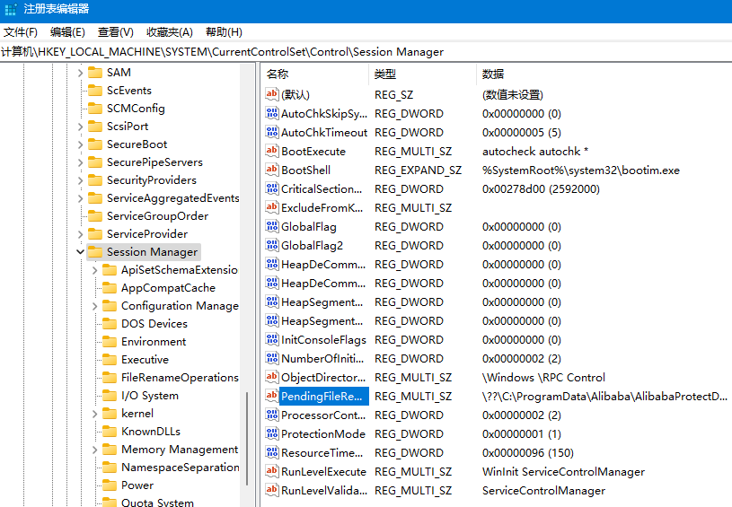

	3. 一路默认：
		1. 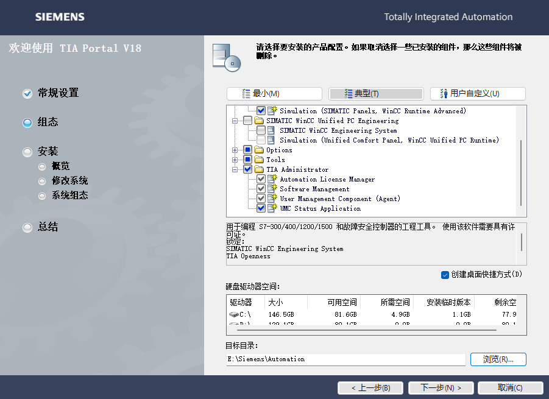
	4. 继续在注册表删除pending对象
	5. 安装完成的图标
		1. 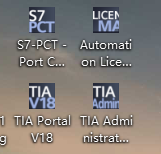

3. 安装SIMATIC_S7-PLCSIM_V18（仿真）

    1. 注册表删除pending对象
    2. 一路默认（安装路径与上面一致）
        1. 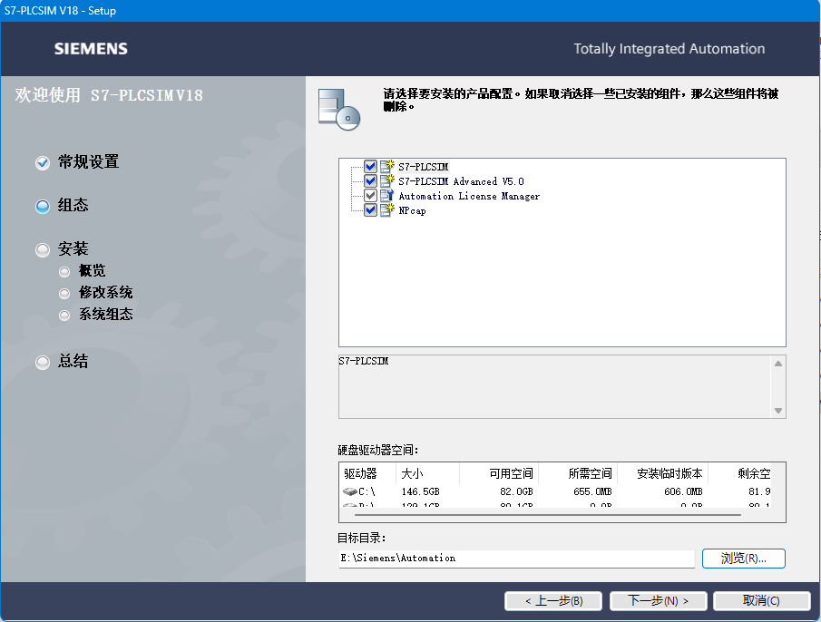
    3. 继续在注册表删除pending对象
    4. 安装完成图标（下面两个）
        1. 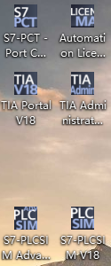

4. 安装STARTDRIVE_ADVANCED_V18（驱动）

    1. 注册表删除pending对象
    2. 一路默认（安装路径会自动选择到与上面一致）
        1. 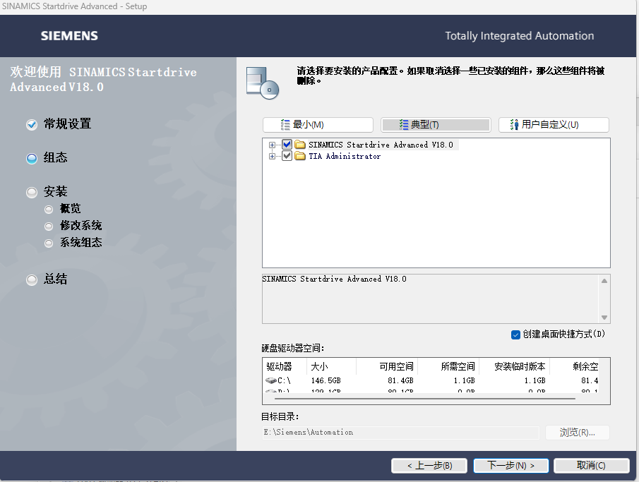
    3. 继续在注册表删除pending对象
    4. 安装完成图标
        1. 

5. 激活：

    1. 运行Sim_EKB_Install_2022_11_27
    2. 安装长秘钥（新版博图不需要安装短秘钥）
        1. 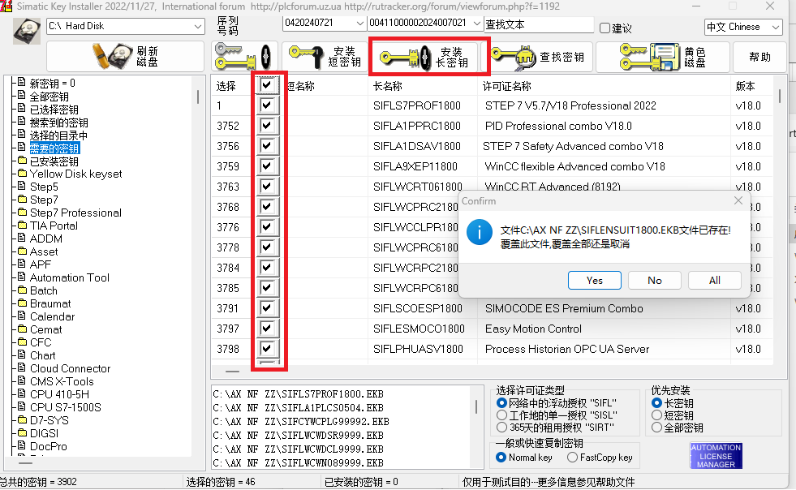

## 2. 博图v18使用

### 2.1 新建项目

1. 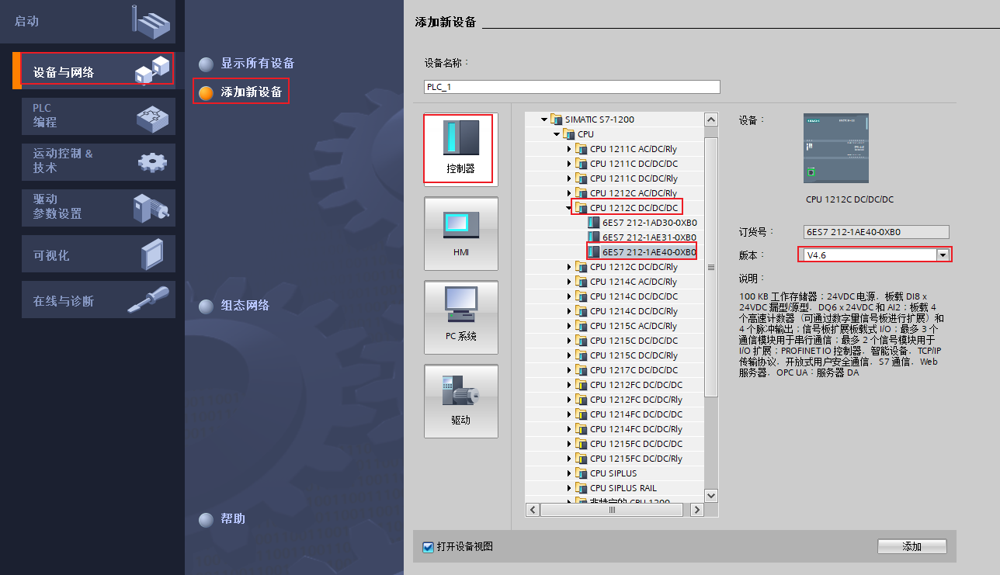

    a. 这里选择CPU 1212C DC/DC/DC下的第三个原因是，没有PLC实物，想要使用虚拟仿真，版本需要在4.0以上

2. 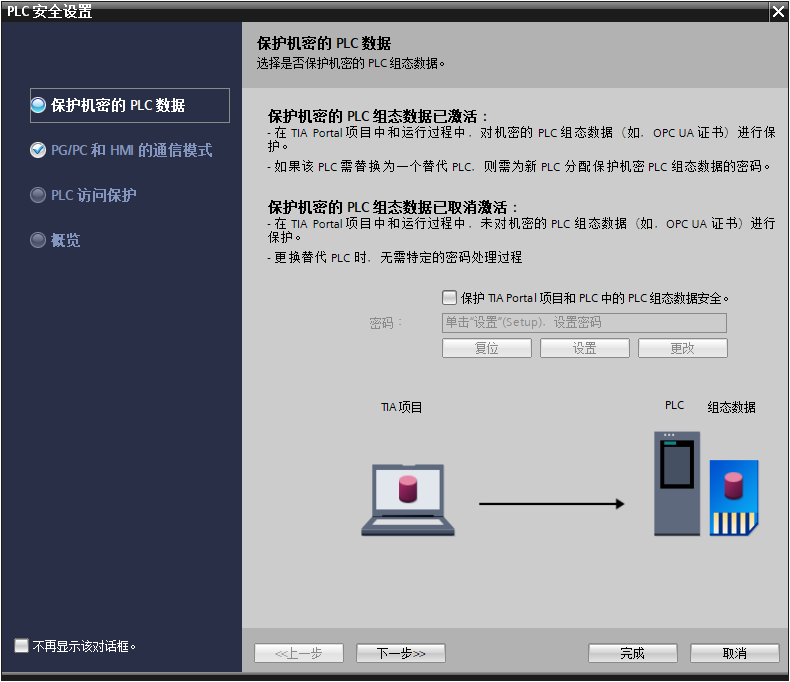
3. 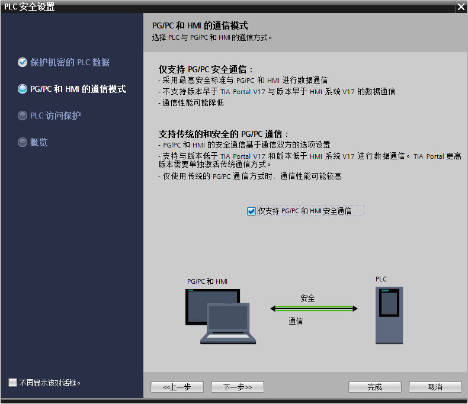
4. 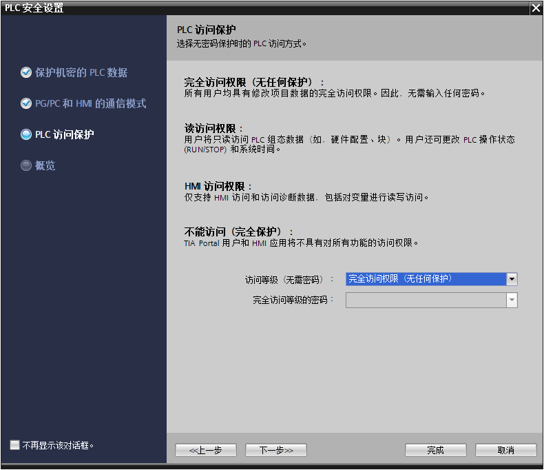

### 2.2 启动仿真

#### 2.2.1 方式一

1. 管理员身份运行
        a. 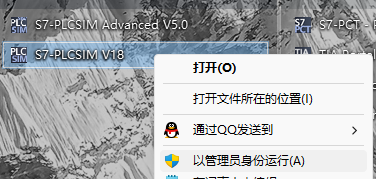
2. 选中程序块，启动仿真（也可以直接进入这一步）
    a. 启动仿真前，需要先编译→保存→仿真
    b. 如果不是选中程序块，而是选中PLC，则启动仿真时，会进入PLC连接界面，由于没有启动的PLC，导致进行不下去。
3. 下载程序
    a. 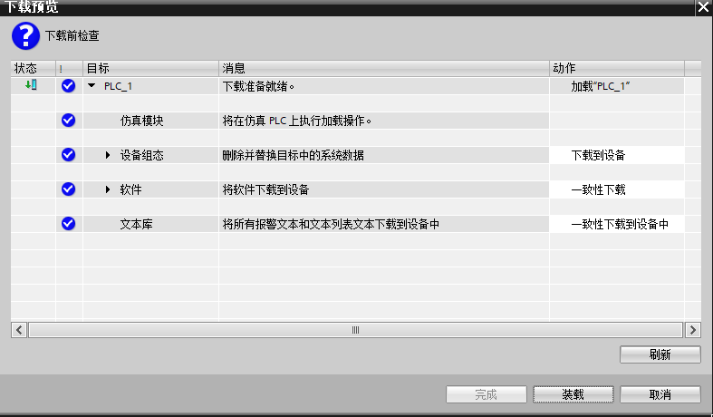
4. 运行仿真软件：
    a. 
5. 查看仿真
    a. 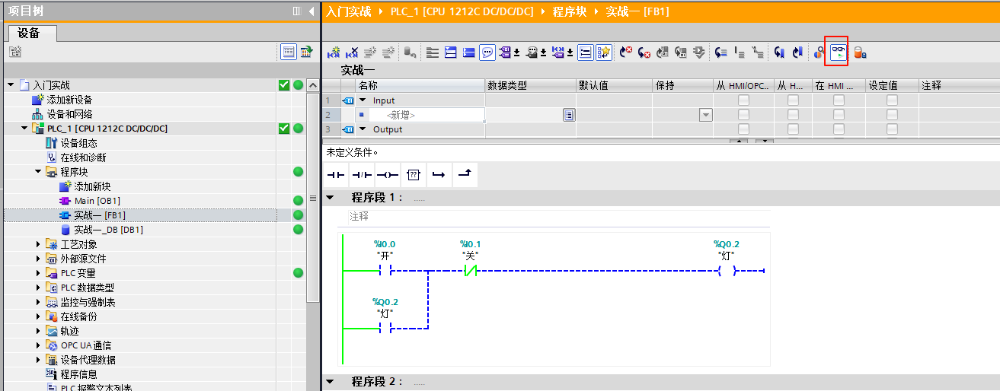
6. 修改仿真数据：
    a. 如果要在程序块界面直接修改，由于没有实物PLC连接，需要在变量表中奖输入和输出的数据地址写为M，I或Q无法使用。
    b. 如果在S7-PLC SIM中的变量表中修改，则使用I或Q没有问题
        i. 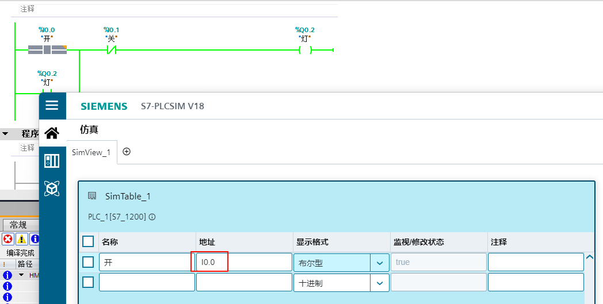

#### 2.2.2 方式二

1. 