## 1. 低压电器

### 1.1 开关

1. 作用：接通和切断电气电路。
2. 分类：照明开关、按钮开关、闸刀开关、铁壳开关、组合开关

| 类别     | 图片                                              |
| ------ | ----------------------------------------------- |
| 照明开关   | 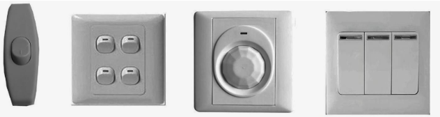                   |
| 按钮开关   | 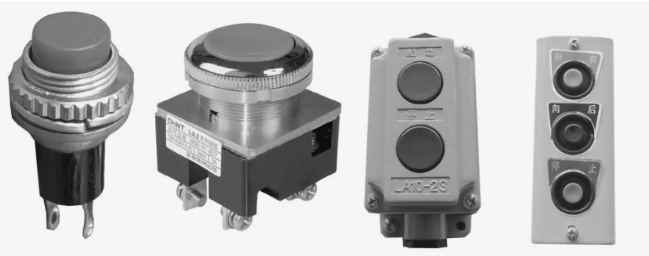                 |
| 闸刀开关   | 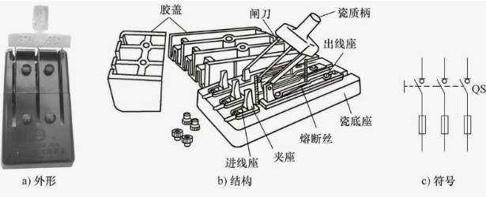                 |
| 铁壳开关   | 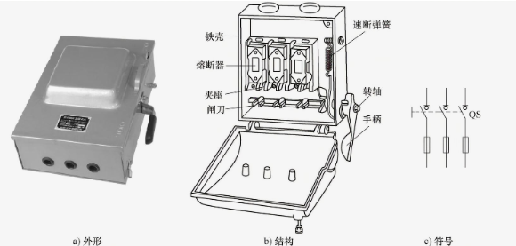                        |
| 组合开关   | 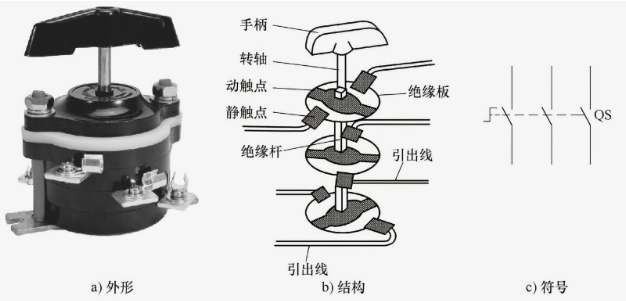                      |
| 倒顺开关   | 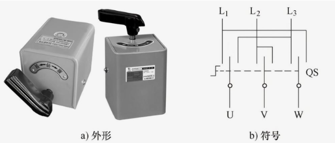                      |
| 万能转换开关 | 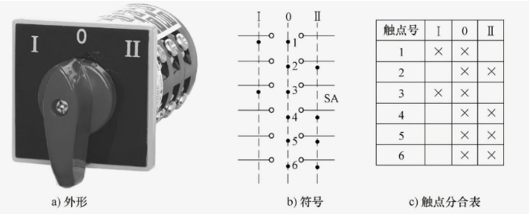                      |
| 行程开关   |                       |
| 接近开关   | 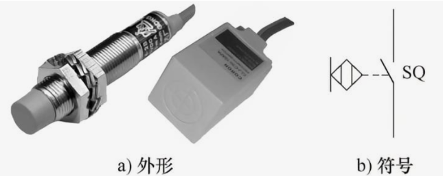 |

### 1.2 熔断器

1. 作用：对电路、用电设备短路和过载进行保护的电路。
2. 分类：

| 类别           | 图片                                              |
| ------------ | ----------------------------------------------- |
| RC插入式熔断器     | 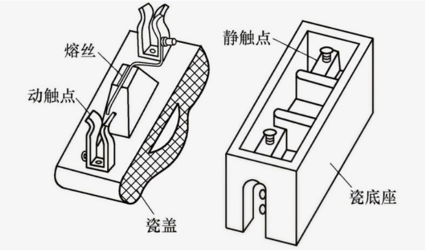                      |
| RL螺旋式熔断器     | 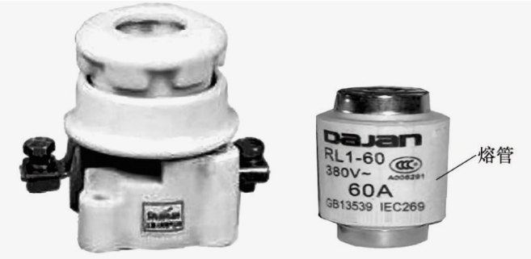                      |
| RM无填料封闭式熔断器  | 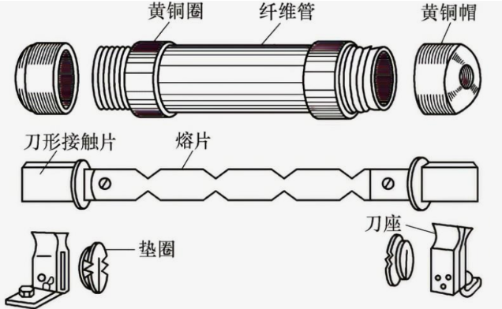                      |
| RS有填料快速熔断器   | 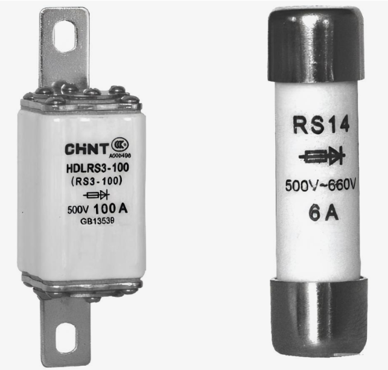                      |
| RT有填料封闭管式熔断器 | 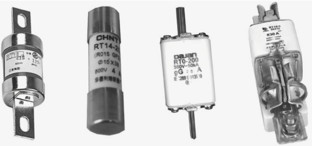 |

### 1.3 断路器

1. 作用：又称自动空气开关，既能对电路进行不频繁的通断控制，又能在电路出现过载、短路和欠电压（电压过低）时自动掉闸（自动气短电路）。它既是一个开关电器，又是一个保护电器。
2. 分类：塑料外壳式、框架式（万能式）

| 塑料外壳式    | 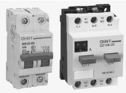                     |
| -------- | ----------------------------------------------- |
| 框架式（万能式） | 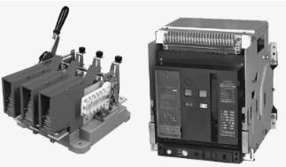 |

### 1.4 漏电保护器

1. 作用：具有断路器功能和漏电保护功能的电器。（绝缘性能下降，漏电电流很小，不足以使断路器跳闸）

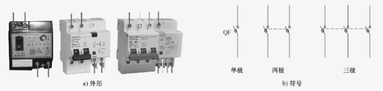

### 1.5 交流接触器

1. 作用：利用电磁、气动或液压原理，来控制内部出点频繁通断的电器，主要用于频繁接通和切断交、直流电路。
2. 分类：

	a. 按通过电流分：交流接触器、直流接触器
	b. 按操作方式分：电磁式接触器、气动式接触器、液压式接触器

	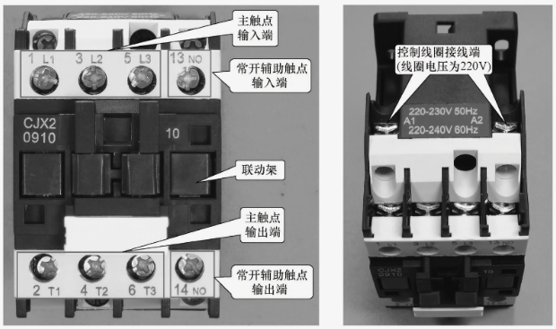

### 1.6 热继电器

1. 作用：利用电流通过发热元件时产生热量而使内部触电动作，用于保护电气设备发热保护，如电动机过载保护。

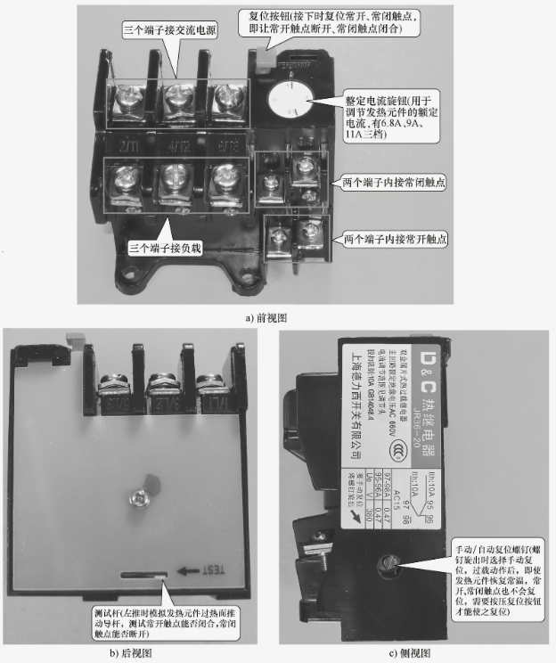

### 1.7 电磁继电器

1. 作用：利用线圈通过电流产生磁场，来吸合衔铁而使触电断开或接通。起保护和控制作用。
2. 分类：电流继电器、电压继电器、中间继电器

### 1.8 时间继电器

1. 作用：一种延时控制继电器，在得到动作信号后并不是立即让触电动作，而是延迟一段时间才让触电动作，主要用于各种控制系统和电动机的起动控制电路中。
2. 分类：通电延时性和断电延时性

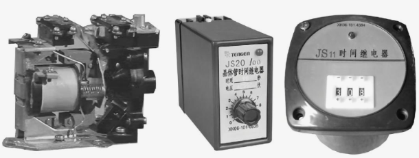

### 1.9 速度继电器与压力继电器

1. 作用：

	a. 速度继电器：一种当转速达到规定值时而产生动作的继电器。
		i. 在使用时通常与电动机的转轴连接在一起。
	b. 压力继电器：根据压力大小来决定触电的接通和断开。
		i. 常用语机械设备的液压或气压控制系统中，对设备提供保护或控制。

2. 分类：

| 速度继电器 | 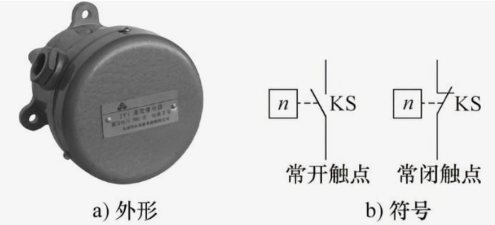                     |
| ----- | ----------------------------------------------- |
| 压力继电器 | 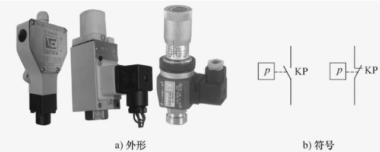 |

## 2. 电子元器件

### 2.1 电阻器

1. 作用
2. 分类：固定电阻器、电位器、敏感电阻器

| 固定电阻器 | 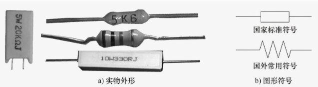| 降压、限流、分流、分压 |
| ----- | -------------- | ----------- |
| 电位器   | 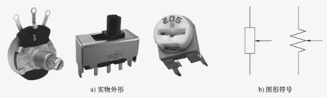|             |
| 敏感电阻器 | 1. 热敏电阻器：根据温度变化阻值发生变化： 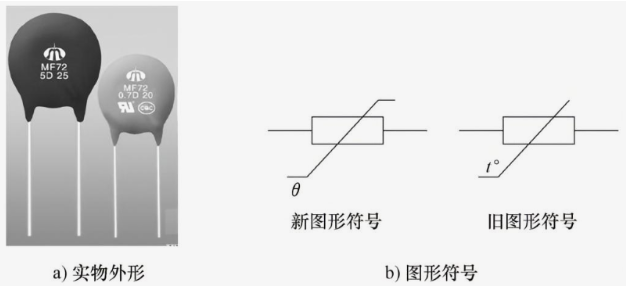 2. 光敏电阻器：根据照射的光线强弱变化阻值随之变化，通常光线越强，阻值越小。 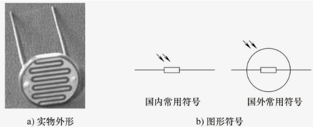 3. 压敏电阻器：两端电压低于标称电压时，阻值接近无穷大；两端电压高于标称电压时，阻值急剧变小。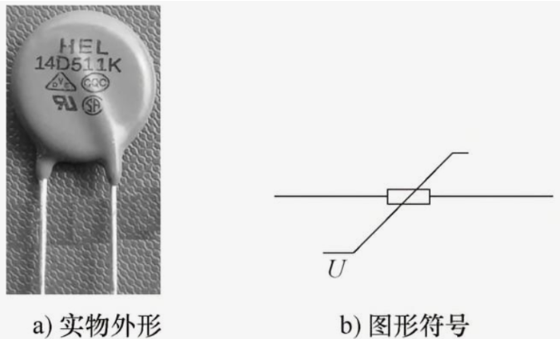 4. 湿敏电阻器：阻值随湿度变化而变化。 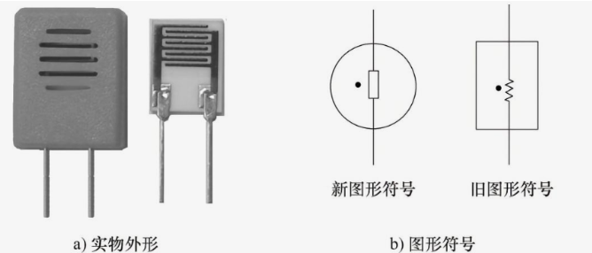 |             |

### 2.2 电感器

1. 作用：
2. 分类：空心电感器（无支架）、磁芯电感器（磁性材料支架）、铁芯电感器（硅钢片支架）

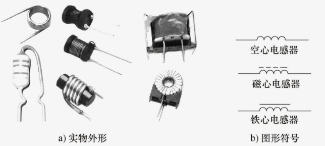

### 2.3 电容器

1. 作用：存储电荷。
2. 结构：相距很近且中间有绝缘截止（如空气、纸和陶瓷等）的两块导电电极板。
3. 分类：

	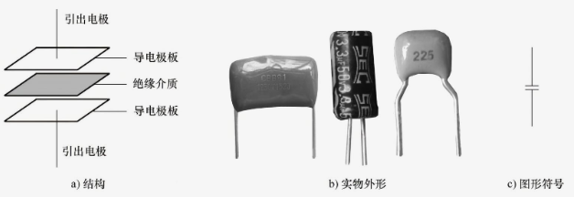

### 2.4 二极管

1. 作用：
2. 分类：

| x     | 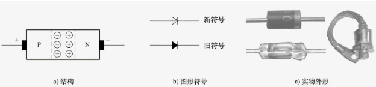                     |
| ----- | ----------------------------------------------- |
| 发光二极管 | 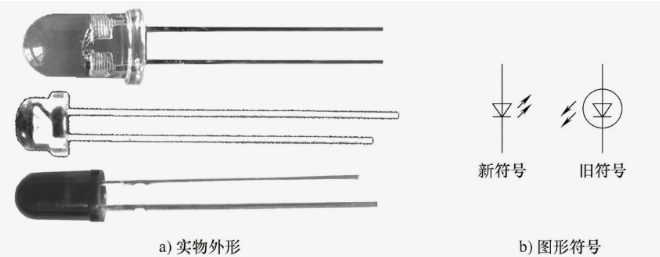                     |
| 稳压二极管 | 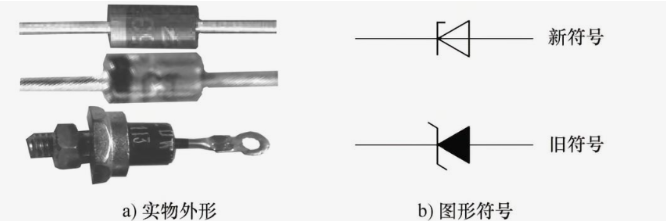 |

### 2.5 晶体管

1. 作用：又称三极管，具有放大功能？
2. 结构：PNP型、NPN型

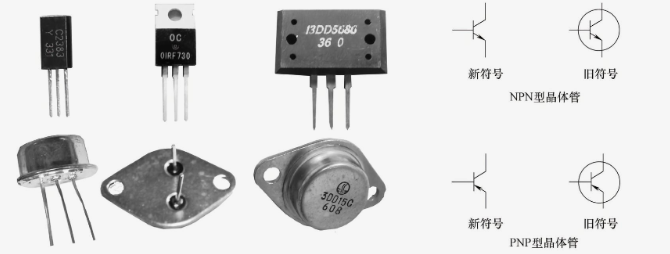

### 2.6 光电耦合器

1. 组成：将发光二极管和光电二极管组合在一起。

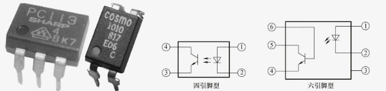

### 2.7 晶闸管

1. 又称可控硅。
2. 作用：充当电子开关。

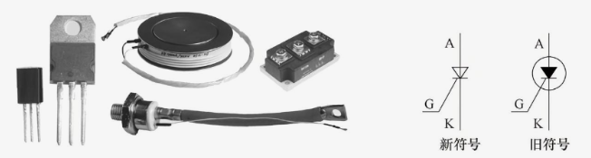

### 2.8 场效应管（IGBT）

1. 绝缘栅双极型晶体管的简称。
2. 是一种由场效应管和晶体管组合成的复合器件。
3. 综合了晶体管和MOS管的优点。

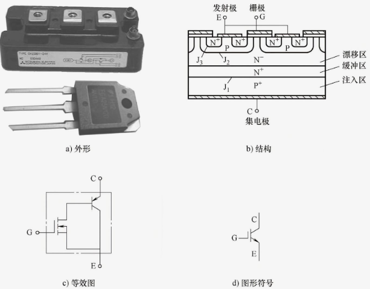

### 2.9 集成电路

1. 将电阻、二极管和晶体管等元器件以电路的形式制作在半导体硅片上，然后接出引脚并封装起来，就构成了集成电路（IC）
2. 集成电路简称集成块，又称芯片。
