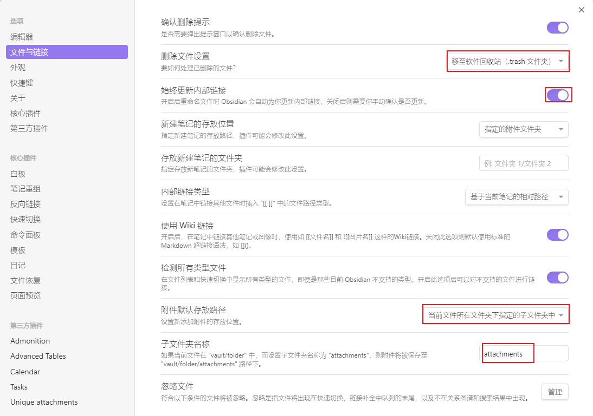
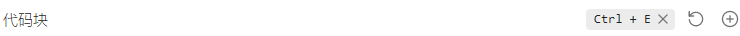
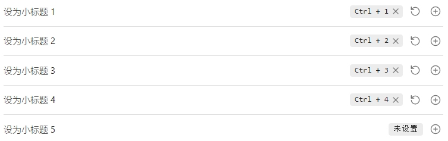
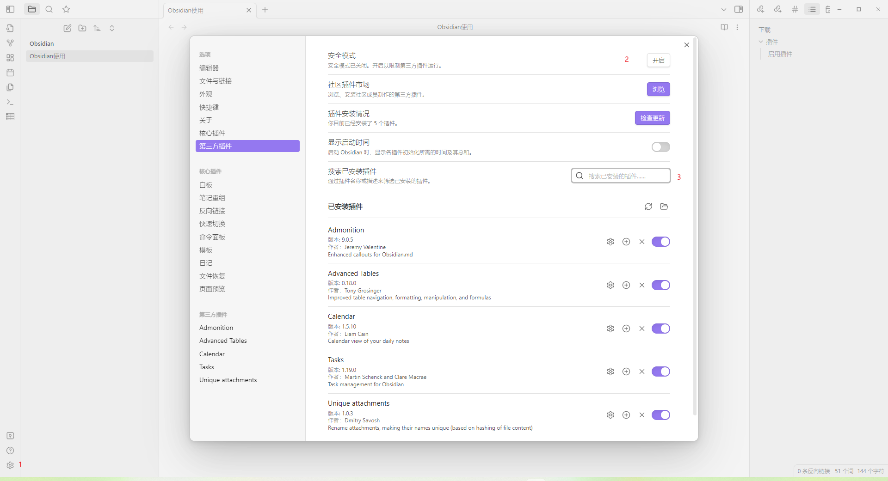
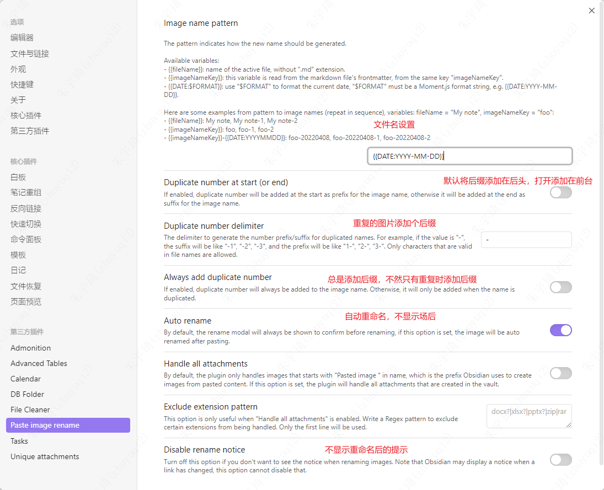

## 下载

官网链接至GitHub下载，下载速度慢。
网友分享的下载地址：[黑曜石Markdown笔记 Obsidian v1.1.16 中文免费版 (puresys.net)](https://www.puresys.net/6001.html)

## 设置

### 笔记管理设置

好的习惯：将图片等附件放到如`assets`，每个文件创建单独的文件夹。

### 快捷键设置

## 插件

### 下载插件

步骤：设置》 关闭安全模式 》搜索插件

### 启用插件

启用插件时遇到：`failed to load plugin`。原因为：从obsidian下载的插件文件不全。

网友分享的插件下载地址：[插件.md · 宏沉一笑/obsidian-plugin - Gitee.com](https://gitee.com/whghcyx/obsidian-plugin/blob/master/%E6%8F%92%E4%BB%B6.md)

目前使用的插件：

- Advanced Tables：改进了表导航，格式化，操纵和公式
- Calendar：日历查看每日笔记
- Admonition：非致警告块风格的黑曜石内容
- Tasks：黑曜石的任务管理
- Unique assets：重命名附件，使其名称唯一（基于文件内容的散列）
- File Cleaner：清理保险库中的空文件和未使用的附件。
- DB Folder：具有从文件夹(如数据库)存储和检索数据能力的文件夹。
- paste image Rename：粘贴图片重命名。

## OneNote导Obsidian

其本质为将OneNote导出为Markdown，然后由Obsidian打开。
工具地址：[GitHub - youkaichao/onenote-to-markdown: OneNote导出成Markdown文件的脚本](https://github.com/youkaichao/onenote-to-markdown)

## 复制图片重命名

obsidian粘贴的图片带空格，在编写笔记时插入为`%20`，在一些编辑器中打开时无法识别。使用第三方插件：

