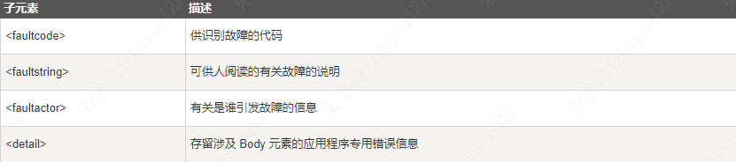
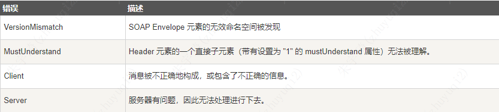

## 产生原因

之前应用程序通过使用远程过程调用（RPC）在诸如 DCOM 与 CORBA 等对象之间进行通信，但RPC会产生兼容性以及安全问题，防火墙和代理服务器通常会阻止此类流量。因此RPC主要用于内部系统之间的调用。RPC可以基于HTTP协议，也可以基于TCP协议。

HTTP基于HTTP协议，而且HTTP得到了所有因特网浏览器及服务器的支持。

WebService主要是异构系统（内部系统或外部系统）之间的通信，因此在HTTP之上，创造了SOAP协议。SOAP 方法指的是遵守 SOAP 编码规则的 HTTP 请求/响应。

HTTP 在 TCP/IP 之上进行通信。HTTP 客户机使用 TCP 连接到 HTTP 服务器。在建立连接之后，客户机可向服务器发送 HTTP 请求消息：

```text
POST /item HTTP/1.1
Host: 189.123.255.239
Content-Type: text/plain
Content-Length: 200
```

随后服务器会处理此请求，然后向客户机发送一个 HTTP 响应。此响应包含了可指示请求状态的状态代码：

```text
200 OK
Content-Type: text/plain
Content-Length: 200
```

SOAP 方法指的是遵守 SOAP 编码规则的 HTTP 请求/响应。

HTTP + XML = SOAP。SOAP 请求可能是 HTTP POST 或 HTTP GET 请求。HTTP POST 请求规定至少两个 HTTP 头：Content-Type 和 Content-Length。

- Content-Type：SOAP 的请求和响应的 Content-Type 头可定义消息的 MIME 类型，以及用于请求或响应的 XML 主体的字符编码（该部分可选）。
	- 语法：`Content-Type: MIMEType; charset=character-encoding`
- Content-Length：SOAP 的请求和响应的 Content-Length 头规定请求或响应主体的字节数。
	- 语法：`Content-Length: bytes`

## 语法

### SOAP 构建模块

一条 SOAP 消息就是一个普通的 XML 文档，包含下列元素：

- 必需的 Envelope 元素，可把此 XML 文档标识为一条 SOAP 消息
- 可选的 Header 元素，包含头部信息
- 必需的 Body 元素，包含所有的调用和响应信息
- 可选的 Fault 元素，提供有关在处理此消息所发生错误的信息

其基本结构如下：

```xml
<?xml version="1.0"?>  
<soap:Envelope  
xmlns:soap="http://www.w3.org/2001/12/soap-envelope"  
soap:encodingStyle="http://www.w3.org/2001/12/soap-encoding">  
  
<soap:Header>  
...  
</soap:Header>  
  
<soap:Body>  
...  
  <soap:Fault>  
  ...  
  </soap:Fault>  
</soap:Body>  
  
</soap:Envelope>
```

所有以上的元素均被声明于针对 SOAP 封装的默认命名空间中：[http://www.w3.org/2001/12/soap-envelope](http://www.w3.org/2001/12/soap-envelope "soap-envelope.xml")。该命名空间中默认 定义了三个属性：actor、 mustUnderstand 以及 encodingStyle，actor和mustUnderstand用于 SOAP 头部元素，定义容器如何对 SOAP 消息进行处理。encodingStyle可用于任何soap元素。

以及针对 SOAP 编码和数据类型的默认命名空间：[http://www.w3.org/2001/12/soap-encoding](http://www.w3.org/2001/12/soap-encoding "soap-encoding.xml")

### 语法规则

- SOAP 消息必须用 XML 来编码
- SOAP 消息必须使用 SOAP Envelope 命名空间
- SOAP 消息必须使用 SOAP Encoding 命名空间
- SOAP 消息不能包含 DTD 引用
- SOAP 消息不能包含 XML 处理指令

### SOAP Envelope 元素

```xml
<?xml version="1.0"?>
<soap:Envelope
xmlns:soap="http://www.w3.org/2001/12/soap-envelope"
soap:encodingStyle="http://www.w3.org/2001/12/soap-encoding">
  ...
  Message information goes here
  ...
</soap:Envelope>
```

- `soap:Envelope`是必需的，且必须为根元素。
- `xmlns:soap="http://www.w3.org/2001/12/soap-envelope"`声明了使用`http://www.w3.org/2001/12/soap-envelope`明明空间，命名空间前缀为`soap`。
	- 必须使用该命名空间，否则会程序报错，病抛弃此消息。
- `soap:encodingStyle="http://www.w3.org/2001/12/soap-encoding"`使用了`soap`命名空间的`encodingstyle`属性，用于定义在文档中使用的数据类型。
	- `soap`消息没有默认的编码方式，上一句指定了编码方式为`http://www.w3.org/2001/12/soap-encoding`

### SOAP Header 元素

```xml
<?xml version="1.0"?>  
<soap:Envelope  
xmlns:soap="http://www.w3.org/2001/12/soap-envelope"  
soap:encodingStyle="http://www.w3.org/2001/12/soap-encoding">  
  
<soap:Header>  
  <m:Trans xmlns:m="http://www.w3schools.com/transaction/"  
  soap:mustUnderstand="1">234  
  </m:Trans>  
</soap:Header>  
...  
...  
</soap:Envelope>
```

- 可选的 SOAP Header 元素可包含有关 SOAP 消息的应用程序专用信息（比如认证、支付等）。
- 如果 Header 元素存在，则必须是 Envelope 元素的第一个子元素。
- **注意：** 所有 Header 元素的直接子元素必须是合格的命名空间。
- 上面的例子包含了一个带有一个 "Trans" 元素的头部，它的值是 234，此元素的 "mustUnderstand" 属性的值是 "1"。
	- 同时使用了`http://www.w3schools.com/transaction/`命名空间，前缀为`m`。

- mustUnderstand属性：SOAP 的 mustUnderstand 属性可用于标识标题项对于要对其进行处理的接收者来说是强制的还是可选的。取值为0或1。1表示处理此头部的接收者必须认可此元素。无法认可此元素，则在处理此头部时必须失效。
- actor属性：SOAP 的 actor 属性可被用于将 Header 元素寻址到一个特定的端点。语法：`soap:actor="URI"`
- encodingStyle 属性：SOAP 的 encodingStyle 属性用于定义在文档中使用的数据类型。此属性可出现在任何 SOAP 元素中，并会被应用到元素的内容及元素的所有子元素上。SOAP 消息没有默认的编码方式。

### SOAP Body 元素

SOAP Body 元素的直接子元素可以是合格的命名空间。

```xml
<?xml version="1.0"?>  
<soap:Envelope  
xmlns:soap="http://www.w3.org/2001/12/soap-envelope"  
soap:encodingStyle="http://www.w3.org/2001/12/soap-encoding">  
  
<soap:Body>  
  <m:GetPrice xmlns:m="http://www.w3schools.com/prices">  
    <m:Item>Apples</m:Item>  
  </m:GetPrice>  
</soap:Body>  
  
</soap:Envelope>
```

上面的例子请求苹果的价格。请注意，上面的 m:GetPrice 和 Item 元素是应用程序专用的元素。它们并不是 SOAP 标准的一部分。

而一个 SOAP 响应应该类似这样：

```xml
<?xml version="1.0"?>  
<soap:Envelope  
xmlns:soap="http://www.w3.org/2001/12/soap-envelope"  
soap:encodingStyle="http://www.w3.org/2001/12/soap-encoding">  
  
<soap:Body>  
  <m:GetPriceResponse xmlns:m="http://www.w3schools.com/prices">  
    <m:Price>1.90</m:Price>  
  </m:GetPriceResponse>  
</soap:Body>  
  
</soap:Envelope>
```

请求与相应的命名空间相同、命名空间前缀相同，请求元素为`GetPrice`，则响应元素为`GetPriceResponse`。

#### SOAP Fault 元素

可选的 SOAP Fault 元素用于指示错误消息。如果已提供了 Fault 元素，则它必须是 Body 元素的子元素。在一条 SOAP 消息中，Fault 元素只能出现一次。

SOAP 的 Fault 元素拥有下列子元素：



faultcode取值为：



